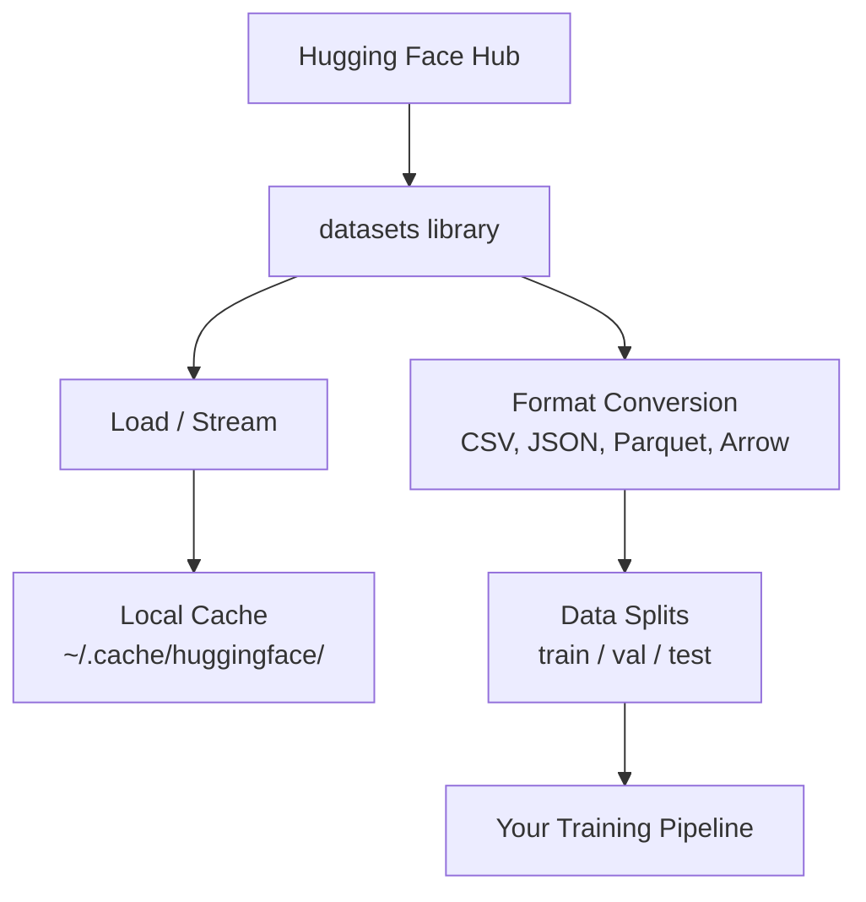

# 数据管理 数据管理

> 数据是燃料,你如何管理它,
> 数据是燃料. 你管理的方式决定了你能快速运行.

**Type:** Build | **类型:** 构建
**Language:**子**语言:**字符串
**Prerequisites:** Phase 0, Lesson 01 | **前置知识:** Phase 0, 第 01 课
**Time:** ~45 minutes | **时间:** ~45 分钟

## 学习目标

- 使用拥抱面孔的数据集,流,缓存`datasets`图书馆
  中文翻译:使用拥抱脸`datasets`库加载、流式处理和缓存数据集
- 转换CSV,JSON,Parquet和Arrow格式,并解释它们的交易
  中文翻译:在CSV、JSON、Parquet 和 Arrow 格式之间转换,并解释各自的优点
- 创建可复制的火车/验证/测试分区,使用固定的随机种子
  中文翻译:用固定随机种子创建可复现的训练/验证/测试集拆分
- 使用 管理大型模型和数据集文件`.gitignore`关键字:
  中文翻译:使用 `.gitignore`、Git LFS或DVC 管理大型模型和数据文件

> **【中文解读】**
> 数据是人工智能的燃料. 本章教你如何拥抱脸.`datasets`库加载,缓存,转换和拆分数据集.掌握数据管理是开始机器学习实验的前提.

## 问题 问题描述

每个人工智能项目都从数据开始.你需要找到数据集,下载它们,将它们转换成格式,将它们分为训练和评估,并将它们版本化,使实验可重复.每次手动完成这项工作都是缓慢的,容易犯错误的.你需要一个可重复的工作流程.

> 每个人工智能项目都从数据开始.你需要找到数据集,下载,转换格式,分为训练集和评估集,并进行版本管理以确保实验可复制.

> **【中文解读】**
> 每个人工智能项目都从数据开始.你需要下载数据集,转换格式,分开训练/验证/测试集,并管理版本以确保实验可复现.本章教你建立可复制的数据流.

> **【拓展：Hugging Face 在 AI 生态中的地位】**
> 拥抱面孔是人工智能领域的"GitHub",管理了数十万个数据集和预训模型.`datasets`库是像Pandas这样的加载和处理数据的标准工具,但专为AI优化,支持流式加载超大数据集.

## 概念的核心概念



拥抱的脸`datasets`库是人工智能工作中加载数据的标准方式. 它处理下载,缓存,格式转换和流出.

> 拥抱着脸`datasets`库是AI数据加载的标准方式. 它开箱即用地处理下载,缓存,形式转换和流式加载.

> **【中文解读】**
> 拥抱着脸`datasets`您不需要手动管理数据文件,库会帮助您完成所有底层工作.理解这一数据流线是所有AI实验的基础.

> **【拓展：数据格式对训练速度的影响】**
> 在实际人工智能工作中,数据格式直接影响了训练效率――帕克特格式比CSV小60-80%,读取速度快5-10倍――谷歌和Meta的内部训练管线全部使用帕克特/箭格式――一个100GB的CSV数据集后转换为帕克特可能只有20GB,并且加载时间从小时级下降到分钟级――

## 建立它,实现它.
```figure
s0-data-pipeline
```

## 建立它

### 步骤1:安装数据集库

```bash
pip install datasets huggingface_hub  # 安装 Hugging Face 数据集库和模型仓库工具
```

### 步骤 2: 装载数据集

```python
from datasets import load_dataset

dataset = load_dataset("imdb")  # 加载 IMDB 电影评论数据集（首次下载，之后从缓存读取）
dataset = load_dataset("stanfordnlp/imdb")
print(dataset)
print(dataset["train"][0])  # 查看训练集第一条样本
```

导航导航导航导航导航导航导航导航导航导航导航导航导航导航导航导航导航导航导航导航导航导航导航导航导航导航导航导航导航导航导航导航导航导航导航导航导航导航导航导航导航导航导航导航导航导航导航导航导航导航导航导航导航导航导航导航导航导航导航导航导航导航导航导航导航导航导航导航导航导航导航导航导航导航导航导航导航导航导航导航导航导航导航导航导航`~/.cache/huggingface/datasets/`现在,我们要去.

> 这将下载IMDB电影评论数据集.`~/.cache/huggingface/datasets/`缓存中加载

### 步骤3: 流动大型数据集

流媒体将它们排列一排,而没有下载完整的东西.

> 有些数据集太大,无法全部下载到磁盘.

```python
dataset = load_dataset("wikimedia/wikipedia", "20220301.en", split="train", streaming=True)  # 流式加载：不下载完整数据集

for i, example in enumerate(dataset):
    print(example["title"])  # 逐条处理，内存占用恒定
    if i >= 4:
        break
```

流媒体给你一个`IterableDataset`记忆使用不变,不管数据集的尺寸.

> 流式加载返回`IterableDataset`△你逐步处理到达的数据. 不管数据集多大,内存占用量保持恒定.

> **【拓展：流式加载在大模型训练中的应用】**
> 流式加载是训练大语言模型的关键技术――普通爬虫数据集约250TB,无法全部下载到本地――GPT-4的训练数据通过流式方式从分布式存储中加载,每秒处理数十万条文本――Hugging Face 的`streaming=True`参数让你使用相同的方式处理超大数据集,即使只有8GB内存的笔记本也可以处理结核病级数据.

### 步骤 4:数据集格式

其他`datasets`根据您的管道需要的,您可以将其转换到其他格式.

> `datasets`库底层使用Apache Arrow. 你可以根据管线需要转换为其他格式.

```python
dataset = load_dataset("stanfordnlp/imdb", split="train")

dataset.to_csv("imdb_train.csv")  # 导出为 CSV 格式（通用但体积大）
dataset.to_json("imdb_train.json")  # 导出为 JSON 格式（适合 API 交换）
dataset.to_parquet("imdb_train.parquet")  # 导出为 Parquet 格式（压缩率高、读取快）
```

格式比较:

> 格式对比:

| Format | Size | Read Speed | Best For |
|--------|------|-----------|----------|
| CSV | Large | Slow | Human readability, spreadsheets |
| JSON | Large | Slow | APIs, nested data |
| Parquet | Small | Fast | Analytics, columnar queries |
| Arrow | Small | Fastest | In-memory processing (what `datasets` uses internally) |

| 格式 | 体积 | 读取速度 | 最适合 |
|------|------|---------|--------|
| CSV | 大 | 慢 | 人类阅读、电子表格 |
| JSON | 大 | 慢 | API、嵌套数据 |
| Parquet | 小 | 快 | 分析查询、列式存储 |
| Arrow | 小 | 最快 | 内存中处理（datasets 库内部使用） |

对于人工智能工作,Parquet是最好的存储格式.箭头是你在内存中使用的.CSV和JSON是交换的.

> 对于人工智能工作,Parquet是最佳存储格式.

### 步骤5:数据分开

> **【中文解读】**
> 数据分离是机器学习的基本原则――训练集用于学习,验证集用于调整,测试集用于最终评估――三者必须相互不重叠,否则会导致"数据泄漏"模型表现虚高但实际无用――始终使用固定种子保证可复现――

每个ML项目都需要三个分区:

> 每个ML项目都需要三个分区:

- **Train**模型从此学习 (通常是80%).
  翻译: 中文**训练集**模型从这里学习 (通常是80%).
- **Validation**您在培训期间检查进展 (通常是10%).
  翻译: 中文**验证集**训练过程中检查进度通常是10%
- **Test**毕业后的最终评估 (通常是10%)
  翻译: 中文**测试集**训练完成后的最终评估 (通常是10%)

某些数据集是预分的,如果没有,你自己分开它们:

> 如果没有,你需要自己分开:

```python
dataset = load_dataset("stanfordnlp/imdb", split="train")

split = dataset.train_test_split(test_size=0.2, seed=42)  # 80% 训练+验证，20% 测试
train_val = split["train"].train_test_split(test_size=0.125, seed=42)  # 从 80% 中取 12.5% 作为验证集

train_ds = train_val["train"]  # 最终：70% 训练集
val_ds = train_val["test"]  # 最终：10% 验证集
test_ds = split["test"]  # 最终：20% 测试集

print(f"Train: {len(train_ds)}, Val: {len(val_ds)}, Test: {len(test_ds)}")
```

总是设定一个种子,以确保可复制性.

> 必须设置种子以确保可复制性.

### 步骤 6: 下载和缓存模型

模型是大型文件.`huggingface_hub`图书馆处理下载和缓存.

> 模型是大文件.`huggingface_hub`库负责下载和缓存

```python
from huggingface_hub import hf_hub_download, snapshot_download

model_path = hf_hub_download(  # 下载单个文件
    repo_id="sentence-transformers/all-MiniLM-L6-v2",
    filename="config.json"
)
print(f"Cached at: {model_path}")

model_dir = snapshot_download("sentence-transformers/all-MiniLM-L6-v2")  # 下载整个模型仓库
print(f"Full model at: {model_dir}")
```

> **【拓展：模型缓存机制】**
> 拥抱脸的缓存机制非常聪明:模型下载后存储在`~/.cache/huggingface/hub/`后续加载直接读取本地缓存――一个常见的LLM如Llama-2-7B约14GB,第一次下载需要几分钟,后第二次加载――在企业级场景中,一个团队共享的模型缓存可以节省数百GB的重复下载――

模特缓存到`~/.cache/huggingface/hub/`一旦下载,它们会立即上传.

> 模型缓存到`~/.cache/huggingface/hub/`◎ 下载一次后,后续运行第二级加载──

### 步骤 7:处理大型文件

> **【中文解读】**
> 模型文件动数 GB(GPT-2 约500MB,Llama-2-70B 约140GB),不能使用普通 Git 管理──三种方案各有适用场景:`.gitignore`最简单的(忽略大文件),Git LFS 适合团队共享模型权重,DVC 适合严格复现的实验.

模型重量和大型数据集不应进入 git.

> 模型权重和大型数据集不应放入 Git──三种选择:

**Option A: .gitignore (simplest)**

> **选项 A：.gitignore（最简单）**

```
*.bin
*.safetensors
*.pt
*.onnx
data/*.parquet
data/*.csv
models/
```

**Option B: Git LFS (track large files in git)**

> **选项 B：Git LFS（在 git 中追踪大文件）**

```bash
git lfs install
git lfs track "*.bin"
git lfs track "*.safetensors"
git add .gitattributes
```

基特LFS存储在您的备忘录中指针和实际文件在单独的服务器上.GitHub为您提供1GB免费.

> 在GitHub提供1GB的免费空间.

**Option C: DVC (data version control)**

> **选项 C：DVC（数据版本控制）**

```bash
pip install dvc
dvc init
dvc add data/training_set.parquet
git add data/training_set.parquet.dvc data/.gitignore
git commit -m "Track training data with DVC"
```

化品制造小`.dvc`数据本身存储在S3,GCS或其他远程存储后端.

> 创建小的`.dvc`文件指向你的数据. 数据本身存储在S3、GCS或其他远程存储后端.

> **【拓展：工业级数据版本管理】**
> 在谷歌和Meta等大厂,数据版本管理比代码版本管理更复杂.一个推系统实验可能涉及数十个数据集,数十亿个样本.DVC是开源解决方案,企业常用数据,权重和偏差 (W&B) 或Neptune.ai来追踪数据,模型和实验. 这些工具可以记录每次实验使用的精确数据快照,确保结果复制.

| Approach | Complexity | Best For |
|----------|-----------|----------|
| .gitignore | Low | Personal projects, downloaded data you can re-fetch |
| Git LFS | Medium | Teams sharing model weights via git |
| DVC | High | Reproducible experiments, large datasets, teams |

| 方案 | 复杂度 | 最适合 |
|------|--------|--------|
| .gitignore | 低 | 个人项目、可重新下载的数据 |
| Git LFS | 中 | 通过 git 共享模型权重的团队 |
| DVC | 高 | 需要严格复现的实验、大数据集、团队协作 |

为了这门课程,`.gitignore`需要在机器上复制精确的实验时使用DVC.

> 本课程使用`.gitignore`现在就够了.当你需要跨机器精确复现实实验时再使用DVC.

### 步骤 8: 存储模式

> **【中文解读】**
> 当数据集更大或需要在多台机器间共享时,需要使用云存储器 (S3、GCS) ――DVC可以直接与云存储集成,实现数据版本管理――

**Local storage**对于10GB以下的数据集来说,HF缓存将自动处理.

> **本地存储**适用于以下 10 GB 的数据集──HF 缓存自动处理──

**Cloud storage**适用于任何更大或在机器之间共享的东西:

> **云存储**需要跨机器共享的情况:

```python
import os

local_path = os.path.expanduser("~/.cache/huggingface/datasets/")

# s3_path = "s3://my-bucket/datasets/"
# gcs_path = "gs://my-bucket/datasets/"
```

体与S3和GCS直接集成:

> 直接与S3和GCS集成:

```bash
dvc remote add -d myremote s3://my-bucket/dvc-store
dvc push
```

云存储是当你调整远程GPU实例时变得相关的.

> 在本课程中,本地存储量足够了.

## 在本课程中使用的数据集

| Dataset | Lessons | Size | What It Teaches |
|---------|---------|------|----------------|
| IMDB | Tokenization, classification | 84 MB | Text classification basics |
| WikiText | Language modeling | 181 MB | Next-token prediction |
| SQuAD | QA systems | 35 MB | Question answering, spans |
| Common Crawl (subset) | Embeddings | Varies | Large-scale text processing |
| MNIST | Vision basics | 21 MB | Image classification fundamentals |
| COCO (subset) | Multimodal | Varies | Image-text pairs |

| 数据集 | 涉及课程 | 体积 | 教你什么 |
|--------|---------|------|---------|
| IMDB | 分词、分类 | 84 MB | 文本分类基础 |
| WikiText | 语言建模 | 181 MB | 下一个 token 预测 |
| SQuAD | 问答系统 | 35 MB | 问答与区间选择 |
| Common Crawl（子集） | 嵌入 | 不定 | 大规模文本处理 |
| MNIST | 视觉基础 | 21 MB | 图像分类入门 |
| COCO（子集） | 多模态 | 不定 | 图像-文本对 |

现在不必下载所有这些,每一堂课都说明了需要的内容.

> 你不需要现在下载所有这些数据集. 每个节目都会说明它需要什么.

## 用它实现框架

> **【中文解读】**
> 实践环节:运行`data_utils.py`验证所有数据管理功能正常工作. 本书将自动下载一个小数据集,做格式转换,分开训练/验证/测试集,并打印摘要信息.

运行实用程序脚本来验证一切工作:

> 运行工具脚本验证一切正常:

```bash
python code/data_utils.py
```

这将下载一个小数据集,转换它,分开它,

> 这将下载一个小数据集,转换格式,拆分,并打印摘要.

## 运送它.

这一课产生了:
- `code/data_utils.py`- 可重复使用的数据加载和缓存工具
- `outputs/prompt-data-helper.md`- 提示找到合适的数据集

> 本课产出:
> - `code/data_utils.py`- 可重复使用的数据加载和缓存工具
> - `outputs/prompt-data-helper.md`- 用于查找合适的数据集的提示

## 练习题

1. 装载`glue`数据集`mrpc`配置和检查前5个例子
   载载`glue`数据集`mrpc`配置,查看前 5 条数据
2. 播放`c4`数据集,并计算在10秒内可以处理多少个例子
   流式加载`c4`数据集,统计 10 秒内能处理多少条数据
3. 将数据集转换为Parquet,并将文件大小进行比较为CSV
   将数据集转换为Parkett格式,与CSV文件大小相比
4. 创建一个70/15/15火车/值/测试分区,使用固定种子,并验证尺寸
   用固定随机种子创建 70/15/15 的训练/验证/测试集 分分,验证比例

## 关键词 关键词

| Term | What people say | What it actually means |
|------|----------------|----------------------|
| Dataset split | "Training data" | A named subset (train/val/test) used at different stages of the ML lifecycle |
| Streaming | "Load it lazily" | Processing data row by row from a remote source without downloading the full dataset |
| Parquet | "Compressed CSV" | A columnar file format optimized for analytical queries and storage efficiency |
| Arrow | "Fast dataframe" | An in-memory columnar format used internally by the datasets library for zero-copy reads |
| Git LFS | "Git for big files" | An extension that stores large files outside the git repo while keeping pointers in version control |
| DVC | "Git for data" | A version control system for datasets and models that integrates with cloud storage |
| Cache | "Already downloaded" | A local copy of previously fetched data, stored at ~/.cache/huggingface/ by default |

| 术语 | 俗称 | 实际含义 |
|------|------|---------|
| Dataset split | "训练数据" | 数据集的命名子集（训练/验证/测试），用于 ML 生命周期的不同阶段 |
| Streaming | "懒加载" | 逐行处理远程数据，不下载完整数据集 |
| Parquet | "压缩 CSV" | 为分析查询和存储效率优化的列式文件格式 |
| Arrow | "快速数据帧" | datasets 库内部使用的内存列式格式，支持零拷贝读取 |
| Git LFS | "大文件 Git" | 将大文件存储在 git 仓库之外的扩展 |
| DVC | "数据版控" | 数据集和模型的版本控制系统，集成云存储 |
| Cache | "已下载" | 默认存储在 ~/.cache/huggingface/ 的本地缓存 |
