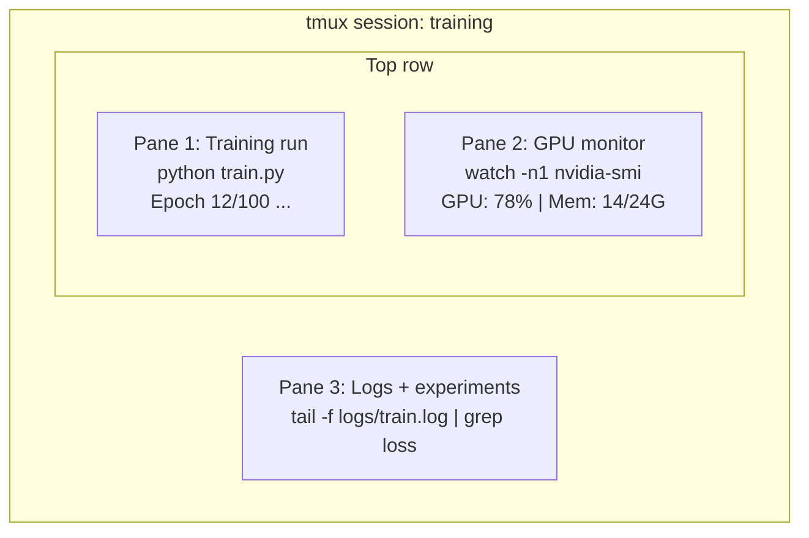

# 终端和牌

> 终端是人工智能工程师居住的地方.
> 终端是人工智能工程师的家.

**Type:** Learn | **类型:** 学习
**Languages:** -- | **语言:** 无
**Prerequisites:** Phase 0, Lesson 01 | **前置知识:** Phase 0, 第 01 课
**Time:** ~35 minutes | **时间:** ~35 分钟

## 学习目标

- 使用管道,转向,`grep`从命令行过和处理训练日志
  中文翻译:使用管道、重定向和 `grep`从命令行过和处理训练日志
- 创建多个面板的持续tmux会议,同时进行训练和GPU监控
  中文翻译:创建带多面板的持久tmux 会话,用于同时训练和监控GPU
- 监控系统和GPU资源`htop`现在`nvtop`其他`nvidia-smi`
  中文翻译:使用 `htop`,我知道.`nvtop`和 `nvidia-smi`监控系统和GPU资源
- 通过SSH将本地和远程机器之间的文件转移,`scp`其他`rsync`
  中文翻译:使用SSH、`scp`和 `rsync`在本地和远程机器间传输文件

> **【中文解读】**
> 终端是AI工程师最常用的工具――训练模型、监控GPU、查看日志、远程连接全部在终端完成──本章教你终端操作的核心技能:管道、tmux 会话、GPU 监控和文件传输──

## 问题 问题描述

你将在终端里花更多的时间,比任何编辑器. 训练运行,GPU监控,日志追踪,远程SSH会议,环境管理. 每个人工智能工作流都触及了贝. 如果你在这里慢,你在任何地方都会慢.

> 你在终端中度过的时间比任何编辑器都多了――训练运行,GPU监控,日志追踪,远程SSH会话,环境管理――每个AI工作流都离不开.如果你在这里慢,你在所有地方都慢――

这堂课涵盖人工智能工作所需的终端技能. 没有Unix的历史. 没有深入的Bash脚本.

> 本课只讲人工智能工作中真正需要的终端技能――不讲Unix历史,不深入Bash脚本编程――只讲你需要的――

> **【中文解读】**
> AI工程师在终端时间比任何编辑器都多了――训练模型,监控GPU、远程SSH都依赖于终端技能――本章只教了人工智能工作中真正需要的终端技巧――

## 概念的核心概念



连接三件事,一个终端,你可以脱离,回家,再回 SSH,再连接.

> 三任务同时运行,一个终端窗口――你可以分离会话、回家、重新 SSH 连接后再恢复会话――训练持续运行――

> **【中文解读】**
> 终端复用是AI工程师的核心技能. 上图展示了一个典型的 tmux 会话:一个面板跑训练,一个面板监控GPU,一个面板查看日志.

> **【拓展：tmux 在 GPU 训练中的重要性】**
> 在 AWS p4d 实例中(8x A100 GPU,约32.77/小时) 上训练LLM,如果由于笔记本关闭导致训练中断,不仅浪费完成的所有计算,还需要从头重新训练――使用tmux可以让训练在后台持续运行几天甚至几周――OpenAI 训练GPT-4使用数千个GPU运行数月,tmux/屏幕是这种长时间任务的必需工具――

## 建立它,实现它.
```figure
s0-shell-pipeline
```

## 建立它

### 步骤1:了解你的

检查你运行的炮弹:

> 检查你正在使用哪个:

```bash
echo $SHELL
```

大多数系统使用`bash`或`zsh`两者都很好,这门课程中的命令都很好.

> 大多数系统使用`bash`或`zsh`△两者都适用.

重要的事情:

> 关键知识:

```bash
# Move around
cd ~/projects/ai-engineering-from-scratch
pwd
ls -la

# History search (most useful shortcut you'll learn)
# Ctrl+R then type part of a previous command
# Press Ctrl+R again to cycle through matches

# Clear terminal
clear   # or Ctrl+L

# Cancel a running command
# Ctrl+C

# Suspend a running command (resume with fg)
# Ctrl+Z
```

### 步骤2:管道和转向

管道将命令连接在一起. 这就是你处理日志,过输出和链工具的方式.

> 管道将命令连接在一起. 这就是你处理日志的方法.

> **【中文解读】**
> 管道 (管道) 是Unix哲学的核心:每个工具只做一个事情,通过管道串联完成复杂任务.`cat train.log | grep "loss" | wc -l`这条命令的含义是:读取日志 → 过含"损失"的行 → 统计行数――重定向`>`,我知道.`>>`,我知道.`2>`控制输出到文件或屏幕. 这些都是人工智能工程师每天必需的操作.

```bash
# Count how many times "loss" appears in a log  统计日志中 "loss" 出现的次数
cat train.log | grep "loss" | wc -l

# Extract just the loss values from training output  提取训练输出中的 loss 值
grep "loss:" train.log | awk '{print $NF}' > losses.txt

# Watch a log file update in real time, filtering for errors  实时过滤错误日志
tail -f train.log | grep --line-buffered "ERROR"

# Sort experiments by final accuracy  按最终准确率排序实验结果
grep "final_accuracy" results/*.log | sort -t= -k2 -n -r

# Redirect stdout and stderr to separate files  分别重定向标准输出和标准错误
python train.py > output.log 2> errors.log

# Redirect both to the same file  将所有输出合并到同一文件
python train.py > train_full.log 2>&1
```

你需要的三个转向:

> 你需要掌握的三种重定向:

| Symbol | What it does |
|--------|-------------|
| `>` | Write stdout to file (overwrite) |
| `>>` | Append stdout to file |
| `2>` | Write stderr to file |
| `2>&1` | Send stderr to same place as stdout |
| `\|` | Send stdout of one command as stdin to the next |

| 符号 | 作用 |
|------|------|
| `>` | 将标准输出写入文件（覆盖） |
| `>>` | 将标准输出追加到文件 |
| `2>` | 将标准错误写入文件 |
| `2>&1` | 将标准错误合并到标准输出 |
| `\|` | 将一个命令的输出传给下一个命令 |

### 步骤3:背景过程

训练需要几个小时,你不想一直保持终端开放.

> 训练运行需要几个小时.

```bash
# Run in background (output still goes to terminal)
python train.py &

# Run in background, immune to hangup (closing terminal won't kill it)
nohup python train.py > train.log 2>&1 &

# Check what's running in background
jobs
ps aux | grep train.py

# Bring a background job to foreground
fg %1

# Kill a background process
kill %1
# or find its PID and kill that
kill $(pgrep -f "train.py")
```

之间的区别`&`现在`nohup`其他`screen`现在,我们要去.`tmux`其他:

> `&`,我知道.`nohup`和 `screen`现在,我们要去.`tmux`的区别:

| Method | Survives terminal close? | Can reattach? |
|--------|-------------------------|---------------|
| `command &` | No | No |
| `nohup command &` | Yes | No (check log file) |
| `screen` / `tmux` | Yes | Yes |

| 方式 | 关闭终端后存活？ | 可重新连接？ |
|------|---------------|-------------|
| `command &` | 否 | 否 |
| `nohup command &` | 是 | 否（查看日志文件） |
| `screen` / `tmux` | 是 | 是 |

任何超过几分钟的时间,使用tmux.

> 对于超过几分钟的任务,使用tmux.

### 步骤4:

通过 tmux,您可以创建多个面板的持续终端会议.

> 让你创建多面板的持久终端会话.

> **【中文解读】**
> tmux 是终端复用器,能创建多面板 (面板) 和多窗口 (窗口),断开SSH 后会话仍然在后台运行.

```bash
# Install
# macOS
brew install tmux
# Ubuntu
sudo apt install tmux

# Start a named session
tmux new -s training

# Split horizontally
# Ctrl+B then "

# Split vertically
# Ctrl+B then %

# Navigate between panes
# Ctrl+B then arrow keys

# Detach (session keeps running)
# Ctrl+B then d

# Reattach
tmux attach -t training

# List sessions
tmux ls

# Kill a session
tmux kill-session -t training
```

典型的人工智能工作流程:

> 典型的人工智能工作流会话:

```bash
tmux new -s train

# Pane 1: start training
python train.py --epochs 100 --lr 1e-4

# Ctrl+B, " to split, then run GPU monitor
watch -n1 nvidia-smi

# Ctrl+B, % to split vertically, tail the logs
tail -f logs/experiment.log

# Now detach with Ctrl+B, d
# SSH out, go get coffee, come back
# tmux attach -t train
```

### 步骤5:使用 htop 和 nvtop 监测

```bash
# System processes (better than top)  系统进程监控（比 top 更好用）
htop

# GPU processes (if you have NVIDIA GPU)  GPU 进程监控
# Install: sudo apt install nvtop (Ubuntu) or brew install nvtop (macOS)
nvtop

# Quick GPU check without nvtop  快速查看 GPU 状态
nvidia-smi

# Watch GPU usage update every second  每秒刷新 GPU 使用情况
watch -n1 nvidia-smi

# See which processes are using the GPU  查看占用 GPU 的进程
nvidia-smi --query-compute-apps=pid,name,used_memory --format=csv
```

> **【拓展：GPU 监控在实际训练中的价值】**
> 在多GPU训练中,GPU使用率低于80%通常意味着数据加载是瓶(GPU在等数据中) 通过.`nvidia-smi`可以快速发现:显存不足 (OOM) 、GPU利用率低 (数据瓶) 、温度过高 (散热问题) ⋅nvidia-smi 的 `--query-compute-apps`参数能精确找到哪个进程占据了GPU显存储,这在共享服务器上非常重要.

`htop`您将使用的键链:

> `htop`常用快捷键:

- `F6`或`>`按列排序 (按内存排序以查找内存泄漏)
  翻译: 中文`F6`或`>`按列排序(按内存排序找到内存泄漏)
- `F5`切换树视图 (见儿童过程)
  翻译: 中文`F5`切换树形视图(查看子进程)
- `F9`杀死一个过程
  翻译: 中文`F9`终止进程
- `/`搜索过程名称
  翻译: 中文`/`搜索进程名

### 步骤 6:远程GPU盒的SSH

当你租用云GPU (Lambda, RunPod,Vast.ai) 时,你通过SSH连接.

> 当你租用云GPU时,通过SSH连接.

```bash
# Basic connection  基本 SSH 连接
ssh user@gpu-box-ip

# With a specific key  使用指定密钥连接
ssh -i ~/.ssh/my_gpu_key user@gpu-box-ip

# Copy files to remote  复制文件到远程服务器
scp model.pt user@gpu-box-ip:~/models/

# Copy files from remote  从远程服务器复制文件
scp user@gpu-box-ip:~/results/metrics.json ./

# Sync a whole directory (faster for many files)  同步整个目录（比 scp 更快）
rsync -avz ./data/ user@gpu-box-ip:~/data/

# Port forward (access remote Jupyter/TensorBoard locally)  端口转发（本地访问远程服务）
ssh -L 8888:localhost:8888 user@gpu-box-ip
# Now open localhost:8888 in your browser
```

# 为了方便,SSH配置
# 加入到 ~/.ssh/config:
# 东道人
#     服务器名称 192.168.1.100
#     用户 ubuntu
#     身份文件 ~/.ssh/gpu_key
没有什么可做
# 然后,我们就说:
# 鱼
```

### Step 7: Useful aliases for AI work

> **【中文解读】**
> Shell 别名（alias）是将常用长命令缩短为短命令的方式。AI 工程中，`gpu` 查看 GPU 状态、`killtraining` 终止所有训练进程、`watchloss` 实时监控 loss——这些别名每天要用几十次。将它们加入 `~/.bashrc` 或 `~/.zshrc` 后，每次打开终端自动生效。

Add these to your `~/.bashrc` or `~/.zshrc`:

> 将这些添加到你的 `~/.bashrc` 或 `~/.zshrc`：

```bash
源阶段/00-设置和工具/10-终端和/代码/_aliases.sh
```

Or copy the ones you want. The key aliases:

> 或者复制你想要的。关键别名：

```bash
# 一眼看的GPU状态 一行查看GPU状态
其他类型: 标签: 标签: 标签: 标签: 标签: 标签: 标签: 标签: 标签: 标签: 标签: 标签: 标签: 标签: 标签: 标签: 标签: 标签: 标签: 标签: 标签: 标签: 标签: 标签: 标签: 标签: 标签: 标签: 标签: 标签: 标签: 标签: 标签: 标签: 标签: 标签: 标签: 标签: 标签: 标签: 标签: 标签: 标签: 标签: 标签: 标签: 标签: 标签: 标签: 标签: 标签: 标签: 标签: 标签: 标签: 标签: 标签: 标签: 标签: 标签: 标签: 标签: 标签

# 关掉所有Python训练过程
鱼鱼鱼鱼鱼鱼鱼鱼鱼鱼鱼鱼鱼鱼鱼鱼鱼鱼鱼鱼鱼鱼鱼鱼鱼鱼鱼鱼鱼鱼鱼鱼鱼鱼鱼鱼鱼鱼鱼鱼鱼鱼鱼鱼鱼鱼鱼鱼鱼鱼鱼鱼鱼鱼鱼鱼鱼鱼鱼鱼鱼鱼鱼鱼鱼鱼鱼鱼鱼鱼鱼鱼鱼鱼鱼鱼鱼鱼鱼鱼鱼鱼鱼鱼鱼鱼鱼鱼鱼鱼鱼鱼鱼鱼鱼鱼鱼鱼鱼鱼鱼鱼鱼鱼鱼鱼鱼鱼鱼

# 快速激活虚拟环境
其他类型的类型:

# 监控训练损失实时监控训练损失
尾 -f日志/*.日志.
```

See `code/shell_aliases.sh` for the full set.

> 完整的别名列表参见 `code/shell_aliases.sh`。

> **【拓展：管道与重定向在 AI 日志分析中的威力】**
> 在 Google Brain 和 DeepMind，研究员用管道链处理实验日志：`grep "loss" train.log | awk '{print $3}' | sort -n | head -5` 可以在一秒内从百万行日志中找出 loss 最低的 5 个 epoch。这种技能不依赖任何 IDE 或 GUI 工具，在远程 GPU 服务器上尤其有用——那里只有终端可用。

### Step 8: Common AI terminal patterns

These come up repeatedly in practice:

> 这些模式在实践中反复出现：

> **【中文解读】**
> 这些是 AI 工程中反复出现的终端模式：用 `tee` 同时输出到终端和日志文件、用 `diff` 对比实验结果、用 `find` 找到最大的模型文件清理磁盘、用 `tar` 解压数据集。掌握这些命令组合能大幅提升日常效率。

```bash
# 进行训练,记录一切,通知你完成时
鱼火车.py 2>&1 网页;回声"完成"

# 两项实验日志相对
差异 <(grep "精度" exp1.log) <(grep "精度" exp2.log)

# 找最大的模型文件 (清理磁盘空间)
找. -名字"*pt" -o-名字"*.安全感应器"

# 下载来自"拥抱脸"的模型
https://huggingface.co/model/resolve/main/model.safetensors

# 拆除数据集
 xzf数据集.tar.gz -C./数据/

# 在所有Python文件中数行 (看看你的项目是多大)
找个. - 姓名""

# 检查磁盘空间 (训练数据快速填充磁盘)
子
其他 信息

# 培训前对环境变量进行检查
,我抓住了奇怪的东西.
,我抓住了火
```

## Use It | 用框架实现

Here's when each tool comes into play during this course:

> 以下是每个工具在本课程中的使用场景：

| Tool | When you use it |
|------|----------------|
| tmux | Every training run (Phases 3+) |
| `tail -f` + `grep` | Monitoring training logs |
| `nohup` / `&` | Quick background tasks |
| `htop` / `nvtop` | Debugging slow training, OOM errors |
| SSH + `rsync` | Working on cloud GPUs |
| Piping + redirects | Processing experiment results |
| Aliases | Saving time on repetitive commands |

| 工具 | 使用场景 |
|------|---------|
| tmux | 所有训练任务（Phase 3+） |
| `tail -f` + `grep` | 监控训练日志 |
| `nohup` / `&` | 快速后台任务 |
| `htop` / `nvtop` | 排查训练慢、OOM 错误 |
| SSH + `rsync` | 云 GPU 工作 |
| 管道 + 重定向 | 处理实验结果 |
| 别名 | 节省重复命令时间 |

> **【拓展：AI 工程师的终端工作流】**
> 一个高效的 AI 工程师通常同时维护 2-3 个 tmux 会话：一个用于训练（长时间运行）、一个用于数据处理和调试、一个用于监控。SSH config 文件可以简化连接——配置好后只需 `ssh gpu` 就能连上远程服务器。rsync 是传输大数据集的最佳选择，它只传输变化的字节，支持断点续传，比 scp 快 10 倍以上。

## Exercises | 练习题

1. Install tmux, create a session with three panes, and run `htop` in one, `watch -n1 date` in another, and a Python script in the third. Detach and reattach.
   安装 tmux，创建包含三个面板的会话，分别运行 htop、定时命令和 Python 脚本，然后分离并重新连接。
2. Add the aliases from `code/shell_aliases.sh` to your shell config and reload with `source ~/.zshrc` (or `~/.bashrc`).
   将 `code/shell_aliases.sh` 中的别名添加到你的 shell 配置中并重载。
3. Create a fake training log with `for i in $(seq 1 100); do echo "epoch $i loss: $(echo "scale=4; 1/$i" | bc)"; sleep 0.1; done > fake_train.log` and then use `grep`, `tail`, and `awk` to extract just the loss values.
   创建模拟训练日志，用 `grep`、`tail` 和 `awk` 提取 loss 值。
4. Set up an SSH config entry for a server you have access to (or use `localhost` to practice the syntax).
   为你有权限的服务器设置 SSH config 条目。

## Key Terms | 关键术语

| Term | What people say | What it actually means |
|------|----------------|----------------------|
| Shell | "The terminal" | The program that interprets your commands (bash, zsh, fish) |
| tmux | "Terminal multiplexer" | A program that lets you run multiple terminal sessions inside one window, and detach/reattach |
| Pipe | "The bar thing" | The `\|` operator that sends one command's output as input to another |
| PID | "Process ID" | A unique number assigned to every running process, used to monitor or kill it |
| nohup | "No hangup" | Runs a command immune to the hangup signal, so closing the terminal won't kill it |
| SSH | "Connecting to the server" | Secure Shell, an encrypted protocol for running commands on a remote machine |

| 术语 | 俗称 | 实际含义 |
|------|------|---------|
| Shell | "终端" | 解释执行命令的程序（bash、zsh、fish） |
| tmux | "终端复用器" | 在一个窗口中运行多个终端会话，支持分离/重连 |
| Pipe（管道） | "竖线那个" | `\|` 操作符，将一个命令的输出传给另一个命令 |
| PID | "进程号" | 每个运行进程的唯一编号，用于监控或终止 |
| nohup | "不挂断" | 关闭终端也不会终止命令 |
| SSH | "连服务器" | 安全外壳协议，用于远程执行命令 |
