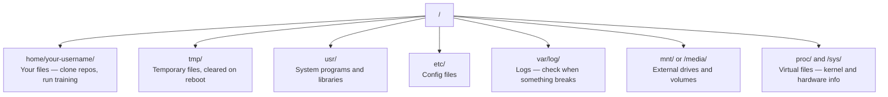

# 基于Linux的AI工程师必需)

> 大多数人工智能运行在Linux上.你需要足够的知识,
> 大多数人工智能运行在Linux上.

**Type:** Learn | **类型:** 学习
**Languages:** -- | **语言:** 无
**Prerequisites:** Phase 0, Lesson 01 | **前置知识:** Phase 0, 第 01 课
**Time:** ~30 minutes | **时间:** ~30 分钟

## 学习目标

- 从命令行执行基本文件操作
  中文翻译:在Linux文件系统中导航,从命令行执行基本文件操作
- 使用 管理文件权限`chmod`其他`chown`解决"拒绝许可"错误
  中文翻译:使用 `chmod`和 `chown`管理文件权限,解决"许可被拒绝"错误
- 安装系统包装`apt`设置一个新的GPU盒子来进行人工智能工作
  中文翻译:使用 `apt`安装系统包,为新GPU 服务器配置AI 工作环境
- 识别macOS与Linux之间的差异,通常会让远程机器上的开发人员陷入困境
  中文翻译:识别从macOS 转换到Linux 时常见的踩坑点

> **【中文解读】**
> 大多数人工智能训练在Linux服务器上运行.当你 SSH到云GPU 实例时,你只需要终端界面.本章是Linux生存指南.

## 问题 问题描述

你在macOS或Windows上开发. 但当你把它放入云GPU盒子,租用一个Lambda实例,或者发动一个EC2机器时,你就会进入Ubuntu. 终端是你的唯一接口. 没有Finder,没有 Explorer,没有GUI. 如果你无法导航文件系统,安装包,并从命令行管理进程, 你会在谷歌搜索"如何在Linux中解锁文件"时, 付费无用的GPU时间.

> 你在 macOS 或 Windows 上开发.但是一旦你 SSH 到云 GPU 服务器,租用 Lambda 实例或启动 EC2 机器,你就进入了 Ubuntu.终端是你的唯一界面.没有 Finder,没有 Explorer,没有 GUI.如果你不能从命令行导航文件系统,安装包和管理过程,你只能在付费的 GPU 空转时搜索"如何在 Linux 中解压文件".

这是一本生存指南. 它涵盖了操作远程Linux机器的需要.

> 这是一个生存指南. 它只涵盖在远程Linux机器上进行人工智能工作所需的知识.

> **【中文解读】**
> 你平时使用macOS或Windows开发,但一个SSH到云GPU服务器就进入了Linux世界.

## 文件系统结构

Linux将所有东西都组织在一个根底下`/`没有.`C:\`或`/Volumes`你实际上会触摸的目录:

> Linux将所有内容都在一个目录中组织`/`下面没有`C:\`或`/Volumes`你实际会接触的目录:

> **【中文解读】**
> Linux文件系统是单一的树状结构,根目录是`/`,我知道.`/home/用户名/`简写 `~`现在,你在工作目录里,几乎所有的操作都在此进行.`/tmp/`存临时文件,重启后清空.`/var/log/`存日志,出问题时必查.`/mnt/`基于Linux服务器的工作.



你的家目录是`~`或`/home/your-username`你几乎所有的事情都在这里发生.

> 你的主目录是`~`或`/home/your-username`几乎所有的操作都在此进行.

## 基本命令.

这些15个命令涵盖了你在远程GPU盒子上所做的95%.

> 这15个命令覆盖了你在远程GPU服务器上的 95%操作.

> **【中文解读】**
> 你只需要掌握约15个命令才能在远程Linux服务器完成95%的工作. 这些命令分为四类:导航:pwd、ls、cd、文件操作:cp、mv、rm、mkdir) 查看文件:cat、head、tail、grep) 和搜索:

### 导航操作

```bash
pwd                         # Where am I?  当前在哪个目录？
ls                          # What's here?  列出当前目录内容
ls -la                      # What's here, including hidden files with details?  详细列出所有文件（含隐藏文件）
cd /path/to/dir             # Go there  切换到指定目录
cd ~                        # Go home  回到主目录
cd ..                       # Go up one level  返回上一级目录
```

### 文件和目录操作

```bash
mkdir my-project            # Create a directory  创建目录
mkdir -p a/b/c              # Create nested directories in one shot  递归创建多级目录

cp file.txt backup.txt      # Copy a file  复制文件
cp -r src/ src-backup/      # Copy a directory (recursive)  递归复制目录

mv old.txt new.txt          # Rename a file  重命名文件
mv file.txt /tmp/           # Move a file  移动文件

rm file.txt                 # Delete a file (no trash, it's gone)  删除文件（无法恢复！）
rm -rf my-dir/              # Delete a directory and everything inside  递归删除目录（危险操作！）
```

`rm -rf`进入前,检查路径.

> `rm -rf`是永久删除.没有撤销.按回车前仔细检查路径.

### 阅读文件 查看文件

```bash
cat file.txt                # Print entire file  打印整个文件内容
head -20 file.txt           # First 20 lines  查看前 20 行
tail -20 file.txt           # Last 20 lines  查看后 20 行
tail -f log.txt             # Follow a log file in real time (Ctrl+C to stop)  实时跟踪日志文件
less file.txt               # Scroll through a file (q to quit)  分页浏览文件
```

### 搜索搜索和搜索

```bash
grep "error" training.log           # Find lines containing "error"  搜索包含 "error" 的行
grep -r "learning_rate" .           # Search all files in current directory  递归搜索所有文件
grep -i "cuda" config.yaml          # Case-insensitive search  不区分大小写搜索

find . -name "*.py"                 # Find all Python files under current dir  查找所有 Python 文件
find . -name "*.ckpt" -size +1G     # Find checkpoint files larger than 1GB  查找大于 1GB 的检查点文件
```

## 许可证文件权限

每个Linux文件都有一个所有者和许可位. 当脚本不执行或不能写到目录时,你会遇到这个.

> 每个文件都具有所有者和权限位置.当脚本无法执行或无法写入目录时,你会遇到这个问题.

> **【中文解读】**
>  Linux 权限分为三组:文件所有者 (文件所有者) 、同组用户 (用户) 、其他用户 (用户) 、其他用户 (用户) 、每组有读物 (读物) 、写作 (写作) 、执行 (执行) 、x) 三种权限。`chmod +x`让脚本可以执行,`chmod 644`设置文件为所有者可读写,其他人只读.`chmod`或`sudo`解决了.

```bash
ls -l train.py
# -rwxr-xr-- 1 user group 2048 Mar 19 10:00 train.py
#  ^^^             owner permissions: read, write, execute
#     ^^^          group permissions: read, execute
#        ^^        everyone else: read only
```

常见的修复:

> 常见修复方法:

```bash
chmod +x train.sh           # Make a script executable  让脚本可执行
chmod 755 deploy.sh         # Owner: full, others: read+execute  所有者全部权限，其他人可读可执行
chmod 644 config.yaml       # Owner: read+write, others: read only  所有者可读写，其他人只读

chown user:group file.txt   # Change who owns a file (needs sudo)  修改文件所有者（需要 sudo）
```

当某事说"被拒绝许可",几乎总是一个权限问题.`chmod +x`或`sudo`解决了大多数案件.

> 任何人都会被拒绝.`chmod +x`或`sudo`能解决大多数情况.

## 包管理

 ubuntu 使用`apt`这就是你安装系统级软件的方式.

>  ubuntu 使用`apt`,这是安装系统级软件的方法.

```bash
sudo apt update             # Refresh the package list (always do this first)  更新软件包列表（首先执行）
sudo apt install -y htop    # Install a package (-y skips confirmation)  安装软件包（-y 跳过确认）
sudo apt install -y build-essential  # C compiler, make, etc. Needed by many Python packages  C 编译器和构建工具
sudo apt install -y tmux    # Terminal multiplexer (keep sessions alive after disconnect)  终端复用器

apt list --installed        # What's installed?  查看已安装的软件包
sudo apt remove htop        # Uninstall  卸载软件包
```

> **【中文解读】**
> `apt`是Ubuntu的包管理器.`apt update`刷新列表.`build-essential`提供C编译器,很多Python包(如numpy、火) 需要它来编译。`tmux`是保持远程会话不被断断的必备工具.

> **【拓展：新 GPU 服务器的初始化清单】**
> 拿到一个新的GPU服务器后,通常需要执行:`apt update && apt install -y build-essential git curl wget tmux htop unzip python3-venv`△然后安装NVIDIA 驱动和CUDA工具包,再安装conda/uv──AWS EC2的深度学习AMI 已预装了大部分工具,但Lambda Labs 和Vast.ai的实例通常需要手动初始化──

您将安装在新鲜的GPU盒子上:

> 新GPU服务器通常会安装的包:

```bash
sudo apt update && sudo apt install -y \
    build-essential \
    git \
    curl \
    wget \
    tmux \
    htop \
    unzip \
    python3-venv
```

## 用户和 sudo 用户和权限升级

您通常是普通用户登录.有些操作需要根源 (管理员) 访问.

> 你通常会以普通用户登录.

```bash
whoami                      # What user am I?  查看当前用户名
sudo command                # Run a single command as root  以 root 权限执行命令
sudo su                     # Become root (exit to go back, use sparingly)  切换为 root 用户（谨慎使用）
```

> **【中文解读】**
> Linux有严格的权限级别.普通用户只能操作自己的文件,系统级操作需要.`sudo`优质实践是只在必要时使用`sudo`为了防止系统文件被错误删除,不要长期使用根源的身份运行.

在云GPU实例中,你通常是唯一的用户,并且已经有Sudo访问权限.不要把一切运行为Root.只使用Sudo当需要时.

> 在云GPU的例子中,你通常是唯一的用户,并且已经有 sudo 权限.

## 进程和系统管理

当你的训练停留,或者你需要检查什么正在运行:

> 当训练卡住或你需要检查正在运行过程时:

```bash
htop                        # Interactive process viewer (q to quit)  交互式进程查看器
ps aux | grep python        # Find running Python processes  查找 Python 进程
kill 12345                  # Gracefully stop process with PID 12345  优雅终止进程
kill -9 12345               # Force kill (use when graceful doesn't work)  强制终止进程
nvidia-smi                  # GPU processes and memory usage  查看 GPU 进程和显存
```

> **【中文解读】**
> 当训练卡住时,用`htop`查看哪个进程占据资源,用`kill`终止失控的过程.`kill -9`是强制终止,只在普通`kill`无效时使用――`nvidia-smi`是GPU进程管理的核心命令,可以看到哪些进程使用GPU占据了多少显存储.

系统d管理服务 (后台恶魔). 如果运行推理服务器,您将使用它:

> 如果运行推理服务器,会使用它:

```bash
sudo systemctl start nginx          # Start a service  启动服务
sudo systemctl stop nginx           # Stop it  停止服务
sudo systemctl restart nginx        # Restart it  重启服务
sudo systemctl status nginx         # Check if it's running  查看服务状态
sudo systemctl enable nginx         # Start automatically on boot  设置开机自启
```

## 磁盘空间

 GPU 盒子通常具有有限的磁盘空间.

>  GPU 服务器的磁盘空间通常有限.

```bash
df -h                       # Disk usage for all mounted drives  查看所有磁盘使用情况
df -h /home                 # Disk usage for /home specifically  查看 /home 分区使用情况

du -sh *                    # Size of each item in current directory  查看当前目录各项大小
du -sh ~/.cache             # Size of your cache (pip, huggingface models land here)  缓存目录大小
du -sh /data/checkpoints/   # Check how big your checkpoints are  检查检查点文件大小

# Find the biggest space hogs  找出最大的空间占用
du -h --max-depth=1 / 2>/dev/null | sort -hr | head -20
```

> **【中文解读】**
>  GPU 服务器的磁盘空间经常不够用.`df -h`查看整体磁盘使用,用 `du -sh *`找到最多空间的具体目录.`~/.cache/huggingface/`和旧的检查点文件.

常见的空间节省器:

> 常见的空间清理方法:

```bash
# Clear pip cache  清理 pip 缓存
pip cache purge

# Clear apt cache  清理 apt 缓存
sudo apt clean

# Remove old checkpoints you don't need  删除不需要的旧检查点
rm -rf checkpoints/epoch_01/ checkpoints/epoch_02/
```

## 网络操作

您将从命令行下载模型,传输文件,

> 你将从命令行下载模型,传输文件和调用API.

```bash
# Download files  下载文件
wget https://example.com/model.bin                   # Download a file  下载文件
curl -O https://example.com/data.tar.gz              # Same thing with curl  用 curl 下载
curl -s https://api.example.com/health | python3 -m json.tool  # Hit an API, pretty-print JSON  调用 API 并格式化输出

# Transfer files between machines  在机器间传输文件
scp model.bin user@remote:/data/                     # Copy file to remote machine  复制文件到远程机器
scp user@remote:/data/results.csv .                  # Copy file from remote to local  从远程复制到本地
scp -r user@remote:/data/checkpoints/ ./local-dir/   # Copy directory  复制整个目录

# Sync directories (faster than scp for large transfers, resumes on failure)  同步目录（比 scp 快，支持断点续传）
rsync -avz --progress ./data/ user@remote:/data/
rsync -avz --progress user@remote:/results/ ./results/
```

> **【中文解读】**
> 网络命令是人工智能工程师的日常工具.`wget`和 `curl`下载模型和数据集`scp`在本地和远程机器间复制文件.`rsync`只有传输变化的字节,支持断点续传,比 scp 快得多.

> **【拓展：rsync 在 AI 工作流中的关键作用】**
> 当你在 AWS p4d 实例中完成一个LLM训练时,需要将50GB的检查点传回本地.使用 scp 传输约30分钟,如果在中途中断开启要重头开始.

使用`rsync`现在`scp`只有转移已更改的字节,

> 对于大文件传输,优先使用`rsync`而不是`scp`△它只传输变化的字节,并能处理断开连接.

## 让会议活着

当你把手机放进远程盒子时,关闭笔记本电脑会杀死你的训练.

> 当你 SSH 到远程服务器时,关闭笔记本电脑会终止训练.

```bash
tmux new -s train           # Start a new session named "train"  创建名为 "train" 的新会话
# ... start your training, then:
# Ctrl+B, then D            # Detach (training keeps running)  分离会话（训练继续运行）

tmux ls                     # List sessions  列出所有会话
tmux attach -t train        # Reattach to session  重新连接到会话

# Inside tmux:  tmux 内操作：
# Ctrl+B, then %            # Split pane vertically  垂直分割面板
# Ctrl+B, then "            # Split pane horizontally  水平分割面板
# Ctrl+B, then arrow keys   # Switch between panes  切换面板
```

> **【中文解读】**
> 没有 没有 没有 关闭 SSH 连接或笔记本电脑就会终止训练.`Ctrl+B, D`分离,训练在后台继续.`tmux attach`重新连接──长时间训练任务必须用tmux──

总是在克斯里做长时间的训练工作.

> 长时间训练任务务必在tmux 中运行――务必如此――

> **【拓展：Linux 在 AI 基础设施中的统治地位】**
> 全球超过99%的人工智能训练在Linux上运行――AWS、GCP、Azure的GPU 实例全部运行Linux(主要是Ubuntu) ・NVIDIA的CUDA 驱动、Docker 容器、Kubernetes 集群AI训练的每个层次基础设施都基于Linux──熟悉Linux不是"加分项",而是AI工程师的必需技能──

## 对于Windows用户而言,WSL2

> **【中文解读】**
> 让Windows用户获得真正的Linux环境,无需双系统.GPU直通已支持.`/mnt/c/Users/用户名/`访问.这是Windows用户学习Linux和人工智能开发的最佳方案.

如果您使用Windows,WSL2可以提供一个真正的Linux环境,

> 如果您使用Windows,WSL2 无需双系统就能给您真正的Linux环境.

```bash
# In PowerShell (admin)
wsl --install -d Ubuntu-24.04

# After restart, open Ubuntu from Start menu
sudo apt update && sudo apt upgrade -y
```

现在,我们在WSL2上运行一个真正的Linux内核.`/mnt/c/Users/YourName/`来自WSL内部.

>  WSL2 运行真正的Linux内核――本课程的所有内容都可在其中使用――Windows文件在 WSL内通过`/mnt/c/Users/YourName/`访问

通过GPU通过安装在Windows侧的NVIDIA驱动程序工作.安装WindowsNVIDIA驱动程序 (而不是Linux),CUDA将在WSL2内提供.

> 通过Windows 侧安装的NVIDIA 驱动工作──安装Windows 版NVIDIA 驱动(不是Linux 版),CUDA 就能在WSL2内使用──

> **【拓展：WSL2 GPU 支持的实际表现】**
> WSL2的GPU直通性能接近原生Linux,PyTorch和TensorFlow都能正常使用CUDA──在WSL2中运行`nvidia-smi`通过WSL2的文件系统性能有限 跨系统文件访问`/mnt/c/`建议将项目文件放在WSL2的`~/`现在,我们得到了最佳性能.

## 接下来,我们将把它带到 Linux 里.

如果您来自macOS,可能会让您陷入困境:

> 如果你从macOS转换,这些事情会让你踩到坑:

| macOS | Linux | Notes |
|-------|-------|-------|
| `brew install` | `sudo apt install` | Different package names sometimes. `brew install htop` vs `sudo apt install htop` works the same, but `brew install readline` vs `sudo apt install libreadline-dev` does not. |
| `open file.txt` | `xdg-open file.txt` | But you won't have a GUI on a remote box. Use `cat` or `less`. |
| `pbcopy` / `pbpaste` | Not available | Pipe to/from clipboard doesn't exist over SSH. |
| `~/.zshrc` | `~/.bashrc` | macOS defaults to zsh. Most Linux servers use bash. |
| `/opt/homebrew/` | `/usr/bin/`, `/usr/local/bin/` | Binaries live in different places. |
| `sed -i '' 's/a/b/' file` | `sed -i 's/a/b/' file` | macOS sed needs an empty string after `-i`. Linux does not. |
| Case-insensitive filesystem | Case-sensitive filesystem | `Model.py` and `model.py` are two different files on Linux. |
| Line endings `\n` | Line endings `\n` | Same. But Windows uses `\r\n`, which breaks bash scripts. Run `dos2unix` to fix. |

| macOS | Linux | 注意事项 |
|------|------|---------|
| `brew install` | `sudo apt install` | 包名有时不同，如 readline vs libreadline-dev |
| `open file.txt` | `xdg-open file.txt` | 远程服务器无 GUI，用 `cat` 或 `less` |
| `pbcopy` / `pbpaste` | 不可用 | SSH 下无法操作剪贴板 |
| `~/.zshrc` | `~/.bashrc` | macOS 默认 zsh，Linux 服务器多用 bash |
| `/opt/homebrew/` | `/usr/bin/`, `/usr/local/bin/` | 可执行文件路径不同 |
| `sed -i '' 's/a/b/' file` | `sed -i 's/a/b/' file` | macOS sed 的 `-i` 后需要空字符串 |
| 大小写不敏感 | 大小写敏感 | `Model.py` 和 `model.py` 是两个不同文件 |
| 换行符 `\n` | 换行符 `\n` | 相同，但 Windows 的 `\r\n` 会破坏 bash 脚本 |

## 快速参考卡

```
Navigation:     pwd, ls, cd, find
Files:          cp, mv, rm, mkdir, cat, head, tail, less
Search:         grep, find
Permissions:    chmod, chown, sudo
Packages:       apt update, apt install
Processes:      htop, ps, kill, nvidia-smi
Services:       systemctl start/stop/restart/status
Disk:           df -h, du -sh
Network:        curl, wget, scp, rsync
Sessions:       tmux new/attach/detach
```

## 练习题
```figure
s0-process-fork
```

## 运动

1. 创建一个项目文件,在其中创建三个空格文件.`touch`然后列出它们.`ls -la`现在,我们要去.
   创建项目文件和空文件,使用`ls -la`列出
2. 安装`htop`运行它,并确定哪个进程使用最多的内存.
   用适合安装的 htop,找出占用内存最多的进程
3. 开始一个tmux会议,运行`sleep 300`在它里,脱离,列出会议,再连接.
   创建一个会话,运行睡眠命令,分离后重新连接
4. 使用`df -h`查看可用的磁盘空间,然后使用`du -sh ~/.cache/*`找出你存储器里有什么空间.
   检查磁盘空间,找出缓存中占用空间最大的内容
5. 通过使用 移动一个文件从本地机器到远程机器`scp`然后与 `rsync`让我们比较经验.
   用 scp 和 rsync 分别传输文件,对比两种方式
