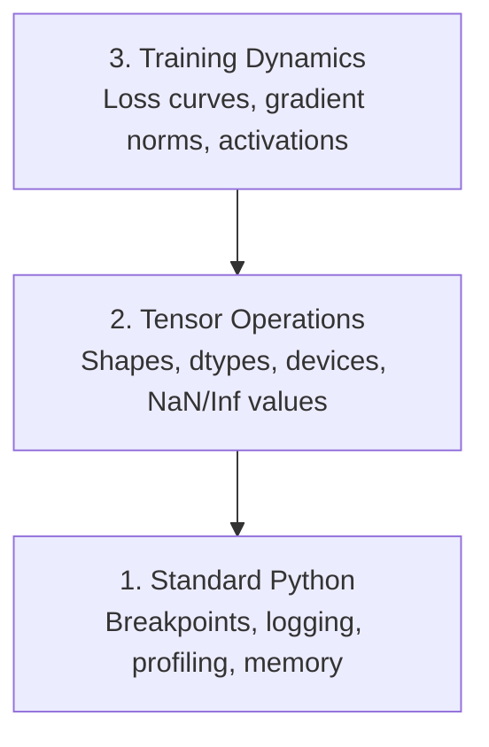

# 调试与性能分析

> 最糟糕的AI虫不会毁,而是沉默地训练垃圾,并报告一个美丽的损失曲线.
> 最糟糕的AI错误不会让程序崩. 他们在垃圾数据上沉默训练,然后报告一个漂亮的损失曲线.

**Type:** Build | **类型:** 构建
**Language:**子**语言:**字符串
**Prerequisites:** Lesson 1 (Dev Environment), basic PyTorch familiarity | **前置知识:** 第 1 课（开发环境），基本 PyTorch 知识
**Time:** ~60 minutes | **时间:** ~60 分钟

## 学习目标

- 使用条件`breakpoint()`其他`debug_print`检查子形状,dtype和NaN值在训练中
  中文翻译:使用条件 `breakpoint()`和 `debug_print`在训练过程中检查张量形状,数据类型和NaN值
- 配置训练循环与`cProfile`现在`line_profiler`其他`tracemalloc`找瓶
  中文翻译:使用 `cProfile`,我知道.`line_profiler`和 `tracemalloc`分析训练循环,找到性能瓶
- 检测常见的AI错误:形状不匹配,NaN损失,数据泄露和错误设备器
  中文翻译:检测常见AI bug:形状不匹配、NaN损失、数据泄漏和设备错误
- 设置 TensorBoard 可可可查看损失曲线,权重 histogram 和梯度分布
  中文翻译:设置 TensorBoard 可视化损失 曲线、权重直方图和梯度分布

> **【中文解读】**
> AI 代码的错误和普通代码不同:它不会崩报错,而是默默使用错误数据训练成一个无用的模型. 本章教你如何调试张量形状,检测NaN,分析性能瓶以及使用TensorBoard可视化训练过程.

> **【拓展：AI 调试为什么特别难？】**
> 传统的Web开发 bug 通常有明确的错误──但AI的 bug 是"静默失败"模型在错误数据上训练8小时,损失看起来正常,但最终预测全是垃圾──常见原因:张量形状不匹配 出现 数据泄露 量在错误设备上──

## 问题 问题描述

网络应用程序会出现条失败.一个错误配置的训练循环运行8小时,在GPU时间中燃烧200美元,并产生一个模型,预测每个输入的平均值.代码从来没有错误.错误是错误设备上的子,一个被遗忘的`.detach()`标签泄露到特征中.

> 网络应用会崩并给出大量的跟踪.一个配置错误的训练循环运行8小时,烧掉200美元的GPU时间,然后产生预测所有输入平均值的模型.`.detach()`标泄漏到特征中.

需要检测这些默默失误的工具,

> 你需要在这些沉默失败之前, 浪费时间和计算能力, 抓住它们的调试工具.

> **【中文解读】**
> 试验最难的地方在于"静默失败":代码不报错,但训练结果完全错误――例如,张量在CPU而不是GPU上,忘记.`.detach()`导致梯度泄漏,标签混入特征 这些细菌不会触发异常,

## 概念的核心概念

人工智能调试在三个层次上运行:

> 试验在三个层次进行:



大多数人直接跳到3级 (看TensorBoard). 但80%的AI bugs生活在1级和2级.

> 大多数人直接跳到第三层面,但80%的AI错误存在于第一层和第二层.

> **【中文解读】**
> AI调试分为三个层次:第一层是标准的Python调试 (断点,日志,内存分析);第二层是张量操作检查 (形状,数据类型,设备,NaN值);第三层是训练动态观察 (损失曲线,梯度分布,激活值).

## 建立它,实现它.
```figure
s0-flame-hot
```

## 建立它

### 第一个部分:打印问题 (是的,它可以工作)

对于子代码,一个目标打印语句比通过一个调试器进行排错更好,因为你需要同时看到形状,类型和值范围.

> 打印调试常常被轻视.但不应如此.对于张量代码,一个有针对性的打印语句比逐步调试更有效,因为你需要同时看到形状,数据类型和值范围.

```python
def debug_print(name, tensor):
    print(f"{name}: shape={tensor.shape}, dtype={tensor.dtype}, "
          f"device={tensor.device}, "  # 张量在 CPU 还是 GPU 上？
          f"min={tensor.min().item():.4f}, max={tensor.max().item():.4f}, "
          f"mean={tensor.mean().item():.4f}, "
          f"has_nan={tensor.isnan().any().item()}")  # 检测是否有 NaN 值
```

任何可疑的操作后,请打电话,

> 在每一个可疑操作后调用它.

### 第2部分:Python 调试器 (pdb 和破点)

由于人工智能工作,内置的调试器被低估.`breakpoint()`进入训练循环,并进行互动检查.

> 在人工智能工作中,内置调试器被低估了.`breakpoint()`通过互联网检查张量.

> **【中文解读】**
> `breakpoint()`在训练循环中设置触发条件 (如突然变大或出现 NaN),程序只在异常时暂停.`p`命令检查张量形状、值范围和梯度――

```python
def training_step(model, batch, criterion, optimizer):
    inputs, labels = batch
    outputs = model(inputs)
    loss = criterion(outputs, labels)

    if loss.item() > 100 or torch.isnan(loss):  # loss 异常大或为 NaN 时触发断点
        breakpoint()  # 进入交互式调试器

    loss.backward()
    optimizer.step()
```

当调试器让你进入时,有用的命令:

> 调试器激活后,常用命令:

- `p outputs.shape`检查形状
  翻译: 中文`p outputs.shape`检查形状
- `p loss.item()`查看损失值
  翻译: 中文`p loss.item()`查看损失值
- `p torch.isnan(outputs).sum()`计数纳米
  翻译: 中文`p torch.isnan(outputs).sum()`统计 个数
- `p model.fc1.weight.grad`检查梯度
  翻译: 中文`p model.fc1.weight.grad`检查梯度
- `c`继续,`q`放弃
  翻译: 中文`c`继续,`q`退出

这只是条件调试,你只会停下来当有些东西看起来不对.

> 对于一个10万步的训练运行,这是很重要的.

### 第三部分:Python记录

检查时,将打印声明取代为记录.

> 当调试超出快速检查范围时,用日志替代打印语句.

```python
import logging

logging.basicConfig(
    level=logging.INFO,
    format="%(asctime)s [%(levelname)s] %(message)s",  # 带时间戳和级别的格式
    handlers=[
        logging.FileHandler("training.log"),  # 输出到文件
        logging.StreamHandler()  # 同时输出到终端
    ]
)
logger = logging.getLogger(__name__)

logger.info("Starting training: lr=%.4f, batch_size=%d", lr, batch_size)
logger.warning("Loss spike detected: %.4f at step %d", loss.item(), step)  # 警告级别
logger.error("NaN loss at step %d, stopping", step)  # 错误级别
```

> **【中文解读】**
> 日志比打印 强大得多:自动加时间、分级别(INFO/WARNING/ERROR) 、同时写文件和终端.

登录给你时间标签,严重程度水平和文件输出. 当训练运行在凌晨3点失败时,你需要一个日志文件,而不是终端输出,

> 志提供时间、严重级别和文件输出. 当你在凌晨3点失败时,你需要日志文件,而不是已经滚出屏幕的终端输出.

### 第四部分:时间代码部分

知道时间的发展是优化第一步.

> 知道时间花在哪里是优化的第一步.

```python
import time

class Timer:
    def __init__(self, name=""):
        self.name = name

    def __enter__(self):
        self.start = time.perf_counter()  # 高精度计时器
        return self

    def __exit__(self, *args):
        elapsed = time.perf_counter() - self.start
        print(f"[{self.name}] {elapsed:.4f}s")  # 打印耗时

with Timer("data loading"):  # 计时数据加载
    batch = next(dataloader_iter)

with Timer("forward pass"):  # 计时前向传播
    outputs = model(batch)

with Timer("backward pass"):  # 计时反向传播
    loss.backward()
```

常见发现:数据加载需要60%的培训时间.`num_workers > 0`在你的数据加载器中,而不是更快的GPU.

> 常见发现:数据加载占训练时间的60%.`num_workers > 0`而不是买更快的GPU.

> **【中文解读】**
> 优化性能的第一步是找到瓶.`Timer`类用Python 上下文管理器精确计时每一步. 最常见的发现是数据加载占了60%的训练时间.`num_workers > 0`,我知道.

> **【拓展：数据加载瓶颈是 AI 训练的头号性能杀手】**
> 在工业界,GPU使用率低于80%的首要原因是数据加载太慢,GPU在等数据中.`num_workers`常设为4-8`pin_memory=True`加速 CPU-GPU 传输、使用 `prefetch_factor`预取数据――谷歌内部的TPU训练管线使用了专门的数据流水线优化,确保TPU永远不需要等数据――

### 第5部分:cProfile和line_profiiler

当你需要不仅仅是手动计时器时:

> 当手动计时不够时:

```bash
python -m cProfile -s cumtime train.py  # 按累计时间排序的性能分析
```

这显示了每个函数调用按累积时间排序.

> 这将按累计时间排序显示每个函数调用.

```bash
pip install line_profiler
```

```python
@profile  # line_profiler 装饰器，逐行统计耗时
def train_step(model, data, target):
    output = model(data)
    loss = F.cross_entropy(output, target)
    loss.backward()
    return loss

# Run with: kernprof -l -v train.py  运行逐行性能分析
```

### 第六部分:记忆分析

> **【中文解读】**
> 内存分析分 CPU 和 GPU 两部分.`tracemalloc`找到分配最多内存的代码行,GPU使用`torch.cuda.memory_summary()`查看显存使用──OOM(Out of Memory) 是AI训练最常见的错误之一先减小批量大小,再尝试混合精度训练──

#### 具有 tracemalloc 的CPU内存

```python
import tracemalloc

tracemalloc.start()  # 开始跟踪内存分配

# your code here
model = build_model()
data = load_dataset()

snapshot = tracemalloc.take_snapshot()  # 拍摄内存快照
top_stats = snapshot.statistics("lineno")  # 按代码行统计内存
for stat in top_stats[:10]:
    print(stat)
```

#### 处理器内存与内存_配置文件

```bash
pip install memory_profiler
```

```python
from memory_profiler import profile

@profile  # 逐行分析内存使用
def load_data():
    raw = read_csv("data.csv")       # watch memory jump here  观察内存跳变
    processed = preprocess(raw)       # and here  数据预处理也会增加内存
    return processed
```

走上`python -m memory_profiler your_script.py`查看一行一行的内存使用.

> 运行`python -m memory_profiler your_script.py`查看逐行内存使用──

#### 配备PyTorch的GPU内存

```python
import torch

if torch.cuda.is_available():
    print(torch.cuda.memory_summary())  # GPU 显存完整报告

    print(f"Allocated: {torch.cuda.memory_allocated() / 1e9:.2f} GB")  # 已分配的显存
    print(f"Cached: {torch.cuda.memory_reserved() / 1e9:.2f} GB")  # 缓存的显存
```

当你按OOM (Out of Memory) 时:

> 当你遇到OOM(内存不足时:

1. 减少批量 (首先尝试,总是)
   中文翻译:减小批量尺寸 (首先尝试,永远如此)
2. 使用`torch.cuda.empty_cache()`释放缓存的内存
   中文翻译:使用 `torch.cuda.empty_cache()`释放缓存内存
3. 使用`del tensor`接着是`torch.cuda.empty_cache()`对于大型中间产品
   中文翻译:对大型中变量使用 `del tensor`加  `torch.cuda.empty_cache()`
4. 使用混合精度 (`torch.cuda.amp`) 减少半个内存使用量
   中文翻译:使用混合精度`torch.cuda.amp`) 减半内存使用
5. 对于非常深层模型使用梯度检查
   中文翻译:对很深的模型使用梯度检查点

### 第7部分:常见的人工智能虫害和如何捕获它们

> **【中文解读】**
> 这是本章最实用的部分――四种最常见的AI bug:形状不匹配(ensor 形状对不上)、NaN损失(数值爆炸)、数据泄漏(训练集和测试集有重叠)、设备错误(CPU 和 GPU 混用)──每种 bug 都有对应检测函数,可以在训练前和训练中快速排查──

#### 形状不匹配

子有形状.`[batch, features]`模型预期的时间`[batch, channels, height, width]`现在,我们要去.

> 最常见的虫子.`[batch, features]`只是一个期望`[batch, channels, height, width]`,我知道.

```python
def check_shapes(model, sample_input):
    print(f"Input: {sample_input.shape}")  # 打印输入形状
    hooks = []

    def make_hook(name):
        def hook(module, inp, out):
            in_shape = inp[0].shape if isinstance(inp, tuple) else inp.shape
            out_shape = out.shape if hasattr(out, "shape") else type(out)
            print(f"  {name}: {in_shape} -> {out_shape}")  # 打印每层的输入输出形状
        return hook

    for name, module in model.named_modules():
        hooks.append(module.register_forward_hook(make_hook(name)))  # 注册钩子函数

    with torch.no_grad():  # 不计算梯度，仅检查形状
        model(sample_input)

    for h in hooks:
        h.remove()  # 清理钩子
```

试试一次用样本,它将模型中的每个形状转变映射出来.

> 用一个样本批量运行一次. 它会映射模型中的每个形状变化.

#### 损失

子的损失意味着爆炸.

> 失败意味着有什么爆炸了.

> **【拓展：NaN 在大模型训练中的灾难性影响】**
> 在LLM培训中,NaN一旦出现在梯度中,就会通过反向传播扩散到所有参数,导致整个模型不可恢复.GPT-3 培训论文中提到,他们使用梯度剪切 (梯度剪切) 和学习率预热 (预热) 防止NaN.一旦检测到NaN,通常做法是回到最近的检查点重新开始,而不是尝试修复.

- 学习率太高
  中文翻译:学习率太高
- 关损失中零分
  中文翻译:自定义损失 中除以零
- 零或负数的记录
  中文翻译:对零或负数取对数
- 在RNN中爆炸梯度
  中文翻译:RNN 中的梯度爆炸

```python
def detect_nan(model, loss, step):
    if torch.isnan(loss):  # 检测 loss 是否为 NaN
        print(f"NaN loss at step {step}")
        for name, param in model.named_parameters():
            if param.grad is not None:
                if torch.isnan(param.grad).any():  # 检测梯度中的 NaN
                    print(f"  NaN gradient in {name}")
                if torch.isinf(param.grad).any():  # 检测梯度中的 Inf
                    print(f"  Inf gradient in {name}")
        return True
    return False
```

#### 数据泄露

你的模型在测试组上得到了99%的准确性.听起来很好.这是一个错误.

> 你的模型在测试集中得到了99%的准确率.

```python
def check_data_leakage(train_set, test_set, id_column="id"):
    train_ids = set(train_set[id_column].tolist())  # 训练集 ID 集合
    test_ids = set(test_set[id_column].tolist())  # 测试集 ID 集合
    overlap = train_ids & test_ids  # 取交集
    if overlap:
        print(f"DATA LEAKAGE: {len(overlap)} samples in both train and test")  # 发现重叠！
        return True
    return False
```

通过使用未来数据来预测过去,在分开之前按时间标签进行排序.

> 另外要检查时间泄漏:用未来数据预测过去.

#### 错误的设备

虽然在不同设备 (CPU与GPU) 上的光器会导致运行时间错误.但有时一个光器默默地停留在CPU上,而其他的东西在GPU上,

> 不同设备上的张量 (CPU vs GPU) 会导致运行时的错误.

```python
def check_devices(model, *tensors):
    model_device = next(model.parameters()).device  # 获取模型所在设备
    print(f"Model device: {model_device}")
    for i, t in enumerate(tensors):
        if t.device != model_device:  # 检查张量和模型是否在同一设备
            print(f"  WARNING: tensor {i} on {t.device}, model on {model_device}")
```

### 第8部分:机板的基本原理

子板显示了训练过程中的情况.

> 子板展示训练过程中发生的内部变化.

```bash
pip install tensorboard  # 安装 TensorBoard
```

```python
from torch.utils.tensorboard import SummaryWriter

writer = SummaryWriter("runs/experiment_1")  # 创建日志写入器

for step in range(num_steps):
    loss = train_step(model, batch)

    writer.add_scalar("loss/train", loss.item(), step)  # 记录训练 loss
    writer.add_scalar("lr", optimizer.param_groups[0]["lr"], step)  # 记录学习率

    if step % 100 == 0:
        for name, param in model.named_parameters():
            writer.add_histogram(f"weights/{name}", param, step)  # 记录权重分布
            if param.grad is not None:
                writer.add_histogram(f"grads/{name}", param.grad, step)  # 记录梯度分布

writer.close()
```

发射:

> 启动子板:

```bash
tensorboard --logdir=runs  # 启动 TensorBoard 可视化服务
```

什么要找:

> 观察要点:

- **Loss not decreasing**学习率太低,或模型架构问题
  翻译: 中文**Loss 不降**学习率太低,或模型架构有问题
- **Loss oscillating wildly**学习率太高
  翻译: 中文**Loss 剧烈震荡**学习率太高
- **Loss goes to NaN**: 数字不稳定 (参见上述NAN部分)
  翻译: 中文**Loss 变 NaN**部分:数值不稳定 (参见上方 NaN 部分)
- **Train loss decreasing, val loss increasing**过度装饰
  翻译: 中文**训练 loss 降但验证 loss 升**过拟合
- **Weight histograms collapsing to zero**: 渐变的梯度
  翻译: 中文**权重直方图趋零**消失的程度
- **Gradient histograms exploding**需要梯度剪切
  翻译: 中文**梯度直方图爆炸**需要剪裁

> **【中文解读】**
> 子板是训练可视化的标准工具――关键观察点:损失 不降(学习率太低或模型架构有问题) 损失 剧烈震荡(学习率太高) 损失 变化 NaN 数值不稳定) 训练损失 降但验证损失 升(过拟合) 权重直方图趋零 梯度消失) 梯度直方图爆炸 需要梯度剪切) 子

> **【拓展：Weights & Biases 与 TensorBoard 的对比】**
> 子板是谷歌开源的训练可视化工具,适合个人和小团队. 权重和偏见 (W&B) 是商业工具,增加了实验比较,团队协作,超参数搜索等功能. 在OpenAI,人类等公司,W&B 是标准实验追踪平台. 一个典型的大型实验会追踪数千个指标:损失率,学习率,梯度范数,各层权重分布,GPU利用率等. 这些数据帮助工程师在数百次实验中找到最佳超参数.

### 第9部分: VS代码调试器

为了进行交互调试,配置VS代码`launch.json`其他:

> 对于交互式调试,用`launch.json`配置 VS 代码:

```json
{
    "version": "0.2.0",
    "configurations": [
        {
            "name": "Debug Training",
            "type": "debugpy",
            "request": "launch",
            "program": "${file}",  // 调试当前打开的文件
            "console": "integratedTerminal",  // 使用集成终端
            "justMyCode": false  // 允许调试第三方库代码
        }
    ]
}
```

通过点击道设置断点. 使用变量窗口检查子属性. 调试控制台允许在执行中运行任意的Python表达式.

> 点击行号左侧设置断点──使用变量面板检查张量属性──调试控制台让你在执行过程中运行任意的Python表达式──

通过数据预处理管道, 看到每个转换.

> 适用于逐步调试数据预处理管线,查看每次变化的结果.

## 用它实现框架

> **【中文解读】**
> 实践中的调试工作流分五步:训练前用 `check_shapes`验证维度;前10步用`debug_print`检查张量值;训练中使用 TensorBoard 监控;出问题时使用 `breakpoint()`交互调试;性能瓶使用计时器和内存分析器定位.

这里是检测大部分人工智能错误的调试工作流程:

> 以下是可以捕获大多数人工智能错误的调试工作流:

1. **Before training**跑步`check_shapes`检查输入和输出尺寸符合预期.
   翻译: 中文**训练前**运行:用样本批量`check_shapes`验证输入输出维度是否符合预期.
2. **First 10 steps**使用 `debug_print`确认没有任何 NaN,值在合理的范围内.
   翻译: 中文**前 10 步**对于损失,输出和梯度使用`debug_print`确认没有合理范围的NAN值.
3. **During training**通过TensorBoard进行可视化.
   翻译: 中文**训练中**记录损失,学习率和梯度范数.
4. **When something breaks**放下`breakpoint()`检查电压器的互动性.
   翻译: 中文**出问题时**      `breakpoint()`交互式检查张量――
5. **For performance**时间数据加载,前进,后退传输,如果您接近OOM,则配置文件内存.
   翻译: 中文**性能优化**分别计时数据加载,前向传播和反向传播.

## 运送它.

运行调试工具包脚本:

> 运行调试工具脚本:

```bash
python phases/00-setup-and-tooling/12-debugging-and-profiling/code/debug_tools.py
```

看到`outputs/prompt-debug-ai-code.md`通过一个提示来诊断人工智能特定的错误.

> 参见`outputs/prompt-debug-ai-code.md`包含帮助诊断AI特定的错误提示.

## 练习题

1. 跑步`debug_tools.py`修改模特以引入一个NaN (提示:在前进传输中除以零) 并观看探测器抓住它.
   运行调试工具脚本,修改模型引入NaN,观察检测器如何捕获它
2. 配置一个训练循环`cProfile`并且确定最慢的函数.
   用cProfile 分析训练循环,找出最慢的函数
3. 使用`tracemalloc`查找数据加载管道中哪条线分配最多的内存.
   用追踪位 找出数据加载管线中哪条线分配了最多内存
4. 设置TensorBoard进行简单的训练, 确定模型是否过度适合.
   设置机板 监控训练过程,判断模型是否过合适
5. 使用`breakpoint()`练习检查子形状,设备和梯度值从调试器提示.
   在训练循环中使用断点 (),练习检查张量形状、设备和梯度值
