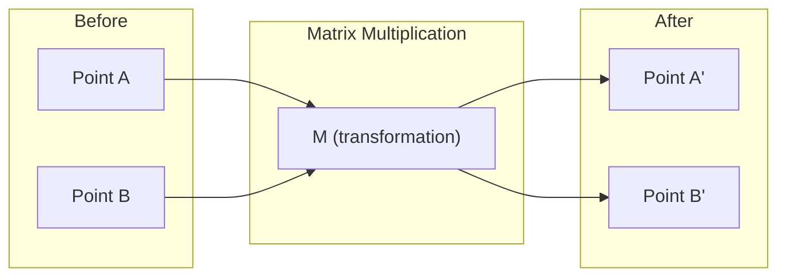
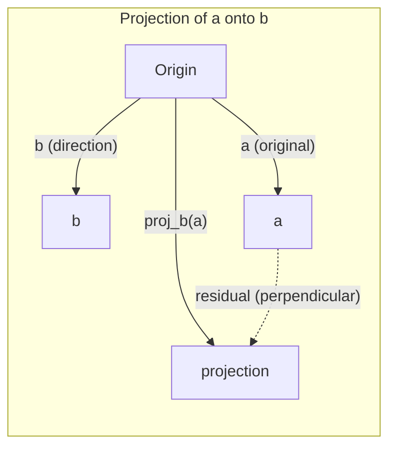

# 线性代数直观
# 线性代数直觉

> 每个人工智能模型都是用高档帽子的矩阵数学.
> 每个AI模型都是一个流程运算的外套.

**Type:** Learn | **类型:** 学习 | **Languages:** Python, Julia | **语言:** Python, Julia | **Prerequisites:** Phase 0 | **前置知识:** Phase 0 | **Time:** ~60 minutes | **时间:** ~60 分钟

## 学习目标

- 在Python中从零开始实现向量和矩阵操作 (加值,点数,矩阵乘法)
  从零实现向量和矩阵运算 (加法,点积,矩阵乘法)
- 几何地解释点产品,投影和格兰姆-施密特过程所做的事情
  从几何角度解释点积,投影,Gram-Schmidt过程的含义
- 使用排序缩小来确定对向量的线性独立性,排列和基础
  用行化简化(高斯消元) 判断线性无关性、秩和基
- 连接线性代数概念到AI应用:嵌入,注意力分数和LoRA
  **将线性代数概念与 AI 应用对接：词嵌入、注意力分数、LoRA 微调**

## 问题是为什么要学到这个

打开任何ML文件. 在第一页内,你会看到向量,矩阵,点产品和转化.没有线性代数直觉,这些只是符号.用它,你可以看到神经网络实际上在做什么 - - 移动空间中的点.

你不需要成为数学家,你需要看到这些运算的几何含义,然后自己编码它们.

> **【中文解读】**翻开任何机器学习论文,第一页就会出现向量,矩阵,点积,变化――没有线性代数直觉,这些只是符号――有直觉,你就能"看穿"神经网络在做什么在空间中移动点的位置――你不需要成为数学家,只需要理解这些操作的几何含义,然后自己写代码实现――

## 概念的核心概念

### 矢量是点 (和方向) √ 向量是点 ((也方向)

矢量只是一个数量列表. 但这些数字意味着什么 - - 他们是空间中的坐标.

**2D vector [3, 2]:**

| x | y | Point |
|---|---|-------|
| 3 | 2 | The vector points from origin (0,0) to (3, 2) on the plane |

矢量有3^2 +2^2) =3^3 () 向上向右.

在人工智能中,向量代表了一切:
- 一个词 → 768 个数字的向量 (其"含义"在嵌入空间中)
- 一个图像 → 数百万像素值的向量
- 一个用户 → 偏好向量

> **【中文解读】**向量就是一组数字,代表空间中的坐标.`[3, 2]`表示从原点 (0,0) 指向 (3,2) 的箭头,长度 = √(32+22) = √13。
其他
> **【拓展：向量在 AI 中的化身】**
> - **词嵌入 (Word Embedding)**字体的数量很接近,因为语义相关.
> - **图片特征**图片的颜色图片:一张224×224的彩色图片 = 150,528个数字的向量――CNN本质上就是逐步缩小这个向量――
> - **用户画像**推系统将您的浏览/购买历史编码变成一个偏好量,然后找到最相似的商品量推给您.

### 矩阵是变化.

一个矩阵将一个向量转化为另一个. 它可以旋转,扩展,延伸或投影.



在人工智能中,矩阵是模型:
- 转换输入成输出的神经网络重量 →矩阵
- 关注分数 → 决定要专注于什么的矩阵
- 嵌入式 → 矩阵将单词映射到向量

> **【中文解读】**矩阵就是一个"变换规则":输入一个向量,输出另一个向量.
其他
> **【拓展：神经网络就是矩阵乘法的嵌套】**
> 神经网络的一层 = `output = W × input + bias`
> - 是权重矩阵 (要学习的参数)
> - 输入是输入量 (上层的输出)
> - 一个三层网络就是三次矩阵乘法的串联
> - 基因组3有1750亿个参数,其实是几百个巨型矩阵.
> - **训练**随着梯度下降不断调整这些矩阵中的数字

### 点量度产品的相似性

两个向量的点乘法告诉你它们是多么相似.

```
a · b = a₁×b₁ + a₂×b₂ + ... + aₙ×bₙ

Same direction:      a · b > 0  (similar)
Perpendicular:       a · b = 0  (unrelated)
Opposite direction:  a · b < 0  (dissimilar)
```

这就是搜索引擎,推系统和RAG的工作方式 - - 找到高点产品的向量.

> **【中文解读】**积 = 对应分量相乘后求和──结果 > 0 方向相似,= 0 垂直无关,< 0 方向相反──
其他
> **【拓展：点积是 AI 最核心的数学操作】**
> 1. **Transformer Attention**其他:`Attention(Q,K,V) = softmax(Q·K^T / √d)·V`
>    - 问题问) 和关键点积 = "我应该更多关注这个词"的分数
>    - 这就是所有大模型的核心机制.
> 2. **RAG 检索**让用户问题变成向量,和所有文档向量做点积,找最相关的文档
> 3. **推荐系统**商品特征向量 = 推分数
> 4. **余弦相似度**归一化后的点积,`cos(a,b) = a·b / (|a|×|b|)`值域 [-1, 1]
>    比"欧氏距离"更好:只看方向不看长度,"喜欢"和"非常喜欢"语义相似

### 线性独立无关

如果集合中没有向量可以被写成其他向量的组合,则向量是线性独立的.如果v1,v2,v3是独立的,则它们跨越3D空间.如果一个是其他向量的组合,则它们只跨越平面.

为什么对人工智能很重要:你的特征矩阵应该有线性独立的列.如果两个特征完全相连 (线性依赖),模型无法区分它们的效果.这导致回归的多线性 - - 重量矩阵变得不稳定,小输入变化产生了野蛮的输出波动.

**Concrete example:**

```
v1 = [1, 0, 0]
v2 = [0, 1, 0]
v3 = [2, 1, 0]   # v3 = 2*v1 + v2
```

v1和 v2是独立的,既不是一个尺度乘数,也不是一个结合的.但是 v3 = 2*v1 + v2,所以 {v1, v2, v3} 是一个依赖的集合.这些三个向量都位于xy平面.不管你如何结合它们,你不能达到 [0, 0, 1].你有三个向量,但只有两个自由维度.

在数据集中:如果 feature_3 = 2*feature_1 + feature_2,添加 feature_3给模型提供了零新信息.更糟糕的是,它使正常方程单一 - 对于权重没有唯一的解决方案.

> **【中文解读】**一组向量"线性无关" = 没有任何一个能被其他向量出来.
其他
> 其他类型:`[1,0,0]`现在`[0,1,0]`现在`[0,0,1]`相互独立 ✓
>     `[1,0,0]`现在`[0,1,0]`现在`[2,1,0]`不独立 (第三个 = 2×第一个 + 第二个)
其他
> **【拓展：多重共线性问题】**
> 在金融数据中很常见:例如"房价按美元计"和"房价按人民币计"是完全线性相关的,
> 同时放入模型会导致权重不稳定、模型过拟合──处理方法:删除冗余特征,或使用正则化(Ridge/Lasso)──

### 基与排名

基础是整个空间的最小线性独立向量集合.

3D空间的标准基础是 {[1,0,0], [0,1,0], [0,0,1]}.但在3D中任何三个独立向量都构成一个有效的基础.

矩阵的排名 = 线性独立列数 = 线性独立列数.如果排名 < min(列, cols),矩阵是排名不足的.这意味着:
- 系统有无限多的解决方案 (或没有)
- 信息在转变中丢失
- 矩阵不能倒车

| Situation | Rank | What it means for ML |
|-----------|------|---------------------|
| Full rank (rank = min(m, n)) | Maximum possible | Unique least-squares solution exists. Model is well-conditioned. |
| Rank deficient (rank < min(m, n)) | Below maximum | Features are redundant. Infinitely many weight solutions. Regularization needed. |
| Rank 1 | 1 | Every column is a scaled copy of one vector. All data lies on a line. |
| Near rank-deficient (small singular values) | Numerically low | Matrix is ill-conditioned. Tiny input noise causes large output changes. Use SVD truncation or ridge regression. |

> **【中文解读】**
> - **基 (Basis)**描述一个空间所需的最小向量──3D空间的标准基是 [1,0,0], [0,1,0], [0,0,1]──
> - **秩 (Rank)**矩阵中真正独立的列数
其他
> 没有什么可能会影响你.
> 现在,我们在做什么?
> 信息是完整的,唯一的解决方案是稳定的.
> 没有任何解决方案,需要规范化.
> 数据几乎是完全一致的,所有信息都在一个方向上.
其他
> **【拓展：LoRA —— 秩在 AI 中最惊艳的应用】**
> 微调大模型的核心洞察:
> - 原始权重矩阵 W 是4096×4096 ((1600万参数)
> - 微调时,权重更新 ΔW 实际上是"低级"的(真正的变化只发生在少数几个方向)
> - 洛拉把 ΔW 分成两个小矩阵 A(4096×16) 和 B(16×4096)
> - 参数从16万 →13万,减少**99%**但效果几乎没有降低
> - 这就是"排名"概念的直接变现的例子.

### 投影

投影向量**a**在向量上**b**给出了**a**方向**b**其他:

```
proj_b(a) = (a dot b / b dot b) * b
```

剩余 (a - proj_b(a)) 垂直于b.这种直角分解是最小平方的配件的基础.

在ML中,投影在任何地方:
- 线性回归将从观测到列空间的距离降至最低 - - 解决方案是投影
- PCA对最大差距方向进行数据投影
- 转变器中的注意力计算了查询对键的投影



**Example:**其他类型的子

其他类型的产品:

投影下降了y元件.这是其最简单的形式的维度减少 - - 抛弃你不关心的方向.

> **【中文解读】**投影 = 向量在某个方向上的"影子"──
> `a=[3,4]`投影到 x 轴`[1,0]`上 = `[3,0]`只是把你的分量扔掉了.
> 残差 = 原向量 - 投影 = `[0,4]`投影方向垂直.
其他
> **【拓展：投影与降维的关系】**
> 投影是最简单的"降维"抛弃不关心的方向――PCA (PCA) 分析主要成分) 是它的升级版:
> 没有抛出固定方向,而是自动找到"最大差距"的方向来投影.
> 放出1000维数据投影到50维,保留超过95%的信息.

### -施密德过程正在交换

转换任何单独向量集合为一个正规的基础.正规意味着每个向量都有长度1并且每个对都是垂直的.

算法:
1. 取第一向量,正常化它
2. 取第二个向量,减去它的投影到第一个,正常化
3. 减去其投影到之前的所有向量,正常化
4. 复制剩余的向量

```
Input:  v1, v2, v3, ... (linearly independent)

u1 = v1 / |v1|

w2 = v2 - (v2 dot u1) * u1
u2 = w2 / |w2|

w3 = v3 - (v3 dot u1) * u1 - (v3 dot u2) * u2
u3 = w3 / |w3|

Output: u1, u2, u3, ... (orthonormal basis)
```

是正规的基础,R捕获投影系数.QR分解用于:
- 解决线性系统 (比高斯消除更稳定)
- 计算自值 (QR算法)
- 最小方体回归 (标准数值方法)

> **【中文解读】**把任意一组向量变成"相互垂直+长度为1"的标准正交基.
其他
> 直觉:每一个新向量先减去已有方向的重合部分,只保留全新方向,再归结.
> 像在建筑中,每个块都选择了全新的方向, 不和之前的重叠.
其他
> **【拓展：为什么"正交"这么重要？】**
> 正交基的计算最稳定. 如果基向量之间有"重合" (重合) 则计算差距会不断积累.
> 基石是数值计算的基石.
> - 解方程的底层使用的是QR 分解
> - 特征值计算的QR 代算法
> - 最小二乘归的标准数值解法

## 建立它,实现它.
```figure
eigen-directions
```

## 建立它

### 开始从零实现向量.

```python
class Vector:
    def __init__(self, components):
        self.components = list(components)
        self.dim = len(self.components)

    def __add__(self, other):
        return Vector([a + b for a, b in zip(self.components, other.components)])

    def __sub__(self, other):
        return Vector([a - b for a, b in zip(self.components, other.components)])

    def dot(self, other):
        # 点积：对应分量相乘后求和。AI 中最核心的相似度度量。
        return sum(a * b for a, b in zip(self.components, other.components))

    def magnitude(self):
        return sum(x**2 for x in self.components) ** 0.5

    def normalize(self):
        # 归一化：缩放到长度1。归一化后点积=余弦相似度。
        mag = self.magnitude()
        return Vector([x / mag for x in self.components])

    def cosine_similarity(self, other):
        # 余弦相似度：只看方向不看长度，值域[-1,1]
        return self.dot(other) / (self.magnitude() * other.magnitude())

    def __repr__(self):
        return f"Vector({self.components})"


a = Vector([1, 2, 3])
b = Vector([4, 5, 6])

print(f"a + b = {a + b}")
print(f"a · b = {a.dot(b)}")
print(f"|a| = {a.magnitude():.4f}")
print(f"cosine similarity = {a.cosine_similarity(b):.4f}")
```

### 开始从零实现矩阵.

```python
class Matrix:
    def __init__(self, rows):
        self.rows = [list(row) for row in rows]
        self.shape = (len(self.rows), len(self.rows[0]))

    def __matmul__(self, other):
        # 矩阵乘法 = 神经网络一层的前向传播
        if isinstance(other, Vector):
            return Vector([
                sum(self.rows[i][j] * other.components[j] for j in range(self.shape[1]))
                for i in range(self.shape[0])
            ])
        rows = []
        for i in range(self.shape[0]):
            row = []
            for j in range(other.shape[1]):
                row.append(sum(
                    self.rows[i][k] * other.rows[k][j]
                    for k in range(self.shape[1])
                ))
            rows.append(row)
        return Matrix(rows)

    def transpose(self):
        return Matrix([
            [self.rows[j][i] for j in range(self.shape[0])]
            for i in range(self.shape[1])
        ])

    def __repr__(self):
        return f"Matrix({self.rows})"


rotation_90 = Matrix([[0, -1], [1, 0]])
point = Vector([3, 1])

rotated = rotation_90 @ point
print(f"Original: {point}")
print(f"Rotated 90°: {rotated}")
```

### 第三步:为什么这对AI重要?

```python
import random

random.seed(42)
weights = Matrix([[random.gauss(0, 0.1) for _ in range(3)] for _ in range(2)])
input_vector = Vector([1.0, 0.5, -0.3])

output = weights @ input_vector
print(f"Input (3D): {input_vector}")
print(f"Output (2D): {output}")
print("This is what a neural network layer does -- matrix multiplication.")
# 矩阵乘法：3维输入 → 2维输出。这就是神经网络一层的全部计算。
# 一个真正的网络就是把很多这样的层串起来，每层都有一个权重矩阵。
```

### 步4:朱莉亚版本

```julia
a = [1.0, 2.0, 3.0]
b = [4.0, 5.0, 6.0]

println("a + b = ", a + b)
println("a · b = ", a ⋅ b)       # Julia supports unicode operators
println("|a| = ", √(a ⋅ a))
println("cosine = ", (a ⋅ b) / (√(a ⋅ a) * √(b ⋅ b)))

# Matrix-vector multiplication
W = [0.1 -0.2 0.3; 0.4 0.5 -0.1]
x = [1.0, 0.5, -0.3]
println("Wx = ", W * x)
println("This is a neural network layer.")
```

### 线性无关性和投影

```python
def is_linearly_independent(vectors):
    # 高斯消元法：把向量排成矩阵，化简，看秩是否等于向量个数
    n = len(vectors)
    dim = len(vectors[0].components)
    mat = Matrix([v.components[:] for v in vectors])
    rows = [row[:] for row in mat.rows]
    rank = 0
    for col in range(dim):
        pivot = None
        for row in range(rank, len(rows)):
            if abs(rows[row][col]) > 1e-10:
                pivot = row
                break
        if pivot is None:
            continue
        rows[rank], rows[pivot] = rows[pivot], rows[rank]
        scale = rows[rank][col]
        rows[rank] = [x / scale for x in rows[rank]]
        for row in range(len(rows)):
            if row != rank and abs(rows[row][col]) > 1e-10:
                factor = rows[row][col]
                rows[row] = [rows[row][j] - factor * rows[rank][j] for j in range(dim)]
        rank += 1
    return rank == n


def project(a, b):
    # 投影：a 在 b 方向上的"影子"
    scalar = a.dot(b) / b.dot(b)
    return Vector([scalar * x for x in b.components])


def gram_schmidt(vectors):
    # 正交化：每个向量减去在已有方向上的投影，只保留新方向
    orthonormal = []
    for v in vectors:
        w = v
        for u in orthonormal:
            proj = project(w, u)
            w = w - proj
        if w.magnitude() < 1e-10:
            continue
        orthonormal.append(w.normalize())
    return orthonormal


v1 = Vector([1, 0, 0])
v2 = Vector([1, 1, 0])
v3 = Vector([1, 1, 1])
basis = gram_schmidt([v1, v2, v3])
for i, u in enumerate(basis):
    print(f"u{i+1} = {u}")
    print(f"  |u{i+1}| = {u.magnitude():.6f}")

print(f"u1 · u2 = {basis[0].dot(basis[1]):.6f}")
print(f"u1 · u3 = {basis[0].dot(basis[2]):.6f}")
print(f"u2 · u3 = {basis[1].dot(basis[2]):.6f}")
```

## 用它实现框架,你会在实战中真正使用的方式.

现在,NumPy的情况也一样,实际上你会使用的东西:
现在用NumPy做实际工作中你使用的就是这些:

```python
import numpy as np

a = np.array([1, 2, 3], dtype=float)
b = np.array([4, 5, 6], dtype=float)

print(f"a + b = {a + b}")
print(f"a · b = {np.dot(a, b)}")
print(f"|a| = {np.linalg.norm(a):.4f}")
print(f"cosine = {np.dot(a, b) / (np.linalg.norm(a) * np.linalg.norm(b)):.4f}")

W = np.random.randn(2, 3) * 0.1
x = np.array([1.0, 0.5, -0.3])
print(f"Wx = {W @ x}")
```

### 排名,投影和QR与NumPy 秩、投影和QR 分解

```python
import numpy as np

A = np.array([[1, 2], [2, 4]])
print(f"Rank: {np.linalg.matrix_rank(A)}")  # 秩=1，第2行是第1行的2倍

a = np.array([3, 4])
b = np.array([1, 0])
proj = (np.dot(a, b) / np.dot(b, b)) * b
print(f"Projection of {a} onto {b}: {proj}")

Q, R = np.linalg.qr(np.random.randn(3, 3))  # QR 分解 = Gram-Schmidt 的矩阵形式
print(f"Q is orthogonal: {np.allclose(Q @ Q.T, np.eye(3))}")  # Q 正交
print(f"R is upper triangular: {np.allclose(R, np.triu(R))}")  # R 上三角
```

### 电是自动调节的向量.

```python
import torch

x = torch.randn(3, requires_grad=True)  # 3维向量，开启自动求导
y = torch.tensor([1.0, 0.0, 0.0])

similarity = torch.dot(x, y)  # 点积
similarity.backward()          # 自动求导！

print(f"x = {x.data}")
print(f"y = {y.data}")
print(f"dot product = {similarity.item():.4f}")
print(f"d(dot)/dx = {x.grad}")  # 梯度 = y 本身，因为 d(x·y)/dx = y
```

> **【拓展：自动求导的魔法】**
> 皮托尔奇的`backward()`自动计算出梯度d (x·y) /dx = y
> 网络训练 = 反复做:
> 1. 前向传播 (矩阵乘法串联)
> 2. 计算损失 (标量)
> 3. 反向传播`backward()`自动求每个权重的梯度)
> 4. 更新权重 (梯度下降)
> 第2-3步完全依赖于"自动求导",而自动求导的数学基础就是链式法则.

对于 x 的点子产量的梯度只是 y. PyTorch 计算了这个自动. 神经网络中的每一个操作都是由这样的操作构建的 - - 矩阵乘法,点子产品,投影 - -

你刚刚从头开始把NumPy在一行里做了什么,现在你知道在帽子下发生了什么.
你刚刚从零开始实现了NumPy 一行代码做的事情.

## 运送它.

这一课产生了:
- `outputs/prompt-linear-algebra-tutor.md`-- 让人工智能助理通过几何直觉教线性代数

## 联系 概念关联地图

这一课中的一切都与现代人工智能的特定部分有关:
现在,我们在学习中,

| Concept 概念 | Where it shows up 在 AI 中的位置 |
|---------|------------------|
| Dot product 点积 | Attention scores in transformers, cosine similarity in RAG / Transformer 的注意力分数、RAG 的余弦相似度 |
| Matrix multiply 矩阵乘法 | Every neural network layer, every linear transformation / 神经网络的每一层 |
| Linear independence 线性无关 | Feature selection, avoiding multicollinearity / 特征选择、避免多重共线性 |
| Rank 秩 | Determining if a system is solvable, LoRA (low-rank adaptation) / 方程可解性判断、LoRA 微调 |
| Projection 投影 | Linear regression (projecting onto column space), PCA / 线性回归、PCA 降维 |
| Gram-Schmidt / QR | Numerical solvers, eigenvalue computation / 数值求解器、特征值计算 |
| Orthonormal basis 正交基 | Stable numerical computation, whitening transforms / 数值稳定计算、白化变换 |

洛拉值得特别提及. 它通过将重量更新分解成低级矩阵来细节化大型语言模型. 洛拉 (LoRA) 没有更新4096x4096重量矩阵 (16M参数),而是更新了两个4096x16和16x4096 (131K参数) 尺寸的矩阵. 排名16的限制意味着LoRA假设重量更新在全4096维空间的16维子空间中生活. 这就是线性代数做了真正的工作.

> **【中文解读】LoRA 特别值得一提。**它把大模型的微调过程分解为低排矩阵运算.
> 首先要更新4096×4096的权重矩阵,
> 洛拉只更新了4096×16和16×4096 两个小矩阵
> "秩=16"意味着:权重更新实际上只发生在16个方向上,而不是完整的4096维空间.
> 这就是AI中线性代数最钱的应用,使普通显卡也可以微调模型.

## 练习题

1. 实施`Vector.angle_between(other)`返回两个向量之间的度角
   **实现计算两向量夹角的方法（返回角度）**
2. 创建一个2D扩展矩阵,将x坐标翻倍和y坐标三倍,然后将其应用到向量 [1, 1]
   **创建一个 2D 缩放矩阵（x坐标翻倍，y坐标三倍），应用到向量 [1, 1]**
3. 给出5个随机字样向量 (维度50),使用共数相似性找到两个最相似的
   **给定5个随机50维"词向量"，用余弦相似度找最相似的2个**
4. 检查Gram-Schmidt输出是否真的正规:检查每个对都有点产量0和每个向量都有大小1
   **验证 Gram-Schmidt 输出确实正交：任意两个点积=0，每个长度=1**
5. 创建一个3x3矩阵,排名 2. 通过 验证`rank()`然后解释列的几何对象.
   **构造一个秩为2的3×3矩阵，验证秩，解释它的列向量张成什么几何体（答案：一个平面）**
6. 投向向量 [1,2,3] 到 [1,1,1].结果的几何表现是什么?
   **把 [1,2,3] 投影到 [1,1,1] 上，几何含义是什么？（答案：在对角线方向上的分量）**

## 关键词 快速查找表

| Term 英文 | What people say 常见误解 | What it actually means 准确含义 |
|------|----------------|----------------------|
| Vector 向量 | "An arrow 一根箭头" | A list of numbers representing a point or direction in n-dimensional space / n维空间中的点或方向 |
| Matrix 矩阵 | "A table of numbers 一堆数字" | A transformation that maps vectors from one space to another / 把向量从一个空间映射到另一个空间的变换 |
| Dot product 点积 | "Multiply and sum 乘完加起来" | A measure of how aligned two vectors are -- the core of similarity search / 衡量对齐程度——相似度搜索的核心 |
| Embedding 嵌入 | "Some AI magic AI魔法" | A vector that represents the meaning of something (word, image, user) / 表示事物"意义"的向量 |
| Linear independence 线性无关 | "They don't overlap 不重叠" | No vector in the set can be written as a combination of the others / 没有向量能用其他向量凑出来 |
| Rank 秩 | "How many dimensions 几个维度" | The number of linearly independent columns (or rows) in a matrix / 独立列（行）的数量 |
| Projection 投影 | "The shadow 影子" | The component of one vector in the direction of another / 一个向量在另一个方向上的分量 |
| Basis 基 | "The coordinate axes 坐标轴" | A minimal set of independent vectors that span the space / 张成整个空间的最少独立向量 |
| Orthonormal 正交归一 | "Perpendicular unit vectors 垂直单位向量" | Vectors that are mutually perpendicular and each have length 1 / 互相垂直且长度各为1 |
