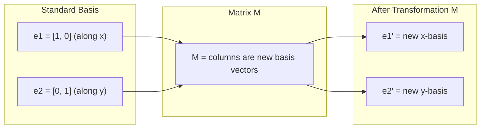
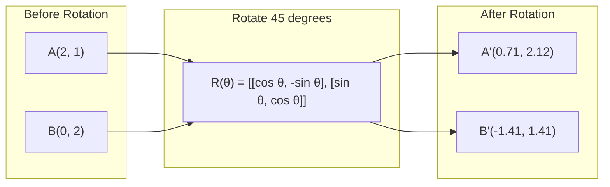
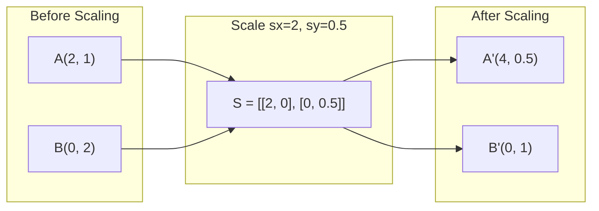
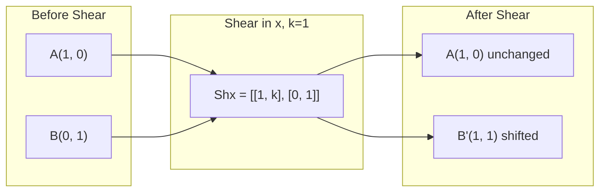
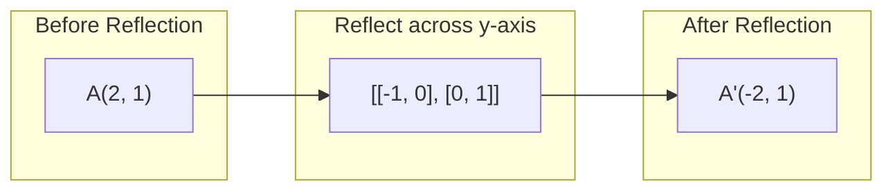
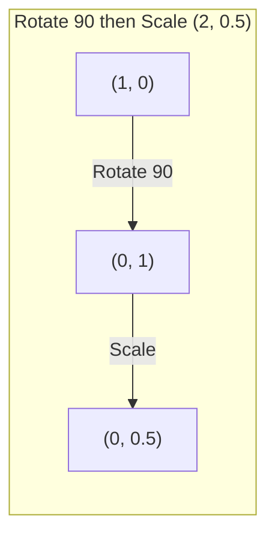
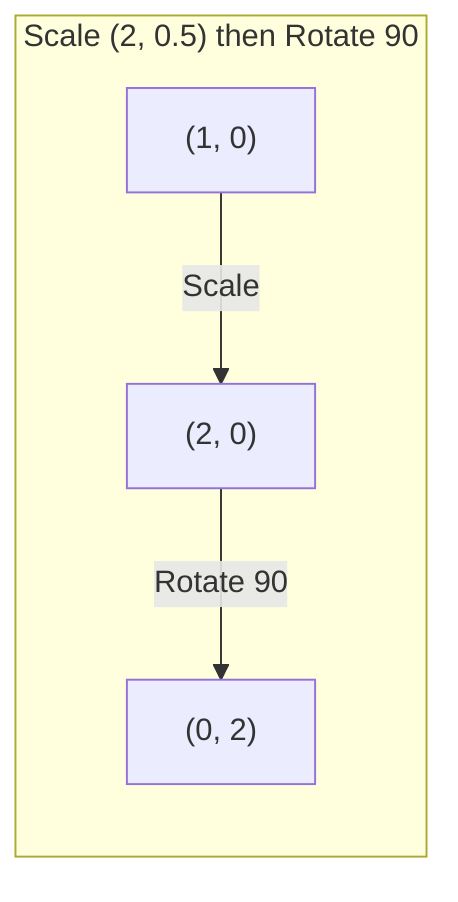

# 矩阵变化

> 矩阵是一个重新塑造空间的机器. 了解它对每个点做什么,你就会理解整个转变.

> 矩阵是一个重塑空间的机器.

**Type:** Build | **类型:** 动手
**Languages:** Python, Julia | **语言:** Python, Julia
**Prerequisites:** Phase 1, Lessons 01-02 (Linear Algebra Intuition, Vectors & Matrices Operations) | **前置知识:** Phase 1, Lessons 01-02（线性代数直觉、向量与矩阵运算）
**Time:** ~75 minutes | **时间:** ~75 分钟

## 学习目标

- 构建旋转,扩展,切割和反射矩阵,并将它们应用于2D和3D点
  构建旋转,缩缩,剪切,反射矩阵并应用于2D和3D点
- 通过矩阵乘法编写多个转换,并验证顺序是否重要
  通过矩阵乘法组合多个变化,验证顺序的重要性
- 从特征方程计算2x2矩阵的自值和自向量
  从特征方程计算2x2 矩阵的特征值和特征向量
- 解释为什么自值决定PCA方向,RNN稳定性和光谱集群行为
  解释特征值为何决定PCA方向、RNN 稳定性和谱聚类行为

> **【中文解读】**
> 矩阵是对空间的变化,转移,缩缩,剪切,转转. 了解矩阵的几何意义后,PCA、RNN 稳定性、谱聚类这些概念就变成直观了.

> **【拓展：特征值/特征向量在 AI 中的位置】**
> - **PCA（主成分分析）**找到数据方差矩阵的特征向量,就是数据方差最大的方向.
> - **RNN 稳定性**重矩阵的特征值绝对值大于1,梯度会指数增加;小于1则会衰减到零 (梯度消失) ⋅
> - **谱聚类**采用图拉普拉斯矩阵的特征向量进行聚合,比K-Means更适合非球形数据.

## 问题 问题引入

> **【中文解读】**据 PCA说"寻找与差矩阵的特征向量",模型稳定性说"检查特征值是否小于1",数据增强说"随机旋转"这些都需要了解矩阵对空间的几何变化.矩阵不是数字表格,而是"空间机器":旋转,缩缩,切割.

## 概念的核心概念

> **【拓展：Transformer 中的矩阵变换】**变压器的每个注意力都在做矩阵变换:Q=W_q·x,K=W_k·x,V=W_v·x,其中W_q/W_k/W_v是可学习的变换矩阵.模型训练的过程就是自动学习的过程.

### 转变为矩阵

任何2D的线性转换都可以写成2x2矩阵.矩阵告诉你底向量 [1, 0] 和 [0, 1] 最终到底是哪里.其他的一切都会随之而来.

> 二维空间中的每一个线性变化都可以写成一个2x2矩阵――矩阵告诉你基向量 [1, 0] 和 [0, 1] 变到了哪里,其余一切由此决定――

> 矩阵的列就是变换后的基向量──如果矩阵的第一列是 [2, 0],说明 e1=[1,0] 被映射到 [2,0](沿 x 轴拉伸 2 倍)──



### 转动

通过角度旋转,保持距离和角落完整. 它沿着圆弧移动每个点.

> 二维旋转保持距离和角度不变,将每个点沿着圆弧移动.

> 旋转矩阵 R(θ) = [[cosθ, -sinθ], [sinθ, cosθ]]。θ 为正表示逆时针旋转。R^T = R^(-1),转置即逆旋转。



在3D中,你旋转一个轴,每个轴都有自己的旋转矩阵:

> 在三维空间中,你围绕着一个轴旋转.

```
Rz(theta) = | cos  -sin  0 |     Rotate around z-axis
            | sin   cos  0 |     (x-y plane spins, z stays)
            |  0     0   1 |

Rx(theta) = | 1   0     0    |   Rotate around x-axis
            | 0  cos  -sin   |   (y-z plane spins, x stays)
            | 0  sin   cos   |

Ry(theta) = |  cos  0  sin |     Rotate around y-axis
            |   0   1   0  |     (x-z plane spins, y stays)
            | -sin  0  cos |
```

### 规模化

尺度延伸或压缩在每个轴线上独立.

> 缩放沿每轴独立地拉伸或压缩.

> 缩放矩阵 S = [[sx, 0], [0, sy]]──sx、sy 可以不同──如果某个为负,等价于沿该轴反射──



### 切割

切削曲一个轴,同时保持另一个固定. 它将矩形变成平行图.

> 切断一个轴倾斜而保持另一个轴固定,将矩形变成平行四边形.

> 剪切保持面积不变(行列式=1) 想象一克牌向一边推:底牌不动,顶牌平移――



切割矩阵:
- `Shx = [[1, k], [0, 1]]`转变 x 乘以 k * y
- `Shy = [[1, 0], [k, 1]]`转变为 y 乘以 k * x

> 剪切矩阵:`Shx`沿 y 偏移 x(x 新 = x + k*y),`Shy`沿 x 偏移 y(y 新 = y + k*x) 』

### 思考

反映反映在轴或线的点.

> 反射将点关于某条轴或线做镜像.

> 反射改变方向 (行列式=-1) 但保持距离.



反映矩阵:
- 反射在 y 轴上:`[[-1, 0], [0, 1]]`
- 通过x轴反射:`[[1, 0], [0, -1]]`

> 关于 轴反射`[[-1, 0], [0, 1]]`关于X轴反射`[[1, 0], [0, -1]]`,我知道.

### 组成:链接转换

应用转换A然后B是相同的乘以它们的矩阵:`result = B @ A @ point`顺序是重要的. 旋转然后尺度给出不同的结果,

> 先做变换 A 再做变换 B 等于乘以它们的矩阵:`result = B @ A @ point`◎序列很重要 首先转换再缩放与先缩放再缩放的结果不同.

> 这就是为什么 PyTorch 中的 nn.序列严格按顺序应用模块,而矩阵乘法顺序在反向传播中通过转换自动反转.



组成:`S @ R = [[0, -2], [0.5, 0]]`

> 先旋转 90° 再缩放 (2, 0.5):从 (1,0) → 旋转后 (0,1) → 缩放后 (0, 0.5) ――组合矩阵 S @ R = [[0, -2], [0.5, 0]]。



组成:`R @ S = [[0, -0.5], [2, 0]]`

> 先缩放 (2,0.5) 再旋转 90°:从 (1,0) → 缩放后 (2,0) → 旋转后 (0, 2) ・组合矩阵 R @ S = [[0, -0.5], [2, 0]],与上完全不同──

矩阵乘法不是交换式的.

> 结果不同.矩阵乘法不满足交换法. 这就是为什么变压器注意力中Q、K、V的乘法顺序至关重要.

### 自身值和自身向量

矩阵碰到它们时,大多数向量都改变方向.自向量是特殊的:矩阵只会缩小它们,从来没有旋转它们.缩小因素是自值.

> 大多数向量被矩阵变换后会改变方向. 矩阵的特征向量是特殊的:矩阵只对它进行缩放,不旋转.

> 几何直觉:特征向量是变化中"方向不变"的方向.

```
A @ v = lambda * v

v is the eigenvector (direction that survives)
lambda is the eigenvalue (how much it stretches)

Example: A = | 2  1 |
             | 1  2 |

Eigenvector [1, 1] with eigenvalue 3:
  A @ [1,1] = [3, 3] = 3 * [1, 1]     (same direction, scaled by 3)

Eigenvector [1, -1] with eigenvalue 1:
  A @ [1,-1] = [1, -1] = 1 * [1, -1]  (same direction, unchanged)
```

矩阵延伸空间3x沿 [1, 1]并保持[1, -1]不变.其他方向都是这两个混合.

> 该矩阵沿 [1, 1] 方向拉伸 3 倍,保持 [1, -1] 方向不变──其他所有方向都是这两个方向的组合──

### 自身组成

如果矩阵具有 n 线性独立的自向量,则可以分解:

> 如果矩阵有n 个线性无关的特征向量,它可以分解为A = V D V−1──

> 特性分解的几何意义:把任意变化分解为"旋转到特征向量坐标系 → 沿轴缩放 → 旋转回来"三步――这是PCA的核心数学――

```
A = V @ D @ V^(-1)

V = matrix whose columns are eigenvectors
D = diagonal matrix of eigenvalues
V^(-1) = inverse of V

This says: rotate into eigenvector coordinates, scale along each axis, rotate back.
```

> 这意味着:旋转到特征向量坐标系,沿着每个轴缩放,再旋转回来.

### 为什么自有价值很重要

**PCA.**变量矩阵的自向量是主要组件.自值值告诉你每个组件捕获多少变量.按自值排序,保持顶部k,你有维度减少.

> **PCA（主成分分析）。**配方差矩阵的特征向量是主成分,特征值告诉你每个主成分捕获了多少方差.

**Stability.**在复发网络和动态系统中,大小 > 1 的自值导致输出爆炸.大小 < 1 导致它们消失.这是一个句子中所述的消失/爆炸梯度问题.

> **稳定性。**在循环网络和动力系统中,特征值绝对值 > 1 导致输出爆炸,< 1 导致消失.

**Spectral methods.**图形神经网络使用邻近矩阵的自值.谱系集群使用拉普拉西亚的自值.自向量揭示图形的结构.

> **谱方法。**图神经网络使用邻近矩阵的特征值,谱聚类使用拉普拉斯矩阵的特征值.

### 定量量缩小因素的定量

转换矩阵的定量符告诉你它在面积 (2D) 或体积 (3D) 范围内是多少.

> 变换矩阵的行列式告诉你它缩小面积的程度.

> det=0 是"灾难"矩阵把空间压缩到低维(如2D →1D线),信息丢失,矩阵不可逆――神经网络初始化时应避免权重矩阵接近奇异――

```
det = 1:   area preserved (rotation)
det = 2:   area doubled
det = 0:   space crushed to lower dimension (singular)
det = -1:  area preserved but orientation flipped (reflection)

| det(Rotation) | = 1        (always)
| det(Scale sx, sy) | = sx * sy
| det(Shear) | = 1           (area preserved)
| det(Reflection) | = -1     (orientation flipped)
```

> 行列式含义:det=1 保面积(旋转);det=2 面积翻倍;det=0 空间缩小到低维(奇异,矩阵不可逆);det=-1 保面积但翻转方向(反射) ⋅

## 建立它,实现它.
```figure
matrix-transform
```

## 建立它

### 步骤1:从零开始的转换矩阵 (Python)

> 第1步:从零实现变换矩阵

> 从零实现旋转,缩缩,剪切,反射矩阵――所有变化都是2x2矩阵――还实现了 mat_vec_mul 和 mat_mul 用于变量和组合变量――

```python
import math

def rotation_2d(theta):
    c, s = math.cos(theta), math.sin(theta)
    return [[c, -s], [s, c]]

def scaling_2d(sx, sy):
    return [[sx, 0], [0, sy]]

def shearing_2d(kx, ky):
    return [[1, kx], [ky, 1]]

def reflection_x():
    return [[1, 0], [0, -1]]

def reflection_y():
    return [[-1, 0], [0, 1]]

def mat_vec_mul(matrix, vector):
    return [
        sum(matrix[i][j] * vector[j] for j in range(len(vector)))
        for i in range(len(matrix))
    ]

def mat_mul(a, b):
    rows_a, cols_b = len(a), len(b[0])
    cols_a = len(a[0])
    return [
        [sum(a[i][k] * b[k][j] for k in range(cols_a)) for j in range(cols_b)]
        for i in range(rows_a)
    ]

point = [1.0, 0.0]
angle = math.pi / 4

rotated = mat_vec_mul(rotation_2d(angle), point)
print(f"Rotate (1,0) by 45 deg: ({rotated[0]:.4f}, {rotated[1]:.4f})")

scaled = mat_vec_mul(scaling_2d(2, 3), [1.0, 1.0])
print(f"Scale (1,1) by (2,3): ({scaled[0]:.1f}, {scaled[1]:.1f})")

sheared = mat_vec_mul(shearing_2d(1, 0), [1.0, 1.0])
print(f"Shear (1,1) kx=1: ({sheared[0]:.1f}, {sheared[1]:.1f})")

reflected = mat_vec_mul(reflection_y(), [2.0, 1.0])
print(f"Reflect (2,1) across y: ({reflected[0]:.1f}, {reflected[1]:.1f})")
```

### 转换的组成

> 第2步:变换的组合

> 验证矩阵乘法不可交换:先旋转90° 再缩放 (2,0.5) 与先缩放再旋转得到完全不同的结果.

```python
R = rotation_2d(math.pi / 2)
S = scaling_2d(2, 0.5)

rotate_then_scale = mat_mul(S, R)
scale_then_rotate = mat_mul(R, S)

point = [1.0, 0.0]
result1 = mat_vec_mul(rotate_then_scale, point)
result2 = mat_vec_mul(scale_then_rotate, point)

print(f"Rotate 90 then scale: ({result1[0]:.2f}, {result1[1]:.2f})")
print(f"Scale then rotate 90: ({result2[0]:.2f}, {result2[1]:.2f})")
print(f"Same? {result1 == result2}")
```

> 验证:先旋后缩放,结果与先缩放后旋转不同.

### 步骤3:自动值从零开始 (2x2)

> 第3步:从零计算特征值

> 2x2 矩阵的特征值通过解二次方程 λ2 - trace·λ + det = 0 得到,其中 trace=a+d,det=ad-bc。特征向量通过 (A - λI) v = 0 求解。

对于2x2矩阵`[[a, b], [c, d]]`个性化方程的自值解法:`lambda^2 - (a+d)*lambda + (ad - bc) = 0`现在,我们要去.

> 对于2x2矩阵`[[a, b], [c, d]]`特征值满足特征方程 λ2 - (a+d)λ + (ad-bc) = 0──其中 (a+d) 是迹(痕迹),(ad-bc) 是行列式──

```python
def eigenvalues_2x2(matrix):
    a, b = matrix[0]
    c, d = matrix[1]
    trace = a + d
    det = a * d - b * c
    discriminant = trace ** 2 - 4 * det
    if discriminant < 0:
        real = trace / 2
        imag = (-discriminant) ** 0.5 / 2
        return (complex(real, imag), complex(real, -imag))
    sqrt_disc = discriminant ** 0.5
    return ((trace + sqrt_disc) / 2, (trace - sqrt_disc) / 2)

def eigenvector_2x2(matrix, eigenvalue):
    a, b = matrix[0]
    c, d = matrix[1]
    if abs(b) > 1e-10:
        v = [b, eigenvalue - a]
    elif abs(c) > 1e-10:
        v = [eigenvalue - d, c]
    else:
        if abs(a - eigenvalue) < 1e-10:
            v = [1, 0]
        else:
            v = [0, 1]
    mag = (v[0] ** 2 + v[1] ** 2) ** 0.5
    return [v[0] / mag, v[1] / mag]

A = [[2, 1], [1, 2]]
vals = eigenvalues_2x2(A)
print(f"Matrix: {A}")
print(f"Eigenvalues: {vals[0]:.4f}, {vals[1]:.4f}")

for val in vals:
    vec = eigenvector_2x2(A, val)
    result = mat_vec_mul(A, vec)
    scaled = [val * vec[0], val * vec[1]]
    print(f"  lambda={val:.1f}, v={[round(x,4) for x in vec]}")
    print(f"    A@v = {[round(x,4) for x in result]}")
    print(f"    l*v = {[round(x,4) for x in scaled]}")
```

> 验证 A=[[2,1],[1,2]] 的特征值是 3 和 1,对应特征向量 [1,1]/√2 和 [1,-1]/√2。验证 A@v = λ×v 成立。

### 步骤4:作为体积缩放因素的决定因素

> 第4步:行列式作为体积缩放因子

```python
def det_2x2(matrix):
    return matrix[0][0] * matrix[1][1] - matrix[0][1] * matrix[1][0]

print(f"det(rotation 45) = {det_2x2(rotation_2d(math.pi/4)):.4f}")
print(f"det(scale 2,3)   = {det_2x2(scaling_2d(2, 3)):.1f}")
print(f"det(shear kx=1)  = {det_2x2(shearing_2d(1, 0)):.1f}")
print(f"det(reflect y)   = {det_2x2(reflection_y()):.1f}")

singular = [[1, 2], [2, 4]]
print(f"det(singular)     = {det_2x2(singular):.1f}")
print("Singular: columns are proportional, space collapses to a line.")
```

> 奇异矩阵示例:[[1, 2],[2, 4]] 的行列式为 0,因为两行成比例──空间被压缩到一条线,变换不可逆──

## 用它实现框架

通过优化程序来处理所有这些.

> 通过优化例程处理所有操作.

> 许多人`np.linalg.eig`和 `np.linalg.det`底层调用LAPACK(C/Fortran 写的线性代数库),比手写 Python 快 100-1000倍──

```python
import numpy as np

theta = np.pi / 4
R = np.array([[np.cos(theta), -np.sin(theta)],
              [np.sin(theta),  np.cos(theta)]])

point = np.array([1.0, 0.0])
print(f"Rotate (1,0) by 45 deg: {R @ point}")

S = np.diag([2.0, 3.0])
composed = S @ R
print(f"Scale(2,3) after Rotate(45): {composed @ point}")

A = np.array([[2, 1], [1, 2]], dtype=float)
eigenvalues, eigenvectors = np.linalg.eig(A)
print(f"\nEigenvalues: {eigenvalues}")
print(f"Eigenvectors (columns):\n{eigenvectors}")

for i in range(len(eigenvalues)):
    v = eigenvectors[:, i]
    lam = eigenvalues[i]
    print(f"  A @ v{i} = {A @ v}, lambda * v{i} = {lam * v}")

print(f"\ndet(R) = {np.linalg.det(R):.4f}")
print(f"det(S) = {np.linalg.det(S):.1f}")

B = np.array([[3, 1], [0, 2]], dtype=float)
vals, vecs = np.linalg.eig(B)
D = np.diag(vals)
V = vecs
reconstructed = V @ D @ np.linalg.inv(V)
print(f"\nEigendecomposition A = V @ D @ V^-1:")
print(f"Original:\n{B}")
print(f"Reconstructed:\n{reconstructed}")
```

> 分析的特征:A = V @ D @ V−1 应能完美重建原矩阵――这证明任何可对角化矩阵都能分解为"旋转 →缩缩 →旋转回来"三步――

### 通过 NumPy 进行3D旋转

```python
def rotation_3d_z(theta):
    c, s = np.cos(theta), np.sin(theta)
    return np.array([[c, -s, 0], [s, c, 0], [0, 0, 1]])

def rotation_3d_x(theta):
    c, s = np.cos(theta), np.sin(theta)
    return np.array([[1, 0, 0], [0, c, -s], [0, s, c]])

point_3d = np.array([1.0, 0.0, 0.0])
rotated_z = rotation_3d_z(np.pi / 2) @ point_3d
rotated_x = rotation_3d_x(np.pi / 2) @ point_3d

print(f"\n3D point: {point_3d}")
print(f"Rotate 90 around z: {np.round(rotated_z, 4)}")
print(f"Rotate 90 around x: {np.round(rotated_x, 4)}")
```

> 实现3D旋转矩阵:绕 z轴和绕 x轴各有独立的3x3旋转矩阵――3D图形学、机器人学、计算机视觉都依赖于这些矩阵――

## 运送它.

这一课构建了PCA (第二阶段) 和神经网络权重分析的几何基础.在这里构建的自值/自向量代码是相同的算法,它支持生产ML系统中的维度减少,光谱集群和稳定分析.

> 本课程构建了PCA的几何基础,2阶段和神经网络权重分析.

> 本课产出:从零实现的变换矩阵库 + 特征值/特征向量求解器――代码可以直接用于理解PCA、谱聚类、GNN谱方法等高级主题――

## 练习题

1. 按一个单位方形 (角在 [0,0], [1,0], [1,1], [0,1]) 进行旋转,扩展和切割. 打印每个角的转换角. 检查旋转是否保持角之间的距离.
   对单位正方形的角在 [0,0]、[1,0]、[1,1]、[0,1]) 应用旋转、缩放、剪切──打印每变后的角──验证旋转保持角之间距离不变──

2. 通过使用特征方程手动找到矩阵的自值值.然后用从头开始的函数和NumPy来验证.
   手工用特征方程求矩阵的特征值,然后从零实现的函数和NumPy验证.

3. 创建一个三变的组合 (旋转30度,以 [1.5,0.8] 缩小,切割 kx=0.3) 并将其应用于圆形排列的8个点. 打印前后坐标.计算复合矩阵的确定量,并验证它等于单个确定量的产量.
   组合三个变换(旋转30°、缩放 [1.5,0.8]、剪切 kx=0.3),应用到圆上的8个点──打印前后坐标──计算组合矩阵的行列式,验证它等于各自行列式的乘积──

## 关键词 快速查找表

| Term | What people say | What it actually means |
|------|----------------|----------------------|
| Rotation matrix | "Spins things" | An orthogonal matrix that moves points along circular arcs while preserving distances and angles. Determinant is always 1. |
| Scaling matrix | "Makes things bigger" | A diagonal matrix that stretches or compresses independently along each axis. Determinant is the product of scale factors. |
| Shearing matrix | "Slants things" | A matrix that shifts one coordinate proportionally to another, turning rectangles into parallelograms. Determinant is 1. |
| Reflection | "Mirrors things" | A matrix that flips space across an axis or plane. Determinant is -1. |
| Composition | "Do two things" | Multiplying transformation matrices to chain operations. Order matters: B @ A means apply A first, then B. |
| Eigenvector | "Special direction" | A direction that the matrix only scales, never rotates. The transformation's fingerprint. |
| Eigenvalue | "How much it stretches" | The scalar factor by which the matrix scales its eigenvector. Can be negative (flip) or complex (rotation). |
| Eigendecomposition | "Break the matrix apart" | Writing a matrix as V @ D @ V^(-1), separating it into its fundamental scaling directions and magnitudes. |
| Determinant | "A single number from a matrix" | The factor by which the transformation scales area (2D) or volume (3D). Zero means the transformation is irreversible. |
| Characteristic equation | "Where eigenvalues come from" | det(A - lambda * I) = 0. The polynomial whose roots are the eigenvalues. |

> 术语速查:旋转矩阵,正交,行列式=1) 缩矩阵,对角) 切割(剪切,矩形→平行四边形) 反射,行列式=-1) 组合(组合,B@A 表示先 A 后 B) 引擎特征量,只缩放不值旋转的方向) 值特征,缩放倍数,可为负数或复数) 格组合特征分化 A=VDV−1) 确定行列式,面积/体积缩放因子,0 = 奇异) 特征方程特征特征特征特征特征特征特征特征特征特征特征特征特征特征特征 A-λ-I=0)

## 继续阅读 继续阅读

- [3Blue1Brown: Linear Transformations](https://www.3blue1brown.com/lessons/linear-transformations)视觉直觉来了解矩阵如何重塑空间
- [3Blue1Brown: Eigenvectors and Eigenvalues](https://www.3blue1brown.com/lessons/eigenvalues)它们是对自向量对几何的最佳视觉解释.
- [MIT 18.06 Lecture 21: Eigenvalues and Eigenvectors](https://ocw.mit.edu/courses/18-06-linear-algebra-spring-2010/)吉尔伯特·斯特朗的经典治疗方法
