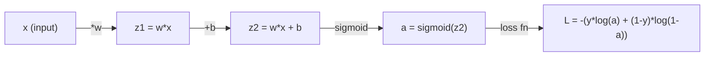
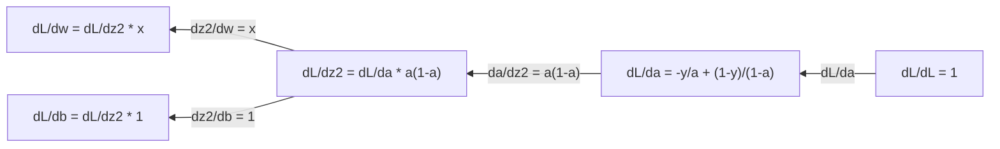
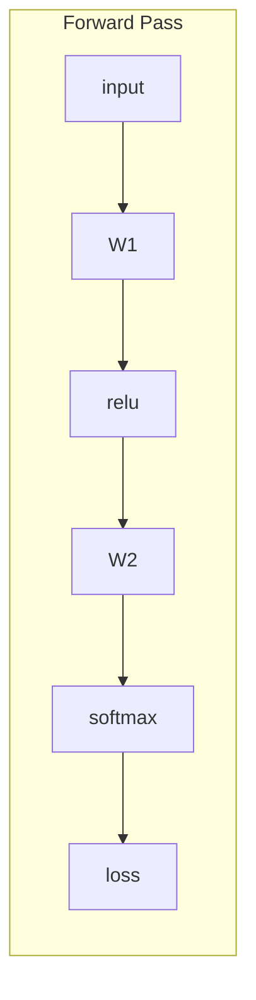
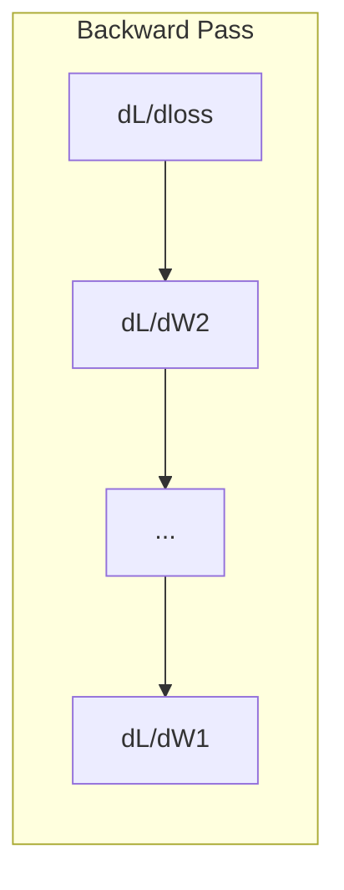

# 机器学习中的微积分

> 导体告诉你哪个方向下坡. 这就是神经网络需要学习的.

> 导数告诉你哪边是下坡方向这是神经网络学习所需的一切.

**Type:** Learn | **类型:** 学习
**Language:**子**语言:**字符串
**Prerequisites:** Phase 1, Lessons 01-03 | **前置知识:** Phase 1, Lessons 01-03
**Time:** ~60 minutes | **时间:** ~60 分钟

## 学习目标

- 计算常见ML函数的数值和分析衍生物 (x^2,sigmoid,跨)
  计算常见 ML 函数(x^2、sigmoid、交叉) 的数值导数和解析导数
- 实现从零开始降梯度,以减少1D和2D中的损失函数
  从零实现梯度下降,在1D和2D中最小化损失函数
- 导出线性回归模型的梯度,并通过手动重量更新训练它
  推导线性回归模型的梯度,并通过手动权重更新进行训练
- 解释赫西矩阵,泰勒系列近似和它们与优化方法的联系
  解释赫西式矩阵、泰勒级数近似及其与优化方法的联系

> **【中文解读】**
> 导数告诉你"往哪个方向走可以让差异变小"――神经网络有数百万个参数,每个参数都是一个"旋转",微积分告诉你每个旋转应该往哪个方向调调――梯度下降就是沿着导数反方向一步走到最小值――

> **【拓展：微积分与神经网络】**
> - **梯度下降**网络训练的核心算法 沿梯度反向更新参数.
> - **SGD/Adam**随着人类的发展,人类的发展也开始变得更加稳定.
> - **学习率**梯度下降的步长――太大则跳过最小值,太小则收太慢――

## 问题 问题引入

> **【中文解读】**微积分告诉你答案:导数 (导数) = 每个权重对差异的影响方向和大小.

## 概念的核心概念

> **【拓展：偏导数就是"只动一个旋钮看效果"]**神经网络的损失函数 L(w1,w2, ..., wn) 有百万个变量.偏导数 ∂L/∂w_i 告诉你"只改变一个权重,损失变化多少"――梯度就是把所有偏导数组合成一个向量,指向"最的上坡方向",所以沿负梯度走就是最快的下坡路――

### 导数是什么?

衍生值测量变化速度.对于函数 y = f(x,衍生值 f'(x) 告诉你:如果你推出 x 微小的数量, y 变化多少?

> 导数量量量变化率──对于函数 y = f(x),导数 f'(x) 告诉你:如果 x 微小变化,y 变化多少?

几何学上,衍生品是线在某个点上的斜率.

> 几何上,导数是某个点切线的斜率.

**f(x) = x^2:**

| x | f(x) | f'(x) (slope) |
|---|------|---------------|
| 0 | 0    | 0 (flat, at the bottom) |
| 1 | 1    | 2 |
| 2 | 4    | 4 (tangent line slope at this point) |
| 3 | 9    | 6 |

在 x=2 时,斜率是 4. 如果把 x 移动到右边, y 增加了4倍左右.在 x=0,斜率是 0.

> 在 x=2 处,斜率为 4 ⋅如果你将 x 向右移动一点, y 大约增加该移动量的 4 倍⋅在 x=0 处,斜率为 0 ⋅你正处于"碗底"⋅

官方定义:

```
f'(x) = lim   f(x + h) - f(x)
        h->0  -----------------
                     h
```

在代码中,你跳过了极限,只使用一个非常小的h.

> 在代码中,跳过极限,直接使用很小的h来近似.

### 部分衍生品:一次性变量

实际函数有很多输入.神经网络损失取决于数千个权重. 一个部分衍生物保持除一个变量以外的所有变量是恒定的,然后取出与那个变量相对于的衍生物.

> 真实函数有多个输入. 神经网络损失函数依赖于数千个权重.偏导数保持其他变量不变,只对一个变量寻求导向.

```
f(x, y) = x^2 + 3xy + y^2

df/dx = 2x + 3y     (treat y as a constant)
df/dy = 3x + 2y     (treat x as a constant)
```

如果我推出这只重量,损失会如何改变?

> 每个偏向数回答:如果我只拨动这个权重,损失变化多少?

### 梯度:所有部分衍生物的向量

梯度将每个部分衍生物集成成一个向量.对于函数 f ((x, y, z),梯度是:

> 梯度把所有的偏导数集合成一个向量――对于函数 f ((x, y, z),梯度为:

```
grad f = [ df/dx, df/dy, df/dz ]
```

梯指向最的升方向.

> 梯度指向最上升方向.要最小化函数,就沿着相反方向走.

**Contour plot of f(x,y) = x^2 + y^2:**

函数形成一个碗形状,以圆为轮线.最小值为 (0, 0).

> 这个函数形成一个碗形状,等高线是同心圆.最小值在 (0, 0) ⋅

| Point | grad f | -grad f (descent direction) |
|-------|--------|----------------------------|
| (1, 1) | [2, 2] (points uphill, away from minimum) | [-2, -2] (points downhill, toward minimum) |
| (0, 0) | [0, 0] (flat, at the minimum) | [0, 0] |

> 梯度方向指向最上坡,负梯度方向指向最下坡,即向最小值.

这就是图像中的梯度下降.

> 这就是梯度下降图.

### 优化的联系

训练一个神经网络是优化.你有一个损失函数 L ((w1, w2, ..., wn) 测量模型是多么错误.你想尽量减少它.

> 训练神经网络就是优化――损失函数 L(w1,w2, ..., wn) 衡量模型有多"错",你要最小化它――

```
Gradient descent update rule:

  w_new = w_old - learning_rate * dL/dw

For every weight:
  1. Compute the partial derivative of loss with respect to that weight
  2. Subtract a small multiple of it from the weight
  3. Repeat
```

> 梯度下降规则:新权重 = 旧权重 - 学习率 × 梯度──重复:1) 计算每个权重的偏导数;2) 从权重减去它的一个小倍数;3) 代数百万次──

学习速度控制了步骤的尺寸,太大,你超越了,太小,你爬行了.

> 学习率控制步长――太大则跳过最小值,太小则收太慢――

**Loss landscape (1D slice):**

损失函数 L ((w) 随着w重量的变化,形成一个曲,具有峰值和谷口.

> 损失函数 L(w) 随权重变化形成带峰和谷的曲线──

| Feature | Description |
|---------|-------------|
| Global minimum | The lowest point on the entire curve -- the best solution |
| Local minimum | A valley that is lower than its neighbors but not the lowest overall |
| Slope | Gradient descent follows the slope downhill from any starting point |

> 全局最小值是整条曲线的最低点;局部最小值是邻居中较低但不是全局最低的山谷;梯度从任意起点沿斜坡下行下行下降.

渐进下降跟随坡坡下坡. 它可能会被局部最小限制限制,但在高维空间 (数百万重量) 中,这很少是实际的问题.

> 梯度下降沿坡下行──可能陷入局部最小值,但在高维空间中,这很少成为实际问题──

### 数字与分析衍生品

计算衍生值有两种方法.

> 计算导数有两种方法.

分析:手动应用计算规则.为 f  x = x^2,衍生式是 f  x = 2x. 正确.快.

> 解析法:手动应用微积分规则──如 f(x) = x^2 的导数是 f'(x) = 2x──精确且快速──

计算 f ((x+h) 和 f ((x-h) 为一个小 h,然后使用差异.

> 数值法:用定义近似──计算 f(x+h) 和 f(x-h),用差值除以2h──

```
Numerical (central difference):

f'(x) ~= f(x + h) - f(x - h)
          -----------------------
                  2h

h = 0.0001 works well in practice
```

数学衍生品较慢,但适用于任何函数.分析衍生品是快速的,但需要你衍生公式.神经网络框架采用第三种方法:自动差异化,它将精确衍生品进行机械计算.

> 数值导数较慢,但适用于任何函数.

### 简单函数的手动衍生品

这些衍生品,你会在ML中看到一次又一次.

> 这些是你将在ML中反复见到的导数.

```
Function        Derivative       Used in
--------        ----------       -------
f(x) = x^2     f'(x) = 2x      Loss functions (MSE)
f(x) = wx + b  f'(w) = x        Linear layer (gradient w.r.t. weight)
                f'(b) = 1        Linear layer (gradient w.r.t. bias)
                f'(x) = w        Linear layer (gradient w.r.t. input)
f(x) = e^x     f'(x) = e^x     Softmax, attention
f(x) = ln(x)   f'(x) = 1/x     Cross-entropy loss
f(x) = 1/(1+e^-x)  f'(x) = f(x)(1-f(x))   Sigmoid activation
```

对于 f ((x) = x^2:

```
f(x) = x^2    f'(x) = 2x

  x    f(x)   f'(x)   meaning
  -2    4      -4      slope tilts left (decreasing)
  -1    1      -2      slope tilts left (decreasing)
   0    0       0      flat (minimum!)
   1    1       2      slope tilts right (increasing)
   2    4       4      slope tilts right (increasing)
```

> 在 x<0 时导数为负数递减),x=0 时导数为零(达到最小值),x>0 时导数为正数递增) ⋅

对于 f(w) = wx + b 与 x=3, b=1:

```
f(w) = 3w + 1    f'(w) = 3

The derivative with respect to w is just x.
If x is big, a small change in w causes a big change in output.
```

> 对于w 求导结果就是x 本质性.如果x 很大,w 的微小变化会导致输出的巨大变化.

### 链条规则

当函数组合时,链条规则告诉你如何区分.

> 当函数复合时,链式法则告诉你如何求导.

```
If y = f(g(x)), then dy/dx = f'(g(x)) * g'(x)

Example: y = (3x + 1)^2
  outer: f(u) = u^2       f'(u) = 2u
  inner: g(x) = 3x + 1    g'(x) = 3
  dy/dx = 2(3x + 1) * 3 = 6(3x + 1)
```

神经网络是函数的链接:输入 -> 直线 -> 激活 -> 直线 -> 激活 -> 损失.反扩散是从输出到输入中反复应用的链条规则.这是整个算法.

> 神经网络是函数链:输入 -> 线性 -> 激活 -> 线性 -> 激活 -> 损失──反向传播就是从输出到输入反复应用链式法则──这就是整个算法──

### 赫西亚矩阵

梯度告诉你斜率,赫西亚式告诉你曲率.

> 梯度告诉你斜率,Hessian矩阵告诉你曲率.

赫西亚式是二级部分衍生物的矩阵.对于函数 f ((x1, x2, ..., xn),赫西亚式的输入 (i, j) 是:

> 对于函数 f ((x1, x2, ..., xn), 赫西安的第 (i, j) 项是∂2f/∂∂x_i ∂x_j) ⋅

```
H[i][j] = d^2f / (dx_i * dx_j)
```

对于2变量函数 f ((x,y):

```
H = | d^2f/dx^2    d^2f/dxdy |
    | d^2f/dydx    d^2f/dy^2 |
```

**What the Hessian tells you at a critical point (where gradient = 0):**

> 西安在临界点 (梯度为0处) 告诉你:是否是局部最小值,局部最大值还是点.

| Hessian property | Meaning | Example surface |
|-----------------|---------|-----------------|
| Positive definite (all eigenvalues > 0) | Local minimum | Bowl pointing up |
| Negative definite (all eigenvalues < 0) | Local maximum | Bowl pointing down |
| Indefinite (mixed eigenvalues) | Saddle point | Horse saddle shape |

> 正定(所有特征值 > 0) = 局部最小值;负定(所有特征值 < 0) = 局部最大值;不定(特征值有正有负) = 点。

**Example:**f(x,y) = x^2 - y^2 (一个车函数)

```
df/dx = 2x       df/dy = -2y
d^2f/dx^2 = 2    d^2f/dy^2 = -2    d^2f/dxdy = 0

H = | 2   0 |
    | 0  -2 |

Eigenvalues: 2 and -2 (one positive, one negative)
--> Saddle point at (0, 0)
```

比较 f ((x, y) = x^2 + y^2 (一个碗):

```
H = | 2  0 |
    | 0  2 |

Eigenvalues: 2 and 2 (both positive)
--> Local minimum at (0, 0)
```

**Why the Hessian matters in ML:**

> 赫西安在 ML 中为何重要:牛顿法使用赫西安修改梯度方向,使方向走小步、平坦方向走大步,从而比梯度下降更快收──

牛顿的方法使用赫西式来采取比梯度下降更好的优化步骤.

```
Newton's update:    w_new = w_old - H^(-1) * gradient
Gradient descent:   w_new = w_old - lr * gradient
```

> 牛顿更新:w_new = w_old - H−1 ×梯度――它用曲率重新缩放梯度――

牛顿的方法更快地接近,因为赫西式"再加速度"的梯度 - - 方向得到更小的步骤,平方向得到更大的步骤.

> 牛顿法收更快,因为赫西亚语"重新缩放"梯度方向走小步,平坦方向走大步.

对于一个具有N参数的神经网络,赫西亚式是N xN.一个拥有100万参数的模型需要一个1万亿参数的矩阵.

> 问题在于:N个参数网络,Hessian 是N×N──百万参数模型需要万亿规模矩阵

| Method | What it uses | Cost | Convergence |
|--------|-------------|------|-------------|
| Gradient descent | First derivatives only | O(N) per step | Slow (linear) |
| Newton's method | Full Hessian | O(N^3) per step | Fast (quadratic) |
| L-BFGS | Approximate Hessian from gradient history | O(N) per step | Medium (superlinear) |
| Adam | Per-parameter adaptive rates (diagonal Hessian approx) | O(N) per step | Medium |
| Natural gradient | Fisher information matrix (statistical Hessian) | O(N^2) per step | Fast |

> 不同优化器对比:梯度下降只使用一阶导数(O(N),慢);牛顿法用完整的赫西安(O(N3),快但太贵);L-BFGS用梯度历史近似的赫西安;亚当用对角赫西安近似做每参数自适应;自然梯度用捕鱼鱼信息矩阵。

在实践中,亚当是深度学习的默认优化器.它通过追踪每参数的运行平均和梯度变化,便宜地接近二级信息.

> 实际上,亚当是深度学习的默认优化器. 它通过跟踪每个参数梯度的平均值和方差,便宜地近似二阶信息.

### 泰勒系列近似

任何平滑函数可以通过多项式在本地进行近似:

> 任何平滑函数都可以在局部使用多项式近似这是泰勒级数.

```
f(x + h) = f(x) + f'(x)*h + (1/2)*f''(x)*h^2 + (1/6)*f'''(x)*h^3 + ...
```

接近的方法越好,但只有在 x 点附近.

> 包含的项越多,近似越好但只有效在 x 附近.

**Why Taylor series matter for ML:**

- **First-order Taylor = gradient descent.**当你使用 f(x + h) ~ f(x) + f'(x) *h,你正在做一个线性近似.渐进下降将这个线性模型最小化,选择h = -lr * f'(x.

- **Second-order Taylor = Newton's method.**使用 f(x + h) ~ f(x) + f'(x) *h + (1/2) *f'(x) *h^2,你得到一个方形模型.最小化它会得到 h = -f'(x) /f'(x) - 牛顿的步骤.

- **Loss function design.**它们的Taylor扩展是很好的. 这不是意外. 流的损失使得优化可以预测.

> 泰勒级数在ML中意义:一阶 Taylor = 线性近似 = 梯度下降;二阶 Taylor = 二次近似 = 牛顿法;MSE 和交叉的平滑性不是巧合的平滑损失让优化可预测──

```
Approximation order    What it captures    Optimization method
-------------------    -----------------   -------------------
0th order (constant)   Just the value      Random search
1st order (linear)     Slope               Gradient descent
2nd order (quadratic)  Curvature           Newton's method
Higher orders          Finer structure     Rarely used in ML
```

> 近似阶数与优化方法:0 阶只用值(随机搜索);1 阶用斜率(梯度下降);2 阶用曲率(牛顿法);更高阶在ML中很少使用──

关键见解:所有基于梯度的优化实际上是将损失函数在本地接近,

> 关键洞见:所有基于梯度的优化本质上都在局部近似损失函数上,然后走到这个近似极小值点.

### 在ML中的整体

导数告诉你变化率.整体计算积累 - - 曲线下的区域.

> 导数告诉你变化率,积分计算累积

在ML中,你很少手动计算整体,

> 在 ML 中你很少手数积分,但积分概念无处不在:

**Probability.**对于密度p(x的连续随机变量:
```
P(a < X < b) = integral from a to b of p(x) dx
```
在a和b之间的概率密度曲线下的区域是该范围的降落概率.

> **概率**对于连续随机变量,密度函数 p(x) 在 [a,b] 区间的积分就是落在此区间的概率.

**Expected value.**根据概率权重的平均结果:
```
E[f(X)] = integral of f(x) * p(x) dx
```
预期的数据分布损失是不可或缺的.

> **期望**增加权平均――数据分布的预期损失就是一个积分,训练最小化它的经验近似――

**KL divergence.**测量两种分布的不同程度:
```
KL(p || q) = integral of p(x) * log(p(x) / q(x)) dx
```
在 VAEs,知识蒸和贝叶斯推理中使用.

> **KL 散度**测量两个分布差异.

**Normalization constants.**在贝叶斯推理中:
```
p(w | data) = p(data | w) * p(w) / integral of p(data | w) * p(w) dw
```
变量值是所有可能参数值的整体. 它通常是难以解决的,这就是为什么我们使用MCMC和变量推理等近似.

> **归一化常数**在贝叶斯推理中,分母是对所有可能参数值的积分,通常无法解析计算.

| Integral concept | Where it appears in ML |
|-----------------|----------------------|
| Area under curve | Probability from density functions |
| Expected value | Loss functions, risk minimization |
| KL divergence | VAEs, policy optimization, distillation |
| Normalization | Bayesian posteriors, softmax denominator |
| Marginal likelihood | Model comparison, evidence lower bound (ELBO) |

> 积分概念在 ML 中体现:曲线下面积(密度函数求概率) 期望(损失函数) 、KL 散度(VAE/蒸) 、归结(贝叶斯后验/软max 分母) 、边际似然(模型比较/ELBO) ⋅

### 在计算图中多变量链条规则

链条规则不仅适用于线路中的规模函数.在神经网络中,变量扩展和合并.以下是衍生品通过简单的前进传递流动的方式:

> 多变量链式法则不仅适用于线性标量函数. 在神经网络中,变量会分叉和汇合. 下面是导数如何在一个简单的前向传播中流动:



后行计算右到左的梯度:



每个箭头乘以本地衍生值.任何参数的梯度是从损失到参数的路径沿线的所有本地衍生值的产量.当路径分支和合并时,你将贡献的数量 (多变链规则).

> 每条箭头乘以局部导数――任何参数的梯度=从损失到参数路径上的所有局部导数的乘积――当路径分叉和汇合时,需要把各个贡献求和多链式法则)

这就是反向传播:通过计算图系统地应用的链条规则,从输出到输入.

> 反向传播的全部是:在计算图中从输出到输入系统化应用链式法则.

### 雅可比矩阵

当函数将向量映射到向量 (如神经网络层),其衍生物是矩阵. 雅可比安包含每个输出和每个输入的每个部分衍生物.

> 当函数把向量映射到向量 (如神经网络层),它的导数是一个矩阵雅哥文包含每个输出对每个输入的偏导数.

对于f:R^n ->R^m,雅可比亚J是一个m x n矩阵:

> 对于f:R^n →R^m,Jacobian J 是一个m × n矩阵:

| | x1 | x2 | ... | xn |
|---|---|---|---|---|
| f1 | df1/dx1 | df1/dx2 | ... | df1/dxn |
| f2 | df2/dx1 | df2/dx2 | ... | df2/dxn |
| ... | ... | ... | ... | ... |
| fm | dfm/dx1 | dfm/dx2 | ... | dfm/dxn |

对于神经网络,你不会手动计算Jacobians. PyTorch处理它. 但知道它存在,有助于你理解后延伸的形状:如果一个层映射R^n到R^m,它的Jacobian是m x n.梯度通过这个矩阵的转移流向后.

> 你不会算神经网络的JacobianPyTorch自动处理.但是知道它的存在可以帮助你理解反向传播中的形状:如果层把R^n映射到R^m,其Jacobian是m×n,梯度通过它的转移反向流动.

### 为什么这对神经网络很重要

任何神经网络中的重量都得到一个梯度.梯度告诉你如何调整重量以减少损失.

> 网络中每个权重都有一个梯度,告诉你如何调整权重以减少损失.





每次重量更新:
- `W1 = W1 - lr * dL/dW1`
- `W2 = W2 - lr * dL/dW2`

> 每个权重更新:W = W - lr × dL/dW──前向计算预测和损失,反向计算每一个权重的梯度,每一个权重沿着梯度负方向走一小步──

进步计算了预测和损失. 倒退的通过计算了损失的梯度与每一个重量. 然后每一个重量都会下坡一步. 重复数百万步. 这就是深度学习.

> 转向传播计算预测和损失,反向传播计算每个权重的梯度,然后每个权重沿着梯度负方向走一小步――重复数百万次――这就是深度学习――

## 建立它,实现它.
```figure
derivative-tangent
```

## 建立它

### 步骤1:从零开始的数值衍生

```python
def numerical_derivative(f, x, h=1e-7):
    return (f(x + h) - f(x - h)) / (2 * h)

def f(x):
    return x ** 2

for x in [-2, -1, 0, 1, 2]:
    numerical = numerical_derivative(f, x)
    analytical = 2 * x
    print(f"x={x:2d}  f'(x) numerical={numerical:.6f}  analytical={analytical:.1f}")
```

> 用中心差分法实现数值导数──h=1e-7通常足够精确──结果与解析导数高度相符──

数字衍生式与分析的一个相匹配,

> 数值导数和解析导数在小数点后多个位置保持一致,验证了中心差分公式的正确性.

### 步骤2:部分衍生品和梯度

```python
def numerical_gradient(f, point, h=1e-7):
    gradient = []
    for i in range(len(point)):
        point_plus = list(point)
        point_minus = list(point)
        point_plus[i] += h
        point_minus[i] -= h
        partial = (f(point_plus) - f(point_minus)) / (2 * h)
        gradient.append(partial)
    return gradient

def f_multi(point):
    x, y = point
    return x**2 + 3*x*y + y**2

grad = numerical_gradient(f_multi, [1.0, 2.0])
print(f"Numerical gradient at (1,2): {[f'{g:.4f}' for g in grad]}")
print(f"Analytical gradient at (1,2): [2*1+3*2, 3*1+2*2] = [{2*1+3*2}, {3*1+2*2}]")
```

> 数值梯度:对每个维度独立地用中心差分求偏导,组合成梯度向量――验证 f(x,y) =x2+3xy+y2 在 (1,2) 处的梯度为 [8, 7]──

### 步骤3: 渐进下降,以找到最小的 f ((x) = x^2

```python
x = 5.0
lr = 0.1
for step in range(20):
    grad = 2 * x
    x = x - lr * grad
    print(f"step {step:2d}  x={x:8.4f}  f(x)={x**2:10.6f}")
```

从x=5开始,每个步骤都接近x=0 (最小).

> 从 x=5 出发,每步都更接近 x=0 ((最小值) ⋅学习率0.1 让 x 逐步缩小到接近 0──

### 步骤4: 2D函数上的渐进下降

```python
def f_2d(point):
    x, y = point
    return x**2 + y**2

point = [4.0, 3.0]
lr = 0.1
for step in range(30):
    grad = numerical_gradient(f_2d, point)
    point = [p - lr * g for p, g in zip(point, grad)]
    loss = f_2d(point)
    if step % 5 == 0 or step == 29:
        print(f"step {step:2d}  point=({point[0]:7.4f}, {point[1]:7.4f})  f={loss:.6f}")
```

> 2D 梯度下降:从 (4, 3) 出发,每步更新点 -= lr × grad,逐步收到 (0, 0) ⋅

### 步骤5:数值和分析衍生品的比较

```python
import math

test_functions = [
    ("x^2",      lambda x: x**2,          lambda x: 2*x),
    ("x^3",      lambda x: x**3,          lambda x: 3*x**2),
    ("sin(x)",   lambda x: math.sin(x),   lambda x: math.cos(x)),
    ("e^x",      lambda x: math.exp(x),   lambda x: math.exp(x)),
    ("1/x",      lambda x: 1/x,           lambda x: -1/x**2),
]

x = 2.0
print(f"{'Function':<12} {'Numerical':>12} {'Analytical':>12} {'Error':>12}")
print("-" * 50)
for name, f, df in test_functions:
    num = numerical_derivative(f, x)
    ana = df(x)
    err = abs(num - ana)
    print(f"{name:<12} {num:12.6f} {ana:12.6f} {err:12.2e}")
```

> 对 x=2处的 5 种常见函数的数值导数和解析导数:x2、x3、sin(x)、e^x、1/x──误差通常在 1e-10 量级,验证数值方法的正确性──

### 步骤 6: 数字计算赫西语

```python
def hessian_2d(f, x, y, h=1e-5):
    fxx = (f(x + h, y) - 2 * f(x, y) + f(x - h, y)) / (h ** 2)
    fyy = (f(x, y + h) - 2 * f(x, y) + f(x, y - h)) / (h ** 2)
    fxy = (f(x + h, y + h) - f(x + h, y - h) - f(x - h, y + h) + f(x - h, y - h)) / (4 * h ** 2)
    return [[fxx, fxy], [fxy, fyy]]

def saddle(x, y):
    return x ** 2 - y ** 2

def bowl(x, y):
    return x ** 2 + y ** 2

H_saddle = hessian_2d(saddle, 0.0, 0.0)
H_bowl = hessian_2d(bowl, 0.0, 0.0)
print(f"Saddle Hessian: {H_saddle}")  # [[2, 0], [0, -2]] -- mixed signs
print(f"Bowl Hessian:   {H_bowl}")    # [[2, 0], [0, 2]]  -- both positive
```

> 数值计算 赫西亚矩阵:fxx、fyy 是二阶偏导,fxy 是混合偏导,点函数 x2-y2 的赫西亚是 [[2,0],[0,-2]](一正一负=点),碗形 x2+y2 是 [[2,0],[0,2]](均正=最小值)。

座函数的Hessian有2和 -2的本值 (混合符号,确认座点). 碗有2和2的本值 (两者都是正值,确认最小值).

> 点函数的赫西亚特征值是2 和 -2(一正一负,确认为点);碗形函数的赫西亚特征值都是2(均正,确认为最小值)。

### 步骤7:泰勒近似在行动中

```python
import math

def taylor_approx(f, f_prime, f_double_prime, x0, h, order=2):
    result = f(x0)
    if order >= 1:
        result += f_prime(x0) * h
    if order >= 2:
        result += 0.5 * f_double_prime(x0) * h ** 2
    return result

x0 = 0.0
for h in [0.1, 0.5, 1.0, 2.0]:
    true_val = math.sin(h)
    t1 = taylor_approx(math.sin, math.cos, lambda x: -math.sin(x), x0, h, order=1)
    t2 = taylor_approx(math.sin, math.cos, lambda x: -math.sin(x), x0, h, order=2)
    print(f"h={h:.1f}  sin(h)={true_val:.4f}  order1={t1:.4f}  order2={t2:.4f}")
```

> 泰勒近似实战:在 x0=0 处使用一阶段和二阶段泰勒近似罪(h) ・h=0.1 时近似精度极高,h=2 时偏差很大──这是梯度下降需要小学习率的数学根源──

接近x0=0, sin(x) ~ x (第一级泰勒).对小h来说,近似非常好,但对大h来说,分解.这就是为什么梯度下降在小学习率下最好工作的原因 - - 每一步都假设线性近似是准确的.

> 在 x0=0 附近,sin(x) ≈ x(一阶段泰勒) ・h 小时近似精确,h 大时偏离 这就是为什么梯度下降需要小学习率(每步假设线性近似准确) ・

### 步骤8:为什么这对神经网络很重要

```python
import random

random.seed(42)

w = random.gauss(0, 1)
b = random.gauss(0, 1)
lr = 0.01

xs = [1.0, 2.0, 3.0, 4.0, 5.0]
ys = [3.0, 5.0, 7.0, 9.0, 11.0]

for epoch in range(200):
    total_loss = 0
    dw = 0
    db = 0
    for x, y in zip(xs, ys):
        pred = w * x + b
        error = pred - y
        total_loss += error ** 2
        dw += 2 * error * x
        db += 2 * error
    dw /= len(xs)
    db /= len(xs)
    total_loss /= len(xs)
    w -= lr * dw
    b -= lr * db
    if epoch % 40 == 0 or epoch == 199:
        print(f"epoch {epoch:3d}  w={w:.4f}  b={b:.4f}  loss={total_loss:.6f}")

print(f"\nLearned: y = {w:.2f}x + {b:.2f}")
print(f"Actual:  y = 2x + 1")
```

> 完整的线性回归训练循环:从随机权重 w、b 出发,对每个样本计算预测、误差、梯度 dw 和 db,然后更新参数──重复200轮后,模型自动学到 y = 2x + 1──这是所有深度学习训练循环的原型──

每个基于梯度的训练循环都遵循这个模式:预测,计算损失,计算梯度,更新权重.

> 每个基于梯度的训练循环都遵循这个模式:预测 → 计算损失 → 计算梯度 → 更新权重――这课实现了线性归归 y=2x+1的训练――

## 用它实现框架

通过NumPy,相同的操作更快,更简洁:

> 用NumPy 重写:同样运算更简洁更快――矢量化避免了Python循环,让梯度计算更高效――

```python
import numpy as np

x = np.array([1, 2, 3, 4, 5], dtype=float)
y = np.array([3, 5, 7, 9, 11], dtype=float)

w, b = np.random.randn(), np.random.randn()
lr = 0.01

for epoch in range(200):
    pred = w * x + b
    error = pred - y
    loss = np.mean(error ** 2)
    dw = np.mean(2 * error * x)
    db = np.mean(2 * error)
    w -= lr * dw
    b -= lr * db

print(f"Learned: y = {w:.2f}x + {b:.2f}")
```

> 编号向量化版本:用 `np.mean`替代Python 循环求平均,更快更简洁――矢量化是数值计算的核心优化技巧――

光器自动化了光计算,但更新循环是相同的.

> 你刚从零实现了梯度下降. PyTorch自动化了梯度计算,但更新循环完全相同.`w -= lr * dw`这一行永远不会改变.

## 练习题

1. 实施`numerical_second_derivative(f, x)`使用`numerical_derivative`检查到x^3的第二个衍生值在x=2是12.
   实现`numerical_second_derivative(f, x)`调用两次`numerical_derivative`△验证 x^3 在 x=2处的二阶导数为12──
2. 使用梯度下降,找到最小的f ((x,y) = (x - 3) ^2 + (y + 1) ^2.从 (0, 0) 开始.答案应该接近 (3, - 1).
   用梯度下降找 f(x,y) = (x - 3)2 + (y + 1)2 的最小值,从 (0, 0) 出发,应收到 (3, -1) 』
3. 增加动力在梯度下降循环:保持一个速度向量,积累过去梯度.比较与和没有动力的趋同速度在f ((x) = x^4 - 3x^2.
   给梯度下降循环加动量:维护一个累积过去梯度的速度向量──比较有无动量在 f(x) = x4 - 3x2 上的收速度──

## 关键词 快速查找表

| Term | What people say | What it actually means |
|------|----------------|----------------------|
| Derivative | "The slope" | The rate of change of a function at a point. Tells you how much the output changes per unit change in input. |
| Partial derivative | "Derivative of one variable" | The derivative with respect to one variable while all others are held constant. |
| Gradient | "Direction of steepest ascent" | A vector of all partial derivatives. Points in the direction that increases the function fastest. |
| Gradient descent | "Go downhill" | Subtract the gradient (times a learning rate) from the parameters to reduce the loss. The core of neural network training. |
| Learning rate | "Step size" | A scalar that controls how big each gradient descent step is. Too large: diverge. Too small: converge slowly. |
| Chain rule | "Multiply the derivatives" | The rule for differentiating composed functions: df/dx = df/dg * dg/dx. The mathematical basis of backpropagation. |
| Jacobian | "Matrix of derivatives" | When a function maps vectors to vectors, the Jacobian is the matrix of all partial derivatives of outputs with respect to inputs. |
| Numerical derivative | "Finite differences" | Approximating a derivative by evaluating the function at two nearby points and computing the slope between them. |
| Backpropagation | "Reverse-mode autodiff" | Computing gradients layer by layer from output to input using the chain rule. How neural networks learn. |
| Hessian | "Matrix of second derivatives" | The matrix of all second-order partial derivatives. Describes the curvature of a function. Positive definite Hessian at a critical point means local minimum. |
| Taylor series | "Polynomial approximation" | Approximating a function near a point using its derivatives: f(x+h) ~ f(x) + f'(x)h + (1/2)f''(x)h^2 + ... The basis for understanding why gradient descent and Newton's method work. |
| Integral | "Area under the curve" | The accumulation of a quantity over a range. In ML, integrals define probabilities, expected values, and KL divergence. |

> 术语速查:导数/斜率) 部分导数 (偏导数,固定其他变量) 梯度 (梯度) 梯度 (梯度) 梯度下降 (梯度下降,沿梯度负方向更新) 学习率 (学习率,步长) 链条规则 (链条法则,反向传播的数学基础) 科 (向量导数的导数矩阵) 数量导数/差分)  背传播 (反向传播,逐层链式)  西式二阶导矩阵,描述曲值,正值=最小率) 泰勒系列 (Taylor系列) 多个相似的项目 (图像) 定义 分数,概率/概率,概率/概率,分数,分数,分数,分数,分数,分数

## 继续阅读 继续阅读

- [3Blue1Brown: Essence of Calculus](https://www.3blue1brown.com/topics/calculus)- 导体,整体和链条规则的视觉直觉
- [Stanford CS231n: Backpropagation](https://cs231n.github.io/optimization-2/)- 如何通过神经网络层流动的梯度
