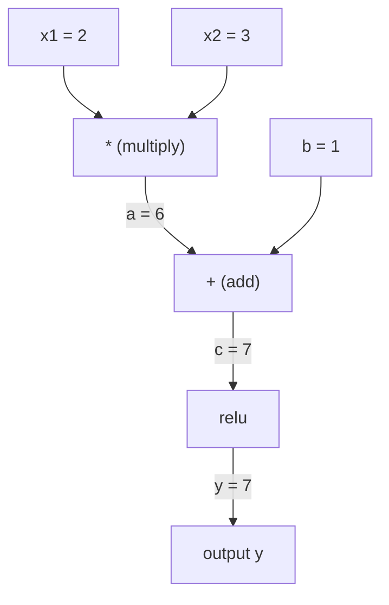
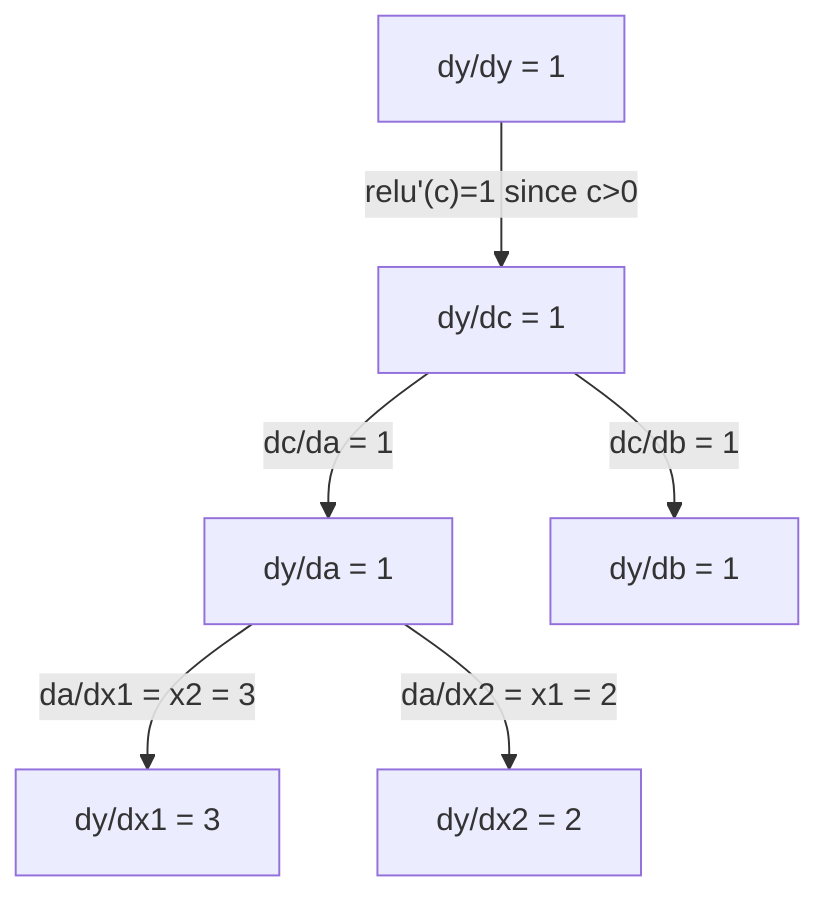

# 链条规则和自动区分

> 链条规则是学习的每个神经网络背后的引擎.

**Type:** Build | **类型:** 动手
**Language:**子**语言:**字符串
**Prerequisites:** Phase 1, Lesson 04 (Derivatives & Gradients) | **前置知识:** Phase 1, Lesson 04（导数与梯度）
**Time:** ~90 minutes | **时间:** ~90 分钟

## 学习目标

- 建立一个最小的自行调节引擎 (值类),通过反向模式自动调节记录操作和计算梯度
  构建最小化自行级 引擎(值类),记录运算并通过反向模式自动微分计算梯度
- 实现前后的通行通过使用拓类的计算图
  用拓排序实现计算图的前向和反向传播
- 通过使用从零开始的自动化发动机,在XOR上构建和训练多层的感知器
  仅使用零实现的自动化引擎构建并训练XOR上多层感知机
- 通过对数值有限差异进行梯度检查来验证自动调整的正确性
  用数值有限差分进行梯度检查,验证自动驾驶的正确性

> **【中文解读】**
> 链式法则是"函数套函数的导数怎么算"──神经网络就是几百个函数嵌套在一起:矩阵乘法→加偏置→激活函数→再矩阵乘法→软max→交叉──链式法则让你能够从最后层开始,逐层回计算每个参数的梯度 这就是反向传播──

> **【拓展：链式法则 → 反向传播 → PyTorch autograd】**
> 链式法则是反向传播的数学基础.`autograd`感应流的`GradientTape`它们自动追踪计算图,然后使用链式法则计算所有梯度.

## 问题 问题引入

网络是一个函数,它是数百个函数组成的:矩阵乘法,添加偏见,应用激活,矩阵再乘法,软max,交叉缩损失.输出是函数的函数.

> 你能计算简单函数的导数――但神经网络不是简单函数――它是数百个函数的复合:矩阵乘法加偏置、激活函数、再矩阵乘法、软max、交叉损失――输出是函数的函数――

为了训练网络,你需要对每一个重量进行减轻的梯度.手动完成这一过程对于数百万参数来说是不可能的.数量 (有限差异) 进行太慢.

> 为了训练网络,你需要损失每一个权重的梯度.

链条规则给你数学.自动分化给你算法. 它们一起让你通过任意的函数组成计算准确的梯度,在时间中与单个前进传递相比例.

> 链式法则给出数学,自动微分给出算法──两者结合,让你在与单次前向传播相当的时间内计算任意复合函数的精确梯度──

像 PyTorch, TensorFlow 和 JAX 一样,你将从零开始构建一个小型版本.

> 这就是PyTorch、TensorFlow和JAX的工作方式.

> **【中文解读】**神经网络 = 函数的函数的函数――链式法则让你逐层解解复合函数的导数:dL/dw = dL/d_out × d_out/d_hidden × d_hidden/d_w──自动求导把这个过程自动化PyTorch的`backward()`一行代码搞定数量数的梯度计算.

## 概念的核心概念

> **【拓展：自动求导是深度学习的引擎】**皮托尔奇的`loss.backward()`用反向模式自动求导:从输出往回,逐层应用链式法则──这比数值方法快百万倍──GPT-4有1.8亿参数,`backward()`一次就能计算出所有参数的梯度――没有自动导向,深度学习不可能处理如此巨大的模型――

### 链条规则

如果`y = f(g(x))`产品的衍生品`y`关于`x`是:

> 如果`y = f(g(x))`对于 x 的导数是:

```
dy/dx = dy/dg * dg/dx = f'(g(x)) * g'(x)
```

通过链接的衍生品,每个链接都会贡献其本地衍生品.

> 沿链路乘导数――每一步都贡献其局部导数――

举个例子:`y = sin(x^2)`

```
g(x) = x^2       g'(x) = 2x
f(g) = sin(g)     f'(g) = cos(g)

dy/dx = cos(x^2) * 2x
```

> 示例:y = sin(x2);;内层 g(x) = x2 的导数是2x,外层 f(g) = sin(g) 的导数是 cos(g),链式相乘:dy/dx = cos(x2) × 2x。

对于更深层次的作曲,链接延伸到:

```
y = f(g(h(x)))

dy/dx = f'(g(h(x))) * g'(h(x)) * h'(x)
```

> 更深的复合:y = f(g(h(x))),导数为 f'(g(h(x))) × g'(h(x)) × h'(x),每多一层就多乘一项。

网络中的每个层都是这个链中的一个环节.

> 网络的每一个层都是这个链条中的一个环节.

### 计算图表

计算图表使链条规则视觉化. 每个操作都变成节点. 数据通过图表向前流动.梯度向后流动.

> 计算图让链式法则可视化.每个操作变成一个节点,数据向前流动,梯度向后流动.

> 计算图是 PyTorch自动化的底层抽象:节点是运算,前向时存储中值,反向时计算局部梯度.

**Forward pass (compute values):**



**Backward pass (compute gradients):**



后行通过在每个节点上应用链条,从输出到输入的梯度传播.

> 反向传播在每个节点的应用链式法则,将从输出传播到输入的梯度.

### 前向模式与逆向模式

通过图表应用链条有两种方法.

> 通过计算图应用链式法则有两种方法.

**Forward mode**通过计算,它可以将其运用到`dx/dx = 1`只有一个输入,而且输出量很少.

> **前向模式**从输入开始向前推进导数――它计算`dx/dx = 1`通过每个操作传播.

```
Forward mode: seed dx/dx = 1, propagate forward

  x = 2       (dx/dx = 1)
  a = x^2     (da/dx = 2x = 4)
  y = sin(a)  (dy/dx = cos(a) * da/dx = cos(4) * 4 = -2.615)
```

**Reverse mode**开始于输出,然后拉向后梯度.`dy/dy = 1`并且通过每个操作反向传播.

> **反向模式**从输出开始到后拉回梯度.`dy/dy = 1`并且反向通过每个操作. 当输入多,输出少,适用.

```
Reverse mode: seed dy/dy = 1, propagate backward

  y = sin(a)  (dy/dy = 1)
  a = x^2     (dy/da = cos(a) = cos(4) = -0.654)
  x = 2       (dy/dx = dy/da * da/dx = -0.654 * 4 = -2.615)
```

神经网络有数百万的输入 (权重) 和一个输出 (损失).反向模式在一个倒退通道中计算所有梯度.这就是为什么反向传播使用反向模式.

> 神经网络有百万个输入 (权重) 和输出 (损失) ――反向模式一次反向传播就能计算所有梯度――这就是反向传播使用反向模式的原因――

| Mode | Seed | Direction | Best when |
|------|------|-----------|-----------|
| Forward | `dx_i/dx_i = 1` | Input to output | Few inputs, many outputs |
| Reverse | `dy/dy = 1` | Output to input | Many inputs, few outputs (neural nets) |

> 两种模式对比:前向模式种子 dx/dx = 1,输入到输出,适合少输入多输出;反向模式种子 dy/dy = 1,输出到输入,适合多输入少输出(神经网络) ⋅

### 双数字前进模式

双数模式可以以优雅的方式实现.`a + b*epsilon`在哪里`epsilon^2 = 0`现在,我们要去.

> 前向模式可以用偶数优雅地实现.`a + b*ε`在其中`ε² = 0`,我知道.

```
Dual number: (value, derivative)

(2, 1) means: value is 2, derivative w.r.t. x is 1

Arithmetic rules:
  (a, a') + (b, b') = (a+b, a'+b')
  (a, a') * (b, b') = (a*b, a'*b + a*b')
  sin(a, a')         = (sin(a), cos(a)*a')
```

> 对偶数:(值,导数) ・算术规则:加法对应分量相加;乘法用积的求导规则;sin 用链式规则――把输入的导数种子设为1,导数会自动通过每个运算传播――

通过每一个操作,衍生品自动扩散.

> 将输入变量的导数种子设为 1,导数会自动通过每个运算传播.

### 建造一个自动化发动机

一台自动化发动机需要三个东西:

1. **Value wrapping.**包装一个物体中的每个数字,
2. **Graph recording.**每个操作都记录其输入和本地梯度函数.
3. **Backward pass.**按地形排序图,然后逆行,在每个节点上应用链条.

> 汽车需要三件事:1.**数值包装**包装每个数字成存储值和梯度的对象;**图记录**操作记录其输入和局部梯度函数;**反向传播** 排序图,反向遍历,并应用每个节点链式法则.

这就是PyTorch的特点.`autograd`没有.`torch.Tensor`类包裹值,记录操作时`requires_grad=True`在电话中计算梯度`.backward()`现在,我们要去.

> 这正是Pytorch的.`autograd`做什么事.`torch.Tensor`包装数值,当 `requires_grad=True`时记录操作,调用 `.backward()`时计算梯度――

### 皮托尔奇自动化器在帽子下如何工作

当你写PyTorch代码时:

```python
x = torch.tensor(2.0, requires_grad=True)
y = x ** 2 + 3 * x + 1
y.backward()
print(x.grad)  # 7.0 = 2*x + 3 = 2*2 + 3
```

> 当你写 PyTorch 代码时:x 设需要_grad=True,运算自动记录,调用向后() 后 x.grad自动计算出梯度 7.0。

内部 PyTorch:

1. 创造了一个`Tensor`节点`x`随着`requires_grad=True`
2. 每次操作 (`**`现在`*`现在`+`) 创建一个新的节点并记录了后期函数
3. `y.backward()`引发反向模式自动通过记录的图表
4. 每个节点的`grad_fn`计算本地梯度并将它们传递到母节点
5. 度积聚在`.grad`通过添加 (而不是替代) 的属性

> 内部: 1) 为 x 创建电节点; 2) 每个运算; 3) 创建新节点并记录反向函数; 3) y.backward; 4) 触发反向自动微分; 4) 每节点的 grad_fn 计算局部梯度并传给父节点; 5) 梯度通过加法累积到 .grad 属性(不是替代)

图表是动态 (定义-by-run).每次前进传输都建立了一个新的图表.这就是为什么PyTorch支持模型内部的控制流 (如果/否则,循环).

> 计算图是动态的 (如果/否则、循环) 原因.

## 建立它,实现它.
```figure
chain-rule
```

## 建立它

### 步骤1: 价值类

```python
class Value:
    def __init__(self, data, children=(), op=''):
        self.data = data
        self.grad = 0.0
        self._backward = lambda: None
        self._prev = set(children)
        self._op = op

    def __repr__(self):
        return f"Value(data={self.data:.4f}, grad={self.grad:.4f})"
```

> 值类是自格级的核心数据结构.每个值存储数值,梯度,反向函数闭包和子节点指针.

每一个`Value`存储其数值数据,其梯度 (最初是零),一个倒退函数,并指向产生它的儿童节点.

> 每个`Value`存储数值、梯度(初始为零) 、反向函数和产生它的子节点指针──

### 步骤2: 梯度跟踪的算术操作

```python
    def __add__(self, other):
        other = other if isinstance(other, Value) else Value(other)
        out = Value(self.data + other.data, (self, other), '+')
        def _backward():
            self.grad += out.grad
            other.grad += out.grad
        out._backward = _backward
        return out

    def __mul__(self, other):
        other = other if isinstance(other, Value) else Value(other)
        out = Value(self.data * other.data, (self, other), '*')
        def _backward():
            self.grad += other.data * out.grad
            other.grad += self.data * out.grad
        out._backward = _backward
        return out

    def relu(self):
        out = Value(max(0, self.data), (self,), 'relu')
        def _backward():
            self.grad += (1.0 if out.data > 0 else 0.0) * out.grad
        out._backward = _backward
        return out
```

每个操作都会创造一个结尾,它知道如何计算本地梯度,并乘以上游梯度 (`out.grad`它们是`+=`处理一个值在多次操作中使用的情况.

> 每个操作都创建一个闭包,知道如何计算局部梯度并乘以以上游梯度.`+=`处理一个值被多个操作使用情况

> 关键设计:加法的反向是1(梯度直接传给两个输入),乘法的反向是另一个操作数(链式法则:d(a*b)/da = b)。relu 的反向是0或1 ((取决于前向是否激活)。

### 步骤3: 倒车

```python
    def backward(self):
        topo = []
        visited = set()
        def build_topo(v):
            if v not in visited:
                visited.add(v)
                for child in v._prev:
                    build_topo(child)
                topo.append(v)
        build_topo(self)

        self.grad = 1.0
        for v in reversed(topo):
            v._backward()
```

拓类别确保每个节点的梯度在扩散到其子女之前得到充分计算.

> 拓排序确保每个节点的梯度在传播到子节点之前完全计算.

> 算法:先用递归构建拓序 (每节点出现所有依赖之后),再按拓序的逆序依次调用每个节点的 _ 逆序 (回调) .

### 步骤4:为完整的发动机提供更多操作

基本的值类处理加算,乘法和连接.一个真正的自动化引擎需要更多.

> 基础值类只支持加加乘 连续. 一个真正的自动化引擎需要更多操作:减法除法exp log tanh.

```python
    def __neg__(self):
        return self * -1

    def __sub__(self, other):
        return self + (-other)

    def __radd__(self, other):
        return self + other

    def __rmul__(self, other):
        return self * other

    def __rsub__(self, other):
        return other + (-self)

    def __pow__(self, n):
        out = Value(self.data ** n, (self,), f'**{n}')
        def _backward():
            self.grad += n * (self.data ** (n - 1)) * out.grad
        out._backward = _backward
        return out

    def __truediv__(self, other):
        return self * (other ** -1) if isinstance(other, Value) else self * (Value(other) ** -1)

    def exp(self):
        import math
        e = math.exp(self.data)
        out = Value(e, (self,), 'exp')
        def _backward():
            self.grad += e * out.grad
        out._backward = _backward
        return out

    def log(self):
        import math
        out = Value(math.log(self.data), (self,), 'log')
        def _backward():
            self.grad += (1.0 / self.data) * out.grad
        out._backward = _backward
        return out

    def tanh(self):
        import math
        t = math.tanh(self.data)
        out = Value(t, (self,), 'tanh')
        def _backward():
            self.grad += (1 - t ** 2) * out.grad
        out._backward = _backward
        return out
```

**Why each operation matters:**

| Operation | Backward rule | Used in |
|-----------|--------------|---------|
| `__sub__` | Reuses add + neg | Loss computation (pred - target) |
| `__pow__` | n * x^(n-1) | Polynomial activations, MSE (error^2) |
| `__truediv__` | Reuses mul + pow(-1) | Normalization, learning rate scaling |
| `exp` | exp(x) * upstream | Softmax, log-likelihood |
| `log` | (1/x) * upstream | Cross-entropy loss, log probabilities |
| `tanh` | (1 - tanh^2) * upstream | Classic activation function |

> 各操作的反向规则:减法复用加法+取负;用n*x^(n-1);除法复用乘法+(-1);exp用exp(x) ×上游;log用 (1/x) ×上游;tanh用 (1-tanh2) ×上游。

聪明的部分:`__sub__`其他`__truediv__`它们可以免费获得正确的梯度,因为链条规则通过底层的加/多/操作构成.

> 巧妙之处:`__sub__`和 `__truediv__`通过已有操作定义,所以梯度通过链式法则自动正确这是组合性的力量.

### 步骤5:从零开始的小型MLP

通过完整的值类,你可以建立一个神经网络. 没有 PyTorch. 没有 NumPy. 只有值和链条规则.

> 只有完整的价值类型,你可以构建神经网络――不用PyTorch、不用NumPy,只用价值和链式法则――这是卡帕蒂的微分级的精髓――

```python
import random

class Neuron:
    def __init__(self, n_inputs):
        self.w = [Value(random.uniform(-1, 1)) for _ in range(n_inputs)]
        self.b = Value(0.0)

    def __call__(self, x):
        act = sum((wi * xi for wi, xi in zip(self.w, x)), self.b)
        return act.tanh()

    def parameters(self):
        return self.w + [self.b]

class Layer:
    def __init__(self, n_inputs, n_outputs):
        self.neurons = [Neuron(n_inputs) for _ in range(n_outputs)]

    def __call__(self, x):
        return [n(x) for n in self.neurons]

    def parameters(self):
        return [p for n in self.neurons for p in n.parameters()]

class MLP:
    def __init__(self, sizes):
        self.layers = [Layer(sizes[i], sizes[i+1]) for i in range(len(sizes)-1)]

    def __call__(self, x):
        for layer in self.layers:
            x = layer(x)
        return x[0] if len(x) == 1 else x

    def parameters(self):
        return [p for layer in self.layers for p in layer.parameters()]
```

`Neuron`计算器`tanh(w1*x1 + w2*x2 + ... + b)` `Layer`它们是神经元的列表.`MLP`子子,每一个重量都是一个`Value`现在我在电话中`loss.backward()`它们将变 gradients 传播到每个参数.

> 一个`Neuron`计算`tanh(w1*x1 + w2*x2 + ... + b)`一个`Layer`是神经元列表.`MLP`堆叠多层――每个权重都是`Value`现在,我们要做什么?`loss.backward()`它们将扩散到每个参数.

**Training on XOR:**

> **在 XOR 上训练**是经典的非线性可分问题,单层感知机无法解决,必须使用至少一个隐藏层.

```python
random.seed(42)
model = MLP([2, 4, 1])  # 2 inputs, 4 hidden neurons, 1 output

xs = [[0, 0], [0, 1], [1, 0], [1, 1]]
ys = [-1, 1, 1, -1]  # XOR pattern (using -1/1 for tanh)

for step in range(100):
    preds = [model(x) for x in xs]
    loss = sum((p - y) ** 2 for p, y in zip(preds, ys))

    for p in model.parameters():
        p.grad = 0.0
    loss.backward()

    lr = 0.05
    for p in model.parameters():
        p.data -= lr * p.grad

    if step % 20 == 0:
        print(f"step {step:3d}  loss = {loss.data:.4f}")

print("\nPredictions after training:")
for x, y in zip(xs, ys):
    print(f"  input={x}  target={y:2d}  pred={model(x).data:6.3f}")
```

这是一个微级.纯Python中完整的神经网络训练循环,自动区分.

> 这就是微分. 通过纯字thon实现的完整神经网络训练循环和自动微分.

> 训练循环 5 步:1) 前向预测;2) 计算损失 (MSE);3) 清零所有参数梯度;4) 反向传播;5) 沿梯度负方向更新参数――这是Pytorch 训练循环的核心――

### 步骤 6: 渐进检查

如何知道你的自动变量是正确的? 比较它与数值衍生品.这是梯度检查.

> 如何知道你的自动驾驶是正确的?

```python
def gradient_check(build_expr, x_val, h=1e-7):
    x = Value(x_val)
    y = build_expr(x)
    y.backward()
    autodiff_grad = x.grad

    y_plus = build_expr(Value(x_val + h)).data
    y_minus = build_expr(Value(x_val - h)).data
    numerical_grad = (y_plus - y_minus) / (2 * h)

    diff = abs(autodiff_grad - numerical_grad)
    return autodiff_grad, numerical_grad, diff
```

试试一个复杂的表达式:

```python
def expr(x):
    return (x ** 3 + x * 2 + 1).tanh()

ad, num, diff = gradient_check(expr, 0.5)
print(f"Autodiff:  {ad:.8f}")
print(f"Numerical: {num:.8f}")
print(f"Difference: {diff:.2e}")
# Difference should be < 1e-5
```

> 测试复杂表达式:(x3 + 2x + 1) 的在 x=0.5 处的梯度中──自动变化 和数值导数的差异应 < 1e-5,验证反向传播实现正确──

对于实现新操作,渐进检查是必不可少的.如果你的后期通行有错误,数值检查会发现它.每一个认真的深度学习实现都在开发过程中进行渐进检查.

> 梯度检查在实现新操作时是必不可少的. 如果反向传播存在错误,数值检查可以发现.

**When to use gradient checking:**

| Situation | Do gradient check? |
|-----------|-------------------|
| Adding a new operation to your autograd | Yes, always |
| Debugging a training loop that won't converge | Yes, check gradients first |
| Production training | No, too slow (2x forward passes per parameter) |
| Unit tests for autograd code | Yes, automate it |

> 何时使用梯度检查:给自动化 加新操作(永远要);调试不收的训练循环(先查梯度);生产训练(不要,太慢);自动化 单元测试(自动化) ⋅

### 步骤7:与手动计算进行验证

```python
x1 = Value(2.0)
x2 = Value(3.0)
a = x1 * x2          # a = 6.0
b = a + Value(1.0)    # b = 7.0
y = b.relu()          # y = 7.0

y.backward()

print(f"y = {y.data}")          # 7.0
print(f"dy/dx1 = {x1.grad}")   # 3.0 (= x2)
print(f"dy/dx2 = {x2.grad}")   # 2.0 (= x1)
```

> 手动验证:y = relu(x1*x2 + 1),因为 x1*x2 + 1 = 7 > 0,relu 是恒等映射──dy/dx1 = x2 = 3,dy/dx2 = x1 = 2──引擎计算结果完全匹配──

手动检查:`y = relu(x1*x2 + 1)`自从那以后`x1*x2 + 1 = 7 > 0`是个性.
`dy/dx1 = x2 = 3`现在,我们要去.`dy/dx2 = x1 = 2`发动机匹配.

## 用它实现框架

### 检查PyTorch

> 与PyTorch对比验证:使用火重写同样表达式,对比梯度结果.

```python
import torch

x1 = torch.tensor(2.0, requires_grad=True)
x2 = torch.tensor(3.0, requires_grad=True)
a = x1 * x2
b = a + 1.0
y = torch.relu(b)
y.backward()

print(f"PyTorch dy/dx1 = {x1.grad.item()}")  # 3.0
print(f"PyTorch dy/dx2 = {x2.grad.item()}")  # 2.0
```

发动机计算出与 PyTorch 的结果相同,因为数学是相同的:通过链条规则进行反向模式自动调节.

> 通过链式法则,反向模式自动微分.

## 运送它.

这一课产生了:
- `outputs/skill-autodiff.md`-- 建立和调试自动级系统的技能
- `code/autodiff.py`-- 您可以扩展的最小自动化引擎

> 本课产出:构建和调试自动化系统的技能文档 + 可扩展的最小自动化 引擎代码――

在此构建的值类是第三阶段神经网络训练循环的基础.

> 构建的值类是3阶段神经网络训练循环的基础.

### 更加复杂的表达

```python
a = Value(2.0)
b = Value(-3.0)
c = Value(10.0)
f = (a * b + c).relu()  # relu(2*(-3) + 10) = relu(4) = 4

f.backward()
print(f"df/da = {a.grad}")  # -3.0 (= b)
print(f"df/db = {b.grad}")  #  2.0 (= a)
print(f"df/dc = {c.grad}")  #  1.0
```

> 更复杂的表达式:relu(a*b + c) 在a=2,b=-3,c=10处,结果是relu(4) =4──df/da =b = -3,df/db =a =2,df/dc =1──

## 练习题

1. 加入`__pow__`运行到值类,以便您计算`x ** n`检查一下`d/dx(x^3)`在`x=2`相当于`12.0`现在,我们要去.
   给值 类添加`__pow__`让你能计算`x ** n`验证`d/dx(x^3)`在`x=2`处等于`12.0`,我知道.

2. 加入`tanh`检查一下`tanh'(0) = 1`其他`tanh'(2) = 0.0707`现在,我们要做什么?
   添加`tanh`激活函数──验证 `tanh'(0) = 1`没有任何`tanh'(2) ≈ 0.0707`,我知道.

3. 构建一个单个神经元的计算图:`y = relu(w1*x1 + w2*x2 + b)`计算五个梯度,并对 PyTorch 进行验证.
   为单个神经构建计算图:`y = relu(w1*x1 + w2*x2 + b)`△计算所有五个梯度并与 PyTorch 验证.

4. 实现前进模式自动调用使用双号码.`Dual`检查它与反向模式发动机相同的衍生品.
   用偶数实现前向模式自动微分.`Dual`类并验证它与你的反向模式引擎提供相同的导向.

## 关键词 快速查找表

| Term | What people say | What it actually means |
|------|----------------|----------------------|
| Chain rule | "Multiply the derivatives" | The derivative of composed functions equals the product of each function's local derivative, evaluated at the right point |
| Computational graph | "The network diagram" | A directed acyclic graph where nodes are operations and edges carry values (forward) or gradients (backward) |
| Forward mode | "Push derivatives forward" | Autodiff that propagates derivatives from inputs to outputs. One pass per input variable. |
| Reverse mode | "Backpropagation" | Autodiff that propagates gradients from outputs to inputs. One pass per output variable. |
| Autograd | "Automatic gradients" | A system that records operations on values, builds a graph, and computes exact gradients via the chain rule |
| Dual numbers | "Value plus derivative" | Numbers of the form a + b*epsilon (epsilon^2 = 0) that carry derivative information through arithmetic |
| Topological sort | "Dependency order" | Ordering graph nodes so every node comes after all its dependencies. Required for correct gradient propagation. |
| Gradient accumulation | "Add, don't replace" | When a value feeds into multiple operations, its gradient is the sum of all incoming gradient contributions |
| Dynamic graph | "Define by run" | A computation graph rebuilt on every forward pass, allowing Python control flow inside models (PyTorch style) |
| Gradient checking | "Numerical verification" | Comparing autodiff gradients against numerical finite-difference gradients to verify correctness. Essential for debugging. |
| MLP | "Multi-layer perceptron" | A neural network with one or more hidden layers of neurons. Each neuron computes a weighted sum plus bias, then applies an activation function. |
| Neuron | "Weighted sum + activation" | The basic unit: output = activation(w1*x1 + w2*x2 + ... + b). The weights and bias are learnable parameters. |

> 术语速查:链条规则,复合函数导数=各局部导数之积) 计算图,运算为节点有向无环图) 推进模式(前向模式,输入到输出传播导数) 逆向模式(反向模式,输出到输入传播梯度,即反向传播) 自動级 (PyTorch自动微分系统) 双数 (对偶数进行分类) 拓排序,依赖排序点) 梯度积累,加法不是替代) 动态下动图,前向图 (图) 检查,激活数量和重构数量 (图) 测量,激活数量和重构数量 (图) 测量和重构数量 (图) 测量

## 继续阅读 继续阅读

- [3Blue1Brown: Backpropagation calculus](https://www.youtube.com/watch?v=tIeHLnjs5U8)-- 视觉解释神经网络中的链条规则
- [PyTorch Autograd mechanics](https://pytorch.org/docs/stable/notes/autograd.html)实际系统是如何运作的
- [Baydin et al., Automatic Differentiation in Machine Learning: a Survey](https://arxiv.org/abs/1502.05767)-- 综合参考
