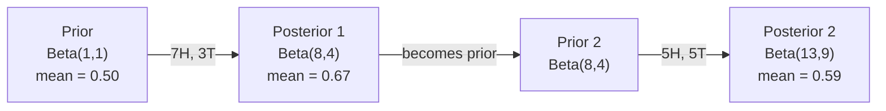

# 贝叶斯定理

> 概率是你预期的,贝叶斯定理是你学习的.
> 概率取决于你的期望.

**Type:** Build | **类型:** 动手
**Language:**子**语言:**字符串
**Prerequisites:** Phase 1, Lesson 06 (Probability Fundamentals) | **前置知识:** Phase 1, Lesson 06（概率基础）
**Time:** ~75 minutes | **时间:** ~75 分钟

## 学习目标

- 应用贝叶斯定理来计算后期概率从前,概率和证据
- 创建一个简单的贝叶斯文本分类器从零开始,使用拉普莱斯平滑和日志空间计算
- 比较MLE和MAP估计,并解释MAP如何与L2规范化相符
- 执行使用Beta-Binomial结合前列进行A/B测试的连续贝叶斯式更新

> **【中文解读】**
> 贝叶斯定理的核心思想:用新的证据更新你的信念――先验概率 (你原本的猜测) × 似然 (你原本的猜测)

> **【拓展：贝叶斯在 AI 中的位置】**
> - **朴素贝叶斯分类器**垃圾邮件过的经典算法,学习中文`GaussianNB`现在,我们要去.`MultinomialNB`,我知道.
> - **贝叶斯优化**为了超参数调优,比网格搜索高效得多.
> - **MAP 与正则化**根据贝叶斯的视角,这是"防止过拟合"的.

## 问题 问题引入

> **【中文解读】**一个医学检查准确率99%,你测出阳性,实际病率是多少?直觉说99%,但使用贝叶斯定理计算可能只有50%因为首先要考虑"先验概率" (发病率有多低) .贝叶斯定理教会我们:看新证据后如何更新信念.

## 概念的核心概念

> **【拓展：贝叶斯思维是 AI 的核心范式】**贝叶斯定理`P(假设|证据) = P(证据|假设) × P(假设) / P(证据)`在 AI 中无处不在:**朴素贝叶斯分类器**垃圾邮件过的经典方法;**贝叶斯优化**调超参数的高效方法 ((比网格搜索快 10倍);(3) **MAP = L2 正则化**根据Beijes的角度解释为什么正则化能过适应;**贝叶斯神经网络**现在,我知道,我不知道.

大多数人说99%.真实的答案取决于这种疾病是多么罕见.如果每1万人中有1人患有这种疾病,积极的结果只会给你患病的机会大约1%.其余的99%的积极结果是健康人发出的虚假警报.

> 大多数人说99%──真实答案取决于疾病有多罕见──如果万人中有一人患病,阳性结果只会给你约1%的患病概率──其余99%的阳性结果都是健康人的假阳性──

这不是一个诡计的问题.这是贝叶斯定理.每一个垃圾邮件过器,每一个医疗诊断,每一个测量不确定性的机器学习模型都使用了这个正确的推理.你从一个信念开始.你看到证据.你更新.

> 这不是脑筋急转──这是贝叶斯的定理──每一个垃圾邮件过器,每一个医疗诊断,每一个量化不确定性的 ML 模型都使用相同的推理:从信念中发出,看到证据,更新信念──

如果你没有理解这一点,就会误解模型输出,设定不好的门,

> 如果不理解这个问题就构建 ML 系统,你会误判模型输出,设置错误的值,发布过度自信的预测.

## 概念的核心概念

### 从联合概率到贝斯

根据第六课,你已经知道条件概率是:

> 你在第六课已经学过条件概率:

```
P(A|B) = P(A and B) / P(B)
```

并且对称:

```
P(B|A) = P(A and B) / P(A)
```

两个表达式都有相同的数值:P(A和B). 设置它们为等,然后重新排列:

> 两个表达式共享相同的分子:P(A和B)。将它们等同并重新排列:

```
P(A and B) = P(A|B) * P(B) = P(B|A) * P(A)

Therefore:

P(A|B) = P(B|A) * P(A) / P(B)
```

这就是贝叶斯定理,四个量,一个方程.

> 这就是贝叶斯定理.

### 它们的四部分

| Part | Name | What it means |
|------|------|---------------|
| P(A\|B) | Posterior / 后验 | Your updated belief about A after seeing evidence B / 看到证据 B 后对 A 的更新信念 |
| P(B\|A) | Likelihood / 似然 | How probable the evidence B is if A is true / 如果 A 为真，证据 B 出现的概率 |
| P(A) | Prior / 先验 | Your belief about A before seeing any evidence / 看到任何证据前对 A 的信念 |
| P(B) | Evidence / 证据 | Total probability of seeing B under all possibilities / 在所有可能情况下看到 B 的总概率 |

证据术语P(B) 作为一个正常化.你可以用总概率定律扩展它:

> 证据项 P(B) 作为归一化因子──可以用全概率公式展开:

```
P(B) = P(B|A) * P(A) + P(B|not A) * P(not A)
```

### 医疗检测的例子

检测结果是99%准确的 (检测结果是99%的病人,结果是1%的错误阳性).

> 检查确率99% 检查确诊率99% 假阳性率1%)

```
P(sick)          = 0.0001     (prior: disease is rare)
P(positive|sick) = 0.99       (likelihood: test catches it)
P(positive|healthy) = 0.01    (false positive rate)

P(positive) = P(positive|sick) * P(sick) + P(positive|healthy) * P(healthy)
            = 0.99 * 0.0001 + 0.01 * 0.9999
            = 0.000099 + 0.009999
            = 0.010098

P(sick|positive) = P(positive|sick) * P(sick) / P(positive)
                 = 0.99 * 0.0001 / 0.010098
                 = 0.0098
                 = 0.98%
```

医生们说,如果病情很少,即使是精确的测试也会产生虚假阳性.

> 虽然确切的检查也主要产生假阳性,但医生要求检查.

### 垃圾邮件过器的例子

你收到一封包含"彩票"的电子邮件.

> 你收到一封包含"彩票"的邮件.

```
P(spam)                = 0.3      (30% of email is spam)
P("lottery"|spam)      = 0.05     (5% of spam emails contain "lottery")
P("lottery"|not spam)  = 0.001    (0.1% of legitimate emails contain "lottery")

P("lottery") = 0.05 * 0.3 + 0.001 * 0.7
             = 0.015 + 0.0007
             = 0.0157

P(spam|"lottery") = 0.05 * 0.3 / 0.0157
                  = 0.955
                  = 95.5%
```

一个字将概率从30%转移到95.5%. 一个真正的垃圾邮件过器同时应用百度百度单词.

> 一个词将概率从30%推到95.5%──真实的垃圾邮件过器同时跨百个词应用贝叶斯──

### 简单的贝耶斯:独立假设

简单的贝耶斯将这一点扩展到多个特征,假设所有特征都在给类别的条件下独立:

> 简单的贝叶斯将扩展到多个特征,假设所有特征在给定的类别条件下相互独立:

```
P(class | feature_1, feature_2, ..., feature_n)
  = P(class) * P(feature_1|class) * P(feature_2|class) * ... * P(feature_n|class)
    / P(feature_1, feature_2, ..., feature_n)
```

单词出现并不独立 ("新"和"纽约"相关).但这种假设在实践中非常有效,因为分类器只需要排名类,而不是产生校准概率.

> "朴素"部分是独立性假设. 在文本中,词的出现并不独立.

由于所有类的分母是相同的,所以你可以跳过它,

> 由于分母对所有类别都相同,所以可以跳过它,只能比较分子:

```
score(class) = P(class) * product of P(feature_i | class)
```

选择最高分的班级.

> 选择最高分类的选.

### 极限概率估计 (MLE)

如何从训练数据中获得P (特征性) 类?

> 如何从训练数据中得到P √ 个性类的数据?

```
P("free"|spam) = (number of spam emails containing "free") / (total spam emails)
```

现在,我们要选择最可能的参数值, 并且要最大化概率函数,

> 这就是MLE (最大似然估算):选择使观测数据出现最可能的参数值.

问题:如果一个词在训练中从来没有出现在垃圾邮件中,MLE给它一个可能性是零.一个未见的词会杀死整个产品.

> 问题:如果一个词在训练期间从未出现在垃圾邮件中,MLE 给它概率为零――一个未见的词就会摧毁整个乘积――使用拉普拉斯平滑来修复:

```
P(word|class) = (count(word, class) + 1) / (total_words_in_class + vocabulary_size)
```

增加1个数量,确保没有可能性是零的.

> 给每一个数字加1 确保概率永远不会为零.

### 后期最大 (MAP)

们需要了解到哪些参数可以最大化数据参数的 P ?

> 什么参数使P DATA参数的参数最大?

图表问:什么参数可以最大化P 参数在数据中)?

> 问:什么参数使P 参数在数据中最大?

根据贝叶斯定理:

> 根据贝叶斯的定理:

```
P(parameters|data) proportional to P(data|parameters) * P(parameters)
```

图为""的定位,即""的定位,即""的定位,即""的定位.

> 在参数本上加了一个先验.如果你认为参数应该较小,就用先验惩罚大价值.

| Estimation | Optimizes | ML equivalent |
|------------|-----------|---------------|
| MLE | P(data\|params) | Unregularized training / 无正则化训练 |
| MAP | P(data\|params) * P(params) | L2 / L1 regularization / L2/L1 正则化 |

### 贝叶斯人与频率主义者:实际的区别

频率学家认为参数是固定的未知的.他们问道:"如果我重复这个实验多次,会发生什么?"

> 频率学派将参数视为固定的未知量. 他们问:"如果我重复这个实验很多次,会发生什么?"

贝叶斯人把参数视为分布,他们问:"鉴于我观察到的,我对参数有什么看法?"

> 贝叶斯学派将参数视为分布. 他们问:"根据我观察到的,我对参数有什么信念?"

对于构建ML系统,实际的区别:

> 对于构建 ML 系统,实际区别在于:

| Aspect | Frequentist | Bayesian |
|--------|-------------|----------|
| Output | Point estimate / 点估计 | Distribution over values / 值的分布 |
| Uncertainty | Confidence intervals (about procedure) / 置信区间（关于过程） | Credible intervals (about parameter) / 可信区间（关于参数） |
| Small data | Can overfit / 可能过拟合 | Prior acts as regularization / 先验充当正则化 |
| Computation | Usually faster / 通常更快 | Often requires sampling (MCMC) / 通常需要采样（MCMC） |

贝耶斯方法在需要校准不确定性 (医疗决策,安全关键系统) 或数据稀缺时 (短暂学习,冷启动) 闪耀.

> 大多数生产的ML是频率学派的(SGD、点估计) ・当你需要校准的不确定性(医疗决策、安全关键系统) 或数据稀少时(少样本学习、冷启动),贝叶斯方法表现出色――

### 为什么贝耶斯思想对 ML 重要

它们的联系比比喻更深.

> 这种联系比较深深:

**Priors are regularization.**对于重量来说,一个高斯式先例是L2规律化.一个拉普莱斯式先例是L1.每次你添加一个规律化术语,你就会做一个贝耶斯式声明,你预计的参数值是什么.

> **先验就是正则化。**权重上的高斯先验就是L2正规化,拉普拉斯先验就是L1――每次你添加正规化项,就是做一个关于参数期望值的贝叶斯声明――

**Posteriors are uncertainty.**贝耶斯方法给出了分布:"我认为P(spam) 在0.8到0.95之间.

> **后验就是不确定性。**单个预测概率不能告诉你模型对这个估计有多自信――贝叶斯方法给你一个分布:"我认为P(spam) 在0.8到0.95之间――"

**Bayes updates are online learning.**当你的模型看到新的数据时,它会逐步更新自己的信念,而不是从头开始重新训练.

> **贝叶斯更新就是在线学习。**当模型看到新数据时,它增加了新的信念而不是从头开始重新训练.

**Model comparison is Bayesian.**贝叶斯信息标准 (BIC),边际概率和贝叶斯因素都使用贝叶斯推理来选择没有过度适应的模型.

> **模型比较是贝叶斯的。**贝叶斯信息准则 (BIC) 边际似然和贝叶斯因子都使用贝叶斯推理来选择模型之间而不导致过于合适.

## 建立它,实现它.
```figure
bayes-update
```

## 建立它

### 步骤1:贝叶斯定理函数

```python
def bayes(prior, likelihood, false_positive_rate):
    evidence = likelihood * prior + false_positive_rate * (1 - prior)
    posterior = likelihood * prior / evidence
    return posterior

result = bayes(prior=0.0001, likelihood=0.99, false_positive_rate=0.01)
print(f"P(sick|positive) = {result:.4f}")
```

### 步骤2: 简单的贝叶斯分类器

```python
import math
from collections import defaultdict

class NaiveBayes:
    def __init__(self, smoothing=1.0):
        self.smoothing = smoothing
        self.class_counts = defaultdict(int)
        self.word_counts = defaultdict(lambda: defaultdict(int))
        self.class_word_totals = defaultdict(int)
        self.vocab = set()

    def train(self, documents, labels):
        for doc, label in zip(documents, labels):
            self.class_counts[label] += 1
            words = doc.lower().split()
            for word in words:
                self.word_counts[label][word] += 1
                self.class_word_totals[label] += 1
                self.vocab.add(word)

    def predict(self, document):
        words = document.lower().split()
        total_docs = sum(self.class_counts.values())
        vocab_size = len(self.vocab)
        best_class = None
        best_score = float("-inf")
        for cls in self.class_counts:
            score = math.log(self.class_counts[cls] / total_docs)
            for word in words:
                count = self.word_counts[cls].get(word, 0)
                total = self.class_word_totals[cls]
                score += math.log((count + self.smoothing) / (total + self.smoothing * vocab_size))
            if score > best_score:
                best_score = score
                best_class = cls
        return best_class
```

记载概率防止下流.乘以许多小概率产生数量太小,无法浮动点.编算记载概率是数学的稳定和数学上的等价.

> 对数概率防止下溢. 许多小概率相乘产生对浮点数的太小数字. 对数概率求和数值稳定且等于数学价格.

### 步骤3:训练垃圾邮件数据

```python
train_docs = [
    "win free money now",
    "free lottery ticket winner",
    "claim your prize today free",
    "urgent offer free cash",
    "congratulations you won free",
    "meeting tomorrow at noon",
    "project update attached",
    "can we schedule a call",
    "quarterly report review",
    "lunch on thursday sounds good",
    "team standup notes attached",
    "please review the pull request",
]

train_labels = [
    "spam", "spam", "spam", "spam", "spam",
    "ham", "ham", "ham", "ham", "ham", "ham", "ham",
]

classifier = NaiveBayes()
classifier.train(train_docs, train_labels)

test_messages = [
    "free money waiting for you",
    "meeting rescheduled to friday",
    "you won a free prize",
    "please review the attached report",
]

for msg in test_messages:
    print(f"  '{msg}' -> {classifier.predict(msg)}")
```

### 步骤4:检查所学到的可能性

```python
def show_top_words(classifier, cls, n=5):
    vocab_size = len(classifier.vocab)
    total = classifier.class_word_totals[cls]
    probs = {}
    for word in classifier.vocab:
        count = classifier.word_counts[cls].get(word, 0)
        probs[word] = (count + classifier.smoothing) / (total + classifier.smoothing * vocab_size)
    sorted_words = sorted(probs.items(), key=lambda x: x[1], reverse=True)
    for word, prob in sorted_words[:n]:
        print(f"    {word}: {prob:.4f}")

print("\nTop spam words:")
show_top_words(classifier, "spam")
print("\nTop ham words:")
show_top_words(classifier, "ham")
```

## 用它实现框架

无辜的贝伊斯实施,准备生产的飞船:

> 简单的学习提供了生产的简单的实现:

```python
from sklearn.feature_extraction.text import CountVectorizer
from sklearn.naive_bayes import MultinomialNB
from sklearn.metrics import classification_report

vectorizer = CountVectorizer()
X_train = vectorizer.fit_transform(train_docs)
clf = MultinomialNB()
clf.fit(X_train, train_labels)

X_test = vectorizer.transform(test_messages)
predictions = clf.predict(X_test)
for msg, pred in zip(test_messages, predictions):
    print(f"  '{msg}' -> {pred}")
```

算法相同. CountVectorizer处理代码化和词汇构建. MultinomialNB处理内地平滑和日志概率.你的从头开始版本在40行中做同样的事情.

> 同样的算法――计量向量化器 处理分词和词汇构建,多数NB 内部处理平滑和对数概率――你的从零版本用40行做同样的事――

## 运送它.

代码在 果中是 果的代码, 代码在 果的代码中是 果的代码.`code/bayes.py`无需超越Python的标准库的依赖性.

> 在这里构建的 NaiveBayes 类演示了完整的流程:分词"",带拉普拉斯平滑的概率估计"",对数空间预测"",`code/bayes.py`中的代码端到端运行,无需 Python 标准库之外的依赖.

### 结合的先驱

当前和后的分布属于同一类分布时,前的分布被称为"结合". 这使得贝耶斯的更新对代数清洁 - - 你得到一个没有数字集成的闭式后的形式.

> 当先验和后验属于同一分布族时,先验被称为"共的"――这使得贝叶斯更新在代数上非常简单无需数值积分就能得到封闭形式的后验.

| Likelihood | Conjugate Prior | Posterior | Example |
|-----------|----------------|-----------|---------|
| Bernoulli | Beta(a, b) | Beta(a + successes, b + failures) | Coin flip bias estimation / 抛硬币偏差估计 |
| Normal (known variance) | Normal(mu_0, sigma_0) | Normal(weighted mean, smaller variance) | Sensor calibration / 传感器校准 |
| Poisson | Gamma(a, b) | Gamma(a + sum of counts, b + n) | Modeling arrival rates / 建模到达率 |
| Multinomial | Dirichlet(alpha) | Dirichlet(alpha + counts) | Topic modeling, language models / 主题建模，语言模型 |

没有结合前数,你需要蒙特卡罗样本或变化推理来接近后方.

> 为什么这很重要:没有共先验,你需要蒙特卡洛采样或变分推断来近似后验.

贝塔分布是实践中最常见的结合式先.贝塔 (a,b) 表示你对概率参数的信念.平均值是/(a+b).a+b越大,分布就越集中 (自信).

> 贝塔 分布是实践中最常用的共先验――贝塔,b) 表示你对一个概率参数的信念――平均值是 a/(a+b)。a+b 越大,分布越集中(越自信)。

贝塔前的特殊情况:
- 您对参数没有意见.
  中文翻译:均分布,你对参数没有任何看法.
- 测量量量是0.5的.
  中文翻译:在0.5处尖峰,你强烈认为参数接近0.5──
- 测量参数是小的.
  中文翻译:偏向0,你认为参数很小.

更新规则非常简单:

> 更新规则极其简单:

```
Prior:     Beta(a, b)
Data:      s successes, f failures
Posterior: Beta(a + s, b + f)
```

没有整体,没有样本,只是加算.

> 无需积分,无需采样,只需加法.

### 序列的贝叶斯语更新

贝叶斯推理是自然的序列.今天的后者成为明天的前者. 这就是真正的系统在没有重新处理所有历史数据的情况下逐步学习的方式.

> 贝叶斯推断自然是序贯的. 今天的后验变成明天的前验.

具体例子:估计硬币是否公平.

> 具体例子:估计一枚硬币是否公平.

**Day 1: No data yet.**
首先,Beta 1, 1,是统一的前任.
- 前平均:0.5
- 预先是平面的 [0, 1]

> **第 1 天：还没有数据。**从Beta(1,1) 开始均先验,你没有预设观点.

**Day 2: Observe 7 heads, 3 tails.**
后面 = 贝塔 (Beta) 1 + 7, 1 + 3) = 贝塔 (Beta) 8, 4)
- 后期平均值: 8/12 = 0.667
- 证据表明,硬币偏向头部

> **第 2 天：观察到 7 次正面，3 次反面。**后验 = 贝塔 (Beta) 8,4),平均值0.667,证据暗示硬币偏向正面──

**Day 3: Observe 5 more heads, 5 more tails.**
现在用昨天的后面作为今天的前面.
后面 = 贝塔 ((8 + 5, 4 + 5) = 贝塔 ((13, 9)
- 后期平均值: 13/22 = 0.591
- 根据新的平衡数据,估计将重回0.5

> **第 3 天：又观察 5 次正面，5 次反面。**用昨天的后验作为今天的先验──后验 = Beta(13,9),平均值0.591──平衡的新数据将估计值拉回0.5──



测量顺序并不重要.Beta(1,1) 一次更新了所有12个头和8个尾,结果是Beta(13,9) - - 同样的结果.序列更新和批量更新是数学上相当的.但序列更新让你在每一步都能做出决定,而不需要存储原始数据.

> 观测序列无关紧要――Beta(1,1) 一次性用全部12次正面和8次反面更新得到Beta(13,9) 同样的结果――序列更新和批量更新在数学上等价――但序列更新让你可以在每一步做出决策而无需存储原始数据――

这就是生产ML系统的在线学习的基础. 普森对盗进行样本取,增量推系统和流动异性检测器都使用这种模式.

> 这就是生产 ML 系统中在线学习的基础.

### 连接到A/B测试

化测试是贝叶斯推理.

> 测就是伪装的贝叶斯推断.

设置:您正在测试两个按颜色:A变体 (蓝色) 和B变体 (绿色).您想知道哪个获得更多点击.

> 设置:你在测试两种按颜色──变体 A(蓝色) 和变体 B(绿色)──你想知道哪个得到更多点击──

贝耶斯 A/B 测试:

> 贝叶斯 A/B 测试步骤:

1. **Prior.**开始与Beta(1,1) 对两个变体.
2. **Data.**选择A: 1000个浏览中50个点击,选择B: 1000个浏览中65个点击.
3. **Posteriors.**
   - 答:Beta(1 + 50,1 + 950) =Beta(51,951).平均值 =0.051
   - 平均值为0.066
4. **Decision.**计算P ((B>A) -- B的真实转换率比A的可能性更高.

分析计算P (B) >A) 很难,但蒙特卡罗使得它很微不足道:

> 解析计算 P(B > A) 很难.

```
1. Draw 100,000 samples from Beta(51, 951)  -> samples_A
2. Draw 100,000 samples from Beta(66, 936)  -> samples_B
3. P(B > A) = fraction of samples where B > A
```

如果P(B > A) >0.95,你将运送B变体.如果它在0.05到0.95之间,你会继续收集数据.如果P(B > A) <0.05,你将运送A变体.

> 如果P(B >A) >0.95,发布变体B──如果在0.05和0.95之间,继续收集数据──如果P(B >A) <0.05,发布变体A──

频率A/B测试的优势:
- 你得到了直接的概率声明:"有97%的机会B更好"
  中文翻译:你得到一个直接的概率陈述:"B更好的概率是97%"
- 没有p值的混,没有"未能拒绝零假设"的对冲.
  中文翻译:没有p 值的混,没有"未能拒绝零假设"的含糊措辞.
- 您可以随时检查结果,而不需要加大假阳性率 (没有"查问题")
  中文翻译:你可以随时查看结果而不会增加假阳性率 ((没有"偷看问题")
- 您可以包含先前的知识 (例如,之前的测试表明转换率通常为3-8%)
  中文翻译:你可以融入先验知识 (例如,先验测试显示转换率通常在3-8%)

| Aspect | Frequentist A/B | Bayesian A/B |
|--------|----------------|--------------|
| Output | p-value / p 值 | P(B > A) |
| Interpretation | "How surprising is this data if A=B?" / "如果 A=B，数据有多令人惊讶？" | "How likely is B better than A?" / "B 比 A 好的可能性有多大？" |
| Early stopping | Inflates false positives / 会增加假阳性 | Safe at any point (given a well-chosen prior and correctly specified model) / 随时安全（假设先验选择合理且模型正确） |
| Prior knowledge | Not used / 不使用 | Encoded as Beta prior / 编码为 Beta 先验 |
| Decision rule | p < 0.05 | P(B > A) > threshold / P(B > A) > 阈值 |

## 练习题

1. **Multiple tests.**一个患者在独立测试中检测得两次阳性 (两者都99%准确,病例在1万中1).两次测试后,P(病是什么?使用第一次测试后者作为第二次测试的前者.

2. **Smoothing impact.**运行垃圾邮件分类器,以0.01,0.1,1.0,和10.0的平滑值运行.顶级词概率如何改变?平滑=0和只出现在子中的词发生了什么?

3. **Add features.**扩展NaiveBayes类,以同时使用短/长的消息长度作为单词数量的功能. 从训练数据中估计P(short的时代垃圾) 和P(short的时代,然后将其折叠成预测分数.

4. **MAP by hand.**根据观察到的数据 (7个头10个币),使用Beta(2,2) 预先计算偏差的MAP估计,并将其与MLE估计 (7/10) 进行比较.

## 关键词 快速查找表

| Term | What people say | What it actually means |
|------|----------------|----------------------|
| Prior | "My initial guess" / "我的初始猜测" | P(hypothesis) before observing evidence. In ML: the regularization term. / 观测证据前的 P(hypothesis)。在 ML 中：正则化项。 |
| Likelihood | "How well the data fits" / "数据拟合得好不好" | P(evidence\|hypothesis). How probable the observed data is under a specific hypothesis. / 在特定假设下观测数据的概率。 |
| Posterior | "My updated belief" / "我的更新信念" | P(hypothesis\|evidence). The prior multiplied by the likelihood, then normalized. / 先验乘以似然再归一化。 |
| Evidence | "The normalizing constant" / "归一化常数" | P(data) across all hypotheses. Ensures the posterior sums to 1. / 所有假设下 P(data) 的总和，确保后验求和为 1。 |
| Naive Bayes | "That simple text classifier" / "那个简单的文本分类器" | A classifier that assumes features are independent given the class. Works well despite the false assumption. / 假设特征在给定类别下独立的分类器，尽管假设不成立但效果很好。 |
| Laplace smoothing | "Add-one smoothing" / "加一平滑" | Adding a small count to every feature to prevent zero probabilities from unseen data. / 给每个特征加一个小计数以防止未见数据的零概率。 |
| MLE | "Just use the frequencies" / "直接用频率" | Choose parameters that maximize P(data\|parameters). No prior. Can overfit with small data. / 选择使 P(data\|parameters) 最大的参数。无先验，小数据可能过拟合。 |
| MAP | "MLE with a prior" / "带先验的 MLE" | Choose parameters that maximize P(data\|parameters) * P(parameters). Equivalent to regularized MLE. / 选择使 P(data\|parameters) * P(parameters) 最大的参数，等价于正则化 MLE。 |
| Log-probability | "Work in log space" / "在对数空间计算" | Using log(P) instead of P to avoid floating-point underflow when multiplying many small numbers. / 用 log(P) 代替 P，避免许多小数相乘时的浮点下溢。 |
| False positive | "A wrong alarm" / "错误警报" | The test says positive, but the true state is negative. Drives the base rate fallacy. / 检测为阳性但实际为阴性，是基本比率谬误的根源。 |

## 继续阅读 继续阅读

- [3Blue1Brown: Bayes' theorem](https://www.youtube.com/watch?v=HZGCoVF3YvM)- 视觉解释与医疗检测示例
- [Stanford CS229: Generative Learning Algorithms](https://cs229.stanford.edu/notes2022fall/cs229-notes2.pdf)- 简单的贝尔斯及其与歧视性模式的联系
- [Think Bayes](https://greenteapress.com/wp/think-bayes/)- 免费书,贝耶斯统计数据,使用Python代码
- [scikit-learn Naive Bayes](https://scikit-learn.org/stable/modules/naive_bayes.html)-生产实施情况以及每种变体使用时间
