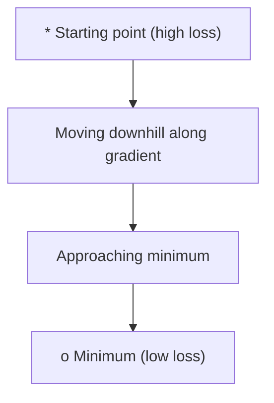
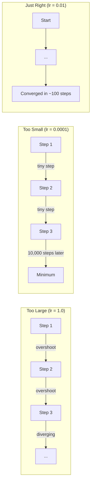
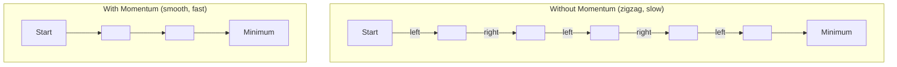
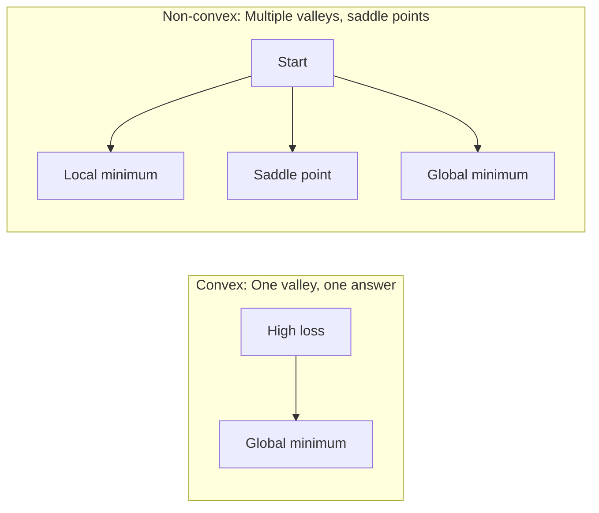
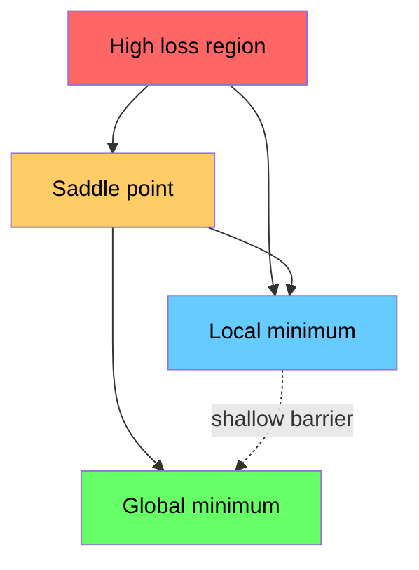

# 优化

> 训练神经网络,不过是发现谷底.
> 训练神经网络无非是找到山谷的最低点.

**Type:** Build | **类型:** 动手
**Language:**子**语言:**字符串
**Prerequisites:** Phase 1, Lessons 04-05 (Derivatives, Gradients) | **前置知识:** Phase 1, Lessons 04-05 (Derivatives, Gradients)
**Time:** ~75 minutes | **时间:** ~75 分钟

## 学习目标

- 实现尼拉梯度下降,SGD与动力,亚当从零开始
  从零实现原始梯度下降,带动量 SGD 和亚当 优化器
- 根据罗森布洛克函数进行优化器融合比较,并解释为什么亚当适应按体重学习率
  在Rosenbrock函数上比较优化器的收性,解释为什么亚当为每一个权力自适应学习率
- 区分形和非形的损失景观,并解释座点在高尺寸中的作用
  区分凸和非凸损曲面,解释高维空间中点的作用
- 配置学习速度时间表 (步骤衰退,阴茎化,升温) 确保训练稳定
  配置学习率调度 (步衰减,余弦退火,预热) 确保训练稳定性

> **【中文解读】**
> 训练神经网络就是"寻找山谷最低点"――损失函数告诉你当前有多个错误,梯度告诉你哪个方向能让错误更小,优化器决定你怎么走――本章从零实现 SGD、时刻和亚当PyTorch中最常用的三个优化器――

> **【拓展：优化器在 AI 中的位置】**
> - **SGD**基本优化器,所有优化器的"祖先"
> - **Adam**现在最流行的优化器,自适应学习率 + 动量,几乎成为默认选择.
> - **学习率调度**训练初步用大步长快速接近最优,后期用小步长精细调整――接和加热是变压器训练的标准配置――

## 问题 问题引入

你有一个损失函数. 它告诉你你的模型是多么错误. 你有梯度. 它告诉你哪个方向使损失变得更糟.

> 你有损失函数,它告诉你模型有差异. 你有梯度,它告诉你哪个方向让损失更大.

简单的方法是: 移动向梯度相反. 通过一些数字来衡量步骤,称为学习率. 复制. 这就是梯度下降,它有效. 但"工作"有警告. 太高的学习速度,你会完全超越谷口, 你会走上千里不必要的步骤, 虽然你没有找到最低点,但你就停止了.

> 简单的方法很简单:沿梯度反向移动,步长由学习率控制――不断重复――这就是梯度下降――但"有效"是有条件的:学习率太大,你会跳过谷底两墙之间来震荡;太小,你会在数千步不必要的代中慢爬――碰到点,你会停下来,但没有达到最低点――

每个深度学习优化者都能回答同一个问题:如何更快,更可靠地进入谷底?

> 深度学习中的每个优化器都在回答同一个问题:如何更快,更可靠地到达谷底?

> **【中文解读】**你有损失函数(告诉你有多错误) 和梯度(告诉你哪个方向能让误差更小) ――现在需要一个策略"走到山谷最低点"――简单方法:沿梯度反方向走――学习率太大→跳过最低点来回震荡;太小→走几千步才到――点→停下来但没有到最低――所有优化器都回答了同一个问题:如何更快更稳定地走到谷底?

## 概念的核心概念

### 优化意味着什么?

优化是找到最小化 (或最大化) 函数的输入值.在机器学习中,函数是损失.输入是模型的权重.培训是优化.

> 优化就是找到使函数最小化 (或最大化) 的输入值. 在机器学习中,函数是损失函数,输入是模型权重.

```
minimize L(w) where:
  L = loss function
  w = model weights (could be millions of parameters)
```

> **【拓展：优化是机器学习的引擎】**训练 = 优化――GPT-4的训练过程就是:使用180亿参数的损失函数,通过亚当 优化器代调整参数,使预测越来越准确――训练一个大型变压器可能需要10^20次FLOPS的计算,但核心是操作反复执行`w = w - lr * gradient`,我知道.

### 梯度下降 (原始版)

简单的优化器.计算损失的梯度与每个重量相比. 移动每个重量在其梯度的相反方向. 根据学习速度测量步骤.

> 最简单的优化器――计算损失对每个权重的梯度,沿反方向移动,步长由学习率控制――

```
w = w - lr * gradient
```

这就是整个算法,一个行.

> 这就是完整的算法.

> **【中文解读】**梯度下降:计算损失对每重量的梯度,沿反方向走一步,步长由学习率控制.`w = w - lr * gradient`着眼下山,每一步都朝着最的下坡方向走.



### 学习率:最重要的超参数

学习速度控制了步骤的尺寸. 它决定了所有关于融合的东西.

> 学习率控制步长,决定收到一切.



没有一个公式来确定正确的学习率. 实验可以找到它. 共同的起点:亚当的0.001 ,SGD的0.01

> 没有公式能告诉你正确的学习率――你只能通过实验找到――常见起点:亚当用0.001,SGD与动力用0.01――

> **【拓展：学习率选择的实践指南】**学习率是最难调调的超参数――经验法则:从0.001开始 (Adam的默认值),观察训练曲线――损失不降→学习率太小;损失震荡→学习率太大――变压器 训练标准配置:加热(前N 步骤从0 线性增长到0.001)+宇宙衰退(之后余弦衰减到0)――GPT-3 使用0.6 的峰值学习率配合加热――

### 总体和小批量

基梯度下降在采取一个步骤之前计算整个数据集的梯度.这被称为批次梯度下降.它是稳定的,但缓慢的.

> 首先,在走一步之前,使用全部数据计算梯度.

梯降低 (SGD) 计算一个随机样本的梯度,并立即步骤.

> 随机梯度下降 (SGD) 在单个随机样本上计算梯度后立即更新.

微批次梯度下降将差异分开.计算梯度在一个小批次 (32, 64, 128, 256 个样本),然后步骤.这是每个人都实际使用的.

> 小批量梯度下降取折中方案:使用一小批数据 (32、64、128、256个样本) 计算梯度后更新.

| Variant | Batch size | Gradient quality | Speed per step | Noise |
|---------|-----------|-----------------|---------------|-------|
| Batch GD / 全批量 | Entire dataset | Exact / 精确 | Slow / 慢 | None / 无 |
| SGD / 随机 | 1 sample | Very noisy / 噪声大 | Fast / 快 | High / 高 |
| Mini-batch / 小批量 | 32-256 | Good estimate / 好的估计 | Balanced / 均衡 | Moderate / 中等 |

噪音并不是一个错误,它可以避免低层的局部最小和车点.

> 由于它是个小批量的噪音,它有助于逃离低层局部最小值和点.

> **【中文解读】**三种梯度计算方式: 1) 全批量使用全部数据计算一次梯度,准但慢; 2)随机 SGD使用一条数据计算梯度,快但噪声大; 3) 小批量折中方案,使用32/64/256条数据;;实际上,人工智能训练中几乎所有使用小批量,批量大小是另一个关键超参数.

### 动量法:球从山坡滚下

尼拉梯度下降只看着当前梯度.如果梯度扎 (在狭窄的山谷中很常见),进展是缓慢的.动力通过积累过去梯度到速度术语来解决这一问题.

> 基本梯度下降只看当前梯度. 如果梯度呈形,进展缓慢.

```
v = beta * v + gradient
w = w - lr * v
```

类似:一个滚滚下坡.它不会在每一次碰撞中停止或重新启动.它在一致的方向上增强速度,减缓振荡.

> 类比:球从山坡滚下. 它不会在每个凸起处停下来重新启动. 它在一致的方向上积累速度,抑制震动.



`beta`对于一个更高的beta 版本,意味着更多的动力,更平滑的路径,但对方向变化的反应更慢.

> `beta`控制保留多少历史.更高的beta意味着更大的动量,更平滑的路径,但对方向变化的反应更慢.

> **【拓展：动量在深度学习中的效果】**动量法让优化"记住"前的方向,像球滚下山坡一样积累动能──好处:`torch.optim.SGD(lr=0.1, momentum=0.9)`动力=0.9 是常用的配置.

### 适应性学习率

对于不同体重,学习速度不同.一个很少获得高梯度的体重,最终应该采取更大的步骤.一个不断获得巨大的梯度的体重,应该采取更小的步骤.

> 不同的权力需要不同的学习率. 很少获得高梯度权力应该迈出更大的步骤,持续获得高梯度权力应该迈出更小的步骤.

根据体重的数据,
  根据每一个权重追踪的两个量:

1. 第一个时刻 (m):渐变的运行平均值 (如动力)
   一阶矩 (m):梯度的移动平均
2. 第二时刻 (v):正方梯度的运行平均 (梯度大小)
   二阶矩 (v):梯度平方的移动平均

```
m = beta1 * m + (1 - beta1) * gradient
v = beta2 * v + (1 - beta2) * gradient^2

m_hat = m / (1 - beta1^t)    bias correction
v_hat = v / (1 - beta2^t)    bias correction

w = w - lr * m_hat / (sqrt(v_hat) + epsilon)
```

通过`sqrt(v_hat)`对于小小的度,每一个度都会得到一个适应性学习率.

> 除了`sqrt(v_hat)`是关键洞见. 梯度大的权重被大数除了.

默认的超参数: `lr=0.001, beta1=0.9, beta2=0.999, epsilon=1e-8`这些默认设置对大多数问题都很有效.

> 默认超参数:`lr=0.001, beta1=0.9, beta2=0.999, epsilon=1e-8`这些默认值对大多数问题都是有效的.

> **【中文解读】**亚当 = 动力 + 自适应学习率――它为每个参数维护独立的"速度",根据梯度历史自动调整步长――大参数走小步,小参数走大步――亚当是目前最常用的优化器,PyTorch 中`torch.optim.Adam(lr=0.001)`几乎是默认的选择.

### 学习率调度

固定学习率是妥协的. 训练初期,你需要大步骤才能快速进步. 训练后期,你需要小步骤才能达到最低水平.

> 固定的学习率是折中方案.早期的训练需要快速进步,后期的训练需要小步精细调整.

常见时间表:
  常见调度方式:

| Schedule / 调度方式 | Formula / 公式 | Use case / 使用场景 |
|----------|---------|----------|
| Step decay / 步衰减 | lr = lr * factor every N epochs | Simple, manual control / 简单手动控制 |
| Exponential decay / 指数衰减 | lr = lr_0 * decay^t | Smooth reduction / 平滑递减 |
| Cosine annealing / 余弦退火 | lr = lr_min + 0.5 * (lr_max - lr_min) * (1 + cos(pi * t / T)) | Transformers, modern training / Transformer、现代训练 |
| Warmup + decay / 预热+衰减 | Linear ramp up, then decay | Large models, prevents early instability / 大模型，防止早期不稳定 |

### 凸显优化与非凸显优化

曲函数有一个最小值.渐进式下降总是找到它.`f(x) = x^2`形的.

> 凸函数只有一个最小值,梯度下降总能找到──像 `f(x) = x^2`这样的二次函数是凸的.

网络损失功能是非形的.它们有许多本地最小值,车点和平面区域.

> 神经网络的损失函数是不凸显的,许多地方的最小值,



在实践中,高维度神经网络中的本地最小极度极度极度极度极度极度极度极度极度极度极度极度极度极度极度极度极度极度极度极度极度极度极度极度极度极度极度极度极度极度极度极度极度极度极度极度极度极度极度极度极度极度极度极度极度极度极度极度极度极度极度极度极度极度极度极度极度极度极度极度极度极度极度极度极度极度极度极度极度极度极度极度极度极度极度极度极度极度极度极度极度极度极度极度极度极度极度极度极度极度极度极度极度极度极度极度极度极度极度极度极度极度极度极度极度极度极度极度极度极度极度极度极度极度极度极度极度极度极度极度极度极度极度极度极度极度极度极度极度极度极度极度极度极度极度极度极度极度极度极度极度极度极度极度极度极度极度极度极度极度极度极度极度极度极度极度极度极度极度极度极度极度极度极度极度极度极度极度极度极度极度极度极度极度极度极度极度极度极度极度极度极度极度极度极度极度极度极度极度极度极度极度极度极度极度极度极度极度极度极度极度极度极度极度极度极度极度极度极度极度极度极度极度极度极度极度极度极度极度极度极度极度极度极度极度极度极度极度极度极度极度极度极度极度极度极度极度极度极度极度极度极度极度极度极度极度极度极

> 实际上,高维神经网络中的局部最小值很少是问题. 大多数局部最小值的损失接近整个局部最小值.

> **【拓展：神经网络的损失曲面为什么是非凸的】**线性回归的损失函数是凸的(只有一个最低点,一定能找到),但神经网络的损失曲面有无数的局部最低点和点. 在100万维参数空间中,点(某些维度上升,某些维度下降的点) 比局部最低点多得多.好消息:亚当等自适应优化器可以有效逃离点.

### 失去了景观视觉化

损失是所有权重的函数.对于一个100万权重的模型来说,损失景观生活在1000,001维空间中.我们通过在权重空间中选择两个随机方向并沿着这些方向绘制损失,产生2维表面来可视化它.

> 损失是所有权重的函数.对于有100万个权重模型,损失曲面存在于1,000,001维空间中.



的最小值一般化不好. 的最小值一般化不好. 这也是一个原因,因为SGD的动力通常在最终测试准确性上超过亚当:它的噪音防止其定位在的最小值.

> 尖的最小值泛化能力差,平坦的最小值泛化能力好――这是一个原因,在最终测试精度上经常优于亚当的 SGD:它的噪音防止陷入尖的最小值――
```figure
gradient-descent
```

## 建立它

## 建立它,实现它.

### 定义测试函数.

罗森布洛克函数是经典的优化基准.其最小值在 (1, 1) 处于一个狭窄的曲线谷中,很容易找到,但很难跟踪.

> 罗森布洛克函数是经典的优化基准.它的最小值在 (1, 1),位于一个容易找到但难以跟随的狭曲谷中.

```
f(x, y) = (1 - x)^2 + 100 * (y - x^2)^2
```

```python
def rosenbrock(params):
    x, y = params
    return (1 - x) ** 2 + 100 * (y - x ** 2) ** 2

def rosenbrock_gradient(params):
    x, y = params
    df_dx = -2 * (1 - x) + 200 * (y - x ** 2) * (-2 * x)
    df_dy = 200 * (y - x ** 2)
    return [df_dx, df_dy]
```

### 瓦尼拉梯度下降.

```python
class GradientDescent:
    def __init__(self, lr=0.001):
        self.lr = lr

    def step(self, params, grads):
        return [p - self.lr * g for p, g in zip(params, grads)]
```

### 步骤3:带动量 SGD

```python
class SGDMomentum:
    def __init__(self, lr=0.001, momentum=0.9):
        self.lr = lr
        self.momentum = momentum
        self.velocity = None

    def step(self, params, grads):
        if self.velocity is None:
            self.velocity = [0.0] * len(params)
        self.velocity = [
            self.momentum * v + g
            for v, g in zip(self.velocity, grads)
        ]
        return [p - self.lr * v for p, v in zip(params, self.velocity)]
```

### 亚当第四步:亚当优化器

```python
class Adam:
    def __init__(self, lr=0.001, beta1=0.9, beta2=0.999, epsilon=1e-8):
        self.lr = lr
        self.beta1 = beta1
        self.beta2 = beta2
        self.epsilon = epsilon
        self.m = None
        self.v = None
        self.t = 0

    def step(self, params, grads):
        if self.m is None:
            self.m = [0.0] * len(params)
            self.v = [0.0] * len(params)

        self.t += 1

        self.m = [
            self.beta1 * m + (1 - self.beta1) * g
            for m, g in zip(self.m, grads)
        ]
        self.v = [
            self.beta2 * v + (1 - self.beta2) * g ** 2
            for v, g in zip(self.v, grads)
        ]

        m_hat = [m / (1 - self.beta1 ** self.t) for m in self.m]
        v_hat = [v / (1 - self.beta2 ** self.t) for v in self.v]

        return [
            p - self.lr * mh / (vh ** 0.5 + self.epsilon)
            for p, mh, vh in zip(params, m_hat, v_hat)
        ]
```

### 运行和比较

```python
def optimize(optimizer, func, grad_func, start, steps=5000):
    params = list(start)
    history = [params[:]]
    for _ in range(steps):
        grads = grad_func(params)
        params = optimizer.step(params, grads)
        history.append(params[:])
    return history

start = [-1.0, 1.0]

gd_history = optimize(GradientDescent(lr=0.0005), rosenbrock, rosenbrock_gradient, start)
sgd_history = optimize(SGDMomentum(lr=0.0001, momentum=0.9), rosenbrock, rosenbrock_gradient, start)
adam_history = optimize(Adam(lr=0.01), rosenbrock, rosenbrock_gradient, start)

for name, history in [("GD", gd_history), ("SGD+M", sgd_history), ("Adam", adam_history)]:
    final = history[-1]
    loss = rosenbrock(final)
    print(f"{name:6s} -> x={final[0]:.6f}, y={final[1]:.6f}, loss={loss:.8f}")
```

预期输出:亚当走向最快.SGD带动量遵循更平滑的路径.尼拉GD沿狭窄的谷道慢慢进步.

> 预期输出:亚当 收最快,SGD与动力 路径更平滑,原始 GD 在狭谷中进展缓慢――

## 用它实现框架

在实践中,使用PyTorch或JAX优化器.它们处理参数组,权重衰减,梯度剪辑和GPU加速.

> 实际上,使用PyTorch或JAX的优化器──它们处理参数组,权重减轻,梯度剪裁和GPU加快──

> **【中文解读】**皮托尔奇中优化器的标准使用法:`optimizer = torch.optim.Adam(model.parameters(), lr=0.001)`然后在训练循环中`optimizer.zero_grad()`其他`loss.backward()`其他`optimizer.step()`,这三行代码是深度学习训练的核心循环.

```python
import torch

model = torch.nn.Linear(784, 10)

sgd = torch.optim.SGD(model.parameters(), lr=0.01, momentum=0.9)
adam = torch.optim.Adam(model.parameters(), lr=0.001)
adamw = torch.optim.AdamW(model.parameters(), lr=0.001, weight_decay=0.01)

scheduler = torch.optim.lr_scheduler.CosineAnnealingLR(adam, T_max=100)
```

基本规则:
  经验法则:

- 首先是亚当 (lr=0.001). 它可以解决大多数问题,
  从亚当 (lr=0.001) 开始,无需调调即可解决大多数问题.
- 转换到SGD时的动力 (lr=0.01,动力=0.9) 当你需要最好的最终精度,并且可以承担更多的调整.
  需要最佳最终精度,并且能够承受更多调调时,
- 使用AdamW (Adam与脱重量衰减) 为变压器.
  变压器模型使用亚当W(带解权重衰减的亚当)
- 训练时间长于几个时期,总是使用学习率时间表.
  训练超过几个时代 时始终使用学习率调度.
- 如果训练不稳定,请减少学习速度.
  训练不稳定时减小学习率,训练太慢时增大学学习率――

## 运送它.

这一课提供了选择合适优化器的提示.`outputs/prompt-optimizer-guide.md`现在,我们要去.

> 本课程产出一个选择合适优化器的提示词.`outputs/prompt-optimizer-guide.md`,我知道.

在第三阶段,我们将一个神经网络从零开始训练.

> 在零训练神经网络中,构建的优化器类型将在3期再次出现.

## 练习题

1. **Learning rate sweep.**运行基梯度下降在Rosenbrock函数上,以学习率 [0.0001, 0.0005, 0.001, 0.005, 0.01].每一步的5000步后绘制或打印最终损失.找到最大的学习率,仍然相近.
   **学习率扫描。**用不同的学习率 [0.0001, 0.0005, 0.001, 0.005, 0.01] 在罗森布洛克函数上运行原始梯度下降――印每学习率5000步后的最终损失――找到仍能收的最大学习率――

2. **Momentum comparison.**运行SGD在Rosenbrock函数上运行动力值 [0.0,0.5,0.9,0.99]. 随着每一步追踪损失.哪个动力值最快收缩?哪个超行?
   **动量比较。**在罗森布洛克函数上运行SGD――跟踪每步的损失――哪个动量值收最快?哪个会冲?

3. **Saddle point escape.**定义函数`f(x, y) = x^2 - y^2`开始于0.01,0.01. 比较尼拉GD,SGD与动力以及亚当的行为.哪个逃离点?
   **鞍点逃逸。**定义函数`f(x, y) = x^2 - y^2`开始――比较原始GD、SGD与动力和亚当的行为――哪个能逃出点?

4. **Implement learning rate decay.**添加一个指数式衰变时间表到 GradientDescent 类:`lr = lr_0 * 0.999^step`根据罗森布洛克函数的与不衰变相似性.
   **实现学习率衰减。**在 GradientDescent 类中添加指数衰减调度:`lr = lr_0 * 0.999^step`比较Rosenbrock函数上没有衰退的收收率情况

## 关键词 快速查找表

| Term / 术语 | What people say | What it actually means / 实际含义 |
|------|----------------|----------------------|
| Gradient descent / 梯度下降 | "Go downhill" | Update weights by subtracting the gradient scaled by the learning rate. The most basic optimizer. / 用学习率缩放梯度后从权重中减去，更新权重。最基础的优化器。 |
| Learning rate / 学习率 | "Step size" | A scalar that controls how far each update moves the weights. Too large causes divergence. Too small wastes compute. / 控制每次更新移动多远的标量。太大导致发散，太小浪费算力。 |
| Momentum / 动量 | "Keep rolling" | Accumulate past gradients into a velocity vector. Dampens oscillations and accelerates movement through consistent directions. / 将历史梯度累积到速度向量中。抑制震荡，在一致方向上加速。 |
| SGD / 随机梯度下降 | "Random sampling" | Stochastic gradient descent. Compute gradient on a random subset instead of the full dataset. Almost always means mini-batch SGD in practice. / 随机梯度下降。在随机子集上计算梯度。实践中几乎都指小批量 SGD。 |
| Mini-batch / 小批量 | "A chunk of data" | A small subset of training data (32-256 samples) used to estimate the gradient. Balances speed and gradient accuracy. / 训练数据的小子集（32-256 个样本），用于估计梯度。平衡速度和梯度精度。 |
| Adam / Adam 优化器 | "The default optimizer" | Adaptive Moment Estimation. Tracks per-weight running averages of gradients and squared gradients to give each weight its own learning rate. / 自适应矩估计。跟踪每个权重的梯度和平方梯度的移动平均，为每个权重提供独立的学习率。 |
| Bias correction / 偏差校正 | "Fix the cold start" | Adam's first and second moments are initialized to zero. Bias correction divides by (1 - beta^t) to compensate during early steps. / Adam 的一阶和二阶矩初始化为零。偏差校正除以 (1 - beta^t) 来补偿早期步骤。 |
| Learning rate schedule / 学习率调度 | "Change lr over time" | A function that adjusts the learning rate during training. Large steps early, small steps late. / 训练过程中调整学习率的函数。早期大步，后期小步。 |
| Convex function / 凸函数 | "One valley" | A function where any local minimum is the global minimum. Gradient descent always finds it. Neural network losses are not convex. / 任何局部最小值都是全局最小值的函数。梯度下降总能找到。神经网络损失不是凸的。 |
| Saddle point / 鞍点 | "Flat but not a minimum" | A point where the gradient is zero but it is a minimum in some directions and a maximum in others. Common in high dimensions. / 梯度为零但在某些方向是最小值、某些方向是最大值的点。在高维中常见。 |
| Loss landscape / 损失曲面 | "The terrain" | The loss function plotted over weight space. Visualized by slicing along two random directions. / 在权重空间上绘制的损失函数。通过沿两个随机方向切片来可视化。 |
| Convergence / 收敛 | "Getting there" | The optimizer has reached a point where further steps do not meaningfully reduce the loss. / 优化器已到达一个点，进一步步进不会显著降低损失。 |

## 继续阅读 继续阅读

- [Sebastian Ruder: An overview of gradient descent optimization algorithms](https://ruder.io/optimizing-gradient-descent/)- 对所有主要优化者进行全面调查
  梯度下降优化算法综述,全面覆盖所有主要优化器
- [Why Momentum Really Works (Distill)](https://distill.pub/2017/momentum/)- 动力动态的互动可视化
  为什么动量有效,动量动态的互动可视化
- [Adam: A Method for Stochastic Optimization (Kingma & Ba, 2014)](https://arxiv.org/abs/1412.6980)- 原始的亚当文件,可读且短
  亚当 原始论文,可读且简短
- [Visualizing the Loss Landscape of Neural Nets (Li et al., 2018)](https://arxiv.org/abs/1712.09913)- 报纸显示了和平的最低水平
  展示尖与平坦最小值的论文
