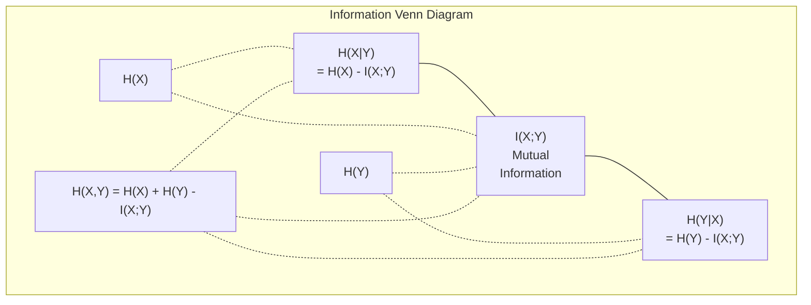

# 信息理论

> 信息理论是惊喜的,损失函数是基于它.
> 信息论衡惊喜程度――损失函数建立在它上――

**Type:** Learn | **类型:** 学习
**Language:**子**语言:**字符串
**Prerequisites:** Phase 1, Lesson 06 (Probability) | **前置知识:** Phase 1, Lesson 06 (Probability)
**Time:** ~60 minutes | **时间:** ~60 分钟

## 学习目标

- 从零开始计算进化,交叉进化和KL分离,并解释它们的关系
  从零计算、交叉和 KL散度,解释它们之间的关系
- 推导为什么减少交叉缩损失等于最大化日志概率
  推导为什么最小化交叉 损失等于最大化对数似的价格
- 计算特征和目标之间的互通信息,以排名特征的重要性
  计算特征与目标之间的互通信息排序特征的重要性
- 解释一个语言模型选择的有效词汇量
  解释困惑度作为语言模型选择的有效词汇量

> **【中文解读】**
> 信息论衡量"惊喜程度"越不可能发生的事件,包含的信息量越大――交叉损失函数、KL散度、困惑度(困惑度)

> **【拓展：信息论在 AI 中的位置】**
> - **交叉熵损失**语言模型的标准损失函数`CrossEntropyLoss`
> - **KL 散度**们的学习能力,在学习中,
> - **困惑度(Perplexity)**语言模型的评价标准,越低越好,表示模型对下一个词的预测越确定.

## 问题 问题引入

> **【中文解读】**你在训练中调用`CrossEntropyLoss()`在语言模型论文中看到"困惑",在VAE、蒸、RLHF中遇到 KL 散度──这些不是独立的概念它们是信息论的同源概念,只是改变了不同的帽子──理解信息论,就能看看这些概念的本质联系──

## 概念的核心概念

> **【拓展：Shannon 与信息论的诞生】**1948年,克劳德·尚农发表了通信的数学理论,提出了使用比特衡量信息量的框架.80年后,该框架成为AI的基石:交叉是所有分类和语言模型的损失函数,KL散度是生成模型的训练目标,互信息是特征选择的工具.信息论是从通信工程到AI的桥梁.

### 信息量惊喜度

什么不太可能发生,它带有更多信息. 一个硬币登陆头? 不奇怪. 抽奖胜利?

> 钱正面朝上? 不惊. 中彩票? 非常惊.

具有p概率的事件的信息内容为:
  概率为 p 的事件信息量为:

```
I(x) = -log(p(x))
```

运用日志基础2给你比特,运用自然日志给你纳茨.
  使用以2为底对数得到比特,使用自然对数得到奈特.

```
Event              Probability    Surprise (bits)
Fair coin heads    0.5            1.0
Rolling a 6        0.167          2.58
1-in-1000 event    0.001          9.97
Certain event      1.0            0.0
```

某些事件没有信息,你已经知道它们会发生.
> 你早就知道它们会发生.

###            

透是分布的所有可能结果中所预期的惊喜.
> 是分布中所有可能结果的预期惊喜.

```
H(P) = -sum( p(x) * log(p(x)) )  for all x
```

公平硬币对二进制变量具有最大的进化值:1位.偏见硬币 (99%头) 的进化值低:0.08位.你已经知道会发生什么,所以每次翻转几乎什么都不告诉你.
> 公平硬币对二元变量最大:1比特──偏置硬币(99% 正面) 的非常低:0.08比特──你已经知道会发生什么,所以每次抛弃硬币几乎没有提供新信息──

```
Fair coin:    H = -(0.5 * log2(0.5) + 0.5 * log2(0.5)) = 1.0 bit
Biased coin:  H = -(0.99 * log2(0.99) + 0.01 * log2(0.01)) = 0.08 bits
```

透是指分布中不可减小的不确定性.
> 衡量分布中不可减轻的不确定性――你无法缩小到以下――

### 交叉,你每天都在使用的损失函数

交叉透量度是平均惊喜的,当你使用分布Q来编码实际来自分布P的事件时.
> 交叉衡量使用分布 Q 编码实际来自布 P 的事件时的平均惊喜量.

```
H(P, Q) = -sum( p(x) * log(q(x)) )  for all x
```

是你模型的预测.如果Q与P完美匹配,交叉为.任何不匹配都会使它变得更大.
> 如果Q 完美匹配P,交叉等于──任何不匹配都会使它更大──

在分类中,P是一个单热向量 (真实类别的概率为 1,其他的一切都是0).这简化了交叉缩为:
> 在分类中,P 是一个热向量(真实类概率为 1,其余为 0) ⋅这使交叉简化为:

```
H(P, Q) = -log(q(true_class))
```

它们是对类别的整个交叉缩损失公式.
> 这就是分类完整交叉损失公式.

### 距离分离 (分离)

基因分离量测量使用Q而不是P给你带来了多大的额外惊喜.
>  散度测量使用Q 代替P 时多出的惊喜度.

```
D_KL(P || Q) = sum( p(x) * log(p(x) / q(x)) )  for all x
             = H(P, Q) - H(P)
```

交叉缩是缩加上KL分离.因为正确分布的缩在训练过程中是恒定的,减少交叉缩就等于减少KL分离.你正在推动模型的分布向正确分布.
> 交叉 =  + KL 散度――由于训练过程中真实的分布是常数,最小化交叉等价格是最小化 KL 散度――你在把模型分布推向真实的分布――

 KL分离不对称:D_KL(P  Q) !=D_KL(Q  P).它不是真正的距离指标.
> 散度不对称:D_KL(P_不 于 Q) != DKL(Q不 于) 于是不是真正的距离度量――

### 互通信息

相互信息衡量知道一个变量告诉你关于另一个变量的程度.
> 互信息衡量知道一个变量后能告诉你关于另一个变量的多少信息.

```
I(X; Y) = H(X) - H(X|Y)
        = H(X) + H(Y) - H(X, Y)
```

如果X和Y是独立的,互通信息是零的.知道一个对另一个什么都不告诉你.如果它们完全相关,互通信息等于任何变量的.
> 如果X和Y 独立,互信息为零. 知道一个不能告诉你关于另一个任何信息. 如果完全相关,互信息等于任一变量.

在特征选择中,特征与目标之间的互通信息很高,意味着特征是有用的.
> 在特征选择中,特征与目标之间的高互通信息意味着特征有用.

### 条件性透

测量了观察X后对Y的不确定性.
> 衡量在观察到X后的 Y 剩余多少不确定性.

```
H(Y|X) = H(X,Y) - H(X)
```

两种极端:
  两个极端:

- 如果X完全确定Y,那么H(Y 则X) = 0.知道X消除了Y的所有不确定性.
  如果X完全决定Y,则H(Y也X) = 0──知道X 消除了关于Y的所有不确定性──
- 如果X对Y没有告诉你什么,那么H(YX的说法) =H(Y).知道X根本不会减少你的不确定性.
  如果 X 对 Y 没有任何信息,则 H  Y X ) = H  Y) 

条件性透总是非负,从来不超过H(Y):
> 条件始终非负且不超过H(Y):

```
0 <= H(Y|X) <= H(Y)
```

在机器学习中,决定树中出现了条件的透.在每个分区时,算法选择了最小化H(Y) 的X特征 - - 消除了Y标签的最不确定性.
> 在机器学习中,条件现在出现在决策树中. 每次分化时,算法选择使H  Y  X 最小的特征 X 即最能消除标签 Y 不确定性的特征.

### 联合

 (X,Y) 是 X 和 Y 的联合分布的.
> ,Y) 是X 和Y 联合分布的──

```
H(X,Y) = -sum sum p(x,y) * log(p(x,y))   for all x, y
```

关键属性:
  关键性质:

```
H(X,Y) <= H(X) + H(Y)
```

如果 X 和 Y 具有独立性,则同等性存在.如果它们共享信息,则联合体积比单个体积少. "缺失"的体积是完全相互信息.
> 当X和Y 独立时等号成立时,如果它们共享信息,联合小于各自的之和.



关系:
  关系式:

- , =  + 
-  () =  () -  () =  () -  ()
- , =+

### 互通信息 (深入理解)

相互信息 I  X  Y) 量化了知道一个变量有多大程度上减少了对另一个变量的不确定性.
> 互信息 I  X  Y 量化知道一个变量后对另一个变量不确定性的减少量

```
I(X;Y) = H(X) - H(X|Y)
       = H(Y) - H(Y|X)
       = H(X) + H(Y) - H(X,Y)
       = sum sum p(x,y) * log(p(x,y) / (p(x) * p(y)))
```

性能:
  性质:

- 总是输出 0 信息,因为观察到东西.
  观察事物永远不会丢失信息.
- 如果和Y是独立的,
   () = 0 当且仅当 X 和 Y 独立――
- 它们是对称的,而不是KL差距.
  ,,,,,,,,,,,,,,,,,,,,,,,,,,,,,,,,,,,,,,,,,,,,,,,,,,,,,,,,,,,,,,,,,,,,,,,,,,,,,,,,,,,,,,,,,,,,,,,,,,,,,,,,,,,,,,,,,,,,,,,,,,,,,,,,,,,,,,,,,,,,,,,,,,,,,,,,,,,,,,,,,,,,,,,,,,,,,,,,,,,,,,,,,,,,,,,,,,,,,,,,,,,,,,,,,,,,,,,,,,,,,,,,,,,,,,,,,,,,,,,,,,,,,,,,,,,,,,
- 一个变量与自己分享所有信息.
  变量与自己共享所有信息──

**Mutual information for feature selection.**在ML中,你需要有关目标的信息功能.互通信息为你提供了原则性地排名功能的方式:
> **互信息用于特征选择。**在机器学习中,你需要对目标有信息量的特征.

1. 对于每个特征 X_i,计算I(X_i;Y) 时,Y是目标变量.
   对每个特征 X_i,计算 I(X_i; Y),其中 Y 是目标变量.
2. 根据MI分数的排名.
   按MI分排序特征
3. 保持上部的K特征.
   留前的特征

这适用于任何功能与目标之间的关系--线性,非线性,单调,或者不.
> 这适用于特征与目标之间的任何关系线性"",非线性"",单调或非单调"",相关性只能捕捉到线性关系,互信息可以捕捉到一切.

| Method / 方法 | Detects / 检测 | Computational cost / 计算成本 | Handles categorical? / 处理类别型？ |
|--------|---------|-------------------|---------------------|
| Pearson correlation / 皮尔逊相关 | Linear relationships / 线性关系 | O(n) | No / 否 |
| Spearman correlation / 斯皮尔曼相关 | Monotonic relationships / 单调关系 | O(n log n) | No / 否 |
| Mutual information / 互信息 | Any statistical dependency / 任何统计依赖 | O(n log n) with binning | Yes / 是 |

### 标签: 滑和交叉

标准分类使用硬目标: [0, 0, 1, 0].真正类得到概率 1,其他所有得到0.标签平滑取代这些软目标:
> 标准分类使用硬目标:[0, 0, 1, 0]──真实类概率为 1,其余为 0──标签平滑将其替换为软目标:

```
soft_target = (1 - epsilon) * hard_target + epsilon / num_classes
```

具有epsilon = 0.1 和4类:
  当epsilon = 0.1 且有4个类别时:

- 强度目标: [0, 0, 1, 0]
- 软目标: [0.025,0.025,0.925,0.025]

从信息理论的角度来看,标签平滑增加了目标分布的缩.硬的单热目标具有缩0.没有不确定性.软的目标具有积极的缩.
> 从信息论角度来看,标签平滑增加了目标分布的──硬一个热的──目标的为0没有不确定性──软的目标有正──

为什么这有帮助:
  为什么这有帮助:

- 防止模型将高位数推向极端值 (在交叉值下,将无限高位数需要完美匹配一个热点目标)
  防止模型将登录 推到极端值
- 作为规律化:模型不能100%自信
  作为正则化:模型不能100%自信
- 提高校准:预测概率更好地反映了真实的不确定性
  改善校准:预测概率更好地反映真实不确定性
- 减少训练和推断行为之间的差距
  减少训练和推行为之间的差距

标签滑滑的交叉缩损失变为:
> 带标签平滑的交叉损失为:

```
L = (1 - epsilon) * CE(hard_target, prediction) + epsilon * H_uniform(prediction)
```

第二个术语惩罚了远非统一的预测,
> 第二种惩罚是对信任的直接正规化.

### 为什么交叉是分类标准的损失

只有三个观点,同一个结论.
> 三个视角,同一个结论.

**Information theory view.**通过使用模型的分布而不是真正的分布来测量你浪费多少位.
> **信息论视角。**交叉衡量使用模型分布代替真实分布浪费了多少比特――最小化使你的模型成为最有效的真实编码器――

**Maximum likelihood view.**对于真实类 y_i 的N训练样本:
> **最大似然视角。**对于N 个训练样本,真实类别为 y_i:

```
Likelihood     = product( q(y_i) )
Log-likelihood = sum( log(q(y_i)) )
Negative log-likelihood = -sum( log(q(y_i)) )
```

减少交叉缩 = 最大化训练数据的可能性.
> 最后一行就是交叉损失.最小化交叉 =最大化模型下训练数据的似然.

**Gradient view.**对于位的交叉位梯度简单 (预测 - 确实).清洁,稳定,快速计算.这就是为什么它与软max完美结合.
> **梯度视角。**交叉对逻辑的梯度就是 (预测 - 确实) 简洁稳定计算快速.

### 比特vs奈特

唯一的区别是木材的基础.
> 唯一的区别是对数的底数.

```
log base 2   -> bits      (information theory tradition / 信息论传统)
log base e   -> nats      (machine learning convention / 机器学习惯例)
log base 10  -> hartleys  (rarely used / 很少使用)
```

根据PyTorch和TensorFlow的默认使用自然日志 (nats).
> 光电流的使用方式:

### 困惑.

杂度是交叉透的指数,它告诉你模型不确定的同样可能的实际数量.
> 困惑度是交叉的指数. 它告诉你模型在多少等概率选择之间犹.

```
Perplexity = 2^H(P,Q)   (if using bits / 使用 bits 时)
Perplexity = e^H(P,Q)   (if using nats / 使用 nats 时)
```

语言模型中50个难以理解的模特,平均是像必须从50个可能的下一个代币中均地选择一样困惑.
> 困惑度为50个语言模型,平均就像在50个可能的下一个词中均选择一样困惑――越低越好――

现代模型在一个数字中表达了很好的域名.
> 在常见基准上,GPT-2已经达到30个困惑度.

## 建立它,实现它.
```figure
entropy-kl
```

## 建立它

### 信息内容和化.

```python
import math

def information_content(p, base=2):
    if p <= 0 or p > 1:
        return float('inf') if p <= 0 else 0.0
    return -math.log(p) / math.log(base)

def entropy(probs, base=2):
    return sum(
        p * information_content(p, base)
        for p in probs if p > 0
    )

fair_coin = [0.5, 0.5]
biased_coin = [0.99, 0.01]
fair_die = [1/6] * 6

print(f"Fair coin entropy:   {entropy(fair_coin):.4f} bits")
print(f"Biased coin entropy: {entropy(biased_coin):.4f} bits")
print(f"Fair die entropy:    {entropy(fair_die):.4f} bits")
```

### 交叉与KL散度.

```python
def cross_entropy(p, q, base=2):
    total = 0.0
    for pi, qi in zip(p, q):
        if pi > 0:
            if qi <= 0:
                return float('inf')
            total += pi * (-math.log(qi) / math.log(base))
    return total

def kl_divergence(p, q, base=2):
    return cross_entropy(p, q, base) - entropy(p, base)

true_dist = [0.7, 0.2, 0.1]
good_model = [0.6, 0.25, 0.15]
bad_model = [0.1, 0.1, 0.8]

print(f"Entropy of true dist:     {entropy(true_dist):.4f} bits")
print(f"CE (good model):          {cross_entropy(true_dist, good_model):.4f} bits")
print(f"CE (bad model):           {cross_entropy(true_dist, bad_model):.4f} bits")
print(f"KL divergence (good):     {kl_divergence(true_dist, good_model):.4f} bits")
print(f"KL divergence (bad):      {kl_divergence(true_dist, bad_model):.4f} bits")
```

### 交叉作为分类损失

```python
def softmax(logits):
    max_logit = max(logits)
    exps = [math.exp(z - max_logit) for z in logits]
    total = sum(exps)
    return [e / total for e in exps]

def cross_entropy_loss(true_class, logits):
    probs = softmax(logits)
    return -math.log(probs[true_class])

logits = [2.0, 1.0, 0.1]
true_class = 0

probs = softmax(logits)
loss = cross_entropy_loss(true_class, logits)

print(f"Logits:      {logits}")
print(f"Softmax:     {[f'{p:.4f}' for p in probs]}")
print(f"True class:  {true_class}")
print(f"Loss:        {loss:.4f} nats")
print(f"Perplexity:  {math.exp(loss):.2f}")
```

### 交叉等于负对数相似之

```python
import random

random.seed(42)

n_samples = 1000
n_classes = 3
true_labels = [random.randint(0, n_classes - 1) for _ in range(n_samples)]
model_logits = [[random.gauss(0, 1) for _ in range(n_classes)] for _ in range(n_samples)]

ce_loss = sum(
    cross_entropy_loss(label, logits)
    for label, logits in zip(true_labels, model_logits)
) / n_samples

nll = -sum(
    math.log(softmax(logits)[label])
    for label, logits in zip(true_labels, model_logits)
) / n_samples

print(f"Cross-entropy loss:      {ce_loss:.6f}")
print(f"Negative log-likelihood: {nll:.6f}")
print(f"Difference:              {abs(ce_loss - nll):.2e}")
```

### 互通信息.

```python
def mutual_information(joint_probs, base=2):
    rows = len(joint_probs)
    cols = len(joint_probs[0])

    margin_x = [sum(joint_probs[i][j] for j in range(cols)) for i in range(rows)]
    margin_y = [sum(joint_probs[i][j] for i in range(rows)) for j in range(cols)]

    mi = 0.0
    for i in range(rows):
        for j in range(cols):
            pxy = joint_probs[i][j]
            if pxy > 0:
                mi += pxy * math.log(pxy / (margin_x[i] * margin_y[j])) / math.log(base)
    return mi

independent = [[0.25, 0.25], [0.25, 0.25]]
dependent = [[0.45, 0.05], [0.05, 0.45]]

print(f"MI (independent): {mutual_information(independent):.4f} bits")
print(f"MI (dependent):   {mutual_information(dependent):.4f} bits")
```

## 用它实现框架

实际上,你将使用的方法:
> 使用NumPy 实现同样的概念,这是你在实践中使用的方式:

```python
import numpy as np

def np_entropy(p):
    p = np.asarray(p, dtype=float)
    mask = p > 0
    result = np.zeros_like(p)
    result[mask] = p[mask] * np.log(p[mask])
    return -result.sum()

def np_cross_entropy(p, q):
    p, q = np.asarray(p, dtype=float), np.asarray(q, dtype=float)
    mask = p > 0
    return -(p[mask] * np.log(q[mask])).sum()

def np_kl_divergence(p, q):
    return np_cross_entropy(p, q) - np_entropy(p)

true = np.array([0.7, 0.2, 0.1])
pred = np.array([0.6, 0.25, 0.15])
print(f"Entropy:    {np_entropy(true):.4f} nats")
print(f"Cross-ent:  {np_cross_entropy(true, pred):.4f} nats")
print(f"KL div:     {np_kl_divergence(true, pred):.4f} nats")
```

你从零开始建造了什么?`torch.nn.CrossEntropyLoss()`现在你知道训练期间的损失为什么会减少:模型的预测分布接近真实的分布,
> 你从零开始构建了`torch.nn.CrossEntropyLoss()`内部做的事情──现在你知道为什么训练中损失会下降:你的模型预测分布越来越接近真实的分布,使用浪费信息的特征数来衡量──

## 练习题

1. 根据英语字母的统一分布 (26 字母) 来计算英语字母的缩.然后使用实际字母频率来估算它.
   假设平均分布计算英文字母表 ((26个字母) 的──然后使用实际字母频率估计──哪个更高?为什么?

2. 一个模型输出对真类型的样本的 logits [5.0, 2.0, 0.5] 1. 手动计算交叉缩损失,然后用你的 `cross_entropy_loss`什么地址会产生零损失?
   模型对真实类别为 1 的样本输出逻辑 [5.0, 2.0, 0.5]──手算交叉损失,然后使用你的函数验证──什么逻辑会给出零损失?

3. 证明KL分离不对称. 选择两个分布 P 和 Q,计算D_KL_P  Q) 和DL  Q  P).解释为什么它们不同.
   证明 KL 散度不对称――选择两个分布 P 和 Q,计算 D_KL(P 含 Q) 和 D_KL(Q 含 P) ――解释为什么它们不同――

4. 构建一个函数,计算一个符号预测序列的困难. 给出 (true_token_index, predicted_logits) 对的列表,返回序列的困难.
   构建一个计算代币 预测序列困惑度的函数――给定 (真实代币索引,预测记录) 对列表的困惑度,返回序列――

## 关键词 快速查找表

| Term / 术语 | What people say | What it actually means / 实际含义 |
|------|----------------|----------------------|
| Information content / 信息量 | "Surprise" | The number of bits (or nats) needed to encode an event: -log(p) / 编码事件所需的比特数（或奈特数）：-log(p) |
| Entropy / 熵 | "Randomness" | The average surprise across all outcomes of a distribution. Measures irreducible uncertainty. / 分布中所有结果的平均惊喜度。衡量不可约减的不确定性。 |
| Cross-entropy / 交叉熵 | "The loss function" | Average surprise when using model distribution Q to encode events from true distribution P. / 使用模型分布 Q 编码来自真实分布 P 的事件时的平均惊喜度。 |
| KL divergence / KL 散度 | "Distance between distributions" | Extra bits wasted by using Q instead of P. Equals cross-entropy minus entropy. Not symmetric. / 使用 Q 代替 P 浪费的额外比特。等于交叉熵减熵。不对称。 |
| Mutual information / 互信息 | "How related are X and Y" | Reduction in uncertainty about X from knowing Y. Zero means independent. / 知道 Y 后关于 X 不确定性的减少。零意味着独立。 |
| Softmax | "Turn logits into probabilities" | Exponentiate and normalize. Maps any real-valued vector to a valid probability distribution. / 指数化并归一化。将任意实值向量映射为有效概率分布。 |
| Perplexity / 困惑度 | "How confused the model is" | Exponential of cross-entropy. The effective vocabulary size the model is choosing from at each step. / 交叉熵的指数。模型每一步选择时的有效词汇量。 |
| Bits / 比特 | "Shannon's unit" | Information measured with log base 2. One bit resolves one fair coin flip. / 用以 2 为底的对数衡量的信息。一比特解决一次公平抛硬币。 |
| Nats / 奈特 | "ML's unit" | Information measured with natural log. Used by PyTorch and TensorFlow by default. / 用自然对数衡量的信息。PyTorch 和 TensorFlow 默认使用。 |
| Negative log-likelihood / 负对数似然 | "NLL loss" | Identical to cross-entropy loss for one-hot labels. Minimizing it maximizes the probability of correct predictions. / 对 one-hot 标签等价于交叉熵损失。最小化它等于最大化正确预测的概率。 |

## 继续阅读 继续阅读

- [Shannon 1948: A Mathematical Theory of Communication](https://people.math.harvard.edu/~ctm/home/text/others/shannon/entropy/entropy.pdf)- 原文,仍可读
  原始论文,至今仍可读
- [Visual Information Theory (Chris Olah)](https://colah.github.io/posts/2015-09-Visual-Information/)- 能对和KL分离进行最佳视觉解释
  和 KL 散度最佳可视化解释
- [PyTorch CrossEntropyLoss docs](https://pytorch.org/docs/stable/generated/torch.nn.CrossEntropyLoss.html)- 框架如何实现你刚刚构建的
  框架如何实现你刚构建的内容
