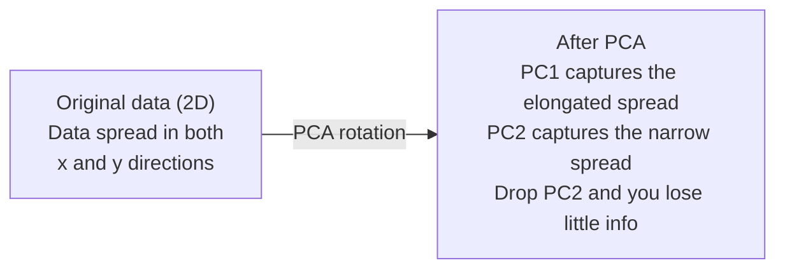

# 降维 降维

> 通过从正面角度看,我们可以找到它.
> 高维数据有结构. 你需要找到正确的角度来观察.

**Type:** Build | **类型:** 动手
**Language:**子**语言:**字符串
**Prerequisites:** Phase 1, Lessons 01 (Linear Algebra Intuition), 02 (Vectors, Matrices & Operations), 03 (Eigenvalues & Eigenvectors), 06 (Probability & Distributions) | **前置知识:** Phase 1, Lessons 01-03, 06
**Time:** ~90 minutes | **时间:** ~90 分钟

## 学习目标

- 从零开始实施PCA:中心数据,计算共变矩阵,自主组合和项目
  从零实现PCA:数据中心化,计算方差矩阵,特征值分解,投影
- 使用解释的变量比和肘部方法来选择主要组件数量
  使用解释方差比和肘部法则选择主要成分数量
- 进行PCA,t-SNE和UMAP的比较,以2D可视化MNIST数字,并解释它们的交易
  较PCA、t-SNE和UMAP在MNIST手写数字 2D可视化中的效果与权衡
- 应用RBF内核的内核PCA来分离标准PCA无法处理的非线性数据结构
  应用带 RBF 核的核PCA 分离标准PCA 无法处理的非线性数据结构

> **【中文解读】**
> 784维的手写数字数据无法可视化.降维就是找到"最佳角度"投影数据,尽可能少的维度保留尽可能多的信息.

> **【拓展：降维在 AI 中的位置】**
> - **PCA**其他:`PCA`分析数据的标准步骤,也是理解特征值分解的最佳实践.
> - **t-SNE/UMAP**据报道,该研究报告中几乎每个嵌入式可视化都使用它们.
> - **推荐系统**协同过本质上就是对用户物体矩阵做降维,发现隐因子.

## 问题 问题引入

> **【中文解读】**784 维的手写数字数据 ((28×28 像素) 可见不见,也无法直观理解.但其中大部分是冗余的. 一个手写的"7"只需要几个关键特征:笔画角度,横线长度,倾斜程度.降维就是找到这些关键特征,把784 维缩小到2-50 维,同时保留有意义的信息结构.

也许是手写数字的像素值. 也许是基因表达水平. 也许是用户行为信号. 你不能想象784个维度. 你不能绘制它们. 你甚至不能想到它们.
> 也许是手写数字的像素值,也许是基因表达水平,也许是用户行为信号――你无法可视化784维,无法绘制,甚至无法想象――

但这些784的大部分功能是过剩的.实际信息生活在一个更小的表面上.手写的"7"不需要784个独立的数字来描述它.它需要几个:拍摄的角度,横杆的长度,它倾斜多少.其余的噪音.
> 但这些784个特征中的大部分是冗余的.真正有用的信息存在于更小的面上. 一个手写的"7"不需要784个独立的数字来描述,只需要几个:笔画角度,横线长度,倾斜程度,其余是噪音.

缩小尺寸会发现更小的表面,它将784维的数据压缩到2,10或50维度,同时保持重要结构.
> 降维找到那个更小的面. 它将784维数据压缩到2、10或50维,同时保留有意义的结构.

## 概念的核心概念

> **【拓展：PCA 与 LoRA 的数学联系】**PCA 找出数据中方差最大的方向 (主要成分),与 LoRA 微调的核心思想相同:权重更新 ΔW 的有效信息集中在少数几个方向上.

### 维度灾难的诅咒

空间的高度是不直观的.
> 高维空间违反直觉.随着维度的增长,三件事会出现问题.

**Distance becomes meaningless.**在高维度中,两个随机点之间的距离相近于相同的值.如果每个点与其他点的距离大约相同,
> **距离变得无意义。**在高维中,任意两个随机点之间的距离接近相同的值.如果每个点到其他所有点的距离大致相同,近邻搜索就失效了.

```
Dimension    Avg distance ratio (max/min between random points)
2            ~5.0
10           ~1.8
100          ~1.2
1000         ~1.02
```

**Volume concentrates in corners.**对于一个在d维度的单元超立方体,则有2d角.在100维度,几乎所有的体积都在角落里,远离中心.数据点蔓延到边缘,你的模型在内部饥饿数据.
> **体积集中在角落。**在100维中,几乎所有的体积都在角落,远离中心. 数据点扩散到边缘,模型内部缺乏数据.

**You need exponentially more data.**为了保持相同的样本密度,从2D到20D需要10^18倍的数据.你永远没有足够的.减少尺寸使数据密度恢复到可操作的东西.
> **需要指数级更多的数据。**从2D到20D,保持相同的样本密度需要10^18倍的数据.

### 找出重要方向.

基本组件分析 (PCA) 找出了您数据最多变化的轴. 它旋转了坐标系统,所以第一个轴捕获了最多的变化,第二个捕获了最多的变化,等等.
> 主成分分析 (PCA) 找到数据变化最大的轴――它旋转坐标系,使第一个轴捕获最大方差,第二个捕获次大方差,根据此类推.

算法:
  算法步骤:

```
1. Center the data        (subtract the mean from each feature) / 数据中心化
2. Compute covariance     (how features move together) / 计算协方差
3. Eigendecomposition     (find the principal directions) / 特征值分解
4. Sort by eigenvalue     (biggest variance first) / 按特征值排序
5. Project               (keep top k eigenvectors, drop the rest) / 投影
```

为什么是自定义? 变量矩阵是对称和正的半确定的.它的自向量是特征空间中的直角方向.自向值告诉你每个方向捕获多少变量.最大变量方向沿着最大变量方向的自向量.
> 为什么要分解特征值? 方差矩阵是对称正半定数. 特征向量是特征空间中的正交方向. 特征值告诉你每个方向捕获多少方差.



- **Before PCA:**数据云在x和y轴上横向分布
  **PCA 前：**数据云在对角线方向跨越x和y轴
- **After PCA:**坐标系统旋转,使PC1与最大差距方向 (延长差距) 及PC2与最小差距方向 (狭窄差距) 保持一致.
  **PCA 后：**坐标系旋转,PC1对齐最大方差方向,PC2对齐最小方差方向
- **Dimensionality reduction:**放弃PC2将数据投射到PC1,失去很少的信息
  **降维：**丢弃PC2将数据投影到PC1上,损失很少的信息

### 解释方差比

每个主要组件都占总变量的一小部分.
> 每个主要成分都占据总方差的部分.

```
Component    Eigenvalue    Explained ratio    Cumulative
PC1          4.73          0.473              0.473
PC2          2.51          0.251              0.724
PC3          1.12          0.112              0.836
PC4          0.89          0.089              0.925
...
```

当总体解释变异达到0.95时,你知道许多组件捕获了95%的信息.
> 当积分解释差达到0.95时,这些成分捕获了95%的信息.

### 选择组件数量

需要采取三种策略:
  三种策略:

1. **Threshold.**保持足够的组件,以解释90-95%的差异.
   **阈值法。**保持足够的成分来解释90%-95%的差异.
2. **Elbow method.**图解各组件的变化. 寻找一个急剧的降落.
   **肘部法则。**绘制每个成分的解释方差,寻找急剧下降点.
3. **Downstream performance.**测量模型的精度,最好的精度是任何高原.
   **下游性能。**将PCA作为预处理.扫描 k 值并测量模型精度.

### 保护邻居的结构

t-分布式静态邻居嵌入式 (t-SNE) 设计用于可视化.它将高维度数据映射到2D (或3D) 同时保留哪些点相邻.
> 专为可视化设计. 它将高维数据映射到2D或3D,同时保留哪些点接近彼此.

感觉:在原始空间中,根据距离计算对点的概率分布.近点的概率高.远点的概率低.然后找到一个2D排列,相同的概率分布.784维度的点是邻居,仍然是邻居的2D.
> 直觉:在原始空间中,基于距离计算点对点之间的概率分布――近点概率高,远点概率低――然后找到一个2D排列,使相同的概率分布形成――784维中的邻居在2D中仍然是邻居――

子的主要特性:
  子的关键特性:

- 它可以展开复杂的多元化,而PCA不能.
  无法处理的复杂流形.
- 不同的运行产生不同的布局.
  随机性――不同运行产生不同布局――
- 困难参数控制了需要考虑多少邻居 (典型范围:5-50).
  参数控制考虑多少邻居 (典型范围:5-50)
- 输出中的集群之间的距离并不重要.
  输出中聚类之间的距离是无意义的.
- 默认情况下,在大型数据集上速度很慢.
  现在,我们已经开始了.

### 快速,更好的全球结构.

统一多重接近和投影 (UMAP) 与t-SNE类似,但具有两个优势:
> 类似于UMP和T-SNE,但有两个优势:

- 它使用近邻图表,而不是计算所有对距离.
  更快――使用近似近邻图而不是计算成对距离的图.
- 产量中的集群相对位置往往比t-SNE更有意义.
  较于t-SNE更有意义的.

UMAP在高维空间中构建一个重量图 ("模糊的拓表现") 然后找到一个低维布局,以尽可能保存这个图.
> 在高维空间中构建加权图 (模糊拓表示),然后找到尽可能保留该图的低维布局.

关键参数:
  关键参数:

- `n_neighbors`较高的价值保持更全球性的结构.
  `n_neighbors`更多的全局结构──
- `min_dist`输出中点的密集性.较低的值会产生更密集的集群.
  `min_dist`输出中点聚的密度.

### 什么时候使用什么方法?

| Method / 方法 | Use case / 使用场景 | Preserves / 保留 | Speed / 速度 |
|--------|----------|-----------|-------|
| PCA | Preprocessing before training / 训练前预处理 | Global variance / 全局方差 | Fast (exact), works on millions of samples / 快速（精确），支持百万级样本 |
| PCA | Quick exploratory visualization / 快速探索性可视化 | Linear structure / 线性结构 | Fast / 快 |
| t-SNE | Publication-quality 2D plots / 发表级 2D 图 | Local neighborhoods / 局部邻域 | Slow (< 10k samples ideal) / 慢（<1万样本最佳） |
| UMAP | 2D visualization at scale / 大规模 2D 可视化 | Local + some global structure / 局部+部分全局结构 | Medium (handles millions) / 中等（支持百万级） |
| PCA | Feature reduction for models / 模型特征降维 | Variance-ranked features / 方差排序特征 | Fast / 快 |
| t-SNE / UMAP | Understanding cluster structure / 理解聚类结构 | Cluster separation / 聚类分离 | Medium to slow / 中等到慢 |

基本规则:使用PCA进行预处理和数据压缩.使用t-SNE或UMAP,当需要在2D中可视化结构时.
> 经验法则:PCA 用于预处理和数据压缩.

### 核PCA

标准PCA会找到线性子空间.它会旋转你的坐标系统,然后放下轴.但是如果数据位于非线性多元件上怎么办? 2D中的圆不能被任何线分开.标准PCA不会帮助.
> 标准PCA 找线性子空间――但如果数据位于非线性流形上呢?2D 中的圆不能被任何直线分离――标准PCA 无能为力――

核心PCA将PCA应用到一个高维功能空间中,由一个核心函数引发,而没有明确计算该空间中的坐标.这是核心技巧 - - 基于SVM的想法.
> 核PCA在核函数诱导的高维特征空间中应用PCA,而非显然计算该空间中的坐标.

算法:
  算法步骤:

1. 计算内核矩阵K,K_ij = k(x_i,x_j)
   计算核矩阵 K,其中 K_ij = k(x_i, x_j)
2. 核心矩阵中心在功能空间中
   在特征空间中中心化核矩阵
3. 组建中心核矩阵
   对核核矩阵进行特征值分解
4. 顶部的自向量 (以1/sqrt(自值值) 进行测量
   顶部特征向量(缩放1/sqrt(特征值))即为投影

常见的内核函数:
  常见核函数:

| Kernel / 核函数 | Formula / 公式 | Good for / 适用于 |
|--------|---------|----------|
| RBF (Gaussian) | exp(-gamma * \|\|x - y\|\|^2) | Most nonlinear data, smooth manifolds / 大多数非线性数据，光滑流形 |
| Polynomial / 多项式 | (x . y + c)^d | Polynomial relationships / 多项式关系 |
| Sigmoid | tanh(alpha * x . y + c) | Neural network-like mappings / 类神经网络映射 |

什么时候使用内核PCA与标准PCA:
  核PCAvs标准PCA的使用场景:

| Criterion / 标准 | Standard PCA / 标准 PCA | Kernel PCA / 核 PCA |
|-----------|-------------|------------|
| Data structure / 数据结构 | Linear subspace / 线性子空间 | Nonlinear manifold / 非线性流形 |
| Speed / 速度 | O(min(n^2 d, d^2 n)) | O(n^2 d + n^3) |
| Interpretability / 可解释性 | Components are linear combinations of features / 成分是特征的线性组合 | Components lack direct feature interpretation / 成分缺乏直接特征解释 |
| Scalability / 可扩展性 | Works on millions of samples / 支持百万级样本 | Kernel matrix is n x n, memory-limited / 核矩阵为 n x n，受内存限制 |
| Reconstruction / 重建 | Direct inverse transform / 直接逆变换 | Requires pre-image approximation / 需要预图像近似 |

经典例子:二维的集中圆.两个点圈,一个在另一个内.标准的PCA都投射在同一线上 - - 无用于分类.一个RBF内核的核心PCA将内圆和外圆映射到不同的区域,使它们线性分离.
> 经典例子:2D 同心圆点,一圈内两个圈子.标准PCA将两者投影到同一线上,对分类无用.带着RBF核PCA将内圈和外圈映射到不同的区域,使其线性可分.

### 修复错误 重建错误

你压缩了784个维度到50个.
> 你将784维缩小到50维.

测量重建错误:
  测量重建误差:

1. 项目数据到 k 尺寸: X_reduced = X @ W_k
   将数据投影到 k 维
2. 复制:X_hat =X_reduced @ W_k^T
   重建
3. 计算MSE:平均 - X_hat) ^2)
   计算 金融市场

对于PCA,重建错误与解释变异有清晰关系:
> 对PCA,重建误差与解释差有简单的关系:

```
Reconstruction error = sum of eigenvalues NOT included
Total variance = sum of ALL eigenvalues
Fraction lost = (sum of dropped eigenvalues) / (sum of all eigenvalues)
```

解释的各组件的变异比为:
> 每个成分的解释方差比为:

```
explained_ratio_k = eigenvalue_k / sum(all eigenvalues)
```

图表对组件数量的累积解释变异,给出了"肘部"曲线.
> 绘制累积解释方差与成分数的关系得到"肘部"曲线――正确的成分数在以下位置:

- 曲线变平 (收益递减) / 曲线变平 (收益递减)
- 累积差超过值
- 下游任务性能达到平台期

复制错误除了选择k之外,还有用.你可以使用它来检测异常:具有高重建错误的样本是不适合学习子空间的异常值.这是生产系统中基于PCA的异常检测的基础.
> 重建差不多不仅用于选择 k.你也可以用于异常检测:重建差不多高的样本不符合学习子空间的异常值.

## 建立它,实现它.
```figure
pca-axes
```

## 建立它

> **【中文解读】**根据MNIST数据,对PCA的可视化效果进行了分析.

### 开始从零开始实现PCA

```python
import numpy as np

class PCA:
    def __init__(self, n_components):
        self.n_components = n_components
        self.components = None
        self.mean = None
        self.eigenvalues = None
        self.explained_variance_ratio_ = None

    def fit(self, X):
        self.mean = np.mean(X, axis=0)
        X_centered = X - self.mean

        cov_matrix = np.cov(X_centered, rowvar=False)

        eigenvalues, eigenvectors = np.linalg.eigh(cov_matrix)

        sorted_idx = np.argsort(eigenvalues)[::-1]
        eigenvalues = eigenvalues[sorted_idx]
        eigenvectors = eigenvectors[:, sorted_idx]

        self.components = eigenvectors[:, :self.n_components].T
        self.eigenvalues = eigenvalues[:self.n_components]
        total_var = np.sum(eigenvalues)
        self.explained_variance_ratio_ = self.eigenvalues / total_var

        return self

    def transform(self, X):
        X_centered = X - self.mean
        return X_centered @ self.components.T

    def fit_transform(self, X):
        self.fit(X)
        return self.transform(X)
```

### 测试合成数据.

```python
np.random.seed(42)
n_samples = 500

t = np.random.uniform(0, 2 * np.pi, n_samples)
x1 = 3 * np.cos(t) + np.random.normal(0, 0.2, n_samples)
x2 = 3 * np.sin(t) + np.random.normal(0, 0.2, n_samples)
x3 = 0.5 * x1 + 0.3 * x2 + np.random.normal(0, 0.1, n_samples)

X_synthetic = np.column_stack([x1, x2, x3])

pca = PCA(n_components=2)
X_reduced = pca.fit_transform(X_synthetic)

print(f"Original shape: {X_synthetic.shape}")
print(f"Reduced shape:  {X_reduced.shape}")
print(f"Explained variance ratios: {pca.explained_variance_ratio_}")
print(f"Total variance captured: {sum(pca.explained_variance_ratio_):.4f}")
```

### 步骤3:MNIST数字在2D.

```python
from sklearn.datasets import fetch_openml

mnist = fetch_openml("mnist_784", version=1, as_frame=False, parser="auto")
X_mnist = mnist.data[:5000].astype(float)
y_mnist = mnist.target[:5000].astype(int)

pca_mnist = PCA(n_components=50)
X_pca50 = pca_mnist.fit_transform(X_mnist)
print(f"50 components capture {sum(pca_mnist.explained_variance_ratio_):.2%} of variance")

pca_2d = PCA(n_components=2)
X_pca2d = pca_2d.fit_transform(X_mnist)
print(f"2 components capture {sum(pca_2d.explained_variance_ratio_):.2%} of variance")
```

### 步骤4:与Skularn相比.

```python
from sklearn.decomposition import PCA as SklearnPCA
from sklearn.manifold import TSNE

sklearn_pca = SklearnPCA(n_components=2)
X_sklearn_pca = sklearn_pca.fit_transform(X_mnist)

print(f"\nOur PCA explained variance:     {pca_2d.explained_variance_ratio_}")
print(f"Sklearn PCA explained variance: {sklearn_pca.explained_variance_ratio_}")

diff = np.abs(np.abs(X_pca2d) - np.abs(X_sklearn_pca))
print(f"Max absolute difference: {diff.max():.10f}")

tsne = TSNE(n_components=2, perplexity=30, random_state=42)
X_tsne = tsne.fit_transform(X_mnist)
print(f"\nt-SNE output shape: {X_tsne.shape}")
```

### 步骤5:Umap比较

```python
try:
    from umap import UMAP

    reducer = UMAP(n_components=2, n_neighbors=15, min_dist=0.1, random_state=42)
    X_umap = reducer.fit_transform(X_mnist)
    print(f"UMAP output shape: {X_umap.shape}")
except ImportError:
    print("Install umap-learn: pip install umap-learn")
```

## 用它实现框架

> **【拓展：t-SNE vs UMAP 选哪个？】**:经典方法,保持局部邻近关系,适合发现数据中的聚类结构――缺点:慢(O(n2)) 、不能用于新数据投影――UMAP:更快(O(n)) 、可以投影新数据、保留更多全局结构――2026年推:探索性分析使用UMAP,论文中使用t-SNE(审稿人更熟悉) ――两者都不适合合作下游模型的特征工程步骤――

作为分类器前预加工的PCA:
> 将PCA作为分类器的预处理:

```python
from sklearn.decomposition import PCA as SklearnPCA
from sklearn.linear_model import LogisticRegression
from sklearn.model_selection import train_test_split
from sklearn.metrics import accuracy_score

X_train, X_test, y_train, y_test = train_test_split(
    X_mnist, y_mnist, test_size=0.2, random_state=42
)

results = {}
for k in [10, 30, 50, 100, 200]:
    pca_k = SklearnPCA(n_components=k)
    X_tr = pca_k.fit_transform(X_train)
    X_te = pca_k.transform(X_test)

    clf = LogisticRegression(max_iter=1000, random_state=42)
    clf.fit(X_tr, y_train)
    acc = accuracy_score(y_test, clf.predict(X_te))
    var_captured = sum(pca_k.explained_variance_ratio_)
    results[k] = (acc, var_captured)
    print(f"k={k:>3d}  accuracy={acc:.4f}  variance={var_captured:.4f}")
```

距离784维度远远前的高原.
> 性能远低于784维时就达到平台期.

## 运送它.

这一课产生了:
> 本课程产出:

- `outputs/skill-dimensionality-reduction.md`- 对于特定任务选择合适的尺寸降低技术的能力
  一份为给定任务选择合适降维技术的技能文档

## 练习题

1. 修改PCA类以支持`inverse_transform`复制MNIST数字从 10, 50,和 200 个组件. 打印复制错误 (平均与原始的平方差别)
   修改PCA类 支持`inverse_transform`△使用10、50 和200个成分重建MNIST 数字──打印每一个重建错误──

2. 在同一MNIST子组上运行t-SNE,具有5,30和100的困难值.描述输出变化.为什么困难会影响集群紧密性?
   用乱值 5、30 和 100 在相同的MNIST 子集上运行 t-SNE。描述输出变化──为什么乱影响聚类密度?

3. 采用50个特征的数据集,只有5个是信息性的 (生成一个具有`sklearn.datasets.make_classification`) 应用PCA并检查解释的变异曲线是否正确地识别数据实际上是五维的.
   采用一个有50个特征,但只有5个有用的数据集.

## 关键词 快速查找表

| Term / 术语 | What people say | What it actually means / 实际含义 |
|------|----------------|----------------------|
| Curse of dimensionality / 维度灾难 | "Too many features" | Distances, volumes, and data density all behave counterintuitively as dimensions grow. Models need exponentially more data to compensate. / 随维度增长，距离、体积和数据密度都反直觉。模型需要指数级更多数据来补偿。 |
| PCA / 主成分分析 | "Reduce dimensions" | Rotate your coordinate system so the axes align with the directions of maximum variance, then drop the low-variance axes. / 旋转坐标系使轴对齐最大方差方向，然后丢弃低方差轴。 |
| Principal component / 主成分 | "An important direction" | An eigenvector of the covariance matrix. The direction in feature space along which the data varies most. / 协方差矩阵的特征向量。特征空间中数据变化最大的方向。 |
| Explained variance ratio / 解释方差比 | "How much info this component has" | The fraction of total variance captured by one principal component. Sum the top k ratios to see how much k components preserve. / 一个主成分捕获的总方差比例。累加前 k 个比率看 k 个成分保留了多少。 |
| Covariance matrix / 协方差矩阵 | "How features correlate" | A symmetric matrix where entry (i,j) measures how feature i and feature j move together. Diagonal entries are individual variances. / 对称矩阵，第 (i,j) 项衡量特征 i 和 j 如何共同变化。对角项是各自方差。 |
| t-SNE | "That cluster plot" | A nonlinear method that maps high-dimensional data to 2D by preserving pairwise neighborhood probabilities. Good for visualization, not for preprocessing. / 非线性方法，通过保留成对邻域概率将高维数据映射到 2D。适合可视化，不适合预处理。 |
| UMAP | "Faster t-SNE" | A nonlinear method based on topological data analysis. Preserves both local and some global structure. Scales better than t-SNE. / 基于拓扑数据分析的非线性方法。保留局部和部分全局结构。扩展性优于 t-SNE。 |
| Perplexity / 困惑度 | "A t-SNE knob" | Controls the effective number of neighbors each point considers. Low perplexity focuses on very local structure. High perplexity captures broader patterns. / 控制每个点考虑的有效邻居数。低困惑度关注局部结构，高困惑度捕获更广模式。 |
| Manifold / 流形 | "The surface the data lives on" | A lower-dimensional surface embedded in a higher-dimensional space. A sheet of paper crumpled in 3D is a 2D manifold. / 嵌入高维空间的低维曲面。揉成团的纸是 2D 流形。 |

## 继续阅读 继续阅读

- [A Tutorial on Principal Component Analysis](https://arxiv.org/abs/1404.1100)(斯林斯) - PCA的清晰来源从头开始
  清晰推导
- [How to Use t-SNE Effectively](https://distill.pub/2016/misread-tsne/)(Wattenberg等人) - 互动指南 t-SNE陷和参数选择
                                                                                                                                                                                
- [UMAP documentation](https://umap-learn.readthedocs.io/)- UMAP作者的理论和实践指导
   UMAP 理论与实践指南
