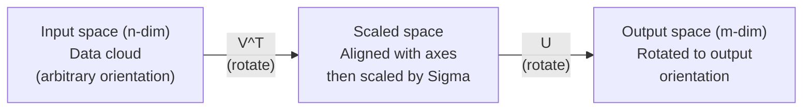
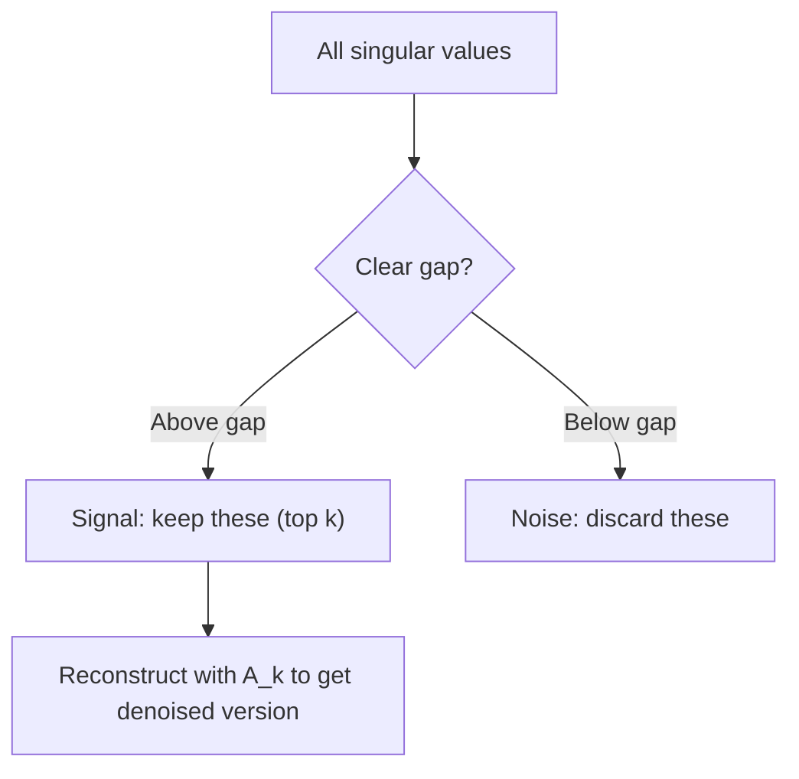

# 奇异值分解 (SVD)

> 瑞士军队的线性代数刀,每个矩阵都有一个.每个数据科学家都需要一个.
> 每个矩阵都有一个. 每个数据科学家都需要一个.

**Type:** Build | **类型:** 动手
**Languages:** Python, Julia | **语言:** Python, Julia
**Prerequisites:** Phase 1, Lessons 01 (Linear Algebra Intuition), 02 (Vectors & Matrices Operations), 03 (Matrix Transformations) | **前置知识:** Phase 1, Lessons 01-03
**Time:** ~120 minutes | **时间:** ~120 分钟

## 学习目标

- 通过功率代实现SVD并解释U,Sigma和V^T的几何意义
  通过代实现SVD,解释U、Sigma 和V^T的几何含义
- 应用缩短的SVD用于图像压缩,并测量压缩比与重建错误
  应用截断SVD 进行图像压缩,测量压缩与重建差
- 通过SVD计算摩尔-罗斯伪逆转,以解决过度确定最小平方的系统
  通过SVD计算摩尔-罗斯 伪逆来求解超定最小二乘系统
- 连接SVD与PCA,推系统 (隐藏因素) 和 NLP中的隐藏语义分析
  将SVD与PCA、推系统 (隐因子) 和NLP中的潜在语义分析联系起来

> **【中文解读】**
> 任何矩阵都能分解为U * Sigma * V^T──切断SVD可以缩小图像,用户电影评分矩阵的SVD可以发现隐因子(推系统的核心),文档-词频矩阵的SVD可以发现主题(LSA)──

> **【拓展：SVD 在 AI 中的位置】**
> - **推荐系统**网上网页版:Netflix 竞赛的胜利方案就是用户物品评分矩阵的SVD 分解.
> - **图像压缩**截断SVD只保留最大的几个奇异值,就能使用很少的数据接近原始图像.
> - **LSA (潜在语义分析)**基于这些问题,我们可以找到一个问题.

## 问题 问题引入

> **【中文解读】**你有一个1000×2000的矩阵;;可能是用户电影评分,文档词频表,图像像素) ⋅特征值分解只适用于方阵,SVD则适用于任意形状,任意排列的矩阵都有效. 它将矩阵分解为三个因子 U·Σ·V^T,揭示矩阵"做了什么"的几何质质.

也许是用户电影评级. 也许是文档术语频率表. 也许是图像的像素值. 你需要压缩它,消化它,找到隐藏的结构,或用它解决最小平方的系统. 固体组合只能在矩阵上工作. 即使如此,它也需要矩阵拥有完整的线性独立的固体直径.
> 也许是用户电影评分,也许是文档词频表,也许是图像图像. 你需要压缩它,去噪音,发现隐藏的结构,或用它来解决最小的二乘.

任何矩阵,任何形状,任何级别,没有条件,它分解矩阵成三个因素,这些因素揭示了矩阵对空间的几何学.这是线性代数中最普遍和最有用的因素化.
> 适用于任何矩阵――任何形状、任何配置、无条件――它将矩阵分解为三个因子,揭示矩阵对空间做了什么――它是线性代数中最普遍的――最有用的分解――

## 概念的核心概念

> **【拓展：SVD 是 LoRA 的数学根基】**洛拉微调的核心假设:权重更新矩阵 ΔW 是低排的.SVD 告诉我们,任何矩阵都可以分为 U·Σ·V^T,其中 Σ 中的奇异值按大小排列.LoRA只保留最大的 k 个奇异值对应的分量.

### 什么是SVD的几何含义

每个矩阵,不管形状,都在连续执行三个操作:旋转,规模,旋转.
> 每个矩阵,无论形状如何,都按顺序执行三个操作:旋转,缩放,旋转.

```
A = U * Sigma * V^T

      m x n     m x m    m x n    n x n
     (any)    (rotate)  (scale)  (rotate)
```

根据任何矩阵A,SVD将其计算为:
> 给定任意矩阵 A,SVD将其分解为:

- 输入空间中的向量 (n维)
  转向量中转向量
- 沿每个轴的西格马尺度 (延伸或压缩)
  标签 沿每个轴缩放 (拉伸或压缩)
- 转换成输出空间 (m维)
  结果将转到输出空间 (m 维)



现在,我们可以用这个方法来看看.我们给SVD一个矩阵.它告诉你:"这个矩阵取一个输入球,首先用V^T旋转它,然后用Sigma拉伸它到一个圆,然后用U旋转圆.
> 想象一下:你把矩阵交给SVD,它告诉你:"这个矩阵接收一组球面输入,先用V^T旋转,再用Sigma拉伸成球,再用U旋转球.

### 完全分解.

对于形状m x n的矩阵A:

```
A = U * Sigma * V^T

where:
  U     is m x m, orthogonal (U^T U = I)
  Sigma is m x n, diagonal (singular values on the diagonal)
  V     is n x n, orthogonal (V^T V = I)

The singular values sigma_1 >= sigma_2 >= ... >= sigma_r > 0
where r = rank(A)
```

号的列称为左单向量.V的列称为右单向量.Sigma的角角输入称为单向值.它们总是非负的,通常以降低顺序排序.
> U 的列称为左奇异向量,V 的列称为右奇异向量,Sigma 的对角线元素称为奇异值──它们始终是负的,按惯例降序列──

### 左单向量,单向值,右单向量.

任何SVD的组件都有不同的几何意义.
> 每个SVD分量都有独特的几何含义.

**Right singular vectors (columns of V):**这些构成输入空间 (R^n) 的正规基础.它们是矩阵在输入空间中的方向,它们将输出空间中的正方形方向映射到正方形方向.
> **右奇异向量（V 的列）：**构成输入空间 (R^n) 的正交基.它们是输入空间中的矩阵映射到输出空间正交方向的方向.

**Singular values (diagonal of Sigma):**它们是扩展因子.第1单数值告诉你矩阵在第1右单数向量上延伸多少向量.
> **奇异值（Sigma 的对角线）：**缩放因子――第一个 奇异值告诉你矩阵沿着第一个 右奇异向量方向拉伸多少――奇异值为零意味着矩阵完全压了该方向――

**Left singular vectors (columns of U):**这些构成输出空间 (R^m) 的正规基础.第1左单向量是输出空间中的方向,其中第1右单向量落地 (扩展后).
> **左奇异向量（U 的列）：**构成输出空间 (R^m) 的正交基──第 i 个左奇异向量是第 i 个右奇异向量(缩放后) 落在输出空间中的方向──

它们之间的关系:
> 它们之间的关系:

```
A * v_i = sigma_i * u_i

The matrix A takes the i-th right singular vector v_i,
scales it by sigma_i, and maps it to the i-th left singular vector u_i.
```

这给了你一个坐标对坐标的图像,任何矩阵的作用.
> 这为你提供任何矩阵操作的个性图像.

### 其他产品形式

标准的SVD可以写成一级矩阵的总和:
> 编写成 矩阵之和:

```
A = sigma_1 * u_1 * v_1^T + sigma_2 * u_2 * v_2^T + ... + sigma_r * u_r * v_r^T

Each term sigma_i * u_i * v_i^T is a rank-1 matrix (an outer product).
The full matrix is the sum of r such matrices, where r is the rank.
```

这种形式是低级近似的基础.每个术语增加一个结构层.第一术语捕捉到单个最重要的模式.第二个捕捉到下一个最重要的模式.
> 这种形式是低排序近似的基础. 每个增加一层结构. 第一,捕获最重要的模式,第二,捕获次要的模式,根据此类推.

```
Rank-1 approx:    A_1 = sigma_1 * u_1 * v_1^T
                  (captures the dominant pattern)

Rank-2 approx:    A_2 = sigma_1 * u_1 * v_1^T + sigma_2 * u_2 * v_2^T
                  (captures the two most important patterns)

Rank-k approx:    A_k = sum of top k terms
                  (optimal by the Eckart-Young theorem)
```

### 关于自己构成的关系与特征的关系

 A 的单一值和向量直接来自 A^T A 和 A^T 的 eigen值和 eigenvectors.
> 的奇异值和向量直接来自A^T A 和A^T的特征值和特征向量.

```
A^T A = V * Sigma^T * U^T * U * Sigma * V^T
      = V * Sigma^T * Sigma * V^T
      = V * D * V^T

where D = Sigma^T * Sigma is a diagonal matrix with sigma_i^2 on the diagonal.

So:
- The right singular vectors (V) are eigenvectors of A^T A
- The singular values squared (sigma_i^2) are eigenvalues of A^T A

Similarly:
A A^T = U * Sigma * V^T * V * Sigma^T * U^T
      = U * Sigma * Sigma^T * U^T

So:
- The left singular vectors (U) are eigenvectors of A A^T
- The eigenvalues of A A^T are also sigma_i^2
```

这种联系告诉你三个东西:
> 这位联系人告诉你三个事情:

1. 单独值总是真实且非负 (它们是正半定义矩阵的自值的平方根).
   奇异值始终为实数且非负数.
2. 您可以通过A^T A的自定义组合计算SVD,但这将条件数乘以平方,从而失去数值精度.
   可以通过A^T A的特征值分解计算SVD,但这会是平方条件数,损失数值精度.
3. 当A是正方形和对称正半确时,SVD和自体组合是相同的.
   当A 是方阵且对称正半定时,SVD 和特征值分解是一回事.

### 截止 SVD:低级近似

埃卡特-年轻-米尔斯基定理指出,最好的A级 k近似 (在弗罗贝尼斯和光谱规范中) 通过保持只有顶级k单数值及其相应的向量来获得:
> 埃卡特-年轻-米尔斯基 定理指出,A 的最佳排列近似 (在弗罗贝尼斯和谱范数下) 通过只保留前的 k 个奇异值及其应向量获得:

```
A_k = U_k * Sigma_k * V_k^T

where:
  U_k     is m x k  (first k columns of U)
  Sigma_k is k x k  (top-left k x k block of Sigma)
  V_k     is n x k  (first k columns of V)

Approximation error = sigma_{k+1}  (in spectral norm)
                    = sqrt(sigma_{k+1}^2 + ... + sigma_r^2)  (in Frobenius norm)
```

这不仅仅是"一个好的"近似. 它可能是最好的可能的接近级 k. 没有其他级 k矩阵接近A.
> 这不仅仅是"一个很好的"近似――它是可证明的排列 K 最好的近似――没有其他排列 K矩阵比它更接近 A――

| Component | Relative magnitude | Kept in rank-3 approx? / 保留在秩-3 近似中？ |
|-----------|-------------------|------------------------|
| sigma_1 | Largest / 最大 | Yes / 是 |
| sigma_2 | Large / 大 | Yes / 是 |
| sigma_3 | Medium-large / 中大 | Yes / 是 |
| sigma_4 | Medium / 中 | No (error) / 否（误差） |
| sigma_5 | Medium-small / 中小 | No (error) / 否（误差） |
| sigma_6 | Small / 小 | No (error) / 否（误差） |
| sigma_7 | Very small / 很小 | No (error) / 否（误差） |
| sigma_8 | Tiny / 极小 | No (error) / 否（误差） |

保持上方3:A_3捕获了最大的三个单一值.错误 =剩余值 (sigma_4到 sigma_8).

如果单数值快速衰退,一个小的 k 捕捉到矩阵的大部分.如果它们慢慢衰退,矩阵没有低级结构.
> 如果奇异值快速衰退,小的 k 就能捕获矩阵的大部分.

### 通过SVD压缩图像

灰色图像是一个像素强度矩阵.一个800x600图像有480,000个值.SVD允许你用更少的方法接近它.
> 灰度图像是像素强度矩阵──800x600的图像有480,000个值──SVD可以用远小于此的值来接近──

```
Original image: 800 x 600 = 480,000 values

SVD with rank k:
  U_k:      800 x k values
  Sigma_k:  k values
  V_k:      600 x k values
  Total:    k * (800 + 600 + 1) = k * 1401 values

  k=10:   14,010 values   (2.9% of original)
  k=50:   70,050 values  (14.6% of original)
  k=100: 140,100 values  (29.2% of original)

  The compression ratio improves as k gets smaller,
  but visual quality degrades.
```

基本的见解:自然图像具有快速衰退的单一值.第一几个单一值捕捉到广泛的结构 (形状,梯度).后来的捕捉细节和噪音.在50级的缩小通常产生一个图像看起来几乎相同的原始,同时使用85%少的存储.
> 关键洞见:自然图像的奇异值快速衰退.前几种奇异值捕获宏观结构,后面的捕获细节和噪音. 在排列50处的截图中通常产生与原图几乎相同的图像,同时节省了85%的储存.

### 推系统的SVD.

利斯奖让这成为了名人. 你有一个用户电影评级矩阵,
> 网上电影网 网上电影网 网上电影网 网上电影网 网上电影网 网上电影网 网上电影网 网上电影网 网上电影网 网上电影网 网上电影网 网上电影网 网上电影网 网上电影网 网上电影网 网上电影网 网上电影网 网上电影网 网上电影网 网上电影网 网上电影网 网上电影网 网上电影网 网上电影网 网上电影网 网上电影网 网上电影网 网上电影网 网上电影网 网上电影网 网上电影网 网上电影网 网上电影网 网上电影网 网上电影网 网上电影网 网上电影网 网上电影网 网上电影网 网上电影网 网上电影网 网上网上网上电影网 网上网上网上网上娱乐网 网上娱乐 网上网上娱乐 网上网上网上网上网上娱乐 网上网上网上网上网上 网上网上网上网上网上网址

```
             Movie1  Movie2  Movie3  Movie4  Movie5
  User1      [  5      ?       3       ?       1  ]
  User2      [  ?      4       ?       2       ?  ]
  User3      [  3      ?       5       ?       ?  ]
  User4      [  ?      ?       ?       4       3  ]

  ? = unknown rating
```

观念:这个评级矩阵的排名低.用户没有完全独立的品味.有几种隐藏因素 (行动与戏剧,旧与新,脑与内心) 解释了大多数偏好.
> 核心思想:评分矩阵是低排的.用户的品味并非完全独立.

对于 (填充) 评级矩阵的SVD,将其分解为:
> 对于 ((填充后的) 评分矩阵做 SVD 分解为:

- U:隐因子空间中的用户图像
- 语:每个隐因子的重要性
- 隐因子空间中的电影画像

用户预测电影的评级是用户个人资料的点数量和电影的个人资料 (按单数值权重).低级近似填写缺失的条目.
> 用户对电影的预测评分是其用户图片和电影图片的点积 (加权奇异值) 〔低排名近似填充缺失条目〕

### 无线性语言的SVD:潜力语义分析

隐形语义分析 (LSA),也称为隐形语义指数 (LSI),将SVD应用于术语文档矩阵.
> 潜在语义分析 (LSA) 将SVD应用于词文档矩阵.

```
             Doc1   Doc2   Doc3   Doc4
  "cat"      [  3      0      1      0  ]
  "dog"      [  2      0      0      1  ]
  "fish"     [  0      4      1      0  ]
  "pet"      [  1      1      1      1  ]
  "ocean"    [  0      3      0      0  ]

After SVD with rank k=2:

  Each document becomes a point in 2D "concept space."
  Each term becomes a point in the same 2D space.
  Documents about similar topics cluster together.
  Terms with similar meanings cluster together.
```

基于原始文本的语义相似性,LSA是首个成功的方法之一.它是因为同义词往往出现在类似文档中,因此SVD将它们分为相同的隐藏维度.现代词嵌入 (Word2Vec, GloVe) 可以被视为这一想法的后代.
> 由于同义词往往出现在相似的文档中,SVD将它们归纳于相同的隐维度.

### 为了降低噪音,SVD用于降低噪音.

噪音数据的信号集中在最高单数值,噪音分布在所有单数值.
> 噪音数据中信号集中在顶部的奇异值中,噪音分散在所有奇异值中.



任何一个因添加噪音而损坏的矩阵,短缩的SVD是分离信号和噪音的原则性方法.
> 截断SVD是一种原则性信号与噪音分离方法,只要您有增加噪音污染的矩阵.

### 通过SVD计算伪逆

摩尔-罗斯伪逆向A+将矩阵逆向将用于非正方形和单一矩阵.SVD使得计算很简单.
> 摩尔-罗斯 伪逆 A+ 将矩阵求逆推广到非方阵和奇异矩阵――SVD 使计算变得简单――

```
If A = U * Sigma * V^T, then:

A+ = V * Sigma+ * U^T

where Sigma+ is formed by:
  1. Transpose Sigma (swap rows and columns)
  2. Replace each non-zero diagonal entry sigma_i with 1/sigma_i
  3. Leave zeros as zeros
```

如果 Ax = b 没有准确的解决方案 (过于确定系统),那么x = A+ b 是最小的正方形解决方案 (最小化了不x - b 时时).
> 假逆求解最小二乘解问题──如果Ax = b 没有精确解 ((超定系统),则x = A+b 是最小二乘解──

### 数字稳定性优势

计算A^T A的自成组合,方乘以单数值 (A^T A的自成值是sigma_i^2).
> 计算 A^T A 的特征值分解会平方奇异值,平方条件数,放大数值差距──

现代SVD算法 (Golub-Kahan双诊断) 直接在A上工作,从来没有形成A^TA.`np.linalg.svd(A)`现在`np.linalg.eig(A.T @ A)`现在,我们要去.
> 现代SVD算法直接对A操作,不形成A^TA.`np.linalg.svd(A)`而不是`np.linalg.eig(A.T @ A)`,我知道.

### 连接到PCA 连接到PCA

基于数据的PCA是SVD. 这不是一个比喻. 这实际上是相同的计算.
> 对于中心化数据做SVD. 这不是类比,是完全相同的计算.

```
Given data matrix X (n_samples x n_features), centered (mean subtracted):

Covariance matrix: C = (1/(n-1)) * X^T X

PCA finds eigenvectors of C. But:

  X = U * Sigma * V^T    (SVD of X)

  X^T X = V * Sigma^2 * V^T

  C = (1/(n-1)) * V * Sigma^2 * V^T

So the principal components are exactly the right singular vectors V.
The explained variance for each component is sigma_i^2 / (n-1).

In sklearn, PCA is implemented using SVD, not eigendecomposition.
It is faster and more numerically stable.
```

这意味着10课时你学到的关于减小维度的一切都是SVD在帽子下.
> 这意味着你在10课中学到的降维内容底层都是SVD──PCA是机器学习中SVD最常见的应用──

## 建立它,实现它.
```figure
svd-rank-reconstruction
```

## 建立它

### 首先,使用电源代码,从零实现SVD.

想法:要找到最大的单数值及其向量,使用A^T A (或A A^T) 的功率反复.然后,将矩阵减值,并重复下一个单数值.
> 思考:用代在A^T A 上找最大奇异值及其向量,然后缩矩阵,重复找下一个奇异值.

```python
import numpy as np

def power_iteration(M, num_iters=100):
    n = M.shape[1]
    v = np.random.randn(n)
    v = v / np.linalg.norm(v)

    for _ in range(num_iters):
        Mv = M @ v
        v = Mv / np.linalg.norm(Mv)

    eigenvalue = v @ M @ v
    return eigenvalue, v

def svd_from_scratch(A, k=None):
    m, n = A.shape
    if k is None:
        k = min(m, n)

    sigmas = []
    us = []
    vs = []

    A_residual = A.copy().astype(float)

    for _ in range(k):
        AtA = A_residual.T @ A_residual
        eigenvalue, v = power_iteration(AtA, num_iters=200)

        if eigenvalue < 1e-10:
            break

        sigma = np.sqrt(eigenvalue)
        u = A_residual @ v / sigma

        sigmas.append(sigma)
        us.append(u)
        vs.append(v)

        A_residual = A_residual - sigma * np.outer(u, v)

    U = np.column_stack(us) if us else np.empty((m, 0))
    S = np.array(sigmas)
    V = np.column_stack(vs) if vs else np.empty((n, 0))

    return U, S, V
```

### 测试并与NumPy比较

```python
np.random.seed(42)
A = np.random.randn(5, 4)

U_ours, S_ours, V_ours = svd_from_scratch(A)
U_np, S_np, Vt_np = np.linalg.svd(A, full_matrices=False)

print("Our singular values:", np.round(S_ours, 4))
print("NumPy singular values:", np.round(S_np, 4))

A_reconstructed = U_ours @ np.diag(S_ours) @ V_ours.T
print(f"Reconstruction error: {np.linalg.norm(A - A_reconstructed):.8f}")
```

### 步骤3:图像压缩演示

```python
def compress_image_svd(image_matrix, k):
    U, S, Vt = np.linalg.svd(image_matrix, full_matrices=False)
    compressed = U[:, :k] @ np.diag(S[:k]) @ Vt[:k, :]
    return compressed

image = np.random.seed(42)
rows, cols = 200, 300
image = np.random.randn(rows, cols)

for k in [1, 5, 10, 20, 50]:
    compressed = compress_image_svd(image, k)
    error = np.linalg.norm(image - compressed) / np.linalg.norm(image)
    original_size = rows * cols
    compressed_size = k * (rows + cols + 1)
    ratio = compressed_size / original_size
    print(f"k={k:>3d}  error={error:.4f}  storage={ratio:.1%}")
```

### 减噪的步骤:减噪.

```python
np.random.seed(42)
clean = np.outer(np.sin(np.linspace(0, 4*np.pi, 100)),
                 np.cos(np.linspace(0, 2*np.pi, 80)))
noise = 0.3 * np.random.randn(100, 80)
noisy = clean + noise

U, S, Vt = np.linalg.svd(noisy, full_matrices=False)
denoised = U[:, :5] @ np.diag(S[:5]) @ Vt[:5, :]

print(f"Noisy error:    {np.linalg.norm(noisy - clean):.4f}")
print(f"Denoised error: {np.linalg.norm(denoised - clean):.4f}")
print(f"Improvement:    {(1 - np.linalg.norm(denoised - clean) / np.linalg.norm(noisy - clean)):.1%}")
```

### 五步:伪逆.

```python
A = np.array([[1, 1], [2, 1], [3, 1]], dtype=float)
b = np.array([3, 5, 6], dtype=float)

U, S, Vt = np.linalg.svd(A, full_matrices=False)
S_inv = np.diag(1.0 / S)
A_pinv = Vt.T @ S_inv @ U.T

x_svd = A_pinv @ b
x_lstsq = np.linalg.lstsq(A, b, rcond=None)[0]
x_pinv = np.linalg.pinv(A) @ b

print(f"SVD pseudoinverse solution:  {x_svd}")
print(f"np.linalg.lstsq solution:   {x_lstsq}")
print(f"np.linalg.pinv solution:    {x_pinv}")
```

## 用它实现框架

现在有完整的演示.`code/svd.py`运行它,以看到SVD用于图像压缩,推系统,隐藏语义分析和噪音降低.
> 完整可运行的演示在`code/svd.py`中──运行可见SVD应用于图像压缩、推系统、潜在语义分析和降噪──

```bash
python svd.py
```

朱莉亚版本在`code/svd.jl`通过朱莉亚的母语来证明相同的概念`svd()`功能和`LinearAlgebra`包装.
> `code/svd.jl`中的朱莉亚 版本使用朱莉亚 原生 `svd()`函数和 `LinearAlgebra`包演示相同的概念.

```bash
julia svd.jl
```

## 运送它.

这一课产生了:
> 本课程产出:

- `outputs/skill-svd.md`- 知道如何在实际项目中应用SVD的技能
  一份关于如何在真实项目中应用SVD的技能文件

## 练习题

1. 执行从零开始的全SVD,而不使用功率代. 相反,计算A^T A的自成组合,以获得V和单一值,然后计算U =A V Sigma^{-1}.与你的功率代版本和NumPy进行数值准确度比较.
   不用代代从零实现完整的SVD──改为计算A^T A的特征值分解以获得V 和奇异值,然后计算U =A V Sigma^{-1}──比较数值精度──

2. 输入一个真实的灰度图像 (或将其转换为灰度图像).将其压缩在排列1,5,10,25和50等.
   加载一张真实灰度图像──用查看 1、5、10、25、50、100 压缩──计算每查看的压缩比与相对差异──找到图像视觉可接受的查看──

3. 建立一个小的推系统.创建一个10×8用户电影评级矩阵,包含一些已知条目.用行方法填写缺失的条目.计算SVD并重建3级近似.使用重建矩阵预测缺失的评级.
   构建一个小型推系统――创建10x8 用户电影评分矩阵――使用行平均值填补缺失条目――计算SVD 并重建排-3近似――使用重建矩阵预测缺失评分――

4. 创建一个100x50的文档术语矩阵,包含3个合成主题.每个主题都有5个相关的术语.添加噪音.应用SVD并验证前3个单一值比其余值大得多.将文档项目进入3D隐形空间,并检查来自同一主题集群的文档.
   创建一个有3个合成主题的100x50文档词矩阵――每个主题有5个关联词――加噪声――应用SVD 验证前3个奇异值远大于其余的――

5. 生成一个清洁的低级矩阵 (排名3,尺寸50x40) 并在不同的水平上添加高斯噪音 (sigma = 0.1, 0.5, 1.0, 2.0).对于每个噪音水平,通过扫描k从1到40来找到最佳的切割级别,并测量清洁矩阵的重建错误.
   生成干净的排列3矩阵 ((50x40),加不同级别的高噪声――通过扫描找到最好的截分排列――

## 关键词 快速查找表

| Term / 术语 | What people say | What it actually means / 实际含义 |
|------|----------------|----------------------|
| SVD / 奇异值分解 | "Factor any matrix" | Decompose A into U Sigma V^T where U and V are orthogonal and Sigma is diagonal with non-negative entries. Works for any matrix of any shape. / 将 A 分解为 U Sigma V^T，U 和 V 正交，Sigma 对角非负。适用于任何形状的矩阵。 |
| Singular value / 奇异值 | "How important this component is" | The i-th diagonal entry of Sigma. Measures how much the matrix stretches along the i-th principal direction. / Sigma 的第 i 个对角线元素。衡量矩阵沿第 i 主方向的拉伸程度。 |
| Left singular vector / 左奇异向量 | "Output direction" | A column of U. The direction in output space that the i-th right singular vector maps to. / U 的列。第 i 个右奇异向量映射到的输出空间方向。 |
| Right singular vector / 右奇异向量 | "Input direction" | A column of V. The direction in input space that the matrix maps to the i-th left singular vector. / V 的列。矩阵映射到第 i 个左奇异向量的输入空间方向。 |
| Truncated SVD / 截断 SVD | "Low-rank approximation" | Keep only the top k singular values and their vectors. Produces the provably best rank-k approximation (Eckart-Young theorem). / 只保留前 k 个奇异值及其向量。产生可证明的最佳秩-k 近似。 |
| Rank / 秩 | "True dimensionality" | The number of non-zero singular values. Tells you how many independent directions the matrix actually uses. / 非零奇异值的数量。告诉你矩阵实际使用多少独立方向。 |
| Pseudoinverse / 伪逆 | "Generalized inverse" | V Sigma+ U^T. Inverts non-zero singular values, leaves zeros as zeros. Solves least-squares for non-square or singular matrices. / V Sigma+ U^T。反转非零奇异值，零保持不变。 |
| Condition number / 条件数 | "How sensitive to errors" | sigma_max / sigma_min. A large condition number means small input changes cause large output changes. / sigma_max / sigma_min。条件数大意味着小的输入变化引起大的输出变化。 |
| Latent factor / 隐因子 | "Hidden variable" | A dimension in the low-rank space discovered by SVD. In recommendations, a genre preference. In NLP, a topic. / SVD 发现的低秩空间中的维度。推荐中是类型偏好，NLP 中是主题。 |
| Frobenius norm / Frobenius 范数 | "Total matrix size" | Square root of the sum of squared entries. Equals sqrt of sum of squared singular values. / 所有元素平方和的平方根。等于奇异值平方和的平方根。 |
| Eckart-Young theorem / Eckart-Young 定理 | "SVD gives the best compression" | For any target rank k, the truncated SVD minimizes the approximation error over all possible rank-k matrices. / 对任意目标秩 k，截断 SVD 在所有可能的秩-k 矩阵中最小化近似误差。 |
| Power iteration / 幂迭代 | "Find the biggest eigenvector" | Repeatedly multiply a random vector by the matrix and normalize. Converges to the largest eigenvector. / 反复将随机向量乘以矩阵并归一化。收敛到最大特征向量。 |

## 继续阅读 继续阅读

- [Gilbert Strang: Linear Algebra and Its Applications, Chapter 7](https://math.mit.edu/~gs/linearalgebra/)- 通过应用进行了SVD的彻底治疗
  完整处理与应用
- [3Blue1Brown: But what is the SVD?](https://www.youtube.com/watch?v=vSczTbgc8Rc)- 对于SVD的几何直觉
  苏联的几何直觉
- [We Recommend a Singular Value Decomposition](https://www.ams.org/publicoutreach/feature-column/fcarc-svd)- 美国数学学会的可访问概述
  来自AMS的SVD入门概述
- [Netflix Prize and Matrix Factorization](https://sifter.org/~simon/journal/20061211.html)- 关于SVD的Simon Funk的原始博客文章
  关于SVD 推的原始博客
- [Latent Semantic Analysis](https://en.wikipedia.org/wiki/Latent_semantic_analysis)- 苏维埃的原始NLP应用
  在NLP中SVD的原始应用
- [Numerical Linear Algebra by Trefethen and Bau](https://people.maths.ox.ac.uk/trefethen/text.html)- 了解SVD算法的黄金标准
  了解SVD算法的黄金标准
