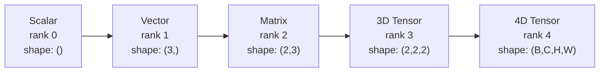
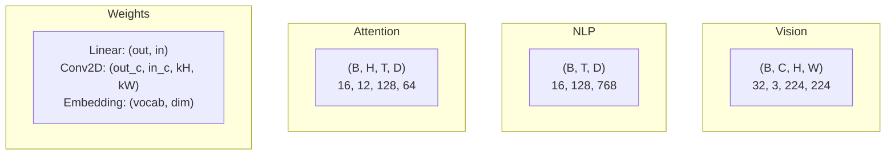
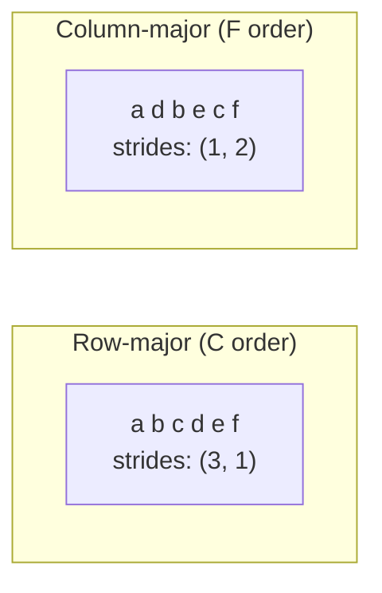
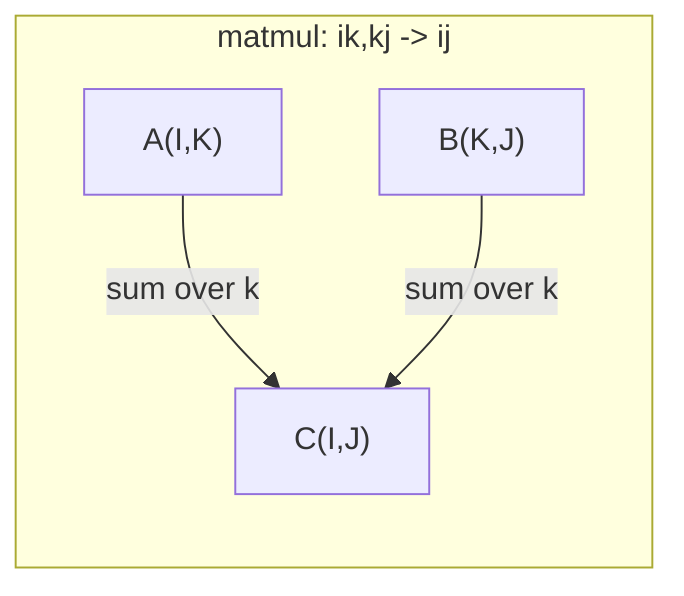

# 张量运算

> 电压器是数据和深度学习之间的共同语言. 每个图像,每句话,每一个梯度都流过它们.
> 张量是数据和深度学习的通用语言.

**Type:** Build | **类型:** 动手
**Language:**子**语言:**字符串
**Prerequisites:** Phase 1, Lessons 01 (Linear Algebra Intuition), 02 (Vectors, Matrices & Operations) | **前置知识:** Phase 1, Lessons 01-02
**Time:** ~90 minutes | **时间:** ~90 分钟

## 学习目标

- 实现一个子类,从零开始进行形状,步骤,重塑,转换和元素智能操作
  从零实现形状,步长,重塑,转置和元素操作的张量类
- 应用广播规则,以无需复制数据而使用不同形状的光器
  应用广播规则 无需复制数据来操作不同形状的张量
- 写点产品,矩阵乘法,外部产品和批量操作的数量表达式
  编写数量表达实现点积、矩阵乘法、外积和批量操作
- 通过多头关注的每个步骤,追踪精确的光形状
  随着多头注意力中每一步的精确张量形状

> **【中文解读】**
> 张量是数据和深度学习的通用语言. 量是张量,矩阵是二维张量,RGB 图像是三维张量. 本章从零实现张量类,理解形状、步长、广播和 einsum.

## 问题 问题引入

> **【中文解读】**你建立了一个变压器,运行后报错`RuntimeError: shapes cannot be multiplied (32x768 and 512x768)`△形状错误是深度学习中最常见的错误. 变压器有几十个重塑/转换/播放操作串联,一个轴搞错就在级联报错.

## 概念的核心概念

> **【拓展：张量 shape 是 AI 工程师的日常】**调试神经网络 90% 的时间在处理形状问题.`print(tensor.shape)`查看形状,`.reshape()`重塑,`.transpose()`转置,`.unsqueeze()`增加维度──PyTorch 的数量`torch.einsum('bhd,bhd->bh', q, k)`通过爱因斯坦的求和约定一行搞定复杂张量运算,是变压器实现的利器.

### 什么是张量?

子是一个多维数组,具有统一的数据类型.**rank**(或**order**它们的每一个维度都是**axis**现在,我们要去.**shape**是一个图布列出各轴的尺寸.
> 张量是具有统一数据类型的多维数组.**秩**(或**阶**),每维度是一个**轴**没有任何**形状**是各轴大小的元组列出.



总元素 =所有尺寸的产量.`(2, 3, 4)`保持`2 * 3 * 4 = 24`其他元素.
> 总元素数 = 所有维度大小的乘积――形状`(2, 3, 4)`包含`2 * 3 * 4 = 24`个元素.

### 强度学习中的张量形状

根据传统,不同的数据类型将数据映射到特定的光形状.
> 不同的数据类型按惯例映射到特定的张量形状.



光器使用NCHW (频道第一).TensorFlow默认情况下为NHWC (频道最后).不匹配的布局导致沉默的放缓或错误.
> 电器使用NCHW (通道在前),电流默认NHWC (通道在后) 布局不匹配会导致隐性减速或错误.

### 记忆布局原理

存储中的2D数组是1D字节序列. **Strides**告诉你要跳过多少元素,以沿每个轴迈出一步.
> 内存中的2D 数组是1D字节序列.**步长**告诉你每一个轴的移动步骤需要跳过多少元素.



转换不会移动数据,而是交换步骤,从而产生子.**non-contiguous**列中的元素不再是相邻的.
> 转置不移动数据――它交换步长,使张量**不连续**一行元素不再在内存中相邻.

### 广播规则

广播允许你在不同形状的子上操作,而不需要复制数据.从右边对齐形状.两个维度是相容的,当它们等等或一个是1. 较少的维度被左边的1填充.
> 广播让你对形状的不同张量操作而无需复制数据――从右对齐形状――两个维度相等或其中一个为1 时兼容――较少的维度在左侧填充1――

```
Tensor A:     (8, 1, 6, 1)
Tensor B:        (7, 1, 5)
Padded B:     (1, 7, 1, 5)
Result:       (8, 7, 6, 5)
```

### 总体的数操作

爱因斯坦的总和标签每一个轴的字母.输入中的轴,但输出的轴不被总和.
> 爱因斯坦 求和用字母标记每个轴――在输入中但不在输出中轴被求和――两者都有轴保留――



关键模式:`i,i->`(点积/点积),`i,j->ij`(外产品 / 外积),`ii->`其他地方`ij->ji`(转置/转置),`bij,bjk->bik`(批量矩阵乘法),`bhtd,bhsd->bhts`们的注意力分数

## 建立它,实现它.
```figure
tensor-broadcast
```

## 建立它

代码生活在`code/tensors.py`每一步都指向了执行.
> 代码在`code/tensors.py`现在,我们在这个过程中,

### 电压存储和步骤

子存储一个平面的数字列表加上形状的元数据.步骤告诉索引如何将多维指数映射到平面位置.
> 张量存储一个平的数字列表加上形状元数据――步长告诉索引逻辑如何将多维索引映射到平位置――

```python
class Tensor:
    def __init__(self, data, shape=None):
        if isinstance(data, (list, tuple)):
            self._data, self._shape = self._flatten_nested(data)
        elif isinstance(data, np.ndarray):
            self._data = data.flatten().tolist()
            self._shape = tuple(data.shape)
        else:
            self._data = [data]
            self._shape = ()

        if shape is not None:
            total = reduce(lambda a, b: a * b, shape, 1)
            if total != len(self._data):
                raise ValueError(
                    f"Cannot reshape {len(self._data)} elements into shape {shape}"
                )
            self._shape = tuple(shape)

        self._strides = self._compute_strides(self._shape)

    @staticmethod
    def _compute_strides(shape):
        if len(shape) == 0:
            return ()
        strides = [1] * len(shape)
        for i in range(len(shape) - 2, -1, -1):
            strides[i] = strides[i + 1] * shape[i + 1]
        return tuple(strides)
```

为了形状`(3, 4)`进步是`(4, 1)`-- 跳过4个元素,以推进一行,跳过1个元素,以推进一列.
> 对于形状`(3, 4)`步长为`(4, 1)`前进一行跳过4个元素,前进一列跳过1个元素.

### 步骤2:重塑,压缩,扩展

换型变形,不变元素顺序. 元素的总数必须保持相同. 使用 `-1`为了推断其尺寸.
> 换形 改变形状 不改变元素序列――总元素数必须不变――用`-1`自动推断某一维大小.

```python
t = Tensor(list(range(12)), shape=(2, 6))
r = t.reshape((3, 4))
r = t.reshape((-1, 3))
```

压缩取消一个尺寸的轴.不压缩插入一个.不压缩对于广播至关重要 - - 一个偏向向`(D,)`加入一批`(B, T, D)`需要不压缩`(1, 1, D)`现在,我们要去.
> 压缩 移除大小为 1 的轴,压缩 插入一个――压缩 对广播至关重要偏向向量`(D,)`增加到批次`(B, T, D)`上需要除到`(1, 1, D)`,我知道.

```python
t = Tensor(list(range(6)), shape=(1, 3, 1, 2))
s = t.squeeze()
v = Tensor([1, 2, 3])
u = v.unsqueeze(0)
```

### 转置与排列的第三步:转置与排列

转换两个轴,转换所有轴,这样将NCHW和NHWC转换.
> 转换两个轴――转换重排所有轴――这是NCHW和NHWC之间转换的方法――

```python
mat = Tensor(list(range(6)), shape=(2, 3))
tr = mat.transpose(0, 1)

t4d = Tensor(list(range(24)), shape=(1, 2, 3, 4))
perm = t4d.permute((0, 2, 3, 1))
```

在转移或转移后,电在内存中不连接.`view`没有连接的子失败--使用 `reshape`或打电话`.contiguous()`首先,我需要一个.
> 转置或排列后,张量在内存中不连续.`view`在不连续张量上会失败使用 `reshape`或先调用`.contiguous()`,我知道.

### 步骤4:元素操作和归约

元素智能操作 (添加,乘以,减去) 独立适用于每个元素并保留形状.减小 (总和,平均,最大) 崩一个或多个轴.
> 逐元素操作 (加乘减) 独立应用于每个元素并保持形状.

```python
a = Tensor([[1, 2], [3, 4]])
b = Tensor([[10, 20], [30, 40]])
c = a + b
d = a * 2
s = a.sum(axis=0)
```

全球平均汇集在CNN中:`(B, C, H, W).mean(axis=[2, 3])`产量`(B, C)`序列中等在NLP中汇集:`(B, T, D).mean(axis=1)`产量`(B, D)`现在,我们要去.
> 美国广播公司中全局平均化:`(B, C, H, W).mean(axis=[2, 3])`产生`(B, C)`△NLP 中序列平均值池化:`(B, T, D).mean(axis=1)`产生`(B, D)`,我知道.

### 五步:使用NumPy实现广播

其他`demo_broadcasting_numpy()`功能`tensors.py`它们显示了核心模式.
> `tensors.py`中中 `demo_broadcasting_numpy()`函数展示了核心模式――

```python
activations = np.random.randn(4, 3)
bias = np.array([0.1, 0.2, 0.3])
result = activations + bias

images = np.random.randn(2, 3, 4, 4)
scale = np.array([0.5, 1.0, 1.5]).reshape(1, 3, 1, 1)
result = images * scale

a = np.array([1, 2, 3]).reshape(-1, 1)
b = np.array([10, 20, 30, 40]).reshape(1, -1)
outer = a * b
```

通过广播的双距离:重塑`(M, 2)`为了`(M, 1, 2)`其他`(N, 2)`为了`(1, N, 2)`总算在最后一个轴上,取平方根.结果: `(M, N)`现在,我们要去.
> 通过广播计算成对距离:将`(M, 2)`重塑为`(M, 1, 2)`没有任何`(N, 2)`重塑为`(1, N, 2)`结果: 结果: 结果: 结果:`(M, N)`,我知道.

### 步骤6: 积操作

其他`demo_einsum()`其他`demo_einsum_gallery()`函数通过每个常见模式.
> `demo_einsum()`和 `demo_einsum_gallery()`函数演示了每种常见模式.

```python
a = np.array([1.0, 2.0, 3.0])
b = np.array([4.0, 5.0, 6.0])
dot = np.einsum("i,i->", a, b)

A = np.array([[1, 2], [3, 4], [5, 6]], dtype=float)
B = np.array([[7, 8, 9], [10, 11, 12]], dtype=float)
matmul = np.einsum("ik,kj->ij", A, B)

batch_A = np.random.randn(4, 3, 5)
batch_B = np.random.randn(4, 5, 2)
batch_mm = np.einsum("bij,bjk->bik", batch_A, batch_B)
```

收缩的计算成本是所有指数尺寸的产物 (保持和总和).`bij,bjk->bik`具有B=32,I=128,J=64,K=128:`32 * 128 * 64 * 128 = 33,554,432`乘以加.
> 缩小的计算成本是所有索引大小的乘积.

### 七步:使用一数实现注意力机制

其他`demo_attention_einsum()`功能实现多头关注的终端到终端.
> `demo_attention_einsum()`函数端到端实现多头注意力――

```python
B, H, T, D = 2, 4, 8, 16
E = H * D

X = np.random.randn(B, T, E)
W_q = np.random.randn(E, E) * 0.02

Q = np.einsum("bte,ek->btk", X, W_q)
Q = Q.reshape(B, T, H, D).transpose(0, 2, 1, 3)

scores = np.einsum("bhtd,bhsd->bhts", Q, K) / np.sqrt(D)
weights = softmax(scores, axis=-1)
attn_output = np.einsum("bhts,bhsd->bhtd", weights, V)

concat = attn_output.transpose(0, 2, 1, 3).reshape(B, T, E)
output = np.einsum("bte,ek->btk", concat, W_o)
```

每一步都是一个子操作:投影 (通过 einsum 的 matmul),头部分化 (重塑 + 转换),注意力分数 (通过 einsum 的 batch matmul),权重总数 (通过 einsum 的 batch matmul),头部合并 (通过 einsum 的 matmul + 转换),输出投影 (通过 einsum 的 matmul).
> 每一步都是张量操作:投影数 矩阵乘法) 头分裂数 量量矩阵乘法) 加权求和头合并数 输出投影

## 用它实现框架

### 抓到数码,写到数码.

| Operation / 操作 | Scratch (Tensor class) | NumPy |
|---|---|---|
| Create / 创建 | `Tensor([[1,2],[3,4]])` | `np.array([[1,2],[3,4]])` |
| Reshape / 重塑 | `t.reshape((3,4))` | `a.reshape(3,4)` |
| Transpose / 转置 | `t.transpose(0,1)` | `a.T` or `a.transpose(0,1)` |
| Squeeze / 压缩 | `t.squeeze(0)` | `np.squeeze(a, 0)` |
| Sum / 求和 | `t.sum(axis=0)` | `a.sum(axis=0)` |
| Einsum | N/A | `np.einsum("ij,jk->ik", a, b)` |

### 抓到PyTorch

```python
import torch

t = torch.tensor([[1, 2, 3], [4, 5, 6]], dtype=torch.float32)
t.shape
t.stride()
t.is_contiguous()

t.reshape(3, 2)
t.unsqueeze(0)
t.transpose(0, 1)
t.transpose(0, 1).contiguous()

torch.einsum("ik,kj->ij", A, B)
```

皮托尔奇添加了自动化,GPU支持和优化的BLAS内核.形状语义是相同的.如果你理解了零碎版本,PyTorch形状错误会变得可读.
> 皮托尔奇 增加了自动微分、GPU 支持和优化BLAS 内核──形状语义完全相同──理解手写版本后,皮托尔奇的形状错误变得可读──

### 每个神经网络层都是张量操作.

| Operation / 操作 | Tensor Form / 张量形式 | Einsum |
|---|---|---|
| Linear layer / 线性层 | `Y = X @ W.T + b` | `"bd,od->bo"` + bias |
| Attention QKV | `Q = X @ W_q` | `"btd,dh->bth"` |
| Attention scores / 注意力分数 | `Q @ K.T / sqrt(d)` | `"bhtd,bhsd->bhts"` |
| Attention output / 注意力输出 | `softmax(scores) @ V` | `"bhts,bhsd->bhtd"` |
| Batch norm / 批归一化 | `(X - mu) / sigma * gamma` | element-wise + broadcast |
| Softmax | `exp(x) / sum(exp(x))` | element-wise + reduction |

## 运送它.

这一课产生了两个可重复使用的提示:
> 本课程产出两个可重复的提示词:

1. **`outputs/prompt-tensor-shapes.md`**系统性提示,用于调试子形状不一致.
   一份系统性的张量形状不匹配调试提示词――

2. **`outputs/prompt-tensor-debugger.md`**-- 一个步骤的调试提示,当一个形状错误阻碍你时,
   一个逐步调试提示词,在形状错误阻塞时粘贴到任何AI助手中.

## 练习题

1. **Easy -- Reshape round-trip.**取一个形状子`(2, 3, 4)`改装它.`(6, 4)`然后到`(24,)`然后回到`(2, 3, 4)`通过打印平面数据,每一步都保持验证元素的顺序.
   **简单 -- 重塑往返。**取形状`(2, 3, 4)`张量,重塑为`(6, 4)`为了`(24,)`现在再回来吧`(2, 3, 4)`△验证元素顺序保持不变──

2. **Medium -- Implement broadcasting.**扩大`Tensor`类型`broadcast_to(shape)`通过扩大尺寸的方法,将尺寸扩大到尺寸的尺寸,`_elementwise_op`通过模具进行测试.`(3, 1)`其他`(1, 4)`生产`(3, 4)`现在,我们要去.
   **中等 -- 实现广播。**在`Tensor`类中添加`broadcast_to(shape)`方法――修改`_elementwise_op`自动广播──测试 `(3, 1)`和 `(1, 4)`产生`(3, 4)`,我知道.

3. **Hard -- Build einsum from scratch.**实施一个基本的`einsum(subscripts, *tensors)`处理至少:点产量 (`i,i->`),矩阵乘以 (`ij,jk->ik`),外观产品 (`i,j->ij`),并将其转化 (`ij->ji`分析子字符串,确定合约的指数,并循环对所有指数组合进行分析.`np.einsum`现在,我们要去.
   **困难 -- 从零构建 einsum。**实现基本的`einsum`函数处理点积、矩阵乘法、外积和转置──解析下标字符串,识别缩小索引,遍历所有索引组合──

4. **Hard -- Attention shape tracker.**写一个函数,需要`batch_size`现在`seq_len`现在`embed_dim`其他`num_heads`作为输入和印记的确切的形状在每一步的多头注意力.
   **困难 -- 注意力形状追踪器。**编写函数,输入`batch_size`,我知道.`seq_len`,我知道.`embed_dim`和 `num_heads`印制多头注意每一步的精确形状.

## 关键词 快速查找表

| Term / 术语 | What people say | What it actually means / 实际含义 |
|---|---|---|
| Tensor / 张量 | "A matrix but more dimensions" | A multi-dimensional array with uniform type and defined shape, strides, and operations / 具有统一类型和定义的形状、步长、操作的多维数组 |
| Rank / 秩 | "The number of dimensions" | The number of axes. A matrix has rank 2, not rank equal to its matrix rank / 轴的数量。矩阵的秩为 2 |
| Shape / 形状 | "The size of the tensor" | A tuple listing the size along each axis. `(2, 3)` means 2 rows, 3 columns / 列出各轴大小的元组 |
| Stride / 步长 | "How memory is laid out" | The number of elements to skip to advance one position along each axis / 沿每个轴前进一个位置要跳过的元素数 |
| Broadcasting / 广播 | "It just works when shapes differ" | A strict set of rules: align from right, dimensions must be equal or one must be 1 / 严格规则：从右对齐，维度必须相等或一个为 1 |
| Contiguous / 连续 | "The tensor is normal" | Elements stored sequentially in memory with no gaps / 元素在内存中顺序存储无间隙 |
| Einsum | "A fancy way to write matmul" | A general notation that expresses any tensor contraction, outer product, trace, or transpose in one line / 通用表示法，一行表达任何张量收缩、外积、迹或转置 |
| View / 视图 | "Same as reshape" | A tensor sharing the same memory buffer but with different shape/stride metadata. Fails on non-contiguous data / 共享内存缓冲区但形状/步长元数据不同的张量 |
| Contraction / 收缩 | "Summing over an index" | The general operation where a shared index between tensors is multiplied and summed / 共享索引被乘和求和的通用操作 |
| NCHW / NHWC | "PyTorch vs TensorFlow format" | Memory layout conventions for image tensors / 图像张量的内存布局约定 |

## 继续阅读 继续阅读

- [NumPy Broadcasting](https://numpy.org/doc/stable/user/basics.broadcasting.html)-- 视觉示例的法规
  广播规则与可视化示例
- [PyTorch Tensor Views](https://pytorch.org/docs/stable/tensor_view.html)-- 视图工作时和复制时
  皮托尔奇 视图何时工作何时复制
- [einops](https://github.com/arogozhnikov/einops)-- 一个使子重塑可读和安全的图书馆
  让张量重塑可读且安全的库
- [The Illustrated Transformer](https://jalammar.github.io/illustrated-transformer/)视觉化光形状流动在注意力
  可视化注意力中流动的张量形状
- [Einstein Summation in NumPy](https://numpy.org/doc/stable/reference/generated/numpy.einsum.html)-- 包含示例的完整总数文档
  完整文档与示例
