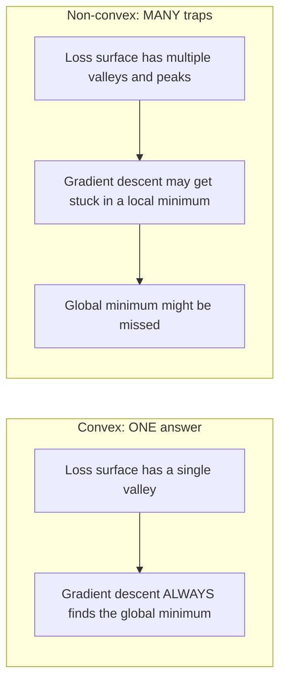
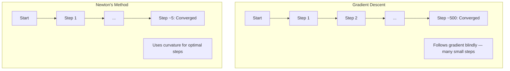
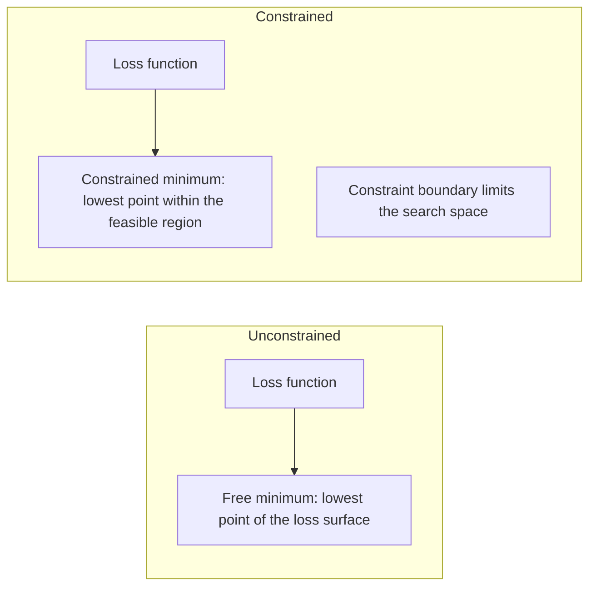
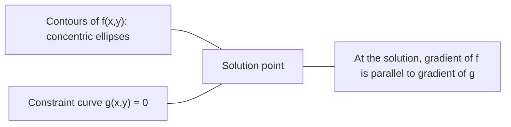

# 凸显优化

> 曲的问题有一个谷,神经网络有数百万.
> 凸问题只有一个谷底. 神经网络有数百万个.

**Type:** Build | **类型:** 动手
**Language:**子**语言:**字符串
**Prerequisites:** Phase 1, Lessons 04 (Calculus for ML), 08 (Optimization) | **前置知识:** Phase 1, 第 04 课（微积分）、第 08 课（优化）
**Time:** ~90 minutes | **时间:** ~90 分钟

## 学习目标

- 测试一个函数是否曲,使用定义,第二衍生和赫西标准
  使用定义、二阶导数和赫西安 判据测试函数是否为凸函数
- 运用牛顿的方法,并将其方形融合与梯度下降进行比较
  实现牛顿法 (牛顿方法) 并比较其二次收与梯度下降
- 使用拉格兰奇乘法解决限制优化问题,并解释KKT条件
  使用拉格朗日乘子(拉格朗倍数)求解约束优化问题,解释KKT 条件
- 解释为什么神经网络损失景观不凸,但SGD仍然找到好的解决方案
  解释为什么神经网络损失面对不突出,但SGD仍然能找到一个好的解决方案


> **【中文解读】**
> 凸函数只有一个山谷 (全局最优),线性归归是凸的所以一定有全局最优. 神经网络不凸的但无数山谷,SGD在实践中仍然能找到好的解.

## 问题 问题引入

课8教你梯度下降,动力和亚当.这些优化者在任何表面上都会下山. 但它们没有保证.在非形的景观上,梯度下降可能会降落在一个糟糕的地方最低值,卡在车点上,或者永远振荡.你无论如何都使用它,因为神经网络是非形的,没有替代方案.

> 第8课 教你梯度下降,动量和亚当――这些优化器可以在任何表面上下降――但它们没有保证――在非凸表面上,梯度下降可能陷入差异的局部最小值――卡在点 (卡在点) 或永远振荡――你还是使用它,因为神经网络是不凸的,没有替代方案――

但是机器学习中的许多问题都是曲的.线性回归,物流回归,SVM,LASSO,脊坡回归.对于这些问题来说,存在更强大的东西:优化与数学保障.曲的问题完全有一个谷.任何走下坡的算法都将达到全球最低水平.不需要重新启动.没有学习率的时间表.没有祈祷.

> 但是机器学习中的许多问题是凸的――线性归归、逻辑归归、SVM、LASSO、归归──对于这些,存在更强大的东西:带有数学保证的优化──凸的问题恰好只有一个谷底──任何下坡算法都会达到全局最小值──不需要重启──不需要学习率调度──不需要祈祷──

了解曲性有三个作用.首先,它告诉你当你的问题是容易 (曲) 时与硬 (非曲) 时.第二,它给你提供了比如牛顿曲问题的方法的更快工具.第三,它解释了整个 ML 中出现的概念:规律化作为一个限制,SVM 中的二元性,以及深度学习为什么尽管违反了曲性给你的每一个好特性,但它仍然有效.

> 了解凸性有三个作用.第一,它告诉你问题何时是容易的 (凸的) 或困难的 (非凸的) 第二,它为凸问题提供了更快的工具,如牛顿法.第三,它解释了通过 ML 的概念:正则化作为束的性,以及为什么深度学习仍然有效在违反凸性的优质性的情况下.

## 概念的核心概念

> **【中文解读】**
> 凸函数的形状像一个碗只有一个最低点(全局最优) ――线性回归、逻辑回归、SVM的损失函数都是凸的,所以训练一定收到全局最优的――神经网络不凸的,像连绵山脉,但SGD在实践中仍然能找到好解――理解凸优化就是理解"什么时候可以放心"――

> **【拓展：凸优化在工业中的实际规模】**
> 谷歌的广告排序系统使用大规模的逻辑回归 (凸优化),每天处理数十亿次请求.SVM 在人脸检测 (Viola-Jones) 和文本分类中得到广泛使用.现代LP 求解器 (Gurobi、CPLEX) 可以在几分钟内求解数百万变量的线性规划问题.凸优化是少数可以提供"最优解保证"的数学工具之一.

### 曲的集合

集合 S 是曲的,如果在 S 中的任何两个点,它们之间的线段也完全位于 S 中.

> 如果集合 S 中任意两点之间的线段完全位于 S 内,则 S 是凸集 (圆集合) .

| Convex sets | Not convex |
|---|---|
| **Rectangle**: any two points inside can be connected by a line segment that stays inside | **Star/crescent shape**: a line between two interior points can pass outside the set |
| **Triangle**: same property holds for all interior points | **Donut/annulus**: the hole means some line segments leave the set |
| The line segment between any two points stays within the set | The line segment between some pairs of points exits the set |

形式测试:对于任何S中的x,y点和任何[0,1]中的t点,点 tx + (1-t)y也在S中.

> 形式化测试:对于 S 中的任意点 x、y 和 [0, 1] 中的任意t,点 tx + (1-t) y 也在 S 中──

曲集合的例子:
- 一条线,一片平面,全部是R^n
  一条直线 一平面 一整条R^n
- 球 (圆,球,超球)
  一个球 (圆球面)
- 半空间: {x: a^T x <= b}
  半空间:{x:a^T x <= b}
- 任何数量的曲集合的交叉点
  任意数量凸集的交交集

无的集合的例子:
- 甜甜圈 (菜)
  环面圆
- 两个分离的圆的结合
  两个不相交的并集
- 任何装有""或"洞"的套件
  任何有"陷"或"洞"的集合

### 曲函数

如果其域是一个曲的集合,则函数 f 凸,并且对于其域内的任何两个点 x,y 和 [0, 1] 中的任何t:

> 如果函数 f 的定义域是凸集,并且对于定义域中的任意两点 x、y 和 [0, 1] 中任意的 t:

```
f(tx + (1-t)y) <= t*f(x) + (1-t)*f(y)
```

几何:图表上的任何两个点之间的线段位于图表上或图表上.

> 几何上:图上任意两个点之间的线段位于图上或图上.

| Property | Convex function | Non-convex function |
|---|---|---|
| **Line segment test** | The line between any two points on the graph lies **above or on** the curve | The line between some points on the graph dips **below** the curve |
| **Shape** | Single bowl/valley curving upward | Multiple peaks and valleys with mixed curvature |
| **Local minima** | Every local minimum is the global minimum | Multiple local minima may exist at different heights |

常见的曲函数:
-  () = x^2 (抛物线)
  抛物线
- 没有任何其他方法可以做到.
  绝对值
-  (x) = e^x (指数式)
  指数函数
-  () =最大 () () ()
  虽然分段线性)
- 对于 x > 0 (负号)
  负对数
- 任何线性函数 f ((x) = a^T x + b (形和形)
  任何线性函数 ((既是凸的也是的)

### 曲度测试

实践测试,从最简单到最严格.

> 三种实用测试,从最简单到最严格.

**Test 1: Second derivative test (1D).**如果 f'(x) >=0为所有 x,则 f是凸.

> **测试 1：二阶导数测试（一维）。**如果对所有x都有f'(x) >=0,则f是凸的.

- 形的形.
- 对于x < 0,不曲.
- 形的形.

**Test 2: Hessian test (multivariate).**如果Hessian矩阵H(x) 为所有x的正半定义,则f是凸.Hessian是第二部分衍生物的矩阵.

> **测试 2：Hessian 测试（多变量）。**如果Hessian 矩阵 H(x) 对所有 x 都是正确的,则 f 是凸的──Hessian 是二阶偏导数矩阵──

**Test 3: Definition test.**直接检查不等式 f(tx + (1-t) y) <= t*f(x) + (1-t) *f(y). 对于衍生值难以计算的函数来说有用.

> **测试 3：定义测试。**直接检查不等式 f(tx + (1-t) y) <= t*f(x) + (1-t) *f(y) 』适用于导数难以计算的函数──

### 为什么曲性很重要

曲优化的核心定理:

**For a convex function, every local minimum is a global minimum.**

> **对于凸函数，每个局部最小值都是全局最小值。**

任何下坡路都会导致相同的答案.算法保证将趋于最佳解决方案.

> 这意味着梯度下降不会被困住.任何下坡路径都朝着同一个答案.

> **【中文解读】**
> 这是凸优化的核心定理:凸函数的每个局部最小值都是全局最小值.这意味着梯度下降永远不会卡在"差"局部最优优点.



后果:
- 没有必要随机重新启动
  不需要随时重启
- 没有需要复杂的学习时间表
  不需要复杂的学习率调度
- 融合证明是可能的 (速度取决于函数属性)
  可以证明收性 (速度取决于函数性质)
- 解决方案是独一无二的 (高达平面区域)
  解是唯一的 (不包括平坦地区)

### 在 ML 中,形与非形

| Problem | Convex? | Why |
|---------|---------|-----|
| Linear regression (MSE) | Yes | Loss is quadratic in weights |
| Logistic regression | Yes | Log-loss is convex in weights |
| SVM (hinge loss) | Yes | Maximum of linear functions |
| LASSO (L1 regression) | Yes | Sum of convex functions is convex |
| Ridge regression (L2) | Yes | Quadratic + quadratic = convex |
| Neural network (any loss) | No | Nonlinear activations create non-convex landscape |
| k-means clustering | No | Discrete assignment step |
| Matrix factorization | No | Product of unknowns |

随着线性输出的线性模型是曲的.当你添加隐藏的层,不线性激活,曲的断裂.

> 具有凸损的线性模型是凸的. 一旦你添加了带非线性激活的隐藏层,凸性就被打破了.

### 赫西亚矩阵

函数f:R^n -> R的Hessian H是第二部分衍生物的n x n矩阵.

> 函数 f: R^n -> R 的赫西亚矩阵 H 是 n x n 的二阶偏导数矩阵。

```
H[i][j] = d^2 f / (dx_i dx_j)
```

对于 f ((x, y) = x^2 + 3xy + y^2:

```
df/dx = 2x + 3y       d^2f/dx^2 = 2      d^2f/dxdy = 3
df/dy = 3x + 2y       d^2f/dydx = 3      d^2f/dy^2 = 2

H = [ 2  3 ]
    [ 3  2 ]
```

赫西亚人告诉你关于曲线:
- 所有正值的自值值:函数在每个方向上方曲线 (在那个点上曲线)
  特征值全为正:函数在每个方向都向上曲 (该点处凸)
- 所有负值的自值:各方向向下曲线 (形,局部最大)
  特征值全为负:每个方向都向下曲(的,局部最大值)
- 混合标志:座点 (在某些方向上,在其他方向下)
  混合符号:点(某些方向上曲,其他方向向下)
- 零自值:在该方向平 (退化)
  零特征值:该方向平坦(退化)

为了曲性,赫西亚必须在任何地方都是正半确的 (所有本值 >= 0),而不仅仅是在一个点.

> 对于凸性,Hessian 必须在任何地方都是正确的,所有特征值 >= 0),而不仅仅在一个点上.

### 牛顿的方法

渐进式下降使用第一级信息 (梯度).牛顿的方法使用第二级信息 (赫西式).它适应当前点的方形近似,直接跳到那个方形的最小.

> 梯度下降使用一阶段信息(梯度) ――牛顿法使用二阶段信息(赫西安) ――它在当前点适合第二次近似,然后直接跳到该第二函数的最小值――

```
Update rule:
  x_new = x - H^(-1) * gradient

Compare to gradient descent:
  x_new = x - lr * gradient
```

牛顿的方法将规模学习速度取代为反向赫西式. 这自动调整了基于本地曲线的步骤大小和方向.

> 牛顿法用反赫西语 替代标标量学习率――这根据局部曲率自动调整步长和方向――

> **【拓展：牛顿法在现代 ML 中的实际使用】**
> 虽然牛顿法在深度学习中不实用,但在经典ML中仍然是主力. XGBoost 和 LightGBM 在每棵树的构建过程中,对损失函数做第二阶段的展开.



优势:
- 接近最小的四方相近 (每一步的错误方形)
  在最小值附近的第二收(每步差量平方级缩小)
- 没有调节的学习速度
  无需调节学习率
- 规模变异性 (不管你如何参数问题,都能工作)
  尺度不变 (不管如何参数化问题都能工作)

缺点:
- 计算Hessian成本 O ^2) 存储和 O ^3) 倒换
  计算 需要 O(n^2) 内存和 O(n^3) 求逆
- 对于一个数百万重量的神经网络,即10^12的输入和10^18的操作
  对于100万重神经网络,那就是10^12个元素和10^18次运算.
- 对于深度学习来说不实用
  不适用于深度学习

### 限制优化

无限制优化:将 f ((x) 最小化在所有x 上.
限制优化:尽量减少 f ((x) 受到限制.

> 无约束优化:在所有 x 上最小化 f(x) ・约束优化:在约束条件下最小化 f(x) ・・・

实际问题有限制.你想尽量降低成本,但预算有限.你想尽量减少错误,但模型的复杂性有限.

> 真正的问题有约束. 你想最小化成本,但预算有限.



### 缩乘法

拉格兰奇乘法将一个限制的问题转化为一个不受限制的问题.

> 拉格朗日乘子法将束问题转化为无束问题.

问题:将 f  x 减至 g  x = 0 值.

解决方案:引入一个新的变量 (拉格兰奇乘法 lambda) 并解决无限制的问题:

```
L(x, lambda) = f(x) + lambda * g(x)
```

在溶液中,L的梯度为零:

```
dL/dx = df/dx + lambda * dg/dx = 0
dL/dlambda = g(x) = 0
```

几何直觉:在限制最小时,f的梯度必须与限制g的梯度平行.如果它们不平行,你可以沿着限制表面移动,进一步减少f.

> 几何直觉:在束最小值处,f 的梯度必须与束 g 的梯度平行.如果不平行,你可以沿束曲面移动并进一步降低f.



举个例子:最小化f(x,y) =x^2 + y^2 归属于x + y = 1.

```
L = x^2 + y^2 + lambda(x + y - 1)

dL/dx = 2x + lambda = 0  =>  x = -lambda/2
dL/dy = 2y + lambda = 0  =>  y = -lambda/2
dL/dlambda = x + y - 1 = 0

From first two: x = y
Substituting: 2x = 1, so x = y = 0.5, lambda = -1
```

线 x + y = 1 的最接近原点是 (0.5,0.5).

> 直线 x + y = 1 上离原点最近的点是 (0.5,0.5) 

### 卡卡特条件

卡鲁什-库恩-图克条件将拉格兰奇乘法扩展到不平等的限制.

> 卡鲁什-库恩-图克尔条件) 将拉格朗日乘子推广到不等式约束――

问题:以 g_i(x) <= 0 为 i = 1, ..., m 减小 f  x.

 KKT条件 (为了最佳效果而必要):

```
1. Stationarity:    df/dx + sum(lambda_i * dg_i/dx) = 0
2. Primal feasibility:  g_i(x) <= 0  for all i
3. Dual feasibility:    lambda_i >= 0  for all i
4. Complementary slackness:  lambda_i * g_i(x) = 0  for all i
```

补充性宽松性是关键的见解:限制是活跃的 (g_i = 0,解决方案位于边界) 或乘法是零 (限制并不重要).一个不影响解决方案的限制是 lambda = 0.

> 互补松性 (互补松性) 是关键洞察:要么约束是活跃的 (g_i = 0,解在边界上),要么乘子为零 (约束不重要) ⋅不影响解的约束其 lambda = 0。

支持向量是限制活动的数据点 (lambda > 0).所有其他数据点都有 lambda = 0,不会影响决策边界.

> 条件是SVM的核心.支持向量. 支持向量. 支持向量.

> **【中文解读】**
> 互补性是最精妙的洞察:对于每个束,要么它是"活跃的" (刚好触碰边界),要么它对解法没有影响 (乘子为零).

### 规范化作为限制优化

它们不是任意的俩,而是隐藏的限制优化问题.

> 它们是伪装的约束优化问题.

**L2 regularization (Ridge):**

```
minimize  Loss(w)  subject to  ||w||^2 <= t

Equivalent unconstrained form:
minimize  Loss(w) + lambda * ||w||^2
```

限制的不变在不变^2 <= t定义一个球 (圆在2D,球3D).解决方案是输入轮首先触摸这个球.

> 约束时时时时时时时时时时时时时时时时时时时时时时时时时时时时时时时时时时时时时时时时时时时时时时时时时时时时时时时时时时时时时时时时时时时时时时时时时时时时时时时时时时时时时时时时时时时时时时时时时时时时时时时时时时时时时时时时时时时时时时时时时时时时时时时时时时时时时时时时时时时时时时时时时时时时时时时时时时时时时时时时时时时时时时时时时时时时时时时时时时时时时时时时时时时时时时时时时时时时时时时时时时时时时时时时时时时时时时时时时时时时时时时时时时时时时时时时时时时时时时时时时时时时时时时时时时时时时时时时时时时时时时时时时时时时时时时时时时时时时时时时时时时时时时时时时时时时时时时时时时时时时时时时时时时时时时时时时时时时时时时时时时时时时时时时时时时时时时时时时时时时时时时时时时时时时时时时时时时时时时时时时时时时时时时时时时时时时时时时时时时时时时时时时时时时时时时时时时时时时时时时时时时时时时时时时时时时时时时时时时时时时时时时时时时时时时时时时时时时时时时时时时时时时时时时时时时时时时时时时时时时时时时时时时时时时时时时时时时时时时时时时时时时时时时时时时时时时时时时时时时时时时时时时时时

**L1 regularization (LASSO):**

```
minimize  Loss(w)  subject to  ||w||_1 <= t

Equivalent unconstrained form:
minimize  Loss(w) + lambda * ||w||_1
```

限制的定义是钻石 (转形2D方形).

> 约束的东西在一个形状中是旋转的正方形.

| Property | L2 constraint (circle) | L1 constraint (diamond) |
|---|---|---|
| **Constraint shape** | Circle (sphere in higher dims) | Diamond (rotated square in 2D) |
| **Where loss contour touches** | Smooth boundary — any point on the circle | Corner — aligned with an axis |
| **Solution behavior** | Weights are small but nonzero | Some weights are exactly zero (sparse) |
| **Result** | Weight shrinkage | Feature selection |

这解释了L1为什么生产稀疏的模型 (特征选择),而L2只缩小重量.钻石的角落与轴相一致.损失轮更有可能触及角落,设置一个或多个重量完全为零.

> 这解释了为什么L1 产生稀疏模型 (特征选择) 而L2 仅缩小权重――形角与坐标轴对齐――等高线更容易碰到角,将一个或多个权重精确设为零――

> **【拓展：L1 正则化与 L2 正则化的几何直觉】**
> L1 束的形状是形的. L2 束的形状是圆形的. 形的角恰好落在坐标轴上,所以等高线更容易碰到角. 这意味着某些权重被精确设置为零 (特征选择). 这就是LASSO能够自动做特征选择的几何原因. 在基因表达数据分析中,LASSO常常从数万基因中选出几十个关键基因.

### 两性

每个限制优化问题 (原始) 都有一个伴侣问题 (二元).对于曲的问题,原始和二元具有相同的最佳值.这是强大的二元性.

> 每个约束优化问题 (原始问题) 都有一个伴随的问题 (对偶问题) 对于凸问题,原始问题和对偶问题都有相同的优势.

拉格兰基双重函数:

```
Primal: minimize f(x) subject to g(x) <= 0
Lagrangian: L(x, lambda) = f(x) + lambda * g(x)
Dual function: d(lambda) = min_x L(x, lambda)
Dual problem: maximize d(lambda) subject to lambda >= 0
```

为什么二元性很重要:
- 双重问题有时比原始问题更容易解决
  偶尔的问题有时比原始问题更容易解决
- 解决SVM的形式是双重的,问题取决于数据点之间的点产品 (实现内核技巧)
  问题只依赖于数据点之间的点积,从而可以使用核技巧)
- 双为原始最佳的下限提供,用于检查溶液质量
  对于偶为原始最优值提供下界,用于检查解质量

对于SVM,具体:

```
Primal: find w, b that maximize the margin 2/||w|| subject to
        y_i(w^T x_i + b) >= 1 for all i

Dual:   maximize sum(alpha_i) - 0.5 * sum_ij(alpha_i * alpha_j * y_i * y_j * x_i^T x_j)
        subject to alpha_i >= 0 and sum(alpha_i * y_i) = 0

The dual only involves dot products x_i^T x_j.
Replace x_i^T x_j with K(x_i, x_j) to get the kernel trick.
```

### 尽管没有曲性,但深度学习为什么有效

由于神经网络损失功能非常不曲.根据每种经典措施,优化它们都应该失败.然而,静态梯度下降可靠地找到好解决方案.

> 根据经典理论,优化它们应该失败.

**Most local minima are good enough.**在高维度空间中,随机关键点 (梯度为零) 绝大多数是车点,而不是本地最小值.存在的少数本地最小值往往接近全球最小值.当参数空间有数百万维度时,陷入一个可怕的本地最小值极不可能.

> **大多数局部最小值都足够好。**在高维空间中,随机临界点 (梯度为零的点) 绝大多数是点,而不是局部最小值.少数存在的局部最小值的损失价值往往接近整个局部最小值.

**Saddle points, not local minima, are the real obstacle.**在一个具有 n 参数的函数中,点具有正面和负面曲线方向的混合.对于高维度的随机关键点,所有 n 个体值的正面 (本地最小) 概率大约为 2 ^ - n.几乎所有关键点都是点.SGD 的噪音有助于逃脱它们.

> **鞍点而非局部最小值才是真正的障碍。**在有n个参数函数中,点具有正负曲率方向的混合.对于高维中的随机临界点,所有n个特征值都为正的 (局部最小值) 的概率约为2^(-n) ⋅几乎所有临界点都是点.SGD的噪声帮助逃离它们.

**Overparameterization smooths the landscape.**网络比训练示例更多的参数,更平滑,更连接的损失表面.更广泛的网络具有较少的恶性本地最小值.这与直觉相反,但经验一致.

> **过参数化（Overparameterization）使损失面更平滑。**参数多于训练样本的网络具有更平滑的损失面,更连接的损失面.

**Loss landscape structure:**

| Property | Low-dimensional space | High-dimensional space |
|---|---|---|
| **Landscape** | Many isolated peaks and valleys | Smoothly connected valleys |
| **Minima** | Many isolated local minima | Few bad local minima; most are near-optimal |
| **Navigation** | Hard to find global minimum | Many paths lead to good solutions |
| **Critical points** | Mix of local minima and saddle points | Overwhelmingly saddle points, not local minima |

**Stochastic noise acts as implicit regularization.**微批次 SGD 增加噪音,防止落入的最小.的最小超适应;平面最小一般化.噪音偏差优化损失景观的平面区域.

> **随机噪声充当隐式正则化。**微批量 SGD 增加噪音防止陷入尖的极小值──尖极小值过适应;平坦极小值泛化好──噪音使平坦区域优化偏向损失──

> **【中文解读】**
> 深度学习的成功看起来违反了凸优化理论:非凸函数应该很难优化,但SGD却很好工作.原因有三个:第一,高维空间中几乎所有临界点都是点而不是局部最小值;第二,过参数化让面部损失变得更平滑;第三,SGD的噪音充满隐形正规化,帮助逃离尖极小值,找到更平的泛化更好的解.

### 实际上使用的二级方法

对于大型模型来说,纯牛顿的方法是不实用的.

> 纯牛顿法对大模型不实用.

**L-BFGS (Limited-memory BFGS):**通过使用最后的 m 梯度差异,接近逆赫西安.需要O(mn) 记忆而不是O(n^2).对高达 ~ 10,000 个参数的问题很好.用于经典ML (物流回归,CRF) 但不是深度学习.

> **L-BFGS：**使用最近的 m 个梯度差近似对比赫西亚语.需要 O (mn) 内存而不是 O (n ^ 2) ⋅适用于最多约 10,000 个参数问题.用于经典的 ML 逻辑归归、CRF) 但不用于深度学习.

**Natural gradient:**根据Fisher的数据测量,Fisher的数据测量对数据测量进行了测量,并将数据测量进行测量.

> **自然梯度（Natural Gradient）：**使用Fisher 信息矩阵 (Hessian) 替代标准Hessian――这考虑了概率分布的几何结构――K-FAC将Fisher 矩阵近似为克龙克乘积,使其可行在神经网络中――

**Hessian-free optimization:**使用结合梯度来解决Hx = g,而没有形成H.只需要Hessian向量产品,通过自动分化可以在O ((n) 时间计算.

> **无 Hessian 优化：**使用共梯度求解 Hx = g 而无需形成 H――只需要Hessian向量乘积,可通过自动微分在 O  时间内计算――

**Diagonal approximations:**亚当的第二个时刻是赫西亚人的斜角近似.AdaHessian通过哈辛森估计器使用实际的赫西亚斜角元素扩展这一点.

> **对角近似：**亚当的二阶矩是赫西亚对角线的对角近似.

| Method | Memory | Per-step cost | When to use |
|--------|--------|--------------|-------------|
| Gradient descent | O(n) | O(n) | Baseline, large models |
| Newton's method | O(n^2) | O(n^3) | Small convex problems |
| L-BFGS | O(mn) | O(mn) | Medium convex problems |
| Adam | O(n) | O(n) | Deep learning default |
| K-FAC | O(n) | O(n) per layer | Research, large-batch training |

## 建立它,实现它.
```figure
convex-vs-nonconvex
```

## 建立它

### 步骤1:曲度检查器

通过采样点和检查定义来实验测试曲率的函数.

> 构建一个函数,通过采样点并检查定义来经验性地测试凸性.

```python
import random
import math

def check_convexity(f, dim, bounds=(-5, 5), samples=1000):
    violations = 0
    for _ in range(samples):
        x = [random.uniform(*bounds) for _ in range(dim)]  # 随机采样点 x
        y = [random.uniform(*bounds) for _ in range(dim)]  # 随机采样点 y
        t = random.uniform(0, 1)                            # 随机混合系数
        mid = [t * xi + (1 - t) * yi for xi, yi in zip(x, y)]  # 凸组合 tx + (1-t)y
        lhs = f(mid)                                        # f(凸组合)
        rhs = t * f(x) + (1 - t) * f(y)                    # tf(x) + (1-t)f(y)
        if lhs > rhs + 1e-10:                               # 违反凸性不等式
            violations += 1
    return violations == 0, violations
```

### 步骤2:牛顿的2D方法

通过明确的赫西式运用牛顿的方法进行比较.

> 使用显式赫西式实现牛顿法──比较与梯度下降的收速度──

```python
def newtons_method(f, grad_f, hessian_f, x0, steps=50, tol=1e-12):
    x = list(x0)
    history = [x[:]]
    for _ in range(steps):
        g = grad_f(x)
        H = hessian_f(x)
        det = H[0][0] * H[1][1] - H[0][1] * H[1][0]
        if abs(det) < 1e-15:
            break
        H_inv = [
            [H[1][1] / det, -H[0][1] / det],
            [-H[1][0] / det, H[0][0] / det],
        ]
        dx = [
            H_inv[0][0] * g[0] + H_inv[0][1] * g[1],
            H_inv[1][0] * g[0] + H_inv[1][1] * g[1],
        ]
        x = [x[0] - dx[0], x[1] - dx[1]]
        history.append(x[:])
        if sum(gi ** 2 for gi in g) < tol:
            break
    return history
```

### 步骤3:拉格兰奇乘法解决器

通过拉格兰基基梯度下降来解决限制优化.

> 使用拉格朗日函数上的梯度下降求解约束优化.

```python
def lagrange_solve(f_grad, g_val, g_grad, x0, lr=0.01,
                   lr_lambda=0.01, steps=5000):
    x = list(x0)
    lam = 0.0
    history = []
    for _ in range(steps):
        fg = f_grad(x)
        gv = g_val(x)
        gg = g_grad(x)
        x = [
            xi - lr * (fgi + lam * ggi)
            for xi, fgi, ggi in zip(x, fg, gg)
        ]
        lam = lam + lr_lambda * gv
        history.append((x[:], lam, gv))
    return history
```

### 步骤4:比较第一级与第二级

运行梯度下降和牛顿的方法,用相同的平方函数计算到接近的步骤.

```python
def quadratic(x):
    return 5 * x[0] ** 2 + x[1] ** 2

def quadratic_grad(x):
    return [10 * x[0], 2 * x[1]]

def quadratic_hessian(x):
    return [[10, 0], [0, 2]]
```

牛顿的方法将在1步 (这对方位数来说是确切的)  konverge.渐进下降将需要数百步,因为赫西亚的本值差异于5倍,从而产生长长的谷.

> 牛顿法将在1步内收收 (对二次函数是精确的) .梯度下降需要数百步,因为赫西亚的特征值相差5倍,形成了细长的山谷.

## 用它实现框架

在选择ML模型和解决器时,曲性分析直接适用于.

> 凸性分析在选择ML模型和求解器时直接适用.

对于曲的问题 (物流回归,SVM,LASSO):
- 使用专用解决器 (liblinear, CVXPY, scipy.optimize.minimize with method='L-BFGS-B')
  使用专用求解器
- 期待一个独特的全球解决方案
  期望唯一的全局解
- 第二阶段的方法是实用的和快速的
  二阶段方法实用且快速

对于非形问题 (神经网络):
- 使用第一级方法 (SGD,Adam)
  使用一阶方法
- 接受解决方案取决于初始化和随机性
  接受解依赖于初始化和随机性
- 使用过度参数化,噪音和学习率时间表作为隐含的规范化
  使用过参数化,噪音和学习率调度作为隐式正规化
- 没有必要浪费时间寻找全球最低限度.
  不要浪费时间寻找全局最小值.

```python
from scipy.optimize import minimize

result = minimize(
    fun=lambda w: sum((y - X @ w) ** 2) + 0.1 * sum(w ** 2),
    x0=np.zeros(d),
    method='L-BFGS-B',
    jac=lambda w: -2 * X.T @ (y - X @ w) + 0.2 * w,
)
```

对于SVM,双重配方允许使用内核技巧:

> 对于SVM,对偶尔形式让你使用核技巧 (Kernel Trick):

```python
from sklearn.svm import SVC

svm = SVC(kernel='rbf', C=1.0)
svm.fit(X_train, y_train)
print(f"Support vectors: {svm.n_support_}")
```

## 练习题

1. **Convexity gallery.**使用检查器测试这些曲性函数: f(x) = x^4, f(x) = sin(x), f(x,y) = x^2 + y^2, f(x,y) = x*y, f(x) = max(x, 0).解释为什么每个结果都有意义.

2. **Newton vs gradient descent race.**运行两个方法从起点 (10,10) 运行 f ((x,y) = 50*x^2 + y^2 . 每个方法需要多少步骤才能达到损失 < 1e-10?当条件数 (最大至最小的赫西安自值的比例) 增加时,梯度下降发生什么?

3. **Lagrange multiplier geometry.**尽量减少f ((x,y) = (x-3)^2 + (y-3)^2以 x + 2y = 4为主. 通过检查f的梯度是否与溶液上的g的梯度平行,验证解决方案.

4. **Regularization constraint.**实现L1限制优化:最小化 (x-3)^2 + (y-2)^2 归属于 ┃x ┃ + ┃y ┃ <= 1. 显示解决方案有一个坐标等于零 (钻石限制的差).

5. **Hessian eigenvalue analysis.**计算Rosenbrock函数的Hessian在 (1,1) 和 (-1,1).计算两个点的自值.自值告诉你关于最小与远离的曲线?

## 关键词 快速查找表

| Term | What it means |
|------|---------------|
| Convex set | A set where the line segment between any two points in the set stays inside the set |
| Convex function | A function where the line between any two points on its graph lies above or on the graph. Equivalently, Hessian is positive semidefinite everywhere |
| Local minimum | A point lower than all nearby points. For convex functions, every local minimum is the global minimum |
| Global minimum | The lowest point of a function over its entire domain |
| Hessian matrix | The matrix of all second partial derivatives. Encodes curvature information |
| Positive semidefinite | A matrix whose eigenvalues are all non-negative. The multidimensional analogue of "second derivative >= 0" |
| Condition number | Ratio of largest to smallest eigenvalue of the Hessian. High condition number means elongated valleys and slow gradient descent |
| Newton's method | Second-order optimizer that uses the inverse Hessian to determine step direction and size. Quadratic convergence near the minimum |
| Lagrange multiplier | A variable introduced to convert a constrained optimization problem into an unconstrained one |
| KKT conditions | Necessary conditions for optimality with inequality constraints. Generalize Lagrange multipliers |
| Complementary slackness | At the solution, either a constraint is active or its multiplier is zero. Never both nonzero |
| Duality | Every constrained problem has a companion dual problem. For convex problems, both have the same optimal value |
| Strong duality | Primal and dual optimal values are equal. Holds for convex problems satisfying Slater's condition |
| L-BFGS | Approximate second-order method that stores the last m gradient differences instead of the full Hessian |
| Saddle point | A point where the gradient is zero but it is a minimum in some directions and a maximum in others |
| Overparameterization | Using more parameters than training examples. Smooths the loss landscape and reduces bad local minima |

## 继续阅读 继续阅读

- [Boyd & Vandenberghe: Convex Optimization](https://web.stanford.edu/~boyd/cvxbook/)-标准教科书,可在线免费使用
- [Bottou, Curtis, Nocedal: Optimization Methods for Large-Scale Machine Learning (2018)](https://arxiv.org/abs/1606.04838)- 桥梁曲优化理论和深度学习实践
- [Choromanska et al.: The Loss Surfaces of Multilayer Networks (2015)](https://arxiv.org/abs/1412.0233)- 为什么不凸的神经网络的景观并不像看起来那么糟糕
- [Nocedal & Wright: Numerical Optimization](https://link.springer.com/book/10.1007/978-0-387-40065-5)- 牛顿方法,L-BFGS的综合参考,以及限制优化
