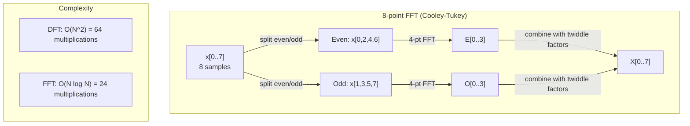
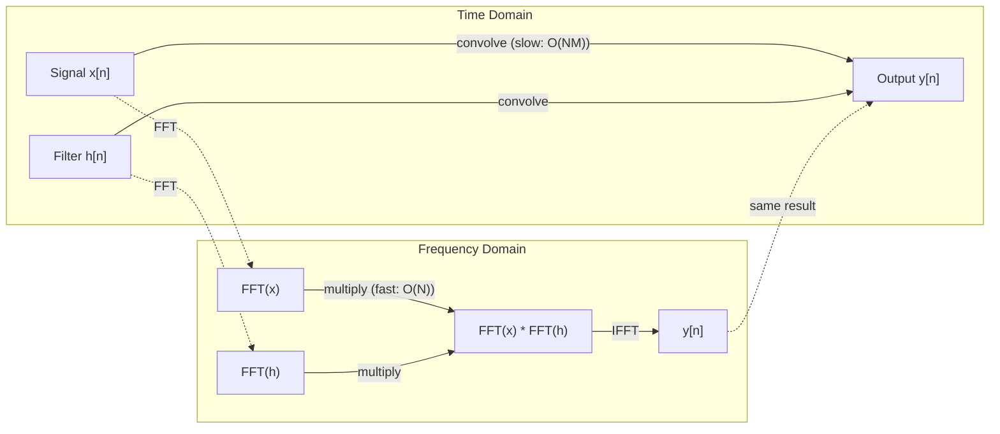

# 福利尔变形变化

> 每个信号都是阴影波的总和. 福利尔转换告诉你哪些.
> 每个信号都是正弦波的叠加.

**Type:** Build | **类型:** 动手
**Language:**子**语言:**字符串
**Prerequisites:** Phase 1, Lessons 01-04, 19 (complex numbers) | **前置知识:** Phase 1, 第 01-04 课、第 19 课（复数）
**Time:** ~90 minutes | **时间:** ~90 分钟

## 学习目标

- 实施DFT从零开始,并对O(N日志N) Cooley-Tukey FFT进行验证
  从零实现 DFT 并与 O N 记录 N 的Cooley-Tukey FFT 验证
- 解释频率系数:从信号中提取振幅,相和功率频谱
  解释频率系数:从信号中提取幅度、相位和功率谱 (Power Spectrum)
- 应用卷积定理来通过FFT乘法执行卷积
  应用卷积定理通过FFT 乘法执行卷积
- 连接Fourier频率分解到变体位置编码和CNN卷积层
  将里叶频率分解与变压器 位置编码和CNN卷积层联系


> **【中文解读】**
> 任何信号都可以分解为正弦波──音频处理、图像压缩都依赖于FFT──卷积定理说时域卷积等于频域乘法,可用FFT 加速CNN卷积──变压器正弦位置编码就是里叶基函数──

## 问题 问题引入

音频录音是时间间的压力测量序列.股价是数天的价值序列.图像是空间上的像素强度格.所有这些都是时间域 (或空间域) 的数据.你看到价值在某些索引中变化.

> 音频录制是随时间变化的压力测量序列――股票价格是随天数变化的价值序列――图像是空间上的像素强度的网格――这些都是时域 (或空域) 中的数据――你看到的是某个索引上变化的价值――

但在时间域中,许多模式是看不见的.这个音频信号是纯音调还是合声?这个股价是否有每周周期?这个图像是否有重复的纹理?这些问题是关于频率内容,时间域隐藏它.

> 但在时域中,许多模式是不可见的.这个音频信号是纯音还是弦?这个股价有周周期吗?这个图像有重复纹理吗?这些问题是关于频率内容,而时域将隐藏它.

福利尔变化将时间域的数据转换为频率域.它采用信号并分解成不同频率的阴影波.每个阴影波都有一个放大度 (它是多强) 和一个阶段 (它开始的地方).福利尔变化告诉你两者.

> 里叶变化将数据从时域转换到频域――它接收一个信号并将其分解为不同频率的正弦波――每个正弦波有幅度(有多强) 和相位(从哪里开始)―― 里叶变化告诉你两者――

这对 ML 很重要,因为频率领域思维在任何地方都出现. 曲神经网络执行曲,这是频率域中的乘法. 转former位置编码器使用频率分解来表示位置. 音频模型 (语音识别,音乐生成) 运行于光谱仪 - - 频率表示声音. 时间序列模型寻找周期性模式. 了解Fourier变化,就能使你能够使用这些词汇.

> 这对 ML 很重要,因为频域思维无处不在.卷积神经网络执行卷积,这在频域中就是乘法.

## 概念的核心概念

> **【中文解读】**
> 里叶变换的核心思想:任何信号都可以分解成不同频率的正弦波和――DFT 把时域信号变成频域系数每个系数告诉你"这个频率有多少能量"――这就像镜子把白光分解成彩虹:时域看到的是混合信号,频域看到的是各个成分――

> **【拓展：FFT 的计算影响力】**
> 据称是20世纪最重要的数值算法之一. 高斯在1805年就发现了分治策略,但库利-图基在1965年的论文才使得FFT广泛应用.如今,每次4G/LTE通话、每张JPEG照片、每张MP3歌曲都经历了FFT处理.在人工智能领域,对每秒音频计算的语音模型约为100次FFT,稳定传播图像处理管道也大量使用频域操作.

### 关于DFT的定义

鉴于N样本x[0],x[1], ...,x[N-1],分离福利尔变形产生N频率系数X[0],X[1], ...,X[N-1]:

> 给定 N 个样本 x[0],x[1], ...,x[N-1],离散里叶变换产生 N 个频率系数 X[0],X[1], ...,X[N-1]:

```
X[k] = sum_{n=0}^{N-1} x[n] * e^(-2*pi*i*k*n/N)

for k = 0, 1, ..., N-1
```

每个X[k]是一个复杂的数字.它的大小.X[k] 则告诉你频率的宽度 k.它的相角 ((X[k])告诉你频率的相对应.

> 每个X[k] 是复数.其模. X[k] 则告诉你频率 k 的幅度.其相位角.

关键的见解:`e^(-2*pi*i*k*n/N)`电源的频率是 k 的旋转相子. DFT 计算信号和 N 的每个相同间距频率之间的相关性.如果信号含有 k 的频率,相关性很大.如果没有,则接近零.

> 关键洞察:`e^(-2*pi*i*k*n/N)`是频率为 k 的旋转相量――DFT 计算信号与 N 个等间距频率中的每个信号的相关性――如果信号在频率 k 有能量,相关性就大――否则接近零――

### 每个系数意味着什么

**X[0]: the DC component.**这就是所有样本的总和,与平均比例.它代表信号的恒定 (零频率) 偏移.

> **X[0]：直流分量（DC Component）。**这是所有样本的总和与平均值正比.

```
X[0] = sum_{n=0}^{N-1} x[n] * e^0 = sum of all samples
```

**X[k] for 1 <= k <= N/2: positive frequencies.**对于每N样本的频率k周期,高 k意味着更高的频率 (更快的振荡).

> **X[k]（1 <= k <= N/2）：正频率。**代表每N 个样本中 k 个周期的频率──k 越大频率越高(振荡越快)──

**X[N/2]: the Nyquist frequency.**在N样本上,你得到的号是--高频率伪装为低频率.

> **X[N/2]：Nyquist 频率。**用N个样本能表示的最高频率──超过此频率会产生混

**X[k] for N/2 < k < N: negative frequencies.**对于实值信号,X[N-k] = conj(X[k]).负频率是正值信号的镜像图像.这就是为什么有用的信息在第一个N/2 + 1系数中.

> **X[k]（N/2 < k < N）：负频率。**对于实值信号,X[N-k] = conj(X[k])──负频率是正频率的镜像──这就是为什么有用信息在前N/2 + 1 系数中──

### 逆转DFT

逆DFT从其频率系数中重建原始信号:

```
x[n] = (1/N) * sum_{k=0}^{N-1} X[k] * e^(2*pi*i*k*n/N)

for n = 0, 1, ..., N-1
```

只有与前进DFT的不同:指数中的标志是正的 (不是负的),并且有一个1/N正常化因子.

> 与正向DFT的唯一区别是指数符号为正(非负),并且有一个1/N的归结因子.

反向DFT是完美的重建.没有信息丢失.你可以从时间域到频率域,然后再回来,没有任何错误.DFT是基因的改变 - 它在不同的坐标系统中重新表达相同的信息.

> 逆DFT是完美重建.没有信息丢失.你可以从时域到频域再回来,没有任何错误.

### 快速的转移

对于N = 1百万,这就是10^12操作.

> 对于N 个输出系数中的每一个,你对N 个输入样本求和和.对于N =100万,那就是10^12次运算.

快速富里尔转换 (FFT) 在 O N log N 中计算出相同的结果.对于 N = 1 万,这相当于大约 20,000 万次操作而不是 1 万亿次.这使得频率分析成为实用性的.

> 快速里叶变换(FFT) 以O(N 记 N) 计算相同的结果――对于N = 100,000,大约是2000万次运算而不是10亿次――这就是使频率分析变得可行的原因――

> **【中文解读】**
> 对于N=100万信号,DFT需要数亿次运算,FFT只需要约2000万次加速5万倍!秘是将信号按偶下标标分为两半,递归计算后再使用"旋转因子"合并并并并.

库利-图基算法 (最常见的FFT) 通过分割和征服工作:

> 库利-图基 算法 (最常用的FFT) 通过分治 (分分和征服) 工作:

1. 信号分为偶索引和偶索引样本.
   将信号分为偶数索引和奇数索引的样本.
2. 按每一半的DFT进行递归计算.
   归计算每一半的DFT.
3. 通过使用"双重因子"e^(-2*pi*i*k/N来结合两个半尺寸的DFT.
   使用"旋转因子" (二维因子) 合并两个半尺寸的DFT──

```
X[k] = E[k] + e^(-2*pi*i*k/N) * O[k]          for k = 0, ..., N/2 - 1
X[k + N/2] = E[k] - e^(-2*pi*i*k/N) * O[k]    for k = 0, ..., N/2 - 1

where E = DFT of even-indexed samples
      O = DFT of odd-indexed samples
```

交对称意味着每个复 recursion 级别都能 O(N) 工作,并且有 log2(N) 级别.

> 对称性意味着每层归归做 O  的工作,共享 log2  N 层――总计:O  N  log N)。



根据FFT的要求,信号长度为2.实践中,信号将为下一个2.

### 频谱分析

其他**power spectrum**它们是每次频率系数的平方大小,它显示每个频率的能量是多少.

其他**phase spectrum**对于大多数分析任务,你关心电源谱,而忽略相.

```
Power at frequency k:  P[k] = |X[k]|^2 = X[k].real^2 + X[k].imag^2
Phase at frequency k:  phi[k] = atan2(X[k].imag, X[k].real)
```

### 频率分辨率

频率分辨率的DFT取决于样本数 N和采样率 fs.

```
Frequency of bin k:      f_k = k * fs / N
Frequency resolution:    delta_f = fs / N
Maximum frequency:       f_max = fs / 2  (Nyquist)
```

为了解决两个相近的频率,你需要更多的样本.

### 卷积定理

这也是信号处理最重要的结果之一,

> 信号处理中最重要的结果之一,与CNN直接相关.

**Convolution in the time domain equals pointwise multiplication in the frequency domain.**

> **时域中的卷积等于频域中的逐点相乘。**

```
x * h = IFFT(FFT(x) . FFT(h))

where * is convolution and . is element-wise multiplication
```

为什么这很重要:

- 长度N和M的两个信号直接卷积需要O(N*M) 操作.
  两个长度为N和M的信号直接卷积需要O(N*M) 次运算。
- 基于FFT的卷积取O(N log N):转换两者,乘以,转换回.
  基于FFT的卷积需要O(N log N):变换两个信号、相乘、逆变换。
- 对于大型核子来说,FFT卷积速度更快.
  对于大卷积核,FFT 卷积快得多.
- 这正是发生在具有大接收场的卷积层中.
  这正是发生在一个有着很大的感觉的卷积层中的事情.

> **【拓展：卷积定理在 CNN 中的实际应用】**
> 标准的3x3卷积直接计算比FFT快,但当感受野变大时FFT 优势显现――ConvNeXt 和全球化 网络在7x7或更大的卷积中使用FFT 加速――FNet (Lee-Thorp等,2021年) 更大胆地使用FFT 替代变压器的自主注意力,在GLUE基准上达到 92% 的BERT 精度,但训练速度快7倍――频域复制的杂度是O(N) 而时域卷积是O(N^2)。

注:DFT计算圆形卷积 (信号卷积).对于线性卷积 (没有卷积),在计算之前,两个信号的长度为N + M - 1 零板.

> 注意:DFT 计算是循环卷积 (信号会环绕) ⋅对于线性卷积 (线性卷积) ⋅无环绕),在计算前将两个信号补零到长度 N + M - 1⋅



### 窗户

假设信号是周期性的,它将N样本视为无限重复信号的一个周期.如果信号不起始和结束在相同的值,这会在边界产生间断,这会显示为虚假的高频内容.这被称为光谱泄漏.

> 假设信号是周期的它将将N个样本视为无限重复信号的一个周期. 如果信号没有相同的值开始和结束,边界处会产生不连续性,表现为虚假的高频内容.

窗户在计算DFT之前将信号缩小到两个端的零,减少泄漏.

> 窗函数 (Windows) 通过在计算DFT之前将信号两端逐渐衰退到零以减少泄漏.

常见窗户:

| Window | Shape | Main lobe width | Side lobe level | Use case |
|--------|-------|----------------|-----------------|----------|
| Rectangular | Flat (no window) | Narrowest | Highest (-13 dB) | When signal is exactly periodic in N samples |
| Hann | Raised cosine | Moderate | Low (-31 dB) | General purpose spectral analysis |
| Hamming | Modified cosine | Moderate | Lower (-42 dB) | Audio processing, speech analysis |
| Blackman | Triple cosine | Wide | Very low (-58 dB) | When side lobe suppression is critical |

```
Hann window:    w[n] = 0.5 * (1 - cos(2*pi*n / (N-1)))
Hamming window: w[n] = 0.54 - 0.46 * cos(2*pi*n / (N-1))
```

通过将窗口乘以元素方式与DFT前的信号来应用: `X = DFT(x * w)`现在,我们要去.

### 光电源

| Property | Time Domain | Frequency Domain |
|----------|-------------|-----------------|
| Linearity | a*x + b*y | a*X + b*Y |
| Time shift | x[n - k] | X[f] * e^(-2*pi*i*f*k/N) |
| Frequency shift | x[n] * e^(2*pi*i*f0*n/N) | X[f - f0] |
| Convolution | x * h | X * H (pointwise) |
| Multiplication | x * h (pointwise) | X * H (circular convolution, scaled by 1/N) |
| Parseval's theorem | sum \|x[n]\|^2 | (1/N) * sum \|X[k]\|^2 |
| Conjugate symmetry (real input) | x[n] real | X[k] = conj(X[N-k]) |

帕尔塞瓦尔定理说,在两个领域的总能量都是相同的.

> 解析定理说明两个域中的总能量相同.

### 连接到位置编码

转变器使用了突状位置编码:

```
PE(pos, 2i)   = sin(pos / 10000^(2i/d_model))
PE(pos, 2i+1) = cos(pos / 10000^(2i/d_model))
```

每个维度对 (2i, 2i+1) 在不同的频率上振荡.频率在几何上间隔 (维度0.1) 到低 (最后的维度).这给每个位置一个独特的模式在所有频率带 - 类似于福利利系数如何独特识别信号.

> 每个维度对 (2i, 2i+1) 以不同的频率振荡――频率从高(维度0,1) 到低(最后维度) 呈几何间隔――这为每个位置提供跨所有频段的唯一模式类似于里叶系数唯一标识信号――

这项技术提供了以下主要特性:

- **Uniqueness:**没有两个位置具有相同的编码.
  **唯一性：**没有两个位置有相同的编码.
- **Bounded values:**总是在 [-1, 1] 中.
  **有界值：**总结在 [-1, 1] 中.
- **Relative position:**位置p+k的编码可以被表达为位置p的编码的线性函数.模型可以学习关注相对位置.
  **相对位置：**位置 p+k 的编码可以表示位置 p 编码的线性函数――模型可以学习关注相对位置――

### 与CNN的连接

卷积层将学习过器 (内核) 应用到输入中,通过通过信号或图像滑动.数学上,这是卷积操作.

> 卷积层通过在信号或图像上滑动学习的波器 (卷积核) 应用于输入.

根据卷积定理,这相当于:
1. 输入的 FFT
   输入
2. 核的FFT
   核核卷积
3. 在频率域中乘以
   在频域中相乘
4. 结果是
   结果

标准CNN实现使用直接卷积 (较快用于小型3x3核).但对于大型核或全球卷积,基于FFT的方法是显著更快的.一些架构 (如FNET) 完全取代FFT的注意力,以O(N log N) 而不是O(N^2的复杂性实现竞争精度.

> 标准CNN 实现直接卷积的使用.但对于大卷积核或全局卷积,基于FFT的方法显著更快.一些架构 (如FNET) 完全使用FFT的替代注意力,以O(N log N) 而不是O(N^2) 实现复杂性,达到竞争精度.

### 频谱和短时间福利尔转换

一个FFT给你提供整个信号的频率内容,但没有告诉你这些频率发生什么时候.一个声 (一个频率随着时间的推移增加的信号) 和一个弦 (所有频率同时存在) 都可以具有相同的 magnitudo 频谱.

> 单次FFT 给你整个信号的频率内容,但不告诉你这些频率在什么时候出现.

短时间福利尔转换 (STFT) 通过计算信号重叠窗户上的FFT来解决这一问题.结果是谱图:一个轴上时间和另一边频率的2D表示.每个点的强度显示了当时频率的能量.

> 短时里叶变换(STFT) 通过在信号的重叠窗口计算FFT来解决这个问题.结果是频谱图:一个以时间为一个轴,频率为另一个轴的2D表示.

```
STFT procedure:
1. Choose a window size (e.g., 1024 samples)
2. Choose a hop size (e.g., 256 samples -- 75% overlap)
3. For each window position:
   a. Extract the windowed segment
   b. Apply a Hann/Hamming window
   c. Compute FFT
   d. Store the magnitude spectrum as one column of the spectrogram
```

频谱是音频 ML 模型的标准输入表示.语音识别模型 (Whisper,DeepSpeech) 运行在mel 频谱上 - 频谱与MEL 尺度映射,更好地匹配人类音响感知.

> 频谱图是音频ML模型的标准输入表示──语音识别模型──语,深度语言 (Whisper、DeepSpeech) 在梅尔频谱图 (Mel-Spectrogram) 上操作频率映射到梅尔刻度的频谱图,更好地匹配人类音高感知──

> **【中文解读】**
> 单次FFT只能看到整个信号的频率成分,但不知道每个频率在"什么时候"出现.

### 标签名

如果信号含有频率超过fs/2 (尼奎斯特频率),则采样频率fs将产生代号副本.在100Hz时采样90Hz信号看起来与10Hz信号相同.单独无法区分它们.

> 如果信号含有高于fs/2的频率,则以速度fs采样会产生混杂副本――90 Hz 信号以100 Hz 采样看起来与10 Hz 信号相同――仅仅从样本无法区分它们――

```
Example:
  True signal: 90 Hz sine wave
  Sampling rate: 100 Hz
  Apparent frequency: 100 - 90 = 10 Hz

  The samples from the 90 Hz signal at 100 Hz sampling rate
  are identical to the samples from a 10 Hz signal.
  No amount of math can recover the original 90 Hz.
```

这就是为什么模拟到数字转换器包括反化过器,在采样之前将Nyquist以上频率删除.在ML中,化出现在没有适当的低通路过的情况下下样特征地图时.一些架构通过反化聚合层来解决这一问题.

> 这就是为什么模数转换器包含抗混波器,在采样前移除尼奎斯特以上的频率. 在ML中,当没有适当的低通波就下采样特征时,会出现一些结构通过抗混池化层来解决这个问题.

### 零不增加分辨率

常见的误解:在FFT之前零接信号提高频率分辨率.它不.零接在现有频率桶之间插入,给你一个更光滑的光谱.但它不能揭示频率细节,原始样本中没有.

> 常见误解:在FFT之前补零可以提高频率分辨率――实际上不能――补零在现有频率bin之间插入值,给你更平滑的频谱外观――但它不能揭示原始样本中不存在的频率细节――

实际频率分辨率仅取决于观察时间T = N / fs. 要解决由 delta_f 分离的两个频率,你需要至少T = 1 / delta_f秒的数据. 零的量不会改变这个基本极限.

> 真正的频率分辨率仅取决于观测时间T = N / fs――要分辨分隔的两个频率的特_f,至少需要T = 1 / delta_f 秒的数据――再多补零也无法改变这个基本限制――

> **【拓展：频谱图在语音 AI 中的标准地位】**
> 微声使用80个MEL波器组,55ms窗口,10ms步长――一段30秒的音频产生约3000 x80的频谱矩阵――谷歌的WaveNet、Meta的EnCodec也采用频谱图或频域表示中特征――

## 建立它,实现它.
```figure
fourier-synthesis
```

## 建立它

### 步骤1:从零开始的DFT

根据定义,O ((N^2) DFT直接遵循.

```python
import math

class Complex:
    ...

def dft(x):
    N = len(x)
    result = []
    for k in range(N):
        total = Complex(0, 0)
        for n in range(N):
            angle = -2 * math.pi * k * n / N
            w = Complex(math.cos(angle), math.sin(angle))
            xn = x[n] if isinstance(x[n], Complex) else Complex(x[n])
            total = total + xn * w
        result.append(total)
    return result
```

### 步骤 2:反向DFT

结构相同,正指数,乘以N.

```python
def idft(X):
    N = len(X)
    result = []
    for n in range(N):
        total = Complex(0, 0)
        for k in range(N):
            angle = 2 * math.pi * k * n / N
            w = Complex(math.cos(angle), math.sin(angle))
            total = total + X[k] * w
        result.append(Complex(total.real / N, total.imag / N))
    return result
```

### 步骤3:FFT (Cooley-Tukey)

复制式FFT需要功率为2长度. 分成偶和奇,复制式,结合与扭曲因子.

```python
def fft(x):
    N = len(x)
    if N <= 1:                                      # 基础情况：长度 1 的 DFT 就是自身
        return [x[0] if isinstance(x[0], Complex) else Complex(x[0])]
    if N % 2 != 0:                                  # 非偶数长度，回退到普通 DFT
        return dft(x)

    even = fft([x[i] for i in range(0, N, 2)])     # 递归：偶数下标子序列
    odd = fft([x[i] for i in range(1, N, 2)])      # 递归：奇数下标子序列

    result = [Complex(0)] * N
    for k in range(N // 2):
        angle = -2 * math.pi * k / N                # 旋转因子角度
        twiddle = Complex(math.cos(angle), math.sin(angle))  # 旋转因子 e^(-2piik/N)
        t = twiddle * odd[k]                        # 蝶形运算：旋转后的奇数部分
        result[k] = even[k] + t                    # 前半：E[k] + twiddle * O[k]
        result[k + N // 2] = even[k] - t           # 后半：E[k] - twiddle * O[k]
    return result
```

### 步骤4:光谱分析辅助员

```python
def power_spectrum(X):
    return [xk.real ** 2 + xk.imag ** 2 for xk in X]

def convolve_fft(x, h):
    N = len(x) + len(h) - 1                         # 线性卷积的输出长度
    padded_N = 1
    while padded_N < N:
        padded_N *= 2                                # 补零到 2 的幂次

    x_padded = x + [0.0] * (padded_N - len(x))      # 补零避免循环卷积混叠
    h_padded = h + [0.0] * (padded_N - len(h))

    X = fft(x_padded)                               # 信号 FFT
    H = fft(h_padded)                               # 滤波器 FFT

    Y = [xk * hk for xk, hk in zip(X, H)]          # 频域逐点相乘（卷积定理）

    y = idft(Y)                                     # 逆 FFT 回到时域
    return [y[n].real for n in range(N)]
```

## 用它实现框架

对于真正的工作,使用numpy的FFT,它由高度优化的C库支持.

```python
import numpy as np

signal = np.sin(2 * np.pi * 5 * np.arange(256) / 256)
spectrum = np.fft.fft(signal)
freqs = np.fft.fftfreq(256, d=1/256)

power = np.abs(spectrum) ** 2

positive_freqs = freqs[:len(freqs)//2]
positive_power = power[:len(power)//2]
```

用于窗户和更先进的光谱分析:

```python
from scipy.signal import windows, stft

window = windows.hann(256)
windowed = signal * window
spectrum = np.fft.fft(windowed)
```

对于卷积:

```python
from scipy.signal import fftconvolve

result = fftconvolve(signal, kernel, mode='full')
```

对于光谱:

```python
from scipy.signal import stft

frequencies, times, Zxx = stft(signal, fs=sample_rate, nperseg=256)
spectrogram = np.abs(Zxx) ** 2
```

频谱矩阵有形状 (n_frequencies,n_time_frames).每个列是一个时间窗口的功率谱.这是音频ML模型作为输入所消耗的.

> 频谱图矩阵形状是 (n_频率,n_time_frames) ⋅每列是一个时间窗口的功率谱──这就是音频ML模型的输入──

## 运送它.

跑步`code/fourier.py`产生`outputs/prompt-spectral-analyzer.md`现在,我们要去.

> 运行`code/fourier.py`生成 `outputs/prompt-spectral-analyzer.md`现在,我们在车上.

## 练习题

1. **Pure tone identification.**创建一个单个弦波的信号,在未知频率 (1至50Hz之间),在128Hz中进行样本测试1秒.使用DFT来确定频率.验证答案匹配.现在加加斯人的噪音,标准偏差为0.5,然后重复.噪音如何影响频谱?

2. **FFT vs DFT verification.**生成长度64的随机信号.计算DFT (O(N^2) 和FFT. 检查所有系数是否符合1e-10内.时间在长度256,512,1024和2048的信号上都运行.

3. **Convolution theorem proof by example.**创建信号 x = [1, 2, 3, 4, 0, 0, 0, 0] 和过 h = [1, 1, 1, 0, 0, 0, 0, 0].直接计算它们的圆形卷积 (嵌套循环).然后通过FFT (转换,乘,逆转换) 来计算它.验证结果匹配.现在通过零合适当地进行线性卷积.

4. **Windowing effects.**创建一个信号,是两个海脉波的总和10 Hz和12 Hz (非常接近).在128 Hz上进行样本1秒.计算没有窗户的功率频谱,汉窗和汉明窗.哪个窗户使得区分两个峰值最容易?为什么?

5. **Positional encoding analysis.**生成d_model = 128 和max_pos = 512 的阴影形位置编码.对于每个位置对 (p1,p2),计算它们的编码的点数. 显示点数仅取决于p1 - p2 而不是绝对位置.随着距离增加,点数的结果是什么?

## 关键词 快速查找表

| Term | What it means |
|------|---------------|
| DFT (Discrete Fourier Transform) | Converts N time-domain samples into N frequency-domain coefficients. Each coefficient is the correlation with a complex sinusoid at that frequency |
| FFT (Fast Fourier Transform) | An O(N log N) algorithm to compute the DFT. The Cooley-Tukey algorithm splits even/odd indices recursively |
| Inverse DFT | Reconstructs the time-domain signal from frequency coefficients. Same formula as DFT with flipped exponent sign and 1/N scaling |
| Frequency bin | Each index k in the DFT output represents frequency k*fs/N Hz. The "bin" is the discrete frequency slot |
| DC component | X[0], the zero-frequency coefficient. Proportional to the signal mean |
| Nyquist frequency | fs/2, the maximum frequency representable at sampling rate fs. Frequencies above this alias |
| Power spectrum | \|X[k]\|^2, the squared magnitude of each frequency coefficient. Shows energy distribution across frequencies |
| Phase spectrum | angle(X[k]), the phase offset of each frequency component. Often ignored in analysis |
| Spectral leakage | Spurious frequency content caused by treating a non-periodic signal as periodic. Reduced by windowing |
| Window function | A tapering function (Hann, Hamming, Blackman) applied before DFT to reduce spectral leakage |
| Twiddle factor | The complex exponential e^(-2*pi*i*k/N) used to combine sub-DFTs in the FFT butterfly computation |
| Convolution theorem | Convolution in time domain equals pointwise multiplication in frequency domain. Fundamental to signal processing and CNNs |
| Circular convolution | Convolution where the signal wraps around. This is what the DFT naturally computes |
| Linear convolution | Standard convolution without wraparound. Achieved by zero-padding before DFT |
| Parseval's theorem | Total energy is preserved through the Fourier transform. sum \|x[n]\|^2 = (1/N) sum \|X[k]\|^2 |
| Aliasing | When frequencies above Nyquist appear as lower frequencies due to insufficient sampling rate |

> 术语速查:DFT(离散里叶变换) 、FFT(快速里叶变换 O(N 记 N))、反 DFT(逆 DFT)、频率bin (频率槽) 、DC组件(直流分量 X[0])、Nyquist频率(奈奎斯特频率 fs/2)、电力谱(功率谱X[k]2)、相位谱) √ 阶段谱)、光谱泄漏(频谱泄漏)、窗户函数 (窗户) √ √ √ √ √ √ √ √ √ √ √ √ √ √ √ √ √ √ √ √ √ √ √ √ √ √ √ √ √ √ √ √ √ √ √ √ √ √ √ √ √ √ √ √ √ √ √ √ √ √ √ √ √ √ √ √ √ √ √ √ √ √ √ √ √ √ √ √ √ √ √ √ √ √ √ √ √ √ √ √ √ √ √ √ √ √ √ √ √ √ √ √ √ √ √ √ √ √ √ √ √ √ √ √ √ √ √ √ √ √ √ √ √ √ √ √ √ √ √ √ √ √ √ √ √ √ √ √ √ √ √ √ √ √ √ √ √ √ √ √ √ √ √ √ √ √ √ √ √ √ √ √ √ √ √ √ √ √ √ √ √ √ √ √ √ √ √ √ √ √ √ √ √ √ √ √ √ √ √ √ √ √ √ √ √ √ √ √ √ √ √

## 继续阅读 继续阅读

- [Cooley & Tukey: An Algorithm for the Machine Calculation of Complex Fourier Series (1965)](https://www.ams.org/journals/mcom/1965-19-090/S0025-5718-1965-0178586-1/)- 改变计算机的原始FFT论文
- [3Blue1Brown: But what is the Fourier Transform?](https://www.youtube.com/watch?v=spUNpyF58BY)- 最好的视觉介绍Fourier变化
- [Lee-Thorp et al.: FNet: Mixing Tokens with Fourier Transforms (2021)](https://arxiv.org/abs/2105.03824)- 在变压器中,自觉取代了FFT
- [Smith: The Scientist and Engineer's Guide to Digital Signal Processing](http://www.dspguide.com/)- 免费的在线教科书,详细介绍了FT,窗口和光谱分析
- [Vaswani et al.: Attention Is All You Need (2017)](https://arxiv.org/abs/1706.03762)-从福利尔频率分解中获得的阴影形定位编码
- [Radford et al.: Whisper (2022)](https://arxiv.org/abs/2212.04356)- 用mel谱图作为输入表示的语音识别
