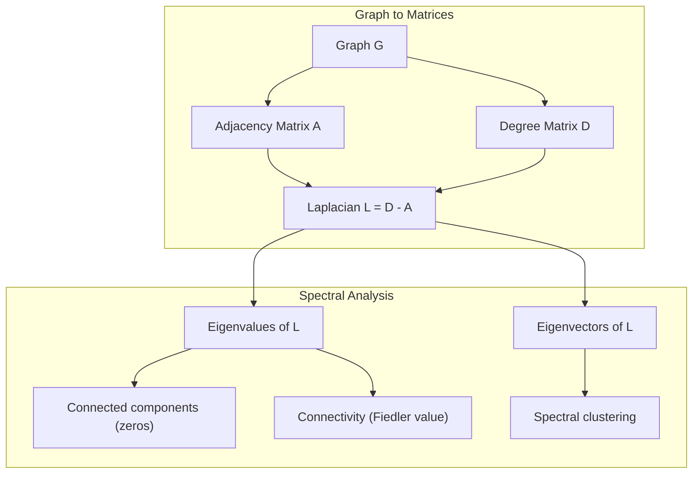
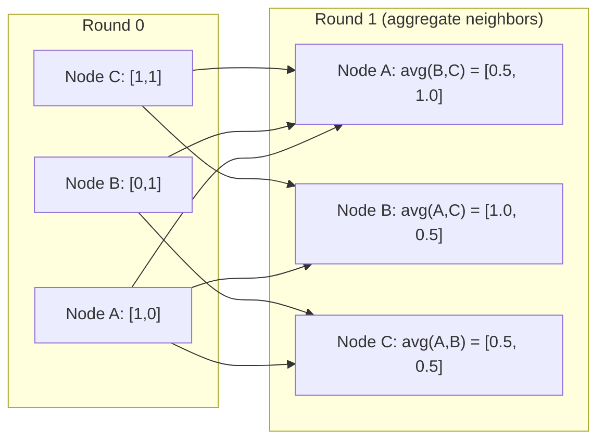

# 图论与机器学习

> 如果你的数据有联系,你需要图形理论.
> 图是关系的数据结构. 如果你的数据有连接,你需要图论.

**Type:** Build | **类型:** 动手
**Language:**子**语言:**字符串
**Prerequisites:** Phase 1, Lessons 01-03 (linear algebra, matrices) | **前置知识:** Phase 1, 第 01-03 课（线性代数、矩阵）
**Time:** ~90 minutes | **时间:** ~90 分钟

## 学习目标

- 建立一个附属矩阵/列表表示的图形类,并实现BFS和DFS穿越
  构建带有邻近矩阵/列表表示图类,实现BFS和DFS 遍历
- 计算拉普拉斯图,并使用其本值检测连接的组件和集群节点
  计算图拉普拉斯矩阵 (图拉普拉斯矩阵) 并使用其特征值检测连通分量和聚类节点
- 实现一个轮 GNN 式消息通过正常化的邻接矩阵乘法
  实现一轮 GNN 风格的消息传递 归纳于邻近矩阵乘法
- 应用光谱集群来使用Fiedler向量分区图
  应用谱聚类(光谱集群) 使用Fiedler 向量划分图


> **【中文解读】**
> 社交网络,分子结构,知识图谱都是图片. 基因的传输本质上是邻属矩阵乘法.

## 问题 问题引入

社交网络,分子,知识库,引用网络,路线图,都是图表.传统的ML将数据视为平面表.每个行都是独立的.每个特征都是列.

> 社交网络,分子,知识库,引文网络,道路图都是图图.

想想预测用户会购买什么产品.他们的购买历史是重要的. 但他们的朋友的购买历史更重要. 连接传递信号.

> 考虑社交网络――你想预测用户会买什么产品――他们的购买历史很重要――但他们朋友的购买历史更重要――连接带信号――

原子是重要的,但真正重要的是原子是如何相互结合的.结构是数据.

> 或者考虑分子――你想预测它是否与蛋白质结合――原子很重要,但真正重要的是原子之间的键合――结构就是数据――

图神经网络 (GNN) 是深度学习领域增长最快的领域.它们支持药物发现,社会推,欺诈检测和知识图论.每个GNN都建立在同一基础上:基本图理论.

> 图神经网络 (GNN) 是深度学习中增长最快的领域.它们驱动药物发现,社交推,欺诈检测和知识图谱推理.

你需要四件事:
1. 作为矩阵表示图表的方式 (这样你可以乘以它们)
   将图表示为矩阵的方法 (这样可以做矩阵乘法)
2. 跨度算法探索图形结构
   探索图结构的遍历算法
3. 拉普拉西亚 - - 在光谱图理论中最重要的单一矩阵
   拉普拉斯矩阵 谱图理论中最重要的矩阵
4. 传递消息 - - 使 GNN 运行的操作
   消息传递使 GNN 工作的操作

## 概念的核心概念

> **【中文解读】**
> 图是关系的数据结构――社会网络中人是节点、关注是边;分子中的原子是节点、化学键是边;知识图谱中实体是节点、关系是边――图神经网络的核心操作信息传递本质上是邻属矩阵乘法――谱聚类用图拉普拉斯矩阵的特征向量聚类――

> **【拓展：图神经网络在药物发现中的突破】**
> 深心的AlphaFold2 (2020) 用图神经网络预测蛋白质3D结构,解决困扰生物学界50年蛋白质折叠问题――它将氨基酸残基建模为图节,残基间的空间关系建模为边缘――在CASP14竞赛中,AlphaFold2中位GDT 分数达到92.4(满分100),远超第二名25分――Insilico医学使用 GNN设计新药分子,将药物发现周期从几年缩短到数月――

### 图:节点和边缘

一个图 G = (V,E) 由顶点 (节点) V 和边缘 E组成.每个边缘连接两个节点.

> 图 G = (V,E) 由顶点(节点) V 和边 E 组成──每条边连接两个节点──

**Directed vs undirected.**在未定向图中,边缘 (u,v) 表示u连接到v,而v连接到u. 在定向图 (图形),边缘 (u,v) 表示u指向v,但不一定是相反的.

> **有向与无向。**在无向图中,边 (u,v) 意思是 u 连接 v 且 v 连接 u──在有向图中,边 (u,v) 意思是 u 指向 v,但反向不一定成立──

**Weighted vs unweighted.**在一个不加权图中,边缘要么存在,要么没有.在一个加权图中,每个边缘都有数值的重量 - - 距离,成本,强度.

> **加权与无权。**在无权图中,边要么存在或不存在. 在加权图中,每个边都有数值权重.

| Graph type | Example |
|-----------|---------|
| Undirected, unweighted | Facebook friendship network |
| Directed, unweighted | Twitter follow network |
| Undirected, weighted | Road map (distances) |
| Directed, weighted | Web page links (PageRank scores) |

### 接近矩阵

邻近矩阵A是核心表示.为一个具有n节点的图表:

> 邻近矩阵 (邻矩阵) A 是核心表示──对有n 个节点的图:

```
A[i][j] = 1    if there is an edge from node i to node j
A[i][j] = 0    otherwise
```

对于未定向图表,A是对称:A[i][j] =A[j][i].对于权重图表,A[i][j] =边缘重量 (i,j).

> 对于无向图,A 是对称的:A[i][j] =A[j][i]。对于加权图,A[i][j] = 边 (i,j) 的权重──

**Example -- a triangle:**

```
Nodes: 0, 1, 2
Edges: (0,1), (1,2), (0,2)

A = [[0, 1, 1],
     [1, 0, 1],
     [1, 1, 0]]
```

邻近矩阵是每个 GNN 的输入. A 上的矩阵操作与图表上的操作相符.

> 邻近矩阵是每个 GNN 的输入. 对 A 的矩阵运算对应于图上的操作.

> **【中文解读】**
> 邻近矩阵是图的"数字化表示"──A[i][j]=1 表示节点 i 和 j 之间有边缘──矩阵乘法的奇之处:A^2 的元素A^2[i][j]恰好等于从 i 到 j 长度为 2 的路径数──GNN的消息传递本质上就是A 乘以特征矩阵每个节点聚合邻居的信息──

### 学位

节点的度是与节点连接的边缘数量.对于指向图表,你有进度 (进度边缘) 和出度 (出边缘).

> 节点的度 (度) 是连接到它的边数.对于有向图,有入度.

度矩阵D是对角形:

> 度矩阵: 度矩阵:

```
D[i][i] = degree of node i
D[i][j] = 0    for i != j
```

对于三角形的例子:D=diag(2,2,2) 因为每个节点连接到另外两个节点.

度告诉你关于节点的重要性.高度 = 枢纽节点.网络的度分布揭示了其结构.社交网络遵循电力规律 (少数枢纽,许多叶子节点).随机图表具有波森分布式的度数.

> 库告诉你节点的重要性――高度 = 枢纽节点――网络的度分布揭示其结构――社交网络遵循律――少数枢纽,大量叶节点――随机图的度从泊松分布――

### 和

需要两个基本的图形穿越算法.

> 两种基本图遍历算法.

**Breadth-First Search (BFS):**首先探索所有邻居,然后使用邻居的邻居.

> **广度优先搜索（BFS）：**首先探索所有邻居,然后是邻居的邻居.

```
BFS from node 0:
  Visit 0
  Queue: [1, 2]        (neighbors of 0)
  Visit 1
  Queue: [2, 3]        (add neighbors of 1)
  Visit 2
  Queue: [3]           (neighbors of 2 already visited)
  Visit 3
  Queue: []            (done)
```

基于BFS的数据,BFS在未加权图中找到最短的路径.从开始到任何节点的距离等于该节点首次发现的BFS水平.

> 在无权图中,BFS找到最短的路径.从起点到任何节点的距离等于该节点首次发现时的BFS层级.

**Depth-First Search (DFS):**在回溯之前尽可能深入. 使用子 (LIFO) 或复发.

> **深度优先搜索（DFS）：**尽可能深入回溯.

```
DFS from node 0:
  Visit 0
  Stack: [1, 2]        (neighbors of 0)
  Visit 2               (pop from stack)
  Stack: [1, 3]         (add neighbors of 2)
  Visit 3               (pop from stack)
  Stack: [1]
  Visit 1               (pop from stack)
  Stack: []             (done)
```

对于:
- 找到连接组件 (从未访问的节点运行DFS)
  寻找连通分量(从未访问节点运行 DFS)
- 循环检测 (DFS树的后边)
  环检测(DFS 树中的后向边)
- 拓分类 (反向DFS完成顺序)
  拓排序(DFS 完成顺序的逆序)

| Algorithm | Data structure | Finds | Use case |
|-----------|---------------|-------|----------|
| BFS | Queue | Shortest paths | Social network distance, knowledge graph traversal |
| DFS | Stack | Components, cycles | Connectivity, topological sort |

### 拉普拉西亚图

频谱图理论中最重要的矩阵.

> L = D - A──谱图理论中最重要的矩阵──

对于三角形:

```
D = [[2, 0, 0],    A = [[0, 1, 1],    L = [[2, -1, -1],
     [0, 2, 0],         [1, 0, 1],         [-1, 2, -1],
     [0, 0, 2]]         [1, 1, 0]]         [-1, -1,  2]]
```

拉普拉西亚人具有着显著的特征:

> 拉普拉斯矩阵具有非凡的性质:

1. **L is positive semi-definite.**所有的本值都是 >= 0.

> 1. **L 是半正定的。**所有特征值 >= 0──

2. **The number of zero eigenvalues equals the number of connected components.**连接的图表具有一个零的本值.一个连接不连接的3个组件的图表具有三个零的本值.

> 2. **零特征值的个数等于连通分量的个数。**连通图恰好有一个零特征值. 有3个不连通分量的图有三个零特征值.

3. **The smallest non-zero eigenvalue (Fiedler value) measures connectivity.**较大的Fiedler值意味着图表是有联系的.较小的Fiedler值意味着图表有一个弱点 - - 瓶.

> 3. **最小非零特征值（Fiedler 值）衡量连通性。**值大意味着图连接良好.

4. **The eigenvector of the Fiedler value (Fiedler vector) reveals the best split.**带有正值的节点进入一个组,带有负值的节点进入另一个组.

> 4. **Fiedler 值对应的特征向量（Fiedler 向量）揭示最佳划分。**正值的节点归归一组,负值归归另一组.

> **【中文解读】**
> 图拉普拉斯 L = D - A 是谱图理论中最重要的矩阵.它的四个关键性质: 1) 半正定; 2) 零特征值个数 = 连通分量个数; 3) 最小非零特征值; 3) 字符符号值) 衡量连通性越大越紧; 4) 字符号向量的正负号将自动分成两.



### 频谱特性

邻近矩阵和拉普拉西亚的本值显示了没有任何穿越的结构性质.

> 邻近矩阵和拉普拉斯矩阵的特征值不需要经历才能揭示结构性质.

**Spectral clustering**运行方式是这样的:
1. 计算拉普拉西亚 L
   计算拉普拉斯矩阵 L
2. 找出L的 k最小的自向量 (跳过第一个,这是连接图的全部)
   找到 L 的 k 个最小特征向量(跳过第一个,连通图中它是全 1向量)
3. 使用这些自向量作为每个节点的新坐标
   将这些特征作为每个节点的新标记
4. 在这些坐标上运行k-means
   在这些坐标上运行 k-means

为什么这么做?L的自向量编码图上的"最光滑"函数. 结合良好的节点得到类似的自向量值. 结合瓶分离的节点得到不同的值. 自向量自然分离集群.

> 为什么有效?L的特征向量编码图上的"最平滑"函数――连接良好节点获得相似的特征向量值――被瓶分离的节点获得不同的值――特征向量自然分离──

**Random walk connection.**正常化拉普拉西亚语与图上的随机行走有关.随机行走的静止分布与节点程度相比例.混合时间 (行走的接近速度) 取决于光谱差距.

> **随机游走联系。**随机游走的平稳分布与节点度成正比.

### 传递信息

每个节点都收集了邻居的信息,汇集它们,并更新了自己的状态.

> 图神经网络的核心操作. 每个节点从邻居收集信息,聚合它们,并更新自己的状态.

```
h_v^(k+1) = UPDATE(h_v^(k), AGGREGATE({h_u^(k) : u in neighbors(v)}))
```

在最简单的形式中,AGGREGATE =平均值,UPDATE =线性转换 +激活:

```
h_v^(k+1) = sigma(W * mean({h_u^(k) : u in neighbors(v)}))
```

如果H是所有节点特征的矩阵,A则是邻近矩阵:

```
H^(k+1) = sigma(A_norm * H^(k) * W)
```

在 A_norm 是正常化的邻近矩阵 (每个行总数为 1).

一轮传递消息使每个节点"看到"其近邻.两个轮让它看到邻居的邻居.K轮给每个节点从其K-hop邻居的信息.

> **【拓展：消息传递与 GNN 架构演进】**
> 基克诺 (Kipf & Welling, 2017) 是最简单的消息传递 GNN:每层一次归归结邻居矩阵乘法 + 线性变换――GAT (Veličković等人, 2018) 引入注意力机制让节点学习邻居的重要性权重――GraphSAGE (Hamilton等人, 2017) 支持采样邻居以处理大规模图片――Pinterest的PinSage模型在30亿节点图上运行,每天产生超过1000亿次推――GNN是增长最快的AI子领域之一――



### 概念和 ML 应用

| Concept | ML Application |
|---------|---------------|
| Adjacency matrix | GNN input representation |
| Graph Laplacian | Spectral clustering, community detection |
| BFS/DFS | Knowledge graph traversal, path finding |
| Degree distribution | Node importance, feature engineering |
| Message passing | GNN layers (GCN, GAT, GraphSAGE) |
| Eigenvalues of L | Community detection, graph partitioning |
| Spectral clustering | Unsupervised node grouping |
| PageRank | Node importance, web search |

> 概念与 ML 应用对照:邻接矩阵(GNN 输入表示) 图拉普拉斯(谱聚类、社区检测) 、BFS/DFS(知识图谱遍历、路径查找) 度分布(节点重要性、特征工程) 、消息传递(GNN 层 GCN/GAT/GraphSAGE) 、L 的特征值(社区检测聚图、划分) 、谱类(无监督节点分组) 、PageRank(节点重要性、Web 搜索) ⋅

## 建立它,实现它.
```figure
graph-degree-distribution
```

## 建立它

### 步骤1:从零开始的图形课程

```python
class Graph:
    def __init__(self, n_nodes, directed=False):
        self.n = n_nodes
        self.directed = directed
        self.adj = {i: {} for i in range(n_nodes)}

    def add_edge(self, u, v, weight=1.0):
        self.adj[u][v] = weight
        if not self.directed:
            self.adj[v][u] = weight

    def neighbors(self, node):
        return list(self.adj[node].keys())

    def degree(self, node):
        return len(self.adj[node])

    def adjacency_matrix(self):
        import numpy as np
        A = np.zeros((self.n, self.n))
        for u in range(self.n):
            for v, w in self.adj[u].items():
                A[u][v] = w
        return A

    def degree_matrix(self):
        import numpy as np
        D = np.zeros((self.n, self.n))
        for i in range(self.n):
            D[i][i] = self.degree(i)
        return D

    def laplacian(self):
        return self.degree_matrix() - self.adjacency_matrix()
```

邻近的列表 (`self.adj`邻近矩阵转换使用numpy,因为所有光谱操作都需要它.

> 邻接表`self.adj`由于所有谱操作都需要它.

### 步骤2:BFS和DFS

```python
from collections import deque

def bfs(graph, start):
    visited = set()
    order = []
    distances = {}
    queue = deque([(start, 0)])                     # BFS 用队列：先进先出
    visited.add(start)
    while queue:
        node, dist = queue.popleft()                # 取出队列头部的节点
        order.append(node)
        distances[node] = dist                      # 距离 = BFS 层级（最短路径）
        for neighbor in graph.neighbors(node):
            if neighbor not in visited:
                visited.add(neighbor)
                queue.append((neighbor, dist + 1))  # 邻居距离 +1
    return order, distances


def dfs(graph, start):
    visited = set()
    order = []
    stack = [start]
    while stack:
        node = stack.pop()
        if node in visited:
            continue
        visited.add(node)
        order.append(node)
        for neighbor in reversed(graph.neighbors(node)):
            if neighbor not in visited:
                stack.append(neighbor)
    return order
```

BFS使用一个 deque (双端排队) 为 O(1) 弹出左. DFS 使用列表作为一个堆.两个访问每个节点确切一次 - O(V + E) 时间.

> 两者都恰好访问每个节点一次时间复杂性 O(V+E)。

### 关联组件和拉普拉斯人本值

```python
def connected_components(graph):
    visited = set()
    components = []
    for node in range(graph.n):
        if node not in visited:
            order, _ = bfs(graph, node)
            visited.update(order)
            components.append(order)
    return components


def laplacian_eigenvalues(graph):
    import numpy as np
    L = graph.laplacian()
    eigenvalues = np.linalg.eigvalsh(L)
    return eigenvalues
```

`eigvalsh`拉普拉西亚语对不定向图表来说总是对称.它以上升顺序返回自值.

> `eigvalsh`用对称矩阵的拉普拉斯矩阵总是对称的. 它返回了起始特征值.

### 步骤4:光谱集群

```python
def spectral_clustering(graph, k=2):
    import numpy as np
    L = graph.laplacian()                           # 计算图拉普拉斯矩阵 L = D - A
    eigenvalues, eigenvectors = np.linalg.eigh(L)   # 特征分解（对称矩阵用 eigh）
    features = eigenvectors[:, 1:k+1]               # 取第 2 到 k+1 个特征向量（跳过第一个全 1 向量）

    labels = np.zeros(graph.n, dtype=int)
    for i in range(graph.n):
        if features[i, 0] >= 0:                     # Fiedler 向量 >= 0 → 簇 A
            labels[i] = 0
        else:                                       # Fiedler 向量 < 0 → 簇 B
            labels[i] = 1
    return labels
```

对于 k=2,Fiedler向量的标志将图分为两个集群.对于 k>2,你会在第一个 k 个体向量上运行 k-平均值 (不包括微小的所有对象的个体向量).

> 在前面的 k 个特征向量上跑的 k 个特征向量上跳过平凡的全 1 个特征向量) ⋅

### 步骤5:传递信息

```python
def message_passing(graph, features, weight_matrix):
    import numpy as np
    A = graph.adjacency_matrix()
    row_sums = A.sum(axis=1, keepdims=True)
    row_sums[row_sums == 0] = 1
    A_norm = A / row_sums
    aggregated = A_norm @ features
    output = aggregated @ weight_matrix
    return output
```

这是一个 GNN 消息传递的一轮.每个节点的新特性是其邻居的特征的权重平均值,由重量矩阵转化.堆叠多轮来进一步传播信息.

> 这是 GNN 消息传递的一轮. 每节点的新特征 = 邻居特征的加权平均 × 权重矩阵.

## 用它实现框架

网络x和numpy,相同的操作是单行:

> 网络x 和 numpy,同样的操作是代码:

```python
import networkx as nx
import numpy as np

G = nx.karate_club_graph()

A = nx.adjacency_matrix(G).toarray()
L = nx.laplacian_matrix(G).toarray()

eigenvalues = np.linalg.eigvalsh(L.astype(float))
print(f"Smallest eigenvalues: {eigenvalues[:5]}")
print(f"Connected components: {nx.number_connected_components(G)}")

communities = nx.community.greedy_modularity_communities(G)
print(f"Communities found: {len(communities)}")

pr = nx.pagerank(G)
top_nodes = sorted(pr.items(), key=lambda x: x[1], reverse=True)[:5]
print(f"Top 5 PageRank nodes: {top_nodes}")
```

网络x处理任何尺寸的图表,使用优化的C后端. 在生产中使用它. 使用从零开始的实现来了解它做什么.

> 网络x 用优化C后端处理任意大小图片.

### 光谱分析

```python
import numpy as np

A = np.array([
    [0, 1, 1, 0, 0],
    [1, 0, 1, 0, 0],
    [1, 1, 0, 1, 0],
    [0, 0, 1, 0, 1],
    [0, 0, 0, 1, 0]
])

D = np.diag(A.sum(axis=1))
L = D - A

eigenvalues, eigenvectors = np.linalg.eigh(L)
print(f"Eigenvalues: {np.round(eigenvalues, 4)}")
print(f"Fiedler value: {eigenvalues[1]:.4f}")
print(f"Fiedler vector: {np.round(eigenvectors[:, 1], 4)}")

fiedler = eigenvectors[:, 1]
group_a = np.where(fiedler >= 0)[0]
group_b = np.where(fiedler < 0)[0]
print(f"Cluster A: {group_a}")
print(f"Cluster B: {group_b}")
```

德勒向量做了重点.一个集群中正值输入,另一个集群中负值输入.不需要再进化优化,只需要一个自定义组合.

## 运送它.

这一课产生了:
- `outputs/skill-graph-analysis.md`-- 分析图形结构数据的技能参考

## 联系 概念关联地图

| Concept | Where it shows up |
|---------|------------------|
| Adjacency matrix | GCN, GAT, GraphSAGE input |
| Laplacian | Spectral clustering, ChebNet filters |
| BFS | Knowledge graph traversal, shortest path queries |
| Message passing | Every GNN layer, neural message passing |
| Spectral gap | Graph connectivity, mixing time of random walks |
| Degree distribution | Power-law networks, node feature engineering |
| Connected components | Preprocessing, handling disconnected graphs |
| PageRank | Node importance ranking, attention initialization |

基因图的卷积操作 (Kipf & Welling, 2017) 使用附加自行循环的邻接矩阵,A_hat = A + I:

```text
H^(l+1) = sigma(D_hat^(-1/2) * A_hat * D_hat^(-1/2) * H^(l) * W^(l))
```

在 A_hat = A + I (邻近性加自环) 和 D_hat 是 A_hat 的度矩阵. 单自环确保每个节点在聚合过程中包含自己的特征. 这正是与对称正常化传递的信息. 子子子子子子子子子子子子子子子子子子子子子子子子子子子子子子子子子子子子子子子子子子子子子子子子子子子子子子子子子子子子子子子子子子子子子子子子子子子子子子子子子子子子子子子子子子子子子子子子子子子子子子子子子子子子子子子子子子子子子子子子子子子子子子子子子子子子子子子子子子子子子 拉普拉西亚出现,因为这种正常化与L_sym = I - D^(-1/2) *A * D^(-1/2) 有关. 了解拉普拉西亚语意味着理解GCN为什么工作.

> GNN 值得特别说明──GCN(Kipf & Welling, 2017) 的图卷积用加自环的邻属矩阵 A_hat = A + I:H^(l+1) = σ(D_hat^(-1/2) A_hat D_hat^(-1/2) H^(l) W^(l))──自环让每个节点聚合时包含自身特征──这就是对称归结的消息传递──理解拉普拉斯阵阵 =理解 GCN 为何有效──

## 练习题

1. **Implement PageRank from scratch.**开始以均的分数. 在每一步:分数(v) = (1-d) /n + d * sum(score(u) /out_degree(u)) 对于所有指向v的 u. 使用d=0.85. 运行到融合 (变化 < 1e-6). 在一个小的网页图上测试.

2. **Find communities using spectral clustering.**创建一个图表,有两个明显分离的集群 (例如,两个单边连接的点).运行光谱集群并验证它找到正确的分区.当你添加更多的跨集群边缘时会发生什么?

3. **Implement Dijkstra's algorithm**对于重量图中最短的路径. 进行相同的图表中与BFS的结果进行比较.

4. **Build a 2-layer message passing network.**运行两个重量矩阵的消息,显示在2轮之后,每个节点都从其2跳邻里得到信息.

5. **Analyze a real-world graph.**使用卡拉特俱乐部图 (34节点,78边缘).计算程度分布,拉普拉斯人自值和光谱集群.将光谱集群结果与已知地面真理分区进行比较.

## 关键词 快速查找表

| Term | What people say | What it actually means |
|------|----------------|----------------------|
| Graph | "Nodes and edges" | A mathematical structure G=(V,E) encoding pairwise relationships |
| Adjacency matrix | "The connection table" | An n x n matrix where A[i][j] = 1 if nodes i and j are connected |
| Degree | "How connected a node is" | The number of edges touching a node |
| Laplacian | "D minus A" | L = D - A, the matrix whose eigenvalues reveal graph structure |
| Fiedler value | "The algebraic connectivity" | The smallest non-zero eigenvalue of L, measuring how well-connected the graph is |
| BFS | "Level-by-level search" | Traversal that visits all neighbors before going deeper, finds shortest paths |
| DFS | "Go deep first" | Traversal that follows one path to its end before backtracking |
| Message passing | "Nodes talk to neighbors" | Each node aggregates information from its neighbors, the core of GNNs |
| Spectral clustering | "Cluster by eigenvectors" | Partition a graph using eigenvectors of its Laplacian |
| Connected component | "A separate piece" | A maximal subgraph where every node can reach every other node |

> 术语速查:图图 G=(V,E)) √邻属矩阵 A[i][j]=1 表示 i、j 连接) √ 度 度 节点连接边数) √ 拉普拉斯 L=D-A) √ 字符号值 √ 最小非零特征值,代数连通性) √ BFS √ 广度优先,按层遍历) √DFS 深度 √ 优先,走到底再回溯) √ 信息传递,GNN 核心) √ 谱集使用拉普拉斯特征向量聚类) √ 连接组件 √ 连通量) √

## 继续阅读 继续阅读

- **Kipf & Welling (2017)**报告中发现,光谱图的转变使信息传递变得简单.
- **Spielman (2012)**关于"光谱图理论"的讲座说明. 关于拉普拉西亚人的最终介绍,
- **Hamilton (2020)**关于GNN从基础到应用的书.
- **Bronstein et al. (2021)**基何学深度学习:网格,组,图形,地质学和测量器.
- **Veličković et al. (2018)**通过注意力机制传递信息.
