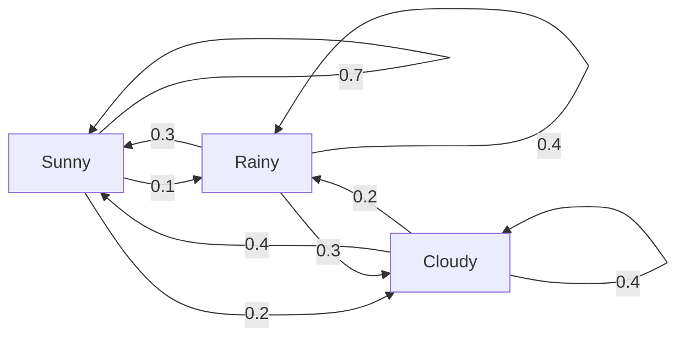
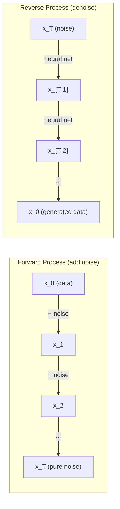

# 随着过程的过程

> 随机性与结构,随机散步,马科夫链和扩散模型背后的数学.
> 有结构性随机性――随机流程、马尔可夫链和扩散模型背后的数学――

**Type:** Learn | **类型:** 学习
**Language:**子**语言:**字符串
**Prerequisites:** Phase 1, Lessons 06-07 (probability, Bayes) | **前置知识:** Phase 1, 第 06-07 课（概率、贝叶斯）
**Time:** ~75 minutes | **时间:** ~75 分钟

## 学习目标

- 模拟1D和2D随机行走,并验证移动的平方
  模拟一维和二维随机游走,验证位移的 √n 缩放规则
- 通过自己的组合计算它静止分布
  构建马尔可夫链模拟器,通过特征分解计算平稳分布
- 实施Metropoolis-Hastings MCMC和Langevin动态,用于从目标分布中采样
  实现大都会-哈斯廷斯 MCMC 和 兰杰文 动力学,从目标分布中采样
- 将前方扩散过程连接到布朗运动,并解释反向过程如何生成数据
  将前向扩散过程与布朗运动联系起来,解释反向过程如何生成数据


> **【中文解读】**
> 随机过程是有结构的随机性――马尔可夫链 (马尔可夫链) 现在的状态只依赖于前一步) 是 PageRank 的基础――扩散模型的前向过程是布朗运动 (布朗运动) 增加噪音),反向过程是去噪音产生――MCMC 是贝叶斯统计的基石――

## 问题 问题引入

许多人工智能系统都涉及随机性,随着时间的推移而进化.而不是静态性,结构化,序列性随机性,

> 许多人工智能系统都涉及随机性随着时间的演变. 不是静态随机性,而是有结构性,序列化的随机性.

语言模型一次生成代币.每个代币取决于前一个背景.模型输出了概率分布,从中取出样本,然后继续进行.这是一个 Stochastic 过程.

> 语言模型逐个生成代币――每个代币取决于之前的上下文――模型输出一个概率分布,从中采样,然后继续――这是随机过程――

扩散模型逐步添加噪音到图像中,直到它变得纯静态.然后它们逆转过程,逐步否定过程,直到出现新的图像.前进过程是马科夫链.逆过程是学习的马科夫链,运行向后.

> 扩散模型逐步向图像添加噪音,直到变成纯静态――然后反转过程,逐步去噪音,直到新的图像出现――前向过程是马尔可夫链,反向过程是学习的反向马尔可夫链――

强化学习代理在环境中采取行动.每一个行动都带来了新的状态,有某种可能性. 代理在一个随机世界中遵循随机政策. 这整个过程是马科夫的决策过程.

> 强化学习智能体在环境中执行动作――每一个动作都会以一定概率导致新状态――智能体在随机世界中遵循随机策略――整个系统是马尔可夫决策过程――MDP (MDP)――

采样是贝耶斯推理的背骨,构建一个马科夫链,

> 基石构建一个马尔可夫链,其平稳分布是你想从中采用后验分布.

所有这些都建立在四个基本思想上:
1. 随机步行 - - 最简单的静止过程
2. 马科夫链 - - 结构化的随机性与过渡矩阵
3. 维因动态 - - 噪音的梯度下降
4. 城市-哈斯廷斯 - - 从任何分布中采样

> 所有这些都建立在四个基本概念上:1.随机游走最简单的随机过程;2.马尔可夫链带转移矩阵的结构性随机性;3.长动力学带噪音梯度下降;4.大都会-哈斯廷斯从任意分布中采集.

## 概念的核心概念

### 随机散步

开始从位置0.每一步,抛一个公平的硬币.头部:右 (+1).尾部:左 (-1).

> 从位置 0 开始──每一步抛一枚公平硬币──正面:向右 (+1)──反面:向左 (-1)──

随着 n 步骤,你的位置是 n 随机+/-1值的总和.预期位置是 0 (步行是无偏见的).但预期距离从原点增长为 sqrt(n).

> 后,你的位置是 n 个随机 ± 1 值的求和――期望位置为 0  走无偏),但距离原点的期望距离按 √n 增长――

这与直觉相反.步行是公平的 - - 没有任何方向的漂移.但随着时间的推移,它从开始的地方越来越远. n 步骤后的标准偏差是 sqrt(n.

> 这有点反直觉. 游走是公平的. 两条方向没有漂移.

```
Step 0:  Position = 0
Step 1:  Position = +1 or -1
Step 2:  Position = +2, 0, or -2
...
Step 100: Expected distance from origin ~ 10 (sqrt(100))
Step 10000: Expected distance from origin ~ 100 (sqrt(10000))
```

**In 2D**步行的速度在一个小时内,步行的速度在一个小时内,步行的速度在一个小时内,步行的速度在一个小时内,步行的速度在一个小时内,步行的速度在一个小时内,步行的速度在一个小时内,步行的速度在一个小时内,步行的速度在一个小时内,步行的速度在一个小时内,步行的速度在一个小时内,步行的速度在一个小时内,步行的速度在一个小时内,步行的速度在一个小时内,步行的速度在一个小时内,步行的速度在一个小时内,步行的速度在一个小时内,步行的速度在一个小时内,步行的速度在一个小时内,步行的速度在一个小时内,步行的速度在一个小时内,步行的速度在一个小时内,步行的速度在一个小时内,步行的速度在一个小时内,步行的速度在一个小时内,步行的速度在一个小时内,步行的速度在一个小时内.

> **二维情况下**走以等概率上,下,左,右移动.

**Why sqrt(n)?**每一步都是 +1 或 -1 且概率均等. n 步骤后,位置 S_n = X_1 + X_2 + ... + X_n 每一步 X_i 为 +/-1. 每一步的变量为 1,步骤是独立的,所以 Var(S_n) = n.标准偏差 = sqrt(n.

> **为什么是 √n？**每步差为1,步与步独立,所以Var(S_n) =n,标准差 =√n──由中心极限理,S_n/√n 收到标准正态分布──

这种平方 (n) 尺度在 ML 中显示到处. SGD 噪声尺度为1/sqrt(批量尺寸). 嵌入尺寸尺度为 sqrt(d). 平方根是独立随机加算的签名.

> √n 缩放在 ML 中无处不在──SGD 噪音按1/√(批量_尺寸) 缩放,嵌入维度按√d 缩放──平方根是独立随机叠加的标志──

**Connection to Brownian motion.**随着 n 进入无限,步行将趋于布朗运动 B(t) - 一个连续时间过程,B(t) 通常分布在平均0和变量 t.

> **与布朗运动的联系。**取步长 1/√n、每单位时间的随机游走──当 n → ∞ 时,游走收到布朗运动 B(t) 一个连续时间过程,B(t) ~ N(0, t) ・・・

布朗运动是扩散的数学基础. 它模拟了液体中的粒子的随机摇摆,股价的波动,

> 布朗运动是扩散模型的数学基础. 它描述了流体中的粒子的随机动作,股票价格的波动以及最关键的扩散模型中的噪音过程.

**Gambler's ruin.**随机步行者从位置 k开始,吸收屏障在 0 和 N. 达到 N 在 0 之前的概率是多少? 公平步行: P(reach N) = k/N. 这令人惊的简单和优雅. 它与马丁加尔理论相连 - - 公平随机步行是马丁加尔 (预期未来值 = 现值).

> **赌徒破产问题。**从位置 k 出发,在 0 和 N 处有吸收壁──到达 N 没有 0 的概率是多少?公平游走:P = k/N──这连接到论公平随机游走是一个──

### 马科夫链

马科夫链是一个系统,根据固定概率,状态之间过渡.关键属性:下一个状态只取决于当前状态,而不是历史.

> 马尔可夫链是一个基于固定概率在状态之间转移的系统.

```
P(X_{t+1} = j | X_t = i, X_{t-1} = ...) = P(X_{t+1} = j | X_t = i)
```

这就是马科夫的属性. 这意味着你可以用过渡矩阵P来描述整个动态:

> 这就是马尔可夫的性质. 这意味着你可以用转移矩阵 P 描述整个动态.

```
P[i][j] = probability of going from state i to state j
```

每一行P的数值为1 (你必须去某个地方).

> 为了一个你必须去某个地方.

**Example -- Weather:**

> **示例——天气：**

```
States: Sunny (0), Rainy (1), Cloudy (2)

P = [[0.7, 0.1, 0.2],    (if sunny: 70% sunny, 10% rainy, 20% cloudy)
     [0.3, 0.4, 0.3],    (if rainy: 30% sunny, 40% rainy, 30% cloudy)
     [0.4, 0.2, 0.4]]    (if cloudy: 40% sunny, 20% rainy, 40% cloudy)
```

开始在任何状态.经过许多转变,状态分布趋于静止分布 pi,其中 pi * P = pi.这是 P 的左自向量,自值 1.

> 从任意状态开始,经过足够的转移后,状态分布收到平稳分布 π,满足 π·P = π──这是P的特征值为1的左特征向量──

对于天气链,静止分布可能是 [0.53,0.18,0.29] - 长期来看,它在53%的时间里是阳光的,
对于天气链,静止分布是 [0.55,0.18,0.27] -- 长期来看,它在55%,不管是什么状态开始,

> 对于天气链而言,平稳分布可能是 [0.53,0.18,0.29]长期来看53%的时间晴天,与起始状态无关.



**Computing the stationary distribution.**两种方法:

1. **Power method**并且在一个小组中,它可以通过 P 乘以 P 乘以 P.
2. **Eigenvalue method**求出 P 的左自向量与 eigenvalue 1. 这就是 P^T 的自向量与 eigenvalue 1.

> **计算平稳分布。**两种方法:1.**幂法**复复用任意初始分布乘以P,足够多次后收──2.**特征值法**求P的特征值为1的左特征向量 (即P^T的特征值为1的右特征向量)

两种方法都要求链接满足缩条件.

> 两种方法都要求链满足收费条件.

**Convergence conditions.**如果一个马科夫链是:
- **Irreducible**任何国家都可以从其他国家到达
- **Aperiodic**:链不循环,有固定时间

> **收敛条件。**马尔可夫链收到唯一平稳分布需要满足:**不可约**(每个状态都能从其他状态到达);**非周期**(链不会以固定周期循环)

机器人机器人机器人机器人机器人机器人机器人机器人机器人机器人机器人机器人机器人机器人机器人机器人机器人机器人机器人机器人机器人机器人机器人机器人机器人机器人机器人机器人机器人机器人机器人机器人机器人机器人机器人机器人机器人机器人机器人机器人机器人机器人机器人机器人机器人机器人机器人机器人机器人机器人机器人机器人机器人机器人机器人机器人机器人机器人机器人机器人机器人机器人机器人机器人机器人机器人机器人机器人机器人机器人机器人机器人机器人机器人机器人机器人机器人机器人机器人机器人机器人机器人机器人机器人机器人机器人机器人机器人机器人机器人机器人机器人机器人机器

> 你在ML中遇到的大多数链都满足了这两个条件.

**Absorbing states.**吸收状态是吸收的,如果你进入它,你永远不会离开 (P[i][i] = 1).吸收马科夫链模型过程与终端状态 - 一场结束的游戏,一个客户,一个,一个符号序列,

> **吸收状态。**一旦进入就永远不离开状态 ((P[i][i]=1) ⋅吸收马尔可夫链建模有终止状态的过程结束游戏、流失客户、命中结束代币的序列──

**Mixing time.**位分布"接近"链程的步骤有多少? 形式上,位距离的变化距离总数下降到某个门以下.快速混合 = 需要几步.P的光谱差距 (1减下第二大自值) 控制了混合时间.更大的差距 = 快速混合.

> **混合时间。**链"接近"平稳分布需要多少步骤?形式上,是与平稳分布的总变差距降至值以下的步数――快混合 = 步数少――谱间隙(1 - 第二大特征值) 控制混合时间:间隙越大,混合越快――

### 与语言模型的连接

语言模型中的代币生成大约是马科夫过程.鉴于当前的背景,模型输出了下一个代币的分布.温度控制了敏度:

> 语言模型的代币 生成近似是一个可行的过程――给定当前上下文,模型输出下一个代币的概率分布――温度 控制分布的尖度:

```
P(token_i) = exp(logit_i / temperature) / sum(exp(logit_j / temperature))
```

- 温度=1.0:标准分布
- 温度 < 1.0:更 (更确定性)
- 温度 > 1.0:平坦 (更随机)
- 温度 -> 0: argmax (贪)

> 温度=1.0 标准分布;<1.0 更尖(更确定性);>1.0 更平坦(更随机);→0 退化为 argmax(贪心解码) 』

顶k样本抽取量缩小到k最有可能的代币.顶p (核)样本抽取量缩小到其累计概率超过p的最小的代币组.这两者都修改了马科夫过渡概率.

> 顶级k采样保留概率最高的k个代币;顶级p(核采样) 保留积累概率超过p的最小代币集合――两者都修改了马可夫转移概率――

### 布朗运动

随机走路的连续时间限制.位置B(t) 有三个属性:
1. 子
2. B(t) - B(s) 通常分布为平均0和变量 t - s (为 t > s)
3. 不重叠间隔的增长是独立的

> 布朗运动是随机游走的连续时间极限──B(t) 有三条性质:B(0)=0;B(t) -B(s) ~N(0, t-s);非重叠区间上的增量独立──

布朗运动是连续的,但在任何地方都无法区分,它在每个尺度上都会摇摆.

> 布朗运动连续,但处处不可导导.它在每个尺度都动.

在单独的模拟中,你将布朗运动 приблизи为:

```
B(t + dt) = B(t) + sqrt(dt) * z,    where z ~ N(0, 1)
```

平方度是重要的.它来自于对随机行走的中央限定理.

> 离散仿真中使用 B(t+dt) = B(t) + √dt × z 近似布朗运动(z ~ N(0,1)) △√dt 缩放很关键,源自随机游走的中心极限理。

### 兰杰文动力学

渐进式下降发现函数的最小值. 朗杰文动态发现概率分布与 exp ((-U ((x) /T) 比例,U是能量函数,T是温度.

> 梯度下降找函数最小值――Langevin 动力学找概率分布  exp(-U(x)/T),其中U 是能量函数,T 是温度――

```
x_{t+1} = x_t - dt * gradient(U(x_t)) + sqrt(2 * T * dt) * z_t
```

两种力量对粒子作用:
1. **Gradient force**(-dt *梯度(U)):向低能量推进 (如梯度下降)
2. **Random force**按在随机方向 (探索)

> 两种作用在粒子上:1.**梯度力**推向低能量 (类似于梯度下降);2.**随机力**推向随机方向 (探索)

在温度T=0时,这是纯梯度下降.在高温时,它几乎是随机走路.在正确的温度下,粒子探索能量景观,并在低能区域花更多时间.

> 温度T=0 时是纯梯度下降.高温时近似随机游走.合适的温度下,粒子探索能量景观,并在低能量区域停留更久.

**Connection to diffusion models.**扩散模型的前进过程是:

```
x_t = sqrt(alpha_t) * x_{t-1} + sqrt(1 - alpha_t) * noise
```

现在,我们可以看到一个数据的音,然后我们可以看到一个数据的音.

> 扩散模型的前向过程:x_t = √α_t × x_{t-1} + √(1-α_t) ×噪音──这是逐步混入噪音的马尔可夫链,足够多步后x_T 变为纯高噪音──

反向过程--从噪音回到数据-- 也是一种马科夫链,但它的过渡概率是由神经网络学习的.

> 转向过程从噪音回到数据也是马尔可夫链,但转移概率由神经网络学习.网络学会预测每一步增加的噪音,然后减去它.



### 马科夫链蒙特卡罗

有时你需要从分布 p ((x) 中样本,你可以评估 (到一个常数),但不能直接从样本.贝耶斯后层是经典的例子 - - 你知道概率乘以前面,但正常化常数是难以解决的.

> 有时你需要从一个可以计算的 (但缺少归结常数) 却无法直接采用样式分布 p (x) 中采样.

**Metropolis-Hastings**构建一个马科夫链,其静止分布为p(x):

1. 从某个位置开始 x
2. 提出一个新的立场x'从一个提案分布Q(x' 则x)
3. 计算接受率: a(x') * Q(x 便x') / (p(x) * Q(x'便x))
4. 接受x'与概率min ((1,a).否则保持在x.
5. 复制.

> **Metropolis-Hastings**构建一个平稳分布为p(x) 的马尔可夫链:1) 从某点 x 出发;2) 从提议分布 Q(x'就是x) 提出新位置 x';3) 计算接受率 a = p(x') Q(x在x') / p(x) Q(x'在x));4) 以概率 min(1,a) 接受,否则停留;5) 重复.

如果Q是对称,例如,Q(x' (便x) =Q(x (便x') =N(x, sigma^2)),比率简化为a =p(x') /p(x.

> 如果Q对称 (如高斯),接受率简化为a = p(x')/p(x) ,只需要概率比归纳常数自动消灭,这正是MCMC对贝叶斯后验如此有用的原因.

由于这种情况,在很小的条件下,链接可以保证将与p ((x) 融合.但如果提案太小 (随机走路) 或太大 (高拒绝),则趋同可能会缓慢.调整提案是MCMC的艺术.

> 在温和条件下链保证收到p(x) ⋅但收可能慢提议太小变成随机游走) 或太大高拒绝率) ⋅调参是MCMC的艺术.

**Why it works.**接受比率确保了详细的平衡:在x'上移动到x'的概率等于在x'上移动到x的概率.详细的平衡意味着p(x) 是链的静止分布.所以,经过足够的步骤,样本来自p(x.

> **为什么有效**接受率保证细致平衡从 x 到 x 的概率等于从 x 到 x 的概率──细致平衡意味着 p   是链的平稳分布,足够多步后样本来自 p .

**Practical considerations:**
- **Burn-in**链接需要时间才能从起点到达静止分布.
- **Thinning**保持每一个k-th样本以减少自动相关性.
- **Multiple chains**它们在不同的起点上运行多个链.
- **Acceptance rate**对于高斯的d维度提案,最佳接受率约为23% (Roberts & Rosenthal, 2001).

> 实战要点:**Burn-in**丢弃前 N 个样本(链需要时间到达平稳分布);**Thinning**每个样本取一个(降低自相关);**Multiple chains**由于不同点跑多条链,如果收到同分布,则有收到证据.**Acceptance rate**维高斯提议的最佳接受率约为23%.

### 人工智能中的断过程

| Process | AI Application |
|---------|---------------|
| Random walk | Exploration in RL, Node2Vec embeddings |
| Markov chain | Text generation, MCMC sampling |
| Brownian motion | Diffusion models (forward process) |
| Langevin dynamics | Score-based generative models, SGLD |
| Markov decision process | Reinforcement learning |
| Metropolis-Hastings | Bayesian inference, posterior sampling |

> 随机过程在AI中应用:随机游走:RL 探索、Node2Vec 嵌入) 、马尔可夫链 (文本生成、MCMC) 、布朗运动(扩散模型前向) 、Langevin 动力学(基于得分的模型、SGLD) 、马尔可夫决策过程(强化学习) 、大都会-哈斯廷斯 (Metropoles-Hastings) 贝叶斯推理、后验采样) ⋅

## 建立它,实现它.
```figure
random-walk-diffusion
```

## 建立它

### 步骤1:随机走路模拟器

> 第1步:随机游走模拟器──1D 用累加和,2D 用四个方向(上下左右) 的累加──

```python
import numpy as np

def random_walk_1d(n_steps, seed=None):
    rng = np.random.RandomState(seed)
    steps = rng.choice([-1, 1], size=n_steps)
    positions = np.concatenate([[0], np.cumsum(steps)])
    return positions


def random_walk_2d(n_steps, seed=None):
    rng = np.random.RandomState(seed)
    directions = rng.choice(4, size=n_steps)
    dx = np.zeros(n_steps)
    dy = np.zeros(n_steps)
    dx[directions == 0] = 1   # right
    dx[directions == 1] = -1  # left
    dy[directions == 2] = 1   # up
    dy[directions == 3] = -1  # down
    x = np.concatenate([[0], np.cumsum(dx)])
    y = np.concatenate([[0], np.cumsum(dy)])
    return x, y
```

1D走路存储累计的总和.每个步骤是 +1 或 -1. n步骤后,位置是总和.变异与 n 增长线性,所以标准偏差增长为 sqrt(n.

> 一维随机游走存储累加和──每步是 +1 或 -1──n 步后位置是总和──方差线性增长 n,标准差按 √n 增长──

### 步骤2:马科夫链

> 第2步:马尔可夫链――步骤() 按转移概率选下一状态;模拟() 跑多步生成轨迹;站立_分布() 用特征分解求平稳分布。

```python
class MarkovChain:
    def __init__(self, transition_matrix, state_names=None):
        self.P = np.array(transition_matrix, dtype=float)
        self.n_states = len(self.P)
        self.state_names = state_names or [str(i) for i in range(self.n_states)]

    def step(self, current_state, rng=None):
        if rng is None:
            rng = np.random.RandomState()
        probs = self.P[current_state]
        return rng.choice(self.n_states, p=probs)

    def simulate(self, start_state, n_steps, seed=None):
        rng = np.random.RandomState(seed)
        states = [start_state]
        current = start_state
        for _ in range(n_steps):
            current = self.step(current, rng)
            states.append(current)
        return states

    def stationary_distribution(self):
        eigenvalues, eigenvectors = np.linalg.eig(self.P.T)
        idx = np.argmin(np.abs(eigenvalues - 1.0))
        stationary = np.real(eigenvectors[:, idx])
        stationary = stationary / stationary.sum()
        return np.abs(stationary)
```

静止分布是 P 的左自向量,具有自值 1. 我们通过计算 P^T 的自向量 (转换左自向量为右自向量) 找到它.

> 平稳分布是P的特征向量为1的左特征向量──通过对P^T 求特征向量得到(转移把左特征向量变成右特征向量)。

### 步骤3: 兰杰文动态

> 第3步:长动力学――梯度下降 + 高斯噪音 = 探索能量景观并采样――

```python
def langevin_dynamics(grad_U, x0, dt, temperature, n_steps, seed=None):
    rng = np.random.RandomState(seed)
    x = np.array(x0, dtype=float)
    trajectory = [x.copy()]
    for _ in range(n_steps):
        noise = rng.randn(*x.shape)
        x = x - dt * grad_U(x) + np.sqrt(2 * temperature * dt) * noise
        trajectory.append(x.copy())
    return np.array(trajectory)
```

渐变将x推向低能量.噪音防止它住.在平衡时,样本分布与ex ((-U ((x) /温度相比例).

> 梯度把 x 推向低能量区,噪音防止陷入局部最优──平衡时样本分布  exp(-U(x) /温度)──

### 第四步:大都会 - 忙

> 第4步:大都会-哈斯廷斯 MCMC――从目标分布

```python
def metropolis_hastings(target_log_prob, proposal_std, x0, n_samples, seed=None):
    rng = np.random.RandomState(seed)
    x = np.array(x0, dtype=float)
    samples = [x.copy()]
    accepted = 0
    for _ in range(n_samples - 1):
        x_proposed = x + rng.randn(*x.shape) * proposal_std
        log_ratio = target_log_prob(x_proposed) - target_log_prob(x)
        if np.log(rng.rand()) < log_ratio:
            x = x_proposed
            accepted += 1
        samples.append(x.copy())
    acceptance_rate = accepted / (n_samples - 1)
    return np.array(samples), acceptance_rate
```

算法提出一个新的点,检查它是否具有更高的概率 (或与比率相对的概率接受),并重复.

> 算法流程:提议新点 → 检查概率是否更高 (或按比例接受)→ 重复.

## 用它实现框架

实际上,你会使用既定的库来进行这些算法.

> 实际上,你使用成熟库实现这些算法.

```python
import numpy as np

rng = np.random.RandomState(42)
walk = np.cumsum(rng.choice([-1, 1], size=10000))
print(f"Final position: {walk[-1]}")
print(f"Expected distance: {np.sqrt(10000):.1f}")
print(f"Actual distance: {abs(walk[-1])}")
```

> 实现随机游走:一行代码生成 10000 步 ±1 随机游走,验证实际距离与理论值√10000 = 100 接近――

### 转变矩阵的 numpy

```python
import numpy as np

P = np.array([[0.7, 0.1, 0.2],
              [0.3, 0.4, 0.3],
              [0.4, 0.2, 0.4]])

distribution = np.array([1.0, 0.0, 0.0])
for _ in range(100):
    distribution = distribution @ P

print(f"Stationary distribution: {np.round(distribution, 4)}")
```

> 处理转移矩阵:从 [1,0,0] 出发,反复左乘 P 100 次,自动收到平稳分布――这就是 PageRank等算法的核心――

乘以P重复初始分布. 经过足够的代,它与您开始的位置不论相近的静止分布.这是寻找主导左自向量的功率方法.

> 反复使用初始分布乘以P──足够多次代后,无论从哪个开始都收到平稳分布──这就是求主左特征向量法──

### 与实际框架的联系

- **PyTorch diffusion:**其他`DDPMScheduler`在拥抱的脸上`diffusers`执行前进和倒退的马科夫链
- **NumPyro / PyMC:**对于贝叶斯推理使用MCMC (NUTS样本,在Metropolis-Hastings上改善)
- **Gymnasium (RL):**环境步骤函数定义了马科夫决策过程

> 抱脸的真实框架`diffusers`实现了扩散模型的前向/反向马尔可夫链;NumPyro/PyMC使用 NUTS采样器 (Metropoles-Hastings的改进版) 做贝叶斯推理;高中的步骤函数定义了马尔可夫的决策过程.

### 验证马科夫链的融合

```python
import numpy as np

P = np.array([[0.9, 0.1], [0.3, 0.7]])

eigenvalues = np.linalg.eigvals(P)
spectral_gap = 1 - sorted(np.abs(eigenvalues))[-2]
print(f"Eigenvalues: {eigenvalues}")
print(f"Spectral gap: {spectral_gap:.4f}")
print(f"Approximate mixing time: {1/spectral_gap:.1f} steps")
```

频谱差距告诉你链接的原始状态是多快的. 0.2 的差距意味着大约 5 个步骤的混合. 0.01 的差距意味着大约 100 个步骤. 运行长时间模拟之前,总是检查这个 - - 一个缓慢混合链废物计算.

> 谱隙告诉你链多快忘初始状态――0.2 的间隙大约需要5步混合;0.01大约需要100步――运行长仿真前总要检查这个慢混合的链浪费算力――

## 运送它.

这一课产生了:
- `outputs/prompt-stochastic-process-advisor.md`--一个提示,帮助确定哪个对特定问题的过程框架适用于

> 本课产出:帮助识别给定问题适用于哪种随机过程框架的提示词.

## 联系 概念关联地图

| Concept | Where it shows up |
|---------|------------------|
| Random walk | Node2Vec graph embeddings, exploration in RL |
| Markov chain | Token generation in LLMs, MCMC sampling |
| Brownian motion | Forward diffusion process in DDPM, SDE-based models |
| Langevin dynamics | Score-based generative models, stochastic gradient Langevin dynamics (SGLD) |
| Stationary distribution | MCMC convergence target, PageRank |
| Metropolis-Hastings | Bayesian posterior sampling, simulated annealing |
| Temperature | LLM sampling, Boltzmann exploration in RL, simulated annealing |
| Mixing time | Convergence speed of MCMC, spectral gap analysis |
| Absorbing state | End-of-sequence token, terminal states in RL |
| Detailed balance | Correctness guarantee for MCMC samplers |

> 概念关联:随机游走 (Node2Vec、RL 探索) 、马尔可夫链 (LLM代币 生成、MCMC) 、布朗运动 (DDPM 前向过程) 、Langevin 动力学 (Score-based 模型、SGLD) 、平稳分布 (MCMC 收目标、PageRank) 、都市-Hastings (贝叶斯后验、模拟退火) 、温度 (LLM采样、博尔茨曼 探索) 、混合时间 (MCMC 收速度) 、吸收状态 (序列结束、RL 终止状态) 、详细平衡证 (MCMC 采样器的正确性保证) 、

扩散模型值得特别关注.DDPM (Ho et al., 2020) 定义了前进马科夫链:

```
q(x_t | x_{t-1}) = N(x_t; sqrt(1-beta_t) * x_{t-1}, beta_t * I)
```

在T步骤后,x_T是大约N(0,I).反向过程由一个神经网络进行参数,预测噪音:

```
p_theta(x_{t-1} | x_t) = N(x_{t-1}; mu_theta(x_t, t), sigma_t^2 * I)
```

了解马科夫链意味着理解如何和为什么扩散模型生成数据.

基梯度化 (Stochastic Gradient Langevin Dynamics) 结合了迷你批次化降低和基梯度噪音. 根据标准的测量, 随着学习速度的衰退,SGLD从优化转向采样 -- 你得到了大约的贝耶斯后面样品免费. 这就是从神经网络中获取不确定性估计的最简单方法之一.

关键的见解在所有这些连接上:  Stochastic 过程不仅仅是理论工具. 他们是现代人工智能系统中的计算机制. 当你调整法学士的温度时,你调整了马科夫链. 当你训练一个扩散模型时,你正在学习扭转一个类似布朗运动的过程. 当你运行贝叶斯推理时,你构建一个连锁链,

> 穿越所有这些联系的核心洞见:随机过程不仅仅是理论工具,它们是现代人工智能系统内部的计算机制.

## 练习题

1. **Simulate 1000 random walks of 10000 steps.**图表最终位置分布. 验证它是大约高斯式的,平均值为0和标准偏差为10000) = 100.

2. **Build a text generator using a Markov chain.**训练一个小的体积:每一个词,数过关到下一个词. 构建过关矩阵. 通过从链中采样生成新的句子.

3. **Implement simulated annealing**使用Metropoles-Hastings. 开始在高温 (几乎接受一切) 并且逐渐冷却 (只接受改进). 使用它来找到一个具有多个本地最小的函数的最小值.

4. **Compare Langevin dynamics at different temperatures.**采样从双井潜力 U(x) = (x^2 - 1)^2.在低温下,样本集成在一个井.在高温下,它们分散在两处.找到链接混合的关键温度.

5. **Implement the forward diffusion process.**开始使用1维信号 (例如,鼻波).通过线性噪音时间表逐步增加噪音100步以上. 显示信号如何降低到纯噪音. 然后实施一个简单的指标,扭转这个过程 (即使是简单的,只会减去估计的噪音).

## 关键词 快速查找表

| Term | What people say | What it actually means |
|------|----------------|----------------------|
| Random walk | "Coin-flip movement" | A process where position changes by random increments at each step |
| Markov property | "Memoryless" | The future depends only on the present state, not on the history |
| Transition matrix | "The probability table" | P[i][j] = probability of moving from state i to state j |
| Stationary distribution | "The long-run average" | The distribution pi where pi*P = pi -- the chain's equilibrium |
| Brownian motion | "Random jiggling" | The continuous-time limit of a random walk, B(t) ~ N(0, t) |
| Langevin dynamics | "Gradient descent with noise" | Update rule that combines deterministic gradient and random perturbation |
| MCMC | "Walking toward the target" | Constructing a Markov chain whose stationary distribution is the one you want |
| Metropolis-Hastings | "Propose and accept/reject" | MCMC algorithm that uses acceptance ratios to ensure convergence |
| Temperature | "The randomness knob" | Parameter controlling the tradeoff between exploration and exploitation |
| Diffusion process | "Noise in, noise out" | Forward: gradually add noise. Reverse: gradually remove it. Generates data. |

> 术语速查:随机走 (随机游走) ‧马科夫属性 ((无记忆性) ‧过渡矩阵 ((转移矩阵 P[i][j]) ‧稳定分布 ((平稳分布 π·P=π) ‧布朗运动 B (t) ~N (t) ‧0,t)) ‧长动态 ((带噪音的梯度下降) ‧MCMC(构建平稳分布为目标分布的马尔可夫链) ‧大都市-哈斯廷斯 (Metropoles-Hastings) ‧提议-接受/拒绝MC 算法) ‧温度探索/利用平衡参数) ‧MC 扩散过程 (前加噪声、反向产生噪音数据) ‧

## 继续阅读 继续阅读

- **Ho, Jain, Abbeel (2020)**关于"散概率模型"的论文, 引发了散模型革命.
- **Song & Ermon (2019)**基于分数的方法,使用兰杰文动态进行样本采集.
- **Roberts & Rosenthal (2004)**什么时候和为什么MCMC工作的理论.
- **Norris (1997)**标准教科书,涵盖缩,静止分布和击球时间.
- **Welling & Teh (2011)**通过斯托卡斯式渐进式兰杰文动力学进行贝耶斯学习.
