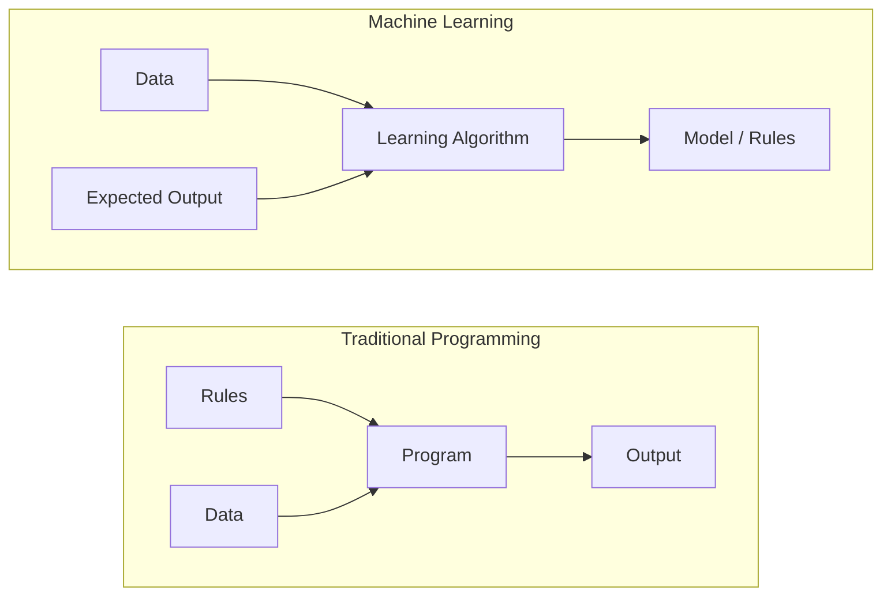
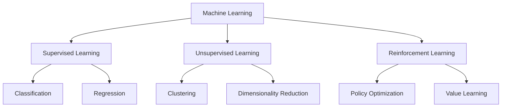
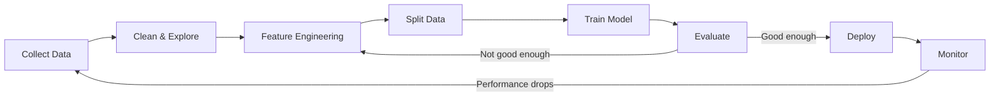
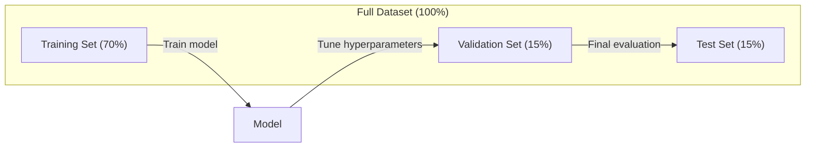
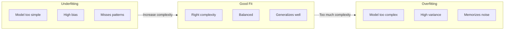
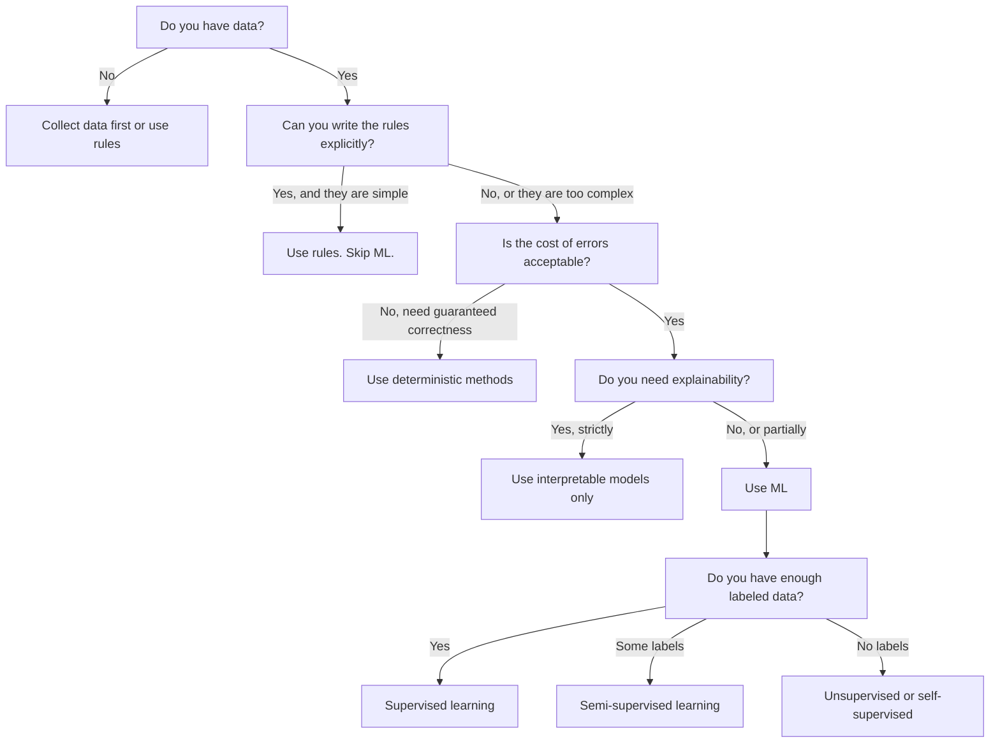

# 机器学习是什么?
# 什么是机器学习


> 机器学习是教计算机在数据中找到模式,而不是手动写规则.

> 机器学习是通过计算机从数据中发现规则而不是通过人工编写规则来学习的.

**Type:** Learn | **类型：** 学习
**Languages:** Python
**Prerequisites:** Phase 1 (Math Foundations) | **前置知识：** Phase 1（数学基础）
**Time:** ~45 minutes | **时间：** 约 45 分钟

## 学习目标

- 解释监督,无监督和加强学习之间的区别,并确定适用于特定问题的类型
  解释监督学习、无监督学习和强化学习之间的区别,并判断适用于哪种类型的问题
- 从零开始实现最接近的中位列分类器,并与随机基线进行评估
  从零实现近期质量分类器,并与随机基线进行比较评估
- 区分分分类和回归任务,并为每个任务选择适当的损失函数
  区分分类和归回任务,选择适合每个任务的损失函数
- 评估一个特定的业务问题是否适合 ML 或更好地通过确定性规则解决
  评估一个业务问题是否适合解决 ML 问题,还是更好使用确定性规则


> **【中文解读】**
> 机器学习是让计算机从数据中自动学习规律,而不是靠人工编写规则.

> **【拓展：机器学习范式的产业应用】**
> GPT-4 使用自监督学习(预测下一个代币) 在约13亿代币上训练;BERT 使用掩码语言建模在维基百科 + BookCorpus 上预训;AlphaGo 使用强化学习通过自我对超越人类围棋冠军。这三种范式在真实AI 系统中常常组合使用ChatGPT 先自监督预训,再使用RLHF(人类反强化学习) 对齐──

## 问题 问题引入

如果你想建立一个垃圾邮件过器.传统的方法:坐下来写数百条规则. "如果电子邮件包含"免费的钱",请标记为垃圾邮件.如果有超过3个呼声符,请标记为垃圾邮件".你花了几周时间写规则.然后垃圾邮件人员改变了他们的措辞.你的规则被打破.你写了更多规则.循环永远不会结束.

> 你想建立垃圾邮件过器.传统方法是坐下来写100条规则. "如果邮件包含"免费的钱",标记为垃圾邮件.如果超过3个感叹号,标记为垃圾邮件. "你花了几周写规则.

机器学习会扭转这个问题.你给计算机送了数千封标记的电子邮件 ("垃圾邮件"或"不是垃圾邮件") 让它自己弄清楚这些规则.计算机会发现你从来没有想到的模式.

> 机器学习颠覆了这种方式――你不是编写规则,而是给计算机数千封标记的邮件――"垃圾邮件"或"正常邮件"),让它自己找到规则――计算机能发现你从未想象过的模式――当垃圾邮件发送者改变策略时,你只需要在新数据上重新训练,而不是重写代码――

机器学习的核心是从"编程规则"转向"数据学习". 每个推引擎,语音助理,自动驾驶汽车和语言模型都以这种方式运作.

> 转变从"编程规则"到"从数据中学习"是机器学习的核心.

> **【中文解读】**
> 传统编程是"人写规则,机器执行";机器学习是"人给数据,机器自己发现规则"――例如垃圾邮件过器:传统方法需要手动维护数百条规则,而 ML 方法只需要提供大量的标签邮件,模型自动学习判别模式――当垃圾邮件策略变化时,只需要重新训练而不是重写代码――

> **【拓展：垃圾邮件过滤的演进】**
> 简单的垃圾邮件过器每天处理约300亿封邮件,准确率超过99.9%――早期使用规则引擎 (如SpamAssassin),后来转向ML,简单的贝叶斯 →集成方法 →深度学习) 现代系统结合TF-IDF特征,n-gram 模型和神经网络,在毫秒级完成分类――

## 概念的核心概念

### 从数据中学会,而不是规则

传统编程和机器学习解决了问题,

> 传统编程和机器学习的相反方向解决问题.



传统编程:你写出规则.程序将它们应用到数据中,以产生输出.

> 传统编程:你编写规则.程序将规则应用于数据产生输出.

机器学习:你提供数据和预期的输出.算法发现了规则.

> 机器学习:你提供数据和期望输出.

训练中所产生的"模式"是规则,编码为数字 (重量,参数).它从已见的例子中概括,以对从未见过的数据进行预测.

> 训练产生的"模型"就是规则本身,以数字的形式编码.

> **【中文解读】**
> 传统编程与机器学习的本质区别:传统编程输入"规则+数据"得到"输出";机器学习输入"数据+期望输出"得到"模型 (规则) :"模型本质上是使用数字编码的规则 (权重和参数),它可以对从未见过的新数据做预测.

### 机器学习的三个类型



**Supervised Learning**模型学习如何将输入到输出地图.
- "这里有1万张标记着猫或狗的照片.
- "这里有房子的特征和价格.

> **监督学习**模型学习将输入映射到输出.
> - "这里有1万张标记着猫或狗的照片.
> - "这里有房屋特征和价格.

**Unsupervised Learning**只有输入,没有标签,模型本身就能找到结构.
- "这里有1万个客户购买历史,找到自然的组合.
- "这里有1000个维度数据点,同时保持结构.

> **无监督学习**模型自己发现数据中的结构.
> - "这里有1万个客户购买记录.
> - "这里有1000维的数据点.

**Reinforcement Learning**经纪人在环境中采取行动,获得奖励或处罚.他学习一种战略 (政策) 来最大化总奖励.
- "玩这个游戏. 赢得1个,输掉1个,找出一个策略.
- "控制这个机器人臂. 接收物体的 +1 ,每秒浪费的 -0.01".

> **强化学习**智能体在环境中采取行动并获得奖励或惩罚.
> - "玩这个游戏,赢得+1,输掉-1.
> - "控制这个机械臂. 成功抓住物体 +1 每秒浪费 -0.01――"

您将在实践中建立的大部分东西都使用监督学习.未监督学习是预处理和探索的常见.强化学习为语言模型提供了游戏人工智能,机器人和RLHF的能力.

> 在实践中,你构建的大部分系统都使用监督学习.无监督学习常用于预处理和探索.

> **【拓展：三种范式在真实系统中的分工】**
> 网上推系统同时使用三种范式:协同过(无监督聚类用户群) 监督学习(预测用户对电影的评分1-5星) 强化学习(A/B 测试选择最优推策略) ;;特斯拉自动驾驶员 使用监督学习(目标检测) + 强化学习(路径规划) ・稳定传播的训练涉及自监督(图像文本对学习 CLIP) + 监督微调;;

### 超越三大

上面的三类都是清洁的,但现实世界ML经常模糊了线条.

> 实际世界的 ML 往往模糊了这些界限.

**Semi-supervised learning**您可能有100个标记的医疗图像和100,000个标记不标记的图像. 技术包括:

> **半监督学习**使用少量标记数据和大量未标记数据. 你可能有100张标记的医学图像和100,000张未标记的图像.

- **Label propagation:**建立一个连接类似数据点的图表.标签从标记节点到未标记的邻居通过图表传播.
  **标签传播：**构建相似的数据点图片.标签从标签节点通过图片传播到未标记的邻居节点.
- **Pseudo-labeling:**训练一个模型,使用标签的数据,使用它来预测标签的数据,然后重新训练一切.
  **伪标签：**在标记数据上训练模型,使用它预测未标记数据的标签,然后在所有数据上重新训练模型,自行生成自己的训练集.
- **Consistency regularization:**模型应该对输入提供相同的预测,并且该输入的版本稍微乱.
  **一致性正则化：**模型应该对输入及其轻微扰动版本做出相同的预测.

**Self-supervised learning**模型从数据结构中创建了自己的预测任务.

> **自监督学习**从数据本身创建监督信号――完全不需要人工标签――模型从数据结构中创建自己的预测任务――

- **Masked language modeling (BERT):**隐藏15%的单词,训练模型预测缺失的单词.
  **掩码语言建模（BERT）：**遮盖句子中 15% 的词,训练模型预测被遮盖的词――"标签"来自原始文本――
- **Contrastive learning (SimCLR):**让模型识别它们来自同一张图像,同时区分它们与其他图像的增强版本.
  **对比学习（SimCLR）：**取一张图像,创建两个增强版本.
- **Next-token prediction (GPT):**预测下一个词,给出了之前的所有词.
  **下一 token 预测（GPT）：**给定前面所有词,预测下一个词――每个文本文档都成为训练样本――

> **【拓展：自监督学习如何驱动大模型革命】**
> 据悉,GPT-4的训练数据约为13亿代币,如果靠人工标记根本不可能.自监督学习让模型从数据本身结构中创建训练信号:BERT 遮盖15%的词让模型预测,GPT 预测下一个代币,SimCLR 通过数据增强学习视觉表征.

它们不是与大三大分类的单独类别.它们是结合监督和未监督的战略.自我监督的学习技术上是监督的 (模型预测某种东西),但标签是自动生成的,不是由人类.

> 它们不是与三大类分离的新类别.它们是监督和无监督思想的结合策略.

### 归类与回归

这些是监督学习的两个主要任务.

> 这两个主要的监督学习任务.

| Aspect | Classification | Regression |
|--------|---------------|------------|
| Output | Discrete categories | Continuous numbers |
| Example | "Is this email spam?" | "What will the house price be?" |
| Output space | {cat, dog, bird} | Any real number |
| Loss function | Cross-entropy, accuracy | Mean squared error, MAE |
| Decision | Boundaries between classes | A curve that fits the data |

| 方面 | 分类 | 回归 |
|------|------|------|
| 输出 | 离散类别 | 连续数值 |
| 示例 | "这封邮件是垃圾邮件吗？" | "房价会是多少？" |
| 输出空间 | {猫, 狗, 鸟} | 任意实数 |
| 损失函数 | 交叉熵、准确率 | 均方误差、MAE |
| 决策方式 | 类别之间的边界 | 拟合数据的曲线 |

归化回答"什么类别?" 退化回答"多少?"

> 分类回答"哪个类别?"回归回答"多少?"

预测股票上或下跌是分类.预测准确的价格是回归.

> 预测股票跌是分类问题.

> **【中文解读】**
> 分类和归归是监督学习的两个基本任务. 分类预测离散类型 (如"垃圾邮件/正常邮件"),回归预测连续数值 (如"房价250万") 关键区别在于输出空间:分类的输出是有限的类型集合,回归的输出是任意实数.

### 劳动力技术工作流程

每个机器学习项目都遵循相同的管道,不管算法如何.

> 每个机器学习项目都遵循相同的流程,无论使用什么算法.



**Collect Data**收集原始数据. 更多数据几乎总是更好,但质量比数量更重要.

> **收集数据**获取原始数据. 更多数据几乎总是更好,但质量比数量更重要.

**Clean & Explore**处理缺失值,删除重复,可视化分布,发现异常. 这一步通常需要60到80%的项目时间.

> **清洗与探索**处理缺值,删除重复项,可视化分布,发现异常.

**Feature Engineering**转换原始数据成模型可以使用的功能.将日期转换为周日.正常化数值列.编码类别变量.好功能比精彩算法更重要.

> **特征工程**编码分类变量 编码的特征比花哨算法更重要.

**Split Data**模型训练基于训练数据,调整验证数据的超参数,并根据测试数据报告最终的性能.

> **划分数据**模型在训练数据上学习,你在验证数据上调节超参数,在测试数据上报告最终性能.

**Train Model**输入训练数据到一个算法.算法调整内部参数以最大限度地减少损失函数.

> **训练模型**训练数据输入算法――算法调整内部参数以最小化损失函数――

**Evaluate**测量验证/测试数据的性能. 如果性能不合适,请回来试试不同的功能,算法或超参数.

> **评估**测试数据测量性能. 如果性能不可接受,回头尝试不同的特征,算法或超参数.

**Deploy**模型将投入生产,它可以对新数据进行预测.

> **部署**模型将投入生产环境,对新数据进行预测.

**Monitor**随着时间的推移,跟踪性能.数据分布变化 (数据漂移),模型降低.

> **监控**随着时间的跟踪性能. 数据分布会变化. 模型会退化.

### 训练,验证和测试分类

首先,你必须根据训练中从未见过的数据评估模型.否则你是测量记忆,而不是学习.

> 这就是初学者最容易犯错误的最重要概念. 你必须在训练期间从未见过的数据模型进行评估.



| Split | Purpose | When used | Typical size |
|-------|---------|-----------|-------------|
| Training | Model learns from this data | During training | 60-80% |
| Validation | Tune hyperparameters, compare models | After each training run | 10-20% |
| Test | Final unbiased performance estimate | Once, at the very end | 10-20% |

| 划分 | 用途 | 使用时机 | 典型比例 |
|------|------|---------|---------|
| 训练集 | 模型从中学习 | 训练期间 | 60-80% |
| 验证集 | 调节超参数，比较模型 | 每次训练后 | 10-20% |
| 测试集 | 最终无偏性能估计 | 最后仅使用一次 | 10-20% |

测试组是神圣的.你只看一次.如果你继续根据测试性能调整你的模型,你就在测试组上有效地训练,你的报告数字是无意义的.

> 测试集是神圣的. 你只能看一次. 如果你根据测试性能调整模型不断,你实际上在测试集上训练,你的报告的数字毫无意义.

> **【中文解读】**
> 数据分类是 ML 中最容易犯的错误之一.训练集用于学习参数,验证集用于调节超参数和选择模型,测试集仅用于最终评估.如果反复在测试集上调整,就等于"偷看答案",模型性能评估完全失效.对于小数据集,使用 k 折交叉验证可以更可靠地评估性能.

对于小数据集,使用k倍交叉验证:将数据分为k部分,训练在k-1部分,验证剩余部分,旋转和平均结果.

> 对于小数据集,使用k 折交叉验证:将数据分成k 份,在k-1 份训练中,在剩余的上验证中,轮换并取平均.

### 过度适应与不足



**Underfitting**模型太简单,无法捕捉数据中的模式. 试图合适曲线关系的直线. 训练错误很高. 测试错误很高.

> **欠拟合**模型太简单,无法捕捉数据中的模式――就像用直线拟合曲的关系――训练误差高――测试误差高――

**Overfitting**模型太复杂,并且记忆训练数据,包括噪音.一个曲线,通过每一个训练点,但失败于新数据.训练错误很低.测试错误很高.

> **过拟合**模型太复杂了,记得训练数据中的噪音. 一条穿过每个训练点的波动曲线,但在新数据上表现很差.

**Good fit**模型可以捕捉到实际的模式,而不会记住噪音.

> **良好拟合**模型捕捉到真实模式而没有记住噪音.

> **【中文解读】**
> 缺拟 = 模型太简单,连训练数据中的规律都没学到;过拟 = 模型太复杂,把训练数据中的噪音都记住了,遇到新数据就"露"――好的模型在训练集和测试集上都表现得很好――判断标准:如果训练准确率远高于验证准确率,就是过拟的典型信号――

过度装备的迹象:
- 训练精度远高于验证精度
  训练准确率远高于验证准确率
- 模型在培训数据上表现良好,但在新数据上表现不佳
  模型在训练数据上表现良好,但在新数据上表现差
- 增加更多的培训数据提高了性能 (模型是记忆,而不是学习)
  增加训练数据能提升性能 (说明模型之前是记忆而不是学习)

> 过拟合的迹象:

过装的固定装置:
- 获取更多训练数据
  获取更多训练数据
- 减少模型复杂性 (参数少,建筑简单)
  降低模型复杂性 ((更少参数,更简单的架构)
- 规范 (加上大型重量罚款)
  正则化 (对大权重加加惩罚)
- 休息 (训练期间随机零结神经元)
  放弃炼时随机将神经元置零)
- 早期停止 (验证错误开始增加时停止训练)
  早停 (当验证差开始上升时停止训练)

> 过拟合的修复方法:

适配不良的固定装置:
- 使用更复杂的模型
  使用更复杂的模型
- 添加更多功能
  添加更多特征
- 减少规律化
  减少正则化
- 列车时间更长
  训练更长时间

> 欠拟合的修复方法:

### 偏差差的交易

这就是超级配件和不足配件的数学框架.

> 这是一个超合和不合的数学框架.

**Bias**错误的假设在模型中. 一个线性模型在真实的关系是非线性时具有高度偏见.高偏见导致不适合.

> **偏差**由于模型错误假设的错误,当真实关系是线性的时,线性模型具有高偏差.

**Variance**错误:从敏感度到训练数据中的小波动.在不同数据子组上训练时,一个具有高差异的模型会提供非常不同的预测.高差异导致过度匹配.

> **方差**由于高方差的模型在不同数据集上进行训练时会产生非常不同的预测.

| Model complexity | Bias | Variance | Result |
|-----------------|------|----------|--------|
| Too low (linear model for curved data) | High | Low | Underfitting |
| Just right | Medium | Medium | Good generalization |
| Too high (degree-20 polynomial for 10 points) | Low | High | Overfitting |

| 模型复杂度 | 偏差 | 方差 | 结果 |
|-----------|------|------|------|
| 太低（用线性模型拟合弯曲数据） | 高 | 低 | 欠拟合 |
| 恰好 | 中 | 中 | 良好泛化 |
| 太高（10 个点用 20 次多项式） | 低 | 高 | 过拟合 |

总误差 = 偏差^2 + 变异 + 无可减小的噪音

> 总误差 = 偏差^2 + 方差 + 不可约噪音

您不能减少不可减小的噪音 (这是数据本身的随机性).您想找到偏差^2+变异最小化的甜点点.

> 你不能减少不可约的噪音. 它是数据本身的随机性.

### 没有免费午餐理论

没有单一算法能适用于每一个问题.一个在一个类问题上表现良好的算法会在另一个类问题上表现不好.这就是为什么数据科学家试验多个算法并比较结果.

> 没有单一算法能在所有问题上表现最好. 在一类问题上表现良好的算法在另一类问题上表现很差.

> **【拓展：没有免费午餐定理的实践意义】**
> 这一定理告诉我们: Kaggle 竞赛冠军几乎从不仅使用一种算法,而是使用集成方法 (XGBoost + LightGBM + 神经网络) 融合多个模型. 在实际项目中,通常首先使用多种算法来进行基线对比 (逻辑归归归、随机森林、SVM、XGBoost),再选择最优的深调优.

实际上,选择取决于:
- 你有多少数据
  你有多少数据
- 现在有多少特征
  有多少特征
- 关系是否是线性或非线性
  关系是线性还是非线性
- 您是否需要解释性
  是否需要可解释性
- 你能承担多少的计算能力
  你能承担多少计算成本

> 在实践中,选择取决于:

### 什么时候不要使用机器学习

首先,问问你是否真的需要一个模型.

> 在使用模型之前,首先问自己是否真的需要它.

**Do not use ML when:**

> **以下情况不要使用 ML：**

- **Rules are simple and well-defined.**如果你可以用几种 if 语句写逻辑,模型就会增加复杂性,没有任何好处.
  **规则简单且明确。**税费计算、排序算法、单位转换――如果你能使用几个语句写完逻辑,模型只会增加复杂性而没有任何好处――
- **You have no data or very little data.**对于 ML,需要学习的例子. 有10个数据点,你不能训练任何有意义的东西.
  **没有数据或数据极少。**只有10个数据点,你无法训练任何有意义的东西.
- **The cost of being wrong is catastrophic and you need guaranteed correctness.**医疗剂量计算,核反应堆控制,加密验证.ML模型是概率的.它们有时会错误.如果"有时错误"是不可接受的,请使用确定性方法.
  **错误的代价是灾难性的且需要保证正确性。**医疗剂量计算,核反应堆控制,密码学验证,ML模型是概率性的,它们有时会出错.
- **A lookup table or heuristic solves the problem.**如果一个简单的门或表覆盖99%的案例,增加ML将增加维护成本,而不会有意义上的改善.
  **查找表或启发式规则就能解决问题。**如果简单的值或表格能够覆盖99%,加上ML只会增加维护成本,而没有实质性改进.
- **You cannot explain the decision and explainability is required.**监管行业 (贷款,保险,刑事司法) 有时要求每个决定都能完全解释.有些ML模型可以解释 (线性回归,小决策树).大多数都不解释.
  **无法解释决策但需要可解释性。**监管行业 (贷款,保险,刑事司法) 有时要求每个决策都能完全解释.
- **The problem changes faster than you can retrain.**如果每天规则都会改变,再训练需要一周,
  **问题变化的速度快于重训练速度。**如果规则每天都变化,重训需要一周,模型总是过时的.

使用此决定流程图:

> 使用以下决策流程图:



## 建立它,实现它.
```figure
f3-learning-boundary
```

## 建立它

编码在`code/ml_intro.py`它将从零开始实现最接近的中位数分类器,这是最简单的 ML 算法. 它展示了核心想法:从数据中学习,然后预测新的数据.

> `code/ml_intro.py`中代码从零实现了最近质心分类器,这是最简单的 ML 算法. 它演示了核心心理念:从数据中学习,然后对新数据进行预测.

> **【中文解读】**
> 最近质心分类器是最简单的 ML 算法:训练时计算每个类别的中心点 (平均值),预测时将新样本分配给最近的中心――虽然简单,但它完整地展示了 ML 的核心流程:适应 (从数据学习) →预测 (对新数据预测) →评估 (对基线比较) ⋅这个三步模式从逻辑归归还到变压器的所有算法都是相同的――

### 步骤1:从零开始,最接近的中位列表

最接近的中位分类器计算了训练数据中的每个类的中心 (平均值).为了预测,它将每个新点分配给最接近中心的类.

> 在最近质量分类计算训练数据中每个类的中心 (平均值) 时,它将每个新点分配给中心最近类的中心.

```python
class NearestCentroid:
    def fit(self, X, y):
        self.classes = np.unique(y)  # 获取所有唯一类别标签
        self.centroids = np.array([
            X[y == c].mean(axis=0) for c in self.classes  # 计算每个类别的质心（均值向量）
        ])

    def predict(self, X):
        distances = np.array([
            np.sqrt(((X - c) ** 2).sum(axis=1))  # 计算每个样本到各质心的欧氏距离
            for c in self.centroids
        ])
        return self.classes[distances.argmin(axis=0)]  # 返回距离最近的质心对应的类别
```

预测计算距离,没有梯度下降,没有反复,没有超参数.

> 这就是整个算法. 算法是合适的. 计算两个平均值. 预测的.

### 步骤2:训练合成数据

我们生成一个2D分类数据集,其中两个类别略有重叠.

> 我们生成了两个类型的重叠2D类型数据集.

```python
rng = np.random.RandomState(42)  # 设置随机种子以保证可复现
X_class0 = rng.randn(100, 2) + np.array([1.0, 1.0])  # 类别 0 的数据：中心在 (1,1) 附近
X_class1 = rng.randn(100, 2) + np.array([-1.0, -1.0])  # 类别 1 的数据：中心在 (-1,-1) 附近
X = np.vstack([X_class0, X_class1])  # 合并所有特征数据
y = np.array([0] * 100 + [1] * 100)  # 创建对应的标签数组
```

### 第三步:与原始标准相比较

任何ML模型都应该与一个微不足道的基线进行比较.这里,基线预测一个随机类.如果你的ML模型不胜随机猜测,那么有什么不对.

> 每个ML模型都应该与一个简单的基线进行比较.

```python
baseline_preds = rng.choice([0, 1], size=len(y_test))  # 随机猜测作为基线
baseline_acc = np.mean(baseline_preds == y_test)  # 计算基线准确率
```

平均平均的数据准确度是50%左右.

> 质心分类器在这个干净的数据集中应该达到90%+的准确率.

### 为什么这很重要

最接近的中位数分类器很简单.它没有超参数,没有反演,没有梯度下降.然而它捕捉了基本的ML模式:

> 最近质心分类器极其简单――它没有超参数,没有代,没有梯度下降――但它捕捉了ML的基本模式:

1. **Learn**培训数据的表示 (中心)
   **学习**训练数据的表示
2. **Predict**采用该表示的新数据 (最近距离)
   使用该表示对新数据**预测**现在,我们要去那里.
3. **Evaluate**根据基线 (随机猜测)
   与基线(随机猜测)进行**评估**

每个ML算法,从物流回归到变压器,都遵循相同的三步模式.表现变得更加复杂,但工作流程保持不变.

> 从逻辑回归到变压器,每个ML算法都遵循相同的三步模式――只是表示变得更加复杂,但工作流程保持不变――

### 步骤4:中部分类器不能做什么

最接近的中位分类器假设每个类都形成一个斑点.它绘制了线性决策界限.它失败了当:

> 最近质心分类器假设每个类别形成一个单一的团块――它画出了线性决策边界――在以下情况下会失败:

- 类有多个集群 (例如,数字1可以用多种不同的方式写作)
  类别有多个 (例如,数字"1"可以有多种写法)
- 决策界限是非线性的 (例如,一个类围绕着另一个)
  决策边界是线性的 (例如,一个类别围绕另一个类别)
- 特性具有非常不同的尺度 (距离由最大尺度特征主导)
  特性量级差异很大 (距离最大量级的特征主导)

这些限制激励了你学习的每一个算法.K-近邻处理多个集群.决策树处理非线性界限.特征扩展解决了规模问题.每个课程都基于前一个的限制.

> 这些局限性推动了你将学习的每一个其他算法.

## 用它实现框架

 sklearn提供了`NearestCentroid`合成数据生成器:

> 商店提供了`NearestCentroid`和合成数据生成器:

```python
from sklearn.neighbors import NearestCentroid
from sklearn.datasets import make_classification
from sklearn.model_selection import train_test_split

# 生成 500 个样本、2 个特征的合成分类数据集
X, y = make_classification(
    n_samples=500, n_features=2, n_redundant=0,
    n_clusters_per_class=1, random_state=42
)
# 按 70/30 比例划分训练集和测试集
X_train, X_test, y_train, y_test = train_test_split(X, y, test_size=0.3)

# 创建最近质心分类器并训练
clf = NearestCentroid()
clf.fit(X_train, y_train)
# 在测试集上评估准确率
print(f"Accuracy: {clf.score(X_test, y_test):.3f}")
```

## 运送它.

这一课产生了`outputs/prompt-ml-problem-framer.md`让模糊的业务问题变成具体的 ML 任务. 给它一个问题描述 ("我们想减少缩"或"预测下一个季度需求") 它确定了学习类型,定义了预测目标,列出了候选人的特征,选择了成功指标,建立了基线,并标记了数据泄漏或类分类失衡等陷. 为了避免构建错误的东西,

> 本课产出发 `outputs/prompt-ml-problem-framer.md`一个将模糊的业务问题转化为具体的 ML 任务提示词.给它一个问题描述:"我们想减少流失客户"或"预测下季度需求"),它会识别学习类型,定义预测目标,列出候选特征,选择成功标志,建立基线,并标记数据泄露或类别不平衡等陷.

## 关键词 快速查找表

| Term | What people say | What it actually means |
|------|----------------|----------------------|
| Model | "The AI" | A mathematical function with learnable parameters that maps inputs to outputs |
| Training | "Teaching the AI" | Running an optimization algorithm to adjust model parameters so predictions match known outputs |
| Feature | "An input column" | A measurable property of the data that the model uses to make predictions |
| Label | "The answer" | The known output for a training example, used to compute the error signal |
| Hyperparameter | "A setting you tweak" | A parameter set before training that controls the learning process (learning rate, number of layers) |
| Loss function | "How wrong the model is" | A function that measures the gap between predicted and actual outputs, which training tries to minimize |
| Overfitting | "It memorized the test" | The model learned training-specific noise instead of general patterns, so it fails on new data |
| Underfitting | "It didn't learn anything" | The model is too simple to capture the real patterns in the data |
| Generalization | "It works on new data" | The model's ability to make accurate predictions on data it was not trained on |
| Cross-validation | "Testing on different chunks" | Repeatedly splitting data into train/test folds and averaging results, giving a more robust performance estimate |
| Regularization | "Keeping weights small" | Adding a penalty term to the loss function that discourages overly complex models |
| Data drift | "The world changed" | The statistical distribution of incoming data shifts over time, debegrading model performance |

| 术语 | 俗称 | 实际含义 |
|------|------|---------|
| Model / 模型 | "AI" | 一个具有可学习参数的数学函数，将输入映射到输出 |
| Training / 训练 | "教 AI" | 运行优化算法调整模型参数，使预测匹配已知输出 |
| Feature / 特征 | "输入列" | 数据中模型用于做预测的可测量属性 |
| Label / 标签 | "答案" | 训练样本的已知输出，用于计算误差信号 |
| Hyperparameter / 超参数 | "你调的设置" | 训练前设置的参数，控制学习过程（学习率、层数） |
| Loss function / 损失函数 | "模型有多错" | 衡量预测与实际输出差距的函数，训练试图最小化它 |
| Overfitting / 过拟合 | "它记住了测试集" | 模型学习了训练数据的噪声而非通用模式，在新数据上失效 |
| Underfitting / 欠拟合 | "它什么都没学到" | 模型太简单，无法捕捉数据中的真实模式 |
| Generalization / 泛化 | "在新数据上有效" | 模型对未训练数据做出准确预测的能力 |
| Cross-validation / 交叉验证 | "在不同块上测试" | 反复将数据划分为训练/测试折并平均结果，给出更稳健的性能估计 |
| Regularization / 正则化 | "保持权重小" | 在损失函数中添加惩罚项，阻止过于复杂的模型 |
| Data drift / 数据漂移 | "世界变了" | 输入数据的统计分布随时间变化，导致模型性能下降 |

## 练习题

1. 根据"测试"的标准,您可以将数据集 (例如"Iris","Titanic") 分成70/15/15分成列车/验证/测试.
   1. 取任意数据集(如Iris、Titanic) 〔按 70/15/15 划分为训练/验证/测试集〕解释为什么不应在测试集上调节超参数──
2. 列出现实世界三大问题. 对于每一个问题,请确定它们是否是分类,退缩或集群,以及是否受到监督或不受监督.
   2. 列出了三个现实世界问题. 对每个问题,判断它是分类,归归还是聚类,以及是监督学习还是无监督学习.
3. 模型在训练数据上获得99%的准确性,但在测试数据上获得60%的准确性.
   3. 一个模型在训练数据上获得了99%的准确率,但在测试数据上只有60%的确诊问题并列出了三种修复方法.

## 继续阅读 继续阅读

- [An Introduction to Statistical Learning](https://www.statlearning.com/)- 免费的教科书,涵盖所有经典的 ML 方法,提供实用例子
  [An Introduction to Statistical Learning](https://www.statlearning.com/)- 免费教材,实际例子涵盖所有经典的 ML 方法
- [Google's Machine Learning Crash Course](https://developers.google.com/machine-learning/crash-course)- 简单的视觉介绍 ML概念
  [Google's Machine Learning Crash Course](https://developers.google.com/machine-learning/crash-course)- 简明的 ML 概念可视化介绍
- [Scikit-learn User Guide](https://scikit-learn.org/stable/user_guide.html)- Python 中实现 ML 的实用参考
  [Scikit-learn User Guide](https://scikit-learn.org/stable/user_guide.html)- Python 实现 ML 的实用参考
