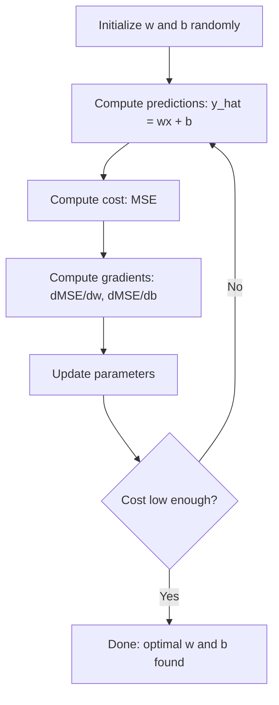

# 线性回归
# 线性回归


> 线性回归通过数据绘制出最好的直线.

> 线性回归穿越你的数据绘画出最佳直线.

**Type:** Build | **类型：** 构建
**Languages:** Python
**Prerequisites:** Phase 1 (Linear Algebra, Calculus, Optimization), Phase 2 Lesson 1 | **前置知识：** Phase 1（线性代数、微积分、优化），Phase 2 第 1 课
**Time:** ~90 minutes | **时间：** 约 90 分钟

## 学习目标

- 取代平均二次错误的梯度下降更新规则,从零开始实现线性回归
  推导平均差异的梯度下降更新规则并从零实现线性回归
- 计算复杂性和使用时间的比较
  较量梯度下降和正规方程的计算复杂性,判断何时使用各自
- 建立一个多个线性回归模型,并将学习的权重解释
  构建带特征标准化的多线性归归模型并解释学习的权重
- 解释如何通过惩罚大重量来防止Ridge回归 (L2规律化)
  解释Ridge回归 (L2) 正则化) 如何通过惩罚大权重来防止过拟合


> **【中文解读】**
> 线性回归是最简单的预测模型使用一条直线 (或超平面) 合适的数据――它也是最简单的神经网络:一个没有隐藏层的网络――没有激活函数――在线性回归/Ridge/Lasso――中学的金融中的因子模型就是线性回归――

> **【拓展：线性回归在真实 AI 系统中的角色】**
> 虽然"深度学习"更受关注,但线性回归仍然是工业界最常用的模型之一.谷歌在A/B测试分析中大量使用线性回归估计因果效应;Uber用线性回归做需求预测基线;金融领域的Fama-French三因子模型本质就是多元线性回归.在 Kaggle 竞赛中,线性回归常被作为基线,快速验证特征工程的效果.

## 问题 问题引入

你有数据:房子尺寸和售价.你想预测一个新房子的价格,考虑到它的尺寸.你可以在散布地图上看它,但你需要一个公式.你需要一个最适合数据的线条,这样你可以插入任何尺寸,得到价格预测.

> 你有数据:房屋面积和对应的售价. 你想根据新房面积预测价格. 你可以在散点图上预测,但你需要一个公式.

线性回归给你这个线条.更重要的是,它引入了整个ML训练循环:定义模型,定义成本函数,优化参数.每个ML算法都遵循这个模式.

> 线性归还为你提供了那条线. 更重要的是,它引入了整个 ML 训练循环:定义模型,定义代价函数,优化参数.每个 ML 算法都遵循相同的模式.

线性回归在生产系统中用于需求预测,A/B测试分析,金融建模以及每个回归任务的基线.

> 这不仅仅是用于简单的问题. 线性归还在生产系统中用于需求预测,A/B测试分析,金融建模以及作为每个归还任务的基线.

> **【中文解读】**
> 线性归还不仅是进入知识,而且是整个机器学习训练循环的缩写:定义模型 → 定义损失函数 → 优化参数――掌握这个最简单的例子,你就能理解从逻辑归还到神经网络的全部算法它们只是模型更复杂,损失函数不同,但训练流程完全一样――

## 概念的核心概念

### 榜样

线性回归假设输入 (x) 和输出 (y) 之间有线性关系:

> 线性回归假设输入 (x) 和输出 (y) 之间存在线性关系:

```
y = wx + b
```

- `w`(重量/倾斜):当x增加1时,y 变化量是多少
  `w`(权重/斜率):x 增加 1 时 y 变化多少
- `b`(偏差/截图):当x = 0时,y的值
  `b`(偏置/截距):当x = 0 时 y 的值

对于多个输入 (特征),这扩展到:

> 对于多个输入 (特征),扩展为:

```
y = w1*x1 + w2*x2 + ... + wn*xn + b
```

或是向量形式:`y = w^T * x + b`

> 或用向量形式表示:`y = w^T * x + b`

目标:在所有训练示例中找到w和b的值,使预测的y尽可能接近实际y.

> 目标:找到w 和b 的值,使所有训练样本中预测的 y 尽可能接近实际的 y ⋅

> **【中文解读】**
> 线性归归的模型非常直观:`y = wx + b`是斜率,权重,b是截距,偏置,多种情况下变为`y = w1*x1 + w2*x2 + ... + wn*xn + b`训练的目标是找到最优的w 和 b,使预测值与真实值的差距最小化.

### 成本函数 (平均平方错误)

如何测量"尽可能接近"?你需要一个单一的数字来捕捉你的预测是多么错误.最常见的选择是平均平方错误 (MSE):

> 你需要一个能够捕捉预测误差程度的单一数值.

```
MSE = (1/n) * sum((y_predicted - y_actual)^2)
```

为什么是二次?两个原因.第一,它惩罚大错误比小错误 (一个错误10是100倍比一个错误10x).第二,二次函数在任何地方都是平滑的,可区分的,这使得优化更容易.

> 为什么用平方?两个原因.首先,它对大错误的惩罚比小错误更重.

成本函数创造了一个表面.对于单重量w和偏差b,MSE表面看起来像一个碗 (一个凸的抛物线).碗底是MSE最小化的.训练意味着找到底部.

> 代价函数创建一个曲面──对于单个权重 w 和偏置 b,MSE 曲面看起来像一个碗抛物面──碗底部是MSE 最小的地方──训练就是找到那个底部──

### 渐进的下降

渐进下降,通过下坡步骤找到碗底部.

> 梯度下降通过下行步骤找到碗的底部.



梯度告诉你两个东西:哪个方向移动每个参数,以及多少移动.

> 梯度告诉你两个事情:每个参数应该朝哪个方向移动,以及多少移动.

对于 y_hat = wx + b 的 MSE:

> 对于MSE 且 y_hat = wx + b:

```
dMSE/dw = (2/n) * sum((y_hat - y) * x)
dMSE/db = (2/n) * sum(y_hat - y)
```

更新规则:

> 更新规则:

```
w = w - learning_rate * dMSE/dw
b = b - learning_rate * dMSE/db
```

学习速度控制步骤的尺寸.太大:你超越最小值,偏差.太小:训练需要永远.典型的起始值:0.01,0.001,或0.0001.

> 学习率控制步长――太大:你会跳过最小值并发散――太小:训练需要很长时间――典型的初始值:0.01、0.001或0.0001──

> **【中文解读】**
> 梯度下降是机器学习最核心的优化算法.它的直觉很简单:站在山坡上,朝最的下坡方向走一步,重复直到到谷底.

> **【拓展：梯度下降在现代 AI 中的演进】**
> 训练 GPT-4 使用 AdamW 优化器(Adam + 权重衰减),它是梯度下降的高级变体――学习率从0开始预热到峰值,然后余弦退火下降――训练批量大小约6000万代币,使用约25000块A100 GPU 并行――虽然优化器更复杂,但核心思想仍然是"沿梯度方向走一步"――

### 常态方程 (封闭形式解决方案)

对于线性回归,有一个直接公式,它提供了没有任何代的最佳权重:

> 专为线性回归,有一个直接公式,无需代代就能给出最优权重:

```
w = (X^T * X)^(-1) * X^T * y
```

这将一个矩阵转换为w在一个步骤中解决.它对小数据集工作很好.对于大数据集 (数百万行或数千个特征),梯度下降是最喜欢的,因为矩阵逆转是O(n^3) 在数值特征中.

> 这通过矩阵求逆步求解 w. 它对小数据集非常有效.对于大数据集 (数百万行或数千个特征),梯度下降更好,因为矩阵求逆在特征数上是O (n^3) 的.

> **【拓展：正规方程 vs 梯度下降的选择】**
> 正规方程的时间复杂性是O (n^3) (n) 是特征数量),当特征超过数万时计算极慢.深度学习模型有数十亿参数,只能使用梯度下降.

### 多个线性回归

通过多个功能,模型成为:

> 模型变为:

```
y = w1*x1 + w2*x2 + ... + wn*xn + b
```

它们的重量是多少? 它们的重量是多少?

> 一切原理都一样:MSE是价格函数,梯度下降同时更新所有权重.唯一的区别是你在一个超平面而不是一个直线中适合.

对于一个特征的范围从0到1和另一个从0到1,000,000,梯度下降将很难因为成本表面变得长.

> 缩小特征在这里很重要. 如果一个特征的范围是0到1,另一个是0到1,000,000,降级变得困难,因为价格曲面会长久.

> **【中文解读】**
> 在多元线性回归中,特征缩小至关重要.如果特征量级差异很大 (如面积500-3000与卧室数 1-5),降级损失函数曲面会严重长,导致收收缓甚至无法收收.

### 多项式回归

如果关系不是线性,则如何?

> 如果关系不是线性,你可以通过创建多个特征继续使用线性回归:

```
y = w1*x + w2*x^2 + w3*x^3 + b
```

这仍然是"线性"回归,因为模型在重量中是线性 (w1,w2,w3).

> 这仍然是"线性"回归,因为模型在权重 (w1,w2,w3) 上是线性.

高度多项式可以适应更复杂的曲线,但有过度适应的风险.10度多项式将通过10点数据集中的每个点,但对新数据预测不好.

> 高次多项式可以适应更复杂的曲线,但有过于适应风险. 一个10次多项式可以穿过10个数据集中的每个点,但在新数据上预测很差.

### 分数

根据MSE的数据,你会发现你错了多少,但这个数字取决于y的尺度.

>  MSE 告诉你错了多少,但这个数字取决于 y 的量级. R 平方 (R ^ 2) 给出了一个与量级无关的量级:

```
R^2 = 1 - (sum of squared residuals) / (sum of squared deviations from mean)
    = 1 - SS_res / SS_tot
```

- 率为1.0:完美的预测
  子的子
- 模型不比每次预测平均值更好
  模型不比每次预测平均值好
- R^2 < 0.0:模型比预测平均水平更糟
  R^2 < 0.0:模型比预测平均值还差

### 调节预览 (回)

杆回归 (L2规律化) 增加了罚款:

> 当你有很多特征时,模型可能通过赋予大权重来过拟合.

```
Cost = MSE + lambda * sum(w_i^2)
```

罚款术语不鼓励大重量.超参数lambda控制交易:较高的lambda意味着较小的重量和更大的规律化. 这将在稍后的课程中详细介绍. 现在,知道它存在和为什么它有帮助.

> 惩罚项阻止权重过大――超参数 lambda 控制权衡:lambda 越大意味着权重越小、正则化越强――这将在后续课程中深入讨论――现在只需要了解它的存在和作用――

> **【中文解读】**
> 通过在损失函数中添加权重平方和的惩罚项来防止过拟合.直觉:限制权重大小,迫使模型"保守"地使用特征,而不是靠某个特征的极端权重来适应噪音.正则化强度由 lambda 控制lambda 越大,权重越小,模型越简单.这是深度学习中最常用的技术之一.

## 建立它,实现它.
```figure
linear-regression-fit
```

## 建立它

### 步骤1:生成样本数据

```python
import random
import math

random.seed(42)  # 设置随机种子以确保结果可复现

TRUE_W = 3.0  # 真实斜率（权重）
TRUE_B = 7.0  # 真实截距（偏置）
N_SAMPLES = 100  # 样本数量

X = [random.uniform(0, 10) for _ in range(N_SAMPLES)]  # 生成 0-10 之间的随机特征值
y = [TRUE_W * x + TRUE_B + random.gauss(0, 2.0) for x in X]  # 真实关系 + 高斯噪声

print(f"Generated {N_SAMPLES} samples")
print(f"True relationship: y = {TRUE_W}x + {TRUE_B} (+ noise)")
print(f"First 5 points: {[(round(X[i], 2), round(y[i], 2)) for i in range(5)]}")
```

### 步骤2:从零开始的线性回归与梯度下降

```python
class LinearRegression:
    def __init__(self, learning_rate=0.01):
        self.w = 0.0  # 权重初始化为 0
        self.b = 0.0  # 偏置初始化为 0
        self.lr = learning_rate  # 学习率控制梯度下降步长
        self.cost_history = []  # 记录每轮的损失值

    def predict(self, X):
        return [self.w * x + self.b for x in X]  # y_hat = wx + b

    def compute_cost(self, X, y):
        predictions = self.predict(X)
        n = len(y)
        # 计算 MSE：均方误差
        cost = sum((pred - actual) ** 2 for pred, actual in zip(predictions, y)) / n
        return cost

    def compute_gradients(self, X, y):
        predictions = self.predict(X)
        n = len(y)
        # 对 w 的偏导数
        dw = (2 / n) * sum((pred - actual) * x for pred, actual, x in zip(predictions, y, X))
        # 对 b 的偏导数
        db = (2 / n) * sum(pred - actual for pred, actual in zip(predictions, y))
        return dw, db

    def fit(self, X, y, epochs=1000, print_every=200):
        for epoch in range(epochs):
            dw, db = self.compute_gradients(X, y)  # 计算梯度
            self.w -= self.lr * dw  # 沿梯度反方向更新权重
            self.b -= self.lr * db  # 沿梯度反方向更新偏置
            cost = self.compute_cost(X, y)
            self.cost_history.append(cost)
            if epoch % print_every == 0:
                print(f"  Epoch {epoch:4d} | Cost: {cost:.4f} | w: {self.w:.4f} | b: {self.b:.4f}")
        return self

    def r_squared(self, X, y):
        predictions = self.predict(X)
        y_mean = sum(y) / len(y)
        ss_res = sum((actual - pred) ** 2 for actual, pred in zip(y, predictions))  # 残差平方和
        ss_tot = sum((actual - y_mean) ** 2 for actual in y)  # 总变差
        return 1 - (ss_res / ss_tot)  # R² = 1 - SS_res/SS_tot


print("=== Training Linear Regression (Gradient Descent) ===")
model = LinearRegression(learning_rate=0.005)
model.fit(X, y, epochs=1000, print_every=200)
print(f"\nLearned: y = {model.w:.4f}x + {model.b:.4f}")
print(f"True:    y = {TRUE_W}x + {TRUE_B}")
print(f"R-squared: {model.r_squared(X, y):.4f}")
```

### 步骤3:正常方程 (封闭式解决方案)

```python
class LinearRegressionNormal:
    def __init__(self):
        self.w = 0.0  # 斜率
        self.b = 0.0  # 截距

    def fit(self, X, y):
        n = len(X)
        x_mean = sum(X) / n  # 计算 x 的均值
        y_mean = sum(y) / n  # 计算 y 的均值
        # 协方差 / 方差 = 最优斜率
        numerator = sum((X[i] - x_mean) * (y[i] - y_mean) for i in range(n))
        denominator = sum((X[i] - x_mean) ** 2 for i in range(n))
        self.w = numerator / denominator
        # 截距 = y 均值 - 斜率 * x 均值
        self.b = y_mean - self.w * x_mean
        return self

    def predict(self, X):
        return [self.w * x + self.b for x in X]

    def r_squared(self, X, y):
        predictions = self.predict(X)
        y_mean = sum(y) / len(y)
        ss_res = sum((actual - pred) ** 2 for actual, pred in zip(y, predictions))
        ss_tot = sum((actual - y_mean) ** 2 for actual in y)
        return 1 - (ss_res / ss_tot)


print("\n=== Normal Equation (Closed-Form) ===")
model_normal = LinearRegressionNormal()
model_normal.fit(X, y)
print(f"Learned: y = {model_normal.w:.4f}x + {model_normal.b:.4f}")
print(f"R-squared: {model_normal.r_squared(X, y):.4f}")
```

### 步骤4:多个线性回归

```python
class MultipleLinearRegression:
    def __init__(self, n_features, learning_rate=0.01):
        self.weights = [0.0] * n_features
        self.bias = 0.0
        self.lr = learning_rate
        self.cost_history = []

    def predict_single(self, x):
        return sum(w * xi for w, xi in zip(self.weights, x)) + self.bias

    def predict(self, X):
        return [self.predict_single(x) for x in X]

    def compute_cost(self, X, y):
        predictions = self.predict(X)
        n = len(y)
        return sum((pred - actual) ** 2 for pred, actual in zip(predictions, y)) / n

    def fit(self, X, y, epochs=1000, print_every=200):
        n = len(y)
        n_features = len(X[0])
        for epoch in range(epochs):
            predictions = self.predict(X)
            errors = [pred - actual for pred, actual in zip(predictions, y)]
            for j in range(n_features):
                grad = (2 / n) * sum(errors[i] * X[i][j] for i in range(n))
                self.weights[j] -= self.lr * grad
            grad_b = (2 / n) * sum(errors)
            self.bias -= self.lr * grad_b
            cost = self.compute_cost(X, y)
            self.cost_history.append(cost)
            if epoch % print_every == 0:
                print(f"  Epoch {epoch:4d} | Cost: {cost:.4f}")
        return self

    def r_squared(self, X, y):
        predictions = self.predict(X)
        y_mean = sum(y) / len(y)
        ss_res = sum((actual - pred) ** 2 for actual, pred in zip(y, predictions))
        ss_tot = sum((actual - y_mean) ** 2 for actual in y)
        return 1 - (ss_res / ss_tot)


random.seed(42)
N = 100
X_multi = []
y_multi = []
for _ in range(N):
    size = random.uniform(500, 3000)
    bedrooms = random.randint(1, 5)
    age = random.uniform(0, 50)
    price = 50 * size + 10000 * bedrooms - 1000 * age + 50000 + random.gauss(0, 20000)
    X_multi.append([size, bedrooms, age])
    y_multi.append(price)


def standardize(X):
    n_features = len(X[0])
    means = [sum(X[i][j] for i in range(len(X))) / len(X) for j in range(n_features)]
    stds = []
    for j in range(n_features):
        variance = sum((X[i][j] - means[j]) ** 2 for i in range(len(X))) / len(X)
        stds.append(variance ** 0.5)
    X_scaled = []
    for i in range(len(X)):
        row = [(X[i][j] - means[j]) / stds[j] if stds[j] > 0 else 0 for j in range(n_features)]
        X_scaled.append(row)
    return X_scaled, means, stds


y_mean_val = sum(y_multi) / len(y_multi)
y_std_val = (sum((yi - y_mean_val) ** 2 for yi in y_multi) / len(y_multi)) ** 0.5
y_scaled = [(yi - y_mean_val) / y_std_val for yi in y_multi]

X_scaled, x_means, x_stds = standardize(X_multi)

print("\n=== Multiple Linear Regression (3 features) ===")
print("Features: house size, bedrooms, age")
multi_model = MultipleLinearRegression(n_features=3, learning_rate=0.01)
multi_model.fit(X_scaled, y_scaled, epochs=1000, print_every=200)

print(f"\nWeights (standardized): {[round(w, 4) for w in multi_model.weights]}")
print(f"Bias (standardized): {multi_model.bias:.4f}")
print(f"R-squared: {multi_model.r_squared(X_scaled, y_scaled):.4f}")
```

### 步骤5:多项式回归

```python
class PolynomialRegression:
    def __init__(self, degree, learning_rate=0.01):
        self.degree = degree
        self.weights = [0.0] * degree
        self.bias = 0.0
        self.lr = learning_rate

    def make_features(self, X):
        return [[x ** (d + 1) for d in range(self.degree)] for x in X]

    def predict(self, X):
        features = self.make_features(X)
        return [sum(w * f for w, f in zip(self.weights, row)) + self.bias for row in features]

    def fit(self, X, y, epochs=1000, print_every=200):
        features = self.make_features(X)
        n = len(y)
        for epoch in range(epochs):
            predictions = [sum(w * f for w, f in zip(self.weights, row)) + self.bias for row in features]
            errors = [pred - actual for pred, actual in zip(predictions, y)]
            for j in range(self.degree):
                grad = (2 / n) * sum(errors[i] * features[i][j] for i in range(n))
                self.weights[j] -= self.lr * grad
            grad_b = (2 / n) * sum(errors)
            self.bias -= self.lr * grad_b
            if epoch % print_every == 0:
                cost = sum(e ** 2 for e in errors) / n
                print(f"  Epoch {epoch:4d} | Cost: {cost:.6f}")
        return self

    def r_squared(self, X, y):
        predictions = self.predict(X)
        y_mean = sum(y) / len(y)
        ss_res = sum((actual - pred) ** 2 for actual, pred in zip(y, predictions))
        ss_tot = sum((actual - y_mean) ** 2 for actual in y)
        return 1 - (ss_res / ss_tot)


random.seed(42)
X_poly = [x / 10.0 for x in range(0, 50)]
y_poly = [0.5 * x ** 2 - 2 * x + 3 + random.gauss(0, 1.0) for x in X_poly]

x_max = max(abs(x) for x in X_poly)
X_poly_norm = [x / x_max for x in X_poly]
y_poly_mean = sum(y_poly) / len(y_poly)
y_poly_std = (sum((yi - y_poly_mean) ** 2 for yi in y_poly) / len(y_poly)) ** 0.5
y_poly_norm = [(yi - y_poly_mean) / y_poly_std for yi in y_poly]

print("\n=== Polynomial Regression (degree 2 vs degree 5) ===")
print("True relationship: y = 0.5x^2 - 2x + 3")

print("\nDegree 2:")
poly2 = PolynomialRegression(degree=2, learning_rate=0.1)
poly2.fit(X_poly_norm, y_poly_norm, epochs=2000, print_every=500)
print(f"  R-squared: {poly2.r_squared(X_poly_norm, y_poly_norm):.4f}")

print("\nDegree 5:")
poly5 = PolynomialRegression(degree=5, learning_rate=0.1)
poly5.fit(X_poly_norm, y_poly_norm, epochs=2000, print_every=500)
print(f"  R-squared: {poly5.r_squared(X_poly_norm, y_poly_norm):.4f}")

print("\nDegree 2 fits the true curve well. Degree 5 fits training data slightly better")
print("but risks overfitting on new data.")
```

### 步骤 6:坡回归 (L2规律化)

```python
class RidgeRegression:
    def __init__(self, n_features, learning_rate=0.01, alpha=1.0):
        self.weights = [0.0] * n_features
        self.bias = 0.0
        self.lr = learning_rate
        self.alpha = alpha

    def predict_single(self, x):
        return sum(w * xi for w, xi in zip(self.weights, x)) + self.bias

    def predict(self, X):
        return [self.predict_single(x) for x in X]

    def fit(self, X, y, epochs=1000, print_every=200):
        n = len(y)
        n_features = len(X[0])
        for epoch in range(epochs):
            predictions = self.predict(X)
            errors = [pred - actual for pred, actual in zip(predictions, y)]
            mse = sum(e ** 2 for e in errors) / n
            reg_term = self.alpha * sum(w ** 2 for w in self.weights)
            cost = mse + reg_term
            for j in range(n_features):
                grad = (2 / n) * sum(errors[i] * X[i][j] for i in range(n))
                grad += 2 * self.alpha * self.weights[j]
                self.weights[j] -= self.lr * grad
            grad_b = (2 / n) * sum(errors)
            self.bias -= self.lr * grad_b
            if epoch % print_every == 0:
                print(f"  Epoch {epoch:4d} | Cost: {cost:.4f} | L2 penalty: {reg_term:.4f}")
        return self


print("\n=== Ridge Regression (L2 Regularization) ===")
print("Same data as multiple regression, with alpha=0.1")
ridge = RidgeRegression(n_features=3, learning_rate=0.01, alpha=0.1)
ridge.fit(X_scaled, y_scaled, epochs=1000, print_every=200)
print(f"\nRidge weights: {[round(w, 4) for w in ridge.weights]}")
print(f"Plain weights: {[round(w, 4) for w in multi_model.weights]}")
print("Ridge weights are smaller (shrunk toward zero) due to the L2 penalty.")
```

## 用它实现框架

现在,同样的事情是用 scikit-learn,

> 现在,你在生产中实际使用的工具,

```python
from sklearn.linear_model import LinearRegression as SklearnLR
from sklearn.linear_model import Ridge
from sklearn.preprocessing import PolynomialFeatures, StandardScaler
from sklearn.model_selection import train_test_split
from sklearn.metrics import mean_squared_error, r2_score
import numpy as np

# 生成与从零实现相同的数据
np.random.seed(42)
X_sk = np.random.uniform(0, 10, (100, 1))
y_sk = 3.0 * X_sk.squeeze() + 7.0 + np.random.normal(0, 2.0, 100)

# 划分训练集和测试集（80/20）
X_train, X_test, y_train, y_test = train_test_split(X_sk, y_sk, test_size=0.2, random_state=42)

# 线性回归
lr = SklearnLR()
lr.fit(X_train, y_train)
y_pred = lr.predict(X_test)

print("=== Scikit-learn Linear Regression ===")
print(f"Coefficient (w): {lr.coef_[0]:.4f}")
print(f"Intercept (b): {lr.intercept_:.4f}")
print(f"R-squared (test): {r2_score(y_test, y_pred):.4f}")
print(f"MSE (test): {mean_squared_error(y_test, y_pred):.4f}")

# 多项式回归（degree=2）
poly = PolynomialFeatures(degree=2, include_bias=False)
X_poly_sk = poly.fit_transform(X_train)  # 生成 x, x² 特征
X_poly_test = poly.transform(X_test)

lr_poly = SklearnLR()
lr_poly.fit(X_poly_sk, y_train)
print(f"\nPolynomial degree 2 R-squared: {r2_score(y_test, lr_poly.predict(X_poly_test)):.4f}")

# 标准化后使用 Ridge 回归
scaler = StandardScaler()
X_train_scaled = scaler.fit_transform(X_train)  # 在训练集上拟合并转换
X_test_scaled = scaler.transform(X_test)  # 在测试集上只转换

ridge = Ridge(alpha=1.0)  # alpha 即正则化强度 lambda
ridge.fit(X_train_scaled, y_train)
print(f"Ridge R-squared: {r2_score(y_test, ridge.predict(X_test_scaled)):.4f}")
print(f"Ridge coefficient: {ridge.coef_[0]:.4f}")
```

您从零开始的实现和 scikit-learn 产生相同的结果.区别是: scikit-learn 处理边缘案例,数值稳定性和性能优化.使用图书馆进行制作.使用从零开始的版本来了解发生的事情.

> 区别在于: 微学习处理边界情况, 数值稳定性和性能优化, 在生产中使用库, 从零版本来理解原理.

## 运送它.

这一课产生了:
- `outputs/skill-regression.md`- 根据问题选择正确的回归方法的能力

> 本课产出:
> - `outputs/skill-regression.md`- 一个根据问题选择正确回归方法的技能

## 练习题

1. 运用批次梯度下降,股票梯度下降 (SGD) 和小型批次梯度下降.在同一数据集上比较缩速度.哪个趋于最快?哪个具有最平滑的成本曲线?
   1. 实现批量梯度下降,随机梯度下降和小批量梯度下降.
2. 从立方函数生成数据 (y = ax^3 + bx^2 + cx + d + 噪音). 1,3和10级的合适多项数.比较训练R^2和测试R^2.在何种程度上过度合适变得明显?
   2. 从三次函数 (y = ax^3 + bx^2 + cx + d + 噪音) 生成数据──拟合1、3 和 10次多项式──比较训练 R^2 和测试 R^2──几次多项式时过拟合变得明显吗?
3. 运行拉索回归 (L1规律化:罚款阿尔法 *(上不_w_i 否)). 训练多个特征的住房数据.比较哪些重量达到零与.为什么L1产生稀疏的解决方案而L2没有?
   3. 实现拉索回归(L1 正则化:罚款 * 总额 * 由于: 由于: 由于: 由于: 由于: 由于: 由于: 由于: 由于: 由于: 由于: 由于: 由于: 由于: 由于: 由于: 由于: 由于: 由于: 由于: 由于: 由于: 由于: 由于: 由于: 由于: 由于: 由于: 由于: 由于: 由于: 由于: 由于: 由于: 由于: 由于: 由于: 由于: 由于: 由于: 由于: 由于: 由于: 由于: 由于: 由于: 由于: 由于: 由于: 由于: 由于: 由于: 由于: 由于: 由于: 由于: 由于: 由于: 由于: 由于: 由于: 由于: 由于: 由于: 由于: 由于: 由于: 由于: 由于: 由于: 由于: 由于: 由于: 由于: 由于: 由于: 由于: 由于: 由于: 由于: 由于: 由于: 由于: 由于: 由于: 由于: 由于: 由于: 由于: 由于: 由于: 由于: 由于: 由于: 由于: 由于: 由于: 由于: 由于: 由于: 由于: 由于: 由于: 由于: 由于: 由于: 由于: 由于: 由于: 由于: 由于: 由于: 由于: 由于: 由于: 由于: 由于: 由于: 由于: 由于: 由于: 由于: 由于: 由于: 由于: 由于: 由于: 由于: 由于: 由于: 由于: 由于: 由于: 由于: 由于: 由于: 由于: 由于: 由于: 由于: 由于: 由于: 由于: 由于: 由于: 由于: 由于: 由于: 由于: 由于: 由于: 由于: 由于: 由于: 由于: 由于: 由于: 由于: 由于: 由于: 由于: 由于: 由于: 

## 关键词 快速查找表

| Term | What people say | What it actually means |
|------|----------------|----------------------|
| Linear regression | "Draw a line through data" | Find weight w and bias b that minimize the sum of squared differences between wx+b and actual y values |
| Cost function | "How bad the model is" | A function that maps model parameters to a single number measuring prediction error, which optimization minimizes |
| Mean squared error | "Average of squared errors" | (1/n) * sum of (predicted - actual)^2, penalizing large errors disproportionately |
| Gradient descent | "Walk downhill" | Iteratively adjust parameters in the direction that reduces the cost function, using partial derivatives |
| Learning rate | "Step size" | A scalar that controls how much parameters change per gradient descent step |
| Normal equation | "Solve it directly" | The closed-form solution w = (X^T X)^-1 X^T y that gives optimal weights without iteration |
| R-squared | "How good the fit is" | The fraction of variance in y explained by the model, ranging from negative infinity to 1.0 |
| Feature scaling | "Make features comparable" | Transforming features to similar ranges (e.g., zero mean, unit variance) so gradient descent converges faster |
| Regularization | "Penalize complexity" | Adding a term to the cost function that shrinks weights, preventing overfitting |
| Ridge regression | "L2 regularization" | Linear regression with a penalty of lambda * sum(w_i^2) added to MSE |
| Polynomial regression | "Fitting curves with linear math" | Linear regression on polynomial features (x, x^2, x^3, ...), still linear in the weights |
| Overfitting | "Memorizing training data" | Using a model so complex that it fits noise in training data and fails on new data |

## 继续阅读 继续阅读

- [An Introduction to Statistical Learning (ISLR)](https://www.statlearning.com/)--免费的PDF,第三章和第六章涵盖线性回归和规律化,
  [An Introduction to Statistical Learning (ISLR)](https://www.statlearning.com/)免费教材,第3章和第6章实用实例,包括线性归归和正规化
- [The Elements of Statistical Learning (ESL)](https://hastie.su.domains/ElemStatLearn/)--免费的PDF,更具数学性,更深度处理的ISLR的伴侣
  [The Elements of Statistical Learning (ESL)](https://hastie.su.domains/ElemStatLearn/)免费教材,ISLR的数学版,对山脊和拉索有更深入的处理
- [Stanford CS229 Lecture Notes on Linear Regression](https://cs229.stanford.edu/main_notes.pdf)-- 亚德鲁·恩格的笔记从第一原则中提取了正常方程和梯度下降
  [Stanford CS229 Lecture Notes on Linear Regression](https://cs229.stanford.edu/main_notes.pdf)-- 亚德鲁·恩格的记忆从第一性原理推导正规方程和梯度下降
- [scikit-learn LinearRegression documentation](https://scikit-learn.org/stable/modules/linear_model.html)-- 线性回归,,拉索和ElasticNet的实用参考,包括代码示例
  [scikit-learn LinearRegression documentation](https://scikit-learn.org/stable/modules/linear_model.html)--线性回归、Ridge、Lasso 和ElasticNet的实用参考及代码示例
