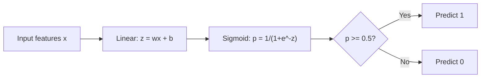
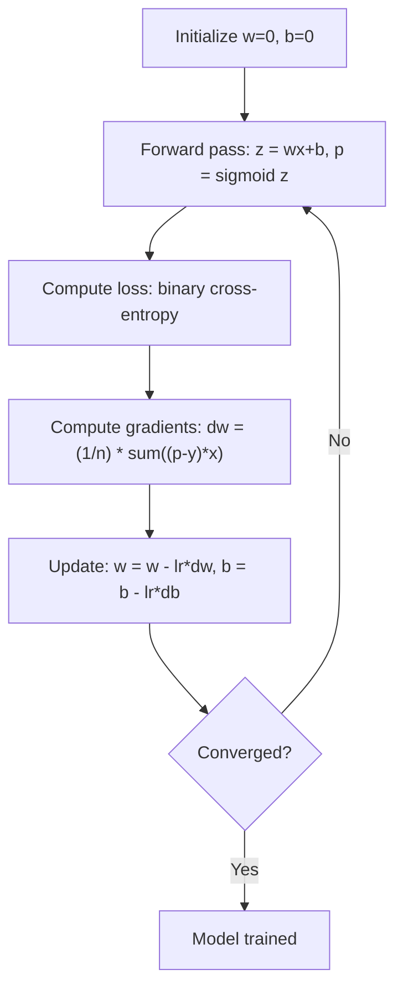

# 后勤回归
# 逻辑回归


> 逻辑回归将直线曲线成S曲线,以回答与概率的"是"或"没有"问题.

> 逻辑回归将直线成S形曲线,用概率回答是非问题──

**Type:** Build | **类型：** 构建
**Languages:** Python
**Prerequisites:** Phase 2 Lesson 1-2 (What Is ML, Linear Regression) | **前置知识：** Phase 2 第 1-2 课（什么是机器学习、线性回归）
**Time:** ~90 minutes | **时间：** 约 90 分钟

## 学习目标

- 通过使用sigmoid函数和二进制交叉缩损失从零开始实现物流回归
  从零实现逻辑回归,掌握Sigmoid 函数和二元交叉损失
- 计算和解释精度,回忆,F1分数和二进制分类的混矩阵
  计算并解释精确率 (精确率) 召回率 (召回率)  F1 分数和混矩阵
- 解释为什么MSE未能进行分类,以及为什么二进制交叉能产生曲的成本表面
  解释为什么平均方差 (MSE) 不适用于分类任务,以及为什么二元交叉能产生凸变的价格曲面
- 建立多类分类的软max回归模型,并评估值调整权衡
  构建软max 回归模型进行多类,并评估值调优的权衡


> **【中文解读】**
> 逻辑归归是二分类的基石使用Sigmoid 函数将线性输出映射到 [0,1] 的概率──虽然被称为归归,但它是分类器──在学习中的物流回归──信用卡欺诈检查、疾病诊断都可用逻辑归归──

> **【拓展：逻辑回归在工业界的广泛应用】**
> 早期的Facebook广告点击率预测系统基于逻辑回归 (CCR) 配合GBMT特征工程;谷歌搜索广告的CTR 预估也长期使用逻辑回归 (CCR) 后升级为深度学习 (CCR) ;;在医疗领域,逻辑回归用于预测疾病风险 (CCR) ;;如心脏病,糖尿病),优势在于输出概率可直接解释;;在NLP中,逻辑回归是文分类的经典基线;;

## 问题 问题引入

根据其大小,你想预测瘤是否恶性或良性.你试图线性回归.它输出0.3或1.7或0.5等数字.这些数字意味着什么?1.7是"非常恶性"吗?0.5是"非常良性"吗?线性回归输出无限数量.分类需要0到1之间的有限概率,并明确决定:是否.

> 你想根据瘤大小预测它是恶性还是良性. 你试图使用线性回归. 它输出0.3或1.7或0.5这样的数字. 这些数字意味着什么?1.7是"非常恶性"?-0.5是"非常良性"?线性回归输出无限数字. 分类需要0到1之间的有界率,以及一个明确的决定:是或否.

逻辑回归解决了这个问题.它采用相同的线性组合 (wx + b) 并通过sigmoid函数,将任何数量压缩到范围 (0, 1).输出是概率.你设定一个门 (通常是0.5) 并做出决定.

> 逻辑归归解决了这个问题――它取同样的线性组合 (wx + b),通过西格莫ид函数将任意数字缩小到 (0, 1) 范围内――输出是一个概率――你设定一个值(通常是0.5) 做出决策――

尽管其名称,物流回归是一种分类算法,而不是回归算法.这个名称来自它使用的物流 (sigmoid) 函数.

> 这是实践中最广泛使用的算法之一.尽管名字里有"归归",逻辑归归是分类算法,不是归归算法.

> **【中文解读】**
> 线性归还不能直接用于分类:其输出是无限的实数(-∞到 +∞),而分类需要0-1 之间的概率。逻辑归还通过Sigmoid 函数将线性输出"挤压"到 (0,1) 区间,从而输出概率。设值(通常0.5) 即可做出二分类决策──Sigmoid 的导数形式简洁:σ'(z) = σ(z) ),使梯度计算高效──

## 概念的核心概念

### 为什么线性回归不能分类

设想根据学习时间预测通过/失败 (1/0) 线性回归通过数据符合一个线:

> 想象根据学习时间预测通过/不通过(1/0) ――线性回归拟合一根直线穿过数据:

```
hours:  1   2   3   4   5   6   7   8   9   10
actual: 0   0   0   0   1   1   1   1   1   1
```

线性合适可能会产生 -0.2在1小时和1.3在10小时等预测.这些值不是概率.它们低于0和以上 1.更糟糕的是,一个单个异常值 (有人研究了50小时) 将拖着整个线,改变预测对每个人都有.

> 线性拟合可能在1小时内产生 -0.2的预测,在10小时内产生 1.3的预测. 这些值不是概率.它们低于0或超过1. 更糟糕的是,单个异常值 (学习了50小时的人) 将拖动整个条线,改变所有者的预测.

类别需要一个函数:
- 输出值在0到1之间 (概率)
  输出 0 到 1 之间的值 (概率)
- 创造一个急剧的转型 (决定的边界)
  创建急剧过渡 (决策边界)
- 没有被远离边界的异常值扭曲
  不被远离边界的异常值扭曲

> 分类需要一个函数,它:

### 赛格莫ид功能

状函数的作用是这样的:

> sigmoid 函数恰好做到了这一点:

```
sigmoid(z) = 1 / (1 + e^(-z))
```

性能:
- 当z是大且正的时,sigmoid(z) 接近1
  当z 是大正数时,sigmoid(z) 趋近1
- 当z是大且负的时,sigmoid(z) 接近0
  当z 是大负数时,sigmoid(z) 趋近0
- 当z=0时,sigmoid(z) =0.5时
  当 z = 0 时,sigmoid(z) = 0.5
- 输出总是0到1之间
  输出始终在0和1之间
- 功能在任何地方都很平滑,可区分
  函数处处平滑可微

衍生物具有方便的形式:sigmoid'(z) =sigmoid(z) * (1 - sigmoid(z)). 这使得梯度计算效率高.

> 导数有一个便捷的形式:sigmoid'(z) =sigmoid(z) * (1 - sigmoid(z))。这使得梯度计算非常高效──

### 后勤回归 =线性模型 + 形

模型计算z = wx + b (与线性回归相同),然后应用sigmoid:

> 模型计算 z = wx + b(与线性归归相同),然后应用Sigmoid:



输出 p 解释为 P ((y=1 个 x),输入属于类1 的概率. 决策边界是wx + b = 0,这使得sigmoid输出完全是0.5.

> 输出 p 被解释为 P  ((y=1 个 x),即输入属于类 1 的概率──决策边界在 wx + b = 0 处,此时Sigmoid 输出恰好为 0.5──

### 双边交叉缩损失

对于物流回归,不能使用MSE.使用sigmoid的MSE创建了一个不曲的成本表面,具有许多本地最小值.

> 你不能对逻辑回归使用MSE──MSE 配合Sigmoid 会创建一个非凸的代价曲面,存在许多局部最小值──应该使用二元交叉(日志损失):

```
Loss = -(1/n) * sum(y * log(p) + (1-y) * log(1-p))
```

为什么这能有效:
- 当 y=1 和 p 接近 1: log(1) = 0,所以损失接近 0 (正确,低成本)
  当 y=1 且 p 接近 1 时:log(1) = 0,损失接近 0(正确,低代价)
- 当 y=1 和 p 接近 0: log(0) 接近负无限时,因此损失是巨大的 (错误,高成本)
  当 y=1 且 p 接近 0 时:log(0) 趋向负无穷,损失极大(错误,高代价)
- 当 y=0 和 p 接近 0: log(1) = 0,所以损失接近 0 (正确,成本低)
  当 y=0 且 p 接近 0 时:log(1) = 0,损失接近 0(正确,低代价)
- 当 y=0 和 p 接近 1: log(0) 接近负无限时,因此损失是巨大的 (错误,高成本)
  当 y=0 且 p 接近 1 时:log(0) 趋向负无穷,损失极大(错误,高代价)

由于这种损失函数是逻辑回归的曲,确保了单一的全球最低值.

> 这个损失函数对逻辑归归为凸函数,保证有唯一的全局最小值.

> **【中文解读】**
> 为什么分类不能使用MSE?因为MSE + Sigmoid 会产生非凸的损失函数曲面,存在很多局部最小值,梯度下降可能卡住。二元交叉(log loss) 对逻辑归归归是凸函数,保证找到全局最优解。核心原理:正确预测时损失趋近 0,错误预测且高信任时损失趋向无穷"错得越自信,惩罚越重"。

> **【拓展：交叉熵损失在深度学习中的核心地位】**
> 交叉损失不仅用于逻辑归归,它是所有分类神经网络的标记损失函数――GPT的语言模型训练本质上就是对词表做软max + 交叉损失 每一步预测下一个代币,就是一次数万类分类问题――ResNet做ImageNet 分类 ((1000类) 也使用交叉损失――理解交叉是理解深度学习训练机制的基础――

### 后勤回归的逐渐下降

双向交叉透的梯度与sigmoid具有清洁的形式:

> 交叉配合sigmoid的梯度有一个简单的形式:

```
dL/dw = (1/n) * sum((p - y) * x)
dL/db = (1/n) * sum(p - y)
```

这些看起来与线性回归梯度相同.区别是p = sigmoid(wx + b) 而不是p = wx + b.sigmoid引入非线性,但梯度更新规则保持不变.

> 这些看起来与线性归归的梯度完全相同. 区别在于p = sigmoid(wx + b) 而不是p = wx + b.

> **【中文解读】**
> 逻辑归归的梯度公式与线性归归的惊人地相似:`dL/dw = (1/n) * sum((p-y)*x)`△唯一的区别是p = sigmoid(wx+b) 而不是p = wx+b。这是因为Sigmoid 和交叉的组合在数学上"刚好"抵消了复杂项,使梯度形式非常简单――这个优美的数学性质也适用于软max +交叉──



### 决策的界限

对于2D输入 (两个特征),决策边界是:

> 对于2D输入 (两个特征),决策界限是以下直线:

```
w1*x1 + w2*x2 + b = 0
```

一边的点被分为1,另一边的点被分为0.物流回归总是产生线性决策边界.如果你需要一个曲线边界,你要么添加多项式特性,要么使用非线性模型.

> 一边的点分为1,另一边分为0――逻辑归归始终产生线性决策边界――如果需要曲的边界,你要么添加多项的特征,要么使用非线性模型――

### 多类分类与Softmax

对于k类,使用软max函数:

> 对于 k 个类,使用软max 函数:

```
softmax(z_i) = e^(z_i) / sum(e^(z_j) for all j)
```

每个类都有自己的权重向量.模型为每个类计算一个分数z_i,然后softmax将分数转换为概率,总数为1.预测的类是具有最高概率的类.

> 每个类别都有自己的权力向量.模型为每个类别计算一个分数 z_i,然后Softmax将分数转换为总和为 1 的概率.

损失函数变成了类型的交叉:

> 损失函数变为分类交叉:

```
Loss = -(1/n) * sum(sum(y_k * log(p_k)))
```

在此, y_k 为真类的1个,所有其他类型的0个 (单热编码).

> 其中一个是为1,另一个是为0

### 评估指标

对于一个数据集的95%负和5%正,一个总是预测负的模型得到了95%的准确性,但是无用的.

> 仅靠准确率是不够的.对于一个 95% 负例,5% 正例数据集,一个总是预测为负例的模型获得了 95% 准确率,但没有用处.

**Confusion Matrix**其他:

> **混淆矩阵**其他:

| | Predicted Positive | Predicted Negative |
|---|---|---|
| Actually Positive | True Positive (TP) | False Negative (FN) |
| Actually Negative | False Positive (FP) | True Negative (TN) |

| | 预测为正 | 预测为负 |
|---|---|---|
| 实际为正 | 真正例 (TP) | 假负例 (FN) |
| 实际为负 | 假正例 (FP) | 真负例 (TN) |

**Precision**预测的积极因素中,实际上有多少是积极的?
```
Precision = TP / (TP + FP)
```

> **精确率**预测为正确的样本中,有多少实际为正确?

**Recall**(敏感性):从所有实际的积极因素中,我们抓到了多少?
```
Recall = TP / (TP + FN)
```

> **召回率**(灵敏度): 在所有实际的实例中,我们找到了多少?

**F1 Score**调整两个指标.
```
F1 = 2 * (Precision * Recall) / (Precision + Recall)
```

> **F1 分数**调度和平均的精确率和召回率.

什么时候优先考虑:
- **Precision**:假阳性数据成本高昂 (垃圾邮件过器,你不想阻止合法电子邮件)
  **精确率**时假正例代价高时(垃圾邮件过,不想错误拦截正常邮件)
- **Recall**:假消极结果成本高昂 (癌症查,你不想错过瘤)
  **召回率**瘤查,不想掉瘤)
- **F1**:当你需要一个平衡的指标
  **F1**需要一个平衡的单一指标时

> 优先考虑哪个指标:

> **【中文解读】**
> 分类评估不能只看准确率. 在类别不平衡的场景下 ((如欺诈检查只有0.1%正例),全预测为负例就有99.9%的准确率,但没有价值.

> **【拓展：评估指标在真实系统中的选择】**
> 谷歌搜索垃圾页面检查优先精确率(宁可放过一些垃圾页面,也不能把正常页面误判为垃圾);医学图像AI(如谷歌健康乳腺癌检查)优先召回率(宁可多一些假阳性让医生复核,也不能错过真实的瘤);自动驾驶的行人检测规则要求精确率和召回率很高,F1是更合适的综合指标.
```figure
logistic-sigmoid
```

## 建立它

### 步骤1:Sigmoid函数和数据生成

```python
import random
import math

def sigmoid(z):
    z = max(-500, min(500, z))  # 裁剪防止数值溢出
    return 1.0 / (1.0 + math.exp(-z))  # Sigmoid 函数：将任意实数映射到 (0,1)


random.seed(42)
N = 200
X = []
y = []

# 生成类别 0 的数据：中心在 (2,2)
for _ in range(N // 2):
    X.append([random.gauss(2, 1), random.gauss(2, 1)])
    y.append(0)

# 生成类别 1 的数据：中心在 (5,5)
for _ in range(N // 2):
    X.append([random.gauss(5, 1), random.gauss(5, 1)])
    y.append(1)

combined = list(zip(X, y))
random.shuffle(combined)
X, y = zip(*combined)
X = list(X)
y = list(y)

print(f"Generated {N} samples (2 classes, 2 features)")
print(f"Class 0 center: (2, 2), Class 1 center: (5, 5)")
print(f"First 5 samples:")
for i in range(5):
    print(f"  Features: [{X[i][0]:.2f}, {X[i][1]:.2f}], Label: {y[i]}")
```

### 步骤2:从零开始的物流回归

```python
class LogisticRegression:
    def __init__(self, n_features, learning_rate=0.01):
        self.weights = [0.0] * n_features  # 权重初始化为 0
        self.bias = 0.0  # 偏置初始化为 0
        self.lr = learning_rate  # 学习率
        self.loss_history = []  # 记录训练损失

    def predict_proba(self, x):
        z = sum(w * xi for w, xi in zip(self.weights, x)) + self.bias  # 线性组合 z = wx + b
        return sigmoid(z)  # 通过 Sigmoid 得到概率

    def predict(self, x, threshold=0.5):
        return 1 if self.predict_proba(x) >= threshold else 0  # 概率 >= 阈值则预测为 1

    def compute_loss(self, X, y):
        n = len(y)
        total = 0.0
        for i in range(n):
            p = self.predict_proba(X[i])
            p = max(1e-15, min(1 - 1e-15, p))  # 裁剪防止 log(0)
            # 二元交叉熵损失
            total += y[i] * math.log(p) + (1 - y[i]) * math.log(1 - p)
        return -total / n  # 取负号得到正值损失

    def fit(self, X, y, epochs=1000, print_every=200):
        n = len(y)
        n_features = len(X[0])
        for epoch in range(epochs):
            dw = [0.0] * n_features
            db = 0.0
            for i in range(n):
                p = self.predict_proba(X[i])
                error = p - y[i]  # 预测概率 - 真实标签
                for j in range(n_features):
                    dw[j] += error * X[i][j]  # 累积权重梯度
                db += error  # 累积偏置梯度
            # 梯度下降更新参数
            for j in range(n_features):
                self.weights[j] -= self.lr * (dw[j] / n)
            self.bias -= self.lr * (db / n)
            loss = self.compute_loss(X, y)
            self.loss_history.append(loss)
            if epoch % print_every == 0:
                print(f"  Epoch {epoch:4d} | Loss: {loss:.4f} | w: [{self.weights[0]:.3f}, {self.weights[1]:.3f}] | b: {self.bias:.3f}")
        return self

    def accuracy(self, X, y):
        correct = sum(1 for i in range(len(y)) if self.predict(X[i]) == y[i])
        return correct / len(y)


split = int(0.8 * N)
X_train, X_test = X[:split], X[split:]
y_train, y_test = y[:split], y[split:]

print("\n=== Training Logistic Regression ===")
model = LogisticRegression(n_features=2, learning_rate=0.1)
model.fit(X_train, y_train, epochs=1000, print_every=200)

print(f"\nTrain accuracy: {model.accuracy(X_train, y_train):.4f}")
print(f"Test accuracy:  {model.accuracy(X_test, y_test):.4f}")
print(f"Weights: [{model.weights[0]:.4f}, {model.weights[1]:.4f}]")
print(f"Bias: {model.bias:.4f}")
```

### 步骤3:从零开始的混矩阵和指标

```python
class ClassificationMetrics:
    def __init__(self, y_true, y_pred):
        # 统计混淆矩阵四个值
        self.tp = sum(1 for t, p in zip(y_true, y_pred) if t == 1 and p == 1)  # 真正例
        self.tn = sum(1 for t, p in zip(y_true, y_pred) if t == 0 and p == 0)  # 真负例
        self.fp = sum(1 for t, p in zip(y_true, y_pred) if t == 0 and p == 1)  # 假正例
        self.fn = sum(1 for t, p in zip(y_true, y_pred) if t == 1 and p == 0)  # 假负例

    def accuracy(self):
        total = self.tp + self.tn + self.fp + self.fn
        return (self.tp + self.tn) / total if total > 0 else 0

    def precision(self):
        denom = self.tp + self.fp
        return self.tp / denom if denom > 0 else 0

    def recall(self):
        denom = self.tp + self.fn
        return self.tp / denom if denom > 0 else 0

    def f1(self):
        p = self.precision()
        r = self.recall()
        return 2 * p * r / (p + r) if (p + r) > 0 else 0

    def print_confusion_matrix(self):
        print(f"\n  Confusion Matrix:")
        print(f"                  Predicted")
        print(f"                  Pos   Neg")
        print(f"  Actual Pos     {self.tp:4d}  {self.fn:4d}")
        print(f"  Actual Neg     {self.fp:4d}  {self.tn:4d}")

    def print_report(self):
        self.print_confusion_matrix()
        print(f"\n  Accuracy:  {self.accuracy():.4f}")
        print(f"  Precision: {self.precision():.4f}")
        print(f"  Recall:    {self.recall():.4f}")
        print(f"  F1 Score:  {self.f1():.4f}")


y_pred_test = [model.predict(x) for x in X_test]
print("\n=== Classification Report (Test Set) ===")
metrics = ClassificationMetrics(y_test, y_pred_test)
metrics.print_report()
```

### 步骤4:决策边界分析

```python
print("\n=== Decision Boundary ===")
w1, w2 = model.weights
b = model.bias
print(f"Decision boundary: {w1:.4f}*x1 + {w2:.4f}*x2 + {b:.4f} = 0")
if abs(w2) > 1e-10:
    print(f"Solved for x2:     x2 = {-w1/w2:.4f}*x1 + {-b/w2:.4f}")

print("\nSample predictions near the boundary:")
test_points = [
    [3.0, 3.0],
    [3.5, 3.5],
    [4.0, 4.0],
    [2.5, 2.5],
    [5.0, 5.0],
]
for point in test_points:
    prob = model.predict_proba(point)
    pred = model.predict(point)
    print(f"  [{point[0]}, {point[1]}] -> prob={prob:.4f}, class={pred}")
```

### 步骤5:多级软max

```python
class SoftmaxRegression:
    def __init__(self, n_features, n_classes, learning_rate=0.01):
        self.n_features = n_features
        self.n_classes = n_classes
        self.lr = learning_rate
        self.weights = [[0.0] * n_features for _ in range(n_classes)]
        self.biases = [0.0] * n_classes

    def softmax(self, scores):
        max_score = max(scores)
        exp_scores = [math.exp(s - max_score) for s in scores]
        total = sum(exp_scores)
        return [e / total for e in exp_scores]

    def predict_proba(self, x):
        scores = [
            sum(self.weights[k][j] * x[j] for j in range(self.n_features)) + self.biases[k]
            for k in range(self.n_classes)
        ]
        return self.softmax(scores)

    def predict(self, x):
        probs = self.predict_proba(x)
        return probs.index(max(probs))

    def fit(self, X, y, epochs=1000, print_every=200):
        n = len(y)
        for epoch in range(epochs):
            grad_w = [[0.0] * self.n_features for _ in range(self.n_classes)]
            grad_b = [0.0] * self.n_classes
            total_loss = 0.0
            for i in range(n):
                probs = self.predict_proba(X[i])
                for k in range(self.n_classes):
                    target = 1.0 if y[i] == k else 0.0
                    error = probs[k] - target
                    for j in range(self.n_features):
                        grad_w[k][j] += error * X[i][j]
                    grad_b[k] += error
                true_prob = max(probs[y[i]], 1e-15)
                total_loss -= math.log(true_prob)
            for k in range(self.n_classes):
                for j in range(self.n_features):
                    self.weights[k][j] -= self.lr * (grad_w[k][j] / n)
                self.biases[k] -= self.lr * (grad_b[k] / n)
            if epoch % print_every == 0:
                print(f"  Epoch {epoch:4d} | Loss: {total_loss / n:.4f}")
        return self

    def accuracy(self, X, y):
        correct = sum(1 for i in range(len(y)) if self.predict(X[i]) == y[i])
        return correct / len(y)


random.seed(42)
X_3class = []
y_3class = []

centers = [(1, 1), (5, 1), (3, 5)]
for label, (cx, cy) in enumerate(centers):
    for _ in range(50):
        X_3class.append([random.gauss(cx, 0.8), random.gauss(cy, 0.8)])
        y_3class.append(label)

combined = list(zip(X_3class, y_3class))
random.shuffle(combined)
X_3class, y_3class = zip(*combined)
X_3class = list(X_3class)
y_3class = list(y_3class)

split_3 = int(0.8 * len(X_3class))
X_train_3 = X_3class[:split_3]
y_train_3 = y_3class[:split_3]
X_test_3 = X_3class[split_3:]
y_test_3 = y_3class[split_3:]

print("\n=== Multi-class Softmax Regression (3 classes) ===")
softmax_model = SoftmaxRegression(n_features=2, n_classes=3, learning_rate=0.1)
softmax_model.fit(X_train_3, y_train_3, epochs=1000, print_every=200)
print(f"\nTrain accuracy: {softmax_model.accuracy(X_train_3, y_train_3):.4f}")
print(f"Test accuracy:  {softmax_model.accuracy(X_test_3, y_test_3):.4f}")

print("\nSample predictions:")
for i in range(5):
    probs = softmax_model.predict_proba(X_test_3[i])
    pred = softmax_model.predict(X_test_3[i])
    print(f"  True: {y_test_3[i]}, Predicted: {pred}, Probs: [{', '.join(f'{p:.3f}' for p in probs)}]")
```

### 步骤 6: 调整门

```python
print("\n=== Threshold Tuning ===")
print("Default threshold: 0.5. Adjusting the threshold trades precision for recall.\n")

thresholds = [0.3, 0.4, 0.5, 0.6, 0.7]
print(f"{'Threshold':>10} {'Accuracy':>10} {'Precision':>10} {'Recall':>10} {'F1':>10}")
print("-" * 52)

for t in thresholds:
    y_pred_t = [1 if model.predict_proba(x) >= t else 0 for x in X_test]
    m = ClassificationMetrics(y_test, y_pred_t)
    print(f"{t:>10.1f} {m.accuracy():>10.4f} {m.precision():>10.4f} {m.recall():>10.4f} {m.f1():>10.4f}")
```

## 用它实现框架

现在,与子学习同样.

> 现在用小小学习实现同样的功能.

```python
from sklearn.linear_model import LogisticRegression as SklearnLR
from sklearn.metrics import accuracy_score, precision_score, recall_score, f1_score
from sklearn.metrics import confusion_matrix, classification_report
from sklearn.model_selection import train_test_split
from sklearn.preprocessing import StandardScaler
import numpy as np

np.random.seed(42)
X_0 = np.random.randn(100, 2) + [2, 2]
X_1 = np.random.randn(100, 2) + [5, 5]
X_sk = np.vstack([X_0, X_1])
y_sk = np.array([0] * 100 + [1] * 100)

X_tr, X_te, y_tr, y_te = train_test_split(X_sk, y_sk, test_size=0.2, random_state=42)

scaler = StandardScaler()
X_tr_sc = scaler.fit_transform(X_tr)
X_te_sc = scaler.transform(X_te)

lr = SklearnLR()
lr.fit(X_tr_sc, y_tr)
y_pred = lr.predict(X_te_sc)

print("=== Scikit-learn Logistic Regression ===")
print(f"Accuracy:  {accuracy_score(y_te, y_pred):.4f}")
print(f"Precision: {precision_score(y_te, y_pred):.4f}")
print(f"Recall:    {recall_score(y_te, y_pred):.4f}")
print(f"F1:        {f1_score(y_te, y_pred):.4f}")
print(f"\nConfusion Matrix:\n{confusion_matrix(y_te, y_pred)}")
print(f"\nClassification Report:\n{classification_report(y_te, y_pred)}")
```

您从零开始实现的决策界限和指标相同. Scikit-learn 添加解决方案 (liblinear, lbfgs, saga),自动规范化,多类策略 (one vs rest, multomial),以及数值稳定优化.

> 你从零实现产生相同的决策边界和标志――小学学习 添加求解器选项――图书线性、lbfgs、saga) 、自动正则化、可能类策略――一对多,多项式) 和数值稳定性优化――

## 运送它.

这一课产生了:
- `code/logistic_regression.py`- 从零开始的物流回归,使用指标

> 本课产出:
> - `code/logistic_regression.py`- 从零实现的逻辑回归及评估指标

## 练习题

1. 生成一个线性不可分离的数据集 (例如,两个集中圆).训练物流回归并观察其失败.然后添加多项函数 (x1^2, x2^2, x1*x2) 并再次训练. 显示精度提高.
   1. 成为一个**非**线性可分的数据集 (例如两个同心圆) ⋅训练逻辑回归并观察其失败――然后添加多项式特征(x1^2,x2^2,x1*x2) 重新训练――展示准确率的提升――
2. 实现3级软max模型的多类混矩阵.计算每个类的精度和回忆.哪个类是最难分类的?
   2. 为3类软max 模型实现多类混矩阵――计算每个类的精确率和召回率――哪个类最难分类?
3. 建立一个ROC曲线从零开始.为100个从0到1的门值计算真正率和虚假正率.使用拖式规则计算AUC (曲线下面的区域).
   3. 从零构建ROC曲线――对0到1之间的100个值,计算真实例率和假正例率――使用梯形法则计算AUC(曲线下面积)

## 关键词 快速查找表

| Term | What people say | What it actually means |
|------|----------------|----------------------|
| Logistic regression | "Regression for classification" | A linear model followed by a sigmoid function that outputs class probabilities |
| Sigmoid function | "The S-curve" | The function 1/(1+e^(-z)) that maps any real number to the range (0, 1) |
| Binary cross-entropy | "Log loss" | The loss function -[y*log(p) + (1-y)*log(1-p)] that penalizes confident wrong predictions severely |
| Decision boundary | "The dividing line" | The surface where the model's output probability equals 0.5, separating predicted classes |
| Softmax | "Multi-class sigmoid" | A function that converts a vector of scores into probabilities that sum to 1 |
| Precision | "How many selected are relevant" | TP / (TP + FP), the fraction of positive predictions that are actually positive |
| Recall | "How many relevant are selected" | TP / (TP + FN), the fraction of actual positives that the model correctly identifies |
| F1 score | "Balanced accuracy" | The harmonic mean of precision and recall: 2*P*R / (P+R) |
| Confusion matrix | "The error breakdown" | A table showing TP, TN, FP, FN counts for each class pair |
| Threshold | "The cutoff" | The probability value above which the model predicts class 1 (default 0.5, tunable) |
| One-hot encoding | "Binary columns for categories" | Representing class k as a vector of zeros with a 1 at position k |
| Categorical cross-entropy | "Multi-class log loss" | The extension of binary cross-entropy to k classes using one-hot encoded labels |
