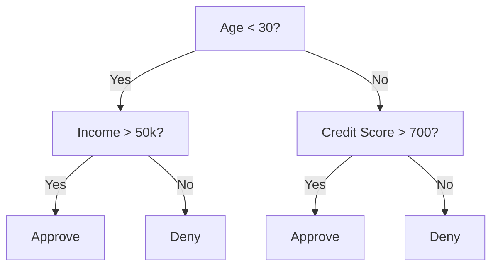
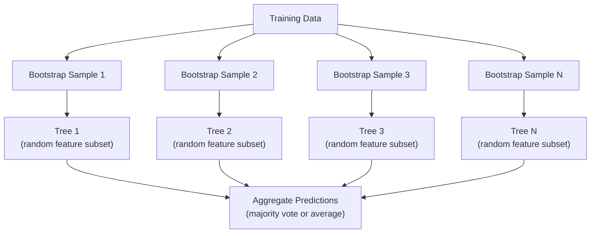

# 决策树木和随机森林
# 决策树与随机森林


> 决策树只是一个流程图,但森林是 ML 中最强大的工具之一.

> 一棵决策树就是一张流程图片.

**Type:** Build | **类型：** 构建
**Language:**子**语言：**字符串
**Prerequisites:** Phase 1 (Lessons 09 Information Theory, 06 Probability) | **前置知识：** Phase 1（第 9 课信息论、第 6 课概率论）
**Time:** ~90 minutes | **时间：** 约 90 分钟

## 学习目标

- 实现基尼杂质,缩和信息获取计算,以找到最佳的决策树分区
  实现基因不纯度和信息增益计算,找到最好的决策树分点
- 建立一个从零开始的决策树分类器,使用切割前控制 (最大深度,最小样本)
  从零构建带有预剪分分类器
- 使用启动线抽样和特征随机化构建随机森林,并解释为什么它减少差异性
  使用Bootstrap 采样和特征随机化构建随机森林,并解释为什么它可以降低方差
- 比较MDI特征的重要性与变量重要性,并确定MDI偏见何时
  较量MDI特征的重要性和更换的重要性,识别MDI的偏差问题


> **【中文解读】**
> 决策树通过如果-else 规则分数据,随机森林是多个决策树的投票组合之一.

> **【拓展：树模型在 Kaggle 和工业界的主导地位】**
> 在 Kaggle 结构化数据竞赛中,大约70%的获胜方案使用梯度提升树 (XGBoost/LightGBM/CatBoost) ⋅在金融领域,信用评分 FICO 分数) 广泛使用决策树变体;银行反欺诈系统常用随机森林作为基线;在医疗诊断中,随机森林用于预测再入院风险.

## 问题 问题引入

您有表格数据.行列是样本,列是特征,您想预测的目标列.您可以将神经网络扔进它.但对于表格数据,基于树的模型 (决策树,随机森林,梯度增强树) 始终超过深度学习.结构数据上的Kaggle竞赛由XGBoost和LightGBM主导,而不是转换器.

> 你有表格数据. 行是样本,列是特征,还有一个你想预测的目标列.你可以用神经网络来处理.

为什么?树木处理混合特征类型 (数量和类型) 没有预处理.它们处理无线性关系,没有特征工程.它们可以解释:你可以看树木并看到为什么确切地做出预测.随机森林,平均有很多树木,非常耐适合中等规模的数据集.

> 为什么?树模型无需预处理就能处理混合特征类型(数值和类型) 无需特征工程就能处理非线性关系――它们可以解释:你可以查看树并确切了解为什么做出预测――随着森林通过平均许多树,对中型数据集的过拟合具有很强的抵抗力――

通过使用复发分离,这个课程从零开始构建决策树,然后在顶部构建一个随机的森林.你将实现分离标准 (基尼杂质,透,获取信息) 背后的数学,并了解为什么一个弱的学习者集团成为一个强大的.

> 本课程从零使用回归分裂构建决策树,然后在上面构建随机森林――你将实现分裂标准背后的数学 (Gini 不纯度、、信息增益),并理解为什么一组弱的学习器可以变成强学习器――

> **【中文解读】**
> 对于表格类型数据 (行是样本,列是特征),树模型通常优于深度学习.原因:树模型原生支持混合类型特征.

## 概念的核心概念

### 决策树的作用

决策树通过问答答/否问题进行序列,将特征空间分为矩形区域.

> 决策树通过一系列非问题将特征空间分为矩形区域.



每个内部节点都会测试一个特征,对一个门进行测试. 每个叶节点都会做一个预测.

> 每个内部节点将进行一个特征与值比较. 每个叶节点做出预测.

树由顶部下构建,在每个节点上选择最好分离数据的特征和门. "最好"是通过分类标准定义的.

> 树自顶向下构建,在每个节点选择最能分离数据的特征和值.

### 分类标准:测量杂质

我们想把它们分为尽可能"纯净"的子节点,这意味着每个子都包含一个类.

> 在每个节点,我们有一个样本组. 我们想把它们分开,使每个节点尽可能"纯净",即每个节点主要包含一个类.

**Gini impurity**测量随机选择的样本如果根据该节点的类分布标记,将被错误分类的概率.

> **Gini 不纯度**测量随机选择的样本 如果按该节点的类别分布标记,被错误分类的概率.

```
Gini(S) = 1 - sum(p_k^2)

where p_k is the proportion of class k in set S.
```

对于一个纯节点 (所有一个类),吉尼=0.对于一个50/50类的二进制分区,吉尼=0.5.较低更好.

> 对于纯节点 (全是一个类别),Gini = 0──对于50/50的二元分离,Gini = 0.5──越低越好──

```
Example: 6 cats, 4 dogs

Gini = 1 - (0.6^2 + 0.4^2) = 1 - (0.36 + 0.16) = 0.48
```

**Entropy**测量节点中的信息内容 (混乱).

> **熵**衡量节点中的信息内容 (乱度) 已讨论在第1阶段 第9课中.

```
Entropy(S) = -sum(p_k * log2(p_k))
```

对于纯节点,进化值=0.对于50/50的二进制分区,进化值=1.0.较低更好.

> 对于纯节点, = 0──对于50/50的二元分离, = 1.0──越低越好──

```
Example: 6 cats, 4 dogs

Entropy = -(0.6 * log2(0.6) + 0.4 * log2(0.4))
        = -(0.6 * -0.737 + 0.4 * -1.322)
        = 0.442 + 0.529
        = 0.971 bits
```

**Information gain**分后的杂质 (化或基尼) 减少.

> **信息增益**是分裂后不纯度的减少量.

```
IG(S, feature, threshold) = Impurity(S) - weighted_avg(Impurity(S_left), Impurity(S_right))

where the weights are the proportions of samples in each child.
```

它们的目标是: 尝试每一个功能和每一个可能的门.

> 每节点的贪心算法:尝试每个特征和每个可能的值――选择使信息增长最大的值 (值) 对――

> **【中文解读】**
> 分裂标准衡量节点的"不纯度"――Gini 不纯度 = 随机分类的误差概率; = 信息论中的不确定性度度――信息增益 = 分裂前不纯度 - 分裂后加权不纯度――贪心算法在每个节点选择信息增益最大的特征,值) 对进行分离――虽然贪心不保证全局最优的果是 NP-硬的,但实践中效果很好――

### 分裂的方法

对于一个数据集,在当前节点上具有 n 个特征和 m 样本:

> 对于有n 个特征和m 个样本的当前节点:

1. 对于每个特征 j (j = 1 到 n):
   对于每个特征 j(j = 1 到 n):
   - 按特征排序样本
     按特征对样本排序
   - 试试连续不同的值之间的每个中点作为门
     尝试对相邻的不同值的中点作为值
   - 计算每个门的信息收益
     计算每一个价值的信息增益
2. 选择具有最高信息获取的特征和门
   选择信息增长最高的特征和价值
3. 按左 (特征 <=门) 和右 (特征 >门) 分开数据
   将数据分为左 (特征 <= 值) 和右 (特征 > 值)
4. 每个孩子的重复
   归回每个节点

利的方法不能保证全球最佳树.找到最佳树很难.

> 这种贪心方法不保证全局最优的树木.找到最优的树木是 NP-难的.

### 停止条件

树木在不停的条件下生长,直到每一张叶子都清纯 (每叶一样子). 这可以完美地记住训练数据,并将其普遍化得非常糟糕.

> 没有停止条件,树会一直生长直到每个叶节都是纯的(每个叶节点是一个样本) .

**Pre-pruning**在树完全长大之前,停止:
- 树木达到设定的深度时停止分开
  最强深度:树在达到定深度时停止分裂
- 每叶的最小样本:如果节点的样本数小于k,则停止
  每个小单元样本数:如果节点小于 k 个样本,则停止
- 最低信息获取:如果最好的分离改善不度,则停止
  最小信息增益:如果最好的分化改善不纯度低于值,则停止
- 最多叶节:限制叶子总数
  最大叶节点数:限制叶节点总数

**Post-pruning**树长满,然后剪下去.
- 成本复杂性剪裁 (使用于剪刀学习):增加与叶子数量的比例的罚款.增加罚款以获得较小的树木
  代价复杂度剪枝(小小学习使用):添加与叶节点数成正比的惩罚――增加惩罚得到更小的树
- 减少错误剪裁:如果验证错误不增加,则删除子树
  减差剪枝:如果验证误差不增加,则移除子树

切割前更简单,更快.切割后通常会产生更好的树木,因为它不会提前阻止可能导致更有用的切割的裂.

> 预剪枝更简单更快――后剪枝通常产生更好的树,因为它不会过早停止可能带来有用的后续分断节点――

### 归归的决策树

对于回归,叶子预测是该叶子中目标值的平均值. 分裂标准也会改变:

> 对于回归,叶节点的预测是叶中目标值的平均值. 分裂标准也改变了:

**Variance reduction**取代信息获取:

> **方差减少**替代信息增益:

```
VR(S, feature, threshold) = Var(S) - weighted_avg(Var(S_left), Var(S_right))
```

选择最少变量的分区.树将输入空间分为区域,并预测每个区域的常数 (平均值).

> 选择差距减少最多的分离――树将输入空间分为区域,在每个区域预测一个常数 (平均值) ⋅

### 随机森林:集团的力量

单个决策树具有很大的差异性.数据中的小变化可以产生完全不同的树木.随机森林通过平均计算许多树木来解决这一问题.

> 单棵决策树具有高方差. 数据的微小变化会产生完全不同的树.随着森林通过平均许多树木来解决这个问题.



两种随机性来源使树木多样化:

> 两种随机来源使树木变得多样化:

**Bagging (bootstrap aggregating):**每棵树都采用一个引导链样本,一个随机样本,从训练数据中取代.大约63%的原始样本出现在每个引导链中 (其余的样本是可以用于验证的包装样本).

> **Bagging（Bootstrap 聚合）**根据训练数据,每棵树都在bootstrap样本上进行训练,即从训练数据中放回抽取的随机样本.

**Feature randomization:**在每一个分区时,只考虑一个随机的特征子集.用于分类,默认是 sqrt(n_特征).对于回归,n_特征/3. 这阻止所有树木在同一主导特征上分区.

> **特征随机化**在每次分离时,只考虑随机子集的特征――分类默认的特征,回归默认的特征/3――这防止所有树在同一主导特征上分离――

基本的见解:平均数量多个不合并的树木可以减少差异性,而不会增加偏见.

> 核心洞察:平均许多相关树木可以减少差距而不会增加偏差.

> **【中文解读】**
> 随机森林的两个核心随机化机制: 1) 包装每棵树用有放回抽样 (原始样本约63%); 2) 随机化特征 (2) 每次分化只考虑随机子集的特征 (3) 分类任务默认 √n 个) ⋅ 这两个机制使树之间的"差异"足够"不同,平均后大幅降低方差,同时不增加偏差.

> **【拓展：随机森林 vs 梯度提升树】**
> 随机森林是并行训练 (随机森林是并行训练) 随机树独立),适合快速原型开发,几乎不需要调调调.

### 功能重要性

随机森林自然提供特征重要性分数.

> 随机森林自然提供特征的重要性分数――最常见的方法:

**Mean Decrease in Impurity (MDI):**对于每个特征,总结所有树木和使用该特征的所有节点的污染总减少.在早期的分离中产生更大的污染减少的特征更重要.

> **平均不纯度减少（MDI）**对于每个特征,在所有使用该特征的树和节点上,求和不纯的总减少量. 在早期的分裂中,产生更大的不纯的减少特征更重要.

```
importance(feature_j) = sum over all nodes where feature_j is used:
    (n_samples_at_node / n_total_samples) * impurity_decrease
```

这种方法是快速的 (训练期间计算),但偏向于高卡丁度的特征和功能,有很多可能的分区点.

> 这很快 (训练时计算) 但偏向高基数的特征和许多可能的分点特征.

**Permutation importance**换个方式:将一个特征的值混为一谈,测量模型的精度有多下降.

> **置换重要性**是替代方案:打乱一个特征的值,测量模型准确率下降多少.

> **【拓展：特征重要性的陷阱】**
>  MDI特征的重要性有两个已知偏差: 1) 高基数特征 (如用户ID) 将被高估重,因为有更多的分区可选; 2) 相关特征之间的分区的重要性,使每个特征看起来都不那么重要.

### 当树木击败神经网络时

树木和森林在表格数据上占据了神经网络的主导地位.

> 树和森林在表格数据上优于神经网络.原因如下:

| Factor | Trees | Neural networks |
|--------|-------|----------------|
| Mixed types (numeric + categorical) | Native support | Need encoding |
| Small datasets (< 10k rows) | Work well | Overfit |
| Feature interactions | Found by splitting | Need architecture design |
| Interpretability | Full transparency | Black box |
| Training time | Minutes | Hours |
| Hyperparameter sensitivity | Low | High |

| 因素 | 树模型 | 神经网络 |
|------|-------|---------|
| 混合类型（数值 + 类别） | 原生支持 | 需要编码 |
| 小数据集（< 1 万行） | 表现良好 | 容易过拟合 |
| 特征交互 | 通过分裂自动发现 | 需要架构设计 |
| 可解释性 | 完全透明 | 黑盒 |
| 训练时间 | 分钟级 | 小时级 |
| 超参数敏感度 | 低 | 高 |

网络在数据具有空间或序列结构 (图像,文本,音频) 时获胜.

> 当数据具有空间或序列结构时,神经网络更胜一筹.

## 建立它,实现它.
```figure
decision-tree-depth
```

## 建立它

### 步骤1:基尼杂质和缩

建立两个分离标准从零开始,并验证他们同意哪些分离是好的.

> 从零构建到两种分离标准,验证它们在哪些分离好,就达成一致.

```python
import math

def gini_impurity(labels):
    n = len(labels)
    if n == 0:
        return 0.0
    counts = {}
    for label in labels:
        counts[label] = counts.get(label, 0) + 1  # 统计每个类别的出现次数
    # Gini = 1 - sum(p_k^2)，衡量节点的不纯度
    return 1.0 - sum((c / n) ** 2 for c in counts.values())

def entropy(labels):
    n = len(labels)
    if n == 0:
        return 0.0
    counts = {}
    for label in labels:
        counts[label] = counts.get(label, 0) + 1
    # Entropy = -sum(p_k * log2(p_k))，信息论中的不确定性度量
    return -sum(
        (c / n) * math.log2(c / n) for c in counts.values() if c > 0
    )
```

### 步骤 2: 找到最好的分区

试试每一个特征和门,返回最多信息的门.

> 尝试每一个特征和每一个值.

```python
def information_gain(parent_labels, left_labels, right_labels, criterion="gini"):
    measure = gini_impurity if criterion == "gini" else entropy  # 选择不纯度度量
    n = len(parent_labels)
    n_left = len(left_labels)
    n_right = len(right_labels)
    if n_left == 0 or n_right == 0:
        return 0.0  # 空节点无法产生信息增益
    parent_impurity = measure(parent_labels)  # 父节点不纯度
    # 子节点加权不纯度
    child_impurity = (
        (n_left / n) * measure(left_labels) +
        (n_right / n) * measure(right_labels)
    )
    # 信息增益 = 父节点不纯度 - 子节点加权不纯度
    return parent_impurity - child_impurity
```

### 步骤3:建立决策树类

复发分区,预测,以及特征重点跟踪. `_build`树的核心:它停止当一个节点是纯洁的或达到切割前的限制,否则它采取最好的分开,重复到两个孩子.

> 递归分化、预测和特征重要性的追踪――

```python
import random

class DecisionTree:
    def __init__(self, max_depth=None, min_samples_split=2,
                 min_samples_leaf=1, criterion="gini",
                 max_features=None):
        self.max_depth = max_depth
        self.min_samples_split = min_samples_split
        self.min_samples_leaf = min_samples_leaf
        self.criterion = criterion
        self.max_features = max_features
        self.tree = None
        self.feature_importances_ = None

    def fit(self, X, y):
        self.n_features = len(X[0])
        self.feature_importances_ = [0.0] * self.n_features
        self.n_samples = len(X)
        self.tree = self._build(X, y, depth=0)
        total = sum(self.feature_importances_)
        if total > 0:
            self.feature_importances_ = [
                fi / total for fi in self.feature_importances_
            ]

    def predict(self, X):
        return [self._predict_one(x, self.tree) for x in X]

    def _build(self, X, y, depth):
        if len(set(y)) == 1:
            return {"leaf": True, "value": y[0]}

        if self.max_depth is not None and depth >= self.max_depth:
            return self._make_leaf(y)

        if len(y) < self.min_samples_split:
            return self._make_leaf(y)

        best_feature, best_threshold, best_gain = self._best_split(X, y)

        if best_feature is None or best_gain <= 0:
            return self._make_leaf(y)

        left_X, left_y, right_X, right_y = self._split_data(
            X, y, best_feature, best_threshold
        )

        if len(left_y) < self.min_samples_leaf or len(right_y) < self.min_samples_leaf:
            return self._make_leaf(y)

        weight = len(y) / self.n_samples
        self.feature_importances_[best_feature] += weight * best_gain

        return {
            "leaf": False,
            "feature": best_feature,
            "threshold": best_threshold,
            "left": self._build(left_X, left_y, depth + 1),
            "right": self._build(right_X, right_y, depth + 1),
        }

    def _make_leaf(self, y):
        counts = {}
        for label in y:
            counts[label] = counts.get(label, 0) + 1
        return {"leaf": True, "value": max(counts, key=counts.get)}

    def _best_split(self, X, y):
        best_feature = None
        best_threshold = None
        best_gain = -1.0

        if self.max_features == "sqrt":
            k = max(1, int(math.sqrt(self.n_features)))
            feature_indices = random.sample(range(self.n_features), k)
        elif isinstance(self.max_features, int):
            if self.max_features < 1:
                raise ValueError("max_features must be at least 1 when given as an integer")
            k = min(self.max_features, self.n_features)
            feature_indices = random.sample(range(self.n_features), k)
        else:
            feature_indices = list(range(self.n_features))

        for feature_idx in feature_indices:
            values = sorted(set(X[i][feature_idx] for i in range(len(X))))
            if len(values) <= 1:
                continue

            for i in range(len(values) - 1):
                threshold = (values[i] + values[i + 1]) / 2.0
                left_y = [y[j] for j in range(len(X)) if X[j][feature_idx] <= threshold]
                right_y = [y[j] for j in range(len(X)) if X[j][feature_idx] > threshold]

                if len(left_y) < self.min_samples_leaf or len(right_y) < self.min_samples_leaf:
                    continue

                gain = information_gain(y, left_y, right_y, self.criterion)
                if gain > best_gain:
                    best_gain = gain
                    best_feature = feature_idx
                    best_threshold = threshold

        return best_feature, best_threshold, best_gain

    def _split_data(self, X, y, feature, threshold):
        left_X, left_y, right_X, right_y = [], [], [], []
        for i in range(len(X)):
            if X[i][feature] <= threshold:
                left_X.append(X[i])
                left_y.append(y[i])
            else:
                right_X.append(X[i])
                right_y.append(y[i])
        return left_X, left_y, right_X, right_y

    def _predict_one(self, x, node):
        if node["leaf"]:
            return node["value"]
        if x[node["feature"]] <= node["threshold"]:
            return self._predict_one(x, node["left"])
        return self._predict_one(x, node["right"])
```

### 步骤4: 建立一个随机森林课程

启动抽样,随机定位,以及多数投票.

> 起起起起起起起起起起起起起起起起起起起起起起起起起起起起起起起起起起起起起起起起起起起起起起起起起起起起起起起起起起起起起起起起起起起起起起起起起起起起起起起起起起起起起起起起起起起起起起起起起起起起起起起起起起起起起

```python
class RandomForest:
    def __init__(self, n_trees=100, max_depth=None,
                 min_samples_split=2, max_features="sqrt",
                 criterion="gini"):
        self.n_trees = n_trees
        self.max_depth = max_depth
        self.min_samples_split = min_samples_split
        self.max_features = max_features
        self.criterion = criterion
        self.trees = []

    def fit(self, X, y):
        n = len(X)
        for _ in range(self.n_trees):
            indices = [random.randint(0, n - 1) for _ in range(n)]
            X_boot = [X[i] for i in indices]
            y_boot = [y[i] for i in indices]
            tree = DecisionTree(
                max_depth=self.max_depth,
                min_samples_split=self.min_samples_split,
                max_features=self.max_features,
                criterion=self.criterion,
            )
            tree.fit(X_boot, y_boot)
            self.trees.append(tree)

    def predict(self, X):
        all_preds = [tree.predict(X) for tree in self.trees]
        predictions = []
        for i in range(len(X)):
            votes = {}
            for preds in all_preds:
                v = preds[i]
                votes[v] = votes.get(v, 0) + 1
            predictions.append(max(votes, key=votes.get))
        return predictions
```

看到`code/trees.py`对于所有辅助方法的全面实施.

> 完整实现 (含所有辅助方法) 见`code/trees.py`,我知道.

## 用它实现框架

> **【中文解读】**
> 随机森林的仅需三行代码:创建分类器 →适应 →分数――但在实践中需要注意:n_estimators(树的数量) 通常是100-500就足够,随机森林几乎不会过于适合,因为树太多;max_features 控制每次分数考虑的特征数量,默认√n是经验最优的值――对于更高性能,使用XGBoost或LightGBM──

通过学习,训练一个随机的森林是三个线条:

> 借助小学学习,训练随机森林只需三行代码:

```python
from sklearn.ensemble import RandomForestClassifier
from sklearn.datasets import load_iris
from sklearn.model_selection import train_test_split

X, y = load_iris(return_X_y=True)  # 加载鸢尾花数据集
X_train, X_test, y_train, y_test = train_test_split(X, y, random_state=42)  # 划分训练/测试集

rf = RandomForestClassifier(n_estimators=100, random_state=42)  # 100 棵树的随机森林
rf.fit(X_train, y_train)  # 训练
print(f"Accuracy: {rf.score(X_test, y_test):.4f}")  # 评估准确率
print(f"Feature importances: {rf.feature_importances_}")
```

实际上,梯度增强的树木 (XGBoost, LightGBM, CatBoost) 通常比随机树木强得多,因为它们连续构建树木,每个树都纠正了前一个的错误.

> 在实践中,梯度提升树 (XGBoost、LightGBM、CatBoost) 通常比随机森林更强,因为它们顺序构建树,每个树都纠正前一个的错误.

## 运送它.

这一课产生了`outputs/prompt-tree-interpreter.md`-- 一个提示,可以解释决策树分类的企业利益相关者. 给它提供训练有素的树结构 (深度,特征,分区门,准确性) 并将模型转化为简单的语言规则,排名特征的重要性,标志过度填充或泄漏,并建议下一步步骤. 随时使用它,你需要向一个不读代码的人解释树基模型.

> 本课产出发 `outputs/prompt-tree-interpreter.md`一个为业务相关方解释决策树分的提示词语――输入训练好的树结构(深度、特征、分离值、准确率),它将模型翻译为自然语言规则、排列特征的重要性、标记过合适或泄漏、推下一步――当你需要向不看代码的人解释树模型时使用它――

> **【中文解读】**
> 树模型最大的优势之一是可解释性 可以清楚地看到每个决策路径. 这个产品是一个快速的模板,将训练好的决策树结构转化为企业人员能理解的自然语言规则. 在金融风控中,这种可解释性是监管合规的必要条件.

## 练习题

1. 训练一个单个决策树在3类的2D数据集上.手动追踪分区和绘制矩形决策边界.在max_depth=2 vsmax_depth=10上比较边界.
   1. 在3类2D数据集上训练单棵决策树――手动追踪分离并绘制矩形决策边界――比较最大_深度=2 和最大_深度=10的边界――

2. 实现回归树的变量减小分化.生成y = sin(x) +噪音为200点,并将回归树匹配. 绘制树的零件定位预测与真曲线相比.
   2. 实现归归树的方差减少分裂――为200个点生成 y = sin(x) +噪音,拟合归归树――绘制树的分段常数预测与真曲线――

3. 构建一个随机森林,包括1,5,10,50和200棵树. 测试地图训练精度和测试精度与树数.观察测试精度高原但不会减少 (森林抵抗过度适应).
   3. 分别使用1、5、10、50 和200棵树随机森林构建――绘画训练准确率和测试准确率随着树数量的变化――观察测试准确率趋于平稳但不会下降――森林抗过拟合) ⋅

4. 根据5个不同的数据集进行基尼杂质与化比较.测量准确性和树深度.在大多数情况下,它们产生几乎相同的结果.解释原因.
   4. 在五个不同的数据集中,比较基因不纯度和作为分离标准.

5. 实现变量重要性.在数据集中,一个特征是随机噪音,但具有高的特点.MDI将高分别的噪音特征.变量重要性不会.
   5. 实现变换的重要性――在包含随机噪音但高基数特征的数据集中,将其与MDI的重要性相比――MDI会将噪音特征排在前列――变换的重要性不会――

## 关键词 快速查找表

| Term | What people say | What it actually means |
|------|----------------|----------------------|
| Decision tree | "A flowchart for predictions" | A model that partitions feature space into rectangular regions by learning a sequence of if/else splits |
| Gini impurity | "How mixed the node is" | Probability of misclassifying a random sample at a node. 0 = pure, 0.5 = maximum impurity for binary |
| Entropy | "The disorder in a node" | Information content at a node. 0 = pure, 1.0 = maximum uncertainty for binary. From information theory |
| Information gain | "How good a split is" | Reduction in impurity after a split. The greedy criterion for choosing splits |
| Pre-pruning | "Stop the tree early" | Stopping tree growth early by setting max depth, min samples, or min gain thresholds |
| Post-pruning | "Trim the tree after" | Growing the full tree, then removing subtrees that do not improve validation performance |
| Bagging | "Train on random subsets" | Bootstrap aggregating. Train each model on a different random sample with replacement |
| Random forest | "A bunch of trees" | Ensemble of decision trees, each trained on a bootstrap sample with random feature subsets at each split |
| Feature importance (MDI) | "Which features matter" | Total impurity decrease contributed by each feature, summed across all trees and nodes |
| Permutation importance | "Shuffle and check" | Accuracy drop when a feature's values are randomly shuffled. More reliable than MDI for noisy features |
| Variance reduction | "The regression version of info gain" | The regression tree analogue of information gain. Picks the split that reduces target variance the most |
| Bootstrap sample | "Random sample with repeats" | A random sample drawn with replacement from the original dataset. Same size, but with duplicates |

## 继续阅读 继续阅读

- [Breiman: Random Forests (2001)](https://link.springer.com/article/10.1023/A:1010933404324)- 原始的随机森林纸
  [Breiman: Random Forests (2001)](https://link.springer.com/article/10.1023/A:1010933404324)- 随机森林原始论文
- [Grinsztajn et al.: Why do tree-based models still outperform deep learning on tabular data? (2022)](https://arxiv.org/abs/2207.08815)- 树木与神经网络的严格比较
  [Grinsztajn et al.: Why do tree-based models still outperform deep learning on tabular data? (2022)](https://arxiv.org/abs/2207.08815)- 树模型与神经网络的表格数据严格比较
- [scikit-learn Decision Trees documentation](https://scikit-learn.org/stable/modules/tree.html)- 实用指南,可用可视化工具
  [scikit-learn 决策树文档](https://scikit-learn.org/stable/modules/tree.html)- 实用指南及可视化工具
- [XGBoost: A Scalable Tree Boosting System (Chen & Guestrin, 2016)](https://arxiv.org/abs/1603.02754)- 升升升升升升升升升升升升升升升升升升升升升升升升升升升升升升升升升升升升升升升升升升升升升升升升升升升升升升升升升升升升升升升升升升升升升升升升升升升升升升升升升升升升升升升升升升升升升升升升升升升升升升升升升升升升升升升升升升升升升升升升升升升升升升升升升升升升升升升升升升升升升升升升升升升升升升升升升升升升升升升升升升升升升升升升升升升升升升升升升升升升升升升升升升升升升升升升升升升升升升升升升升升升升升升升升升升升升升升升升升升升升升升升升升升升升升升升升升升升升升升升升升升升升升升升升升升升升升升升升升升升升升升升升升升升升升升升升升升升升升升升升升升升升升升升升升升升升升升升升升升升升升升升升升升升升升升升升升升升升升升升升升升升升升升升升升升升升升升升升升升升升升升升升升升升升升升升升升升升升升升升升升升升升升升升升升升升升升升升升升升升升升升升升升升升升升升升升升升升升升升升升升升升升升升升升升升升升升升升升升升升升升升升升升升升升升升升升升升升升升升升升升升升升升升升升升升升升升升升升升升升升升升升升升升升升升升升升升升升升升升升升升升升升升升升升升升升升升升升升升升升升升升升升升升
  [XGBoost: A Scalable Tree Boosting System (Chen & Guestrin, 2016)](https://arxiv.org/abs/1603.02754)- 统治  Kaggle 的梯度提升论文
