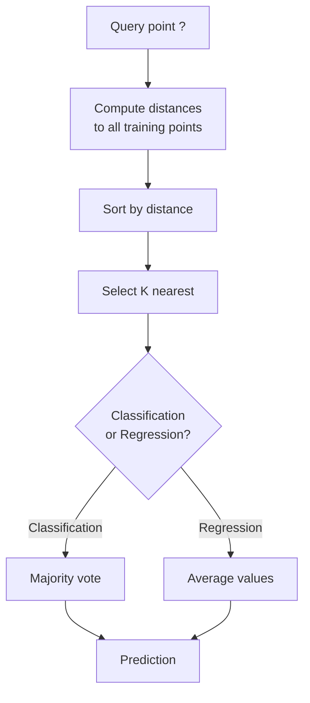
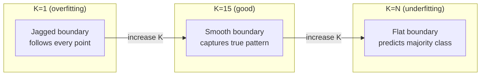
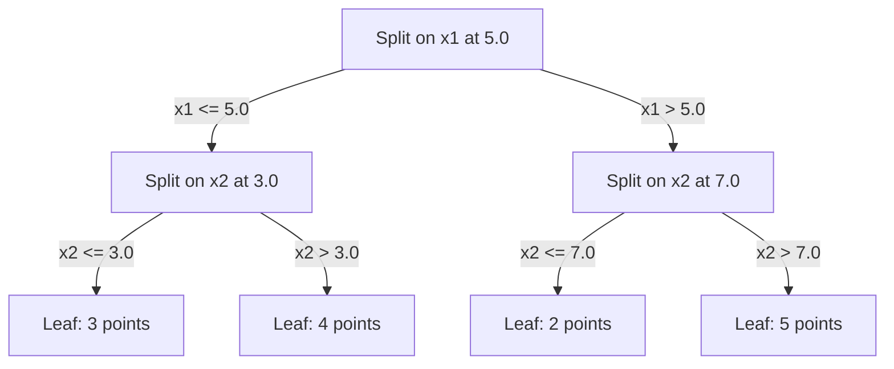

# 附近邻居和距离
# 距离与近邻


> 通过观察邻居来预测,最简单的算法实际上是有效的.

> 存储一切――预测时看邻居――最简单但确实有效的算法――

**Type:** Build | **类型：** 构建
**Language:**子**语言：**字符串
**Prerequisites:** Phase 1 (Lesson 14 Norms and Distances) | **前置知识：** Phase 1（第 14 课范数与距离）
**Time:** ~90 minutes | **时间：** 约 90 分钟

## 学习目标

- 实施KN分类和从零开始回归,使用可配置的K和距离权重投票
  从零实现可配置的K值和距离加权投票的KN 分类和归归
- 进行L1,L2,Cosine和Minkowski距离指标的比较,并选择适合给定的数据类型的指标
  比较L1、L2、余弦和可夫基距离度量,选择适合给定的数据类型的度量
- 解释维度的诅咒,并证明KNN为什么在高维空间中降解
  解释维度灾难,演示为什么KN在高维空间中的性能下降
- 建立一个KD树,以有效地搜索和分析近邻,
  构建KD树进行高效近邻搜索,分析它何时优于暴力搜索


> **【中文解读】**
> 关于KN的核心思想是近距离的K个邻居是什么类型,你就预测什么类型――推系统中寻找相似的用户是KN的思想――学习中K个邻居的分类器――

> **【拓展：KNN 思想在现代 AI 中的广泛应用】**
> 搜索增强生成) 本质就是KNN:将用户问题编码为向量,在向量数据库中搜索K个最相似的文档片段,再将它们提供给LLM生成答案――Spotify的音乐推使用近似的近邻 (ANN) 在数亿首歌中找到相似的;Pinterest的图片搜索使用视觉嵌入 +KNN――KNN的思想无处不在,只是数据结构和规模不同――

## 问题 问题引入

你有一个数据集.一个新的数据点到来.你需要分类它或预测它的价值.而不是从数据中学习参数 (如线性回归或SVM),你只能找到K训练点最接近新点,让他们投票.

> 你需要从数据中学习参数 (如线性回归或SVM) 而不是找到离新点最近的 K 训练点,让它们投票.

没有训练阶段,没有学习参数,没有减轻损失函数,你将整个训练集存储并计算距离在预测时间.

> 这就是K近邻――没有训练阶段――没有学习参数――没有最小化损失函数――你存储整个训练集,在预测时计算距离――

对于许多问题来说,KNN显然具有竞争力,特别是对于小到中等数据集,理解它深入揭示了基本概念:距离测量 (连接到第一阶段14课),维度的诅咒,

> 听起来太简单,但KNN在许多问题上出现在竞争力,特别是对于中小数据集.

现在,KNN也在现代人工智能中出现,只是以不同的名称.向量数据库在嵌入式中搜索KNN.检索增强生成 (RAG) 发现K最近的文档块.推系统发现类似的用户或项目.算法是一样的.规模和数据结构不同.

> 在现代AI中,KN无处不在,只是名称不同.向量数据库在嵌入上做KN搜索.检索增强生成.

> **【中文解读】**
> 基因是"惰学习"没有训练过程,预测时才计算距离.

## 概念的核心概念

### KNN 的运作方式

鉴于标记点的数据集和新的查询点:

> 给一个标签的数据集和一个新的查询点:

1. 计算查询到数据集中的每个点的距离
   计算查询点到数据中心的每个点距离
2. 按距离排序
   按距离排序
3. 取 K 最接近的点
   取 K 个最近点
4. 归类:K邻国中多数投票
   分类任务:K 个邻居中多数投票
5. 对于回归:K邻居值的平均值 (或权重平均值)
   回归任务:K 个邻居值的平均 (或加权平均)



没有适应,没有梯度下降,没有时代.

> 这就是整个算法.没有拟合.没有梯度下降.

### 选择K

基是单个超参数,它控制偏差变量交易:

> 控制偏差-偏差权衡:

| K | Behavior |
|---|----------|
| K = 1 | Decision boundary follows every point. Zero training error. High variance. Overfits |
| Small K (3-5) | Sensitive to local structure. Can capture complex boundaries |
| Large K | Smoother boundaries. More robust to noise. May underfit |
| K = N | Predicts the majority class for every point. Maximum bias |

| K | 行为 |
|---|------|
| K = 1 | 决策边界跟随每个点。训练误差为零。高方差。过拟合 |
| 小 K (3-5) | 对局部结构敏感。能捕捉复杂边界 |
| 大 K | 更平滑的边界。对噪声更鲁棒。可能欠拟合 |
| K = N | 每个点都预测多数类。最大偏差 |

对于一个数据集的N点,一个常见的起点是K = sqrt(N. 为了避免联系,使用奇数K进行二进制分类.

> 常用初始值是 K = 平方 (N)  (N) 为数据集大小)  (二分类使用奇数 K 以避免平票).



### 距离指标

距离函数定义了"接近"的意思.不同的指标产生不同的邻居,不同的预测.

> 距离函数定义了"近"的含义.

**L2 (Euclidean)**长度是默认的.

> **L2（欧氏距离）**是默认选择.

```
d(a, b) = sqrt(sum((a_i - b_i)^2))
```

对于特征尺度敏感. 在使用L2与KNN之前,始终标准化特征.

> 对于特征尺度敏感性. 在KN中使用L2前务必标准化特征.

**L1 (Manhattan)**较强于L2的异常值,因为它不方方分差异.

> **L1（曼哈顿距离）**对于绝对差值求和和.比L2更差,因为它不为平方差值.

```
d(a, b) = sum(|a_i - b_i|)
```

**Cosine distance**测量向量之间的角度,忽略大小.

> **余弦距离**衡量向量之间的角度,忽略大小.

```
d(a, b) = 1 - (a . b) / (||a|| * ||b||)
```

**Minkowski**概括L1和L2的参数p.

> **闵可夫斯基距离**用参数推广了L1和L2

```
d(a, b) = (sum(|a_i - b_i|^p))^(1/p)

p=1: Manhattan
p=2: Euclidean
p->inf: Chebyshev (max absolute difference)
```

哪个指标使用取决于数据:

> 选择哪种度量取决于数据:

| Data type | Best metric | Why |
|-----------|------------|-----|
| Numeric features, similar scale | L2 (Euclidean) | Default, works for spatial data |
| Numeric features, outliers | L1 (Manhattan) | Robust, does not amplify large differences |
| Text embeddings | Cosine | Magnitude is noise, direction is meaning |
| High-dimensional sparse | Cosine or L1 | L2 suffers from curse of dimensionality |
| Mixed types | Custom distance | Combine metrics per feature type |

| 数据类型 | 最佳度量 | 原因 |
|---------|--------|------|
| 数值特征，量级相近 | L2（欧氏） | 默认选择，适合空间数据 |
| 数值特征，有异常值 | L1（曼哈顿） | 鲁棒，不放大大的差异 |
| 文本嵌入 | 余弦 | 大小是噪声，方向是含义 |
| 高维稀疏 | 余弦或 L1 | L2 受维度灾难影响 |
| 混合类型 | 自定义距离 | 按特征类型组合度量 |

### 权重 KNN

标准KN给所有K邻居的重量相同. 但在0.1距离的邻居应该在5.0距离的重量超过一个.

> 标准KN对所有K邻居给予相同权力.

**Distance-weighted KNN**按距离的逆向对每个邻居的重量:

> **距离加权 KNN**按距离的倒数加权每邻居:

```
weight_i = 1 / (distance_i + epsilon)

For classification: weighted vote
For regression:     weighted average = sum(w_i * y_i) / sum(w_i)
```

问答点与训练点完全匹配时,epsilon可以防止零分.

> 防止查询点完全匹配训练点时除以零.

体重KN对K的选择不太敏感,因为远方邻居的贡献不多.

> 对于K的选择,KN的权力不太敏感,因为远距离的邻居无论K的价值如何贡献都很小.

### 维度的诅咒

由于KNN性能在高层次下降,这不是一个模糊的担忧.

> 现在,我们已经开始做了一些事情.

**Problem 1: distances converge.**随着维度的增加,最大距离与最小距离的比率接近1.所有点都与查询相等"远".

> **问题 1：距离趋同。**随着维度的增加,最大距离与最小距离的比值接近1――所有点都与查询点变得相似.

```
In d dimensions, for random uniform points:

d=2:    max_dist / min_dist = varies widely
d=100:  max_dist / min_dist ~ 1.01
d=1000: max_dist / min_dist ~ 1.001

When all distances are nearly equal, "nearest" is meaningless.
```

**Problem 2: volume explodes.**为了在数据的固定部分内捕获K邻居,你需要扩大搜索半径,以覆盖更大的部分特征空间.

> **问题 2：体积爆炸。**为了在数据的固定比例中捕获K个邻居,需要扩大搜索半径到覆盖特征空间的更大比例.

**Problem 3: corners dominate.**在d维度的单元超立方体中,大部分体积集中在角落附近,而不是中心.一个刻在立方体中的球体包含d增长时体积的消失小部分.

> **问题 3：角落主导。**在d 维单位超立方体中,大部分体积集中在角落附近,而不是中心.随着d 增长,立方体内球体含体积比例趋近零.

实际结果:KNN可以使用20-50个功能.除此之外,在应用KNN之前,您需要减少维度 (PCA,UMAP,t-SNE),或者您需要使用基于树的搜索结构,以利用数据的内在较低维度.

> 实际后果:KNN 在20-50个特征下面的效果良好.

### 快速搜索近邻

粗力 KNN计算了查询到每个训练点的距离.这就是每次查询的O(n * d).对于大型数据集,这太慢.

> 暴力 KNN 计算查询点到每个训练点的距离.

基达树在各个层面上,在中值上分开一个维度.

> 树沿着特征轴递归划分空间――每个层沿着一个维度在中值处分开――



为了找到最接近的邻居, 穿过树到包含查询的叶子, 然后回头, 检查邻居的分区只有如果它们可以包含更接近的点.

> 为了找到最近的邻居, 穿越树木到包含查询点的叶节点, 然后回去并只在相邻区内可能包含更近的点查询.

平均查询时间:低维度的O(log n).但KD树在高维度 (d > 20) 中降至O(n,因为后续追踪消除越来越少的分支.

> 低维平均查询时间:O(log n) ⋅但KD 树在高维度(d > 20)时退化为O(n),因为回溯消除的分支越来越少──

### 球树:适量尺寸的树木更好

球树分区数据成嵌套的超层,而不是轴对齐的框.每个节点定义了一个球 (中心+半径) 包含该子树中的所有点.

> 球树将数据分为嵌套的超球面而不是轴对齐的盒子.每个节点定义一个包含该子树的所有点的球.

与KD树相比的优势:
- 在中等尺寸 (最大50°C) 工作更好
  在中等维度 (最高50左右) 效果更好
- 操作不轴对齐结构
  能处理非轴对齐结构
- 越来越紧密的边界量意味着搜索过程中更多的枝子被剪切
  更紧密的包围意味着搜索时切枝更多分支

对于真正的大规模搜索 (数百万点,数百个维度),使用近邻方法 (HNSW,IVF,产品量化).这些方法在第1阶段课程14中涵盖.

> 对于真正的大规模搜索,使用近似近邻方法 (HNSW、IVF、乘积量化) 进行了研究.

### 惰学习与渴望学习

现在,KNN是个惰的学习者:它在训练时间没有工作,而所有工作都在预测时间.大多数其他算法 (线性回归,SVM,神经网络) 是热衷于学习者:他们在训练时间进行重计算,以构建紧模型,然后预测是快速的.

> 惰学习器:训练时不做任何工作,所有工作在预测时完成.

| Aspect | Lazy (KNN) | Eager (SVM, neural net) |
|--------|------------|------------------------|
| Training time | O(1) just store data | O(n * epochs) |
| Prediction time | O(n * d) per query | O(d) or O(parameters) |
| Memory at prediction | Store entire training set | Store model parameters only |
| Adapts to new data | Add points instantly | Retrain the model |
| Decision boundary | Implicit, computed on the fly | Explicit, fixed after training |

| 方面 | 懒惰学习 (KNN) | 积极学习 (SVM, 神经网络) |
|------|---------------|------------------------|
| 训练时间 | O(1) 仅存储数据 | O(n * epochs) |
| 预测时间 | 每次查询 O(n * d) | O(d) 或 O(参数) |
| 预测时内存 | 存储整个训练集 | 仅存储模型参数 |
| 适应新数据 | 即时添加点 | 重新训练模型 |
| 决策边界 | 隐式，即时计算 | 显式，训练后固定 |

惰学习是理想的,
- 数据集经常发生变化 (不需要重新训练添加/删除点)
  数据集频繁变化(无需重训即可添加/删除点)
- 对于很少的查询,你需要预测
  只有需要做预测.
- 你想要零训练时间
  需要零训练时间
- 数据集足够小,以使强迫搜索速度快
  数据集足够小,暴力搜索很快

> 惰学习在以下情况下最理想:

### 退回 KNN

而不是多数投票,KN为回归的平均值为K邻居的目标值.

> 对于K个邻居的目标值取平均.

```
prediction = (1/K) * sum(y_i for i in K nearest neighbors)

Or with distance weighting:
prediction = sum(w_i * y_i) / sum(w_i)
where w_i = 1 / distance_i
```

基因回归产生零件稳定 (或零件平滑与权重) 的预测.它不能超出训练数据范围.如果所有训练目标都在0到100之间,基因永远不会预测200.

> 预测:KNN回归产生分段常数 (或加权时分段光滑) 预测.它不能被推出到训练数据范围之外.

> **【中文解读】**
> 归归用K 个近邻的目标值取平均 (或距离加权平均) 作为预测值.与分类不同,归归产生分段常数或分段光滑的预测面.如果训练目标值在0-100之间,它永远不会预测200.这是所有"基于实例"方法的共同限制.

> **【拓展：大规模最近邻搜索——从 KNN 到 FAISS】**
> 当数据规模从数千增加到数十亿时,精确KN 搜索太慢. 超级开源的FAISS库使用乘积量化 (PQ) 和倒排文件索引 (IVF),实现毫秒级搜索在10亿级向量中.

## 建立它,实现它.
```figure
knn-smoothness
```

## 建立它

### 步骤1:距离函数

实现L1,L2,kosine和Minkowski距离.这些直接连接到第一阶段14课.

> 实现L1、L2、余弦和可夫斯基距离──这些直接连接到第一阶段 第14课──

```python
import math

def l2_distance(a, b):
    return math.sqrt(sum((ai - bi) ** 2 for ai, bi in zip(a, b)))  # 欧氏距离（L2 范数）

def l1_distance(a, b):
    return sum(abs(ai - bi) for ai, bi in zip(a, b))  # 曼哈顿距离（L1 范数）

def cosine_distance(a, b):
    dot_val = sum(ai * bi for ai, bi in zip(a, b))  # 点积
    norm_a = math.sqrt(sum(ai ** 2 for ai in a))  # 向量 a 的模
    norm_b = math.sqrt(sum(bi ** 2 for bi in b))  # 向量 b 的模
    if norm_a == 0 or norm_b == 0:
        return 1.0
    return 1.0 - dot_val / (norm_a * norm_b)  # 余弦距离 = 1 - 余弦相似度

def minkowski_distance(a, b, p=2):
    if p == float('inf'):
        return max(abs(ai - bi) for ai, bi in zip(a, b))  # p=∞ 时为切比雪夫距离
    return sum(abs(ai - bi) ** p for ai, bi in zip(a, b)) ** (1 / p)  # 闵可夫斯基距离
```

### 步骤2:KNN分类器和回归器

构建全KN,设置可 K,距离指标和可选距离权重.

> 构建完整的KN,支持可配置的K,距离量和可选的距离加权.

```python
class KNN:
    def __init__(self, k=5, distance_fn=l2_distance, weighted=False,
                 task="classification"):
        self.k = k
        self.distance_fn = distance_fn
        self.weighted = weighted
        self.task = task
        self.X_train = None
        self.y_train = None

    def fit(self, X, y):
        self.X_train = X
        self.y_train = y

    def predict(self, X):
        return [self._predict_one(x) for x in X]
```

### 步骤3:KD树,以有效搜索

建立一个从零开始的KD树,它在每个维度的中位数上反复分裂.

> 从零构建 KD 树,沿每个维度的中值递归分化.

```python
class KDTree:
    def __init__(self, X, indices=None, depth=0):
        # Recursively partition the data
        self.axis = depth % len(X[0])
        # Split on median of the current axis
        ...

    def query(self, point, k=1):
        # Traverse to leaf, then backtrack
        ...
```

看到`code/knn.py`对于所有辅助方法和演示的全面实施.

> 完整实现 (含所有辅助方法和演示) 见`code/knn.py`,我知道.

### 步骤4: 功能扩展

KNN需要特征扩展,因为距离对特征大小敏感.从0到1000的特征将占据从0到1的特征的主导地位.

> 由于距离对特征量级敏感,KNN需要特征缩小.

```python
def standardize(X):
    n = len(X)
    d = len(X[0])
    means = [sum(X[i][j] for i in range(n)) / n for j in range(d)]
    stds = [
        max(1e-10, (sum((X[i][j] - means[j]) ** 2 for i in range(n)) / n) ** 0.5)
        for j in range(d)
    ]
    return [[((X[i][j] - means[j]) / stds[j]) for j in range(d)] for i in range(n)], means, stds
```

## 用它实现框架

通过"学习"

> 使用小说学习:

```python
from sklearn.neighbors import KNeighborsClassifier
from sklearn.preprocessing import StandardScaler
from sklearn.pipeline import Pipeline

clf = Pipeline([
    ("scaler", StandardScaler()),
    ("knn", KNeighborsClassifier(n_neighbors=5, metric="euclidean")),
])
clf.fit(X_train, y_train)
print(f"Accuracy: {clf.score(X_test, y_test):.4f}")
```

对于高维度数据,它会回到原力.你可以使用`algorithm`参数

> 对于高维数据,它会回归暴力搜索.`algorithm`参数控制.

为了大规模的近邻搜索 (数百万个向量),使用FAISS,Annoy或向量数据库:

> 对于大规模近邻搜索 (百万向量),使用 FAISS、Annoy 或向量数据库:

```python
import faiss

index = faiss.IndexFlatL2(dimension)
index.add(embeddings)
distances, indices = index.search(query_vectors, k=5)
```

> **【拓展：从 KNN 到向量数据库——AI 基础设施的演进】**
> 通过KN的思想是现代人工智能基础设施的核心.RAG (检索增强生成) 使用KN在向量数据库中搜索相关文档;推系统使用近似近邻 (近邻) 在数亿向量中找到类似商品;图像搜索使用CLIP嵌入式 + FAISS实现跨模态检索.向量数据库市场 (Pinecone,Milvus,Weaviate,Qdrant) 预计在2025年达到40亿美元规模,其核心算法仍然是KN的高效变量.

## 练习题

1. 实现KNN分类在3类的2D数据集上.绘制K=1,K=5,K=15,K=N的决策边界.观察过度适应到不足适应的过渡.
   1. 在3类2D数据集中实现KN 分类――绘制K=1、K=5、K=15 和K=N的决策边界――观察从过适合到不适合的转变――

2. 生成1000个随机点在2,5,10,50,50,100和500个维度中.对于每个维度,计算最大双向距离的比例到最低双向距离.绘制比与维度以可视化维度的诅咒.
   2. 在2、5、10、50、100 和 500 维中各生成 1000 个随机点.

3. 在文本分类问题上,比较L1,L2和KNN的小数距离 (使用TF-IDF向量).哪个指标能提供最佳准确性?为什么小数往往在文本中获胜?
   3. 在文本分类问题中,使用TF-IDF向量 (上比较L1、L2 和余弦距离......哪个度量准确率最高?为什么余弦在文本上通常最好?

4. 实现KD树,并对2D,10D和50D中的1k,10k和100k点数据集进行查询时间与粗体力测量.在哪个维度下,KD树停止比粗体力更快?
   4. 实现KD树,测量1k、10k 和 100k 点在2D、10D 和50D中查询时间与暴力搜索的比较.

5. 构建为y = sin(x) +噪音的权重KN回归器.与K=3, 10,30的非权重KN进行比较.
   5. 为 y = sin(x) +噪音 构建加权 KNN 回归器──在 K=3、10、30 时与未加权 KNN 比较──展示加权产生更光滑的预测,特别是在大 K 时──

## 关键词 快速查找表

| Term | What it actually means |
|------|----------------------|
| K-nearest neighbors | Non-parametric algorithm that predicts by finding the K closest training points to a query |
| Lazy learning | No computation at training time. All work happens at prediction time. KNN is the canonical example |
| Eager learning | Heavy computation at training time to build a compact model. Most ML algorithms are eager |
| Curse of dimensionality | In high dimensions, distances converge and neighborhoods expand to cover most of the space, making KNN ineffective |
| KD-tree | Binary tree that recursively partitions space along feature axes. O(log n) queries in low dimensions |
| Ball tree | Tree of nested hyperspheres. Works better than KD-trees in moderate dimensions (up to ~50) |
| Weighted KNN | Neighbors weighted inversely by distance. Closer neighbors have more influence on the prediction |
| Feature scaling | Normalizing features to comparable ranges. Required for distance-based methods like KNN |
| Majority vote | Classification by counting which class is most common among K neighbors |
| Brute force search | Computing distance to every training point. O(n*d) per query. Exact but slow for large n |
| Approximate nearest neighbor | Algorithms (HNSW, LSH, IVF) that find approximately nearest points much faster than exact search |
| Voronoi diagram | The partition of space where each region contains all points closer to one training point than any other. K=1 KNN produces Voronoi boundaries |

## 继续阅读 继续阅读

- [Cover & Hart: Nearest Neighbor Pattern Classification (1967)](https://ieeexplore.ieee.org/document/1053964)- 基础KNN论文证明它具有最大的错误率是贝耶斯最佳的两倍
  [Cover & Hart: Nearest Neighbor Pattern Classification (1967)](https://ieeexplore.ieee.org/document/1053964)- 证明KN 错误率最高是贝叶斯最优的两倍
- [Friedman, Bentley, Finkel: An Algorithm for Finding Best Matches in Logarithmic Expected Time (1977)](https://dl.acm.org/doi/10.1145/355744.355745)- 原始的KD树纸
  [Friedman, Bentley, Finkel: An Algorithm for Finding Best Matches in Logarithmic Expected Time (1977)](https://dl.acm.org/doi/10.1145/355744.355745)- 树原始论文
- [Beyer et al.: When Is "Nearest Neighbor" Meaningful? (1999)](https://link.springer.com/chapter/10.1007/3-540-49257-7_15)- 对于近邻的维度诅咒的正式分析
  [Beyer et al.: When Is "Nearest Neighbor" Meaningful? (1999)](https://link.springer.com/chapter/10.1007/3-540-49257-7_15)- 最近的邻近灾难的正式分析
- [scikit-learn Nearest Neighbors documentation](https://scikit-learn.org/stable/modules/neighbors.html)- 选项选项的实践指南
  [scikit-learn 最近邻文档](https://scikit-learn.org/stable/modules/neighbors.html)- 实用指南及算法选择
- [FAISS: A Library for Efficient Similarity Search](https://github.com/facebookresearch/faiss)- 测量数亿的近邻搜索库
  [FAISS](https://github.com/facebookresearch/faiss)现在,我们在这个世界里,
