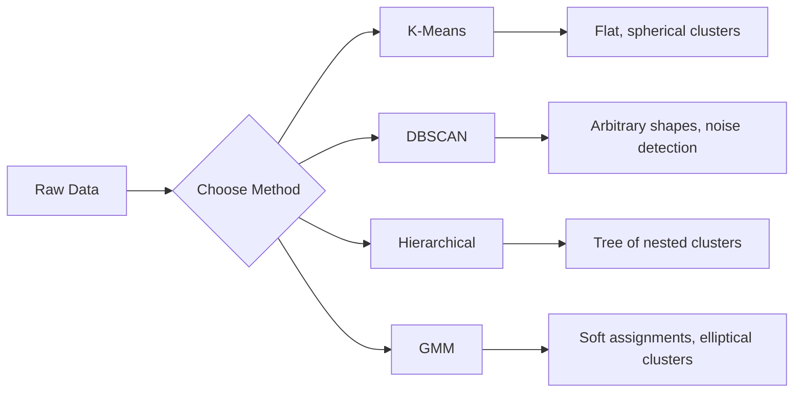

# 没有监督的学习
# 无监督学习


> 没有标签,没有老师.算法可以自行找到结构.

> 没有标签,没有老师.

**Type:** Build | **类型：** 构建
**Languages:** Python
**Prerequisites:** Phase 1 (Norms & Distances, Probability & Distributions), Phase 2 Lessons 1-6 | **前置知识：** Phase 1（范数与距离、概率与分布），Phase 2 第 1-6 课
**Time:** ~90 minutes | **时间：** 约 90 分钟

## 学习目标

- 从零开始实现K-Means,DBSCAN和高斯混合模型,并比较它们的集群行为
  从零实现K-Means、DBSCAN 和高斯混合模型 (GMM) 进行相比较,
- 通过模具分数和肘部方法评估集群质量,以选择最佳K
  使用轮系数和肘部法评估聚类质量,选择优质K
- 解释DBSCAN在何时超过K-Means,并确定哪个算法处理非球状集群和异常值
  解释DBSCAN何时优于K-Means,识别哪种算法能处理非球形和异常值
- 通过集群方法建立一个异常检测管道,将偏离正常模式的标记点进行标记
  使用聚类方法构建异常检测管线,标记偏离正常模式的点


> **【中文解读】**
> 无监督学习没有标签,目标是发现数据中的结构. K-Means是最经典的聚类算法.

> **【拓展：无监督学习在真实 AI 系统中的价值】**
> 谷歌照片自动相册分组使用聚类算法将类似于照片归类 ([[人脸]],地点、场景);Spotify的"发现"功能将聚类用户分组后推;网络安全领域的异常检测使用DBSCAN/孤立森林发现异常流量──在没有标签或标签的场景中获取成本极高的情况下,无监督学习是唯一的选择──

## 问题 问题引入

在现实世界中,标签是昂贵的. 一个医院有数百万病人的记录,但没有人手动标记每一个病例. 电子商务网站有数百万用户, 警方有网络记录,但没有人标记了每一个异常.

> 之前的每一个课程都假设有标签数据:"这是输入,这是正确输出. ""在现实世界中,标签是昂贵的. 一个医院有数百万患者记录,但没有人手动给每一个标签疾病类别. 一个电商网站有数百万用户会话,但没有人手动标签客户分群.

没有监督的学习会发现模式,而没有被告知要寻找什么.它集结类似的数据点,发现隐藏的结构,并表面上发现异常.如果监督的学习是从一本有答案键的教科书中学习,那么没有监督的学习会着原始数据,直到模式显示出来.

> 无监督学习在未被告的情况下寻找什么发现模式――它将类似于数据点分组,发现隐藏结构,揭示异常――如果监督学习是从有答案的教科书学习,无监督学习就是着原始数据直到模式自我显现――

没有标签,你不能直接测量"正确"或"错误".

> 关键问题:没有标签,你无法直接衡量"对"或"错"――你需要不同的工具来评估算法发现的结构是否有意义――

> **【中文解读】**
> 无监督学习的核心挑战是评估:没有标签就无法直接衡量"对错"――需要使用轮系数"",肘部法则等标标签间接评估聚类质量――K-Means 假设是球形的且大小相近,对异常值敏感;DBSCAN 能够发现任意形状的并自动识别噪音点,但需要设置密度参数――

## 概念的核心概念

### 集群: 集群相似的东西

集群将每个数据点分配给一个组 (集群),使同一组内的点比其他组中的点更相似.问题总是:"相似"意味着什么?

> 聚类将每个数据点分配到一个组,使同一组内的点比其他组的点更相似.问题始终是:"相似"意味着什么?



### 工作马

基-指数分为K集群,每个集群都有一个中心位 (其质量中心),每个点都属于最近的中心位.

> 意思是将数据精确划分为K个──每个都有质心,每个点属于最近质心──

劳埃德的算法:

> 劳埃德算法:

1. 选择K随机点作为初始中心点
   随机选择 K 个点作为初始质心
2. 分配每个数据点到最近的中心位
   将每个数据点分配给最近的质量中心
3. 计算每个中心位作为其分配点的平均值
   重新计算每个质量为其分配点的平均值
4. 重复步骤2-3,直到任务停止改变
   重复步骤 2-3直到分配不再变化

客观函数 (惰性) 测量从每个点到其分配的中心点的总平方距离.K-Means 减少这一点,但只找到一个本地最小值.不同的初始化可以产生不同的结果.

> 目标函数 (惯性) 衡量每个点到其分配质心的总平方距离.

### 选择K

两种标准方法:

> 两种标准方法:

**Elbow method:**运行K-Means为K = 1, 2, 3, ..., n. 插图惰性对K. 寻找"肘部",添加更多集群停止显著减少惰性.

> **肘部法则：**对于K=1,2,3,...,n运行K-Means──绘制惯性对K的图──寻找"肘部"增加更多不再显著减少惯性位置──

**Silhouette score:**对于每个点,测量它与自己的集群 (a) 相比较近的其他集群 (b) 多么相似.模具系数是 (b - a) / max(a,b),从 -1 (错误集群) 到 +1 (好集群).全球分数的平均值在所有点上.

> **轮廓系数：**对每一个点,测量它与自己的相似性 (a) 与最近其他的相似性 (b) ⋅轮系数为 (b - a) /max(a,b),范围从 -1(错误的) 到 +1(良好的聚类) ⋅对所有点取平均得到全局分数──

### 基于密度的聚合物

据 K-Means 假设集群是圆形的,需要你先选择 K. DBSCAN 没有任何假设.它发现集群是密集区域,由稀疏区域分开.

> 假设是球形的,需要预先选择.

两个参数:
- **eps**:一个邻居的半径
  **eps**邻域半径
- **min_samples**: 形成密集区域所需的最低点数
  **min_samples**形成密集区域所需的最小点数

三个类型的点:
- **Core point**: 在eps距离内至少有min_sample点
  **核心点**距离内至少有几个样本
- **Border point**:在一个核心点的eps内,但本身不是核心点
  **边界点**核心点的范围,但本身不是核心点
- **Noise point**它们是异常值的.
  **噪声点**既非核心也非边界――这些都是异常值――

光电缆系统将位于一个离一个离一个离一个离一个离一个离一个离一个离一个离一个离一个离一个离一个离一个离一个离一个离一个离一个离一个离一个离一个离一个离一个离一个离一个离一个离一个离一个离一个离一个离一个离一个离一个离一个离一个离一个离一个离一个离一个离一个离一个离一个离一个离一个离一个离一个离一个离一个离一个离一个离一个离一个离一个离一个离一个离一个离一个离一个离一个离一个离一个离一个离一个离一个离一个离一个离一个离一个离一个离一个离一个离一个离一个离一个离一个离一个离一个离一个离一个离一个离一个离一个离一个离一个离一个离一个离一个离一个离一个离一个离一个离一个离一个离一个离一个离一个离一个离一个离一个离一个离一个离一个离一个离一个离一个离一个离一个离一个离一个离一个离一个离一个离一个离一个离一个离一个离一个离一个离一个离一个离一个离一个离一个离一个离一个离一个离一个离一个离一个离一个离一个离一个离一个离一个离一个离一个离一个离一个离一个离一个离一个离一个离一个离一个离一个离一个离一个离一个离一个离一个离一个离一个离一个离一个离一个.

>  声点不属于任何──

强度:找到任何形状的集群,自动确定集群数量,识别异常值. 弱点:与不同密度的集群斗争.

> 优势:发现任意形状的,自动确定数量,识别异常值.

### 层次性集群

树木 (形图) 形成了嵌套的群体.

> 构建嵌套的树树状图)

聚合物 (下至上):

> 聚合式 (自底上):

1. 开始每个点作为自己的集群
   开始时每个点都是自己的
2. 合并两个最接近的集群
   合并两个最近的
3. 重复直到剩下只有一个集群
   重复直到剩下一个
4. 切割子图在所需水平,以获得K集群
   在所需层次切割树形图得到 K 个

集群之间的"接近"可以以以下方式测量:
- **Single linkage**: 两组任何两个点之间的最小距离
  **单链接**两个中任意两点之间的最小距离
- **Complete linkage**:任何两个点之间的最大距离
  **全链接**任意两点之间的最大距离
- **Average linkage**:所有对之间的平均距离
  **平均链接**平均距离:所有点对
- **Ward's method**: 集团内部总差异最小的增长
  **Ward 方法**导致内总方差增加最小的合并

### 盖斯混合物模型 (GMM)

基准指数给出硬项:每个点属于一个集群.GMM给出软项:每个点都有属于每个集群的可能性.

> 平均分数:每点恰恰属于一个──GMM 给出软分数:每点都有属于每个的概率──

根据GMM的假设,数据是由K高斯分布的混合物生成的,每个分布都有其平均值和共变值.预期最大化 (EM) 算法在以下之间交替:

> 基因基因基因基因基因基因基因基因基因基因基因基因基因基因基因基因基因基因基因基因基因基因基因基因基因基因基因基因基因基因基因基因基因基因基因基因基因基因基因基因基因基因基因基因基因基因基因基因基因基因基因基因基因基因基因基因基因基因基因基因基因基因基因基因基因基因基因基因基因基因基因基因基因基因基因基因基因基因基因基因基因基因基因基因基因基因基因基因基因基因基因基因基因基因基因基因基因基因基因基因基因基因基因基因基因基因基因基因基因基因基因基因基因基因基因基因基因基因基因基因基因基因基因基因基因基因基因基因基因基因基因基因基因基因基因基因基因基因基因基因基因基因基因基因基因基因基因基因基因基因基因基因基因基因基因基因基因基因基因基因基因基因基因基因基因基因基因基因基因基因基因基因基因基因基因基因基因基因基因基因基因基因基因基因基因基因基因基因基因基因基因基因基因基因基因基因基因基因基因基因基因基因基因基因基因基因基因基因基因基因基因基因基因基基基因基因基基基基因基基基基基基基基基基基基基基基基基基基基基基基基基基基基基基基基基基基基基基基基基基基基基基基基基基基基基基基基基基基基基基基基基基基基基基基基

- **E-step**:计算每个点属于每个高斯的概率
  **E 步**计算每个点属于每个高斯分布的概率
- **M-step**更新每一个高斯的平均值,变量和混合重量,以最大限度地提高数据的可能性
  **M 步**更新每高斯分布的平均值,方差和混合权重以最大化数据似

GMM可以模拟圆团 (不仅像K-Means这样的球形) 并自然处理重叠的团.

> 基因基因基因基因基因基因基因基因基因基因基因基因基因基因基因基因基因基因基因基因基因基因基因基因基因基因基因基因基因基因基因基因基因基因基因基因基因基因基因基因基因基因基因基因基因基因基因基因基因基因基因基因基因基因基因基因基因基因基因基因基因基因基因基因基因基因基因基因基因基因基因基因基因基因基因基因基因基因基因基因基因基因基因基因基因基因基因基因基因基因基因基因基因基因基因基因基因基因基因基因基因基因基因基因基因基因基因基因基因基因基因基因基因基因基因基因基因基因基因基因基因基因基因基因基因基因基因基因基因基因基因基因基因基因基因基因基因基因基因基因基因基因基因基因基因基因基因基因基因基因基因基因基因基因基因基因基因基因基因基因基因基因基因基因基因基因基因基因基因基因基因基因基因基因基因基因基因基因基因基因基因基因基因基因基因基因基因基因基因基因基因基因基因基因基因基因基因基因基因基因基因基因基因基因基因基因基因基因基因基因基因基因基因基因基因基因基因基因基因基因基因基因基因基因基因基因基因基因基因基因基因基因基因基因基因基因基因基因基因基因基因基因基因基因基因基因基因基因基因基因基因基因基因基因基

### 什么时候使用

| Method | Best for | Avoid when |
|--------|----------|------------|
| K-Means | Large datasets, spherical clusters, known K | Irregular shapes, outliers present |
| DBSCAN | Unknown K, arbitrary shapes, outlier detection | Varying densities, very high dimensions |
| Hierarchical | Small datasets, need dendrogram, unknown K | Large datasets (O(n^2) memory) |
| GMM | Overlapping clusters, soft assignments needed | Very large datasets, too many dimensions |

| 方法 | 最适合 | 避免使用 |
|------|--------|---------|
| K-Means | 大数据集，球形簇，已知 K | 不规则形状，有异常值 |
| DBSCAN | 未知 K，任意形状，异常检测 | 密度不均匀，极高维度 |
| 层次聚类 | 小数据集，需要树状图，未知 K | 大数据集（O(n^2) 内存） |
| GMM | 重叠簇，需要软分配 | 非常大的数据集，维度太高 |

### 集的异常检测

集群自然支持异常检测:
- **K-Means**距离任何心脏部位的点都是异常
  **K-Means**任何质量都远的点都是异常值
- **DBSCAN**噪音点是定义上异常
  **DBSCAN**噪音点的定义是异常值
- **GMM**根据所有高斯人,低概率的点都是异常.
  **GMM**在所有高分布下,概率都很低,

> 聚类天然支持异常检测:

## 建立它,实现它.

> **【中文解读】**
> 从零实现 K-Means、DBSCAN 和高斯混合模型──K-Means 的三步代:随机初始化中心 → 分配每个点到最近的中心 → 重新计算中心──重复直到收──DBSCAN 从高密度区域开始扩大,自动处理噪音点──
```figure
kmeans-step
```

## 建立它

### 步骤1:K-从零开始

```python
import math
import random


def euclidean_distance(a, b):
    return math.sqrt(sum((ai - bi) ** 2 for ai, bi in zip(a, b)))


def kmeans(data, k, max_iterations=100, seed=42):
    random.seed(seed)
    n_features = len(data[0])

    centroids = random.sample(data, k)

    for iteration in range(max_iterations):
        clusters = [[] for _ in range(k)]
        assignments = []

        for point in data:
            distances = [euclidean_distance(point, c) for c in centroids]
            nearest = distances.index(min(distances))
            clusters[nearest].append(point)
            assignments.append(nearest)

        new_centroids = []
        for cluster in clusters:
            if len(cluster) == 0:
                new_centroids.append(random.choice(data))
                continue
            centroid = [
                sum(point[j] for point in cluster) / len(cluster)
                for j in range(n_features)
            ]
            new_centroids.append(centroid)

        if all(
            euclidean_distance(old, new) < 1e-6
            for old, new in zip(centroids, new_centroids)
        ):
            print(f"  Converged at iteration {iteration + 1}")
            break

        centroids = new_centroids

    return assignments, centroids
```

### 步骤2:肘部方法和模具分数

```python
def compute_inertia(data, assignments, centroids):
    total = 0.0
    for point, cluster_id in zip(data, assignments):
        total += euclidean_distance(point, centroids[cluster_id]) ** 2
    return total


def silhouette_score(data, assignments):
    n = len(data)
    if n < 2:
        return 0.0

    clusters = {}
    for i, c in enumerate(assignments):
        clusters.setdefault(c, []).append(i)

    if len(clusters) < 2:
        return 0.0

    scores = []
    for i in range(n):
        own_cluster = assignments[i]
        own_members = [j for j in clusters[own_cluster] if j != i]

        if len(own_members) == 0:
            scores.append(0.0)
            continue

        a = sum(euclidean_distance(data[i], data[j]) for j in own_members) / len(own_members)

        b = float("inf")
        for cluster_id, members in clusters.items():
            if cluster_id == own_cluster:
                continue
            avg_dist = sum(euclidean_distance(data[i], data[j]) for j in members) / len(members)
            b = min(b, avg_dist)

        if max(a, b) == 0:
            scores.append(0.0)
        else:
            scores.append((b - a) / max(a, b))

    return sum(scores) / len(scores)


def find_best_k(data, max_k=10):
    print("Elbow method:")
    inertias = []
    for k in range(1, max_k + 1):
        assignments, centroids = kmeans(data, k)
        inertia = compute_inertia(data, assignments, centroids)
        inertias.append(inertia)
        print(f"  K={k}: inertia={inertia:.2f}")

    print("\nSilhouette scores:")
    for k in range(2, max_k + 1):
        assignments, centroids = kmeans(data, k)
        score = silhouette_score(data, assignments)
        print(f"  K={k}: silhouette={score:.4f}")

    return inertias
```

### 步骤3:从零开始 DBSCAN

```python
def dbscan(data, eps, min_samples):
    n = len(data)
    labels = [-1] * n
    cluster_id = 0

    def region_query(point_idx):
        neighbors = []
        for i in range(n):
            if euclidean_distance(data[point_idx], data[i]) <= eps:
                neighbors.append(i)
        return neighbors

    visited = [False] * n

    for i in range(n):
        if visited[i]:
            continue
        visited[i] = True

        neighbors = region_query(i)

        if len(neighbors) < min_samples:
            labels[i] = -1
            continue

        labels[i] = cluster_id
        seed_set = list(neighbors)
        seed_set.remove(i)

        j = 0
        while j < len(seed_set):
            q = seed_set[j]

            if not visited[q]:
                visited[q] = True
                q_neighbors = region_query(q)
                if len(q_neighbors) >= min_samples:
                    for nb in q_neighbors:
                        if nb not in seed_set:
                            seed_set.append(nb)

            if labels[q] == -1:
                labels[q] = cluster_id

            j += 1

        cluster_id += 1

    return labels
```

### 步骤4:高斯混合物模型 (EM算法)

```python
def gmm(data, k, max_iterations=100, seed=42):
    random.seed(seed)
    n = len(data)
    d = len(data[0])

    indices = random.sample(range(n), k)
    means = [list(data[i]) for i in indices]
    variances = [1.0] * k
    weights = [1.0 / k] * k

    def gaussian_pdf(x, mean, variance):
        d = len(x)
        coeff = 1.0 / ((2 * math.pi * variance) ** (d / 2))
        exponent = -sum((xi - mi) ** 2 for xi, mi in zip(x, mean)) / (2 * variance)
        return coeff * math.exp(max(exponent, -500))

    for iteration in range(max_iterations):
        responsibilities = []
        for i in range(n):
            probs = []
            for j in range(k):
                probs.append(weights[j] * gaussian_pdf(data[i], means[j], variances[j]))
            total = sum(probs)
            if total == 0:
                total = 1e-300
            responsibilities.append([p / total for p in probs])

        old_means = [list(m) for m in means]

        for j in range(k):
            r_sum = sum(responsibilities[i][j] for i in range(n))
            if r_sum < 1e-10:
                continue

            weights[j] = r_sum / n

            for dim in range(d):
                means[j][dim] = sum(
                    responsibilities[i][j] * data[i][dim] for i in range(n)
                ) / r_sum

            variances[j] = sum(
                responsibilities[i][j]
                * sum((data[i][dim] - means[j][dim]) ** 2 for dim in range(d))
                for i in range(n)
            ) / (r_sum * d)
            variances[j] = max(variances[j], 1e-6)

        shift = sum(
            euclidean_distance(old_means[j], means[j]) for j in range(k)
        )
        if shift < 1e-6:
            print(f"  GMM converged at iteration {iteration + 1}")
            break

    assignments = []
    for i in range(n):
        assignments.append(responsibilities[i].index(max(responsibilities[i])))

    return assignments, means, weights, responsibilities
```

### 步骤5:生成测试数据并运行所有

```python
def make_blobs(centers, n_per_cluster=50, spread=0.5, seed=42):
    random.seed(seed)
    data = []
    true_labels = []
    for label, (cx, cy) in enumerate(centers):
        for _ in range(n_per_cluster):
            x = cx + random.gauss(0, spread)
            y = cy + random.gauss(0, spread)
            data.append([x, y])
            true_labels.append(label)
    return data, true_labels


def make_moons(n_samples=200, noise=0.1, seed=42):
    random.seed(seed)
    data = []
    labels = []
    n_half = n_samples // 2
    for i in range(n_half):
        angle = math.pi * i / n_half
        x = math.cos(angle) + random.gauss(0, noise)
        y = math.sin(angle) + random.gauss(0, noise)
        data.append([x, y])
        labels.append(0)
    for i in range(n_half):
        angle = math.pi * i / n_half
        x = 1 - math.cos(angle) + random.gauss(0, noise)
        y = 1 - math.sin(angle) - 0.5 + random.gauss(0, noise)
        data.append([x, y])
        labels.append(1)
    return data, labels


if __name__ == "__main__":
    centers = [[2, 2], [8, 3], [5, 8]]
    data, true_labels = make_blobs(centers, n_per_cluster=50, spread=0.8)

    print("=== K-Means on 3 blobs ===")
    assignments, centroids = kmeans(data, k=3)
    print(f"  Centroids: {[[round(c, 2) for c in cent] for cent in centroids]}")
    sil = silhouette_score(data, assignments)
    print(f"  Silhouette score: {sil:.4f}")

    print("\n=== Elbow Method ===")
    find_best_k(data, max_k=6)

    print("\n=== DBSCAN on 3 blobs ===")
    db_labels = dbscan(data, eps=1.5, min_samples=5)
    n_clusters = len(set(db_labels) - {-1})
    n_noise = db_labels.count(-1)
    print(f"  Found {n_clusters} clusters, {n_noise} noise points")

    print("\n=== GMM on 3 blobs ===")
    gmm_assignments, gmm_means, gmm_weights, _ = gmm(data, k=3)
    print(f"  Means: {[[round(m, 2) for m in mean] for mean in gmm_means]}")
    print(f"  Weights: {[round(w, 3) for w in gmm_weights]}")
    gmm_sil = silhouette_score(data, gmm_assignments)
    print(f"  Silhouette score: {gmm_sil:.4f}")

    print("\n=== DBSCAN on moons (non-spherical clusters) ===")
    moon_data, moon_labels = make_moons(n_samples=200, noise=0.1)
    moon_db = dbscan(moon_data, eps=0.3, min_samples=5)
    n_moon_clusters = len(set(moon_db) - {-1})
    n_moon_noise = moon_db.count(-1)
    print(f"  Found {n_moon_clusters} clusters, {n_moon_noise} noise points")

    print("\n=== K-Means on moons (will fail to separate) ===")
    moon_km, moon_centroids = kmeans(moon_data, k=2)
    moon_sil = silhouette_score(moon_data, moon_km)
    print(f"  Silhouette score: {moon_sil:.4f}")
    print("  K-Means splits moons poorly because they are not spherical")

    print("\n=== Anomaly detection with DBSCAN ===")
    anomaly_data = list(data)
    anomaly_data.append([20.0, 20.0])
    anomaly_data.append([-5.0, -5.0])
    anomaly_data.append([15.0, 0.0])
    anomaly_labels = dbscan(anomaly_data, eps=1.5, min_samples=5)
    anomalies = [
        anomaly_data[i]
        for i in range(len(anomaly_labels))
        if anomaly_labels[i] == -1
    ]
    print(f"  Detected {len(anomalies)} anomalies")
    for a in anomalies[-3:]:
        print(f"    Point {[round(v, 2) for v in a]}")
```

## 用它实现框架

通过Skit-learn,相同的算法是单行:

> 只有一个代码:

```python
from sklearn.cluster import KMeans, DBSCAN, AgglomerativeClustering
from sklearn.mixture import GaussianMixture
from sklearn.metrics import silhouette_score as sklearn_silhouette

km = KMeans(n_clusters=3, random_state=42).fit(data)  # K-Means 聚类（默认 K-Means++ 初始化）
db = DBSCAN(eps=1.5, min_samples=5).fit(data)  # DBSCAN 密度聚类（eps 为邻域半径）
agg = AgglomerativeClustering(n_clusters=3).fit(data)  # 层次聚类
gmm_model = GaussianMixture(n_components=3, random_state=42).fit(data)  # 高斯混合模型（EM 算法）
```

从零开始的版本显示了这些库计算的内容.K-Means在分配和重新计算之间进行反复计算.DBSCAN从密集种子中成长集群.GMM在期望和最大化之间交替.图书馆版本增加了数值稳定性,更智能的初始化 (K-Means++),以及GPU加速,但核心逻辑是相同的.

> 从零版本向你展示了这些库到底计算了什么. K-Means 在分配和重计算之间代. DBSCAN 从密集种子扩展. GMM 在期望和最大化之间交换.库版本增加了数值稳定性,更智能的初始化. K-Means++) 和 GPU 加速,但核心逻辑是相同的.

## 运送它.

这一课程从零开始产生了K-Means,DBSCAN和GMM的工作实现.集群代码可以重新作为更先进的未监督方法的基础.

> 本课产出于零实现的K-Means、DBSCAN 和 GMM──聚类代码可作为更高级无监督方法的基础复用──

> **【拓展：聚类在用户分群和推荐系统中的应用】**
> 果将用户分类为"品味群体"推音乐每个群体内用户有相似的听歌习惯.Airbnb使用聚类将房源分组来优化搜索排名.Amazon使用聚类发现购买模式推商品.

> **【中文解读】**
> 无监督学习的评估比监督学习更困难――轮系数衡量内密度与间分离度,范围 [-1, 1],越高越好――肘部法则寻找WCSS(内平方和) 随着K 增加的"拐点"――GMM 使用EM算法(期望最大化) 交换更新分配和参数,比K-Means 更灵活圆而不是球形) 但更慢――

## 练习题

1. 实现K-Means++初始化:而不是随机选择中位数,先随机选择第一个中位数,然后选择每一个后续的中位数,概率均等于距离最近的现有中位数的平方.比较接近速度和随机初始化.
   1. 实现K-Means++初始化:不是随机选择质心,而是随机选择第一个,然后每个后续质心以与其相比的近期已有质心的平方距离成正比的概率选择――比较收获速度与随机初始化的差异――
2. 添加等级聚合集成到代码中. 实现Ward的链接并生成一个子图 (作为一个嵌套的合并列表). 切割它在不同的层次和比较K-Means结果.
   2. 向代码中添加层次聚合聚类――实现区块链并生成树状图――作为合并的嵌套列表――在不同层次切割并与K-Means 结果比较――
3. 建立一个简单的异常检测管道:运行DBSCAN和GMM在相同的数据上,两种方法一致的标志点都是异常值 (DBSCAN中的噪音,GMM中的概率低).测量重叠,讨论方法不同时.
   3. 构建简单的异常检测管线:在同一数据上运行 DBSCAN 和 GMM,标记两种方法都认为是异常值的点(DBSCAN 中的噪音、GMM 中的低概率点) ⋅测量重叠并讨论方法何时不一致──

## 关键词 快速查找表

| Term | What people say | What it actually means |
|------|----------------|----------------------|
| Clustering | "Grouping similar things" | Partitioning data into subsets where within-group similarity exceeds between-group similarity, measured by a specific distance metric |
| Centroid | "The center of a cluster" | The mean of all points assigned to a cluster; used by K-Means as the cluster representative |
| Inertia | "How tight the clusters are" | Sum of squared distances from each point to its assigned centroid; lower is tighter |
| Silhouette score | "How well-separated clusters are" | For each point, (b - a) / max(a, b) where a is mean intra-cluster distance and b is mean nearest-cluster distance |
| Core point | "A point in a dense region" | A point with at least min_samples neighbors within eps distance, in DBSCAN |
| EM algorithm | "Soft K-Means" | Expectation-Maximization: iteratively compute membership probabilities (E-step) and update distribution parameters (M-step) |
| Dendrogram | "A tree of clusters" | A tree diagram showing the order and distance at which clusters were merged in hierarchical clustering |
| Anomaly | "An outlier" | A data point that does not conform to the expected pattern, identified as noise by DBSCAN or low-probability by GMM |

## 继续阅读 继续阅读

- [Stanford CS229 - Unsupervised Learning](https://cs229.stanford.edu/notes2022fall/main_notes.pdf)- 关于集群和电脑的安德鲁·恩格的讲座笔记
  [Stanford CS229 - 无监督学习](https://cs229.stanford.edu/notes2022fall/main_notes.pdf)- 安德鲁·恩格的聚类和EM讲义
- [scikit-learn Clustering Guide](https://scikit-learn.org/stable/modules/clustering.html)- 实际比较所有集群算法与视觉示例
  [scikit-learn 聚类指南](https://scikit-learn.org/stable/modules/clustering.html)- 实际比较和可见的所有聚类算法
- [DBSCAN original paper (Ester et al., 1996)](https://www.aaai.org/Papers/KDD/1996/KDD96-037.pdf)- 引入基于密度的集群的论文
  [DBSCAN 原始论文 (Ester et al., 1996)](https://www.aaai.org/Papers/KDD/1996/KDD96-037.pdf)- 引入基于密度聚类论文
