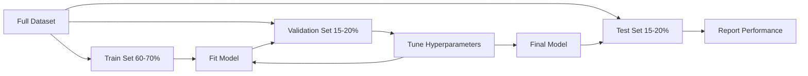

# 模型评估
# 模型评估


> 模型只能像你测量的方式一样好.

> 模型的好坏取决于你如何衡量它.

**Type:** Build | **类型：** 构建
**Languages:** Python
**Prerequisites:** Phase 1 (Probability & Distributions, Statistics for ML), Phase 2 Lessons 1-8 | **前置知识：** Phase 1（概率与分布、统计学），Phase 2 第 1-8 课
**Time:** ~90 minutes | **时间：** 约 90 分钟

## 学习目标

- 从零开始实施K-fold和层次化K-fold交叉验证,并解释为什么对不平衡数据来说层次化是重要的
  从零实现 K 折和分层 K 折交叉验证,解释为什么分层对不平衡数据很重要
- 从零开始计算精度,回忆,F1,AUC-ROC和回归指标 (MSE,RMSE,MAE,R-平方)
  从零计算精确率、召回率、F1、AUC-ROC 和归回指标 ((MSE、RMSE、MAE、R-平方)
- 解释学习曲线,以诊断模型是否存在高度偏见或高度差异性
  解释学习曲线以诊断模型是否存在高偏差或高方差
- 识别包括数据泄漏,误选指标和测试组污染等常见的评估错误
  识别常见评估错误,包括数据泄露,错误标志选择和测试集污染


> **【中文解读】**
> 模型评估回答模型到底好不好――准确率、精确率、召回率、F1、AUC-ROC 是分类指标;MSE、MAE、R^2 是归归指标――交叉验证防止过拟评估――sklearn 中的跨_值_分数/分类_报告――

> **【拓展：模型评估失误导致的生产事故】**
> 亚马逊的招聘AI工具由于评估不充分 (而不是独立测试集) 导致女性候选人系统歧视,最终被迫下架.

## 问题 问题引入

你训练了一个模型,它可以在你的数据上获得95%的准确性.

> 你训练了一个模型. 它在你的数据上获得了95%的准确率.

没有什么可能. 也许没有. 如果您的数据的95%属于一个类,一个模型总是预测该类得到95%的准确性,同时完全无用的. 如果您根据您训练的数据进行评估, 95% 的数字是无意义的,因为模型只记住了答案. 如果你的数据集有时间组件,然后在分开之前随机混动,

> 也许是好,也许是不好. 如果 95% 的数据属于一个类别,总是预测该类型的模型获得 95% 的准确率,但完全没有用. 如果您在训练的数据上评估95% 的数字,这无意义,因为模型只是记住答案.

模型评估是大多数 ML 项目错误的.错误的指标使一个坏模型看起来好.错误的分化让一个模型欺骗.错误的比较让你选择更糟糕的模型.正确的评估不是可选的.这是生产中运行的模型和真正数据看到时失败的模型之间的区别.

> 模型评价是大多数 ML项目错误的地方――错误的标志让坏模型看起来好――错误的分类让模型作弊――错误的比较让你选择更差的模型――正确的评估不是可选的,它是生产中有效的模型与遇到真实数据的失败模型之间的区别――

> **【中文解读】**
> 模型评估最容易犯三个错误: 1) 在训练数据上评估; 2) 使用错误指标; 3) 数据泄露; 3) 测试集信息泄露到训练过程中;

## 概念的核心概念

### 训练,验证,测试



只有三个分区,三个目的:

> 三种划分,三种用途:

- **Training set**模型从这些数据中学习.
  **训练集**模型从中学习.
- **Validation set**模型从来没有根据这些数据进行训练,但你的决定受到影响.
  **验证集**模型从未从此训练过,但你的决策受到影响.
- **Test set**检测结果,然后再回去改变模型,它不再是测试集,它已经成为第二个验证集.
  **测试集**结果是,如果你看了测试性能后再去修改模型,它就不再是测试集.

测试组是您的保证,报告的性能反映了模型在真正未见的数据上表现如何.

> 测试集是您的保留保证,确保报告的性能反映模型在真正未见的数据上的表现.

### 基折叠交叉验证

通过小数据集,单一的火车/验证分断浪费数据并提供噪音估计.K-fold交叉验证使用所有数据用于培训和验证:

> 对于小数据集,单次训练/验证分浪费数据并提供噪音估计.

```mermaid
flowchart TB
    subgraph Fold1["Fold 1"]
        direction LR
        V1["Val"] --- T1a["Train"] --- T1b["Train"] --- T1c["Train"] --- T1d["Train"]
    end
    subgraph Fold2["Fold 2"]
        direction LR
        T2a["Train"] --- V2["Val"] --- T2b["Train"] --- T2c["Train"] --- T2d["Train"]
    end
    subgraph Fold3["Fold 3"]
        direction LR
        T3a["Train"] --- T3b["Train"] --- V3["Val"] --- T3c["Train"] --- T3d["Train"]
    end
    subgraph Fold4["Fold 4"]
        direction LR
        T4a["Train"] --- T4b["Train"] --- T4c["Train"] --- V4["Val"] --- T4d["Train"]
    end
    subgraph Fold5["Fold 5"]
        direction LR
        T5a["Train"] --- T5b["Train"] --- T5c["Train"] --- T5d["Train"] --- V5["Val"]
    end
    Fold1 --> R["Average scores"]
    Fold2 --> R
    Fold3 --> R
    Fold4 --> R
    Fold5 --> R
```



1. 分成K等级的折叠
   将数据分为K 个小相等折
2. 对于每一,将K-1列列在其余列上验证
   对于每一折,在K-1折上训练,在剩余一折上验证
3. 平均K验证分数
   对 K 个验证分数取平均

平均分数比任何单个分数更稳定的估计.

> 平均分数比任何单次分数都更稳定.

> 平均分数比任何单次分数都更稳定.

**Stratified K-fold**您的数据集如果是70%A类和30%B类,每个 Fold 将大致相同的比例. 这对于不平衡的数据集来说很重要,随机分区可能将所有少数样本放在一个 Fold.

> **分层 K 折**保持每折中的类分布. 如果你的数据集是70% A类和30% B类,每折将几乎相同的比例.

> **分层 K 折**保持每折中的类分布. 如果数据集是70% A类和30% B类,每折将几乎相同的比例.

### 类别指标

**Confusion matrix**对于二元分类:

> **混淆矩阵**基础:为二分类:

> **混淆矩阵**基础:为二分类:

|  | Predicted Positive | Predicted Negative |
|--|---|---|
| Actually Positive | True Positive (TP) | False Negative (FN) |
| Actually Negative | False Positive (FP) | True Negative (TN) |

根据此矩阵,其他所有指标是:

> 从这个矩阵推导出所有其他指标:

> 从这个矩阵中,所有其他指标由此推导:

- **Accuracy**= (TP + TN) / (TP + TN + FP + FN).正确预测的部分.在类不平衡时误导.
  **准确率**预测比例――类别不平衡时具有误导性――
- **Precision**假正值是昂贵的 (例如,垃圾邮件过器标记真实电子邮件为垃圾邮件).
  **精确率**假冒代价高时使用的垃圾邮件过器将真实邮件标记为垃圾邮件) ⋅
- **Recall**(敏感性) =TP/ (TP+FN).我们从所有实际阳性中,我们发现了多少?
  **召回率**瘤瘤瘤瘤瘤瘤瘤瘤瘤瘤瘤瘤瘤瘤瘤瘤瘤瘤瘤瘤瘤瘤瘤瘤瘤瘤瘤瘤瘤瘤瘤瘤瘤瘤瘤瘤瘤瘤瘤瘤瘤瘤瘤瘤瘤瘤瘤瘤瘤瘤瘤瘤瘤瘤瘤瘤瘤瘤瘤瘤瘤瘤瘤瘤瘤瘤瘤瘤瘤瘤瘤瘤瘤瘤瘤瘤瘤瘤瘤瘤瘤瘤瘤瘤瘤瘤瘤瘤瘤瘤瘤瘤瘤瘤瘤瘤瘤瘤瘤瘤瘤瘤瘤瘤瘤瘤瘤瘤瘤瘤瘤瘤瘤瘤瘤瘤瘤瘤瘤瘤瘤瘤瘤瘤瘤瘤瘤瘤瘤瘤瘤瘤瘤瘤瘤瘤瘤瘤瘤瘤瘤瘤瘤瘤瘤瘤瘤瘤瘤瘤瘤瘤瘤瘤瘤瘤瘤瘤瘤瘤瘤瘤瘤瘤瘤瘤瘤瘤瘤瘤瘤瘤瘤瘤瘤瘤瘤瘤瘤瘤瘤瘤瘤瘤瘤瘤瘤瘤瘤瘤瘤瘤瘤
- **F1 score**精度和回忆的和平均值. 任何一个都明显主导.
  **F1 分数**= 2 * 精确率 * 召回率 / (精确率 + 召回率) ⋅精确率和召回率调和平均率──在两者中均不清楚占优时平衡两者──
- **AUC-ROC**接收器操作特征曲线下的区域.在各种分类门上绘制真正率与假正率.AUC = 0.5意味着随机猜测,AUC = 1.0意味着完美的分离. 门独立:它测量模型在哪个切割中如何排名正面比负面.
  **AUC-ROC**值不关联:它衡量模型将正样本排在负样本前面的能力,无论你选择什么截值.

### 退缩指标

- **MSE**平均平方错误 = 平均 y_true - y_pred) ^2). 处罚大错误方形. 敏感异常.
  **均方误差 (MSE)**                                                                                                                                                                                                                                                              
- **RMSE**根平均平方错误 = 平方MSE. 与目标变量相同的单位.比MSE更容易解释.
  **均方根误差 (RMSE)**标题: 标题: 标题: 标题: 标题: 标题: 标题: 标题: 标题: 标题: 标题: 标题: 标题: 标题: 标题: 标题: 标题: 标题: 标题: 标题: 标题: 标题: 标题: 标题: 标题: 标题: 标题: 标题: 标题: 标题: 标题: 标题: 标题: 标题: 标题: 标题: 标题: 标题: 标题: 标题: 标题: 标题: 标题: 标题: 标题: 标题: 标题: 标题: 标题: 标题: 标题: 标题: 标题: 标题: 标题: 标题: 标题: 标题: 标题: 标题: 标题: 标题: 标题: 标题: 标题: 标题: 标题: 标题: 标题: 标题: 标题
- **MAE**平均误差 (mean absolute error) =平均误差 (y_true - y_pred = 误差) 均为线性.比MSE更强到异常.
  **平均绝对误差 (MAE)**平均值 (y_true - y_pred_the) ‧ 线性处理所有差异──比MSE更鲁棒于异常值──
- **R-squared**模型的变化分数是完美的.R^2 = 1.0. R^2 = 0.0意味着模型不比总是预测平均值更好.R^2可以是负的,如果模型比平均值差.
  **决定系数 (R-squared)**= 1 - SS_res / SS_tot,其中 SS_res =总量(((y_true - y_pred) ^2),SS_tot =总量(((y_true - y_mean) ^2);;模型解释方差比例──R^2 = 1.0 完美──R^2 = 0.0 表示模型不比始终预测平均值好──R^2 可以为负,如果模型比预测平均值还差──

### 学习曲线

根据培训集体规模,训练和验证分数:

> 绘制训练分数和验证分数随训练集变化曲线:

> 将训练分数和验证分数作为训练集的大函数绘图:

- **High bias (underfitting)**两个曲线都会接近低分数. 添加更多数据就不会有帮助. 你需要一个更复杂的模型.
  **高偏差（欠拟合）**增加更多数据不会有帮助.
- **High variance (overfitting)**培训成绩高,但验证成绩低得多.
  **高方差（过拟合）**训练分数高,但验证分数较低.

### 验证曲线

根据超参数的功能的插图训练和验证分数:

> 绘制训练分数和验证分数随超参数变化的曲线:

> 将训练分数和验证分数作为超参数的函数绘图:

- 复杂度低:两分均低 (不适合)
  复杂度低时:两个分数都低(欠拟合)
- 在正确的复杂性下:两个分数都很高,
  复杂度合适时:两个分数都高且接近
- 高复杂性:培训分数保持高,但验证分数下降 (过度适应)
  复杂度高时:训练分数保持高但验证分数下降(过拟合)

验证分数达到最高的最佳超参数值.

> 最优超参数值是验证分数达到峰值的位置.

> 最优超参数值是验证分数达到峰值的位置.

### 评估常见错误

**Data leakage**测试集中的信息泄露到训练中. 举例:在分开之前将扩展器安装在整个数据集上,包括未来数据在时间序列预测中,使用从目标中衍生的功能. 总是分开先,然后进行预处理.

> **数据泄漏**测试集信息泄漏到训练中. 示例:在分类前对全量数据适合缩放器. 在时间序列预测中包含未来数据.

**Class imbalance**交易的99%是合法,1%是欺诈.一个总是预测"合法"的模型得到99%的准确性.使用精度,召回,F1,或AUC-ROC.

> **类别不平衡**总体预测"合法"的模型获得99%的准确率,应使用精确率,召回率,F1或AUC-ROC.

**Wrong metric**您需要优化召回 (医疗诊断) 的准确性,或者优化RMSE,当数据有重异值 (使用MAE代替).

> **错误指标**医疗诊断的优化率,或数据有重尾异常值时优化RMSE

**Not using stratified splits**随机分区可能会使验证文件中很少的少数样本,从而产生不稳定的估计.

> **不使用分层划分**随着随机分类可能会极少数类型的样本被放入验证折扣中,给出不稳定的估计.

**Testing too often**测试组的使用量:每次检查测试性能和调整,你会过度适应测试组.

> **测试过于频繁**测试集的性能并调整,你就对测试集过适合了.

## 建立它,实现它.

> **【中文解读】**
> 从零实现交叉验证 (K-fold 和分层K-fold) 分类指标 (精确率,召回率,F1、AUC-ROC) 和归归指标 (MSE、RMSE、MAE、R2) 交叉验证是评估模型性能的标准方法,分层K-fold 确保每个折中类比率一致,对不平衡数据至关重要.

> **【拓展：学习曲线——诊断模型问题的利器】**
> 学习曲线 (学习曲线) 绘制训练误差和验证误差随着训练数据量变化的趋势,是诊断高偏差/高方差问题的直观工具.
```figure
precision-recall-threshold
```

## 建立它

### 步骤1: 列车/验证/测试分区

```python
import random
import math


def train_val_test_split(X, y, train_ratio=0.6, val_ratio=0.2, seed=42):
    random.seed(seed)
    n = len(X)
    indices = list(range(n))
    random.shuffle(indices)

    train_end = int(n * train_ratio)
    val_end = int(n * (train_ratio + val_ratio))

    train_idx = indices[:train_end]
    val_idx = indices[train_end:val_end]
    test_idx = indices[val_end:]

    X_train = [X[i] for i in train_idx]
    y_train = [y[i] for i in train_idx]
    X_val = [X[i] for i in val_idx]
    y_val = [y[i] for i in val_idx]
    X_test = [X[i] for i in test_idx]
    y_test = [y[i] for i in test_idx]

    return X_train, y_train, X_val, y_val, X_test, y_test
```

### 步骤2:K-fold和层次的K-fold 交叉验证

```python
def kfold_split(n, k=5, seed=42):
    random.seed(seed)
    indices = list(range(n))
    random.shuffle(indices)

    fold_size = n // k
    folds = []

    for i in range(k):
        start = i * fold_size
        end = start + fold_size if i < k - 1 else n
        val_idx = indices[start:end]
        train_idx = indices[:start] + indices[end:]
        folds.append((train_idx, val_idx))

    return folds


def stratified_kfold_split(y, k=5, seed=42):
    random.seed(seed)

    class_indices = {}
    for i, label in enumerate(y):
        class_indices.setdefault(label, []).append(i)

    for label in class_indices:
        random.shuffle(class_indices[label])

    folds = [{"train": [], "val": []} for _ in range(k)]

    for label, indices in class_indices.items():
        fold_size = len(indices) // k
        for i in range(k):
            start = i * fold_size
            end = start + fold_size if i < k - 1 else len(indices)
            val_part = indices[start:end]
            train_part = indices[:start] + indices[end:]
            folds[i]["val"].extend(val_part)
            folds[i]["train"].extend(train_part)

    return [(f["train"], f["val"]) for f in folds]


def cross_validate(X, y, model_fn, k=5, metric_fn=None, stratified=False):
    n = len(X)

    if stratified:
        folds = stratified_kfold_split(y, k)
    else:
        folds = kfold_split(n, k)

    scores = []
    for train_idx, val_idx in folds:
        X_train = [X[i] for i in train_idx]
        y_train = [y[i] for i in train_idx]
        X_val = [X[i] for i in val_idx]
        y_val = [y[i] for i in val_idx]

        model = model_fn()
        model.fit(X_train, y_train)
        predictions = [model.predict(x) for x in X_val]

        if metric_fn:
            score = metric_fn(y_val, predictions)
        else:
            score = sum(1 for yt, yp in zip(y_val, predictions) if yt == yp) / len(y_val)
        scores.append(score)

    return scores
```

### 步骤3:混矩阵和分类指标

> 第三步:混矩阵和分类指标――从零实现TP/TN/FP/FN计数,再推导出准确率、精确率、召回率、F1。ROC曲线扫描所有可能值,记录每点的 (FPR,TPR),AUC是曲线下面积(用梯形法计算)

```python
def confusion_matrix(y_true, y_pred):
    tp = sum(1 for yt, yp in zip(y_true, y_pred) if yt == 1 and yp == 1)
    tn = sum(1 for yt, yp in zip(y_true, y_pred) if yt == 0 and yp == 0)
    fp = sum(1 for yt, yp in zip(y_true, y_pred) if yt == 0 and yp == 1)
    fn = sum(1 for yt, yp in zip(y_true, y_pred) if yt == 1 and yp == 0)
    return tp, tn, fp, fn


def accuracy(y_true, y_pred):
    tp, tn, fp, fn = confusion_matrix(y_true, y_pred)
    total = tp + tn + fp + fn
    return (tp + tn) / total if total > 0 else 0.0


def precision(y_true, y_pred):
    tp, tn, fp, fn = confusion_matrix(y_true, y_pred)
    return tp / (tp + fp) if (tp + fp) > 0 else 0.0


def recall(y_true, y_pred):
    tp, tn, fp, fn = confusion_matrix(y_true, y_pred)
    return tp / (tp + fn) if (tp + fn) > 0 else 0.0


def f1_score(y_true, y_pred):
    p = precision(y_true, y_pred)
    r = recall(y_true, y_pred)
    return 2 * p * r / (p + r) if (p + r) > 0 else 0.0


def roc_curve(y_true, y_scores):
    thresholds = sorted(set(y_scores), reverse=True)
    tpr_list = []
    fpr_list = []

    total_positives = sum(y_true)
    total_negatives = len(y_true) - total_positives

    for threshold in thresholds:
        y_pred = [1 if s >= threshold else 0 for s in y_scores]
        tp = sum(1 for yt, yp in zip(y_true, y_pred) if yt == 1 and yp == 1)
        fp = sum(1 for yt, yp in zip(y_true, y_pred) if yt == 0 and yp == 1)

        tpr = tp / total_positives if total_positives > 0 else 0.0
        fpr = fp / total_negatives if total_negatives > 0 else 0.0

        tpr_list.append(tpr)
        fpr_list.append(fpr)

    return fpr_list, tpr_list, thresholds


def auc_roc(y_true, y_scores):
    fpr_list, tpr_list, _ = roc_curve(y_true, y_scores)

    pairs = sorted(zip(fpr_list, tpr_list))
    fpr_sorted = [p[0] for p in pairs]
    tpr_sorted = [p[1] for p in pairs]

    area = 0.0
    for i in range(1, len(fpr_sorted)):
        width = fpr_sorted[i] - fpr_sorted[i - 1]
        height = (tpr_sorted[i] + tpr_sorted[i - 1]) / 2
        area += width * height

    return area
```

### 步骤4:退缩指标

> 第四步:归归指标――MSE (平均方差) 对大差异二次惩罚、对异常值敏感;RMSE与目标单位一致易解释;MAE (平均绝对差异) 线性处理、对异常值鲁棒;R2 (决定系数) = 1 - 残差平方和 / 总平方和,表示模型解释了多少方差──

```python
def mse(y_true, y_pred):
    n = len(y_true)
    return sum((yt - yp) ** 2 for yt, yp in zip(y_true, y_pred)) / n


def rmse(y_true, y_pred):
    return math.sqrt(mse(y_true, y_pred))


def mae(y_true, y_pred):
    n = len(y_true)
    return sum(abs(yt - yp) for yt, yp in zip(y_true, y_pred)) / n


def r_squared(y_true, y_pred):
    mean_y = sum(y_true) / len(y_true)
    ss_res = sum((yt - yp) ** 2 for yt, yp in zip(y_true, y_pred))
    ss_tot = sum((yt - mean_y) ** 2 for yt in y_true)
    if ss_tot == 0:
        return 0.0
    return 1.0 - ss_res / ss_tot
```

### 步骤5:学习曲线

> 第五步:学习曲线――逐步增加训练数据量,记录训练分数和验证分数――两条曲线都低→高偏差(不合适);训练高但验证低→高方差(过合适)――这是诊断模型问题的最直观的工具――

```python
def learning_curve(X, y, model_fn, metric_fn, train_sizes=None, val_ratio=0.2, seed=42):
    random.seed(seed)
    n = len(X)
    indices = list(range(n))
    random.shuffle(indices)

    val_size = int(n * val_ratio)
    val_idx = indices[:val_size]
    pool_idx = indices[val_size:]

    X_val = [X[i] for i in val_idx]
    y_val = [y[i] for i in val_idx]

    if train_sizes is None:
        train_sizes = [int(len(pool_idx) * r) for r in [0.1, 0.2, 0.4, 0.6, 0.8, 1.0]]

    train_scores = []
    val_scores = []

    for size in train_sizes:
        subset = pool_idx[:size]
        X_train = [X[i] for i in subset]
        y_train = [y[i] for i in subset]

        model = model_fn()
        model.fit(X_train, y_train)

        train_pred = [model.predict(x) for x in X_train]
        val_pred = [model.predict(x) for x in X_val]

        train_scores.append(metric_fn(y_train, train_pred))
        val_scores.append(metric_fn(y_val, val_pred))

    return train_sizes, train_scores, val_scores
```

### 步骤 6: 简单的测试分类器,加上完整的演示

> 第六步:一个简单的逻辑归归归分类器,用于测试评估代码――手动实现前向传播(线性组合 + sigmoid) 梯度下降更新――然后使用前面定义的交叉验证、指标、学习曲线完整评估这个模型――

```python
class SimpleLogistic:
    def __init__(self, lr=0.1, epochs=100):
        self.lr = lr
        self.epochs = epochs
        self.weights = None
        self.bias = 0.0

    def sigmoid(self, z):
        z = max(-500, min(500, z))
        return 1.0 / (1.0 + math.exp(-z))

    def fit(self, X, y):
        n_features = len(X[0])
        self.weights = [0.0] * n_features
        self.bias = 0.0

        for _ in range(self.epochs):
            for xi, yi in zip(X, y):
                z = sum(w * x for w, x in zip(self.weights, xi)) + self.bias
                pred = self.sigmoid(z)
                error = yi - pred
                for j in range(n_features):
                    self.weights[j] += self.lr * error * xi[j]
                self.bias += self.lr * error

    def predict_proba(self, x):
        z = sum(w * xi for w, xi in zip(self.weights, x)) + self.bias
        return self.sigmoid(z)

    def predict(self, x):
        return 1 if self.predict_proba(x) >= 0.5 else 0


class SimpleLinearRegression:
    def __init__(self, lr=0.001, epochs=200):
        self.lr = lr
        self.epochs = epochs
        self.weights = None
        self.bias = 0.0

    def fit(self, X, y):
        n_features = len(X[0])
        self.weights = [0.0] * n_features
        self.bias = 0.0
        n = len(X)

        for _ in range(self.epochs):
            for xi, yi in zip(X, y):
                pred = sum(w * x for w, x in zip(self.weights, xi)) + self.bias
                error = yi - pred
                for j in range(n_features):
                    self.weights[j] += self.lr * error * xi[j] / n
                self.bias += self.lr * error / n

    def predict(self, x):
        return sum(w * xi for w, xi in zip(self.weights, x)) + self.bias


def standardize(values):
    n = len(values)
    mean = sum(values) / n
    var = sum((v - mean) ** 2 for v in values) / n
    std = math.sqrt(var) if var > 0 else 1.0
    return [(v - mean) / std for v in values], mean, std


def make_classification_data(n=300, seed=42):
    random.seed(seed)
    X = []
    y = []
    for _ in range(n):
        x1 = random.gauss(0, 1)
        x2 = random.gauss(0, 1)
        label = 1 if (x1 + x2 + random.gauss(0, 0.5)) > 0 else 0
        X.append([x1, x2])
        y.append(label)
    return X, y


def make_regression_data(n=200, seed=42):
    random.seed(seed)
    X = []
    y = []
    for _ in range(n):
        x1 = random.uniform(0, 10)
        x2 = random.uniform(0, 5)
        target = 3 * x1 + 2 * x2 + random.gauss(0, 2)
        X.append([x1, x2])
        y.append(target)
    return X, y


def make_imbalanced_data(n=300, minority_ratio=0.05, seed=42):
    random.seed(seed)
    X = []
    y = []
    for _ in range(n):
        if random.random() < minority_ratio:
            x1 = random.gauss(3, 0.5)
            x2 = random.gauss(3, 0.5)
            label = 1
        else:
            x1 = random.gauss(0, 1)
            x2 = random.gauss(0, 1)
            label = 0
        X.append([x1, x2])
        y.append(label)
    return X, y


if __name__ == "__main__":
    X_clf, y_clf = make_classification_data(300)

    print("=== Train/Validation/Test Split ===")
    X_train, y_train, X_val, y_val, X_test, y_test = train_val_test_split(X_clf, y_clf)
    print(f"  Train: {len(X_train)}, Val: {len(X_val)}, Test: {len(X_test)}")
    print(f"  Train class distribution: {sum(y_train)}/{len(y_train)} positive")
    print(f"  Val class distribution: {sum(y_val)}/{len(y_val)} positive")

    # 主程序：完整演示训练/验证/测试划分、分类指标（含混淆矩阵、F1、AUC-ROC）、K 折交叉验证、回归指标（MSE/RMSE/MAE/R²）、学习曲线、不平衡数据评估。每个环节都展示具体数值，让评估方法变得具体。

    model = SimpleLogistic(lr=0.1, epochs=200)
    model.fit(X_train, y_train)

    print("\n=== Classification Metrics ===")
    y_pred = [model.predict(x) for x in X_test]
    tp, tn, fp, fn = confusion_matrix(y_test, y_pred)
    print(f"  Confusion matrix: TP={tp}, TN={tn}, FP={fp}, FN={fn}")
    print(f"  Accuracy:  {accuracy(y_test, y_pred):.4f}")
    print(f"  Precision: {precision(y_test, y_pred):.4f}")
    print(f"  Recall:    {recall(y_test, y_pred):.4f}")
    print(f"  F1 Score:  {f1_score(y_test, y_pred):.4f}")

    y_scores = [model.predict_proba(x) for x in X_test]
    auc = auc_roc(y_test, y_scores)
    print(f"  AUC-ROC:   {auc:.4f}")

    print("\n=== K-Fold Cross-Validation (K=5) ===")
    cv_scores = cross_validate(
        X_clf, y_clf,
        model_fn=lambda: SimpleLogistic(lr=0.1, epochs=200),
        k=5,
        metric_fn=accuracy,
    )
    mean_cv = sum(cv_scores) / len(cv_scores)
    std_cv = math.sqrt(sum((s - mean_cv) ** 2 for s in cv_scores) / len(cv_scores))
    print(f"  Fold scores: {[round(s, 4) for s in cv_scores]}")
    print(f"  Mean: {mean_cv:.4f} (+/- {std_cv:.4f})")

    print("\n=== Stratified K-Fold Cross-Validation (K=5) ===")
    strat_scores = cross_validate(
        X_clf, y_clf,
        model_fn=lambda: SimpleLogistic(lr=0.1, epochs=200),
        k=5,
        metric_fn=accuracy,
        stratified=True,
    )
    strat_mean = sum(strat_scores) / len(strat_scores)
    strat_std = math.sqrt(sum((s - strat_mean) ** 2 for s in strat_scores) / len(strat_scores))
    print(f"  Fold scores: {[round(s, 4) for s in strat_scores]}")
    print(f"  Mean: {strat_mean:.4f} (+/- {strat_std:.4f})")

    print("\n=== Imbalanced Data: Why Accuracy Lies ===")
    X_imb, y_imb = make_imbalanced_data(300, minority_ratio=0.05)
    positives = sum(y_imb)
    print(f"  Class distribution: {positives} positive, {len(y_imb) - positives} negative ({positives/len(y_imb)*100:.1f}% positive)")

    always_negative = [0] * len(y_imb)
    print(f"  Always-negative baseline:")
    print(f"    Accuracy:  {accuracy(y_imb, always_negative):.4f}")
    print(f"    Precision: {precision(y_imb, always_negative):.4f}")
    print(f"    Recall:    {recall(y_imb, always_negative):.4f}")
    print(f"    F1 Score:  {f1_score(y_imb, always_negative):.4f}")

    X_tr_i, y_tr_i, X_v_i, y_v_i, X_te_i, y_te_i = train_val_test_split(X_imb, y_imb)
    model_imb = SimpleLogistic(lr=0.5, epochs=500)
    model_imb.fit(X_tr_i, y_tr_i)
    y_pred_imb = [model_imb.predict(x) for x in X_te_i]
    print(f"\n  Trained model on imbalanced data:")
    print(f"    Accuracy:  {accuracy(y_te_i, y_pred_imb):.4f}")
    print(f"    Precision: {precision(y_te_i, y_pred_imb):.4f}")
    print(f"    Recall:    {recall(y_te_i, y_pred_imb):.4f}")
    print(f"    F1 Score:  {f1_score(y_te_i, y_pred_imb):.4f}")

    print("\n=== Regression Metrics ===")
    X_reg, y_reg = make_regression_data(200)

    col0 = [x[0] for x in X_reg]
    col1 = [x[1] for x in X_reg]
    col0_s, m0, s0 = standardize(col0)
    col1_s, m1, s1 = standardize(col1)
    X_reg_scaled = [[col0_s[i], col1_s[i]] for i in range(len(X_reg))]

    X_tr_r, y_tr_r, X_v_r, y_v_r, X_te_r, y_te_r = train_val_test_split(X_reg_scaled, y_reg)
    reg_model = SimpleLinearRegression(lr=0.01, epochs=500)
    reg_model.fit(X_tr_r, y_tr_r)
    y_pred_r = [reg_model.predict(x) for x in X_te_r]

    print(f"  MSE:       {mse(y_te_r, y_pred_r):.4f}")
    print(f"  RMSE:      {rmse(y_te_r, y_pred_r):.4f}")
    print(f"  MAE:       {mae(y_te_r, y_pred_r):.4f}")
    print(f"  R-squared: {r_squared(y_te_r, y_pred_r):.4f}")

    mean_baseline = [sum(y_tr_r) / len(y_tr_r)] * len(y_te_r)
    print(f"\n  Mean baseline:")
    print(f"    MSE:       {mse(y_te_r, mean_baseline):.4f}")
    print(f"    R-squared: {r_squared(y_te_r, mean_baseline):.4f}")

    print("\n=== Learning Curve ===")
    sizes, train_sc, val_sc = learning_curve(
        X_clf, y_clf,
        model_fn=lambda: SimpleLogistic(lr=0.1, epochs=200),
        metric_fn=accuracy,
    )
    print(f"  {'Size':>6} {'Train':>8} {'Val':>8}")
    for s, tr, va in zip(sizes, train_sc, val_sc):
        print(f"  {s:>6} {tr:>8.4f} {va:>8.4f}")

    print("\n=== Statistical Model Comparison ===")
    model_a_scores = cross_validate(
        X_clf, y_clf,
        model_fn=lambda: SimpleLogistic(lr=0.1, epochs=100),
        k=5, metric_fn=accuracy,
    )
    model_b_scores = cross_validate(
        X_clf, y_clf,
        model_fn=lambda: SimpleLogistic(lr=0.1, epochs=500),
        k=5, metric_fn=accuracy,
    )
    diffs = [a - b for a, b in zip(model_a_scores, model_b_scores)]
    mean_diff = sum(diffs) / len(diffs)
    std_diff = math.sqrt(sum((d - mean_diff) ** 2 for d in diffs) / len(diffs))
    t_stat = mean_diff / (std_diff / math.sqrt(len(diffs))) if std_diff > 0 else 0.0
    print(f"  Model A (100 epochs) mean: {sum(model_a_scores)/len(model_a_scores):.4f}")
    print(f"  Model B (500 epochs) mean: {sum(model_b_scores)/len(model_b_scores):.4f}")
    print(f"  Mean difference: {mean_diff:.4f}")
    print(f"  Paired t-statistic: {t_stat:.4f}")
    print(f"  (|t| > 2.78 for significance at p<0.05 with df=4)")
```

## 用它实现框架

通过 scikit-learn,评估是工作流程中内置的:

> 使用小学学习,评估内置于工作流中:

```python
from sklearn.model_selection import cross_val_score, StratifiedKFold, learning_curve
from sklearn.metrics import (
    accuracy_score, precision_score, recall_score, f1_score,
    roc_auc_score, confusion_matrix, mean_squared_error, r2_score,
)
from sklearn.linear_model import LogisticRegression

model = LogisticRegression()
scores = cross_val_score(model, X, y, cv=StratifiedKFold(5), scoring="f1")
```

从零开始的版本显示了交叉验证的作用 (没有魔法,只是前循环和指数跟踪),每个指标是如何计算的 (仅计算TP/FP/TN/FN),以及为什么层次化是重要的 (保留每个折叠中的类比).图书馆版本增加了平行性,更多的得分选项和与管道的集成.

> 从零版本准确展示交叉验证做了什么(没有魔法,只是循环和索引追踪) ‧每个指标如何计算(只是计数TP/FP/TN/FN) ‧以及分层为什么重要(保持每折中的类别比例) ‧库版本增加并行性、更多评分选项和管线集成──

## 运送它.

这一课产生了:
- `outputs/skill-evaluation.md`- 对于分类和回归模型的评估战略的技能

> 本课产出:
> - `outputs/skill-evaluation.md`- 涵盖分类和归归模型评估策略的技能

> **【拓展：A/B 测试——模型评估的终极标准】**
> 在工业界,离线评估指标 (准确率,AUC等) 只是参考,真正的评估是在线上A/B测试.谷歌每年运行超过10,000次A/B测试来评估搜索算法改进.Netflix使用A/B测试决定推算法是否上线.Uber使用A/B测试评估动态定价策略.A/B测试的核心是随机分流和统计显著性测试.

> **【中文解读】**
> 曲线绘制不同值下的TPR (真率) 对于 FPR (假正率),AUC 是曲线下面积 (0.5=随机,1.0=完美) ⋅AUPRC (精确率-召回率曲线下面积) 在不平衡数据上比AUC-ROC更有信息量――MCC (马修斯相关系数) 是不平衡数据上的综合指标,考虑到混值矩阵的全部四个......

## 练习题

1. 执行精度回忆曲线:图形精度与不同门的回忆.计算平均精度 (PR曲线下的区域).在不平衡的数据集上将PR曲线与ROC曲线进行比较,并解释每一个曲线在何时更有信息性.
   1. 实现精确率-召回率曲线:在不同值下绘制精确率与召回率――计算平均精确率(PR 曲线下面积)――在不平衡数据集中将PR 曲线与ROC 曲线进行比较,解释各自何时有更多信息――
2. 建立一个嵌入式交叉验证循环:外部循环评估模型性能,内部循环调整超参数. 使用它来公平地比较两个模型,而不会泄露验证数据到评估中.
   2. 构建嵌套交叉验证循环:外循环评估模型性能,内循环调优超参数――使用它公平比较两个模型,不将验证数据泄漏到评估中――
3. 执行模型比较的变量测试:混动标签,重训,测量性能.重复100次构建零分布.计算观察模型性能的p值与这种分布.
   3. 实现模型比较的置换检验:打乱标签,重新训练,测量性能──重复 100次建立零分布──计算观测模型性能对这个分布的p值──

## 关键词 快速查找表

| Term | What people say | What it actually means |
|------|----------------|----------------------|
| Overfitting | "Memorizing the training data" | The model captures noise in the training data, performing well on training but poorly on unseen data |
| Cross-validation | "Testing on different subsets" | Systematically rotating which portion of data is used for validation, averaging results across all rotations |
| Precision | "How many predicted positives are correct" | TP / (TP + FP): the fraction of positive predictions that are actually positive |
| Recall | "How many actual positives we found" | TP / (TP + FN): the fraction of actual positives that were correctly identified |
| AUC-ROC | "How well the model separates classes" | The area under the curve of true positive rate vs false positive rate across all thresholds, from 0.5 (random) to 1.0 (perfect) |
| R-squared | "How much variance is explained" | 1 - (sum of squared residuals / total sum of squares): the fraction of target variance captured by the model |
| Data leakage | "The model cheated" | Using information during training that would not be available at prediction time, leading to optimistic evaluation |
| Learning curve | "How performance changes with more data" | A plot of training and validation scores vs training set size, revealing underfitting or overfitting |
| Stratified split | "Keeping class ratios balanced" | Splitting data so each subset has the same proportion of each class as the full dataset |

## 继续阅读 继续阅读

- [scikit-learn Model Selection Guide](https://scikit-learn.org/stable/model_selection.html)- 综合参考跨验证,指标和超参数调整
  [scikit-learn 模型选择指南](https://scikit-learn.org/stable/model_selection.html)- 交叉验证,指标和超参数调优的全面参考
- [Beyond Accuracy: Precision and Recall (Google ML Crash Course)](https://developers.google.com/machine-learning/crash-course/classification/precision-and-recall)- 通过互动示例进行清晰的解释
  [Beyond Accuracy: Precision and Recall (Google ML Crash Course)](https://developers.google.com/machine-learning/crash-course/classification/precision-and-recall)- 带交互示例的清晰解释
- [A Survey of Cross-Validation Procedures (Arlot & Celisse, 2010)](https://projecteuclid.org/journals/statistics-surveys/volume-4/issue-none/A-survey-of-cross-validation-procedures-for-model-selection/10.1214/09-SS054.full)- 严格处理不同简历策略的有效性以及为什么
  [A Survey of Cross-Validation Procedures (Arlot & Celisse, 2010)](https://projecteuclid.org/journals/statistics-surveys/volume-4/issue-none/A-survey-of-cross-validation-procedures-for-model-selection/10.1214/09-SS054.full)- 不同交叉验证策略何时有效的严格分析
