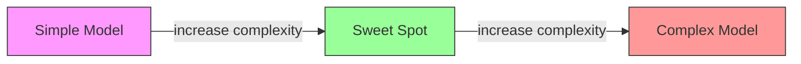
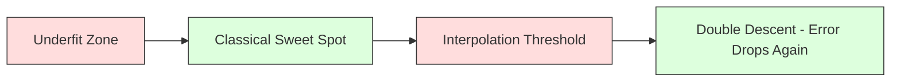
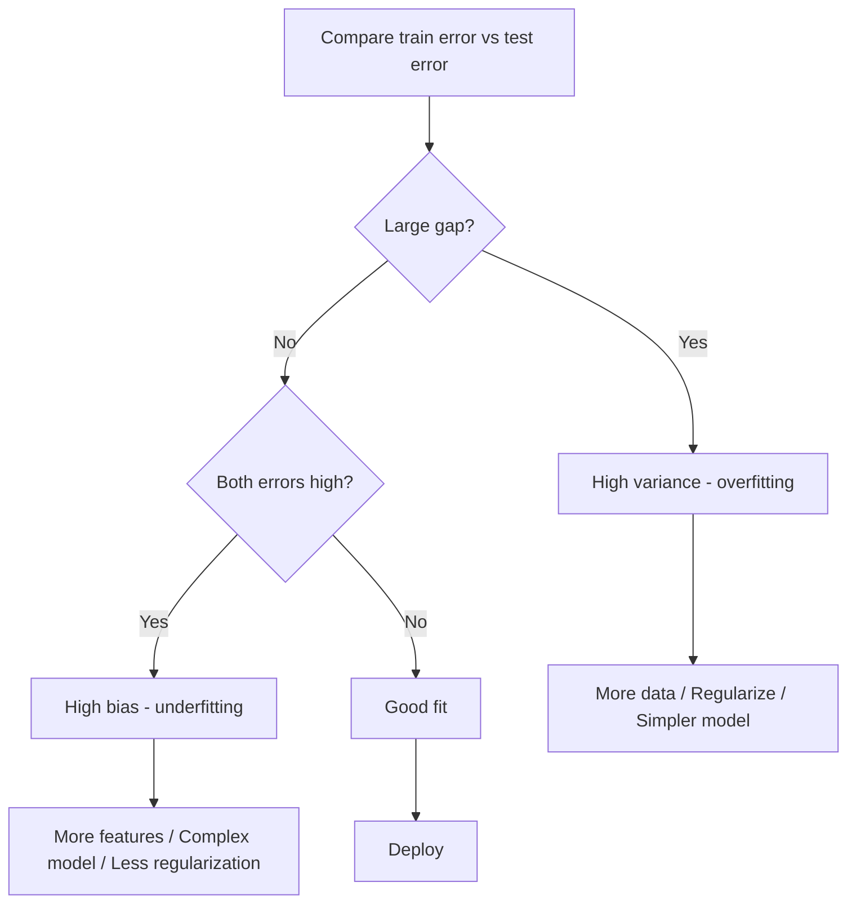
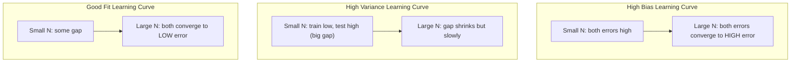
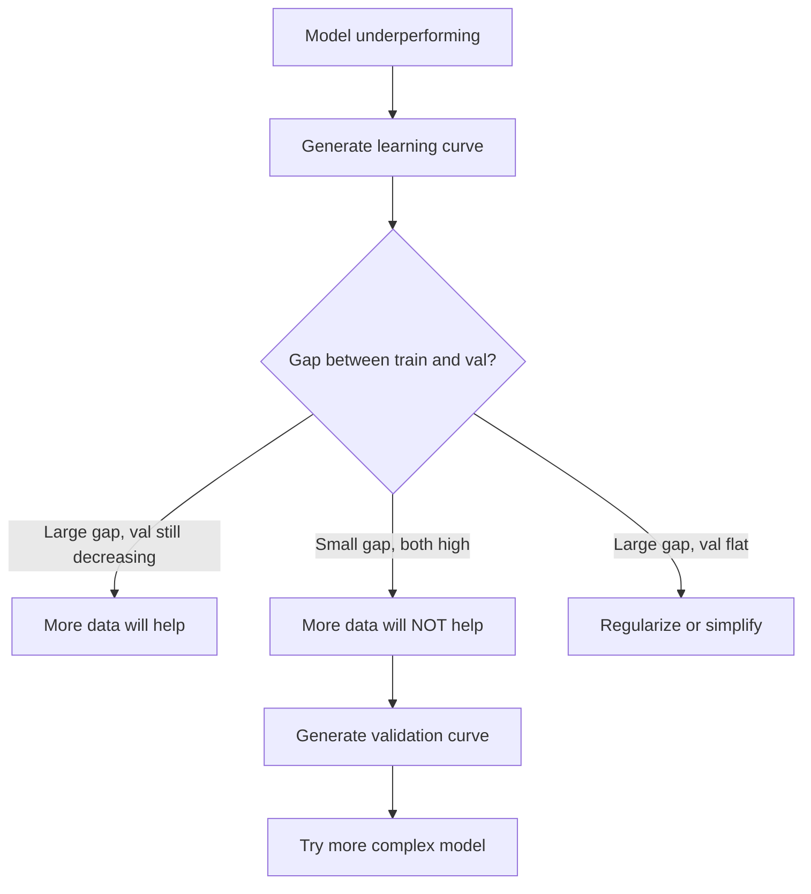

# 偏差差差异
# 偏差-方差权衡


> 每个模型错误都来自三个来源之一:偏见,变异或噪音.

> 每个模型差异来自三个来源之一:偏差,方差或噪音.

**Type:** Learn | **类型：** 学习
**Language:**子**语言：**字符串
**Prerequisites:** Phase 2, Lessons 01-09 (ML basics, regression, classification, evaluation) | **前置知识：** Phase 2 第 1-9 课（ML 基础、回归、分类、评估）
**Time:** ~75 minutes | **时间：** 约 75 分钟

## 学习目标

- 推导预期预测错误的偏差变量分解,并解释不可减噪噪音的作用
  推导期望预测差差的偏差-方差分解,解释不可约的噪音的作用
- 诊断模型是否存在高度偏见或高度差异性,使用训练和测试错误模式
  使用训练误差和测试误差模式诊断模型是否存在高偏差或高方差
- 解释如何调整技术 (L1,L2,退出,提前停止) 交易偏差
  解释正则化技术 (L1、L2、Dropout、早停) 如何衡量偏差与方差之间的权衡
- 实施对越来越复杂的模型的偏差差差异交易的实验
  实现可视化模型复杂性增加时偏差-差差权衡的实验


> **【中文解读】**
> 偏差 (模型太简单不合适) 对于方差 (模型太复杂过合适) 的平衡.

> **【拓展：偏差-方差在深度学习中的新理解】**
> 经典理论认为增大模型会增加高方差,但深度学习存在"双重下降" (双重下降) 现象:模型超过"插值值" (能完美记忆训练数据) 之后,测试误差反过来再次下降.

## 问题 问题引入

你训练了一个模型,它有一些测试数据上的错误.

> 你训练了一个模型.它在测试数据上有一些错误.

如果你的模型太简单 (在曲线数据集上线性回归),它将始终错过真实模式.这是偏见.如果你的模型太复杂 (在15个数据点上20度多项),它将完美地适应训练数据,但给出了非常不同的预测.这是变异.

> 如果你的模型太简单了 (在曲线数据集中使用线性归归归),它会持续偏离真实模式――这就是偏差――如果你的模型太复杂了 (在15个数据点上使用20多项式),它会完全适合训练数据,但在新数据上给出了极其不同的预测――这就是偏差――

对于一个固定模型容量,你不能同时减少两者. 推偏差下降,变异增加. 推偏差下降,变异增加. 了解这种折衷是机器学习中最有用的诊断技能. 它告诉你是否要让你的模型变得更复杂或更少复杂,是否要获得更多数据或工程更好的功能,是否要更少或更少地规范.

> 对于固定的模型容量,你不能同时最小化两者――压低偏差,方差就上升――压低偏差,偏差就上升――理解这种权衡是机器学习中最有用的诊断技能――它告诉你是否应该让模型变得更复杂或更简单,是否应该获得更多数据或更好的工程特征,是否应该正规化更多或更少――

> **【中文解读】**
> 差差 = 差差2 + 差+ 不可约噪声――偏差来自模型的错误假设――如用直线拟合曲线),差来自对训练数据波动的过度敏感――诊断方法:训练误差高+测试误差高→高偏差(不适合);训练误差低+测试误差高→高方差(过适合)――对应的解决方案完全不同――

## 概念的核心概念

### 偏见:系统性错误

偏见测量模型的平均预测与真实值有多远.如果你从同一分布中训练了同一模型,并且平均预测,偏见是平均和真相之间的差距.

> 偏差衡量模型的平均预测和真实值之间的差距.如果你从同一分布中抽取许多不同的训练集中训练同一个模型并平均预测结果,偏差是该平均值和真实值之间的差距.

模型太刚硬了,无法捕捉到真实模式.一个合适的直线永远会错过曲线,不管你给它多少数据.这是不合适的.

> 高偏差意味着模型太化了,无法捕捉到真实模式――直线配对物线总是偏离曲线,无论你给它多少数据――这就是不配对――

```
High bias (underfitting):
  Model always predicts roughly the same wrong thing.
  Training error: HIGH
  Test error: HIGH
  Gap between them: SMALL
```

### 变异:对培训数据的敏感性

变化测量了你在训练不同子集数据时预测变化程度.如果训练集中的小变化导致模型发生大变化,则变化很高.

> 差距衡量在不同数据集上训练时预测结果变化的程度.

模型在训练数据中适应噪音,而不是底层信号.一个20度多项字符将穿过每个训练点,但在它们之间会狂动.这是过度适应.

> 高方差意味着模型在适应训练数据中的噪音,而不是潜在信号. 一个20次多项式会穿过每个训练点,但它们之间发生剧烈的震荡.

```
High variance (overfitting):
  Model fits training data perfectly but fails on new data.
  Training error: LOW
  Test error: HIGH
  Gap between them: LARGE
```

### 腐烂

对于任何点 x,在二次损失下预期预测错误完全分解:

> 对于任意点 x,在平方损失下,期望预测误差精确分解为:

```
Expected Error = Bias^2 + Variance + Irreducible Noise

where:
  Bias^2   = (E[f_hat(x)] - f(x))^2
  Variance = E[(f_hat(x) - E[f_hat(x)])^2]
  Noise    = E[(y - f(x))^2]             (sigma^2)
```

- `f(x)`是真正的函数
  `f(x)`是真实函数
- `f_hat(x)`是你的模型的预测
  `f_hat(x)`是你模型的预测
- `E[...]`是对不同培训组的预期
  `E[...]`是对不同训练集的期望
- `y`是观察到的标签 (真实函数加噪音)
  `y`是观测标签(真实函数加噪声)

噪音术语是不可减轻的. 任何模型都能在噪音数据上比sigma^2更好. 你的工作是找到偏差^2和变异之间的正确平衡.

> 噪音项是不可约束的. 没有任何模型可以在含噪音数据上比sigma^2做得更好. 你的任务是找到偏差^2和方差之间的正确平衡.

### 模型复杂性与错误



经典的U形曲线:

> 经典的U 形曲线:

| Complexity | Bias | Variance | Total Error |
|-----------|------|----------|-------------|
| Too low | HIGH | LOW | HIGH (underfitting) |
| Just right | MODERATE | MODERATE | LOWEST |
| Too high | LOW | HIGH | HIGH (overfitting) |

| 复杂度 | 偏差 | 方差 | 总误差 |
|--------|------|------|--------|
| 太低 | 高 | 低 | 高（欠拟合） |
| 刚好 | 中等 | 中等 | 最低 |
| 太高 | 低 | 高 | 高（过拟合） |

### 规范化作为偏差变异控制

规律化故意增加偏差,以减少变异性. 它限制模型,

> 正则化故意增加偏差以减少方差.

- **L2 (Ridge):**缩小所有重量到零,保持所有特征,但减少它们的影响.
  **L2 (Ridge)**:将所有权重回零缩小,保留所有特征,但减少它们的影响.
- **L1 (Lasso):**按数量按数量按数量按数量按数量按数量按数量按数量按数量按数量按数量按数量按数量按数量按数量按数量按数量按数量按数量按数量按数量按数量按数量按数量按数量按数量按数量按数量按数量按数量按数量按数量按数量按数量按数量按数量按数量按数量按数量按数量按数量按数按数按数按数按数按数按数按数按数按数按数量按数量按数量按数量按数量按数量按数量按数量按数量按数量按数量按数量按数量按数量按数量按数量按数量按数量按数量按数量按数量按数量按数量按数量按数量按数量按数量按数量按数量按数按数量按数按数按数按数按数按数按数按数按数按数按数按数按数按数按数按数按数按数按数按数按数按数按数按数按数按数按数按数按数按数按数按数按数按数按数按数按数按数按数按数按数按数按数按数按数按数按数按数按数按数按数按数按数按数按数按数量按数按数按数量按数量按数量按数量按数量按数量按数量按数量按数量按数量按数量按数量按数量按数量按数量按数量按数量按数量按数量按数量按数量按数量按数量按数量按数量按数量按数量按数量按数量按数量按数量按数量按数量按数量按数量按数量按数量按数量按数量按数量按数量按数量按数量按数量按数量按数量按数量按数量按数量按数量按数量按数量按
  **L1 (Lasso)**执行特征选择.
- **Dropout:**随机除神经元,在训练中,强迫过剩的表达.
  **Dropout**训练时随机禁用神经元──迫使冗余表示──
- **Early stopping:**在模型完全适应训练数据之前停止训练.
  **早停**模型完全适合训练数据之前停止训练――

规律化强度 (lambda,脱节率,时间数) 直接控制你坐在偏差变异曲线上的位置.

> 正则化强度 (正则化强度) 直接控制你在偏差-方差曲线上的位置.

### 双代:现代观点

经典理论说:在甜点点之后,复杂性总是很痛苦.但自2019年以来的研究表明了一些意想不到的东西.如果你继续增加模型容量远远超过插射门 (模型具有足够的参数来完美地适应训练数据),测试错误可以再次减少.

> 经典理论认为:经过最优点后,更多的复杂性总是有害的――但自2019年以来的研究表明一些意想不到的现象――如果你继续增加模型容量,远超插值值――模型有足够的参数,测试错误可能再次下降――



这种"双下降"现象解释了为什么大量过度参数化的神经网络 (比训练示例要多得多的参数) 仍然很好地普遍化.

> 这种"双重下降"现象解释了为什么大规模过分数化的神经网络 (参数远远超过训练样本) 仍然可以很好地泛化.

关于双重下降的关键观察:

> 关于双重下降的关键观察:

- 它们在线性模型,决策树和神经网络中发生
  它在线模型,决策树和神经网络中发生.
- 更多的数据实际上会在插射区域中伤害 (样本方式的双下降)
  在插值区域更多数据实际上可能有害
- 更多的训练时代也可能导致它 (以时代方式的双下降)
  更多训练时代 也可能导致它(时代智慧 双重下降)
- 规律化可以平滑到峰值,但不能消除它
  平的峰值,但不能消除它.

为什么会发生这种情况? 在插射门时,该模型的容量足以适应所有训练点. 它被迫进入一个非常具体的解决方案, 通过每个点, 数据中的小扰乱导致了很大的变化. 这就是变异的高峰. 模型有很多可能的解决方案, 学习算法 (例如,含有隐含规律化的梯度下降) 往往选择其中最简单的. 这种对简单解决方案的隐含偏见是为什么过度参数化的模型普遍化.

> 为什么会这样?在插值值处,模型刚好有足够的容量适合所有训练点. 它被迫找到一个穿越每个点的特定解,数据的微小扰动会导致适合的巨大变化. 这就是差峰值所在.

| Regime | Parameters vs Samples | Behavior |
|--------|----------------------|----------|
| Underparameterized | p << n | Classical tradeoff applies |
| Interpolation threshold | p ~ n | Variance peaks, test error spikes |
| Overparameterized | p >> n | Implicit regularization kicks in, test error drops |

| 状态 | 参数 vs 样本 | 行为 |
|------|-------------|------|
| 欠参数化 | p << n | 经典权衡适用 |
| 插值阈值 | p ~ n | 方差峰值，测试误差飙升 |
| 过参数化 | p >> n | 隐式正则化起效，测试误差下降 |

实际目的:如果您使用神经网络或大型树团,不要在插射门点停留.要么远低于它 (明确规律化),要么远远超过它.最糟糕的地方就是在门点.

> 实际操作中:如果你使用神经网络或大型树集成,不要停在插值值处――要么远低于它――要么远超过它――最糟糕的位置恰好在值处――

### 诊断你的模式



| Symptom | Diagnosis | Fix |
|---------|-----------|-----|
| High train error, high test error | Bias | More features, complex model, less regularization |
| Low train error, high test error | Variance | More data, regularization, simpler model, dropout |
| Low train error, low test error | Good fit | Ship it |
| Train error decreasing, test error increasing | Overfitting in progress | Early stopping |

| 症状 | 诊断 | 修复 |
|------|------|------|
| 训练误差高，测试误差高 | 偏差 | 更多特征、更复杂的模型、更少的正则化 |
| 训练误差低，测试误差高 | 方差 | 更多数据、正则化、更简单的模型、dropout |
| 训练误差低，测试误差低 | 好的拟合 | 发布它 |
| 训练误差下降，测试误差上升 | 正在过拟合 | 早停 |

### 实际的策略

**When bias is the problem:**
- 添加多项或交互功能
  添加多项式或交互特征
- 使用更灵活的模型 (树组而不是线性)
  使用更灵活的模型 (树集成代替线性模型)
- 降低规律化强度
  减小正则化强度
- 长时间的列车 (如果尚未融合)
  训练更长时间 (如果还没收)

**When variance is the problem:**

> **当方差是问题时：**
- 获取更多训练数据
  获取更多训练数据
- 使用包装 (随机森林)
  使用包装 (随机森林)
- 增加规律化 (更高的率,更高的退出率)
  增加正则化(更高的兰布达、更多的脱)
- 功能选择 (删除噪音功能)
  标签: 标签: 标签: 标签: 标签: 标签: 标签: 标签: 标签: 标签: 标签: 标签: 标签: 标签: 标签: 标签: 标签: 标签: 标签: 标签: 标签: 标签: 标签: 标签: 标签: 标签: 标签: 标签: 标签: 标签: 标签: 标签: 标签: 标签: 标签: 标签
- 使用跨验证以早期检测
  使用交叉验证及早检测

### 组合方法和变化减少

组合方法是打击差异的最实用的工具.

> 集成方法是对抗差异的最实用的工具.

**Bagging (Bootstrap Aggregating)**训练数据的不同启动样本上训练多个模型,然后平均他们的预测.每个单个模型的差异很高,但平均差异要低得多.随机森林将用于决策树.

> **Bagging（Bootstrap 聚合）**在训练数据的不同启动样本上训练多个模型,然后平均它们的预测.

为什么它运作数学上:如果你平均N独立预测,每个与差异sigma^2,平均差异是sigma^2 / N.模型不是真正独立的 (他们都看到类似的数据),所以减少小于1/N,但它仍然是实质性的.

> 数学原理:如果你平均 N 个独立预测,每个方差为 sigma^2,平均值的方差为 sigma^2 / N──模型并非真正独立,所以减少量小于 1/N,但仍然很可观──

**Boosting**通过顺序构建模型来减少偏差,每个新模型都集中在迄今为止的组合错误上.渐进增强和AdaBoost是主要的例子.如果添加过多的模型,增强可以过度适应,因此需要早期停止或规范化.

> **Boosting**通过顺序构建模型来减少偏差,每个新模型都关注到目前为止的集成错误――梯度提升和AdaBoost是主要的例子――如果你添加过多模型,Boosting可能过适合,因此需要早点停下来或正则化――

| Method | Primary Effect | Bias Change | Variance Change |
|--------|---------------|-------------|-----------------|
| Bagging | Reduces variance | No change | Decreases |
| Boosting | Reduces bias | Decreases | Can increase |
| Stacking | Reduces both | Depends on meta-learner | Depends on base models |
| Dropout | Implicit bagging | Slight increase | Decreases |

| 方法 | 主要效果 | 偏差变化 | 方差变化 |
|------|---------|---------|---------|
| Bagging | 减少方差 | 不变 | 下降 |
| Boosting | 减少偏差 | 下降 | 可能增加 |
| Stacking | 减少两者 | 取决于元学习器 | 取决于基模型 |
| Dropout | 隐式 Bagging | 略微增加 | 下降 |

**Practical rule:**如果你的基模型具有高变异性 (深树,高度多项),请使用包装.如果你的基模型具有高偏差 (浅茎,简单的线性模型),请使用增强.

> **实践规则：**如果你的基模型有高方差 (深树,高次多项式),用包装.

### 学习曲线

学习曲线是根据训练集的尺寸进行训练和验证错误的图表.它们是您拥有的最实用的诊断工具.与单一的训练/测试比较不同,学习曲线显示您的模型轨迹,并告诉您是否有更多数据有所帮助.

> 学习曲线将训练错误和验证错误作为训练集的函数绘图――它们是你最实用的诊断工具――与单次训练/测试相比,学习曲线展示模型的轨迹并告诉你更多数据是否有帮助――



如何读取:

> 如何解读:

| Scenario | Training Error | Validation Error | Gap | What It Means | What to Do |
|----------|---------------|-----------------|-----|---------------|------------|
| High bias | High | High | Small | Model cannot capture the pattern | More features, complex model, less regularization |
| High variance | Low | High | Large | Model memorizes training data | More data, regularization, simpler model |
| Good fit | Moderate | Moderate | Small | Model generalizes well | Ship it |
| High variance, improving | Low | Decreasing with more data | Shrinking | Variance problem that data can fix | Collect more data |
| High bias, flat | High | High and flat | Small and flat | More data will NOT help | Change model architecture |

| 场景 | 训练误差 | 验证误差 | 间隙 | 含义 | 应对 |
|------|---------|---------|------|------|------|
| 高偏差 | 高 | 高 | 小 | 模型无法捕捉模式 | 更多特征、更复杂模型、减少正则化 |
| 高方差 | 低 | 高 | 大 | 模型记住训练数据 | 更多数据、正则化、更简单模型 |
| 好的拟合 | 中等 | 中等 | 小 | 模型泛化良好 | 发布它 |
| 高方差，正在改善 | 低 | 随数据增加而下降 | 缩小 | 数据可以解决的方差问题 | 收集更多数据 |
| 高偏差，平坦 | 高 | 高且平坦 | 小且平坦 | 更多数据不会有帮助 | 更改模型架构 |

关键见解:如果两个曲线均,差距小,但两个错误都很大,则更多数据是无用的.你需要更好的模型.如果差距大,但仍然缩小,更多数据将有助于.

> 关键洞察:如果两个曲线都趋于平稳且间隙小,但两个差距高,更多数据是无用的――你需要更好的模型――如果间隙大而仍然缩小,更多数据将有助――

### 如何产生学习曲线

两种方法:

> 有两种方法:

**Approach 1: Vary training set size, fixed model.**保持模型和超参数的恒定. 训练对训练数据的越来越大的子集. 测量训练错误和验证错误在每个尺寸. 这是标准学习曲线.

> **方法 1：变化训练集大小，固定模型。**保持模型和超参数不变――在越来越大的训练数据集上训练――在每个小小量的测量训练错误和验证错误――这是标准的学习曲线――

**Approach 2: Vary model complexity, fixed data.**保持数据常数.扫描复杂性参数 (多项数值,树深度,层次).在每个复杂度上测量训练错误和验证错误.这是一个验证曲线,直接显示偏差差异交换.

> **方法 2：变化模型复杂度，固定数据。**保持数据不变――扫描复杂度参数(多项式次数、树深度、层数) ⋅ 在每个复杂度下测量训练误差和验证误差――这是验证曲线,直接展示偏差-方差权衡――

两种方法都相互补充.第一种告诉你更多数据是否有帮助.第二种告诉你是否有不同的模型有帮助.

> 两种方法互补. 第一种告诉你更多的数据是否有帮助. 第二种告诉你不同的模型是否有帮助.



## 建立它,实现它.

> **【中文解读】**
> 通过实验可视化差距差距权衡:使用不同复杂性的多项式归归归归 (度1→20) 适应同一组数据,观察训练错误和测试错误随着复杂性的变化──低复杂时都高 (度高),中等复杂时都低 (度最优),高复杂时也训练错误极低 (度极低),但测试错误回升 (度高) ──
```figure
bias-variance
```

## 建立它

编码在`code/bias_variance.py`现在我们要做一个步骤的方法.

> `code/bias_variance.py`中代码运行完整的偏差差分解实验──以下是逐步方法──

### 步骤1:从已知函数生成合成数据

我们使用`f(x) = sin(1.5x) + 0.5x`知道真实函数可以计算出偏差和差异.

> 我们使用`f(x) = sin(1.5x) + 0.5x`增加噪音. 知道真实函数使我们能够计算精确的偏差和方差.

```python
def true_function(x):
    return np.sin(1.5 * x) + 0.5 * x

def generate_data(n_samples=30, noise_std=0.5, x_range=(-3, 3), seed=None):
    rng = np.random.RandomState(seed)
    x = rng.uniform(x_range[0], x_range[1], n_samples)
    y = true_function(x) + rng.normal(0, noise_std, n_samples)
    return x, y
```

### 步骤2:启动截图样本和多项式调整

对于每个多项数的度数,我们绘制了许多启动训练集,适合多项数,并记录预测在固定测试网格上. 这给我们在每个测试点的预测分布.

> 对于每一个多项次数,我们抽取了许多启动训练集,拟合多项,并记录了每一个测试点的预测分布.

```python
def fit_polynomial(x_train, y_train, degree, lam=0.0):
    X = np.column_stack([x_train ** d for d in range(degree + 1)])
    if lam > 0:
        penalty = lam * np.eye(X.shape[1])
        penalty[0, 0] = 0
        w = np.linalg.solve(X.T @ X + penalty, X.T @ y_train)
    else:
        w = np.linalg.lstsq(X, y_train, rcond=None)[0]
    return w
```

我们可以使用200种不同的启动线样本.每个启动线样本都是从相同的基础分布中得到的,但包含不同的点.

> 我们在200个不同的起板样本上合适.每个起板样本从相同的底层分布中抽取,但包含不同的点.

### 步骤3:计算偏差^2,变量分解

通过每一个测试点的200套预测,我们可以直接从定义计算分解:

> 根据每一个测试点的200组预测,我们可以直接从定义计算分解:

```python
mean_pred = predictions.mean(axis=0)
bias_sq = np.mean((mean_pred - y_true) ** 2)
variance = np.mean(predictions.var(axis=0))
total_error = np.mean(np.mean((predictions - y_true) ** 2, axis=1))
```

- `mean_pred`是从启动线样本中估计的E[f_hat(x)
  `mean_pred`是从起 样本估计的 E[f_hat(x) ]
- `bias_sq`是平均预测和真相之间的平方差距
  `bias_sq`是平均预测与真实值之间的平方差距
- `variance`是预测在启动线样本中平均分布
  `variance`是启动 样本间预测的平均离散程度
- `total_error`差距2+变异+噪音
  `total_error`应约等于偏差^2 +变异 +噪音

### 步骤4:学习曲线

学习曲线扫描训练集的尺寸,同时保持模型复杂性固定.它们显示你的模型是否数据有限或容量有限.

> 学习曲线在固定的模型复杂性同时扫描训练集大小.它们显示你的模型是否受数据限制或容量限制.

```python
def demo_learning_curves():
    sizes = [10, 15, 20, 30, 50, 75, 100, 150, 200, 300]
    degree = 5

    for n in sizes:
        train_errors = []
        test_errors = []
        for seed in range(50):
            x_train, y_train = generate_data(n_samples=n, seed=seed * 100)
            w = fit_polynomial(x_train, y_train, degree)
            train_pred = predict_polynomial(x_train, w)
            train_mse = np.mean((train_pred - y_train) ** 2)
            test_pred = predict_polynomial(x_test, w)
            test_mse = np.mean((test_pred - y_test) ** 2)
            train_errors.append(train_mse)
            test_errors.append(test_mse)
        # Average over runs gives the learning curve point
```

对于高变量模型 (5级,数据小),您可以看到:

> 对于高方差模型 (小数据上的5次多项式),你会看到:
- 训练错误开始很低,随着更多数据增加, 记忆变得更加困难
  训练错误从低开始,随着更多的数据,记忆变得越来越难.
- 测试错误开始高,随着模型获得更多信号而减少
  测试差距从高开始,随着模型获得更多信号而下降
- 随着更多数据,差距会缩小
  间隙随着更多数据而缩小

对于高偏差模型 (级 1),两种错误都快速 konverge 到相同的高值,更多的数据没有帮助.

> 对于高偏差模型 (高偏差模型) 两个误差快速收到相同的高值,更多数据没有帮助.

### 步骤5:规律化扫描

该代码还包括`demo_regularization_sweep()`通过测试,我们可以将其从一个不同的角度来显示:而不是变化的模型复杂性,我们改变了限制强度.

> 代码还包括`demo_regularization_sweep()`通过测量,测量量量从0.001到100 扫描度 正则化强度.

```python
def demo_regularization_sweep():
    alphas = [0.001, 0.005, 0.01, 0.05, 0.1, 0.5, 1.0, 5.0, 10.0, 50.0, 100.0]
    for alpha in alphas:
        results = bias_variance_decomposition([15], lam=alpha)
        r = results[15]
        print(f"alpha={alpha:.3f}  bias={r['bias_sq']:.4f}  var={r['variance']:.4f}")
```

在低阿尔法时,15度多项几乎不受限制.变异占主导地位,因为模型在每个启动样中追逐噪音.在高阿尔法时,惩罚是如此强大,模型实际上成为一个近恒定函数.偏差占主导地位.最佳阿尔法位于这些极端之间.

> 在低阿尔法时,15次多项式几乎不受约束. 差距占主导,因为模型在每个启动样本中追逐噪音. 在高阿尔法时,惩罚太强,模型实际上变成了近似常数函数.

这是一条不同多项级别的U曲线,但由连续的而不是单独的控制.在实践中,规律化是控制交易的首选方式,因为它允许细粒度的控制,而不会改变特征集.

> 这与变化多项次数的U形曲线相同,但由连续旋转而不是分离旋转控制.

## 用它实现框架

 sklearn提供了`learning_curve`其他`validation_curve`通过自动化这些诊断,

> 提供 提供`learning_curve`和 `validation_curve`为了自动化这些诊断,不需要编写启动循环.

### 验证曲线:扫模复杂性

```python
from sklearn.model_selection import validation_curve
from sklearn.pipeline import make_pipeline
from sklearn.preprocessing import PolynomialFeatures
from sklearn.linear_model import Ridge

degrees = list(range(1, 16))
train_scores_all = []
val_scores_all = []

for d in degrees:
    pipe = make_pipeline(PolynomialFeatures(d), Ridge(alpha=0.01))
    train_scores, val_scores = validation_curve(
        pipe, X, y, param_name="polynomialfeatures__degree",
        param_range=[d], cv=5, scoring="neg_mean_squared_error"
    )
    train_scores_all.append(-train_scores.mean())
    val_scores_all.append(-val_scores.mean())
```

这直接给你带来偏差差差距曲线. 验证分数与训练分数相比最差的地方,偏差占主导地位.

> 这直接给出差距差距权衡曲线. 验证分数与训练分数差距最差的地方,差距占主导地位.

### 学习曲线:扫描训练集尺寸

```python
from sklearn.model_selection import learning_curve

pipe = make_pipeline(PolynomialFeatures(5), Ridge(alpha=0.01))
train_sizes, train_scores, val_scores = learning_curve(
    pipe, X, y, train_sizes=np.linspace(0.1, 1.0, 10),
    cv=5, scoring="neg_mean_squared_error"
)
train_mse = -train_scores.mean(axis=1)
val_mse = -val_scores.mean(axis=1)
```

剧情`train_mse`其他`val_mse`反对`train_sizes`形状告诉你关于你的模型.

> 将`train_mse`和 `val_mse`对于`train_sizes`图图――形状告诉你关于模型的一切――

### 通过标准化扫描进行交叉验证

```python
from sklearn.model_selection import cross_val_score

alphas = [0.001, 0.01, 0.1, 1.0, 10.0, 100.0]
for alpha in alphas:
    pipe = make_pipeline(PolynomialFeatures(10), Ridge(alpha=alpha))
    scores = cross_val_score(pipe, X, y, cv=5, scoring="neg_mean_squared_error")
    print(f"alpha={alpha:>7.3f}  MSE={-scores.mean():.4f} +/- {scores.std():.4f}")
```

这样就可以查看一个固定模型复杂性的规律化强度. 你会看到相同的偏差变异权衡:低的阿尔法意味着高的变异,高的阿尔法意味着高的偏差.

> 这在固定模型复杂度下扫描正则化强度. 你会看到相同的偏差-偏差权衡:低阿尔法意味着高方差,高阿尔法意味着高偏差.

### 整合:一个完整的诊断工作流程

在实践中,你会按照顺序进行这些诊断:

> 实践中,你按顺序运行这些诊断:

1. 训练模型,计算列车,测试错误.
   训练你的模型――计算训练和测试错误――
2. 如果两者都高,你有偏见问题.
   如果两者都高:你有偏差问题.
3. 如果列车低,但测试高:你有变异性问题.生成学习曲线,看看更多数据是否有帮助.如果没有,则定期.
   如果训练低但测试高:你有差异问题――生成学习曲线看更多数据是否有帮助――如果没有,正则化――
4. 通过验证曲线来扫描您的主要复杂性参数.
   生成验证曲线扫描主要复杂度参数――找到最优点――
5. 如果差距仍然很大,你需要更多的数据或规律化.
   在最优点生成学习曲线. 如果空间仍然很大,你需要更多的数据或正则化.
6. 试用不同的阿尔法值的Ridge/Lasso`cross_val_score`选择最低的交叉验证错误的阿尔法.
   用`cross_val_score`尝试不同的阿尔法值的Ridge/Lasso──选择交叉验证误差最小的阿尔法──

这需要大多的表格数据集计算的10-15分钟,节省了几个小时的猜测.

> 对于大多数表格数据集,这需要10-15分钟的计算,但节省了几个小时的猜测.

## 运送它.

这一课产生的:`outputs/prompt-model-diagnostics.md`

> 本课产出:`outputs/prompt-model-diagnostics.md`

## 练习题

1. 运行分解`noise_std=0`没有噪音. 无可减小错误术语发生了什么?
   1. 用`noise_std=0`运行分解. 发生了什么不错误? 最优复杂度变化了吗?

2. 增加训练集的尺寸从30到300. 这如何影响变异组件?
   2. 如何影响方差分量?最优多项次数已经移动吗?

3. 添加L2规律化 (Ridge回归) 实验.对于固定高度多项式 (15度),扫 lambda从0到100. 图谱偏差^2和变异作为 lambda 的函数.
   3. 在实验中添加L2 正则化 (Ridge 回归) ⋅对固定的高次多项式 (高次多项式) ⋅15度),从0到100扫描 lambda──绘制偏差^2 和方差作为 lambda 的函数──

4. 从多项式修改到`sin(x)`偏差变化分解如何变化? 还有明确的最佳程度吗?
   4. 将真实函数从多项式改为`sin(x)`偏差-方差分解如何变化?是否还有明确的最佳次数?

5. 实施一个简单的启动带集结 (背后) 包装:训练10个模型在启动带样本和平均预测. 展示这减少了差异,而不会增加偏见.
   5. 实现简单的bootstrap 聚合 包装器:在bootstrap 样本上训练10个模型并平均预测.

> **【中文解读】**
> 偏差差差分化数学表达:E[(y - f_hat) ^2] =偏差^2 +变量 + sigma^2──其中偏差^2 是模型系统性错误的平方,变量是模型对训练数据波动的敏感性,sigma^2 是数据本身不可约的噪音──降差的方法:更复杂的模型、更好的特征──降差^2 的方法:正则化增加数据、集成方法(Bagging)──

> **【拓展：正则化如何在偏差和方差之间取得平衡】**
> 通过惩罚大权重来降低模型复杂性,本质上是故意引入一些偏差来大幅减少方差. 推进 (Dropout) 深度学习中的随机失活) 也是一种随机丢弃神经的正则化训练,迫使网络不依赖任何单个神经元. 在GPT-4的训练中,使用权重减轻 (重量衰退) 和脱落来控制差异,确保模型在亿美元上升训练后仍然可以扩展到新的输入.

## 关键词 快速查找表

| Term | What people say | What it actually means |
|------|----------------|----------------------|
| Bias | "The model is too simple" | Systematic error from wrong assumptions. The gap between the average model prediction and truth. |
| Variance | "The model is overfitting" | Error from sensitivity to training data. How much predictions change across different training sets. |
| Irreducible error | "Noise in the data" | Error from randomness in the true data-generating process. No model can eliminate it. |
| Underfitting | "Not learning enough" | Model has high bias. It misses the real pattern even on training data. |
| Overfitting | "Memorizing the data" | Model has high variance. It fits noise in training data that does not generalize. |
| Regularization | "Constraining the model" | Adding a penalty to reduce model complexity, trading bias for lower variance. |
| Double descent | "More parameters can help" | Test error decreases again when model capacity far exceeds the interpolation threshold. |
| Model complexity | "How flexible the model is" | The capacity of a model to fit arbitrary patterns. Controlled by architecture, features, or regularization. |

## 继续阅读 继续阅读

- [Hastie, Tibshirani, Friedman: Elements of Statistical Learning, Ch. 7](https://hastie.su.domains/ElemStatLearn/)--偏差变量分解的最终处理
  [Hastie, Tibshirani, Friedman: Elements of Statistical Learning, Ch. 7](https://hastie.su.domains/ElemStatLearn/)- 偏差差分化权力论述
- [Belkin et al., Reconciling modern machine learning practice and the bias-variance trade-off (2019)](https://arxiv.org/abs/1812.11118)-- 双下降纸
  [Belkin et al., Reconciling modern machine learning practice and the bias-variance trade-off (2019)](https://arxiv.org/abs/1812.11118)- 双重下降论文
- [Nakkiran et al., Deep Double Descent (2019)](https://arxiv.org/abs/1912.02292)-- 时代和样本的双下降
  [Nakkiran et al., Deep Double Descent (2019)](https://arxiv.org/abs/1912.02292)- 时代和样本的下降
- [Scott Fortmann-Roe: Understanding the Bias-Variance Tradeoff](http://scott.fortmann-roe.com/docs/BiasVariance.html)-- 清晰的视觉解释
  [Scott Fortmann-Roe: Understanding the Bias-Variance Tradeoff](http://scott.fortmann-roe.com/docs/BiasVariance.html)- 清晰的可视化解释
