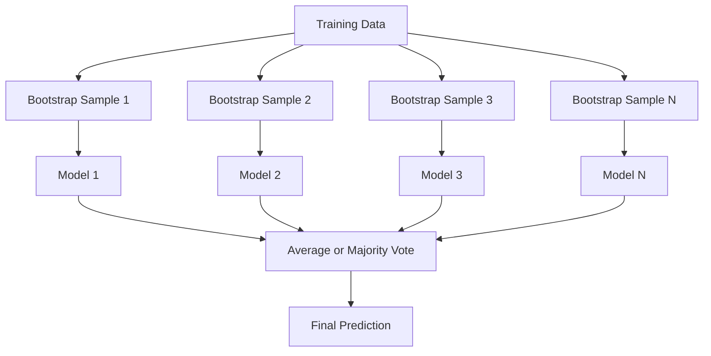
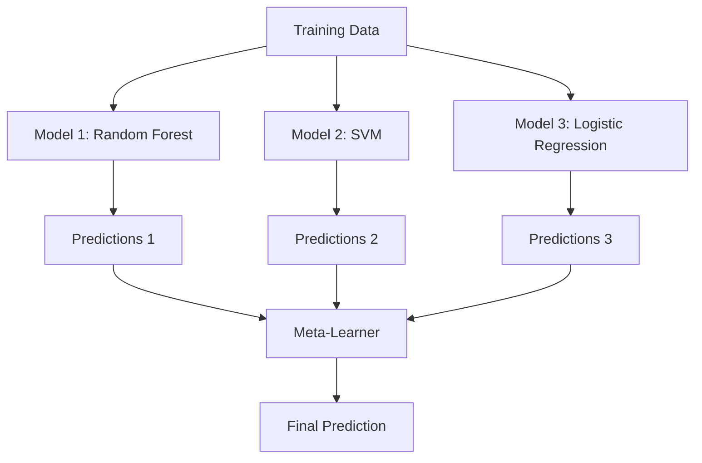

# 组建方法
# 集成方法


> 没有什么比喻,这是一个定理.

> 一组弱学习器,正确组合后,就变成强学习器.

**Type:** Build | **类型：** 构建
**Language:**子**语言：**字符串
**Prerequisites:** Phase 2, Lesson 10 (Bias-Variance Tradeoff) | **前置知识：** Phase 2 第 10 课（偏差-方差权衡）
**Time:** ~120 minutes | **时间：** 约 120 分钟

## 学习目标

- 从零开始实现AdaBoost和梯度推进,并解释推进如何顺序减少偏差
  从零实现AdaBoost和梯度提升,解释 如何提高 如何减少偏差
- 建立一个包装组件,展示平均不对称模型如何减少差异性,而不会增加偏见
  构建 集成 展示如何在不增加差距的情况下减少差距
- 根据每个方法的错误组件目标进行包装,增强和堆
  比较包装,增强和堆的差异分量
- 评估组合多样性,解释为什么大多数投票的准确性在较独立的弱者学习时会提高
  评估集成多样性,解释为什么多数投票准确率随着更多独立弱型学习器的提高


> **【中文解读】**
> 集成方法组合多个弱模型成一个强模型――包装(随机森林) 降低方差,增强(XGBoost) 降低偏差――XGBoost/LightGBM 在 Kaggle 比赛中占据统治地位――金融风控、推系统广泛使用――

> **【拓展：集成方法在 Kaggle 和工业界的主导地位】**
> 在 Kaggle 结构化数据竞赛中,排名前10的方案几乎100%使用集成方法. 网奖的获胜方案是107个模型的加权集成. 在工业界,支付宝的风控系统使用XGBoost + LightGBM的集成.

## 问题 问题引入

一个决策树是快速训练和易解释的,但它超越了. 一个线性模型适合复杂的边界.你可以花费几天时间设计完美的模型架构.或者你可以组合一堆不完美的模型,并得到比他们任何一个更好的东西.

> 单个决策树训练快,容易解释,但会过于合适. 单个线性模型在复杂的边界上没有合适. 你可以花几天时间设计完美的模型架构,或者组装一堆不完美的模型,得到比任何一个更好的结果.

组装方法是这样做的.它们是最可靠的技术来赢得卡格尔比赛,它们支持大多数生产ML系统,并说明了偏差差差异的交易.包装减少差异.增强减少偏差.堆叠学习哪些模型可以信任哪些输入.

> 集成方法正是这样做的.它们是赢得了Kaggle 表格数据竞赛最可靠的技术,驱动了大多数生产的ML系统,并直观展示了偏差-偏差权衡的实际运作.

> **【中文解读】**
> 集成方法的核心原理:如果多个不完美的模型犯了不同的错误,它们的平均预测会更准确. 包装 (如随机森林) 通过训练独立模型取平均来降低方差; 增强 (如AdaBoost、GBDT) 通过串列训练让每个新模型纠正前一个错误来降低偏差; 堆积使用元学习器组合不同类型的基模型.

## 概念的核心概念

### 为什么团队工作

假设您有N个独立的分类器,每个分类器的准确度为p > 0.5.

> 假设你有N个独立分类器,每个准确率为p > 0.5──多数投票的准确率为:

```
P(majority correct) = sum over k > N/2 of C(N,k) * p^k * (1-p)^(N-k)
```

对于21个分类器,每种分类器具有60%的精度,多数票的精度约为74%. 在101个分类器,它上升到84%.

> 绝大多数投票率是74%.101个分类时的准确率上升到84%.

关键要求是**diversity**如果所有模型都犯相同的错误,将它们结合起来就没有什么帮助.

> 关键要求是**多样性**,如果所有模型都犯了相同的错误,组合它们毫无帮助.

- 不同培训子组 (背后)
  不同的训练子集 (包)
- 不同特征子集 (随机森林)
  不同的特征子集 (随机森林)
- 顺序错误纠正 (增强)
  顺序错误纠正(提升)
- 不同型号家族 (堆叠)
  不同的模型族(堆积)

### 包装 (带集成)

包装通过训练每个模型在训练数据的不同启动样本来创造多样性.

> 通过在每个不同的杆上炼模型,



根据原始数据的尺寸,将取代原始数据进行启动样本.每一个启动样本中出现了约63.2%的独特样本.剩余的36.8% (袋外样本) 提供了免费验证集.

> 启动器样本从原始数据中被放回抽取,大小与原始数据相同. 约63.2%的唯一样本出现在每个启动器中.

每个树都过度过到其引导样本,但过度过对每个树不同,因此平均取消噪音.

> 包装在不增加太多偏差的情况下减少方差. 每棵单独的树都适合其起步样本,但每个树的过适合不同,因此平均会抵消噪音.

**Random Forests**树木的种类型是多样性,但它们的种类型是多样性,它们的种类型是多样性,它们的种类是多样性,它们的种类是多样性,它们的种类是多样性,它们的种类是多样性,它们的种类是多样性,它们的种类是多样性,它们的种类是多样性,它们的种类是多样性,它们的种类是多样性,它们的种类是多样性,它们的种类是多样性,它们的种类是多样性,它们的种类是多样性,它们的种类是多样性,它们的种类是多样性,它们的种类是多样性,它们的种类型是多样性,它们的种类是多样性,它们的种类型是多样性,它们的种类型是多样性,它们的种类型是多样性,它们的种类型是多样性,它们的种类型的种类型是多样性,它们的种类型的种类型是多样性,它们的种种种种种种种种种种种种种种种种种种种种种种种种种种种种种种种种种种种种种种种种种种种种种种种种种种种种种种种种种种种种种种种种种种种种种种种种种种种种种种种种种种种种种种种种种种种种种种种种种种种种种种种种种种种种种种种种种种种种种种种种种种种种种种种种种种种种种种种种种种种种种种种种种种种种种种种种种种种种种种种种种种种种种种种种种种种种种种种种种种种种种种种种种种种种种种种种种种种种种种种种种种种种种种种种种种种种种种种种种种种种种种种种种种种种种种种种种种种种种种种种种种种种`sqrt(n_features)`类别和`n_features / 3`对于回归.

> **随机森林**包装加上额外技巧:在每次分离时,只考虑一个随机特征集.`sqrt(n_features)`归归为`n_features / 3`,我知道.

### 增强 (顺序错误纠正)

每个新车型都集中在之前的车型错误的例子上.

> 增强 顺序训练模型――每个新模型关注之前模型弄错的样本――


增强减少偏见.每一个新模型都纠正了迄今为止的组合系统错误. 最终预测是所有模型的权重总和,而更好的模型则获得更高的权重.

> 提高偏差减少. 每个新模型都纠正了迄今为止的集成系统性错误. 最终预测是所有模型的加权和更好的模型获得更高的权力.

换句话说,如果你跑过多次, 放大就会过度适应, 因为它会不断适应更难的例子,

> 权衡:如果运行太多轮, 增强可能过适合, 因为它持续适合更难的样本, 其中一些可能是噪音.

### 适应性

适应性增强是第一个实用增强算法.它与任何基础学习者,通常是决策 (深度-1树) 合作.

> AdaBoost (自适应提升) 是第一个实用提升算法. 它适用于任何基学习器,通常使用决策树 (深度为1个树).

算法:

> 算法流程:

```
1. Initialize sample weights: w_i = 1/N for all i

2. For t = 1 to T:
   a. Train weak learner h_t on weighted data
   b. Compute weighted error:
      err_t = sum(w_i * I(h_t(x_i) != y_i)) / sum(w_i)
   c. Compute model weight:
      alpha_t = 0.5 * ln((1 - err_t) / err_t)
   d. Update sample weights:
      w_i = w_i * exp(-alpha_t * y_i * h_t(x_i))
   e. Normalize weights to sum to 1

3. Final prediction: H(x) = sign(sum(alpha_t * h_t(x)))
```

错误较低的模型会得到更高的阿尔法. 错误分类的样本会得到更高的重量,所以下一个模型将集中在它们上.

> 较低误差率的模型获得更高的阿尔法. 被误分类的样本获得更高的权重,这样下一个模型就会关注它们.

### 逐步增长

渐进式增强将增强扩大到任意损失函数. 代替重量化样本,它将每个新模型与当前组的残余 (损失负梯度) 匹配.

> 梯度提升将升级推广到任意损失函数――与重权样本不同,它将适应每个新模型的当前集成的残差 (损负梯度)――

```
1. Initialize: F_0(x) = argmin_c sum(L(y_i, c))

2. For t = 1 to T:
   a. Compute pseudo-residuals:
      r_i = -dL(y_i, F_{t-1}(x_i)) / dF_{t-1}(x_i)
   b. Fit a tree h_t to the residuals r_i
   c. Find optimal step size:
      gamma_t = argmin_gamma sum(L(y_i, F_{t-1}(x_i) + gamma * h_t(x_i)))
   d. Update:
      F_t(x) = F_{t-1}(x) + learning_rate * gamma_t * h_t(x)

3. Final prediction: F_T(x)
```

对于二次错误损失,伪残留仅仅是实际残留:`r_i = y_i - F_{t-1}(x_i)`每棵树都符合前一个树的错误.

> 对于平方差损失,伪残差就是实际残差:`r_i = y_i - F_{t-1}(x_i)`  树实际上在合适之前集成的错误

学习速度 (缩小) 控制着每个树的贡献.较小的学习速度需要更多的树木,但更好地概括.典型值:0.01到0.3.

> 学习率 (缩小) 控制每棵树的贡献量.

### 图表数据为什么占据主导地位

升级是通过工程优化提高升率,使其快速,准确,并且能抵御过度适应:

> 极端梯度提升) 是带有工程优化梯度提升,使其快速,准确和抗过适应:

- **Regularized objective:**对于叶子重量,L1和L2处罚防止单个树木过于自信
  **正则化目标**权重的L1和L2 惩罚防止单棵树过度自信
- **Second-order approximation:**通过使用损失的第一和第二衍生品,更好的分断决策
  **二阶近似**通过使用一阶段和二阶段的损失数,给出更好的分离决策
- **Sparsity-aware splits:**通过学习每次分区的最佳方向来处理缺失值
  **稀疏感知分裂**首先,我们需要在每一个分区学习缺失数据的最佳方向.
- **Column subsampling:**像随机森林一样,每个分区都有样本,以确保多样性
  **列子采样**像随机森林一样,在每次分裂时采用特征来增加多样性
- **Weighted quantile sketch:**有效地找到分布式数据中连续特征的分点
  **加权分位数草图**高效地在分布式数据中找到连续特征的分离点
- **Cache-aware block structure:**优化用于CPU缓存线的内存布局
  **缓存感知块结构**针对CPU 缓存行业的内存布局

对于表格数据,XGBoost (及其继任者LightGBM) 始终优于神经网络.这不会很快改变.如果您的数据适合一张有行列和列的表格,请开始加大梯度.

> 对于表格数据,XGBoost (XGBoost) 和其继任者LightGBM) 总是优于神经网络.

### 堆叠 (Meta-Learning)

堆使用多个基模型的预测作为一个超学习者的特征.

> 堆叠将多基模型的预测作为元学习器的特征.



测量学习者学习哪个基模型可信任哪些输入.如果随机森林在某些地区更好,而SVM在其他地区,测量学习者将学习相应的路由.

> 如果随着森林在某些地区更好,SVM在其他地区更好,元学习器会学会相应路由.

为了避免数据泄露,必须通过训练集的交叉验证生成基模型预测.

> 为了避免数据泄露,基模型预测必须通过训练集中的交叉验证生成――永远不要在同一数据上训练基模型并产生元特征――

### 投票

简单的组合,直接结合预测.

> 最简单的集成――直接组合预测――

- **Hard voting:**多数人投票对班级标签.
  **硬投票**对于标签进行多数投票.
- **Soft voting:**平均预测概率,选择具有最高平均概率的类别. 通常更好,因为它使用信任信息.
  **软投票**平均预测概率,选择平均概率最高的类别.

## 建立它,实现它.

> **【中文解读】**
> 从零实现三种集成方法:包装(并行训练独立模型取平均) ‧AdaBoost(串行训练加权投票) ‧渐进增强(串行训练纠正残差) ・AdaBoost的核心是给被前一个模型误分类样本增加权重,渐进增强 每棵新树拟合前一个树的残差──
```figure
f3-ensemble-average
```

## 建立它

### 步骤1:决定的 (基础学习者)

编码在`code/ensembles.py`我们从一个决定的子开始:一个单个分断的树.

> `code/ensembles.py`我们从决策树开始:只有一棵分裂树

```python
class DecisionStump:
    def __init__(self):
        self.feature_idx = None
        self.threshold = None
        self.polarity = 1
        self.alpha = None

    def fit(self, X, y, weights):
        n_samples, n_features = X.shape
        best_error = float("inf")

        for f in range(n_features):
            thresholds = np.unique(X[:, f])
            for thresh in thresholds:
                for polarity in [1, -1]:
                    pred = np.ones(n_samples)
                    pred[polarity * X[:, f] < polarity * thresh] = -1
                    error = np.sum(weights[pred != y])
                    if error < best_error:
                        best_error = error
                        self.feature_idx = f
                        self.threshold = thresh
                        self.polarity = polarity

    def predict(self, X):
        n = X.shape[0]
        pred = np.ones(n)
        idx = self.polarity * X[:, self.feature_idx] < self.polarity * self.threshold
        pred[idx] = -1
        return pred
```

### 步骤2:从零开始调动

```python
class AdaBoostScratch:
    def __init__(self, n_estimators=50):
        self.n_estimators = n_estimators
        self.stumps = []
        self.alphas = []

    def fit(self, X, y):
        n = X.shape[0]
        weights = np.full(n, 1 / n)

        for _ in range(self.n_estimators):
            stump = DecisionStump()
            stump.fit(X, y, weights)
            pred = stump.predict(X)

            err = np.sum(weights[pred != y])
            err = np.clip(err, 1e-10, 1 - 1e-10)

            alpha = 0.5 * np.log((1 - err) / err)
            weights *= np.exp(-alpha * y * pred)
            weights /= weights.sum()

            stump.alpha = alpha
            self.stumps.append(stump)
            self.alphas.append(alpha)

    def predict(self, X):
        total = sum(a * s.predict(X) for a, s in zip(self.alphas, self.stumps))
        return np.sign(total)
```

### 步骤3:从零开始逐步增强

```python
class GradientBoostingScratch:
    def __init__(self, n_estimators=100, learning_rate=0.1, max_depth=3):
        self.n_estimators = n_estimators
        self.lr = learning_rate
        self.max_depth = max_depth
        self.trees = []
        self.initial_pred = None

    def fit(self, X, y):
        self.initial_pred = np.mean(y)
        current_pred = np.full(len(y), self.initial_pred)

        for _ in range(self.n_estimators):
            residuals = y - current_pred
            tree = SimpleRegressionTree(max_depth=self.max_depth)
            tree.fit(X, residuals)
            update = tree.predict(X)
            current_pred += self.lr * update
            self.trees.append(tree)

    def predict(self, X):
        pred = np.full(X.shape[0], self.initial_pred)
        for tree in self.trees:
            pred += self.lr * tree.predict(X)
        return pred
```

### 步骤 4:与 sklearn 相比

编码验证我们的从头开始的实现与Skularn的准确度相似.`AdaBoostClassifier`其他`GradientBoostingClassifier`并且将所有方法与其相比.

> 代码验证我们从零实现产生与结合的`AdaBoostClassifier`和 `GradientBoostingClassifier`相似的准确率,并并排比较所有方法.

## 用它实现框架

### 每种方法何时使用

> 如何使用每种方法

| Method | Reduces | Best for | Watch out for |
|--------|---------|----------|---------------|
| Bagging / Random Forest | Variance | Noisy data, many features | Does not help with bias |
| AdaBoost | Bias | Clean data, simple base learners | Sensitive to outliers and noise |
| Gradient Boosting | Bias | Tabular data, competitions | Slow to train, easy to overfit without tuning |
| XGBoost / LightGBM | Both | Production tabular ML | Many hyperparameters |
| Stacking | Both | Getting last 1-2% accuracy | Complex, risk of overfitting meta-learner |
| Voting | Variance | Quick combination of diverse models | Only helps if models are diverse |

| 方法 | 减少 | 最适合 | 注意事项 |
|------|------|--------|---------|
| Bagging / 随机森林 | 方差 | 噪声数据、多特征 | 不能帮助偏差 |
| AdaBoost | 偏差 | 干净数据、简单基学习器 | 对异常值和噪声敏感 |
| 梯度提升 | 偏差 | 表格数据、竞赛 | 训练慢、不调参容易过拟合 |
| XGBoost / LightGBM | 两者 | 生产表格 ML | 超参数多 |
| Stacking | 两者 | 获取最后 1-2% 准确率 | 复杂、元学习器有过拟合风险 |
| Voting | 方差 | 快速组合多样模型 | 模型不多样时无帮助 |

### 表格数据的生产堆

对于大多数表式预测问题,这是尝试的顺序:

> 对于大多数表格预测问题,这是推的尝试顺序:

1. **LightGBM or XGBoost**具有默认参数
   **LightGBM 或 XGBoost**使用默认参数
2. 调整 n_estimators,学习率,最大深度,小孩体重
   调优 n_estimators、学习率、最大_深度、小孩_体重
3. 如果你需要最后的0.5%, 建立一个堆组, 3-5个不同的模型
   如果需要最后0.5%,构建3-5个多样模型的堆集成
4. 通过使用截止验证
   全程使用交叉验证

尽管继续进行研究,表格数据上的神经网络几乎总是比梯度增强更糟糕.TabNet,NODE和类似的架构偶尔匹配,但很少击败了精确的XGBoost.

> 尽管不断进行研究,神经网络在表格数据上几乎总是不像梯度升级.

## 运送它.

这一课产生了`outputs/prompt-ensemble-selector.md`--一个提示提示提示提示提示提示提示提示提示建议启动超参数,并警告有关该方法的常见错误.`outputs/skill-ensemble-builder.md`随着选择指南的完整性.

> 本课产出发 `outputs/prompt-ensemble-selector.md`一个帮助你选择正确的集成方法的提示词. 描述你的数据 ((大小,特征类型,噪音水平,类别平衡) 和你正在解决的问题.`outputs/skill-ensemble-builder.md`包含完整的选择指南.

## 练习题

1. 修改AdaBoost实现,以追踪训练精度每轮后. 图谱精度与估计器数量. 它什么时候融合?
   1. 修改AdaBoost 实现在每轮后追踪训练准确率――绘制准确率与估计器数量――何时收?

2. 通过添加随机的子样本功能,从零开始实现随机森林.`max_features=sqrt(n_features)`它们可以将变异减少与单一树进行比较.
   2. 从零实现随机森林:在归树上添加随机特征采样.`max_features=sqrt(n_features)`平均预测: 较量差减少与单棵树

3. 在梯度增强实现中,添加早期停止:每轮后追踪验证损失,并在连续10轮没有改善时停止.它实际上需要多少树?
   3. 在梯度提升实现中加早停:每轮追踪验证损失,连续10轮没有改善就停止――实际需要多少树?

4. 构建一个堆叠组合,包括三个基模型 (物流回归,决策树,k-近邻) 和一个物流回归的元学习器.使用5倍的交叉验证来生成元特征.单独比较每个基模型.
   4. 构建三个基础模型 (逻辑归归、决策树、KNN) 和一个逻辑归归元学习器的堆集成――使用5次交叉验证生成元特征――与每个基础模型单独比较――

5. 运行XGBoost在相同的数据集上,使用默认参数. 比较其准确度和从零开始的梯度增强. 时间两者. 速度差距是多大?
   5. 在同一数据集中使用默认参数运行 XGBoost. 与从零实现的梯度提升比较准确率.

> **【中文解读】**
> 根据"自适应提升"的核心流程:训练一个弱分类器→计算错误率→增加被误分类样本的权重→训练下一个弱分类器。最终预测是所有弱分类器的权力增加投票,权重和错误率成反比──Gradient Boosting的核心流程:训练第一棵树→计算残差→训练第二棵树拟残差→重复──每棵新树都在纠正之前所有树的集体错误──

> **【拓展：XGBoost、LightGBM、CatBoost——梯度提升树三巨头】**
> XGBoost(eXtreme Gradient Boosting) 由陈天奇于2014年开发,引入正则化、稀疏数据处理和并行计算,成为 Kaggle 竞赛标志工具.

## 关键词 快速查找表

| Term | What people say | What it actually means |
|------|----------------|----------------------|
| Bagging | "Train on random subsets" | Bootstrap aggregating: train models on bootstrap samples, average predictions to reduce variance |
| Boosting | "Focus on hard examples" | Train models sequentially, each correcting errors of the ensemble so far, to reduce bias |
| AdaBoost | "Reweight the data" | Boosting via sample weight updates; misclassified points get higher weight for the next learner |
| Gradient boosting | "Fit the residuals" | Boosting via fitting each new model to the negative gradient of the loss function |
| XGBoost | "The Kaggle weapon" | Gradient boosting with regularization, second-order optimization, and systems-level speed tricks |
| Stacking | "Models on top of models" | Use predictions of base models as input features for a meta-learner |
| Random forest | "Many randomized trees" | Bagging with decision trees, adding random feature subsampling at each split for diversity |
| Ensemble diversity | "Make different mistakes" | Models must be uncorrelated in their errors for the ensemble to improve over individuals |
| Out-of-bag error | "Free validation" | Samples not in a bootstrap draw (~36.8%) serve as a validation set without needing a holdout |

## 继续阅读 继续阅读

- [Schapire & Freund: Boosting: Foundations and Algorithms](https://mitpress.mit.edu/9780262526036/)亚达博斯创作者的书
  [Schapire & Freund: Boosting: Foundations and Algorithms](https://mitpress.mit.edu/9780262526036/)- 创始人的著作
- [Friedman: Greedy Function Approximation: A Gradient Boosting Machine (2001)](https://statweb.stanford.edu/~jhf/ftp/trebst.pdf)-- 原始的梯度增强纸
  [Friedman: Greedy Function Approximation: A Gradient Boosting Machine (2001)](https://statweb.stanford.edu/~jhf/ftp/trebst.pdf)- 梯度提升原始论文
- [Chen & Guestrin: XGBoost (2016)](https://arxiv.org/abs/1603.02754)-- 博的纸
  [Chen & Guestrin: XGBoost (2016)](https://arxiv.org/abs/1603.02754)- 论文
- [Wolpert: Stacked Generalization (1992)](https://www.sciencedirect.com/science/article/abs/pii/S0893608005800231)-- 原始的堆叠纸
  [Wolpert: Stacked Generalization (1992)](https://www.sciencedirect.com/science/article/abs/pii/S0893608005800231)- 堆叠 原始论文
- [scikit-learn Ensemble Methods](https://scikit-learn.org/stable/modules/ensemble.html)-- 实际参考
  [scikit-learn 集成方法](https://scikit-learn.org/stable/modules/ensemble.html)- 实用参考
