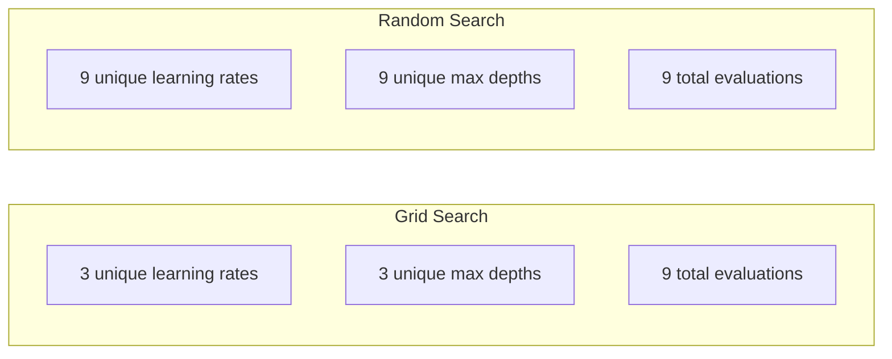
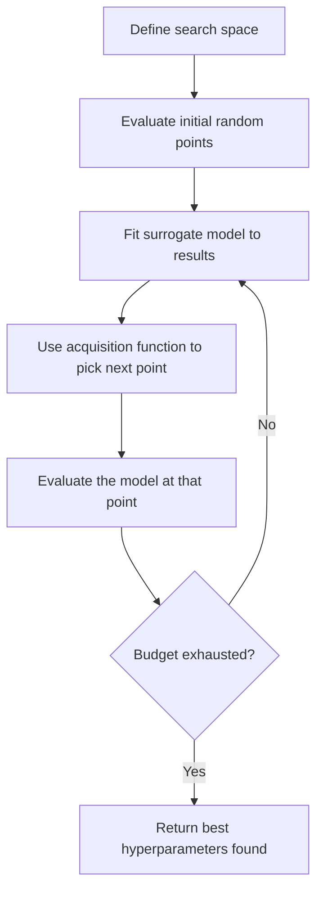
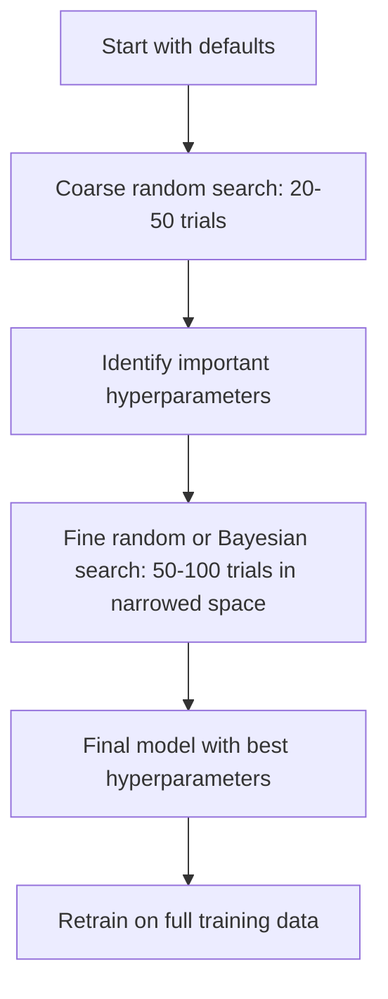
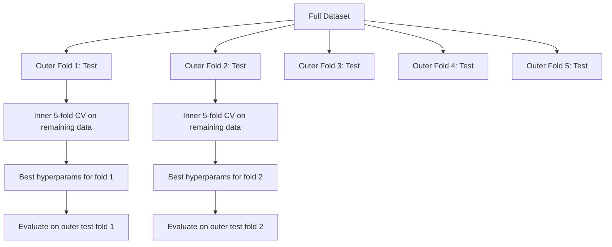

# 超参数调整
# 超参数调优


> 超参数是训练开始前转动的,转动它们是中等模型和伟大的模型之间的区别.

> 超参数是训练开始前你的旋转.

**Type:** Build | **类型：** 构建
**Language:**子**语言：**字符串
**Prerequisites:** Phase 2, Lesson 11 (Ensemble Methods) | **前置知识：** Phase 2 第 11 课（集成方法）
**Time:** ~90 minutes | **时间：** 约 90 分钟

## 学习目标

- 从零开始实施网格搜索,随机搜索和贝叶斯优化,并比较他们的样本效率
  从零实现网格搜索,随机搜索和贝叶斯优化,比较它们的样本效率
- 解释为什么随机搜索超过网格搜索,当大多数超参数具有低有效维度时
  解释为什么随机搜索在大多数超参数有效维度低时优于网格搜索
- 建立一个使用替代模型和收购函数来引导搜索的贝叶斯优化循环
  使用代理模型和采集函数构建贝叶斯优化循环来引导搜索
- 通过适当的交叉验证,设计一个超参数调整策略,以避免过度匹配验证集
  通过适当交叉验证设计避免对验证集过拟合的超参数调整策略


> **【中文解读】**
> 超参数是模型训练前设定的参数,不能从数据中学到.

> **【拓展：超参数调优在大模型训练中的重要性】**
> 基于基于先前小规模实验的经验规则,GPT-4的训练涉及数十个超参数.对于GPT类型模型,学习率调度 (加热+宇宙衰退) 被认为是最关键的超参数选择.

## 问题 问题引入

您的梯度增强模型具有学习速度,树木数量,最大深度,每叶的最小样本,子样本比和列样本比.这相当于六个超参数.如果每个具有5个合理值,格格有5^6=15.625个组合.训练每一个需要10秒.这相当于43个小时的计算时间来尝试它们.

> 你的梯度升级模型有学习率,树的数量,最大深度,叶节点最小样本数,子样本率和列样本率.

网格搜索是显而易见的方法,规模最差的方法.随机搜索在计算较少的情况下更好.贝叶斯式优化通过从过去的评估中学习更好.知道要使用哪种策略,以及哪些超参数实际上很重要,可以节省几天的浪费GPU时间.

> 网格搜索是显而易见的方法,也是规模最大的最差的方法――随着搜索使用更少的计算做得更好――通过从过去的评估中学习更好――知道使用哪些策略以及哪些超参数真正重要,可以节省几天的GPU 时间.

> **【中文解读】**
> 超参数调整的核心矛盾:搜索空间大但每次评估成本高――网格搜索穷举所有组合,成本指数增长;随机搜索随机采样,在同样的预算下探索更多区域;贝叶斯优化概率模型(高斯过程) 预测哪个区域可能更好,智能地选择下一个评估点――实践中,先使用随机搜索快速缩小范围,再使用贝叶斯优化精细搜索――

## 概念的核心概念

### 参数与超参数

在训练期间学习参数 (体重,偏见,分门).

> 参数在训练中学习(权重、偏置、分离值) ――超参数在训练开始前设定,控制学习如何发生──

| Hyperparameter | What it controls | Typical range |
|---------------|-----------------|---------------|
| Learning rate | Step size per update | 0.001 to 1.0 |
| Number of trees/epochs | How long to train | 10 to 10,000 |
| Max depth | Model complexity | 1 to 30 |
| Regularization (lambda) | Overfitting prevention | 0.0001 to 100 |
| Batch size | Gradient estimation noise | 16 to 512 |
| Dropout rate | Fraction of neurons dropped | 0.0 to 0.5 |

| 超参数 | 控制什么 | 典型范围 |
|--------|---------|---------|
| 学习率 | 每次更新的步长 | 0.001 到 1.0 |
| 树的数量/epoch 数 | 训练多久 | 10 到 10,000 |
| 最大深度 | 模型复杂度 | 1 到 30 |
| 正则化 (lambda) | 防止过拟合 | 0.0001 到 100 |
| 批量大小 | 梯度估计噪声 | 16 到 512 |
| Dropout 率 | 丢弃的神经元比例 | 0.0 到 0.5 |

### 网格搜索

网格搜索评估了指定的每个值组合. 它是详尽的,容易理解的,但与超参数数数量相符,它会呈指数级的扩展.

> 网格搜索评估指定值的每个组合. 它是尽量简单的,但随着超参数数量指数的数量级增长.

```
Grid for 2 hyperparameters:

  learning_rate: [0.01, 0.1, 1.0]
  max_depth:     [3, 5, 7]

  Evaluations: 3 x 3 = 9 combinations

  (0.01, 3)  (0.01, 5)  (0.01, 7)
  (0.1,  3)  (0.1,  5)  (0.1,  7)
  (1.0,  3)  (1.0,  5)  (1.0,  7)
```

网格搜索有一个基本缺点:如果一个超参数重要,而另一个不重要,大多数评估都是浪费的.

> 网格搜索有一个根本缺陷:如果一个超参数重要而另一个不重要,大多数评估都是浪费的.

### 随机搜索

随机搜索来自分布而不是网格的超参数. 通过相同的预算9项评估,你得到9个超参数的独特值.

> 在同样的9次评估的预算下,你得到每个超参数的9个唯一值.



为什么随机击败格格 (Bergstra & Bengio, 2012):

> 由于此,我认为我不太了解.

- 大多数超参数具有低效维度.通常只有1到2个超参数对特定问题有意义.
  大多数超参数的有效维度低――6个超参数中,通常只有1-2个对给定问题很重要――
- 电网搜索废物评估在不重要的尺寸上.
  网格搜索在不重要维度上浪费评估.
- 随机搜索对同一预算更密集地涵盖了重要维度.
  随时搜索在同样的预算下更密集地覆盖重要维度.
- 在60个随机试验中,你有95%的机会找到一个在5%的最佳点 (如果一个存在于搜索空间).
  在60次随机试验中,你有95%的概率找到最优点的值,

### 贝叶斯优化

随机搜索忽略了结果.它不会学习高的学习率导致差异或深度3稳步超过深度10.贝耶斯优化利用过去的评估来决定下一步搜索的地方.

> 随时搜索忽略结果――它不会学到高学习率导致散发或深度 3 总是优于深度 10 贝叶斯优化利用过去的评估来决定下一步搜索哪里――



两个主要组成部分:

**Surrogate model:**价格便宜的评估模型 (通常是高斯过程) 接近昂贵的目标函数.它提供了预测和不确定性估计在搜索空间的任何一个点.

> **代理模型：**一个廉价评估模型 (通常是高斯过程),几乎是昂贵的目标函数.

**Acquisition function:**通过平衡利用 (接近已知好处的搜索) 和探索 (高不确定性的搜索) 来决定下一步评估的位置.

> **采集函数：**通过平衡开发 (搜索已知好点附近) 和探索 (搜索不确定性高的区域) 来决定下一步评估哪里――常见选择:

- **Expected Improvement (EI):**我们现在预计的情况会有多好?
  **期望改进 (EI)：**在这个方面,我们希望比目前的最佳结果有多好?
- **Upper Confidence Bound (UCB):**预测加上不确定性的倍数. 较高的UCB意味着有前景或未被探索.
  **上置信界 (UCB)：**预测加上不确定性的倍数――更高的UCB意味着有前景或未探索――
- **Probability of Improvement (PI):**现在的最佳点是多少?
  **改进概率 (PI)：**现在最好的结果的概率是多少?

贝叶斯优化通常比随机搜索更好的超参数,并且有2-5倍的评估.与实际模型训练相比,替代模型的安装的总费是微不足道的.

> 贝叶斯优化通常需要2-5倍的评估次数来找到比随机搜索更好的超参数――适合代理模型的开销与训练实际模型相比可以忽略――

> **【中文解读】**
> 贝叶斯优化是最聪明的调整方法.核心组件:代理模型 (通常使用高斯过程合适目标函数) 和采集函数. 平衡"探索未知的区域"和"利用已知的好区域")  每次评估后更新代理模型,采集函数决定下一个评估点. 相比随机搜索,贝叶斯优化使用2-5倍的评估次数就能找到更好的超值参数,对于高训练成本的模型有特别价值.

> **【拓展：Optuna——自动化超参数调优的工业标准】**
> 优普图纳是日本最喜欢的网络开发的超参数优化框架,广泛应用于 Kaggle 竞赛和工业项目. 它支持贝叶斯优化 (TPE 采样器) 剪枝 (自动停止不有前途的试验) 分布式搜索.DeepMind的 AlphaGo 和 Google的 Vizier也使用类似的贝叶斯优化技术来调整自身系统的超参数. 在 LLM 微调中,Optuna 常常用于搜索学习率,批量大小,LoRA 排名等关键超参数.

### 早期停止

没有每次训练都需要完成.如果一个配置在10个时代后显然不好,就停止它,然后继续前进.

> 不是每次训练都需要完成. 如果一个配置在10个时代后显然不好,就停下来继续下去.

战略:
- **Patience-based:**如果 N 连续期没有改善验证损失,则停止
  **基于耐心：**如果验证损失连续N 个时代 没有改善就停止
- **Median pruning:**如果试验中期结果比同一步骤完成试验的中位数差,则停止
  **中位数剪枝：**如果试验中位数差距停止,比同步完成的试验中位数差距停止.
- **Hyperband:**分配小预算给多个配置,然后逐步增加最好的预算
  **Hyperband：**给许多配置分配小预算,然后逐步增加最佳配置预算

超级带特别有效.它启动81个配置,每个配置有1个时代,保持上一个第三,给他们3个时代,保持上一个第三,等等.这发现了好的配置10-50倍快于评估所有配置的完整预算.

> 超级带 特别有效. 它从81个配置开始,保留前三分之一,给它们3个时代,再保留前三分之一,以此类推.

### 学习时间表

学习速度几乎总是最重要的超值.

> 调节器在训练过程中调整它.

| Scheduler | Formula | When to use |
|-----------|---------|-------------|
| Step decay | Multiply by 0.1 every N epochs | Classic CNN training |
| Cosine annealing | lr * 0.5 * (1 + cos(pi * t / T)) | Modern default |
| Warmup + decay | Linear increase then cosine decay | Transformers |
| One-cycle | Increase then decrease over one cycle | Fast convergence |
| Reduce on plateau | Reduce by factor when metric stalls | Safe default |

| 调度器 | 公式 | 何时使用 |
|--------|------|---------|
| 阶梯衰减 | 每 N 个 epoch 乘以 0.1 | 经典 CNN 训练 |
| 余弦退火 | lr * 0.5 * (1 + cos(pi * t / T)) | 现代默认 |
| 预热+衰减 | 线性增加后余弦衰减 | Transformer |
| 单周期 | 一个周期内先增后减 | 快速收敛 |
| 平台期衰减 | 指标停滞时按因子减小 | 安全默认 |

### 超参数的重要性

随机森林的研究 (Probst等人,2019) 和梯度增强显示一致的模式:

> 关于随机森林的研究和梯度提升显示一致的模式:

**High importance:**
- 学习率 (始终先调音)
  学习率 (始终首先调优)
- 估计器/时代数量 (使用早期停止而不是调整)
  估计器数量/时代 数(用早停代替调优)
- 规律化强度
  正则化强度

**Medium importance:**
- 极度深度/层数量
  最强深度/层数
- 每叶子/重量衰减的最小样本
  叶节点最小样本数 / 权重衰减
- 副样本比例
  采样率

**Low importance:**
- 最大特征 (用于随机森林)
  最大的特征数 ((随机森林)
- 特定激活函数的选择
  具体激活函数选择
- 批量 (在合理范围内)
  批量大小(在合理范围内)

首先调整重要,剩下的按默认.

> 首先调重要,其余保持默认.

### 实际战略



具体工作流程:

> 具体工作流:

1. **Start with library defaults.**经验丰富的医生选择它们,
   **从库默认值开始。**经验丰富的经验者选择它们,通常已经达到80%的效果.
2. **Coarse random search.**长范围,20-50试验,使用早点停止,杀死坏跑.
   **粗粒度随机搜索。**宽范围,20-50次试验──用早停快速终止差的运行──
3. **Analyze results.**哪些超参数与性能相关?
   **分析结果。**什么超参数与性能相关?缩小搜索空间.
4. **Fine search.**通过贝叶斯式优化或在狭窄空间中进行集中随机搜索.
   **精细搜索。**在缩小空间内使用贝叶斯优化或聚焦随机搜索──50-100次试验──
5. **Retrain on all training data**它们是最好的超参数.
   用找到最好的超参数在**所有训练数据上重新训练**,我知道.

### 跨验证整合

调整一个验证分区的超参数是风险的.最好的超参数可能会过度适应特定的验证折叠.嵌入式交叉验证通过使用两个循环来解决这一问题:

> 在单个验证分类上调优超参数有风险.最佳超参数可能适合特定验证折叠.嵌套交叉验证通过使用两个循环来解决这个问题:

- **Outer loop**(评估):将数据分为列车+值和测试. 报告无偏见的性能.
  **外循环**报告无偏见性能.
- **Inner loop**(调整):将火车+val分为火车和val.
  **内循环**预测:将训练+验证分为训练和验证.



每个外层独立地找到自己的最佳超参数. 外层分数是通用性性能的公正估计.

> 每个外折独立找到自己的最佳超参数.外折分数是泛化性能的无偏估.

含有:

```python
from sklearn.model_selection import cross_val_score, GridSearchCV
from sklearn.ensemble import GradientBoostingRegressor

inner_cv = GridSearchCV(
    GradientBoostingRegressor(),
    param_grid={
        "learning_rate": [0.01, 0.05, 0.1],
        "max_depth": [2, 3, 5],
        "n_estimators": [50, 100, 200],
    },
    cv=5,
    scoring="neg_mean_squared_error",
)

outer_scores = cross_val_score(
    inner_cv, X, y, cv=5, scoring="neg_mean_squared_error"
)

print(f"Nested CV MSE: {-outer_scores.mean():.4f} +/- {outer_scores.std():.4f}")
```

这种方法很昂贵 (5 外面折叠 × 5 内面折叠 × 27 格格点 = 675 个模型适合),但它可以给你一个可靠的性能估计.

> 这很昂贵 ((5个外折 x 5个内折 x 27个网格点 = 675次模型适合),但它给你一个可靠的性能估计.

### 实际的建议

**Start with the learning rate.**由于学习率差,其他一切都不重要. 设置其他超参数在默认情况下,然后先扫除学习率.

> **从学习率开始。**对于基于梯度的方法,它始终是最重要的超参数.

**Use log-uniform distributions for learning rate and regularization.**差异在0.001和0.01之间与0.1和1.0之间的差异一样重要.

> **对学习率和正则化使用对数均匀分布。**由于在线搜索在大端浪费预算中,

**Use early stopping instead of tuning n_estimators.**对于增强和神经网络,设置高 n_estimators或 epochs,并让早期停止决定何时停止. 这将从搜索中删除一个超参数.

> **用早停代替调优 n_estimators。**对于提升和神经网络,将 n_estimators或 epoch 数设高,让早停决定何时停止──这从搜索中移除了一个超参数──

**Budget allocation.**投资你的调整预算的60%用于最重要的两个超参数. 投资剩余的40%用于其他一切.

> **预算分配。**调整预算的60%花在前2个最重要的超参数上.其余40%花在所有其他参数上.前2个参数占了大部分的性能变化.

**Scale matters.**永远不要在日志尺度上搜索批量 (16, 32, 64 都是可以的).总是在日志尺度上搜索学习率.与搜索分布相匹配,超参数如何影响模型.

> **尺度很重要。**永远不要在数量尺度上搜索批量大小(16、32、64 就行) ⋅始终在数量尺度上搜索学习率──将搜索分布与超参数影响模型的方法相匹配──

| Model Type | Top Hyperparameters | Recommended Search | Budget |
|-----------|--------------------|--------------------|--------|
| Random Forest | n_estimators, max_depth, min_samples_leaf | Random search, 50 trials | Low (fast training) |
| Gradient Boosting | learning_rate, n_estimators, max_depth | Bayesian, 100 trials + early stopping | Medium |
| Neural Network | learning_rate, weight_decay, batch_size | Bayesian or random, 100+ trials | High (slow training) |
| SVM | C, gamma (RBF kernel) | Grid on log scale, 25-50 trials | Low (2 params) |
| Lasso/Ridge | alpha | 1D search on log scale, 20 trials | Very low |
| XGBoost | learning_rate, max_depth, subsample, colsample | Bayesian, 100-200 trials + early stopping | Medium |

**When in doubt:**随机搜索的数量是试验中的超参数的2倍 (例如,6个超参数=12个+试验最小).你会惊,随机搜索的50个试验比精心设计的网格搜索更常见.

> **拿不准时：**随机搜索,试验数为超参数数的2倍(如6个超参数 =至少12次试验) ――你会惊于50次随机搜索多次经常击败精心设计的网格搜索――

## 建立它,实现它.

> **【中文解读】**
> 从零实现网格搜索"",随机搜索和贝叶斯优化",并使用相同的数据集对比三者的效率和效果.

> **【拓展：Hyperband 和 ASHA——大规模超参数搜索的加速器】**
> 超级带算法的核心思想:先给大量配置少量资源 (如1个时代),淘汰表现差的,给幸存者更多资源.
```figure
k-fold-cv
```

## 建立它

### 步骤1:从零开始搜索网格

编码在`code/tuning.py`实现了网格搜索,随机搜索,以及从零开始的简单贝耶斯式优化器.

> `code/tuning.py`中部代码从零实现了网格搜索,随机搜索和简单的贝叶斯优化器.

```python
def grid_search(model_fn, param_grid, X_train, y_train, X_val, y_val):
    keys = list(param_grid.keys())
    values = list(param_grid.values())
    best_score = -float("inf")
    best_params = None
    n_evals = 0

    for combo in itertools.product(*values):
        params = dict(zip(keys, combo))
        model = model_fn(**params)
        model.fit(X_train, y_train)
        score = evaluate(model, X_val, y_val)
        n_evals += 1

        if score > best_score:
            best_score = score
            best_params = params

    return best_params, best_score, n_evals
```

### 步骤2:从零开始随机搜索

```python
def random_search(model_fn, param_distributions, X_train, y_train,
                  X_val, y_val, n_iter=50, seed=42):
    rng = np.random.RandomState(seed)
    best_score = -float("inf")
    best_params = None

    for _ in range(n_iter):
        params = {k: sample(v, rng) for k, v in param_distributions.items()}
        model = model_fn(**params)
        model.fit(X_train, y_train)
        score = evaluate(model, X_val, y_val)

        if score > best_score:
            best_score = score
            best_params = params

    return best_params, best_score, n_iter
```

### 步骤3:贝叶斯优化 (简化)

核心想法:将高斯过程适应观察到的 (超参数,分数) 对,然后使用收购函数来决定下一步要去哪里看.

> 核心思想:将高斯过程适合观察的,然后使用采集函数决定下一步看哪里.

```python
class SimpleBayesianOptimizer:
    def __init__(self, search_space, n_initial=5):
        self.search_space = search_space
        self.n_initial = n_initial
        self.X_observed = []
        self.y_observed = []

    def _kernel(self, x1, x2, length_scale=1.0):
        dists = np.sum((x1[:, None, :] - x2[None, :, :]) ** 2, axis=2)
        return np.exp(-0.5 * dists / length_scale ** 2)

    def _fit_gp(self, X_new):
        X_obs = np.array(self.X_observed)
        y_obs = np.array(self.y_observed)
        y_mean = y_obs.mean()
        y_centered = y_obs - y_mean

        K = self._kernel(X_obs, X_obs) + 1e-4 * np.eye(len(X_obs))
        K_star = self._kernel(X_new, X_obs)

        L = np.linalg.cholesky(K)
        alpha = np.linalg.solve(L.T, np.linalg.solve(L, y_centered))
        mu = K_star @ alpha + y_mean

        v = np.linalg.solve(L, K_star.T)
        var = 1.0 - np.sum(v ** 2, axis=0)
        var = np.maximum(var, 1e-6)

        return mu, var

    def _expected_improvement(self, mu, var, best_y):
        sigma = np.sqrt(var)
        z = (mu - best_y) / (sigma + 1e-10)
        ei = sigma * (z * norm_cdf(z) + norm_pdf(z))
        return ei

    def suggest(self):
        if len(self.X_observed) < self.n_initial:
            return sample_random(self.search_space)

        candidates = [sample_random(self.search_space) for _ in range(500)]
        X_cand = np.array([to_vector(c) for c in candidates])
        mu, var = self._fit_gp(X_cand)
        ei = self._expected_improvement(mu, var, max(self.y_observed))
        return candidates[np.argmax(ei)]

    def observe(self, params, score):
        self.X_observed.append(to_vector(params))
        self.y_observed.append(score)
```

预期改进平衡这些:它有利于模型预测高分数或不确定性高的点.早期,大多数点都具有高不确定性,因此优化者探索.后来,它专注于最有前景的地区.

> 总代理在每个候选点给出两样东西:预测分数(mu) 和不确定性(var) ⋅期望改善平衡.

### 步骤4:比较所有方法

运行所有三个方法在同一合成目标上并进行比较. 这种比较使用简单的包装,将每个优化器与直接目标函数 (没有模型培训) 调用,因此API与上面的基于模型的实现不同:

> 在相同的合成目标上运行所有三种方法并比较. 这种比较使用简化的包装器,直接使用目标函数调用每个优化器 (无模型训练),因此API与上面的基于模型的实现不同:

```python
def synthetic_objective(params):
    lr = params["learning_rate"]
    depth = params["max_depth"]
    return -(np.log10(lr) + 2) ** 2 - (depth - 4) ** 2 + 10

param_grid = {
    "learning_rate": [0.001, 0.01, 0.1, 1.0],
    "max_depth": [2, 3, 4, 5, 6, 7, 8],
}

grid_best = None
grid_score = -float("inf")
grid_history = []
for combo in itertools.product(*param_grid.values()):
    params = dict(zip(param_grid.keys(), combo))
    score = synthetic_objective(params)
    grid_history.append((params, score))
    if score > grid_score:
        grid_score = score
        grid_best = params

param_dist = {
    "learning_rate": ("log_float", 0.001, 1.0),
    "max_depth": ("int", 2, 8),
}

rand_best = None
rand_score = -float("inf")
rand_history = []
rng = np.random.RandomState(42)
for _ in range(28):
    params = {k: sample(v, rng) for k, v in param_dist.items()}
    score = synthetic_objective(params)
    rand_history.append((params, score))
    if score > rand_score:
        rand_score = score
        rand_best = params

optimizer = SimpleBayesianOptimizer(param_dist, n_initial=5)
bayes_history = []
for _ in range(28):
    params = optimizer.suggest()
    score = synthetic_objective(params)
    optimizer.observe(params, score)
    bayes_history.append((params, score))
bayes_score = max(s for _, s in bayes_history)

print(f"{'Method':<20} {'Best Score':>12} {'Evaluations':>12}")
print("-" * 50)
print(f"{'Grid Search':<20} {grid_score:>12.4f} {len(grid_history):>12}")
print(f"{'Random Search':<20} {rand_score:>12.4f} {len(rand_history):>12}")
print(f"{'Bayesian Opt':<20} {bayes_score:>12.4f} {len(bayes_history):>12}")
```

随着相同的预算,贝叶斯优化通常会找到最好的分数最快,因为它不会浪费明显糟糕的地区的评估.随机搜索比网格搜索更为广泛.网格搜索只有当你拥有很少的超参数并且可以负担得起是完整时才能获胜.

> 在相同的预算下,贝叶斯优化通常最快找到最佳分数,因为它没有明显差的区域浪费评估.随着搜索比网页搜索覆盖更多范围.

## 用它实现框架

### 实践中的图纳

对于严的超参数调整,Optuna是推的库. 它支持剪裁,分布式搜索和外框视觉化.

> 选择是严格超参数调优的推库.

```python
import optuna

def objective(trial):
    lr = trial.suggest_float("learning_rate", 1e-4, 1e-1, log=True)
    n_est = trial.suggest_int("n_estimators", 50, 500)
    max_depth = trial.suggest_int("max_depth", 2, 10)

    model = GradientBoostingRegressor(
        learning_rate=lr,
        n_estimators=n_est,
        max_depth=max_depth,
    )
    model.fit(X_train, y_train)
    return mean_squared_error(y_val, model.predict(X_val))

study = optuna.create_study(direction="minimize")
study.optimize(objective, n_trials=100)

print(f"Best params: {study.best_params}")
print(f"Best MSE: {study.best_value:.4f}")
```

关键的Optuna功能:
- `suggest_float(..., log=True)`对于日志尺度上最好搜索的参数 (学习率,规范化)
- `suggest_int`对于整数参数
- `suggest_categorical`对于分离选择
- 内部的MedianPruner,可以提前停止不好的试验
- `study.trials_dataframe()`分析

### 子子

切割可以提前阻止不有前途的试验,从而节省大量的计算.

> 剪枝及早停止无前景的试验,节省大量计算──以下模式:

```python
import optuna
from sklearn.model_selection import cross_val_score

def objective(trial):
    params = {
        "learning_rate": trial.suggest_float("lr", 1e-4, 0.5, log=True),
        "max_depth": trial.suggest_int("max_depth", 2, 10),
        "n_estimators": trial.suggest_int("n_estimators", 50, 500),
        "subsample": trial.suggest_float("subsample", 0.5, 1.0),
    }

    model = GradientBoostingRegressor(**params)
    scores = cross_val_score(model, X_train, y_train, cv=3,
                             scoring="neg_mean_squared_error")
    mean_score = -scores.mean()

    trial.report(mean_score, step=0)
    if trial.should_prune():
        raise optuna.TrialPruned()

    return mean_score

pruner = optuna.pruners.MedianPruner(n_startup_trials=10, n_warmup_steps=5)
study = optuna.create_study(direction="minimize", pruner=pruner)
study.optimize(objective, n_trials=200)
```

其他`MedianPruner`试验中值比完成的试验中位数差.`trial.report()`报告中途指标和`trial.should_prune()`检查是否应该停止试验.`n_startup_trials=10`通过此,通常节省40-60%的总计算.

> `MedianPruner`在试验中位值比同步完成试验中位数差时停止试验.`trial.report()`报告中指标,`trial.should_prune()`检查是否应停止.`n_startup_trials=10`确保至少10次试验在切片生效之前完成.

### 斯克尔纳的内置调节器

为了快速实验,S sklearn提供了`GridSearchCV`现在`RandomizedSearchCV`其他`HalvingRandomSearchCV`其他:

> 对于快速实验,学习提供`GridSearchCV`,我知道.`RandomizedSearchCV`和 `HalvingRandomSearchCV`其他:

```python
from sklearn.model_selection import RandomizedSearchCV
from scipy.stats import loguniform, randint

param_dist = {
    "learning_rate": loguniform(1e-4, 0.5),
    "max_depth": randint(2, 10),
    "n_estimators": randint(50, 500),
}

search = RandomizedSearchCV(
    GradientBoostingRegressor(),
    param_dist,
    n_iter=100,
    cv=5,
    scoring="neg_mean_squared_error",
    random_state=42,
    n_jobs=-1,
)
search.fit(X_train, y_train)
print(f"Best params: {search.best_params_}")
print(f"Best CV MSE: {-search.best_score_:.4f}")
```

使用`loguniform`对于学习速度和规律化.`randint`对于整数超参数.`n_jobs=-1`旗在所有CPU核心上并行.

> 对学习率和正规化使用知识的`loguniform`△对整数超参数使用`randint`,我知道.`n_jobs=-1`标志跨所有CPU核心并行.

### 超参数调节常见错误

**Data leakage through preprocessing.**如果在验证交叉之前将一个扩展器安装在整个数据集中,验证折叠中的信息会泄露到训练中.`Pipeline`所以它只适合训练.

> **通过预处理的数据泄漏。**如果在交叉验证前对全量数据合适缩放器进行验证,验证折的信息泄漏到训练中.`Pipeline`让它适合训练.

**Overfitting to the validation set.**运行数千个试验有效地训练验证套件. 为了最终的性能估计,使用嵌套交叉验证,或者举出一个独立的测试套件,你从来没有触摸在调整过程中.

> **对验证集过拟合。**运行数千次试验实际上是在验证集上进行训练.

**Searching too narrow a range.**如果您的最佳值位于搜索空间的边界,则您没有搜索足够广泛.最佳值可能不在您的范围之外.

> **搜索范围太窄。**如果最佳值在搜索空间的边界,你会搜索不够广.

**Ignoring interaction effects.**学习率和估计器数量在提高方面有着强烈的相互作用.学习率低需要更多的估计器.独立调整它们会产生更糟糕的结果,而不是调整它们在一起.

> **忽略交互效应。**学习率和估计器数量在升级中强烈交互.

**Not using early stopping for iterative models.**对于渐变增强和神经网络,设置n_estimators或 epochs为高值,并使用早期停止. 这比调节代数为超参数更好.

> **不对迭代模型使用早停。**对于梯度提升和神经网络,将 n_estimators或 epoch 数设高并使用早停.

## 练习题

1. 运行网格搜索和随机搜索,总预算相同 (例如,50项评估).比较发现的最佳分数.运行实验10次与不同的种子.随机搜索有多频繁获胜?
   1. 在相同的总预算下 (如50次评估) 运行网格搜索和随机搜索.

2. 开始从零开始实现Hyperband.从81个配置开始,每个配置都训练1个时代.在每个轮中保持上一个三分之一,并将预算 triplicate.比较总计算 (所有时代的总和在所有配置) 运行81个配置为完整的预算.
   2. 从零实现超级带――启动81个配置,各训练1个时代――每轮保留前 1/3 并三倍其预算――比较总计算量(所有配置的时代与全预算运行81个配置――

3. 在第11课中,将学习速度调度器 (节调节) 添加到实现的渐变增强度.
   3. 在第十一课的梯度升级实现中加学习率调度器 (余弦退火) 与固定学习率相比有帮助吗?

4. 使用Optuna来调整一个真实数据集 (例如S sklearn的乳腺癌数据集).使用 `optuna.visualization.plot_param_importances(study)`它们是否与本课中的重要排名相匹配?
   4. 用 Optuna 在真实数据集 (如 sklearn 的乳腺癌数据集) 上调优 RandomForestClassifier──用 `optuna.visualization.plot_param_importances(study)`看哪些超参数最重要.

5. 实现简单的收购函数 (预期改进) 并展示探索与剥削. 绘制替代模型的平均和不确定性,并显示EI选择下一步评估的地方.
   5. 实现一个简单的采集函数 (期望改进),展示探索与开发,绘制代理模型的平均值和不确定性,展示EI 选择在哪里评估,

> **【中文解读】**
> 学习率几乎总是最重要的超参数――调度策略比固定学习率更有效:Warmup(从0 线性增加到目标值) + 代码衰退(余弦退火下降) 是变压器 训练的标准配置――早停 (早停) 早期停止) 是最简单但最有效的正规化手段 当验证损失不再下降时就停止训练――超带算法通过大量配置少量的资源逐步淘汰来加速搜索――

## 关键词 快速查找表

| Term | What people say | What it actually means |
|------|----------------|----------------------|
| Hyperparameter | "A setting you choose" | A value set before training that controls the learning process, not learned from data |
| Grid search | "Try every combination" | Exhaustive search over a specified parameter grid. Exponential cost. |
| Random search | "Just sample randomly" | Sample hyperparameters from distributions. Covers important dimensions better than grid search. |
| Bayesian optimization | "Smart search" | Uses a surrogate model of the objective to decide where to evaluate next, balancing exploration and exploitation |
| Surrogate model | "A cheap approximation" | A model (usually Gaussian process) that approximates the expensive objective function from observed evaluations |
| Acquisition function | "Where to look next" | Scores candidate points by balancing expected improvement with uncertainty. EI and UCB are common choices. |
| Early stopping | "Stop wasting time" | Terminate training early when validation performance stops improving |
| Hyperband | "Tournament bracket for configs" | Adaptive resource allocation: start many configs with small budgets, keep the best and increase their budgets |
| Learning rate scheduler | "Change lr during training" | A function that adjusts the learning rate over the course of training for better convergence |

## 继续阅读 继续阅读

- [Bergstra & Bengio: Random Search for Hyper-Parameter Optimization (2012)](https://jmlr.org/papers/v13/bergstra12a.html)-- 报纸显示随机跳动格
  [Bergstra & Bengio: Random Search for Hyper-Parameter Optimization (2012)](https://jmlr.org/papers/v13/bergstra12a.html)- 证明随机优于网格的论文
- [Snoek et al., Practical Bayesian Optimization of Machine Learning Algorithms (2012)](https://arxiv.org/abs/1206.2944)-- 对于 ML 的贝叶斯式优化
  [Snoek et al., Practical Bayesian Optimization of Machine Learning Algorithms (2012)](https://arxiv.org/abs/1206.2944)- 提高ML的贝叶斯
- [Li et al., Hyperband: A Novel Bandit-Based Approach (2018)](https://jmlr.org/papers/v18/16-558.html)-- 超带纸
  [Li et al., Hyperband (2018)](https://jmlr.org/papers/v18/16-558.html)- 超级带
- [Optuna: A Next-generation Hyperparameter Optimization Framework](https://arxiv.org/abs/1907.10902)-- 欧普图纳报
  [Optuna](https://arxiv.org/abs/1907.10902)- 图纳论文
- [Probst et al., Tunability: Importance of Hyperparameters (2019)](https://jmlr.org/papers/v20/18-444.html)-- 哪些超参数是重要的
  [Probst et al., Tunability (2019)](https://jmlr.org/papers/v20/18-444.html)- 哪些超参数重要
