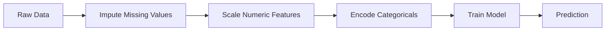
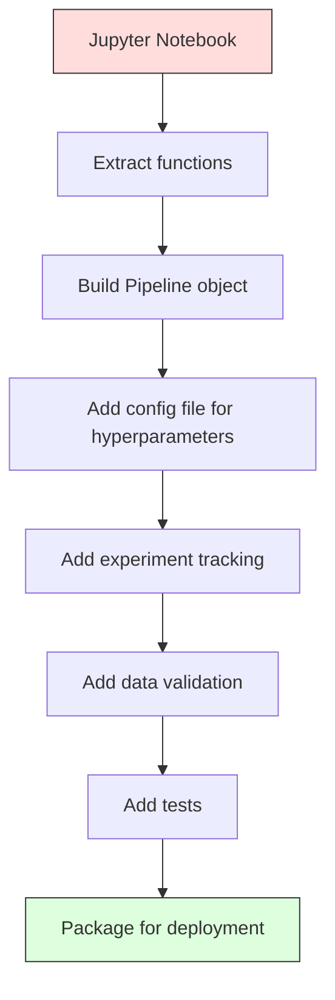

# 道
# 管线


> 模型不是产品,管道是.从原始数据到部署的预测,每个步骤都必须可复制.

> 模型不是产品,管线才是.管线是从原始数据到部署预测的一切,每一步都必须可复制.

**Type:** Build | **类型：** 构建
**Language:**子**语言：**字符串
**Prerequisites:** Phase 2, Lesson 12 (Hyperparameter Tuning) | **前置知识：** Phase 2 第 12 课（超参数调优）
**Time:** ~120 minutes | **时间：** 约 120 分钟

## 学习目标

- 从零开始构建一个ML管道,将计算,扩展,编码和模型训练链接到一个可复制的对象中
  从零构建 ML 管线,将填充,缩放,编码和模型训练链接到单个可复制的对象
- 确定数据泄露情景,并解释管道如何通过仅基于训练数据安装变压器来防止这些泄漏情景
  识别数据泄露场景,解释管线如何通过仅在训练数据上适合变换器来防止泄露
- 构建一个应用不同的预处理数值和类别特征的 ColumnTransformer
  构建列变压器,对数值和类型特征应用不同预处理
- 实施管道串行化,证明同一座装配管道在培训和生产中产生相同的结果
  实现管线序列化,展示相同的配合管线在训练和生产中产生相同的结果


> **【中文解读】**
> 管线把数据预处理"",特征工程"",模型训练串成一条流水线"",熟练管线"确保训练和推理的数据处理一致.

> **【拓展：从 sklearn Pipeline 到 MLOps 工业级管线】**
> 处理单机场景的端到端流水线,但在工业界,ML管线涉及更多环节:数据版本管理(DVC) 、实验追踪(MLflow/W&B)、模型注册)、持续训练(CT)、模型服务 (Seldon/TF Serving) ⋅谷歌的TFX(TensorFlow Extended) 和Kubeflow管线是端到端MLOps的代表框架──核心理念不变:每一步都可复现、可追踪、可回滚──

## 问题 问题引入

你有一个笔记本,它载入数据,填写缺失值的中值, 测量特征, 训练模型, 打印准确度. 它工作. 你运送它.

> 你有一个笔记本,加载数据,用中位数填充缺失值,缩写特征,训练模型,打印准确率.

一个月后,有人重新训练了模型,得到了不同的结果. 平均值是在包括测试数据 (数据泄漏) 在整个数据集中计算的. 由于没有保存了扩展参数,因此推断使用不同的统计数据. 训练和服务之间将功能工程代码复制粘贴,复制分离. 类型列在生产中获得了编码器从未见过的新价值.

> 一个月后,有人重新训练模型并获得不同的结果. 中位数是包含测试数据的全量数据集计算的. 缩小参数没有保存,推理时使用不同的统计量.

管道管道解决这些问题,通过将每一步的转型包装成一个单一的,有序的,可复制的对象.

> 这些不是假设. 这些是 ML 系统在生产中失败的最常见原因.

> **【中文解读】**
> 试管线解决的核心问题:训练和推理的数据处理必须完全一致.最常见的失败模式是通过训练中使用全量数据计算平均值进行标准化.

## 概念的核心概念

### 管道是什么

管道是一个有序的数据转换序列,其次是模型.每个步骤都以前一步的输出为输入.整个管道在训练数据上安装一次.在推断时,相同的安装管道将新数据转换并产生预测.

> 管线是一个有序的数据变换序列,最后跟着一个模型.每个步骤将上一步的输出作为输入.整个管线在训练数据上合并一次.



管道保障:
- 转型仅基于训练数据 (无泄漏)
  变换只适合训练数据 (没有泄漏)
- 在推断时,应用相同的转换
  推理时应用相同的变化
- 整个对象可以串行并作为一个文物部署
  整个对象可以序列并作为一个构件部署
- 通过交叉验证,每折管道可进行,防止微妙泄漏
  交叉验证在每折中应用管线,防止微妙的泄漏

### 数据泄露:无声杀手

测试集中的信息或未来数据污染了训练时,数据泄露发生.

> 管线防止最常见的泄漏形式.

**Leaky (wrong):**
```python
X = df.drop("target", axis=1)
y = df["target"]

scaler = StandardScaler()
X_scaled = scaler.fit_transform(X)

X_train, X_test = X_scaled[:800], X_scaled[800:]
y_train, y_test = y[:800], y[800:]
```

测量仪看到测试数据.平均和标准偏差包括测试样本. 这使得准确性估计膨胀.

> 缩放器看到了测试数据――平均值和标准差包含测试样本――这会夸大准确率估计――

**Correct:**
```python
X_train, X_test = X[:800], X[800:]

scaler = StandardScaler()
X_train_scaled = scaler.fit_transform(X_train)
X_test_scaled = scaler.transform(X_test)
```

管道,你不需要考虑这个问题.

> 使用管线,你不需要考虑这些.

### 斯克拉恩管道

斯克拉恩的`Pipeline`它们可以将其变化成一个变量器.`.fit()`现在`.predict()`其他`.score()`它们将采取一切措施.

> 牛牛的`Pipeline`变换器和估计器链接起来.`.fit()`,我知道.`.predict()`和 `.score()`按顺序应用所有步骤.

```python
from sklearn.pipeline import Pipeline
from sklearn.preprocessing import StandardScaler
from sklearn.linear_model import LogisticRegression

pipe = Pipeline([
    ("scaler", StandardScaler()),
    ("model", LogisticRegression()),
])

pipe.fit(X_train, y_train)
predictions = pipe.predict(X_test)
```

当你打电话时`pipe.fit(X_train, y_train)`其他:
1. 度调用器`fit_transform`在X_列车上
2. 电话模式`fit`在级X_列车上

当你打电话时`pipe.predict(X_test)`其他:
1. 度调用器`transform`(不是 fit_transform) 在X_test上
2. 电话模式`predict`在测量 X_test 上

测量器在安装过程中从来没有看到测试数据.

> 当你调用`pipe.fit(X_train, y_train)`其他:
> 1. 缩放器对X_train 调用 `fit_transform`
> 2. 模型对缩放后的X_train调用`fit`
其他
> 当你调用`pipe.predict(X_test)`其他:
> 1. 缩放器对X_test 调用 `transform`(不是适合_转换)
> 2. 模型对缩放后的X_test调用`predict`
其他
> 缩放器在拟合期间永远看不到测试数据――这就是全部意义――

### 列变压器:不同列的不同管道

实际数据集具有需要不同的预处理的数值和类别列. `ColumnTransformer`处理这个.

> 真实数据集有数值列和类别列,需要不同的预处理.`ColumnTransformer`处理这个.

```python
from sklearn.compose import ColumnTransformer
from sklearn.preprocessing import StandardScaler, OneHotEncoder
from sklearn.impute import SimpleImputer

numeric_pipe = Pipeline([
    ("impute", SimpleImputer(strategy="median")),
    ("scale", StandardScaler()),
])

categorical_pipe = Pipeline([
    ("impute", SimpleImputer(strategy="most_frequent")),
    ("encode", OneHotEncoder(handle_unknown="ignore")),
])

preprocessor = ColumnTransformer([
    ("num", numeric_pipe, ["age", "income", "score"]),
    ("cat", categorical_pipe, ["city", "gender", "plan"]),
])

full_pipeline = Pipeline([
    ("preprocess", preprocessor),
    ("model", GradientBoostingClassifier()),
])
```

其他`handle_unknown="ignore"`在OneHotEncoder中,对于生产至关重要.当出现一个新类别 (一个模型从未见过的城市) 时,它会产生零向量,而不是崩.

> 单机编码器 中的`handle_unknown="ignore"`对于生产至关重要.当新类型出现时,它产生零向量而不是崩.

### 实验追踪

一个管道使训练可复制,但你还需要跟踪实验中发生的事情:哪些超参数被使用,哪些数据集版本,哪些指标,哪些代码运行.

> 管线让训练可复制,但你还需要跟踪实验间发生了什么:使用哪些超参数,哪些数据集版本,指标是什么,运行的是哪些代码.

**MLflow**是最常见的开源解决方案:

> **MLflow**是最常见的开源方案:

```python
import mlflow

with mlflow.start_run():
    mlflow.log_param("max_depth", 5)
    mlflow.log_param("n_estimators", 100)
    mlflow.log_param("learning_rate", 0.1)

    pipe.fit(X_train, y_train)
    accuracy = pipe.score(X_test, y_test)

    mlflow.log_metric("accuracy", accuracy)
    mlflow.sklearn.log_model(pipe, "model")
```

每次运行都会记录参数,指标,文物和完整模型.你可以比较运行,复制任何实验,并部署任何模型版本.

> 每次运行都记录参数,标志,构件和完整模型.你可以比较运行,复现任何实验,部署任何模型版本.

**Weights & Biases (wandb)**提供与托管仪表板相同的功能:

> **Weights & Biases (wandb)**提供相同功能,带托管仪表盘:

```python
import wandb

wandb.init(project="my-pipeline")
wandb.config.update({"max_depth": 5, "n_estimators": 100})

pipe.fit(X_train, y_train)
accuracy = pipe.score(X_test, y_test)

wandb.log({"accuracy": accuracy})
```

### 模型版本

经过实验跟踪,你需要管理模型版本.哪个模型正在生产?

> 经过实验追踪,你需要管理模型版本.

MLflow的模型登记表提供:
- **Version tracking:**每个保存的模型都得到了版本号码
  **版本追踪：**每个保存的模型获得版本号
- **Stage transitions:**"演出","制作","档案"
  **阶段转换：**演出,制作,档案
- **Approval workflow:**模型必须明确推广到生产中
  **审批工作流：**模型必须显然升级到生产
- **Rollback:**立即返回以前版本
  **回滚：**立即切回之前的版本

### 使用DVC进行数据版本

代码是与 git 版本的.数据也应该是版本的,但 git 不能处理大型文件.

> 代码使用 git 版本化.数据也应该版本化,但 git 不能处理大文件.

```
dvc init
dvc add data/training.csv
git add data/training.csv.dvc data/.gitignore
git commit -m "Track training data"
dvc push
```

存储数据在远程存储 (S3,GCS,Azure) 中,并存储一个小数据库.`.dvc`在 Git 中记录了哈希的文件.`dvc checkout`恢复使用的数据.

> 实际数据存储处远端 (S3、GCS、Azure),在 git 中保留一个小的`.dvc`文件记录哈希. 当你收到一个报价时,`dvc checkout`恢复当时使用的精确数据.

这意味着每个Git提交脚本都包含了代码和数据.

> 这意味着每个提交的代码和数据都同时固定.

### 可复制实验

复制实验需要四件事:

> 一个可复制的实验需要四件事:

1. **Fixed random seeds:**设置,随机和框架的种子 (火, sklearn)
   **固定随机种子：**为numpy、random 和框架(火、学习) 设置种子
2. **Pinned dependencies:**要求.txt或 poetry.lock,含确切版本
   **固定依赖：**要求.txt 或诗歌.锁 锁定精确版本
3. **Versioned data:**酸或类似的酸
   **版本化数据：**轮或类似工具
4. **Config files:**配置中的所有超参数,不是硬码
   **配置文件：**所有超级参数配置,不要硬编码

```python
import numpy as np
import random

def set_seed(seed=42):
    random.seed(seed)
    np.random.seed(seed)
    try:
        import torch
        torch.manual_seed(seed)
        torch.cuda.manual_seed_all(seed)
        torch.backends.cudnn.deterministic = True
    except ImportError:
        pass
```

### 从笔记本到生产管道



典型的进展:

> 典型演进:

1. **Notebook exploration:**快速实验,可视化,功能想法
   **notebook 探索：**快速实验,可视化,特征思想
2. **Extract functions:**转移预处理,功能工程,评估成模块
   **抽取函数：**预处理,特征工程,评估转移到模块中
3. **Build Pipeline:**链转换成 sklearn管道或定制类
   **构建 Pipeline：**把变换链成 货币管道或自定义类
4. **Config management:**将所有超参数移动到YAML/JSON配置中
   **配置管理：**把所有超参数移到YAML/JSON 配置
5. **Experiment tracking:**添加MLflow或棒b记录
   **实验追踪：**添加 ML流或b 日志
6. **Data validation:**在训练前检查方案,分布和缺失值模式
   **数据验证：**训练前检查方案分布缺失模式
7. **Tests:**变压器的单元测试,整个管道的集成测试
   **测试：**变换器的单元测试、完整管线的集成测试
8. **Deployment:**连续化管道,包装在一个API (FastAPI,Flask),集装
   **部署：**序列化管线、包成API(快速API、瓶)、容器化

### 常见的管道错误

| Mistake | Why it is bad | Fix |
|---------|-------------|-----|
| Fitting on full data before splitting | Data leakage | Use Pipeline with cross_val_score |
| Feature engineering outside pipeline | Different transforms at train vs serve | Put all transforms in the Pipeline |
| Not handling unknown categories | Production crash on new values | OneHotEncoder(handle_unknown="ignore") |
| Hardcoded column names | Breaks when schema changes | Use column name lists from config |
| No data validation | Silently wrong predictions on bad data | Add schema checks before prediction |
| Training/serving skew | Model sees different features in prod | One Pipeline object for both |

| 错误 | 为什么坏 | 修复 |
|------|---------|------|
| 划分前在全量数据上 fit | 数据泄漏 | 用 Pipeline 配合 cross_val_score |
| 管线外做特征工程 | 训练和服务变换不同 | 把所有变换放进 Pipeline |
| 不处理未知类别 | 生产中新值导致崩溃 | OneHotEncoder(handle_unknown="ignore") |
| 硬编码列名 | schema 改变时失效 | 用配置中的列名列表 |
| 没有数据验证 | 坏数据上预测错误无提示 | 预测前加 schema 检查 |
| 训练/服务偏差 | 生产中模型看到不同特征 | 训练和服务用同一个 Pipeline 对象 |

## 建立它,实现它.

> **【中文解读】**
> 从零实现 ML 管线:自定义变压器 (自定义变压器) 、管线类型 、链式调用多个变换器) 、列变压器 (ColumnTransformer) (按列分组处理不同类型特征) ⋅管线的关键保证是:只在训练数据上学习参数,在测试/推理数据上应用变化,绝对数据泄漏――

> **【拓展：sklearn Pipeline 在 Kaggle 和工业界的标准模式】**
> 卡格格格兰大师的标准代码模板几乎总是包含一个 sklearn管道:数值特征使用 SimpleImputer + StandardScaler,类别特征使用 SimpleImputer + OneHotEncoder,通过 ColumnTransformer 组合后输入模型──这确保:交叉验证中每次独立适应、新数据推理时变化一致、代码简洁可维护──在生产中,Pipeline可使用工作序列保存,部署时直接加载使用──
```figure
f3-pipeline-flow
```

## 建立它

编码在`code/pipeline.py`从零开始构建一个完整的 ML 管道:

### 步骤1:定制变压器

```python
class CustomTransformer:
    def __init__(self):
        self.means = None
        self.stds = None

    def fit(self, X):
        self.means = np.mean(X, axis=0)
        self.stds = np.std(X, axis=0)
        self.stds[self.stds == 0] = 1.0
        return self

    def transform(self, X):
        return (X - self.means) / self.stds

    def fit_transform(self, X):
        return self.fit(X).transform(X)
```

### 步骤2:从零开始的管道

```python
class PipelineFromScratch:
    def __init__(self, steps):
        self.steps = steps

    def fit(self, X, y=None):
        X_current = X.copy()
        for name, step in self.steps[:-1]:
            X_current = step.fit_transform(X_current)
        name, model = self.steps[-1]
        model.fit(X_current, y)
        return self

    def predict(self, X):
        X_current = X.copy()
        for name, step in self.steps[:-1]:
            X_current = step.transform(X_current)
        name, model = self.steps[-1]
        return model.predict(X_current)
```

### 步骤3:通过管道进行交叉验证

该代码展示了如何通过管道进行交叉验证来防止数据泄露:每个折叠的训练数据上,尺度仪是单独安装的.

### 步骤4:全生产管道

完整的管道`ColumnTransformer`经过多次预处理路径,以及一个模型,经过适当的交叉验证和实验记录.

## 运送它.

这一课产生了:
- `outputs/prompt-ml-pipeline.md`-- 建立和调试ML管道的技能
- `code/pipeline.py`--从零开始,通过Skularn完成的管道

## 练习题

1. 建立一个处理数据集的管道,包含3个数字列和2个类别列. 使用 `ColumnTransformer`运用中位数计算+扩展数值和最常见的计算+单热编码对类别. 训练使用5倍的交叉验证.
   1. 构建处理3个数值列和2个类别列的数据集的管线.`ColumnTransformer`对于数值列应用中位数填充+缩放,对类别列应用数量填充+独热编码――使用5折交叉验证训练――

2. 故意引入数据泄露:在分开之前将扩展器放在整个数据集上. 比较交叉验证分数 (泄漏) 和管道交叉验证分数 (清洁). 差异有多大?
   2. 由于引入数据泄漏:在分类前对全量数据合适的规模器进行比较.

3. 连续化管道`joblib.dump`运行预测,检查预测是否相同.
   3. 用`joblib.dump`序列化你的管线――在另一个脚本中加载并运行预测――验证预测完全相同――

4. 添加一个定制变压器,为两个最重要的数列创建多项函数 (二级).该函数应该进入哪里?
   4. 在管线中添加一个自定义变换器,为最重要的两个数值列创建多项特征 ((二级) ⋅应放在管线的位置?

5. 设置MLflow跟踪管道.运行5次实验,使用不同的超参数.使用MLflow UI (`mlflow ui`) 进行比较,选择最佳车型.
   5. 为管线设置MLflow 追踪――用不同超参数运行 5 个实验――用MLflow UI(`mlflow ui`) 较运行并选择最佳模型――

> **【中文解读】**
> 管线的关键设计原则: 1) 所有变换必须可序列化使用工作簿/选 保存完整的装配管线,部署时直接加载; 2) 列Transformer 处理混合类型数值特征和类型特征分别变换后合并; 3) 管线内不能有任何全局状态每个变压器的适应只依赖传输的训练数据.

> **【拓展：数据泄漏的六种常见形式】**
> (1) 在全量数据上适应尺度重新划分;[2] 目标编码使用全量数据计算平均值;[3] 时间序列随机划分;[4] 特征选择在全量数据上做;[5] 交叉验证中重复样本出现多次;[6] 预测时使用未来才能获取的特征.

## 关键词 快速查找表

| Term | What people say | What it actually means |
|------|----------------|----------------------|
| Pipeline | "Chain of transforms + model" | An ordered sequence of fitted transformers and a model, applied as one unit to prevent leakage |
| Data leakage | "Test info leaked into training" | Using information from outside the training set to build the model, inflating performance estimates |
| ColumnTransformer | "Different preprocessing per column" | Applies different pipelines to different subsets of columns, combining results |
| Experiment tracking | "Logging your runs" | Recording parameters, metrics, artifacts, and code versions for every training run |
| MLflow | "Track and deploy models" | Open-source platform for experiment tracking, model registry, and deployment |
| DVC | "Git for data" | Version control system for large data files, storing hashes in git and data in remote storage |
| Model registry | "Model version catalog" | A system that tracks model versions with stage labels (staging, production, archived) |
| Training/serving skew | "It worked in the notebook" | Differences between how data is processed during training versus inference, causing silent errors |
| Reproducibility | "Same code, same result" | The ability to get identical results from the same code, data, and configuration |

## 继续阅读 继续阅读

- [scikit-learn Pipeline docs](https://scikit-learn.org/stable/modules/compose.html)-- 官方管道参考
  [scikit-learn Pipeline 文档](https://scikit-learn.org/stable/modules/compose.html)- 官方管线参考
- [MLflow documentation](https://mlflow.org/docs/latest/index.html)--实验跟踪和模型登记
  [MLflow 文档](https://mlflow.org/docs/latest/index.html)- 实验追踪和模型注册
- [DVC documentation](https://dvc.org/doc)-- 数据版本
  [DVC 文档](https://dvc.org/doc)- 数据版本管理
- [Sculley et al., Hidden Technical Debt in Machine Learning Systems (2015)](https://papers.nips.cc/paper/2015/hash/86df7dcfd896fcaf2674f757a2463eba-Abstract.html)--关于 ML 系统复杂性的重要论文
  [Sculley et al., Hidden Technical Debt in ML Systems (2015)](https://papers.nips.cc/paper/2015/hash/86df7dcfd896fcaf2674f757a2463eba-Abstract.html)- 复杂性系统的基础论文
- [Google ML Best Practices: Rules of ML](https://developers.google.com/machine-learning/guides/rules-of-ml)-- 实际生产 ML 建议
  [Google ML Best Practices](https://developers.google.com/machine-learning/guides/rules-of-ml)- 实用生产 ML 建议
