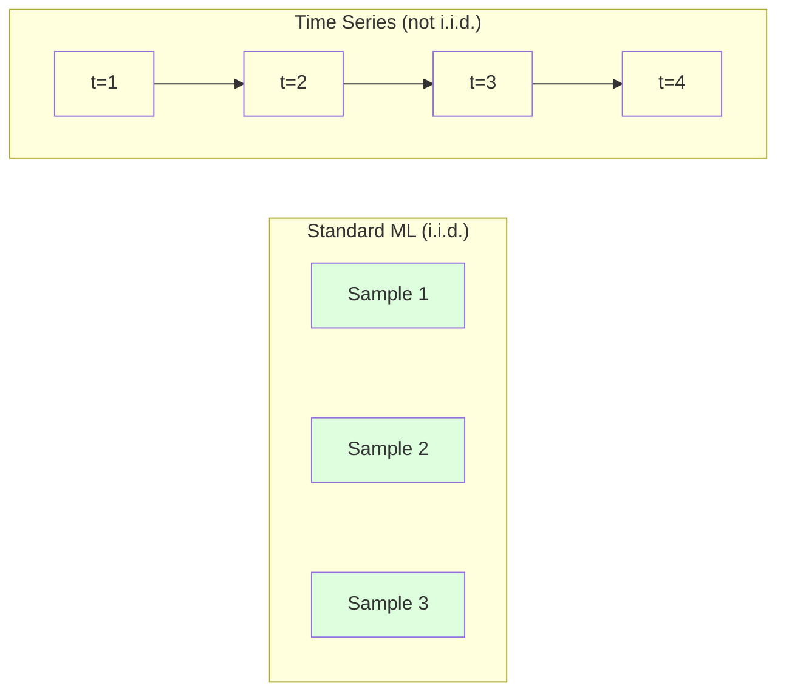
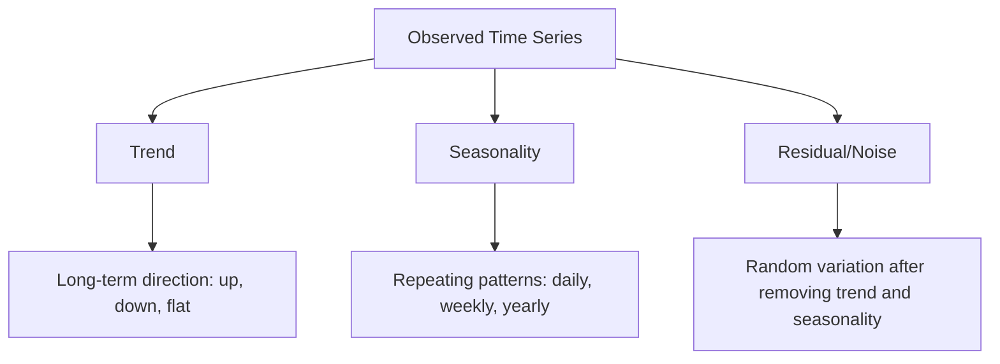
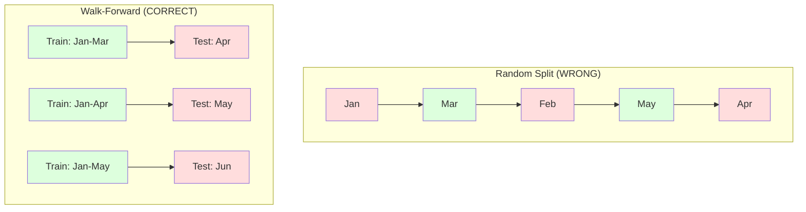

# 时间系列的基本知识
# 时间序列基础


> 如果先检查停滞,过去的表现确实能预测未来的结果.

> 过去的表现确实能预测未来,前提是你先检查平稳性.

**Type:** Build | **类型：** 构建
**Language:**子**语言：**字符串
**Prerequisites:** Phase 2, Lessons 01-09 | **前置知识：** Phase 2 第 1-9 课
**Time:** ~90 minutes | **时间：** 约 90 分钟

## 学习目标

- 分解时间序列成趋势,季节性和残留组件,测试静止性
  将时间序列分解为趋势,季节性和残差分量,并检查平稳性
- 实现延迟功能和滚动统计数据,将时间序列转化为监督学习问题
  实现滞后特征和滚动统计将时间序列转换为监督学习问题
- 建立一个前进验证框架,以防止未来数据泄露到培训中
  构建前向滚动验证框架,防止未来数据泄露到训练中
- 解释为什么随机列车/测试分区对时间序列不有效,并证明性能差距与适当的时间分区
  解释为什么随机训练/测试分类对时间序列是无效的,并使用正确的时间分类显示性能差距


> **【中文解读】**
> 时间序列是按时间序列排列的数据.ARIMA,指数平滑是经典方法,LSTM/变压器是深度学习方法.

> **【拓展：时间序列预测在金融和供应链中的关键角色】**
> 亚马逊使用时间序列预测来管理全球数亿 SKU库存,每天预测量超过400亿次;Uber使用时间序列模型预测需求来动态调调价;金融机构使用ARIMA/GARCH 模型预测波动率进行风险管理.

## 问题 问题引入

您有时间排列的数据,每天的销售,每小时的温度,每分钟的CPU使用,每周的股价.

> 你有时间排序的数据. 日销量,小时温度,每分钟的CPU使用率,周股价.

你需要一个标准的 ML 工具包:随机列车/测试分区,交叉验证,功能矩阵进入,预测出.

> 你使用标准 ML 工具:随机训练/测试划分、交叉验证、特征矩阵输入、预测输出──每一步都是错误的──

时间系列打破了标准ML依赖的假设. 样本并不独立 - - 今天的温度取决于昨天的温度. 随机分区泄漏未来的信息到过去. 后测试中看起来很好的功能在生产中失败,因为它们依赖于随时间而改变的模式.

> 时间序列打破了标准ML所依赖的假设. 样本不是独立的. 现在的温度取决于昨天的温度. 随机分开将未来的信息泄露到过去. 在回测中,看起来很好,因为它们依赖于随时间变化的模式.

随机交叉验证的模型可以获得95%的准确性,但如果进行适当的时间评估,则可能会获得55%.

> 在随机交叉验证中获得95%的准确率的模型在正确的时间评估下可能只获得55%的模型.

这一课涵盖了基本知识:什么使时间数据变得不同,如何诚实地评估模型,以及如何将时间系列转化为标准ML模型可以使用的功能.

> 本课程涵盖基础知识:什么使时间数据不同,如何诚实地评估模型,以及如何将时间序列转化为标准ML模型的可使用特征.

> **【中文解读】**
> 时间序列分析的独特之处在于数据点之间有时间依赖性今天的价值依赖于昨天的价值――这打破了标准ML的独立与分布假设――核心概念:平稳性(稳定性) 统计特性不随时间变化;趋势+季节性+残差分解;滞后特征和滚动统计将序列转化为监督学习问题――正确的评估方法是步向验证,而不是随机交叉验证――

## 概念的核心概念

### 时间系列是什么不同?

标准ML假设i.i.d. - 独立且分布相同.每个样本都是从相同的分布中抽取的,独立于其他样本.时间系列违反了以下两种:

> 标准 ML 假设 i.i.d.独立同分布.每个样本从相同的分布中抽取,与其他样本无关.时间序列违反了这两个假设:

- **Not independent.**今天的股价取决于昨天的股价. 本周的销售与上周的销售相对.
  不独立――今天的股价取决于昨天的――本周的销售额与上周相关――
- **Not identically distributed.**随着时间的推移,分销量变化.
  不同分布. 随着时间的变化而分布. 12月的销售额与 3月的不同.

这些违规行为并不小,而是改变了你构建功能的方式,

> 这些违反不是小问题.它们改变了你如何构建特征,如何评估模型以及哪些算法有效.



在标准ML中,样本是可替换的. 混动它们不会改变任何东西. 在时间序列中,顺序是一切. 混动破坏信号.

> 在标准ML中,样本是可互换的.

### 时间系列的组成部分

每个时间系列都是:

> 每个时间序列都是以下成分的组合:



- **Trend**长期方向:收入每年增长10% 全球气温上升
  趋势:长期方向――收入每年增长10%――全球气温上升――
- **Seasonality**零售销售量在12月升.空调使用量在7月升.
  季节性:固定间隔的重复模式――零售销售额在12月增长――空调使用量在7月达到峰值――
- **Residual**随着移除趋势和季节性之后所剩下的任何东西. 如果残留物看起来像白噪声,分解就捕获了信号.
  差距:除了趋势和季节性后剩下的部分.

### 固定性

时间序列是静止的,如果其统计性质 (平均值,变异性,自相相性) 随着时间的推移不变.大多数预测方法都假设静止性.

> 如果一个时间序列的统计特性 (平均值,方差,自相关) 不随时间变化,则它是平稳的.

**Why it matters:**没有固定的系列有漂移的平均值.一个基于1月的数据训练的模型已经学到了与2月的平均值不同.

> **为什么重要：**不平稳序列的平均值会漂移. 使用1月数据训练模型学习的平均值与2月显示的不同.

**How to check:**计算滚动平均值和滚动标准偏差在窗户上.如果它们漂移,则系列是非静止的.

> **如何检查：**计算窗口中的滚动平均值和滚动标准差. 如果它们漂移,序列是不平稳的.

**How to fix:**区分. 代替模拟原价值,模拟连续值之间的变化:

> **如何修复：**差分──不对原始值建模,而是对连续值之间的变化建模:

```
diff[t] = value[t] - value[t-1]
```

如果一个分化轮不使系列停滞,请再次应用 (二级分化).大多数现实世界系列需要最多两轮.

> 如果一轮差分不能使序列平稳,再应用一次.

**Example:**

> **示例：**

首页: 首页: 首页: 首页: 首页: 首页: 首页: 首页: 首页: 首页: 首页: 首页: 首页: 首页: 首页: 首页: 首页: 首页: 首页: 首页: 首页: 首页: 首页: 首页: 首页: 首页: 首页: 首页: 首页: 首页: 首页: 首页: 首页: 首页: 首页: 首页: 首页: 首页: 首页: 首页: 首页: 首页: 首页: 首页: 首页: 首页: 首页: 首页: 首页: 首页: 首页: 首页: 首页: 首页: 首页:
第一个差异: [2, 4, 6, 8] (仍然向上趋势)
第二种差异: [2,2, 2] (恒定--静止)

实际上,你很少需要超过两个轮. 实际上,你很少需要两个轮.

> 原始序列有二次趋势――一阶差分将其变为线性趋势――二阶差分使其平坦――在实践中,你很少需要超过两轮――

**Formal test:**增强式式式测试 (ADF) 是静止性的标准统计测试.零假设是"系列是非静止的".0.05以下的p值意味着你可以拒绝零并得出静止性结论.我们从零开始不实现ADF (它需要无比分分布表),但我们的代码中的滚动统计方法提供了实际的视觉检查.

> **正式检验：**增强的迪克-富勒 (ADF) 检查是平稳的标准统计检查.零假设是"序列不平稳" (序列不平稳).p 值低于0.05意味着你可以拒绝零假设并得出平稳的结论.

### 自身相关性

自动相对度测量时间 t 的值与时间 t-k 的值相对度 (过去的 k 步骤).自动相对度函数 (ACF) 为每个 lag k 绘制了这种相对度.

> 自相关衡量时间 t 的值与时间 t-k 过去 k 步的值之间的相关性――自相关函数――ACF 绘制每个滞后 k 的相关性――

**ACF tells you:**
- 如果在5步后ACF下降到零,则5步前的值是无关的.
  序列的记忆很远. 如果ACF在5后滞后降至零,超过5步之前的值就无关.
- 如果ACF在12次 (月度数据) 后期上升,则会有年度季度性.
  如果ACF在12个月数据后出现峰值,则会出现年度季节性.
- 运用延迟到ACF变得微不足道的地方.
  创建多少滞后特征――使用直到ACF变得可忽视的滞后――

**PACF (Partial Autocorrelation Function)**如果今天与3天前相对应,因为两者都与昨天相对应,PACF在3次滞后时将是零,而ACF在3次滞后时不会.

> **PACF（偏自相关函数）**除间接相关性.如果今天与前3天相关的只是因为两者都与昨天相关,PACF在滞后3处于零,而ACF在滞后3处于零.

### 延迟特征:将时间系列转化为监督学习

标准ML模型需要一个特征矩阵X和一个目标y.时间系列给你一个单一的值列.桥梁是滞后特征.

> 标准 ML 模型需要特征矩阵 X 和目标 y.时间序列给你一列值.

设置一个后期的位置,

> 取序列 [10, 12, 14, 13, 15] 并创建滞后 1 和滞后 2 特征:

| lag_2 | lag_1 | target |
|-------|-------|--------|
| 10    | 12    | 14     |
| 12    | 14    | 13     |
| 14    | 13    | 15     |

任何ML模型 (线性回归,随机森林,梯度增强) 都可以从滞后预测目标.

> 现在你有一个标准的回归问题.任何ML模型都可以从滞后特征预测目标.

您可以设计的其他功能:
- **Rolling statistics:**平均值,std,min,max 在最后的k值上
  滚动统计:过去的 k 个值的平均值,标准差,最小值,最大值
- **Calendar features:**周日,月,节日,周末
  日历特征:星期几月份是否假期是否周末
- **Differenced values:**与前一步的变化
  差分值:与前一步的变化
- **Expanding statistics:**累计平均,累计总额
  扩展统计:累积平均值,累积和
- **Ratio features:**现行值/滚动平均值 (与最近的平均值有多远)
  比率特征:当前值/滚动平均值 (与近期平均值的偏离程度)
- **Interaction features:**_1 * 周日 (周日对动力的影响)
  交互特征:lag_1 *周一天

**How many lags?**如果 ACF 值高于10个滞后,则至少使用10个滞后.如果有周季节性,则包括7个滞后 (可能14个).更多的滞后给模型更多的历史,但也增加了更大的功能,增加了过度适应的风险.

> **用多少个滞后？**如果 ACF 在滞后10以内都显著,至少使用10个滞后.如果有周季节性,包括滞后7 (可能还有14).

**The target alignment trap.**创建时,目标必须是时间 t 的值,所有功能必须使用时间 t-1 或更早的值.如果你意外地将时间 t 的值作为一个功能,你有一个完美的预测器 - - 和一个完全无用的模型.这是时间系列功能工程中最常见的错误.

> **目标对齐陷阱。**创建滞后特征时,目标必须是时间 t 的值,所有特征必须使用时间 t-1 或更早的值.如果你不小心将时间 t 的值作为特征,你就有一个完美的预测器,但也是一个完全无用的模型.这是时间序列特征工程中最常见的错误.

### 经验证

这就是这个课程中最重要的概念.标准的k倍交叉验证随机分配样本进行训练和测试.对于时间序列,这泄露未来的信息.

> 这就是本课程最重要的概念. 标准的交叉验证随时分配样本到训练集和测试集.



进行前进验证:
1. 运行数据到时间 t
   在时间 t 之前的数据上训练
2. 在时间 t+1 (或 t+1 到 t+k 多步) 中预测
   在时间 t+1 预测(或多步预测 t+1 到 t+k)
3. 滑向前窗户
   往前滑动窗口
4. 复制
   重复 其他

每个测试折叠只包含所有训练数据后的数据. 没有未来泄漏. 这让你一个诚实的估计模型将在部署时表现如何.

> 每次测试折扣只包含了所有训练数据后的数据.

**Expanding window**通过使用所有历史数据进行培训 (窗口增长).**Sliding window**使用固定尺寸的训练窗口 (窗口幻灯片). 扩展使用当你认为旧数据仍然相关时. 改变世界和旧数据伤害时使用幻灯片.

> **扩展窗口**使用所有历史数据进行训练.**滑动窗口**使用固定大小的训练窗口 (滑动窗口) ◊当你认为旧数据仍然相关时使用扩展窗口――当世界变化和旧数据有害时使用滑动窗口――

### 艾里马直觉

亚里马是经典时间序列模型. 它有三个组成部分:

> 亚里马是经典的时间序列模型. 它有三个组成部分:

- **AR (Autoregressive):**预测从过去的值.AR(p) 使用最后的p值.
  过去的价值预测.
- **I (Integrated):**为了实现静止性,进行分化.
  通过差分实现平稳性.
- **MA (Moving Average):**预测从过去的预测错误.
  移动平均:从过去的预测误差预测.

根据ACF/PACF分析或自动搜索 (自动ARIMA) 选择p,d,q.

> 根据ACF/PACF 分析或自动搜索,你选择了所有三个成分.

我们不会从零开始实现ARIMA,它需要数字优化,这超出了本课程的范围.关键的见解是了解每个组件的作用,

> 我们不会从零实现ARIMA它需要超越课程范围的数值优化.关键洞察是理解每个成分的作用,这样你就能理解ARIMA的结果并知道何时使用它.

### 什么时候使用

| Approach | Best For | Handles Seasonality | Handles External Features |
|----------|---------|-------------------|------------------------|
| Lag features + ML | Tabular with many external features | With calendar features | Yes |
| ARIMA | Single univariate series, short-term | SARIMA variant | No (ARIMAX for limited) |
| Exponential smoothing | Simple trend + seasonality | Yes (Holt-Winters) | No |
| Prophet | Business forecasting, holidays | Yes (Fourier terms) | Limited |
| Neural networks (LSTM, Transformer) | Long sequences, many series | Learned | Yes |

对于大多数实际问题来说,延迟功能+梯度增强是最强的起点.它自然处理外部功能,不需要静止性,并且很容易调试.

> 对于大多数实际问题来说,滞后特征+梯度升级是最强的起点.

### 预测水平和战略

单步预测预测一个步骤前进.多步预测预测多步骤.有三个策略:

> 单步预测预测 下一个时间步──多步预测预测多个时间步──有三种策略:

**Recursive (iterated):**预测一个步骤前进,使用预测作为下一步的输入. 简单,但错误积累 - 每个预测都使用了之前的预测,所以错误复合.

> **递归（迭代）：**预测一步将预测结果作为下一步的输入. 简单但错误会积累.

**Direct:**训练一个单独的模型,为每个视界.模型-1预测t+1,模型-5预测t+5.没有错误积累,但每个模型都有较少的训练样本,并且它们没有分享信息.

> **直接：**为每一个预测范围训练单独的模型――模型-1 预测 t+1,模型-5 预测 t+5――没有积累的差异,但每个模型的训练样本更少且没有共享信息――

**Multi-output:**训练一个同时输出所有视野的模型. 通过视野共享信息,但需要支持多个输出 (或自定义输失函数) 的模型.

> **多输出：**训练一个模型同时输出所有预测范围――跨范围共享信息,但需要支持多输出模型 (或自定义损失函数) ――

对于大多数实际问题,开始用短视野 (1-5 步) 的递归和长视野的直径.

> 对于大多数实际问题,短范围 (短范围) 则用递归,长范围用直接方法.

### 时间序列中的常见错误

| Mistake | Why it happens | How to fix |
|---------|---------------|-----------|
| Random train/test split | Habit from standard ML | Use walk-forward or temporal split |
| Using future features | Feature at time t included by mistake | Audit every feature for temporal alignment |
| Overfitting to seasonality | Model memorizes calendar patterns | Hold out a full seasonal cycle in the test set |
| Ignoring scale changes | Revenue doubles but patterns stay | Model percentage change instead of absolute |
| Too many lag features | "More history is better" | Use ACF to determine relevant lags |
| Not differencing | "The model will figure it out" | Tree models handle trends; linear models need stationarity |

## 建立它,实现它.

> **【中文解读】**
> 从零实现时间序列的核心工具:滞后特征生成器 (滞后特征生成器) 将序列转化为监督学习格式) 滚动统计 (滚动平均,移动标准差) 平稳性检查 (平稳性检查) 进行ADF检查 (ADF检查) 时间序列分解 (趋势+季节性+残差) 步向前验证框架 (步向前验证框架) 关键教训:绝不能随机划分时间序列数据――

> **【拓展：从 ARIMA 到 Transformer——时间序列预测的进化】**
> 经典时间序列方法 (ARIMA、Holt-Winters) 在单变量、短序列上仍然有效.但现代方法已经大幅度超过了:Facebook的Prophet自动处理节假日和季节性;亚马逊的DeepAR使用自归 RNN做概率预测;谷歌的TimesFM和亚马逊的Chronos使用变压器架构,在零样本中取得突破.
```figure
f3-series-decompose
```

## 建立它

编码在`code/time_series.py`实现了从零开始的核心构建块.

> `code/time_series.py`中代码从零实现了核心构建模块.

### 拉格特征创作者

```python
def make_lag_features(series, n_lags):
    n = len(series)
    X = np.full((n, n_lags), np.nan)
    for lag in range(1, n_lags + 1):
        X[lag:, lag - 1] = series[:-lag]
    valid = ~np.isnan(X).any(axis=1)
    return X[valid], series[valid]
```

这将1D系列转换为一个特征矩阵,每个行都有最后一个`n_lags`作为特征的值,作为目标的当前值.

> 这将是一个维序列转换为特征矩阵,每行将近.`n_lags`个值作为特征,当前值作为目标.

### 走向向的十字验证

```python
def walk_forward_split(n_samples, n_splits=5, min_train=50):
    assert min_train < n_samples, "min_train must be less than n_samples"
    step = max(1, (n_samples - min_train) // n_splits)
    for i in range(n_splits):
        train_end = min_train + i * step
        test_end = min(train_end + step, n_samples)
        if train_end >= n_samples:
            break
        yield slice(0, train_end), slice(train_end, test_end)
```

每个分区都确保训练数据都在测试数据之前得到严格的准备.

> 每次分别确保训练数据严格在测试数据之前.

### 简单的自动降低模式

纯 AR 模型只是延迟特性的线性回归:

> 纯AR模型就是滞后特征的线性回归:

```python
class SimpleAR:
    def __init__(self, n_lags=5):
        self.n_lags = n_lags
        self.weights = None
        self.bias = None

    def fit(self, series):
        X, y = make_lag_features(series, self.n_lags)
        # Solve via normal equations
        X_b = np.column_stack([np.ones(len(X)), X])
        theta = np.linalg.lstsq(X_b, y, rcond=None)[0]
        self.bias = theta[0]
        self.weights = theta[1:]
        return self
```

这在概念上与课02中的线性回归相同,但适用于相同变量的时间延迟版本.

> 这在概念上与第二课的线性归还相同,但适用于相同变量的时间滞后版本.

### 停留性检查

该代码计算滚动统计数据以视觉和数字评估静止性:

> 代码计算滚动统计,以可视化和数值方式评估平稳性:

```python
def check_stationarity(series, window=50):
    rolling_mean = np.array([
        series[max(0, i - window):i].mean()
        for i in range(1, len(series) + 1)
    ])
    rolling_std = np.array([
        series[max(0, i - window):i].std()
        for i in range(1, len(series) + 1)
    ])
    return rolling_mean, rolling_std
```

如果滚动平均波动或滚动STD变化,则系列是非静止的. 应用区分和检查再次.

> 如果滚动平均值漂移或滚动标准差变化,序列是不平稳的.

代码还通过对比系列的第一半和第二半的静止性来检查. 如果介质差异超过一半的标准偏差或变异比重超过2倍,则该系列被标记为非静止.

> 代码还通过比较序列的前半和后半部分来检查平稳性. 如果平均值差异超过半个标准差异,或方差超过2倍,序列被标记为不平稳.

### 自身相关性

```python
def autocorrelation(series, max_lag=20):
    n = len(series)
    mean = series.mean()
    var = series.var()
    acf = np.zeros(max_lag + 1)
    for k in range(max_lag + 1):
        cov = np.mean((series[:n-k] - mean) * (series[k:] - mean))
        acf[k] = cov / var if var > 0 else 0
    return acf
```

## 用它实现框架

通过 sklearn,您可以直接使用任何回归器的延迟功能:

> 通过Skularn,你可以直接将后期特征用于任何归归器:

```python
from sklearn.linear_model import Ridge
from sklearn.ensemble import GradientBoostingRegressor

X, y = make_lag_features(series, n_lags=10)

for train_idx, test_idx in walk_forward_split(len(X)):
    model = Ridge(alpha=1.0)
    model.fit(X[train_idx], y[train_idx])
    predictions = model.predict(X[test_idx])
```

对于ARIMA,使用统计模型:

> 对于ARIMA,使用统计模型:

```python
from statsmodels.tsa.arima.model import ARIMA

model = ARIMA(train_series, order=(5, 1, 2))
fitted = model.fit()
forecast = fitted.forecast(steps=30)
```

编码在`time_series.py`通过步行前进验证来证明两种方法并进行比较.

> `time_series.py`中代码展示了两种方法,并使用前向滚动验证进行比较.

### 时间系列 分类

 sklearn提供了`TimeSeriesSplit`执行前行验证:

> 商店提供了`TimeSeriesSplit`实现前向滚动验证:

```python
from sklearn.model_selection import TimeSeriesSplit

tscv = TimeSeriesSplit(n_splits=5)
for train_index, test_index in tscv.split(X):
    X_train, X_test = X[train_index], X[test_index]
    y_train, y_test = y[train_index], y[test_index]
    model.fit(X_train, y_train)
    score = model.score(X_test, y_test)
```

这相当于我们从零开始的`walk_forward_split`您可以使用它与`cross_val_score`其他:

> 这就等于我们从零开始实现的.`walk_forward_split`您可以与它进行交流.`cross_val_score`一起使用:

```python
from sklearn.model_selection import cross_val_score

scores = cross_val_score(model, X, y, cv=TimeSeriesSplit(n_splits=5))
print(f"Mean score: {scores.mean():.4f} +/- {scores.std():.4f}")
```

### 评估指标

时间系列预测使用回归指标,但在时间意识的背景下:

> 时间序列预测使用回归指标,但具有时间感知的上下文:

- **MAE (Mean Absolute Error):**平均 y_true - y_pred 语. 简单地解释在原始单位. "平均,预测是3.2度. "
  平均绝对差异: 时时的平均值, 时时的平均差异, 时时的平均差异, 时时的平均差异, 时时的平均差异, 时时的平均值, 时时的平均差异, 时时的平均值, 时时的平均差异, 时时的平均差异, 时时的平均值, 时时的平均差异, 时时的平均差异, 时时的平均差异, 时时的平均值, 时时的平均差异, 时时的平均差异, 时时的平均差差, 时时的平均差, 时时时的平均差, 时时时的平均差, 时时时的平均差, 时时时的平均差, 时时时的平均差, 时时时的平均差, 时时时的差, 时时的平均差为 3,2 度.
- **RMSE (Root Mean Squared Error):**平均二次错误的平方根. 惩罚大错误比MAE. 使用当大错误比许多小错误更糟时.
  平均差距的平方根. 平均差距的平方根.
- **MAPE (Mean Absolute Percentage Error):**平均错误/真值是100. 独立于规模,可用于不同的数组进行比较. 但在真值为零时未定义.
  平均绝对百分比误差: 误差/真实值: * 100 的平均值与尺度无关,适用于跨不同序列比较,但当真实值为零时未定义.
- **Naive baseline comparison:**总是与简单的基线进行比较.季节性天真基线预测了过去一段时间的值 (昨天,上周).如果你的模型不能击败天真,那么有什么不对.
  始终与简单基线相比. 季节性朴素基线预测一个周期前的值. 如果你的模型不能超越朴素基线,说明问题.

### 滚动特征

代码显示,在7天和14天的窗口中增加滚动统计数据 (平均,STD,min,max).这些数据为模型提供了有关近期趋势和波动性的信息,而仅仅拖延特征无法捕获.

> 代码显示将滚动统计 ((7 天和14 天窗口的平均值"",标准差"",最小值"",最大值) 添加到滞后特征中――这些为模型提供了单独的滞后特征无法捕获的近期趋势和波动性信息――

例如,如果滚动平均值上升,这表明上升趋势.如果滚动STD增加,这表明不断增长的波动性.这些是树型模型可以从中学习的模式,但线性模型不能.

> 例如,如果滚动平均值上升,说明有上升趋势.如果滚动标准差异增加,说明波动性在增长.

## 运送它.

这一课产生了:
- `outputs/prompt-time-series-advisor.md`-- 时间序列问题框架的提示
  `outputs/prompt-time-series-advisor.md` 构建时间序列问题的提示词
- `code/time_series.py`-- 延迟功能,前进验证,AR模型,静止性检查
  `code/time_series.py` 滞后特征,前向滚动验证,AR模型,平稳性检查

### 你必须克服的基本标准

在构建任何模型之前,建立基线:

> 在构建任何模型之前,建立基线:

1. **Last value (persistence).**预测明天会像今天一样.
   最后值: 预测: 明天和今天一样.
2. **Seasonal naive.**预测今天将与上周 (或去年) 的同一天相同.
   季节性简单――预测今天与上周 (或去年) 的同一天――如果你的模型不能超越这个基线,它没有学到任何超季节性有用模式――
3. **Moving average.**预测最后一个k值的平均值. 缓解噪音,但不能捕捉突然的变化.
   移动平均――预测最近的 k 个值的平均值――平滑噪音但无法捕捉突变――

如果你的精彩的ML模型失去了季节性天真的基线,你会出现错误.

> 如果你精心设计的ML模型输给了季节性简单基线,你会有错误.

### 实际的建议

1. **Start with plotting.**在进行模型之前,请绘制原始系列. 寻找趋势,季节性,异常值,结构性间断 (行为突然变化). 30 秒的视觉检查通常告诉你超过一个小时的自动分析.
   在任何建模之前,绘制原始序列.寻找趋势,季节性,异常值,结构性突变.

2. **Difference first, model second.**如果系列有明显的趋势,在创建滞后特征之前,请区分它.树型模型可以处理趋势,但线性模型不能,区分永远不会伤害.
   树模型可以处理趋势,但线性模型不能,而差分不会产生负面影响.

3. **Hold out at least one full seasonal cycle.**如果您有每周的季节性,您的测试组需要至少一个完整的星期. 如果每月,至少一个完整的月份.否则您无法评估模型是否捕获了季节性模式.
   留下至少一个完整的季节周期. 如果有季节性,测试集需要至少一周. 如果是月度,至少一个月.

4. **Monitor in production.**随着世界变化的时间序列模型随着时间的推移而降低.随着时间的推移,随着时间的推移而降低.随着时间的推移而追踪预测错误.
   在生产中监控――随着世界变化而退化的时间序列模型――以滚动方式跟踪预测错误――当错误开始增加时,使用近期数据重新训练模型――

5. **Beware of regime changes.**基于疫情前数据训练的模型不会预测疫情后行为. 包含已知政权变化的指标作为特征,或使用忘记旧数据的滑动窗口.
   现状变化――使用疫情前数据训练模型无法预测疫情后行为――将已知状态变化指示器作为特征,或使用遗忘旧数据滑动窗口――

6. **Log-transform skewed series.**收入,价格和计数往往偏向右. 取日志稳定变化,使乘法模式加值,直线模型可以处理. 预测日志空间,然后指数回归原始单位.
   对于数量变化偏斜序列──收入、价格和计数通常是右偏的──取对数可稳定方差,使乘法模式变为加法模式,线性模型可以处理──在对数空间预测,然后指数化回到原始单位──

## 练习题

1. **Stationarity experiment.**通过滚动统计检查静止性,应用第一次差异化,再检查.一个四旋翼趋势需要多少次差异化?
   1. 生成一个带趋势和季节性的合成时间序列.

2. **Lag selection.**根据季节系列 (周期=7) 计算ACF. 哪些滞后具有最高的自动相关性?仅使用这些滞后 (而不是连续滞后) 创建滞后特性.与使用滞后1到7相比,准确性是否提高?
   2. 构建滞后特征 (?? 低 1-7) 和滚动统计) 窗口 3、7、14)   升树预测――比较不同特征组合的准确率――

3. **Walk-forward vs random split.**训练一个坡回归在滞后功能. 随机80/20分分和前进验证评估. 随机分数过度估算性能多少?
   3. 在同一数据集中,比较随机交叉验证和前向滚动验证.

4. **Feature engineering.**加入滚动平均值 (window=7),滚动 std (window=7),以及周一功能.使用前进验证来比较这些额外的精度.
   4. 实现ARIMA(p,d,q) 从零──网格搜索最优参数,使用AIC 选择最佳模型──

5. **Multi-step forecasting.**修改AR模型,以预测前进5步,而不是1.比较两种策略: (a) 预测一步,将预测作为下一步的输入 (反转), (b) 训练每个视界的单独模型 (直接).哪个更准确?

> **【中文解读】**
> 时间序列的核心工具箱:ADF 检查判断平稳性(p-值 <0.05 拒绝非平稳假设);差分消除趋势(一阶差分 = 今天 - 昨天);滞后特征将序列转为监督学习格式(使用t-1,t-2,...的值预测 t);滚动统计捕获局部趋势(7 天移动平均) ――前进验证是唯一正确的评估方法:每次使用过去的数据预测未来,然后滑窗口――

## 关键词 快速查找表

| Term | What people say | What it actually means |
|------|----------------|----------------------|
| Stationarity | "The stats don't change over time" | A series whose mean, variance, and autocorrelation structure are constant over time |
| Differencing | "Subtract consecutive values" | Computing y[t] - y[t-1] to remove trends and achieve stationarity |
| Autocorrelation (ACF) | "How a series correlates with itself" | The correlation between a time series and a lagged copy of itself, as a function of the lag |
| Partial autocorrelation (PACF) | "Direct correlation only" | Autocorrelation at lag k after removing the effect of all shorter lags |
| Lag features | "Past values as inputs" | Using y[t-1], y[t-2], ..., y[t-k] as features to predict y[t] |
| Walk-forward validation | "Time-respecting cross-validation" | Evaluation where training data always precedes test data chronologically |
| ARIMA | "The classic time series model" | AutoRegressive Integrated Moving Average: combines past values (AR), differencing (I), and past errors (MA) |
| Seasonality | "Repeating calendar patterns" | Regular, predictable cycles in a time series tied to calendar periods (daily, weekly, yearly) |
| Trend | "The long-term direction" | A persistent increase or decrease in the series level over time |
| Expanding window | "Use all history" | Walk-forward validation where the training set grows with each fold |
| Sliding window | "Fixed-size history" | Walk-forward validation where the training set is a fixed-length window that slides forward |

## 继续阅读 继续阅读

- [Hyndman and Athanasopoulos, Forecasting: Principles and Practice (3rd ed.)](https://otexts.com/fpp3/)时间序列预测的最佳免费教科书
  [Hyndman & Athanasopoulos: Forecasting: Principles and Practice](https://otexts.com/fpp3/)- 免费在线教材
- [scikit-learn Time Series Split](https://scikit-learn.org/stable/modules/generated/sklearn.model_selection.TimeSeriesSplit.html)-- 斯克拉恩的前行分离器
  [statsmodels 时间序列文档](https://www.statsmodels.org/stable/tsa.html)- 字符串时间序列分析库
- [statsmodels ARIMA docs](https://www.statsmodels.org/stable/generated/statsmodels.tsa.arima.model.ARIMA.html)-- 诊断的ARIMA实施
  [sklearn TimeSeriesSplit](https://scikit-learn.org/stable/modules/cross_validation.html#time-series-cross-validation)
- [Makridakis et al., The M5 Competition (2022)](https://www.sciencedirect.com/science/article/pii/S0169207021001874)-- 显示ML方法与统计方法的大型预测竞争
