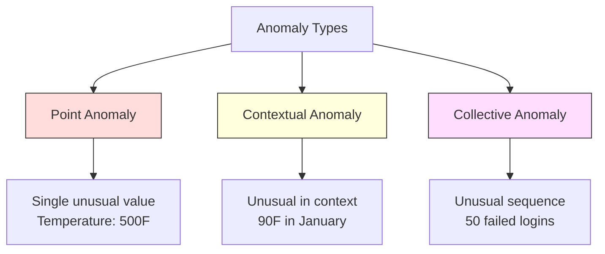
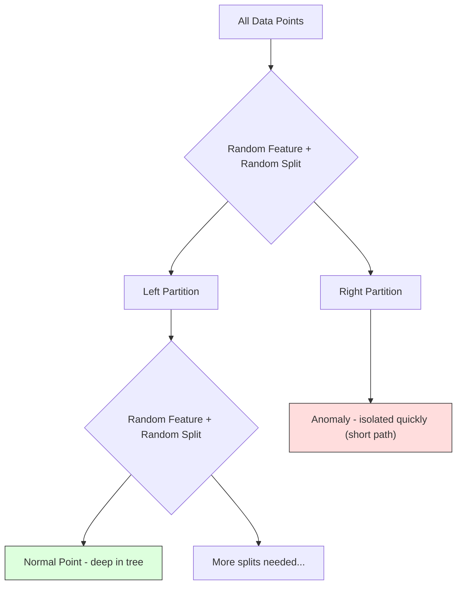
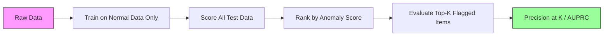

# 异常检测
# 异常检测


> 正常是很容易定义的,异常是不合适的东西.

> 正常易定义. 不正常就是不合适的.

**Type:** Build | **类型：** 构建
**Language:**子**语言：**字符串
**Prerequisites:** Phase 2, Lessons 01-09 | **前置知识：** Phase 2 第 1-9 课
**Time:** ~75 minutes | **时间：** 约 75 分钟

## 学习目标

- 从零开始实施Z-score,IQR和隔离森林异常检测方法
  从零实现Z-score、IQR 和隔离森林 异常检测方法
- 区分点,背景和集体异常,并选择适合每个异常的检测方法
  区分点异常、上下文异常和集合异常,为每种选择合适的检测方法
- 解释为什么异常检测是以正常数据的模型而不是分类异常的框架
  解释为什么异常检测被框架为建模正常数据而不是分类异常
- 进行监督性分类的非监督性异常检测和监督性分类的比较,并评估新异常覆盖率和精度之间的差距
  评估新异常覆盖率和精确率的权衡


> **【中文解读】**
> 异常检测找出不同数据点――信用卡欺诈检测、设备故障预警、网络入侵检测都依赖于它――孤立森林 和 一级SVM是常用的方法――学习中隔离森林――

> **【拓展：异常检测在金融和网络安全中的核心应用】**
> 维萨实时欺诈检测系统每秒处理约76,000笔交易,使用异常检测+监督学习的混合方法,在约150毫秒内判断是否是欺诈.谷歌的网络安全系统使用异常检测发现DDoS攻击和异常登录行为.特斯拉的电池管理系统使用异常检测提前预警电池故障.异常检测的核心挑战是极度不平衡.欺诈率通常低于0.1%,使监督学习难以直接使用.

## 问题 问题引入

在纽约晚上2点,然后在东京晚上2点05点使用信用卡.一个工厂传感器在正常范围为80到120度时读取150度.

> 一张信用卡下午2点在纽约使用,然后在东京使用2:05点.工厂传感器读数150度,正常范围是80-120度.服务器每秒发送5万个请求,而平均日为200个.

这些都是异常,找到它们是重要的,欺诈成本数十亿,设备故障成本停机时间,网络入侵成本数据.

> 这些是异常的.发现它们很重要.欺诈造成数十亿的损失.设备故障导致停机.网络入侵导致数据泄露.

挑战是:你很少标记出异常的例子. 欺诈占交易的0.1%. 设备故障每年发生几次. 由于"异常"类几乎没有什么可以学习的. 尽管你有一些标签,但你看到的异常并不是唯一的类型. 明天的欺诈计划与今天的不同.

> 挑战在于:你很少有异常标签样本. 欺诈占交易的0.1%. 设备故障每年只发生几次. 你无法训练标准分类器,因为"异常"类别几乎没有什么可以学习. 即使有一些标签,你见过的异常也不是你会遇到的唯一类型. 明天的欺诈方案看起来和今天不同.

异常检测会扭转问题. 取而代之的是学习异常,学习正常.任何偏离正常的东西都是可疑的. 这无需标签,适应新的类型的异常,并扩展到大规模的数据集.

> 异常检测翻转了问题――不学"什么是异常",而是学"什么是正常"――任何偏离正常的东西都是可疑的――这无需标签,适应新类型的异常,并扩展到大规模的数据集――

> **【中文解读】**
> 异常检测的关键思路反转:不学"什么是异常",而是学"什么是正常",偏离正常的就是可疑的.常用方法:Z-score (基于统计) 、IQR (基于四分位距离) 、隔离森林 (基于隔离随机森林) 、One-Class SVM (基于单独的随机森林) ̇学习正常数据的边界) ⋅异常类型分为点异常、上下文异常和集合异常,需要不同的类型检测策略.

## 概念的核心概念

### 异常类型

不是所有的异常都是一样的:

> 不是所有异常都一样:

- **Point anomalies.**单个数据点,不论环境如何,都是不寻常的.$50,000 from an account that normally spends $现在,我们要去.
  无论上下文如何都不正常的单个数据点――500度温度读数――通常花费50美元的账户突然发生了50,000美元的交易――
- **Contextual anomalies.**根据环境来看,一个不寻常的数据点. 90度温度是夏天正常的,冬天是异常的.同样的价值,不同的环境.
  上下文异常──给定上下文后不正常的数据点──90°在夏天正常,在冬天则异常──同样的值,不同上下文──
- **Collective anomalies.**连续5次登录失败是正常的. 连续50次是粗暴的攻击.
  集合异常――一组数据点作为整体不正常,即使每个单独的点可能是正常的――五次登录失败正常――连续五十次就是暴力破解攻击――

许多方法都能检测到点异常. 背景异常需要时间或位置特征. 集体异常需要序列意识的方法.

> 大多数方法检测点异常――上下文异常需要时间或位置特征――集合异常需要序列感知方法――



### 无监督的制

在标准分类中,你有两个类的标签. 在异常检测中,你通常有三个情况之一:

> 在标准分类中,你有两个类型的标签. 在异常检查中,你通常遇到以下三个情况之一:

1. **Fully unsupervised.**没有标签,你将检测器放在所有数据上,希望异常是不够罕见的,
   完全没有监督. 完全没有标签. 你在所有数据上都适合检测器,希望异常足够少,以免破坏"正常"模型.
2. **Semi-supervised.**你只能使用正常数据,你能在这个清洁的数据集中进行测量,然后得到其他数据.
   半监督――你只有一个干净的正常数据集――你在干净集合上适合,然后对所有其他数据打分――这是可能时最强的设置――
3. **Weakly supervised.**您有几个标记的异常. 运用它们来评估,而不是训练. 训练不受监督,然后在标记的子集上测量精度/回忆.
   弱监督――你有一些标记的异常――将它们用于评估而不是训练――无监督训练,然后在标记集中测量精确率/召回率――

基本的见解是:异常检测与分类基本不同.你正在模拟正常数据的分布,而不是两个类之间的决策界限.

> 关键洞察:异常检测与分类根本不同.

### 监督与未监督:交易

如果您确实有标记异常,您应该使用它们用于训练 (监督分类) 或仅用于评估 (未监督检测)?

> 如果确实有标记异常,应该将它们用于训练吗?

**Supervised (treat as classification):**
- 捕捉到你以前见过的异常的确切类型
  捕捉到你以前见过的特定类型的异常
- 已知异常类型的更高精度
  对已知异常类型的精度更高
- 完全缺少了新奇的异常类型
  完全错过了新类型的异常
- 需要在出现新的异常类型时重新培训
  需要重新训练,当新异常类型出现时
- 需要足够的异常例 (通常太少)
  需要足够的异常样本 (通常太少)

**Unsupervised (model normal, flag deviations):**
- 捕获任何与正常的偏差,包括新型
  捕获任何偏离正常的情况,包括新型
- 没有标记异常的要求
  不需要标记的异常
- 较高的假阳性率 (不是不寻常的都是坏的)
  更高的假阳性率 (并非所有不寻常都是坏的)
- 更强的分配转移
  对分布偏移更为

实际上,最好的系统结合了两种:无监督检测,以广泛报道,监督模型,以确定已知优先级异常类型,以及对模糊的案件的人类审查.

> 在实践中,最好的系统结合了两种:无监督检测用于广泛覆盖,监督模型用于已知高优先级异常类型,人工审查用于模两可的情况.

### Z-Score方法

计算每个特征的平均和标准偏差. 标记任何比平均标准偏差的点.

> 最简单的方法:计算每个特征的平均值和标准差.

```text
z_score = (x - mean) / std
anomaly if |z_score| > threshold
```

默认门为3.0 (99.7%的正常数据在高斯分布的标准偏差3个范围内).

> 默认值为3.0 ((高斯分布中99.7%的正常数据在3个标准差别内)

**Strengths:**简单,快速,可解释 ("这个值是4.5标准偏差).

> **优势：**简单――快速――可解释("这个值偏离正常4.5个标准差")

**Weaknesses:**假设数据通常分布. 对于训练数据中的异常值敏感 (异常值改变平均值并膨胀STD,使其更难检测).

> **劣势：**假设数据服从正态分布. 对训练数据中的异常值敏感.

**When it works well:**服务器响应时间,制造容量,稳定基线的传感器读数.

> **适用场景：**服务器响应时间,制造公差,具有稳定基线的传感器读数.

**When it fails:**多集群数据 (两个不同基线温度的办公地点),偏差数据 (交易额为1000美元,但不异常),训练集中异常值的数据.

> **失效场景：**多聚类数据 (两个办公室有不同的基线温度) 偏斜数据 (1000美元交易金额虽然罕见,但不是异常) 训练集中有异常值的数据.

### 智能化检测方法

采用中位数范围而不是平均和标准偏差.

> 比Z分更. 换成平均值和标准差.

```
Q1 = 25th percentile
Q3 = 75th percentile
IQR = Q3 - Q1
lower_bound = Q1 - factor * IQR
upper_bound = Q3 + factor * IQR
anomaly if x < lower_bound or x > upper_bound
```

默认的因素是1.5.

> 默认因子为1.5

**Strengths:**强度到异常值 (百分比不受到极端值的影响). 处理偏差分布. 没有正常性假设.

> **优势：**对于异常值鲁棒 (百分位数不受极端值的影响) 适用于偏斜分布 (偏斜分布) 无正态性假设 (无正态性假设)

**Weaknesses:**只有单变 (单个特性独立适用).只有当考虑特征在一起时才能检测到异常的异常 (每个特征的点可能是正常的,但在关联空间中是异常的).

> **劣势：**仅限单变量 (独立适用于每个特征) 无法检测仅仅在特征联合考虑时才是异常的点 (在每个特征上可能是正常的点,但在联合空间中是异常的)

**Practical note:**智能指数率为1.5的因子,与盒子图中的胡须相符.胡须之外的点是潜在的异常值.使用3.0而不是1.5使探测器更保守 (少的信号,更少的假阳性).正确的因子取决于你对假报警的容忍度.

> **实践提示：**根据图表的要求,IQR中1.5个因子对应的需要. 需要外的点是潜在的异常值. 使用3.0而不是1.5使检测器更保守.

### 孤立森林

基本的见解是:异常很少,而且很不同. 在随机分区数据中,异常更容易分离,

> 关键洞察:异常很少且与众不同. 在数据随机分区中,异常更容易被分离,它们需要更少的随机分离才能与其余数据分离.



**How it works:**
1. 建造许多随机树木 (一个孤立森林)
   构建许多随机树 (隔离森林)
2. 在每个节点,选择一个随机特征和一个随机分值之间的特征的min和max
   在每个节点,随机选择一个特征和特征最小值和最大值之间的随机分值
3. 继续分开,直到每个点分离 (在自己的叶子中)
   持续分裂直到每个点都被分离在自己的叶节点中)
4. 异常的路径平均长度较短,
   异常在所有树木中平均路径长度更短

**Why it works:**常见点生活在密集区域.需要许多随机分离来隔离一个与邻居.异常点生活在稀疏区域.一个或两个随机分离足以隔离它们.

> **为什么有效：**正常点位于密集区域. 需要许多随机分裂才能将一个点与邻居隔离.

异常分数是基于所有树木的平均路径长度,以随机二进制搜索树的预期路径长度正常化:

> 异常分数基于所有树木中平均路径长度,由随机二叉搜索树的期望路径长度归结:

```
score(x) = 2^(-average_path_length(x) / c(n))
```

在哪里?`c(n)`接近1意味着异常.接近0.5意味着正常.接近0意味着非常正常 (密集集中).

> 其中`c(n)`是 n个样本的期望路径长度──分数接近 1 意思是异常──分数接近 0.5 意思是正常──分数接近 0 意思是非常正常(位于密集聚类深处)──

**Strengths:**没有分布假设. 运行在高尺寸中. 尺寸很好 (样本尺寸是线下的,因为每个树使用一个子样本). 处理混合特征类型.

> **优势：**无分布假设. 适用于高维度. 扩展性好.

**Weaknesses:**密集区域的异常性 (掩盖效应) 难以应对.

> **劣势：**难以处理密集区域中的异常 (罩效应) .

**Key hyperparameters:**
- `n_estimators`更多的树木会给出更稳定的分数,但计算速度更慢.
  `n_estimators`树的数量:100通常足够.更多树给出更稳定的分数,但计算更慢.
- `max_samples`树的样本数量. 256是原始纸上的默认值.较小的值使单个树木不太准确,但增加了多样性.
  `max_samples`树的样本数量: 根據原始论文的说法,256个小的值使单棵树不够准确,但增加多样性.
- `contamination`预期异常的小部分.仅用于设定门.不会影响分数本身.
  `contamination`预期的异常比例――仅用于设置值――不影响分数本身――

### 地方外卖因素 (LOF)

 LOF将一个点周围的地方密度与邻居周围的密度进行比较.

> LOF将一个点周围的局部密度与邻居周围密度进行比较.

**How it works:**
1. 对于每个点,找到它的 k 最接近的邻居
   对于每个点,找到其近邻
2. 计算当地可达度密度 (邻居密度)
   计算局部可达密度 (邻域有多密集)
3. 比较每个点的密度与邻居的密度
   比较每个点的密度与邻居的密度
4. 如果一个点的密度比其邻居低得多,则它是异常的
   如果一个点的密度远低于其邻居,那么它就是异常点.

**LOF score:**
- 接近1.0的LOF意味着与邻居相似的密度 (正常)
  LOF 接近1.0 意思与邻居密度相似 (正常)
- 低于1.0的LOF意味着低于邻居的密度 (潜在异常)
  低于邻居的密度可能异常)
- 低于1.0的 LOF (例如2.0+) 表示显著低密度 (可能异常)
  LOF 远大于1.0 (如2.0+) 意味着密度显著更低 (很可能是异常)

地方部分是关键的.考虑一个数据集,有两个集群:一个密集的集群1000点和一个稀疏的集群50点.稀疏集群边缘的一个点在全球范围内并不罕见 - 它有50个邻居. 但如果它的直接邻居比它更密集,则它在当地很不寻常. LOF捕捉到全球方法错过的这种细微差异.

> 稀疏聚类边缘点不是全局异常,它有50个邻居.但如果它的近邻比它更密集,它就是局部异常.LOF捕获了这种微小差异.

**Strengths:**检测到地方异常 (在邻里不寻常的点,即使它们不是全球不寻常的点).

> **优势：**检测局部异常 (检测局部异常) 适用于不同密度的聚合物.

**Weaknesses:**对于非常高的维度来说,它不起作用 (维度的诅咒影响了距离计算).

> **劣势：**在大数据集上速度慢 (简单实现为 O (n^2)) ⋅对 k 的选择敏感. 在非常高的维度上效果不佳.

### 进行比较

| Method | Assumptions | Speed | Handles High Dims | Detects Local Anomalies |
|--------|------------|-------|-------------------|------------------------|
| Z-score | Normal distribution | Very fast | Yes (per feature) | No |
| IQR | None (per feature) | Very fast | Yes (per feature) | No |
| Isolation Forest | None | Fast | Yes | Partially |
| LOF | Distance is meaningful | Slow | Poorly | Yes |

### 评估挑战

评估异常检测器比评估分类器更难:

> 评估异常检测器比评估分类器更困难:

- **Extreme class imbalance.**预测"正常"的情况,就能达到99.9%的准确度.
  在极端类别不平衡的0.1%的异常率下,全部预测为"正常"可达到99.9%的准确率.
- **AUROC is misleading.**由于存在严重的不平衡,即使模型在实际门上错过了大多数异常,AUROC也可以看起来很好.
  在严重的不平衡中,即使模型在实用价值下错过了大部分异常,AUROC看起来仍然不错.
- **Better metrics:**精度@k (上方k标记的项目中,有多少是真实异常),AUPRC (精度回忆曲线下的区域),并以固定的假正率回忆.
  更多的标志:精确率-召回率曲线下面积) 和固定假阳性率下召回率――



### 异常检测管道

实际上,异常检测遵循以下工作流程:

> 在实践中,异常检测遵循以下工作流程:

1. **Collect baseline data.**理想情况下,你知道没有 (或很少) 异常的时期.
   收集基线数据. 理想情况下,是一个你知道没有 (或很少有) 异常的时期.
2. **Feature engineering.**原材料特征加上衍生特征 (滚动统计,时间特征,比率).
   标志工程――原始标志加上衍生标志滚统计、时间标志、比率)
3. **Train the detector.**模型可以了解"正常"的样子.
   训练检测器――在基线数据上适合――模型学习"正常"的样式――
4. **Score new data.**每次新的观察都会得到异常分数.
   对于新数据打分. 每个新观测都获得了一个异常分数.
5. **Threshold selection.**选择分数截止. 这是一个商业决定:较高的门意味着少的虚假报警,
   选择值――选择分数截值――这是一个业务决策:更高的值意味着更少的错误报道,但更多的漏洞检查――
6. **Alert and investigate.**标志点将被人类审查或自动响应.
   警报和调查――标记点进入人工审查或自动响应――
7. **Feedback collection.**记录标记的物件是否是真实异常或是虚假报警.
   收集反──记录标记项是真正的异常或错误报道──使用这些数据评估检测器并随着时间调整优值──

数据分布发生变化,出现新的异常类型,需要调整门.

> 管线永远不会"完成"――数据分布偏移,新异常类型出现,值需要调整――将异常检测视为一个活系统,而不是一次性模型――

## 建立它,实现它.

> **【中文解读】**
> 从零实现三种异常检测方法:Z-score (基于平均值和标准差,适合近似正态分布的数据) ‧IQR (基于四分位距离,对异常值的鲁棒) ‧隔离森林 (随机选择特征和分离点分离数据点,异常点平均需要更少的分离次数) ‧隔离森林是工业界最常用的无监督异常检测方法.

> **【拓展：异常检测在 AIOps 和制造业中的应用】**
> 微软Azure监测使用异常检测自动发现云服务性能异常;Netflix使用异常检测监测流媒体服务的各种指标(延迟、误率等),每天检测数十亿数据点;富士康在生产线使用异常检测提前发现设备故障,将停机时间减少30%――异常检测的关键挑战是控制误报率太多误报会让运营人员对警报"免疫"――
```figure
f3-anomaly-fence
```

## 建立它

编码在`code/anomaly_detection.py`实现Z-score,IQR和隔离森林从零开始.

> `code/anomaly_detection.py`中代码从零实现了Z分数,IQR和隔离森林.

### 测量器

```python
def zscore_detect(X, threshold=3.0):
    mean = X.mean(axis=0)
    std = X.std(axis=0)
    std[std == 0] = 1.0
    z = np.abs((X - mean) / std)
    return z.max(axis=1) > threshold
```

标记一个点,如果任何特征超过门.

> 简单且量化. 如果任何特征超过值,则标记该点.

### 智能仪表检测器

```python
def iqr_detect(X, factor=1.5):
    q1 = np.percentile(X, 25, axis=0)
    q3 = np.percentile(X, 75, axis=0)
    iqr = q3 - q1
    iqr[iqr == 0] = 1.0
    lower = q1 - factor * iqr
    upper = q3 + factor * iqr
    outside = (X < lower) | (X > upper)
    return outside.any(axis=1)
```

### 孤立森林从零开始

从零开始实现建立了隔离树,这些树随机分区特征空间:

> 从零实现构建随机划分空间的分离树特征:

```python
class IsolationTree:
    def __init__(self, max_depth):
        self.max_depth = max_depth

    def fit(self, X, depth=0):
        n, p = X.shape
        if depth >= self.max_depth or n <= 1:
            self.is_leaf = True
            self.size = n
            return self
        self.is_leaf = False
        self.feature = np.random.randint(p)
        x_min = X[:, self.feature].min()
        x_max = X[:, self.feature].max()
        if x_min == x_max:
            self.is_leaf = True
            self.size = n
            return self
        self.threshold = np.random.uniform(x_min, x_max)
        left_mask = X[:, self.feature] < self.threshold
        self.left = IsolationTree(self.max_depth).fit(X[left_mask], depth + 1)
        self.right = IsolationTree(self.max_depth).fit(X[~left_mask], depth + 1)
        return self
```

距离一个点的路径长度决定了其异常分数.

> 隔离一个点的路径长度决定其异常分数.

其他`IsolationForest`类包裹多个树木:

> `IsolationForest`类包装了多棵树:

```python
class IsolationForest:
    def __init__(self, n_estimators=100, max_samples=256, seed=42):
        self.n_estimators = n_estimators
        self.max_samples = max_samples

    def fit(self, X):
        sample_size = min(self.max_samples, X.shape[0])
        max_depth = int(np.ceil(np.log2(sample_size)))
        for _ in range(self.n_estimators):
            idx = rng.choice(X.shape[0], size=sample_size, replace=False)
            tree = IsolationTree(max_depth=max_depth)
            tree.fit(X[idx])
            self.trees.append(tree)

    def anomaly_score(self, X):
        avg_path = average path length across all trees
        scores = 2.0 ** (-avg_path / c(max_samples))
        return scores
```

正常化因素`c(n)`是一个包含 n 个元素的二进制搜索树中未能搜索的预期路径长度.`2 * H(n-1) - 2*(n-1)/n`在哪里`H`这种正常化确保不同尺寸的数据集中得分可比较.

> 归一化因子`c(n)`是 n 个元素的二叉搜索树中未成功搜索的期望路径长度──它等于`2 * H(n-1) - 2*(n-1)/n`在其中`H`调和数量. 这种归纳确保分数在不同大小的数据集之间可比较.

### 演示场景

代码生成多种测试场景:

> 代码生成多个测试场景:

1. **Single cluster with outliers.**两个维的高斯星团, 射了离中心的异常.
   单聚类加异常值――一个2D高聚类,在远离中心处注入异常――所有方法应在这种情况下都能工作――
2. **Multimodal data.**集群之间点是异常的. Z 积分是因为每个特征范围很宽.
   多峰数据――三个不同大小和密度的聚类――聚类之间的点是异常的――Z-score在此表现不佳,因为每个特征的范围很宽――
3. **High-dimensional data.**测试方法是否能在特征子集中找到异常.
   高维数据──50个特征,但异常只在5个特征上不同──测试方法能否在特征中发现异常──

每个演示都使用精度,召回,F1和Precision@k来比较所有方法.

> 每个演示都使用精确率,召回率,F1 和精确@k 比较所有方法.

## 用它实现框架

通过 sklearn (使用图书馆实现,而不是从零开始):

> 使用库实现,非从零实现):

```python
from sklearn.ensemble import IsolationForest
from sklearn.neighbors import LocalOutlierFactor

iso = IsolationForest(n_estimators=100, contamination=0.05, random_state=42)
iso.fit(X_train)
predictions = iso.predict(X_test)

lof = LocalOutlierFactor(n_neighbors=20, contamination=0.05, novelty=True)
lof.fit(X_train)
predictions = lof.predict(X_test)
```

备注`contamination`设置正确的情况是重要的--太低会错过异常,太高会产生虚假报警.

> 注意`contamination`设置预期异常比例――正确设置很重要太低会漏检异常,太高会产生错误报道――

编码在`anomaly_detection.py`根据相同数据,与Skularn进行零部实施的比较.

> `anomaly_detection.py`中代码在相同数据上与零实现相比较.

### 污染参数

其他`contamination`根据Skularn的参数,将连续异常分数转换为二进制预测的门值.

> 牛牛中`contamination`参数决定将连续异常分数转换为二值预测的值――它不会改变底层分数――

```python
iso_5 = IsolationForest(contamination=0.05)
iso_10 = IsolationForest(contamination=0.10)
```

两者都产生相同的异常分数.`iso_5`标志着前5%的`iso_10`如果您不知道真正的异常率 (通常您不会),则设置污染为"自动"并直接处理原始分数.根据虚假正值和虚假负值之间的成本权衡,设置您自己的门.

> 两者产生相同的异常分数.`iso_5`标记前 5%`iso_10`标记前10%──如果你不知道真实异常率 (通常不知道),将污染设置为"自动"并直接使用原始分数──根据假阳性和假阴性之间的成本权衡设置自己的值──

### 一级SVM

另一个值得知道的未监督异常检测器. 一级SVM在高维特征空间中围绕正常数据的边界 (使用内核技巧).

> 另一个值得了解的无监督异常检测器―― 一级SVM在高维特征空间中围绕正常数据适合一个边界――使用核技术.

```python
from sklearn.svm import OneClassSVM

oc_svm = OneClassSVM(kernel="rbf", gamma="auto", nu=0.05)
oc_svm.fit(X_train)
predictions = oc_svm.predict(X_test)
```

其他`nu`一级SVM在小到中等数据集上运行良好,但不会扩展到非常大的数据 (内核矩阵的增长是四分之一).

> `nu`参数近似异常比例――在中小型数据集中,一级SVM效果良好,但不能扩展到非常大的数据度呈二次增长)

### 自动编码方法 (预览)

自动编码器是学习压缩和重建数据的神经网络.训练在正常数据上.在测试时,异常性具有高重建错误,因为网络只学会重建正常模式.

> 自编码器是学习压缩和重构数据的神经网络. 在正常数据上训练.测试时,异常具有高重构错误,因为网络只学会重构正常模式.

这在第三阶段 (深度学习) 中涵盖,但原则是一样的:

> 这是在第三阶段的深度学习中讨论,但原理相同:建模什么是正常的,标志偏离的.

### 组装异常检测

像组合方法改善分类一样 (课11),结合多个异常检测器提高了检测.

> 像集成方法改善分类 (第11课),组合多个异常检测器可以改善检测.

1. 运行多个探测器 (Z-score,IQR,隔离森林,LOF)
   运行多个检测器(Z-score、IQR、隔离森林、LOF)
2. 调整每个探测器的分数为 [0, 1]
   将每个检测器的分数归纳为 [0, 1]
3. 平均正常成绩
   平均归结后分数
4. 标志点超过平均分数的门值
   标记平均分数超过值的点

这减少了假正的结果,因为不同的方法有不同的故障模式.所有四种方法标记的点几乎肯定是异常的.只有一个标记的点可能是该方法的特点.

> 这减少了假阳性,因为不同的方法都有不同的失败模式.

较复杂的组件按每个探测器的估计可靠性 (如果有,测量在已知异常的验证组上).

> 根据每个检测器的估计可靠性加权,如果可用,在已知异常的验证集中测量)

### 生产考虑

1. **Threshold drift.**随着数据分布的转变,一个固定门变得过时.
   值漂移――随着数据分布的偏移,固定值变得过时――监控异常分数的分布并定期调整――
2. **Alert fatigue.**由于太多的虚假报警和运营商不再关注, 开始使用较高的门 (更少的,更可靠的报警) 并随着信任的增长而降低.
   警报疲劳――太多的误报会让操作员不再关注――从高值开始――更少,更可靠的警报),随着信任建立再降低――
3. **Ensemble approach.**在生产中,结合多个探测器. 只有多种方法同意它是异常的,才能标记一个点. 这会显著减少虚假阳性.
   集成方法――在生产中,组合多种检测器――只有当多种方法一致认为异常时才标记――这显著减少了假阳性――
4. **Feature engineering.**添加滚动统计,比率,自最后事件以来的时间,以及特定域的功能.一个好的功能比检测器的选择更重要.
   工程特征――原始特征很少足够――添加滚动统计,比率,距离下一次事件的时间等领域的特定特征――良好的特征集比检测器的选择更重要――
5. **Feedback loop.**当运营商检查标记的物品并确认或驳回它们时,将这些物品重新输入到系统中.
   反循环──当操作员调查标记项并确认或排除时,将反输入系统──随着时间的积累标记数据以评估和改进检测器──

## 运送它.

这一课产生了:
- `outputs/skill-anomaly-detector.md`选择正确的探测器的决策技能
  `outputs/skill-anomaly-detector.md` 选择合适检测器的决策技能
- `code/anomaly_detection.py`通过Skularn比较,
  `code/anomaly_detection.py` 从零实现Z-score、IQR 和隔离森林,附加

### 选择一个门

对于做出二元决策,你需要一个门.这是一个商业决策,而不是技术决策.

> 异常分数是连续的. 您需要一个值来做出二值决策.

考虑两个情况:
- **Fraud detection.**错失欺诈是昂贵的 (收费回报,客户信任). 假报警花费了5分钟的时间调查.
  欺诈检查――漏检查欺诈代价高昂(退款、客户信任) ――误报需要分析师 5 分钟调查――设置低值以捕获更多欺诈,接受更多误报――
- **Equipment maintenance.**假报警意味着不必要的关闭成本$50,000. A missed failure means a $设定一个值值,以平衡这些成本.
  设备维护――误报意味着不必要的停机,成本5万美元――漏检故障意味着5万美元的维修――设置值来平衡这些成本――

在两种情况下,最佳门取决于虚假正值和虚假负值之间的成本比率.

> 在两种情况下,最优值取决于假阳性和假阴性之间的成本比率.

### 规模到生产

对于生产中实时异常检测:

> 对于生产中的实时异常检测:

1. **Batch training, online scoring.**定期 (每天,每周) 训练模型使用最近的正常数据.
   批量训练,在线打分――定期(每天、每周) 在近期正常数据上训练模型――每个新观测到达时打分――
2. **Feature computation must match.**如果您使用30天的滚动统计训练,则需要30天的历史,以计算新的观察的特性.
   计算特征必须匹配. 如果你使用30天的滚动统计训练,你需要30天的历史来进行新观测计算特征.
3. **Score distribution monitoring.**如果中位数偏向上方,则数据正在改变,或者模型已经过时.
   分数分布监控――随着时间的跟踪异常分数的分布――如果中位分数向上漂移,要么数据在变化,要么模型已经过时――
4. **Explainability.**标记异常时,请说明原因.Z-score: "特征X是4.2标准偏差高于正常."隔离森林:"这个点平均分为3.1分 (正常分为8.5).
   可解释性──当你标记异常时,说明原因──Z-score:"特征 X 高于正常 4.2 个标准差──"孤立森林:"该点平均被 3.1 次分隔离(正常点需要 8.5 次) 』

## 练习题

1. **Threshold tuning.**运行Z-score探测器,以0.0到5.0的步骤进行.
   1. 在正态数据中注入不同比例的异常 (1%、5%、10%) 比 Z-score、IQR和隔离森林的精确率和召回率比

2. **Multivariate anomalies.**创建2D数据,每个特征单独看起来正常,但组合是异常的 (例如,距离主集群角角的点). 显示每个特征的Z分数错过这些,但隔离森林抓住它们.
   2. 生成一个上下文异常数据集 (通常值在冬季和夏季不同) 展示简单的Z-score 在冬季将夏季的正常值标记为异常.

3. **LOF from scratch.**根据相同数据,使用k-近邻实现本地外表因素.与 sklearn的本地外表因素进行比较.使用k=10和k=50 - 选择k如何影响结果?
   3. 构建隔离森林的集成:训练10棵隔离树,取平均路径长度――比较单棵树与集成的稳定性――

4. **Streaming anomaly detection.**修改Z-score检测器以在流媒体设置中工作:随着新点的到来更新运行平均和变异 (威尔福德的在线算法).
   4. 用自动编码器思路实现异常检测:训练一个简单的重构模型,标记重构差高的点为异常――

5. **Real-world evaluation.**根据"Caggle"的信贷卡欺诈法,使用 precision@100,precision@500和AUPRC评估四种方法.

> **【中文解读】**
> 异常检测的评估使用 Precision@K(排名 K 个可疑案例中的许多是真正的异常) 和 AUPRC(精确率-召回率曲线下面积) 比准确率更有意义――孤立森林的核心洞察:异常数据点更"稀疏",随着特征分离更容易使它们单独分离平均需要分离次数更少――这使得它不需要定义"正常"的具体形式就能发现异常――

## 关键词 快速查找表

| Term | What people say | What it actually means |
|------|----------------|----------------------|
| Anomaly | "Outlier, unusual point" | A data point that deviates significantly from the expected pattern of normal data |
| Point anomaly | "A single weird value" | An individual observation that is unusual regardless of context |
| Contextual anomaly | "Normal value, wrong context" | An observation that is unusual given its context (time, location, etc.) but might be normal in another context |
| Isolation Forest | "Random splits to find outliers" | An ensemble of random trees that isolates anomalies with fewer splits than normal points |
| Local Outlier Factor | "Compare density to neighbors" | A method that flags points whose local density is much lower than their neighbors' density |
| Z-score | "Standard deviations from mean" | (x - mean) / std, measuring how far a point is from the center in units of standard deviation |
| IQR | "Interquartile range" | Q3 - Q1, measuring the spread of the middle 50% of data, used for robust outlier detection |
| Contamination | "Expected fraction of anomalies" | A hyperparameter telling the detector what proportion of the data it should flag as anomalous |
| Precision@k | "Of the top k flags, how many are real" | Precision computed on only the k most suspicious points, useful for imbalanced anomaly detection |
| AUPRC | "Area under precision-recall curve" | A metric that summarizes precision-recall performance across all thresholds, better than AUROC for imbalanced data |

## 继续阅读 继续阅读

- [Liu et al., Isolation Forest (2008)](https://cs.nju.edu.cn/zhouzh/zhouzh.files/publication/icdm08b.pdf)-- 原始的孤立森林纸
  [Liu et al.: Isolation Forest (2008)](https://ieeexplore.ieee.org/document/4781136)- 孤立森林 原始论文
- [Breunig et al., LOF: Identifying Density-Based Local Outliers (2000)](https://dl.acm.org/doi/10.1145/342009.335388)-- LOF原始纸
  [Chandola et al.: Anomaly Detection: A Survey (2009)](https://dl.acm.org/doi/10.1145/1541880.1541882)- 异常检测综述
- [scikit-learn Outlier Detection docs](https://scikit-learn.org/stable/modules/outlier_detection.html)-- 总体所有Skularn异常检测器
  [scikit-learn 异常检测](https://scikit-learn.org/stable/modules/outlier_detection.html)
- [Chandola et al., Anomaly Detection: A Survey (2009)](https://dl.acm.org/doi/10.1145/1541880.1541882)-- 综合调查异常检测方法
- [Goldstein and Uchida, A Comparative Evaluation of Unsupervised Anomaly Detection Algorithms (2016)](https://journals.plos.org/plosone/article?id=10.1371/journal.pone.0152173)--实实数据集的10种方法的经验性比较
