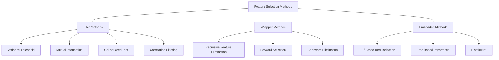
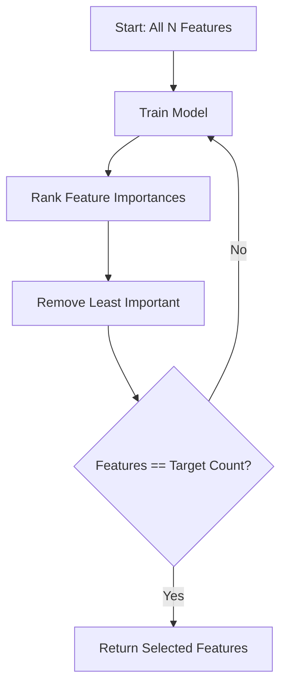
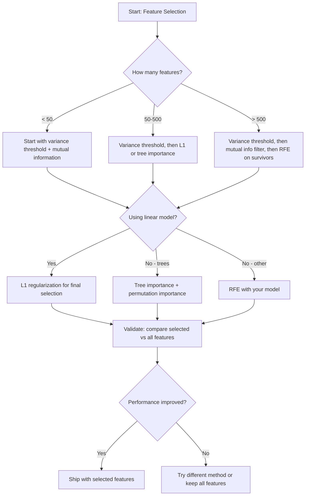

# 功能选择
# 特征选择


> 更多的功能不好,但正确的功能更好.

> 特征不是越多越好.

**Type:** Build | **类型：** 构建
**Language:**子**语言：**字符串
**Prerequisites:** Phase 2, Lessons 01-09, 08 (feature engineering) | **前置知识：** Phase 2 第 1-9 课、第 8 课（特征工程）
**Time:** ~75 minutes | **时间：** 约 75 分钟

## 学习目标

- 从零开始实施过方法 (变量门,互通信息,千平方) 和包装方法 (RFE,前进选择)
  从零实现过法 (方差值,互信息,卡方检查) 和包装法 (RFE,前向选择)
- 解释为什么相互信息捕捉到非线性特征目标关系,而相关性没有
  解释为什么互信息能够捕获相关性错误的非线性特征-目标关系
- 比较L1规律化 (嵌入式选择) 与RFE (包装选择) 并评估它们的计算权衡
  与RFE (RFE) (RFE) (RFE) (RFE) (RFE) (RFE) (RFE) (RFE) (RFE) (RFE) (RFE) (RFE) (RFE) (RFE) (RFE) (RFE) (RFE) (RFE) (RFE) (RFE) (RFE) (RFE) (RFE) (RFE) (RFE) (RFE) (RFE) (RFE) (RFE) (RFE) (RFE) (RFE) (RFE) (RFE) (RFE) (RFE) (RFE) (RFE) (RFE) (RFE) (RFE) (RFE) (RFE) (RFE) (RFE) (RFE) (RFE) (RFE) (RFE) (RFE) (RFE) (RFE) (RFE) (RFE) (RFE) (RFE) (RFE) (RFE) (RFE) (RFE) (RFE) (RFE) (RFE) (RFE) (RFE) (RFE) (RFE) (RFE) (RFE) (RFE) (RFE) (RFE) (RFE) (RFE) (RFE) (RFE) (RFE) (RFE) (RFE) (RFE) (RFE) (RFE) (RFE) (RFE) (R) (RFE) (R) (R) (R) (R) (R) (R) (R) (R) (R) (R) (R) (R) (R) (R))) (R) (R) (R) (R) (R) (R) (R)) (R) (R) (R))) (R) (R)) (R) (R)) (R)) (R)) (R)) (R)) (R) (R)) (R) (R) (R) (R) (R)) (R)) (R) (R))) (R) (R)) (R) (R)) (R) (R) (R)
- 建立一个结合多种方法的功能选择管道,并证明保留数据的更好的通用化
  构建结合多种方法的特征选择管线,展示在留出数据上的泛化改进


> **【中文解读】**
> 特性选择从众多特征中挑选最有用的子集――过法 (过法) 包装法 (递归特征消除) 嵌入法 (嵌入法) 是三类方法――学习中选择KBest/RFE――减少特征数量可提高模型速度和泛化能力――

> **【拓展：特征选择在工业界的重要性】**
> 在金融风控模型中,监管要求模型可以解释必须能够解释为什么每个特征被选用.L1 正则化 (Lasso) 自动将不重要特征的权重压缩为零,同时实现特征选择和模型训练.在基因表达分析中,从2万基因中选出50个关键基因不仅提高了模型性能,还为疾病机制研究提供线索. 在赢得Netflix奖方案中,特征选择将减少数百万个候选特征到数百个.

## 问题 问题引入

你有500个功能.你的模型慢慢训练,不断过度训练,没有人能解释它学到什么.你增加更多功能希望提高性能.

> 你有500个特征――模型训练慢慢,持续过了,没有人能解释它学到了什么――你增加更多特征希望提高性能――结果更差――

随着功能数量增加,功能空间的体积会爆炸.数据点变得稀疏.点之间的距离趋于近距离.模型需要更多的数据来找到真正的模式.噪音功能淹没信号功能.过度调整成为默认.

> 这就是维度诅咒的实际运作.随着特征数量增加,特征空间的体积爆炸.数据点变得稀疏.

选择特征是抗药物. 消除噪音. 消除冗余性. 保持有关目标的实际信息的特征. 结果:更快的训练,更好的概括,以及你可以实际解释的模型.

> 选择特征是解药――消除噪音――消除冗余――保留真正带有目标信息的特征――结果是:更快的训练――更好的泛化,以及你能真正解释的模型――

目的不是使用所有可用的信息,而是使用正确的信息.

> 目标不是使用所有可用的信息.

> **【中文解读】**
> 选择特征三类方法各有优势:过法 (方差值,互信息,卡方检验) 最快但忽略特征之间的交互;包装法 (递归特征消除RFE,前向选择) 考虑特征组合但计算成本高;嵌入法 (嵌入法) 训练过程中自动选择特征,是效率与效果的最佳平衡.

## 概念的核心概念

### 选项的三个类别

每种特征选择方法都属于三个类别之一:

> 每种特征选择方法都属于以下三类之一:



**Filter methods**它们使用了一个模型. 快速,但它们错过了功能互动.

> **过滤法**使用统计量独立对每个特征评分.

**Wrapper methods**训练一个模型来评估功能子集. 他们使用模型性能作为分数. 结果更好,但昂贵,因为他们重训模型多次.

> **包装法**训练模型来评估特征集. 模型性能作为分数. 结果更好,但成本高,因为需要多次重新训练模型.

**Embedded methods**选择特征作为模型训练的一部分.L1规律化将重量推到零.决策树分为最有用的特征.选择是在安装过程中发生的,而不是作为单独的步骤.

> **嵌入法**在模型训练过程中选择特征.L1 正则化将权力驱动为零.决策树在最有用的特征上分裂.

### 变化门

如果一个特征在样本中几乎不存在差异,它几乎没有信息.

> 如果一个特征在样本中几乎不变,它几乎没有信息.

考虑一个为1000个样本中的999个的特征为0.0. 其差距接近零. 没有模型可以使用它来区分类. 删除它.

> 考虑一个1000个样本中,有999个值为0.0的特征.

```
variance(x) = mean((x - mean(x))^2)
```

设置门值 (例如0.01). 放下其以下变量的每个特征. 这就会消除不看目标变量的常态或近常态特征.

> 设置一个值(如0.01) ――删除方差于该值的每个特征――这完全不需要看目标变量就能移除常量或近常量的特征――

什么时候使用:作为其他方法之前的预处理步骤. 它显然以接近零成本捕获无用的特性.

> 如何使用:作为其他方法之前的预处理步骤,以接近零的成本捕获明显无用的特征.

限制:一个特征可以具有高差异性,但仍然是纯噪音.

> 局限性:一个特征可能有高方差,但仍然是纯噪音.

### 互通信息

互通信息衡量了知道X特征的值有多大程度上减少了对目标Y的不确定性.

> 互信息衡量知道X的特征值可以在多大程度上减少对目标Y的不确定性.

```
I(X; Y) = sum_x sum_y p(x, y) * log(p(x, y) / (p(x) * p(y)))
```

如果X和Y是独立的,p(x,y) =p(x) *p(y),所以日志术语是零,I(X;Y) =0.

> 如果 X 和 Y 独立,p(x,y) =p(x) *p(y),因此对数项为零,I(X;Y) =0──X 告诉你关于Y的信息越多,互信息越高──

关键优势:相互信息捕捉到非线性关系.一个特征可能与目标没有相关性,但由于关系是方形或周期性,相互信息很高.

> 相对于相关性的主要优势:互信息捕获非线性关系. 一个特征可能与目标相关性为零,但由于关系是二次或周期性的,互信息很高.

对于连续特征,首先分为容器 (基于历史图的估计).容器数量影响了估计 - - 太少容器丢失了信息,太多容器增加了噪音.一个常见的选择:平方 (n) 容器或斯图尔格斯规则 (1 + log2(n)).

> 对于连续特征,先分散为分盒 (基于直方图的估计) ⋅分盒数影响估计 太少分盒丢失信息,太多箱增加噪音――常见选择:sqrt(n) 个分盒或条则 (1 + log2(n))。


### 复发性特征消除 (RFE)

采用模型的特征重要性,以反复剪切:

> 包装法是一种包装法.它使用模型本身的特征来重视:

1. 训练模型,并提供所有功能
   用所有特征的训练模型
2. 根据重要性排名特征 (线性模型的系数,树木的杂质减少)
   按重要性排列特征 (线性模型用系数,树模型用不纯度减少)
3. 删除最不重要的特征 (s)
   移除最不重要的特征
4. 重复直到所需数量仍然存在
   重复 剩余的特征数量



通过RFE,模型可以将其所有剩余的特性视为相对的.删除一个特性会改变其它特性的重要性.这使得它比过方法更彻底.

> 考虑特征交换,因为模型看到所有剩余特征在一起.

费用:你训练模型N - 目标时间.500个功能和10个目标,即490个训练跑.对于昂贵的模型,这很慢.你可以通过每步删除多个功能来加快它 (例如,每轮删除下 10%).

> 代价:你需要训练模型 N - 目标 次数――500个特征和目标 10个,就是490次训练――对于昂贵的模型来说,这很慢――你可以通过每步移动多个特征来加速――如每轮移动底部10%) ――

### 规范化

规律化 L1 将权重的绝对值添加到损失函数:

```
loss = prediction_error + alpha * sum(|w_i|)
```

超高的阿尔法意味着更多的重量达到完全零.

> 超高的阿尔法意味着更多权重变为精确的零.

为什么是零?L1罚款在权重空间中创造了一个钻石形状的限制区域.最佳解决方案往往落在钻石的角落,其中一个或多个权重是零.L2规律化 () 创造了一个圆形的限制,重量缩小但很少达到零.

> 为什么精确为零?L1 惩罚在权重空间中创建形约束区域──最优解倾向于落在形角上,在那里一个或多个权重为零──L2 正则化(Ridge) 创建圆形约束,权重缩小小但很少变为零──

模型在训练过程中学习哪些功能可以忽略.零重的功能被有效地删除.

> 这是嵌入特征选择:模型在训练过程中学习忽略哪些特征.

优点:单次训练运行,处理相关功能 (选择一个,其他是零),构建在大多数线性模型实现中.

> 优势:单次训练运行,处理相关特征,选择一个并将其他置零,内置在大多数线性模型实现中.

限制:仅适用于线性模型.不能捕捉非线性特征的重要性.

> 局限性:仅适用于线性模型.

### 树木的重要性

决策树及其集合 (随机森林,梯度增强) 自然地排列特征.每一个分离都会减少杂质 (Gini或化为分类,变异为回归).产生更大的杂质减少的特征更重要.

> 决策树及其集成 (随机森林,梯度升级) 自然地对特征排名.

对于一个随机森林,有T树:

```
importance(feature_j) = (1/T) * sum over all trees of
    sum over all nodes splitting on feature_j of
        (n_samples * impurity_decrease)
```

这为每个特征提供了正常化的重要性分数. 它自动处理非线性关系和特征互动.

> 这给出了每个特征的归结的重要性分数. 它自动处理非线性关系和特征交互.

注意:树上的重要性偏向于具有多个独特值 (高特点) 的特征.随机ID列将显得很重要,因为它完美地分开每一个样本. 使用变量重要性作为智能检查.

> 注意:树模型的重要性偏向具有许多唯一值的特征.

### 转变的重要性

模型-化方法:

> 一种与模型无关的方法:

1. 训练模型并记录基线性能,使用验证数据
   训练模型并记录验证数据上的基线性能
2. 对于每个功能:随机混动其值,测量性能下降
   对于每个特征:随着其值的乱乱,测量性能下降
3. 随着下降的规模,
   下降越大,特征越重要

如果混合一个功能不会损害性能,模型就不会依赖于它.

> 如果打乱一个特征不会影响性能,模型不会依赖它.

转变重要性避免了基于树的重要性的枢纽偏见. 但它很慢:每个特征进行一次完整的评估,重复多次以保持稳定性.

> 换换的重要性避免了树模型的重要性的基数偏差.

### 较量表

| Method | Type | Speed | Nonlinear | Feature Interactions |
|--------|------|-------|-----------|---------------------|
| Variance threshold | Filter | Very fast | No | No |
| Mutual information | Filter | Fast | Yes | No |
| Correlation filter | Filter | Fast | No | No |
| RFE | Wrapper | Slow | Depends on model | Yes |
| L1 / Lasso | Embedded | Fast | No (linear) | No |
| Tree importance | Embedded | Medium | Yes | Yes |
| Permutation importance | Model-agnostic | Slow | Yes | Yes |

### 决策流程图



## 建立它,实现它.

> **【中文解读】**
> 从零实现三类特征选择方法:过法(方差值、互信息、卡方检查独立评估每个特征) 包装法(递归特征消除RFE反复训练模型消除最不重要的特征) 嵌入法(L1 正规化 拉索训练时自动将不重要特征权重压缩为零) ⋅通过合成数据(已知哪些特征有用) 验证各方法的效果──

> **【拓展：特征选择在 LLM 时代的新意义】**
> 虽然深度学习号称之为"自动学习特征",但特征选择在以下场景仍然关键: 1) 表格数据特征选择可提高XGBoost/LightGBM的性能和训练速度; 2) 可解释性要求医疗和金融领域需要解释使用哪些特征; 3) 嵌入空间即使是变革器,也需要嵌入 维度上做"特征选择"
```figure
f3-feature-prune
```

## 建立它

### 步骤1:生成已知特征结构的合成数据

```python
import numpy as np


def make_feature_selection_data(n_samples=500, seed=42):
    rng = np.random.RandomState(seed)

    x1 = rng.randn(n_samples)
    x2 = rng.randn(n_samples)
    x3 = rng.randn(n_samples)
    x4 = x1 + 0.1 * rng.randn(n_samples)
    x5 = x2 + 0.1 * rng.randn(n_samples)

    informative = np.column_stack([x1, x2, x3, x4, x5])

    correlated = np.column_stack([
        x1 * 0.9 + 0.1 * rng.randn(n_samples),
        x2 * 0.8 + 0.2 * rng.randn(n_samples),
        x3 * 0.7 + 0.3 * rng.randn(n_samples),
        x1 * 0.5 + x2 * 0.5 + 0.1 * rng.randn(n_samples),
        x2 * 0.6 + x3 * 0.4 + 0.1 * rng.randn(n_samples),
    ])

    noise = rng.randn(n_samples, 10) * 0.5

    X = np.hstack([informative, correlated, noise])
    y = (2 * x1 - 1.5 * x2 + x3 + 0.5 * rng.randn(n_samples) > 0).astype(int)

    feature_names = (
        [f"info_{i}" for i in range(5)]
        + [f"corr_{i}" for i in range(5)]
        + [f"noise_{i}" for i in range(10)]
    )

    return X, y, feature_names
```

我们知道基本的真理: 0-4 个特征是信息性的 (加上 3 和 4 是 0 和 1 的相关副本), 5-9 个特征是信息性的特征, 10-19 个特征是纯噪音.一个好的选择方法应该排名 0-4 最高, 10-19 最低.

> 我们知道真实情况:特征0-4是有信息的(加上3和4是0和1的相关副本),特征5-9与有信息的特征相关,特征10-19是纯噪音.

### 步骤2:变异门

```python
def variance_threshold(X, threshold=0.01):
    variances = np.var(X, axis=0)
    mask = variances > threshold
    return mask, variances
```

### 步骤3:相互信息 (谨慎)

```python
def discretize(x, n_bins=10):
    min_val, max_val = x.min(), x.max()
    if max_val == min_val:
        return np.zeros_like(x, dtype=int)
    bin_edges = np.linspace(min_val, max_val, n_bins + 1)
    binned = np.digitize(x, bin_edges[1:-1])
    return binned


def mutual_information(X, y, n_bins=10):
    n_samples, n_features = X.shape
    mi_scores = np.zeros(n_features)

    y_vals, y_counts = np.unique(y, return_counts=True)
    p_y = y_counts / n_samples

    for f in range(n_features):
        x_binned = discretize(X[:, f], n_bins)
        x_vals, x_counts = np.unique(x_binned, return_counts=True)
        p_x = dict(zip(x_vals, x_counts / n_samples))

        mi = 0.0
        for xv in x_vals:
            for yi, yv in enumerate(y_vals):
                joint_mask = (x_binned == xv) & (y == yv)
                p_xy = np.sum(joint_mask) / n_samples
                if p_xy > 0:
                    mi += p_xy * np.log(p_xy / (p_x[xv] * p_y[yi]))
        mi_scores[f] = mi

    return mi_scores
```

### 步骤4:消除复发性特征

```python
def simple_logistic_importance(X, y, lr=0.1, epochs=100):
    n_samples, n_features = X.shape
    w = np.zeros(n_features)
    b = 0.0

    for _ in range(epochs):
        z = X @ w + b
        pred = 1.0 / (1.0 + np.exp(-np.clip(z, -500, 500)))
        error = pred - y
        w -= lr * (X.T @ error) / n_samples
        b -= lr * np.mean(error)

    return w, b


def rfe(X, y, n_features_to_select=5, lr=0.1, epochs=100):
    n_total = X.shape[1]
    remaining = list(range(n_total))
    rankings = np.ones(n_total, dtype=int)
    rank = n_total

    while len(remaining) > n_features_to_select:
        X_subset = X[:, remaining]
        w, _ = simple_logistic_importance(X_subset, y, lr, epochs)
        importances = np.abs(w)

        least_idx = np.argmin(importances)
        original_idx = remaining[least_idx]
        rankings[original_idx] = rank
        rank -= 1
        remaining.pop(least_idx)

    for idx in remaining:
        rankings[idx] = 1

    selected_mask = rankings == 1
    return selected_mask, rankings
```

### 步骤5: L1 功能选择

```python
def soft_threshold(w, alpha):
    return np.sign(w) * np.maximum(np.abs(w) - alpha, 0)


def l1_feature_selection(X, y, alpha=0.1, lr=0.01, epochs=500):
    n_samples, n_features = X.shape
    w = np.zeros(n_features)
    b = 0.0

    for _ in range(epochs):
        z = X @ w + b
        pred = 1.0 / (1.0 + np.exp(-np.clip(z, -500, 500)))
        error = pred - y

        gradient_w = (X.T @ error) / n_samples
        gradient_b = np.mean(error)

        w -= lr * gradient_w
        w = soft_threshold(w, lr * alpha)
        b -= lr * gradient_b

    selected_mask = np.abs(w) > 1e-6
    return selected_mask, w
```

### 步骤 6:树木基础上的重要性 (简单的决策树)

```python
def gini_impurity(y):
    if len(y) == 0:
        return 0.0
    classes, counts = np.unique(y, return_counts=True)
    probs = counts / len(y)
    return 1.0 - np.sum(probs ** 2)


def best_split(X, y, feature_idx):
    values = np.unique(X[:, feature_idx])
    if len(values) <= 1:
        return None, -1.0

    best_threshold = None
    best_gain = -1.0
    parent_gini = gini_impurity(y)
    n = len(y)

    for i in range(len(values) - 1):
        threshold = (values[i] + values[i + 1]) / 2.0
        left_mask = X[:, feature_idx] <= threshold
        right_mask = ~left_mask

        n_left = np.sum(left_mask)
        n_right = np.sum(right_mask)

        if n_left == 0 or n_right == 0:
            continue

        gain = parent_gini - (n_left / n) * gini_impurity(y[left_mask]) - (n_right / n) * gini_impurity(y[right_mask])

        if gain > best_gain:
            best_gain = gain
            best_threshold = threshold

    return best_threshold, best_gain


def tree_importance(X, y, n_trees=50, max_depth=5, seed=42):
    rng = np.random.RandomState(seed)
    n_samples, n_features = X.shape
    importances = np.zeros(n_features)

    for _ in range(n_trees):
        sample_idx = rng.choice(n_samples, size=n_samples, replace=True)
        feature_subset = rng.choice(n_features, size=max(1, int(np.sqrt(n_features))), replace=False)

        X_boot = X[sample_idx]
        y_boot = y[sample_idx]

        tree_imp = _build_tree_importance(X_boot, y_boot, feature_subset, max_depth)
        importances += tree_imp

    total = importances.sum()
    if total > 0:
        importances /= total

    return importances


def _build_tree_importance(X, y, feature_subset, max_depth, depth=0):
    n_features = X.shape[1]
    importances = np.zeros(n_features)

    if depth >= max_depth or len(np.unique(y)) <= 1 or len(y) < 4:
        return importances

    best_feature = None
    best_threshold = None
    best_gain = -1.0

    for f in feature_subset:
        threshold, gain = best_split(X, y, f)
        if gain > best_gain:
            best_gain = gain
            best_feature = f
            best_threshold = threshold

    if best_feature is None or best_gain <= 0:
        return importances

    importances[best_feature] += best_gain * len(y)

    left_mask = X[:, best_feature] <= best_threshold
    right_mask = ~left_mask

    importances += _build_tree_importance(X[left_mask], y[left_mask], feature_subset, max_depth, depth + 1)
    importances += _build_tree_importance(X[right_mask], y[right_mask], feature_subset, max_depth, depth + 1)

    return importances
```

### 步骤7:运行所有方法并比较

代码文件将所有五种方法都运行在同一合成数据集上,并打印出一个显示每个方法选择的比较表.

> 代码文件在同一合成数据集上运行所有五种方法,并打印比较表显示每个方法选择了哪些特征.

## 用它实现框架

通过 scikit-learn, 功能选择是建立在线的:

> 使用小程序学习,特征选择内置于管线中:

```python
from sklearn.feature_selection import (
    VarianceThreshold,
    mutual_info_classif,
    RFE,
    SelectFromModel,
)
from sklearn.linear_model import Lasso, LogisticRegression
from sklearn.ensemble import RandomForestClassifier

vt = VarianceThreshold(threshold=0.01)
X_filtered = vt.fit_transform(X)

mi_scores = mutual_info_classif(X, y)
top_k = np.argsort(mi_scores)[-10:]

rfe_selector = RFE(LogisticRegression(), n_features_to_select=10)
rfe_selector.fit(X, y)
X_rfe = rfe_selector.transform(X)

lasso_selector = SelectFromModel(Lasso(alpha=0.01))
lasso_selector.fit(X, y)
X_lasso = lasso_selector.transform(X)

rf = RandomForestClassifier(n_estimators=100)
rf.fit(X, y)
importances = rf.feature_importances_
```

变异门只是计算.`var(X, axis=0)`互通信息是计算紧急表中的关节和边缘频率.RFE是一个循环,训练,排列和.L1是梯度下降,有软门步骤.树重量积累在分区之间杂质减少.没有魔法,只是统计和循环.

> 从零实现到准确地展示了每种方法内部发生了什么.`var(X, axis=0)`并应用掩码――互信息是计算列表中的联合频率和边际频率――RFE是一个训练,排序,剪枝的循环――L1是带软值步骤的梯度下降――树的重要性累积分离间的不纯度减少――没有魔法只有统计和循环――

 sklearn 版本增加了强度 (例如, mutual_info_classif 使用k-NN密度估计而不是),速度 (C实现) 和管道集成.

> 由于这种情况,我们可以看到一些不同的信息,例如:

## 运送它.

这一课产生了:
- `outputs/skill-feature-selector.md`-- 快速参考决策树,以选择合适的功能选择方法

## 练习题

1. **Forward selection**通过RFE的相反方式实现.从零功能开始.在每一步上,添加最能提高模型性能的功能.在添加功能时停止.将选定的功能与RFE结果进行比较.哪个功能更快?哪个结果更好?
   1. 产生100个特征的数据集,其中10个与目标相关,90个是噪音.

2. **Stability selection**运行L1功能选择50次,每次在随机80%的数据子样本上,有略有不同的阿尔法值.计算每个功能的选择频率.在>80%的运行中选择的功能是"稳定的".与单次运行L1选项相比较稳定的功能.哪个更可靠?
   2. 实现后向消除 (从所有特征开始,逐个移除) ⋅与前向选择比较效率和结果──

3. **Multicollinearity detection**运行一个函数,以鉴于相关性门值 (例如0.9),将每个高度相关的对取出一个特征 (保持与目标相处的更高互通信息).测试合成数据集并验证它,消除了冗余的相关特征.
   3. 在同一数据集中,L1正规化和RFE的选择结果.它们选择了相同的特征吗?

4. **Feature selection pipeline**首先,删除近零变异特性,然后通过相互信息保持前50%的功能,然后在幸存者上运行RFE.将这个管道与运行RFE单独的所有功能进行比较.管道更快吗?它同样准确吗?
   4. 构建完整的特征选择管线:方差值 -> 相关性过 -> 互信息 -> L1――展示每步移除多少特征以及模型性能的变化――

5. **Permutation importance from scratch**根据F1分数的平均下降,测量F1分数的平均下降. 根据树基的重要性进行排名比较. 找出不同意见的情况,并解释原因 (提示:相关的特征).

> **【中文解读】**
> 特性选择的实战策略: 1) 先用方差值去掉常数特征; 2) 用互信息选与目标相关特征; 3) 用RFE或L1 正则化精细选择; 3) 考虑特征之间的交互.

> **【拓展：递归特征消除（RFE）的工业应用】**
> 在基因组学中广泛使用,在2万基因表达中选择最具预测能力的50-100基因,不仅提高模型性能,还为疾病标志物发现提供候选人.在金融风控中,RFE 帮助从数百个候选特征中选最终的入型特征.

## 关键词 快速查找表

| Term | What people say | What it actually means |
|------|----------------|----------------------|
| Filter method | "Score features independently" | A feature selection approach that ranks features using a statistical measure without training a model, evaluating each feature in isolation |
| Wrapper method | "Use the model to pick features" | A feature selection approach that evaluates feature subsets by training a model and using its performance as the selection criterion |
| Embedded method | "The model selects features during training" | Feature selection that happens as part of model fitting, such as L1 regularization driving weights to zero |
| Mutual information | "How much one variable tells you about another" | A measure of the reduction in uncertainty about Y given knowledge of X, capturing both linear and nonlinear dependencies |
| Recursive Feature Elimination | "Train, rank, prune, repeat" | An iterative wrapper method that trains a model, removes the least important feature(s), and repeats until a target count is reached |
| L1 / Lasso regularization | "Penalty that kills features" | Adding the sum of absolute weight values to the loss function, which drives unimportant feature weights to exactly zero |
| Variance threshold | "Remove constant features" | Dropping features whose variance across samples falls below a specified threshold, filtering out features that carry no information |
| Feature importance | "Which features matter most" | A score indicating how much each feature contributes to model predictions, computed from split gains (trees) or coefficient magnitudes (linear) |
| Permutation importance | "Shuffle and measure the damage" | Evaluating feature importance by randomly shuffling each feature's values and measuring the resulting drop in model performance |
| Curse of dimensionality | "Too many features, not enough data" | The phenomenon where adding features increases the volume of the feature space exponentially, making data sparse and distances meaningless |

## 继续阅读 继续阅读

- [An Introduction to Variable and Feature Selection (Guyon & Elisseeff, 2003)](https://jmlr.org/papers/v3/guyon03a.html)基本调查,仍然广泛引用.
  [Guyon & Elisseeff: An Introduction to Variable and Feature Selection (2003)](https://jmlr.org/papers/v3/guyon03a.html)- 特征选择综述
- [scikit-learn Feature Selection Guide](https://scikit-learn.org/stable/modules/feature_selection.html)-- 选,包装和嵌入式方法的实用参考,包含代码示例
  [scikit-learn 特征选择文档](https://scikit-learn.org/stable/modules/feature_selection.html)
- [Stability Selection (Meinshausen & Buhlmann, 2010)](https://arxiv.org/abs/0809.2932)-- 结合子样本与特征选择,以获得强,可复制的结果
  [Feature Engineering and Selection](http://www.feat.engineering/)- 免费在线书籍
- [Beware Default Random Forest Importances (Strobl et al., 2007)](https://bmcbioinformatics.biomedcentral.com/articles/10.1186/1471-2105-8-25)-- 证明树木的重要性中的性偏见,并提出条件性重要性作为替代
