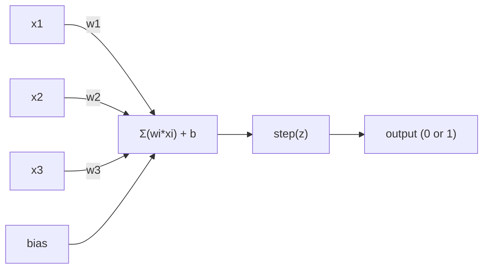
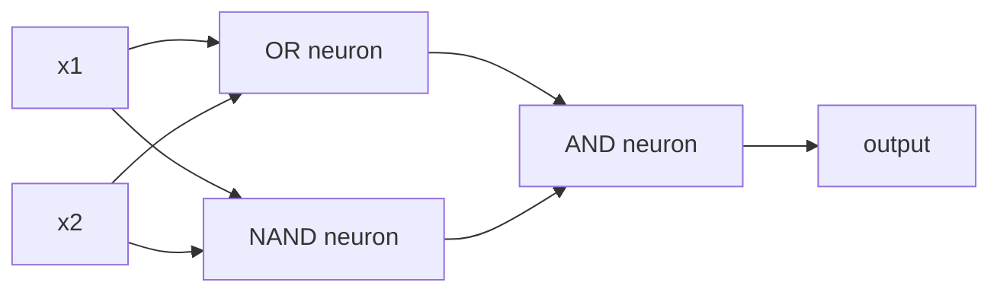

# 感知机

> 感知器是神经网络的原子. 打开它,你会发现重量,偏见和决定.

> 感知机是神经网络的"原子"开来看,内面就是权重,偏移和一个决策.

> **【中文解读】**感知机是神经网络中的"原子"最小的学习单元. 它所做的很简单:把输入乘重量,加上偏置,然后做第二选择的决策.

**Type:** Build
**Languages:** Python
**Prerequisites:** Phase 1 (Linear Algebra Intuition)
**Time:** ~60 minutes

## 学习目标

- 在Python中从零开始实现一个 perceptron,包括重量更新规则和步骤激活函数
  从零用Python实现感知机,包括权重更新规则和阶跃激活函数
- 解释为什么一个 perceptron 只有解决线性分离的问题,并证明XOR故障案例
  解释为什么单个感觉机只能解决线性可分问题,并演示XOR 失败案例
- 通过组合OR,NAND和AND门来构建一个多层的感知器来解决XOR
  通过组合OR、NAND 和 AND 门来构建多层感知机器来解决XOR
- 训练一个双层网络,使用sigmoid激活和反扩散,自动学习XOR
  用sigmoid 激活和反向传播训练 双层网络自动学习 XOR

> **【中文解读】**本章的目标:从零实现感知机,理解为什么单个感知机只能解决线性可分问题 ((XOR就是一个反例),然后通过组合多个感知机来突破这个限制,最终使用反向传播自动学习权重.

## 问题 问题引入

你知道向量和点点产品.你知道一个矩阵将输入转化为输出.但是,机器如何学习使用哪种转化?

> 你知道向量和点积. 你知道矩阵可以输入转换成输出.

感知器回答了这个问题. 它是最简单的学习机器: 取一些输入,乘以重量,添加偏见,做出二进制决定. 然后调整.就这样了.

> 感知机回答了这个问题. 它是最简单的学习机器:接收输入,乘重量,加偏置,做二分类决策,然后调整.

了解感知意味着理解"学习"在代码中实际上意味着什么:调整数字,直到输出匹配现实.

> 了解感知机意味着理解代码中"学习"的真正意义:不断调整数字,直到输出与现实相符.

> **【中文解读】**你已经知道矩阵可以把输入变成输出.但是机器怎么"学会"应该用哪些变化?感知机给出答案:输入乘权重,加偏置,做二分类决策,然后根据错误调整参数.

## 概念的核心概念

### 一个神经元,一个决定,一个神经元,一个决策

一个感知器采用n输入,乘以重量,总结它们,添加偏差,并通过激活函数传递结果.

> 感知机接收了 n 个输入,将每个输入乘以权重,求和,加上偏置,然后通过激活函数输出结果.



步骤函数是残酷的:如果加重总和加偏差是 >= 0,输出 1.否则输出 0.

> 阶跃函数很简单粗暴:如果加权和加偏置大于等于0,输出 1;否则输出0──

```
step(z) = 1  if z >= 0
           0  if z < 0
```

这是一个线性分类器. 重量和偏差定义了一个线 (或更高的维度中的超平面) 将输入空间分为两个区域.

> 这是一个线性分类器.权重和偏置定义了一条线,将输入空间分成两个区域.

> **【中文解读】**感知机的计算流程:输入 x 乘权重 w,求和后加偏置 b,最后通过阶跃函数输出 0 或 1 ⋅本质上就是一个线性分类器权重和偏置在空间中画一条线 (((或超平面),把输入空间分为两个区域──

### 决策界限

对于两个输入,感知器通过2D空间绘制了一条线:

> 对于两个输入,感知机在二维空间中画一条直线:

```
  x2
  ┤
  │  Class 1        /
  │    (0)          /
  │                /
  │               / w1·x1 + w2·x2 + b = 0
  │              /
  │             /     Class 2
  │            /        (1)
  ┼───────────/──────────── x1
```

训练将这个线路移动,直到它正确地分离了类.

> 线的一边全部输出0,另一边全部输出1. 训练过程就是移动这条线,直到它正确地将不同的类别分开.

> **【中文解读】**决策界限是w·x + b = 0 这条线. 训练过程是不断移动的,直到它正确地分开不同类型的数据. 在深度学习中,每个层面都在创造新的特征空间和新的决策界限.

### 学习规则

感知学规则很简单:

> 感知机的学习规则非常简单:

```
For each training example (x, y_true):     # 对每个训练样本
    y_pred = predict(x)                    # 预测输出
    error = y_true - y_pred                # 计算误差

    For each weight:                       # 对每个权重
        w_i = w_i + learning_rate * error * x_i   # 更新权重
    bias = bias + learning_rate * error    # 更新偏置
```

如果预测是正确的,错误=0,没有什么改变.如果预测是0但应该是1,重量增加.如果预测是1但应该是0,重量减少.学习率控制每个调整的规模.

> 如果预测是正确的,误差为0,不做任何调整. 如果预测是0,但应该是1,权重增加. 如果预测是1,但应该是0,权重减小.

> **【中文解读】**感知机的学习规则非常直觉:预测对就不动,预测错误根据误差方向调整权重.`optimizer.step()`做的事情本质上是一样的,只是计算更复杂.

> **【拓展：梯度下降的起源】**感知机学习规则是最简单的梯度下降.现代深度学习中的SGD (随机梯度下降) 、亚当优化器是这个思想的延伸.

### 问题是什么?

这里是它破裂的地方.

> 这就是感知机失效的地方.

```
AND gate:           OR gate:            XOR gate:
x1  x2  out         x1  x2  out         x1  x2  out
0   0   0           0   0   0           0   0   0
0   1   0           0   1   1           0   1   1
1   0   0           1   0   1           1   0   1
1   1   1           1   1   1           1   1   0
```

 AND 和 OR 是线性分离的:你可以绘制一个单行来分离0s和1s. XOR不是.没有单行可以分离 [0,1]和 [1,0]和 [0,0]和 [1,1].

> 和 OR 是线性可分的:你可以画一条直线将 0 和 1 分开.

```
AND (separable):        XOR (not separable):

  x2                      x2
  1 ┤  0     1            1 ┤  1     0
    │     /                 │
  0 ┤  0 / 0              0 ┤  0     1
    ┼──/──────── x1         ┼──────────── x1
       line works!          no single line works!
```

只有一个单个感知器才能解决线性分离的问题. 敏斯基和帕珀特在1969年证明了这一点,这几乎杀死了十年的神经网络研究.

> 这是一个根本的限制. 单个感觉机只能解决线性可分的问题.

解决方案:将感知子堆叠成层. 一个多层感知子可以通过将两个线性决定结合成一个非线性来解决XOR.

> 解决方案:将感知机堆叠成层. 多层感知机可以通过组合两个线性决策,组合一个非线性决策来解决XOR.

> **【中文解读】**问题是感觉机的"阿喀斯之":无论你如何画直线,都无法分开XOR的两类输出.1969年明斯基和纸证明这一点,直接导致神经网络研究的"第一寒冬"......但解法也很优雅:把多个感觉机叠加成多层,用两条直线组合来产生非线性的决策边界.

> **【拓展：为什么深度学习需要"深"】**单层感觉机只能画直线,两层可以画折线,三层可以画任意形状――层数越多,表达函数越复杂――这就是为什么GPT-4有近100层变压机每多层,模型就能表达更复杂的模式――从感觉机到GPT,核心思想一脉相承――

## 动手构建
```figure
perceptron-boundary
```

## 建立它

### 步骤1: 佩尔塞普特龙类

```python
class Perceptron:
    def __init__(self, n_inputs, learning_rate=0.1):
        self.weights = [0.0] * n_inputs   # 权重初始化为 0
        self.bias = 0.0                    # 偏置初始化为 0
        self.lr = learning_rate            # 学习率控制每次调整的幅度

    def predict(self, inputs):
        total = sum(w * x for w, x in zip(self.weights, inputs))  # 加权求和：w·x
        total += self.bias                                         # 加偏置：w·x + b
        return 1 if total >= 0 else 0       # 阶跃函数：>=0 输出 1，否则输出 0

    def train(self, training_data, epochs=100):
        for epoch in range(epochs):
            errors = 0
            for inputs, target in training_data:
                prediction = self.predict(inputs)   # 前向预测
                error = target - prediction          # 计算误差
                if error != 0:
                    errors += 1
                    for i in range(len(self.weights)):
                        self.weights[i] += self.lr * error * inputs[i]  # 权重更新
                    self.bias += self.lr * error      # 偏置更新
            if errors == 0:
                print(f"Converged at epoch {epoch + 1}")  # 全部正确，收敛
                return
        print(f"Did not converge after {epochs} epochs")
```

### 步骤2: 训练逻辑门

```python
and_data = [          # AND 逻辑门数据：两个输入都为 1 时输出 1
    ([0, 0], 0),
    ([0, 1], 0),
    ([1, 0], 0),
    ([1, 1], 1),
]

or_data = [           # OR 逻辑门数据：任一输入为 1 时输出 1
    ([0, 0], 0),
    ([0, 1], 1),
    ([1, 0], 1),
    ([1, 1], 1),
]

not_data = [          # NOT 逻辑门数据：取反
    ([0], 1),
    ([1], 0),
]

print("=== AND Gate ===")
p_and = Perceptron(2)
p_and.train(and_data)
for inputs, _ in and_data:
    print(f"  {inputs} -> {p_and.predict(inputs)}")

print("\n=== OR Gate ===")
p_or = Perceptron(2)
p_or.train(or_data)
for inputs, _ in or_data:
    print(f"  {inputs} -> {p_or.predict(inputs)}")

print("\n=== NOT Gate ===")
p_not = Perceptron(1)
p_not.train(not_data)
for inputs, _ in not_data:
    print(f"  {inputs} -> {p_not.predict(inputs)}")
```

### 步骤3: 观看XOR失败

```python
xor_data = [         # XOR 逻辑门数据：两个输入不同时输出 1
    ([0, 0], 0),
    ([0, 1], 1),
    ([1, 0], 1),
    ([1, 1], 0),
]

print("\n=== XOR Gate (single perceptron) ===")
p_xor = Perceptron(2)
p_xor.train(xor_data, epochs=1000)   # 即使训练 1000 轮也无法收敛
for inputs, expected in xor_data:
    result = p_xor.predict(inputs)
    status = "OK" if result == expected else "WRONG"
    print(f"  {inputs} -> {result} (expected {expected}) {status}")
```

这证明一个单个感知器不能学习XOR.

> 它永远不会收到. 这就是单个感知机无法学习XOR的铁证.

> **【中文解读】**单个感知机训练 XOR 永远不会收不管训练多少轮――这是数学上的硬限制:一条直线不能正确分为两个类的XOR的四个点――

### 通过两个层的网络来解决XOR

技巧是:XOR= (x1 OR x2) 并不是 (x1 AND x2). 结合三个感知光:

> 技巧:XOR = (x1 OR x2) 并非 (x1 AND x2)



```python
def xor_network(x1, x2):
    or_neuron = Perceptron(2)
    or_neuron.weights = [1.0, 1.0]     # OR 门的权重
    or_neuron.bias = -0.5              # OR 门的偏置

    nand_neuron = Perceptron(2)
    nand_neuron.weights = [-1.0, -1.0]  # NAND 门（AND 的取反）的权重
    nand_neuron.bias = 1.5              # NAND 门的偏置

    and_neuron = Perceptron(2)
    and_neuron.weights = [1.0, 1.0]     # AND 门的权重
    and_neuron.bias = -1.5              # AND 门的偏置

    hidden1 = or_neuron.predict([x1, x2])    # 隐藏层第 1 个神经元：OR
    hidden2 = nand_neuron.predict([x1, x2])  # 隐藏层第 2 个神经元：NAND
    output = and_neuron.predict([hidden1, hidden2])  # 输出层：AND
    return output


print("\n=== XOR Gate (multi-layer network) ===")
for inputs, expected in xor_data:
    result = xor_network(inputs[0], inputs[1])
    print(f"  {inputs} -> {result} (expected {expected})")
```

积感知子在层层中创造出决策界限,

> 感知机组的堆积可以创建单个感知机组无法产生决策边界.

> **【中文解读】**关键洞察:XOR = (x1 OR x2) 和 NOT(x1 AND x2);;第一层使用两个感知机分别做 OR 和 NAND(两条直线),第二层使用 AND 把两个结果组合在一起――这就用两条直线拼出非线性决策边界――这也是现代神经网络的基本原理每层都在做特征组合变化――

### 训练一个双层网络

步骤4是手动连接权重.这对XOR而言是有效的,但不是对真正的问题,你不能提前知道正确的权重.解决办法:用sigmoid取代步骤函数,通过后延伸自动学习权重.

> 步骤 4 手动设置权重. 这对XOR有效,但不能用于不知道正确权重的实际问题.

```python
class TwoLayerNetwork:
    def __init__(self, learning_rate=0.5):
        import random
        random.seed(0)
        self.w_hidden = [[random.uniform(-1, 1), random.uniform(-1, 1)] for _ in range(2)]  # 隐藏层权重（2个神经元，各2个输入）
        self.b_hidden = [random.uniform(-1, 1), random.uniform(-1, 1)]   # 隐藏层偏置
        self.w_output = [random.uniform(-1, 1), random.uniform(-1, 1)]   # 输出层权重
        self.b_output = random.uniform(-1, 1)   # 输出层偏置
        self.lr = learning_rate

    def sigmoid(self, x):
        import math
        x = max(-500, min(500, x))   # 裁剪防止溢出
        return 1.0 / (1.0 + math.exp(-x))  # sigmoid 函数：σ(x) = 1/(1+e^(-x))

    def forward(self, inputs):
        self.inputs = inputs
        self.hidden_outputs = []
        for i in range(2):
            z = sum(w * x for w, x in zip(self.w_hidden[i], inputs)) + self.b_hidden[i]  # 隐藏层线性变换
            self.hidden_outputs.append(self.sigmoid(z))  # 隐藏层激活
        z_out = sum(w * h for w, h in zip(self.w_output, self.hidden_outputs)) + self.b_output  # 输出层线性变换
        self.output = self.sigmoid(z_out)   # 输出层激活
        return self.output

    def train(self, training_data, epochs=10000):
        for epoch in range(epochs):
            total_error = 0
            for inputs, target in training_data:
                output = self.forward(inputs)       # 前向传播
                error = target - output              # 误差 = 目标 - 预测
                total_error += error ** 2            # 累计平方误差

                d_output = error * output * (1 - output)   # 输出层梯度（链式法则）

                saved_w_output = self.w_output[:]
                hidden_deltas = []
                for i in range(2):
                    h = self.hidden_outputs[i]
                    hd = d_output * saved_w_output[i] * h * (1 - h)  # 隐藏层梯度（反向传播）
                    hidden_deltas.append(hd)

                # 更新输出层权重
                for i in range(2):
                    self.w_output[i] += self.lr * d_output * self.hidden_outputs[i]
                self.b_output += self.lr * d_output

                # 更新隐藏层权重
                for i in range(2):
                    for j in range(len(inputs)):
                        self.w_hidden[i][j] += self.lr * hidden_deltas[i] * inputs[j]
                    self.b_hidden[i] += self.lr * hidden_deltas[i]
```

```python
net = TwoLayerNetwork(learning_rate=2.0)
net.train(xor_data, epochs=10000)
for inputs, expected in xor_data:
    result = net.forward(inputs)
    predicted = 1 if result >= 0.5 else 0   # 以 0.5 为阈值做二分类
    print(f"  {inputs} -> {result:.4f} (rounded: {predicted}, expected {expected})")
```

首先,sigmoid取代了步骤函数,它是光滑的,所以梯度存在.`train`通过这种方法,输出到隐藏层的错误会向后传播,调整每个重量以其对错误的贡献比例.

> 首先,sigmoid 替换了阶跃函数它是平滑的,所以梯度存在`train`方法将错误从输出层到隐藏层反向传播,根据每个权重对错误的贡献比例进行调整.

这就是第3课的桥梁.`d_output`其他`hidden_deltas`我们将把它从这个线程中得到.

> 这就是进入第3课的桥梁.`d_output`和 `hidden_deltas`后来的数学是网络图上的链式法则的应用.

> **【中文解读】**第4步是手动设定权重,但真实问题中我们不知道正确的权重. 这里的突破是:使用 sigmoid 替代阶跃函数 (因为它可导),然后使用反向传播 (反向传播) 后传递 (反向传播) 自动学习权重.`d_output`和 `hidden_deltas`这就是Pytorch的应用.`loss.backward()`在做的事情.

> **【拓展：PyTorch autograd 的原理】**皮托尔奇的自动微分 (自动分) 质上就是自动执行的反向传播过程.`backward()`时沿图反向传播梯度──手动写反向传播 (像这里一样) 是理解自动化的最佳方法──

## 实际应用.

你从零开始的东西都存在于一个进口:

> 你刚刚从零构建的所有功能都可以通过一个导入实现:

```python
from sklearn.linear_model import Perceptron as SkPerceptron   # sklearn 内置的感知机
import numpy as np

X = np.array([[0,0],[0,1],[1,0],[1,1]])  # 输入数据
y = np.array([0, 0, 0, 1])               # AND 门的标签

clf = SkPerceptron(max_iter=100, tol=1e-3)  # 最多迭代 100 次，容差 0.001
clf.fit(X, y)                                # 训练
print([clf.predict([x])[0] for x in X])     # 预测所有样本
```

五行,你的30行.`Perceptron`并且,在Sklern版本中,我们可以看到一个类的重量,

> 五行代码――你30行的`Perceptron`类做的是同样的事情.  阅读版本增加了收检查,多种损失函数和稀疏输入支持,但核心循环完全相同:加权和、阶跃函数、按差异更新权重.

实际的差距在规模上显现.

> 实际差距在现在规模上.

- 步骤函数变成sigmoid,ReLU或其他流的激活
  阶跃函数变成sigmoid、ReLU或其他平滑激活函数
- 通过反向扩散自动学习重量 (课3)
  权重通过反向传播自动学习 (第03课)
- 层变得更深: 3, 10, 100+层
  层数变得更深:3层,10层100+层
- 根据此,每一个层都会从前一个层的输出中创造新的特性.
  基本原理不变:每层从前层的输出中创建新特征

一个感知器只能画直线,堆叠它们,你可以画任何形状.

> 单个感觉机只能画直线. 把它们堆叠起来,你就能画出任何形状.

> **【中文解读】**五行代码已经搞定了我们30行所做的事情了.核心逻辑完全相同:加权求和、阶跃函数、按差异更新权重──真正的差距在规模上:现代网络使用可导的激活函数(如ReLU) 、使用反向传播自动学习、有几十到上百层──但基本原理永远是:从上层输出中创建新特征──

## 运输货物

这一课产生了:
- `outputs/skill-perceptron.md`- 需要单层与多层架构时,

> 本课产出:`outputs/skill-perceptron.md`- 一个关于使用单层和多层架构的技能文件

## 练习题

1. 训练一个感知器在NAND门 (通用门 - - 任何逻辑电路都可以从NAND构建).验证其重量和偏差形成有效的决策界限.
   > **练习 1：**用感知机训练 NAND门  任何逻辑电路都可以使用 NAND 构建) ・验证学到的权重和偏置是否形成有效的决策边界――

2. 修改Perceptron类,以追踪每个时代的决策边界 (w1\*x1 + w2\*x2 + b = 0).在 AND 门上打印训练过程中线路的转移.
   > **练习 2：**修改感知类,在每个时代记录决策边界 (w1\*x1 + w2\*x2 + b = 0) ――打印在训练中

3. 构建一个3输入感知器,只有当至少3输入中的2个是1 (多数投票函数) 时才能输出1.这是否线性分离的?为什么?
   > **练习 3：**构建一个3输入感知机,当至少2输入为1 时输出1 多数投票函数) ⋅这个函数是线性可分的吗?为什么?

## 关键词 关键词

| Term | What people say | What it actually means |
|------|----------------|----------------------|
| Perceptron | "A fake neuron" | A linear classifier: dot product of inputs and weights, plus bias, through a step function |
| Weight | "How important an input is" | A multiplier that scales each input's contribution to the decision |
| Bias | "The threshold" | A constant that shifts the decision boundary, letting the perceptron fire even with zero inputs |
| Activation function | "The thing that squishes values" | A function applied after the weighted sum - step function for perceptrons, sigmoid/ReLU for modern networks |
| Linearly separable | "You can draw a line between them" | A dataset where a single hyperplane can perfectly separate the classes |
| XOR problem | "The thing perceptrons can't do" | Proof that single-layer networks cannot learn non-linearly-separable functions |
| Decision boundary | "Where the classifier switches" | The hyperplane w\*x + b = 0 that divides input space into two classes |
| Multi-layer perceptron | "A real neural network" | Perceptrons stacked in layers, where each layer's output feeds the next layer's input |

| 术语 | 通俗说法 | 实际含义 |
|------|---------|---------|
| 感知机 (Perceptron) | "假神经元" | 线性分类器：输入与权重的点积加偏置，过阶跃函数 |
| 权重 (Weight) | "输入的重要性" | 缩放每个输入对决策贡献的乘数 |
| 偏置 (Bias) | "阈值" | 偏移决策边界的常数，让感知机在全零输入时也能激活 |
| 激活函数 (Activation function) | "压扁数值的东西" | 加权求和后施加的函数——感知机用阶跃函数，现代网络用 sigmoid/ReLU |
| 线性可分 (Linearly separable) | "能画线分开" | 数据集可以用一个超平面完美分成两类 |
| XOR 问题 | "感知机做不到的事" | 证明单层网络无法学习非线性可分函数 |
| 决策边界 (Decision boundary) | "分类器切换的地方" | w\*x + b = 0 这个超平面，把输入空间分成两类区域 |
| 多层感知机 (MLP) | "真正的神经网络" | 感知机按层堆叠，每层的输出是下一层的输入 |

## 继续阅读 继续阅读

- 弗兰克·罗森布拉特,"感知器:大脑信息存储和组织的概率模型" (1958) -- 首先开始的论文
  弗兰克·罗森布拉特,感知机:大脑信息存储和组织概率模型
- 敏斯基和帕珀特"感知器" (1969) - - 证明XOR是单层网络无法解决的书,并杀死了感知器研究十年
   敏斯基 和 帕珀特,感知机 ( 感知机) 1969年) 证明单层网络无法解决XOR并使感知机研究停滞十年的著作
- 迈克尔·尼尔森"神经网络和深度学习"第1章 (http://neuralnetworksanddeeplearning.com/) --免费在线,最好的视觉解释如何构成网络的感知器
  关于感知机器如何组建网络的最佳可视化解释
