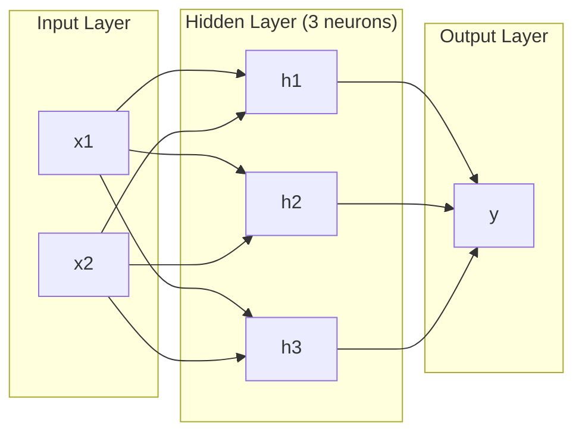
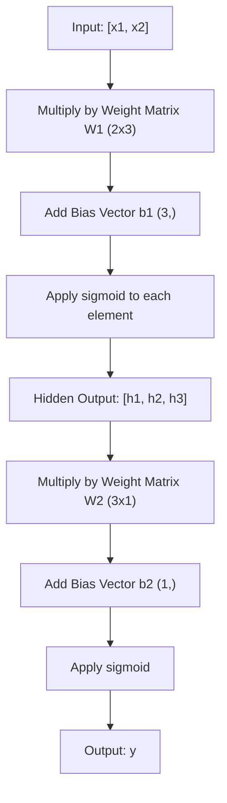
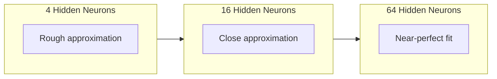

# 跨层网络和前进通行.

> 一个神经元画出一个线,堆叠它们,你可以画任何东西.

> 一个神经画一个直线.把它们叠加起来,你就能画出任何形状.

> **【中文解读】**一个神经元只能画一个直线,但把多个神经元叠加在多层,就能适合任意形状的曲线.

**Type:** Build
**Languages:** Python
**Prerequisites:** Phase 01 (Math Foundations), Lesson 03.01 (The Perceptron)
**Time:** ~90 minutes

## 学习目标

- 创建一个多层网络从零开始,使用一个完整的前进传输的层和网络类
  从零构建带有层和网络类型的多层网络,执行完整的前向传播
- 通过网络的每个层进行跟踪矩阵尺寸,并确定形状不匹配
  追踪网络每层矩阵维度,识别形状不匹配问题
- 解释如何堆叠非线性激活使网络能够学习曲线决策界限
  解释堆叠非线性激活如何使网络能够学习曲的决策边界
- 使用手调sigmoid权重的2-2-1架构解决XOR问题
  使用手动调整的 sigmoid 权重,使用 2-2-1 架构解决XOR 问题

> **【中文解读】**本章的目标:从零构建层和网络类,理解前向传播中矩阵维度的变化,弄清楚为什么非线性激活函数让网络能学习曲的决策边界.

## 问题 问题引入

一个神经元就是一个线条抽.就这样. 一条直线通过数据.人工智能的每一个真正的问题 - - 识别图像,语言理解,玩GO - - 都需要曲线.

> 单个神经只是一个绘图线的工具――仅仅是这样――在你的数据中绘制一条直线――人工智能中每个真实的问题图像识别,语言理解,下围棋都需要曲线――将神经堆叠成层就是获得曲线的方法――

1969年,明斯基和帕珀特证明了这种限制是致命的:单层网络不能学习XOR.不是"努力学习" - - 数学上不能.XOR真相表在一边放置[0,1]和[1,0],在另一边放置[0,0]和[1,1].没有单一线分离它们.

> 1969年,明斯基和帕珀证明了这一限制是致命的:单层网络无法学习XOR──不是"很难学"是数学上不可能──XOR真值表将 [0,1] 和 [1,0] 放在一边,0,0 和 [1,1] 放在另一边──没有一条直线能分开它们──

这导致了超过十年的神经网络资金被削减. 后来看,解决方案很明显:停止使用一个层. 堆叠神经元成层. 让第一层将输入空间切割成新功能,让第二层将这些功能结合成决策,没有单一线可以做出的.

> 这让神经网络的资金停滞了十年多. 结果显然,解决方案很明显:不再仅仅是用一个层.

这堆是多层网络.它是今天生产的每一个深度学习模型的基础.前进传输 - - 从输入到输出的数据从隐藏层流到输出 - - 是你需要建立的第一件事,

> 那个堆积就是多层网络――它是当今生产环境中每个深度学习模型的基础――前向传播――数据从输入流流流隐藏层到输出层是你在其他所有工作之前需要构建的第一件事――

> **【中文解读】**单个神经元只能画直线,但图像识别,语言理解,围棋 这些真实AI任务都需要曲线――1969年明斯基和帕珀特证明单层网络无法学习XOR(数学上不可能,不是"学不好")――解答是层次:第一层把输入空间切成新特征,第二层把这些特征组合成更复杂的决策――这是所有深度学习模型的基础――

## 概念的核心概念

### 层:输入层,隐藏层,输出层

多层网络有三个层:

> 多层网络有三种层:

**Input layer**两个功能意味着两个输入节点.这里没有计算.

> **输入层**实际上不算真正的层面. 它存储原始数据.

**Hidden layers**每个神经元从前层中取出每一个输出,应用重量和偏差,然后通过激活函数传递结果. "隐藏",因为你从来没有直接看到这些值在训练数据中.

> **隐藏层**真正干活的地方──每个神经元接收前一层的所有输出,应用权重和偏置,然后将通过激活函数结果──"隐藏"是因为你在训练数据中永远看不到这些值──

**Output layer**对于二进制分类,一个神经元与sigmoid.对于多类,一个神经元每个类.

> **输出层**最终答案──二分类用一个 sigmoid 神经元,也许用每个类一个神经元──



这是一个2-3-1网络.两个输入,三个隐藏的神经元,一个输出.每个连接都带有重量.每个神经元 (除输入) 都带有偏见.

> 这是一个2-3-1 网络――两个输入,三个隐藏神经元,一个输出――每个连接都有一个权力――每个神经元 (除输入层) 有一个偏置――

每层都产生一个数字向量,称为隐藏状态.对于文本来说,隐藏状态增加了维度 - - 编码一个词为768个数字来捕捉语义意义.对于图像来说,它们减少了维度 - - 压缩了数百万像素成为可管理的表示.隐藏状态是学习生活的地方.

> 每层产生一个数字向量,称为隐藏状态.对于文本,隐藏状态增加维度.对于图像,它们降低维度.

> **【中文解读】**三种层:输入层(只是数据输入,不计算) 隐藏层(做特征变化,"隐藏"是因为训练数据里看不到这些值) 输出层(最终答案) ⋅每层产生一个向量叫做"隐藏状态"文本任务中它增加维度(把词变成768维向量来捕捉语义),图像任务中它降低维度(缩百万像素为紧表示) ⋅学习发生在这些隐藏状态中。

> **【拓展：Transformer 中的隐藏状态】**在GPT/BERT中,每个层变压器的输出也是一个隐藏状态(形状: [批量,seq_len,d_model])──这些隐藏状态逐层"理解"输入的语义低层捕捉语法,高层捕捉语义──这也是为什么可以通过的原因.`model(x).hidden_states[-1]`提取特征用于下游任务.

### 神经元和激活函数

每个神经元都能做三个事情:

> 每个神经元都做了三件事:

1. 乘以其相应的重量
   将每一个输入乘以对应的权重
2. 总结所有产品,并添加一个偏见
   将所有乘积求和并加上偏移
3. 通过激活函数传递总数
   将通过激活函数

现在,激活是sigmoid:

> 目前使用的激活函数是 sigmoid:

```
sigmoid(z) = 1 / (1 + e^(-z))
```

sigmoid将任何数量压缩到范围 (0,1). 大量的正进口向1推进. 大量的负进口向0推进.零地图到0.5. 这种光滑的曲线是使学习成为可能的 - - 与感知器的硬步骤不同,sigmoid在任何地方都有梯度.

> 形将任何数字压缩到 (0, 1) 范围内. 大正输入趋向1,大负输入趋向0,0 映射到0.5 形使学习成为可能 与感知机的硬阶段不同,形处处有梯度.

> **【中文解读】**每个神经元做三个事情:输入乘权重、求和加偏置、过激活函数――Sigmoid 将任意数字缩小到 (0, 1) 区间――关键是它处可导这使梯度下降成为可能――感知机的阶跃函数在 0 处不可导,所以无法使用梯度下降训练――

### 传输数据流动方式

进口传输通过网络,层次推进输入数据,直到它达到输出.进口传输过程中没有学习发生.这是纯计算:乘以,添加,激活,重复.

> 前向传播将输入数据,逐层推进网络,直到输出.



在每个层次上,有三个操作发生:

> 在每层次,按顺序执行三个操作:

```
z = W * input + b       (linear transformation)    # 线性变换
a = sigmoid(z)           (activation)                # 激活
```

一层输出成为下一个层输入.

> 一层输出成为下层输入.

> **【中文解读】**前向传播就是从输入流到输出流的数据流程没有任何学习,纯粹的计算. 每层做两件事:线性变换 ((Wx + b) +非线性激活 ((sigmoid) ⋅上层的输出就是下层的输入.`model(x)`在做的事情.

### 矩阵维度

追踪维度是深度学习中最重要的调试技能.

> 追踪维度是深度学习中最重要的调试技能.

| Step | Operation | Dimensions | Result Shape |
|------|-----------|------------|-------------|
| Input | x | -- | (2,) |
| Hidden linear | W1 * x + b1 | W1: (3, 2), b1: (3,) | (3,) |
| Hidden activation | sigmoid(z1) | -- | (3,) |
| Output linear | W2 * h + b2 | W2: (1, 3), b2: (1,) | (1,) |
| Output activation | sigmoid(z2) | -- | (1,) |

| 步骤 | 操作 | 维度 | 结果形状 |
|------|------|------|---------|
| 输入 | x | -- | (2,) |
| 隐藏层线性变换 | W1 * x + b1 | W1: (3, 2), b1: (3,) | (3,) |
| 隐藏层激活 | sigmoid(z1) | -- | (3,) |
| 输出层线性变换 | W2 * h + b2 | W2: (1, 3), b2: (1,) | (1,) |
| 输出层激活 | sigmoid(z2) | -- | (1,) |

规则:在层 k 的重量矩阵 W 有形状 (神经元_in_layer_k,神经元_in_layer_k_minus_1). 排列与当前层匹配.列表与前层匹配.如果形状不排列,则你有错误.

> 规则:第一个层的权重矩阵 W 的形状为 (第一个层神经元数, 第一个层神经元数)  行对应应前层,列对应上层.

> **【中文解读】**追踪矩阵维度是深度学习中最重要的调试技能――规则很简单:第一个层的权重矩阵 W 形状是 (第一个层神经元数, 第一个层神经元数) ――行对应应应应应应应应应应应应应应应应应应应应应应应应应应应应应应应应应应应应应应应应应应应应应应应应应应应应应应应应应应应应应应应应应应应应应应应应应应应应应应应应应应应应应应应应应应应应应应应应应应应应应应应应应应应应应应应应应应应应应应应应应应应应应应应应应应应应应应应应应应应应应应应应应应应应应应应应应应应应应应应应应应应应应应应应应应应应应应应应应应应应应应应应应应应应应应应应应应应应应应应应应应应应应应应应应应应应应应应应应应应应应应应应应应应应应应应应应应应应应应应应应应应应应应应应应应应应应应应应应应应应应应应应应应应应应应应应应应应应应应应应应应应应应应应应应应应应应应应应应应应应应应应应应应应应应应应应应应应应应应应应应应应应应应应应应应应应应应应应应应应应应应应应应应应应应应应应应应应应应应应应应应应应应应应应应应应应应应应应应应应应应应应应应应应应应应应应应应应应应应应应应应应应应应应应应应应应应应应应应应应应应应应应应应应应应应应应应应应应应应应应应应应应应应应应应应应应

> **【拓展：维度不匹配是深度学习最常见的 bug】**在 PyTorch 中,你经常看到`RuntimeError: mat1 and mat2 shapes cannot be multiplied`△这是维度不匹配──学会手动追踪维度,就能快速定位这种类型的错误──现代工具如`torchsummary`或`torchinfo`我可以帮你自动检查.

### 总体近似定理

1989年,乔治·赛本科证明了一些非凡的东西:一个隐藏的单层和足够的神经元的神经网络可以接近任何连续的功能,

> 1989年,乔治·赛本科证明了一个不寻常的事实:一个具有单个隐藏层和足够多的神经元的神经网络可以随意精准地接近任何连续函数.

这并不意味着一个隐藏的层面总是最好.这意味着架构理论上是有能力的.实际上,更深层的网络 (每个层有更多层次,每个层有更少的神经元) 与浅层网络相比学习的总参数要少得多.这就是为什么深层学习工作的原因.

> 这并不意味着一个隐藏层总是最好的――它意味着架构在理论上是可行的――在实践中,更深层的网络 (更多层,每个层较少神经元) 使用远小于浅宽网络的总参数来学习相同的函数――这就是深度学习有效的原因――

感觉:隐藏的每个神经元都学会了一个""或特征. 足够的放在正确的地方可以接近任何平滑的曲线.更多的神经元,更多的,更好的接近.

> 直觉:隐藏层中的每个神经学习一个"凸起"或特征――足以将凸起放在正确位置,可以接近任何平滑曲线――更多神经,更多凸起,更好接近――



> **【中文解读】**能接近定理 (1989):一个隐藏层+足够多的神经元可以接近任何连续函数――但这并不代表一个层就足够了实践中,"深窄"的网络比"浅宽"更高效――直觉上,每个隐藏的神经元学会一个"凸起"或特征,足够多的凸起就能拼出任何曲线――

> **【拓展：为什么"深"比"宽"好】**理论上一层2^n 个神经元等于n 层每层2个神经元,但前者参数是指数级的,后者是线性的.

### 复合性,可组合性.

网络可以组合.你可以堆叠它们,链接它们,并行它们.一个Whisper模型使用编码网络来处理音频,并使用单独的编码网络来生成文本.现代的LLM仅使用编码器.BERT仅使用编码器.T5是编码器-解码器.建筑选择定义模型能做什么.

> 神经网络是可组合的. 你可以堆叠,链接,并行运行它们. 语 模型使用编码器网络处理音频,使用单独的解码器网络生成文本. 现代的LLM是纯解码器的.

> **【中文解读】**神经网络是可组合的:语 用编码器处理音频 + 解码器生成文本;GPT 是纯解码器;BERT 是纯编码器;T5 是编码器-解码器──架构选择决定了模型的能力──

## 动手构建
```figure
mlp-forward
```

## 建立它

纯粹的Python,没有,每一个矩阵操作都从头开始.

> 纯Python──不用编号──每一个矩阵运算从头写起──

### 步骤1:Sigmoid激活

```python
import math

def sigmoid(x):
    x = max(-500.0, min(500.0, x))  # 裁剪到 [-500, 500] 防止指数溢出
    return 1.0 / (1.0 + math.exp(-x))  # σ(x) = 1/(1+e^(-x))
```

到500500,防止过.`math.exp(500)`它们是大但有限的.`math.exp(1000)`无限性.

> 剪切到 [500,500] 可防止溢出.`math.exp(500)`很大,但有限.`math.exp(1000)`是无穷大.

### 阶层类 阶层类

深度学习中最重要的操作是矩阵乘法. 每一个层,每一个注意力头,每一个前进传递,都是矩阵. 一个线性层取出输入向量,乘以重量矩阵,并添加一个偏差向量: y = Wx + b.

> 深度学习中最重要的运算是矩阵乘法――每层,每注意头,每次前向传播都是矩阵乘法――线性层接收一个输入向量,乘以权重矩阵,加上偏定向量:y = Wx + b――这个方程占神经网络的90%计算量――

一层包含一个重量矩阵和一个偏向向量.它的前进方法采用一个输入向量,返回了激活的输出.

> 一层包含一个权重矩阵和一个偏向向量. 它的前进方法是接收一个输入向量并返回激活后的输出.

```python
class Layer:
    def __init__(self, n_inputs, n_neurons, weights=None, biases=None):
        if weights is not None:
            self.weights = weights                       # 使用指定的权重（如手动设置 XOR 的权重）
        else:
            import random
            self.weights = [
                [random.uniform(-1, 1) for _ in range(n_inputs)]  # 随机初始化权重
                for _ in range(n_neurons)
            ]                                           # 形状：(n_neurons, n_inputs)
        if biases is not None:
            self.biases = biases                         # 使用指定的偏置
        else:
            self.biases = [0.0] * n_neurons              # 偏置初始化为 0

    def forward(self, inputs):
        self.last_input = inputs                         # 保存输入（反向传播时需要）
        self.last_output = []
        for neuron_idx in range(len(self.weights)):
            z = sum(
                w * x for w, x in zip(self.weights[neuron_idx], inputs)  # 加权求和
            )
            z += self.biases[neuron_idx]                 # 加偏置
            self.last_output.append(sigmoid(z))          # sigmoid 激活
        return self.last_output
```

体重矩阵有形状 (n_neurons, n_inputs).每个行是所有输入中一个神经元的重量.前进方法通过神经元循环,计算加重的总和加偏差,应用sigmoid,收集结果.

> 权重矩阵的形状为 (n_neurons, n_input) ⋅每行是一个神经对所有输入的权重──前进方法遍历神经,计算加权和加偏置,应用 sigmoid,并收集结果──

> **【拓展：PyTorch 的 nn.Linear】**这里的层就是PyTorch.`nn.Linear`简体中文版`nn.Linear(in_features, out_features)`内部也是维护一个`(out_features, in_features)`权重矩阵和一个`(out_features,)`了解这一点,就了解了深度学习的90%的计算.

### 网络类 网络类

网络是层次列表.前进传递链接它们:层 k的输出输入到层 k+1.

> 网络是一个层次的列表. 前向传播将它们串联:第一个层次的输出作为第一个层次的输入.

```python
class Network:
    def __init__(self, layers):
        self.layers = layers   # 按顺序存储所有层

    def forward(self, inputs):
        current = inputs               # 当前层的输入
        for layer in self.layers:
            current = layer.forward(current)  # 逐层前向传播
        return current
```

数据进入,流过每个层,从另一边出.

> 这就是整个前向传播.

> **【中文解读】**网络类就是Pytorch`nn.Sequential`简体中文版 四行代码:数据进来,逐层流过,出来――这是所有深度学习模型前向传播的本质

### 步骤4:XOR与手调权重.

在第01课中,我们通过结合OR,NAND和AND感知符号来解决XOR.现在我们用我们的层和网络类做同样的事情. 2-2-1架构:两个输入,两个隐藏的神经元,一个输出.

> 在第01课中,我们通过组合OR、NAND 和 AND 感知机解决了XOR──现在用我们的层和网络类做同样的事──2-2-1 架构:两个输入,两个隐藏神经元,一个输出──

```python
hidden = Layer(
    n_inputs=2,
    n_neurons=2,
    weights=[[20.0, 20.0], [-20.0, -20.0]],  # 大权重让 sigmoid 接近阶跃函数
    biases=[-10.0, 30.0],                      # 第一个神经元 ≈ OR，第二个 ≈ NAND
)

output = Layer(
    n_inputs=2,
    n_neurons=1,
    weights=[[20.0, 20.0]],                    # 输出层 ≈ AND
    biases=[-30.0],
)

xor_net = Network([hidden, output])

xor_data = [
    ([0, 0], 0),
    ([0, 1], 1),
    ([1, 0], 1),
    ([1, 1], 0),
]

for inputs, expected in xor_data:
    result = xor_net.forward(inputs)
    predicted = 1 if result[0] >= 0.5 else 0
    print(f"  {inputs} -> {result[0]:.6f} (rounded: {predicted}, expected: {expected})")
```

由于大重量 (20, -20) 让西格莫ид作为步骤函数.第一个隐藏的神经元接近OR.第二个接近NAND.输出神经元将它们结合为AND,这就是XOR.

> 大权重 (20, -20) 使 sigmoid 表现为阶跃函数.

### 圆形分类

复杂的问题是:将二维点分类为一个半径0.5的圆体内或外面,以中心于源头.这需要一个曲线的决定边界,

> 另一个更难的问题是:将二维点分类为原点中心的圆内或圆外,半径为0.5个.

```python
import random
import math

random.seed(42)

data = []
for _ in range(200):
    x = random.uniform(-1, 1)
    y = random.uniform(-1, 1)
    label = 1 if (x * x + y * y) < 0.25 else 0   # 距原点距离 < 0.5 则为"内部"
    data.append(([x, y], label))

circle_net = Network([
    Layer(n_inputs=2, n_neurons=8),   # 隐藏层：8 个神经元
    Layer(n_inputs=8, n_neurons=1),   # 输出层：1 个神经元
])
```

随机权重的网络不会进行好分类.但前进的传递仍然运行.这是点--前进的传递只是计算.学习正确的权重是背后传播,进入课3.

> 随机权重,网络分类效果会很差.但是前向传播仍然可以运行.

```python
correct = 0
for inputs, expected in data:
    result = circle_net.forward(inputs)
    predicted = 1 if result[0] >= 0.5 else 0
    if predicted == expected:
        correct += 1

print(f"Accuracy with random weights: {correct}/{len(data)} ({100*correct/len(data):.1f}%)")
```

随机重量给出了差的准确性,通常比估算多数类更糟. 训练后 (课3) 这个同样的结构有8个隐藏的神经元将绘制一个曲线的边界,将内部与外部分开.

> 随着权重的重量给出了很差的准确率通常比猜测多数类还差.经过训练后,也拥有8个隐藏的神经元的结构将绘制曲曲的边界,将圆内和圆外分开.

> **【中文解读】**随机权重的网络分类效果很差这是正常的,因为还没有训练――前向传播只是计算,不涉及学习――训练(下课的反向传播) 才会调整权重――8个隐藏的神经元足以绘制圆形决策边界――

## 实际应用.

皮托奇在四行中完成了以上所有工作:

> 鱼用四行代码就能完成上面的所有功能:

```python
import torch
import torch.nn as nn

model = nn.Sequential(       # 对应我们的 Network 类
    nn.Linear(2, 8),         # 对应 Layer(2, 8)：权重形状 (8, 2)
    nn.Sigmoid(),             # 对应 sigmoid 激活
    nn.Linear(8, 1),         # 对应 Layer(8, 1)：权重形状 (1, 8)
    nn.Sigmoid(),             # 输出层 sigmoid
)

x = torch.tensor([[0.0, 0.0], [0.0, 1.0], [1.0, 0.0], [1.0, 1.0]])  # XOR 输入
output = model(x)             # 前向传播
print(output)
```

`nn.Linear(2, 8)`是你的层类:形状的重量矩阵 (8, 2),形状的偏向向量 (8,). `nn.Sigmoid()`它们的元素是指它们的元素.`nn.Sequential`链层顺序.

> `nn.Linear(2, 8)`就是你的层类:形状为 (8, 2) 的权重矩阵,形状为 (8,) 的偏置向量.`nn.Sigmoid()`是你的sigmoid 函数的个元素应用.`nn.Sequential`您的网络是个网络.

差别在于速度和规模. PyTorch 运行在GPU上,处理数百万个样本,并自动计算向后传播的梯度.

> 区别在于速度和规模. 皮托奇在GPU上运行,处理数百万个样本的批量,并自动计算反向传播的梯度.

> **【中文解读】**鱼四行代码已经实现了我们手动构建的全部逻辑.`nn.Linear`的层,`nn.Sequential`我们的网络,`nn.Sigmoid()`区别在于PyTorch支持GPU加快,批量处理和自动调用,但前向传播的核心逻辑完全相同.

## 运输货物

这一课程提供了可重复使用的网络架构设计提示:

> 本课产出一个可复制的网络架构设计提示词:

- `outputs/prompt-network-architect.md`

需要决定每层有多少层,每个层有多少神经元,以及在特定问题上使用哪些激活功能时使用它.

> 当你需要决定给定的问题, 确定多少层,每个层多少神经元以及使用哪些激活函数时,你可以使用它.

## 练习题

1. 建立一个 2-4-2-1 网络 (两个隐藏层) 并运行随机重量 XOR 数据的前传.打印中间隐藏层输出,以查看每个层中的表示如何转换.
   > **练习 1：**构建 2-4-2-1 网络(两个隐藏层),随机权重运行XOR 数据的前向传播――打印中隐藏层输出,观察每个层如何变化数据的表示――

2. 通过随机重量运行前进传输. 隐藏的神经元的数量是否改变输出范围或分布? 为什么?
   > **练习 2：**把圆形分类器的隐藏层从8变为2,再变为32,分别使用随机重量运行前向传播.隐藏神经元数量会改变输出范围或分布吗?为什么?

3. 实施一个`count_parameters`网络类的方法,返回可训练的总数重量和偏差. 在784-256-128-10网络 (经典的MNIST架构) 上测试它. 它有多少参数?
   > **练习 3：**在网络中实现`count_parameters`方法,返回所有可训练的权重和偏置总数――使用784-256-128-10 网络(经典MNIST架构) 测试,它有多少参数?

4. 建立一个前进传输器为 3-4-4-2 网络. 输入它 RGB 颜色值 (正常化为 0-1) 并观察两个输出.这是一个简单的颜色分类器的架构,有两个类.
   > **练习 4：**为 3-4-4-2 网络构建前向传播――输入RGB颜色值(归结到0-1),观察两个输出――这是一个简单的双色分类器的构建――

5. 替换sigmoid用"漏洞步骤"函数:返回0.01 * z 如果z < 0,否则1.0.在XOR上运行前进传输,使用从步骤4的相同手调权重.它是否仍然有效?为什么更喜欢滑的sigmoid而不是硬的切断?
   > **练习 5：**用"漏斗阶跃"函数替代sigmoid:z < 0 时返回0.01\*z,否则返回1.0──使用步骤 4 的手动权重运行XOR──还能正常工作吗?为什么平滑的sigmoid比硬截断更好?

## 关键词 关键词

| Term | What people say | What it actually means |
|------|----------------|----------------------|
| Forward pass | "Running the model" | Pushing input through every layer -- multiply by weights, add bias, activate -- to produce an output |
| Hidden layer | "The middle part" | Any layer between input and output whose values are not directly observed in the data |
| Multi-layer network | "A deep neural network" | Layers of neurons stacked sequentially, where each layer's output feeds the next layer's input |
| Activation function | "The nonlinearity" | A function applied after the linear transformation that introduces curves into the decision boundary |
| Sigmoid | "The S-curve" | sigma(z) = 1/(1+e^(-z)), squashes any real number to (0,1), smooth and differentiable everywhere |
| Weight matrix | "The parameters" | A matrix W of shape (current_layer_neurons, previous_layer_neurons) containing learnable connection strengths |
| Bias vector | "The offset" | A vector added after the matrix multiply that lets neurons activate even when all inputs are zero |
| Universal approximation | "Neural nets can learn anything" | A single hidden layer with enough neurons can approximate any continuous function -- but "enough" can mean billions |
| Linear transformation | "The matrix multiply step" | z = W * x + b, the computation before activation, which maps inputs to a new space |
| Decision boundary | "Where the classifier switches" | The surface in input space where the network output crosses the classification threshold |

| 术语 | 通俗说法 | 实际含义 |
|------|---------|---------|
| 前向传播 (Forward pass) | "跑模型" | 把输入推过每一层——乘权重、加偏置、激活——得到输出 |
| 隐藏层 (Hidden layer) | "中间那部分" | 输入层和输出层之间的层，其值在训练数据中不可直接观测 |
| 多层网络 (Multi-layer network) | "深度神经网络" | 神经元按层堆叠，每层的输出是下一层的输入 |
| 激活函数 (Activation function) | "非线性" | 线性变换后施加的函数，让决策边界变成曲线 |
| Sigmoid | "S 曲线" | σ(z) = 1/(1+e^(-z))，把任意实数压缩到 (0,1)，处处平滑可导 |
| 权重矩阵 (Weight matrix) | "参数" | 形状为 (当前层神经元, 上一层神经元) 的矩阵，包含可学习的连接强度 |
| 偏置向量 (Bias vector) | "偏移" | 矩阵乘法后加上的向量，让神经元在全零输入时也能激活 |
| 万能逼近 (Universal approximation) | "神经网络什么都能学" | 一个隐藏层 + 足够多神经元可逼近任何连续函数——但"足够"可能意味着数十亿 |
| 线性变换 (Linear transformation) | "矩阵乘法那步" | z = Wx + b，激活前的计算，把输入映射到新空间 |
| 决策边界 (Decision boundary) | "分类器切换的地方" | 输入空间中网络输出跨过分类阈值的曲面 |

## 继续阅读 继续阅读

- 迈克尔·尼尔森"神经网络和深度学习",1-2章 (http://neuralnetworksanddeeplearning.com/) -- 通过前进通行和网络结构的最清晰的自由解释,
  关于前向传播和网络结构最清晰的免费解释,带有互动可视化
- 赛本科,"Sigmoidal函数的超置式近似" (1989) - - 原始的普遍近似定理论文,令人惊的是可读
  使用西格莫ид 函数叠加逼近(1989) 原始的万能逼近定定理论文,出人意料地易读
- 蓝色1棕色",但神经网络是什么?"https://www.youtube.com/watch?v=aircAruvnKk通过20分钟的视觉步行,
  蓝色1棕色,神经网络是什么?
- 善良的同事,Bengio, Courville,"深度学习",第6章 (https://www.deeplearningbook.org/) - - 对于多层网络的标准参考,免费在线
                                                                                                                                                                                                                                                                
