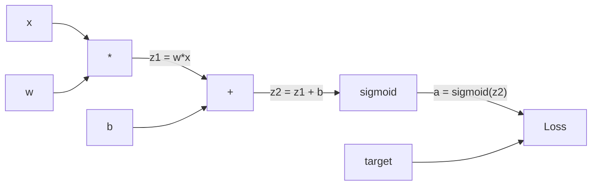
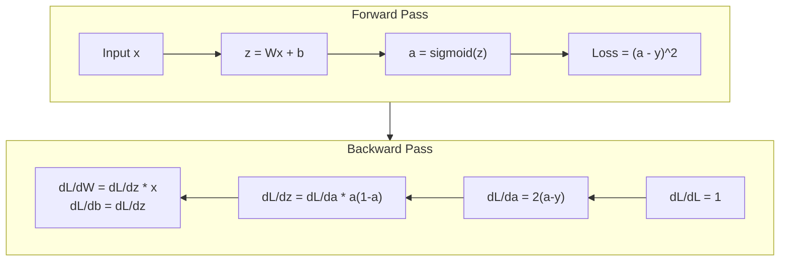
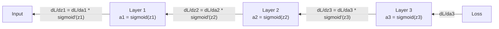

# 从零实现反向传播

> 没有它,神经网络只是昂贵的随机数生成器.

> 没有它,神经网络只是昂贵的随机数生成器.

> **【中文解读】**反向传播是让神经网络能够"学习"的核心算法.没有它,神经网络只是随机数量的组合.它的本质是使用链式法高效计算所有参数的梯度.

**Type:** Build
**Languages:** Python
**Prerequisites:** Lesson 03.02 (Multi-Layer Networks)
**Time:** ~120 minutes

## 学习目标

- 实现基于值的自行排序引擎,构建计算图表,通过拓排序计算梯度
  实现基于价值的自动微分引擎,构建计算图并通过拓排序计算梯度
- 使用链条规则来推导加,乘和sigmoid的倒退通行
  用链式法则推导加法、乘法和sigmoid的反向传播
- 通过使用您的从零开始的反扩散引擎来训练多层网络在XOR和圆形分类上
  仅用你从零构建的反向传播引擎在XOR和圆形分类上训练多层网络
- 识别深度西格莫ид网络中消失梯度问题,并解释为什么梯度呈指数缩小
  识别深度 sigmoid 网络中的梯度消失问题,解释为什么梯度会指数级缩小

> **【中文解读】**本章目标:构建类似 PyTorch 自动分分引擎,使用链式法则推导加法、乘法、sigmoid的反向传播,训练XOR 和圆形分类任务,理解梯度消失问题──

## 问题 问题引入

你的网络有一个隐藏的层,有768个输入和3072个输出. 这就是2,359,296个重量. 它做了一个错误的预测. 哪个重量导致了错误? 单独测试每个重量意味着2,300万个前进传输. 倒传计算了所有2,300万个梯度在一个倒传输中. 这不是优化. 这就是训练和不可能之间的区别.

> 你的网络有一个768个输入,3072个输出隐藏层――那就是2,359,296个权重――它做出错误预测――哪些权重导致错误?个别测试每一个权重意味着2.3亿次前向传播――反向传播在单次反向传播中计算所有2.3亿个梯度――这不是优化――这是训练可与不可能之间的区别――

简单的方法是:拿一个重量,把它推到一个小小的量,再运行前进的传输,测量损失是否上升或下降. 这给你了重量的梯度.现在为网络中的每一个重量做.乘以数千个训练步骤和数百万的数据点.你需要地质时间来训练任何有用的东西.

> 简单的方法:取一个权重,微调一下,再次运行前向传播,测量损失是上升还是下降――这样你得到了权重的梯度――现在对网络中的每一个权重都这样做――乘以数千个训练步骤和数百万个数据点――你需要质量时间才能训练任何有用的东西――

逆向传播解决了这个问题. 一个向前传递,一个向后传递,所有梯度计算. 俩是计算的链条规则,系统地应用到计算图表. 这就是使深度学习实用的算法. 没有它,我们仍然会陷入玩具问题.

> 反向传播解决了这个问题.一次向前传播,一次向反传播,所有梯度就算完成了.

> **【中文解读】**一个有2.35万权重的网络,如果个别试图计算梯度,需要2.35万次前向传播.反向传播只需要一次前向+一次反向就能计算所有梯度.

## 概念的核心概念

### 链条规则,适用于网络

简单的重复:如果y=f(g(x)),那么dy/dx=f'(g(x)) *g'(x.

> 你在第一阶段第 05 课见过链式法则。快速回顾:如果 y = f(g(x)),则 dy/dx = f'(g(x)) * g'(x)。你沿着链条将导数相乘。

在神经网络中",链"是从输入到损失的操作序列.每个层应用权重,添加偏差,通过激活.损失函数将最终输出与目标进行比较.反传播追踪了这一链向后,计算了每个操作如何导致错误.

> 在神经网络中",链"是从输入到损失的操作序列.每个层的应用权重加偏置,通过激活函数.

> **【中文解读】**链式法则:如果 y = f(g(x)),则 dy/dx = f'(g(x)) * g'(x) ・・・ 在神经网络中",链"就是从输入到损失的一系列操作――反向传播沿着这个链倒推,计算每个操作对差差的贡献――

> **【拓展：PyTorch autograd 的核心】**皮托尔奇的`loss.backward()`通过自动执行链式法则. 它在前向传播时记录计算图,然后在后向传播梯度沿线图,理解本课的手动实现,就了解了 PyTorch自动化的全部原理.

### 计算图

每个前进传输构建一个图表. 每个节点是一个操作 (乘,加, sigmoid). 每一个边缘携带一个前进值和一个向后梯度.

> 每次向前传都构建一个图. 每节点是一个操作. 每边向前传递一个值,向后传递一个梯度.



进前传:值流向左向右. x 和 w 产生z1 = w*x. 添加b 得到z2. 辛格莫ид 给出激活a. 使用损失函数对比a 目标y.

> 前向传播:从左向右流动的值──x 和 w 产生 z1 = w*x──加 b 得到 z2──Sigmoid 给出激活 a──使用损失函数将 a 与目标 y 进行比较──

往后传递:梯度流向右向左.从dL/da开始 (激活过程中损失发生变化).乘以da/dz2 (sigmoid衍生值).这就给出dL/dz2.分为dL/db (dL/dz2等于dL/dz2),因为z2 =z1 + b) 和dL/dz1.然后dL/dw =dL/dz1 * x,dL/dx =dL/dz1 * w.

> 反向传播:梯度从右向左流动──从dL/da(损失如何随激活变化) 开始──乘以da/dz2(sigmoid 导数) ──得到dL/dz2──分为dL/dz2──等于dL/dz2,因为z2 = z1 + b和dL/dz1──然后dL/dw = dL/dz1 * x,dL/dx = dL/dz1 * w──

每个节点在图表中都有一个任务:从上方来来的梯度,乘以其本地衍生值,然后传递下来.

> 图中每个节点在反向传播中只有一个任务:接收上传的梯度,乘以自己的局部导数,传递下去.

> **【中文解读】**计算图中的每个节点 (乘法加法,sigmoid) 在前向传播时传递值,在反向传播时传递梯度.

### 往前反向



前传存储每个中间值:z,a,每个层的输入.后传需要这些存储值来计算梯度.这是后传的核心的内存-计算权衡.你以速度 (一个传输而不是数百万) 换取内存 (存储激活).

> 转向传播储存的所有中间值:z、a、每层输入. 反向传播需要这些储存的值来计算梯度.

> **【中文解读】**前向传播存储所有中间值 ((z、a、每层输入),反向传播需要这些值来计算梯度──这是反向传播的核心权衡:使用内存(储存激活值) 换速度(一次反向传播替换数百万次前向传播) ⋅这也是为什么训练大模型需要大量显存──

### 通过网络的渐进流动.

对于三层网络,梯度链通过每个层:

> 对于3层网络,梯度通过每层链接传递:



在每层,梯度由西格莫因衍生品乘以.西格莫因衍生品是* (1 - a),最大值为0.25 (当 a = 0.5).

> 在每层次,梯度都乘以sigmoid的导数――sigmoid的导数是 * (1 - a),最大值为0.25(当a =0.5时) ――三层次之后,梯度最多乘以0.25^3 =0.0156──十层后:0.25^10 =0.000001──

### 渐进者消失

形的形是形的形. 形的形是形的形. 形的形是形的形. 形的形是形的形. 形的形是形的形. 形的形是形的形. 形的形是形的形. 形的形是形的形. 形的形是形的形. 形的形是形的形. 形的形是形的形. 形的形是形的形. 形的形是形的形. 形的形是形的形. 形的形是形的形. 形的形是形的形. 形的形是形的形. 形的形是形的形的形. 形的形的形是形的形的形的形.

> 这就是梯度消失问题. 形将输出压缩到0和1之间. 它的导数总是小于0.25. 形将积累到足够多的形层,梯度就会缩小到零. 前层几乎不学习,因为它们收到的梯度接近零.

```
sigmoid(z):     Output range [0, 1]              # 输出范围 [0, 1]
sigmoid'(z):    Max value 0.25 (at z = 0)        # 导数最大值 0.25（在 z = 0 时）

After 5 layers:   gradient * 0.25^5 = 0.001x original       # 5 层后梯度缩到 0.001 倍
After 10 layers:  gradient * 0.25^10 = 0.000001x original    # 10 层后梯度几乎为零
```

这就是为什么深度sigmoid网络几乎不可能训练. 修复 - - ReLU及其变体 - - 是第04课题.

> 这就是为什么深度西格莫伊德网络几乎不可能训练.解决方案.

> **【中文解读】**梯度消失:sigmoid的导数最大只有0.25,每经过一个层梯度就乘以最多0.25──5层后只剩下0.001.10层后只剩下百万分之一──前几层几乎不到梯度,所以无法学习──这就是为什么现代网络使用RLU(导数恒为1) 替代sigmoid──

> **【拓展：Transformer 中的梯度流】**转变器 用残差连接 (残留连接) 解决消失的问题:`output = x + sublayer(x)`△这样的梯度可以直接传播,使GPT-3的96层也能训练.

### 推导两个层网络的梯度

具体计算一个网络的输入 x,隐藏层与 sigmoid,输出层与 sigmoid,和 MSE 损失.

> 具体推导一个具有输入 x、sigmoid 隐藏层、sigmoid 输出层和MSE 损失的网络──

进步通行:
```
z1 = W1 * x + b1          # 隐藏层线性变换
a1 = sigmoid(z1)           # 隐藏层激活
z2 = W2 * a1 + b2          # 输出层线性变换
a2 = sigmoid(z2)           # 输出层激活
L = (a2 - y)^2             # MSE 损失
```

后行 (应用链条节点一步一步):
```
dL/da2 = 2(a2 - y)                              # 损失对输出的梯度
da2/dz2 = a2 * (1 - a2)                         # sigmoid 导数
dL/dz2 = dL/da2 * da2/dz2 = 2(a2 - y) * a2 * (1 - a2)  # 链式法则

dL/dW2 = dL/dz2 * a1                            # 输出层权重梯度
dL/db2 = dL/dz2                                  # 输出层偏置梯度

dL/da1 = dL/dz2 * W2                             # 梯度传播到隐藏层
da1/dz1 = a1 * (1 - a1)                          # sigmoid 导数
dL/dz1 = dL/da1 * da1/dz1                        # 链式法则

dL/dW1 = dL/dz1 * x                              # 隐藏层权重梯度
dL/db1 = dL/dz1                                   # 隐藏层偏置梯度
```

每个梯度都是从损失中追溯到本地衍生品的产物.

> 每个梯度都是从损失回归的局部导数的乘法.

> **【中文解读】**两层网络的梯度推导:从损失函数开始,使用链式法则一步往回算.

## 动手构建
```figure
backprop-vanishing
```

## 建立它

### 步骤1: 值节点

我们计算中的每一个数字都会变成一个值. 它存储其数据,其梯度,以及它是如何创建的 (所以它知道如何计算梯度向后).

> 我们计算中的每个数字都变成一个值. 它存储数据,梯度以及它是如何创建的.

```python
class Value:
    def __init__(self, data, children=(), op=''):
        self.data = data                          # 这个节点的数值
        self.grad = 0.0                           # 损失对这个值的梯度（初始为 0）
        self._backward = lambda: None             # 反向传播函数（初始为空操作）
        self._children = set(children)            # 产生这个值的子节点（用于拓扑排序）
        self._op = op                             # 产生这个值的操作（用于调试可视化）
```

没有向后函数 (没有操作).`_children`现在我们可以在图表上进行排序.

> 还没有梯度 ((0.0) ・ 还没有反向函数 ((空操作) ⋅`_children`随着什么值 产生这个值,以便我们稍后进行扩展排序.

### 操作带反向传播操作

每个操作都会创造一个新的值,并定义梯度如何通过它向后流动.

> 每个操作都会创建一个新的值并定义如何通过它反向流动的梯度.

```python
def __add__(self, other):
    other = other if isinstance(other, Value) else Value(other)
    out = Value(self.data + other.data, (self, other), '+')

    def _backward():
        self.grad += out.grad        # 加法的梯度：d(a+b)/da = 1，直接传递
        other.grad += out.grad       # d(a+b)/db = 1，直接传递

    out._backward = _backward
    return out

def __mul__(self, other):
    other = other if isinstance(other, Value) else Value(other)
    out = Value(self.data * other.data, (self, other), '*')

    def _backward():
        self.grad += other.data * out.grad   # 乘法的梯度：d(a*b)/da = b
        other.grad += self.data * out.grad   # d(a*b)/db = a

    out._backward = _backward
    return out
```

为了加起来:d(a+b)/da = 1,d(a+b)/db = 1. 所以两个输入直接得到输出梯度.

> 加法:d                                                                                                                                                                                                                                                             

对于乘法:d(a*b)/da = b,d(a*b)/db = a. 每个输入都得到了另一个值乘以输出梯度.

> 乘法:d(a*b)/da = b,d(a*b)/db = a。每个输入获得另一个的值乘以输出梯度。

其他`+=`值可以用于多个操作.它的梯度是所有路径的梯度的总和.

> `+=`是关键的. 一个值可能在多个操作中使用.

> **【中文解读】**乘法梯度乘以另一个操作数`+=`而不是`=`由于一个值可以被多种操作使用,梯度需要从所有路径中加起来.

### 步骤3:sigmoid和损失

```python
import math

def sigmoid(self):
    x = self.data
    x = max(-500, min(500, x))    # 裁剪防止溢出
    s = 1.0 / (1.0 + math.exp(-x))  # 前向：计算 sigmoid
    out = Value(s, (self,), 'sigmoid')

    def _backward():
        self.grad += (s * (1 - s)) * out.grad  # 反向：sigmoid 导数 = σ(x) * (1 - σ(x))

    out._backward = _backward
    return out
```

引号导数:sigmoid(x) * (1 -sigmoid(x)). 我们在前进传递过程中计算了sigmoid(x) = s. 再利用它.没有额外的工作.

> 引号导数:引号(x) * (1 - 引号(x))。我们在前向传播中已经计算了引号(x) = s──复用它,不需要额外工作──

```python
def mse_loss(predicted, target):
    diff = predicted + Value(-target)  # predicted - target
    return diff * diff                  # (predicted - target)^2
```

单个输出的MSE: (预测 - 目标) ^2.我们表达减值为加值,负值.

> 单输出MSE:预测 - 目标) ^2。我们将减法表示为加上取反的价值──

### 步骤4:向后传递

拓类型确保我们按正确的顺序处理节点, 节点的梯度在我们通过它传播之前完全积累.

> 拓排序确保我们按正确的顺序处理节点一个节点的梯度在通过它传播之前已经完全累积了.

```python
def backward(self):
    topo = []                         # 拓扑排序结果
    visited = set()

    def build_topo(v):
        if v not in visited:
            visited.add(v)
            for child in v._children:    # 先访问所有子节点
                build_topo(child)
            topo.append(v)               # 子节点都访问完后，再把自己加入列表

    build_topo(self)
    self.grad = 1.0                     # 损失对自己的梯度 = 1（dL/dL = 1）
    for v in reversed(topo):            # 逆序遍历（从输出到输入）
        v._backward()                   # 每个节点执行自己的反向传播函数
```

开始在损失 (渐进值=1.0,因为dL/dL=1). 通过排序图表向后行走.`_backward`让孩子们的态度变得更低.

> 从损失开始 (梯度 = 1.0,因为dL/dL = 1)──逆序遍历排序后的计算图──每个节点的`_backward`将梯度推送给它的子节点.

> **【中文解读】**拓排序保证:一个节点的梯度完全累加后,才往其子节点传播――从损失 (梯度=1) 开始,逆序遍历计算图,每个节点将梯度传递给产生它的子节点――这就是 PyTorch.`loss.backward()`它们是最重要的.

### 五步:层和网络层和网络

```python
import random

class Neuron:
    def __init__(self, n_inputs):
        scale = (2.0 / n_inputs) ** 0.5   # He 初始化缩放因子，防止 sigmoid 饱和
        self.weights = [Value(random.uniform(-scale, scale)) for _ in range(n_inputs)]
        self.bias = Value(0.0)

    def __call__(self, x):
        act = sum((wi * xi for wi, xi in zip(self.weights, x)), self.bias)  # 加权求和 + 偏置
        return act.sigmoid()  # sigmoid 激活

    def parameters(self):
        return self.weights + [self.bias]   # 返回所有可训练参数


class Layer:
    def __init__(self, n_inputs, n_outputs):
        self.neurons = [Neuron(n_inputs) for _ in range(n_outputs)]

    def __call__(self, x):
        out = [n(x) for n in self.neurons]
        return out[0] if len(out) == 1 else out  # 单神经元时直接返回值

    def parameters(self):
        params = []
        for n in self.neurons:
            params.extend(n.parameters())
        return params


class Network:
    def __init__(self, sizes):
        self.layers = []
        for i in range(len(sizes) - 1):
            self.layers.append(Layer(sizes[i], sizes[i + 1]))  # 按尺寸列表构建层

    def __call__(self, x):
        for layer in self.layers:
            x = layer(x)                    # 逐层前向传播
            if not isinstance(x, list):
                x = [x]
        return x[0] if len(x) == 1 else x

    def parameters(self):
        params = []
        for layer in self.layers:
            params.extend(layer.parameters())
        return params

    def zero_grad(self):
        for p in self.parameters():
            p.grad = 0.0    # 清零所有梯度（每次反向传播前必须调用）
```

神经元采集输入,计算重量的总数 +偏差,并应用sigmoid.重量初始化尺度由 sqrt(2/n_input) 防止深层网络中的sigmoid和.一个层是神经元的列表.一个网络是层的列表.`parameters()`方法收集所有可学习的值,以便我们更新它们.

> 神经元 接收输入,计算加权和加偏置,然后应用 sigmoid──权重初始化按平方//n_input) 缩小以防止更深层网络中的 sigmoid 和──层是神经元的列表──网络是层的列表──`parameters()`方法收集所有可学习的价值以便更新.

> **【中文解读】**神经元 = 一组神经元,网络 = 一组层.`parameters()`收集所有可训练参数,`zero_grad()`清零梯度 (每轮训练前必须调用)`model.parameters()`和 `optimizer.zero_grad()`它们的原型.

### 步骤 6: 训练在XOR上训练XOR

```python
random.seed(42)
net = Network([2, 4, 1])  # 2 输入 → 4 隐藏神经元 → 1 输出

xor_data = [
    ([0.0, 0.0], 0.0),
    ([0.0, 1.0], 1.0),
    ([1.0, 0.0], 1.0),
    ([1.0, 1.0], 0.0),
]

learning_rate = 1.0

for epoch in range(1000):
    total_loss = Value(0.0)
    for inputs, target in xor_data:
        x = [Value(i) for i in inputs]
        pred = net(x)                          # 前向传播
        loss = mse_loss(pred, target)          # 计算损失
        total_loss = total_loss + loss         # 累积损失

    net.zero_grad()           # 清零梯度
    total_loss.backward()     # 反向传播：计算所有参数的梯度

    for p in net.parameters():
        p.data -= learning_rate * p.grad      # 梯度下降更新权重

    if epoch % 100 == 0:
        print(f"Epoch {epoch:4d} | Loss: {total_loss.data:.6f}")

print("\nXOR Results:")
for inputs, target in xor_data:
    x = [Value(i) for i in inputs]
    pred = net(x)
    print(f"  {inputs} -> {pred.data:.4f} (expected {target})")
```

从随机预测到纠正XOR输出,完全由后延伸计算梯度和推重在正确的方向驱动.

> 观察损失下降――从随机预测到正确的XOR输出,完全由反向传播计算梯度并将重量推向正确方向来驱动――

> **【中文解读】**训练循环:前向传播 → 计算损失 → 反向传播 → 更新权重――这四步就是所有深度学习训练的核心――从高到低的损失,预测从随机到正确,全部靠反向传播计算梯度来驱动――

### 圆形分类

在第02课中,你手动调节了重量来进行圆形分类.

> 在第2课中,你手动调整了圆形分类权重.

```python
random.seed(7)

def generate_circle_data(n=100):
    data = []
    for _ in range(n):
        x1 = random.uniform(-1.5, 1.5)
        x2 = random.uniform(-1.5, 1.5)
        label = 1.0 if x1 * x1 + x2 * x2 < 1.0 else 0.0   # 距原点 < 1 则为"内部"
        data.append(([x1, x2], label))
    return data

circle_data = generate_circle_data(80)

circle_net = Network([2, 8, 1])  # 2-8-1 网络
learning_rate = 0.5

for epoch in range(2000):
    random.shuffle(circle_data)       # 打乱数据顺序
    total_loss_val = 0.0
    for inputs, target in circle_data:
        x = [Value(i) for i in inputs]
        pred = circle_net(x)
        loss = mse_loss(pred, target)
        circle_net.zero_grad()         # 清零梯度
        loss.backward()                # 反向传播
        for p in circle_net.parameters():
            p.data -= learning_rate * p.grad  # 更新权重
        total_loss_val += loss.data

    if epoch % 200 == 0:
        correct = 0
        for inputs, target in circle_data:
            x = [Value(i) for i in inputs]
            pred = circle_net(x)
            predicted_class = 1.0 if pred.data > 0.5 else 0.0
            if predicted_class == target:
                correct += 1
        accuracy = correct / len(circle_data) * 100
        print(f"Epoch {epoch:4d} | Loss: {total_loss_val:.4f} | Accuracy: {accuracy:.1f}%")
```

我们使用在线SGD在这里 - 每个样本之后更新重量,而不是积累全批. 这更快地打破对称,避免了全损失景观上的sigmoid和.每一个时代混动数据,防止网络记忆顺序.

> 在线使用SGD在每个样本后更新权重,而不是累积整个批次.

网络可以自行发现圆形决策边界.这是反扩散的力量:你定义了架构,损失函数和数据.算法计算了重量.

> 无需手动调权重.网络自学绘制圆形决策边界. 这就是反向传播的力量:你定义了架构,损失函数和数据,算法自己找出正确的权重.

> **【中文解读】**这里使用在线 SGD (逐样更新) 而不是批量更新. 打乱数据防止网络记住顺序. 无需手动调权重.

## 实际应用.

皮托尔奇在上面的所有内容都用几行来完成.核心想法是一样的 - - 自动基数在前进的过程中构建一个计算图表,然后追踪它向后计算梯度.

> 皮托尔奇使用几行代码完成了上面的所有功能.

```python
import torch
import torch.nn as nn

model = nn.Sequential(
    nn.Linear(2, 4),       # 对应我们的 Layer(2, 4)
    nn.Sigmoid(),           # 对应 sigmoid 激活
    nn.Linear(4, 1),       # 对应我们的 Layer(4, 1)
    nn.Sigmoid(),
)
optimizer = torch.optim.SGD(model.parameters(), lr=1.0)  # 对应我们的手动梯度下降
criterion = nn.MSELoss()  # 对应我们的 mse_loss

X = torch.tensor([[0,0],[0,1],[1,0],[1,1]], dtype=torch.float32)
y = torch.tensor([[0],[1],[1],[0]], dtype=torch.float32)

for epoch in range(1000):
    pred = model(X)                  # 前向传播
    loss = criterion(pred, y)        # 计算损失
    optimizer.zero_grad()            # 清零梯度（对应 net.zero_grad()）
    loss.backward()                  # 反向传播（对应 total_loss.backward()）
    optimizer.step()                 # 更新权重（对应 p.data -= lr * p.grad）

print("PyTorch XOR Results:")
with torch.no_grad():                # 推理模式，不计算梯度
    for i in range(4):
        pred = model(X[i])
        print(f"  {X[i].tolist()} -> {pred.item():.4f} (expected {y[i].item()})")
```

`loss.backward()`是你的`total_loss.backward()`现在,我们要去.`optimizer.step()`是你的手册吗?`p.data -= lr * p.grad`现在,我们要去.`optimizer.zero_grad()`是你的`net.zero_grad()`鱼处理GPU加速,混合精度,梯度检查,以及数百种层类型.但向后传递是同一链条规则适用于同一计算图.

> `loss.backward()`这是你的.`total_loss.backward()`,我知道.`optimizer.step()`这就是你的手动.`p.data -= lr * p.grad`,我知道.`optimizer.zero_grad()`这是你的.`net.zero_grad()`△同样的算法,工业级实现──PyTorch 处理GPU 加速、混合精度、梯度检查点和数百种层类型──但反向传播是将相同的链式法则应用于相同的计算图──

训练运行前进,然后倒退,然后更新体重. 推理只运行前进的传输. 没有梯度,没有更新. 这种区别是重要的,因为推断是生产过程中发生的事情. 当你打电话给一个像Cloed或GPT这样的API时,你会推断--你的提示通过网络流向前, 没有变量. 了解背后支架是重要的,因为它塑造了网络中的每一个重量.

> 训练运行前向传播,然后反向传播,然后更新权重――推理只运行前向传播――没有梯度,没有更新――这个区别很重要,因为推理是生产环境中发生的事情――当你调用克劳德或GPT等API时,你运行的是推理你的提示词前向流过网络,代码从另一端输出――权重不变――理解反向传播很重要,因为它塑造了网络中的每一个权重――

> **【中文解读】**皮托尔奇的`loss.backward()`我们写的`backward()`没有任何`optimizer.step()`我们写的`p.data -= lr * p.grad`△训练时做前向+反向+更新,推理时只做前向──当你调用GPT/Claude API时,就是推理你的提示词前向过网络,输出代币,权重不变──理解反向传播很重要,因为它塑造了模型中的每一个权重──

## 运输货物

这一课产生了:
- `outputs/prompt-gradient-debugger.md`-- 任何神经网络中可重复使用的提示来诊断梯度问题 (消失,爆炸,NaN)

> 本课产出:`outputs/prompt-gradient-debugger.md`任何神经网络中梯度问题 (消失,爆炸,NaN) 的提示词

## 练习题

1. 添加一个`__sub__`运行一个                                `__neg__`通过将 (a - b) ^2等简单表达式与手动计算进行比较来验证梯度是否正确.
   > **练习 1：**给值类加减法和取负操作――使用手动计算验证 (a - b) ^ 2 的梯度是否正确――

2. 添加一个`relu`换取隐藏层中的雷,再在XOR上训练.比较缩速度.你应该看到更快的训练--这预览课04
   > **练习 2：**给值 添加 ReLU 方法──用 ReLU 替换隐藏层的标识,训练 XOR 并对比收速度──ReLU 应该更快这是下一课的预览──

3. 实施一个`__pow__`通过使用它来替换`mse_loss`具有适当的`(predicted - target) ** 2`检查梯度与原始实现一致.
   > **练习 3：**给值加运算方法,使用它重写MSE 损失――验证梯度与原始实现一致――

4. 加入梯剪切到训练循环: 调用后`backward()`通过缩,将所有梯度切断到 [-1, 1]. 训练更深的网络 (使用sigmoid) 进行4+层,并比较与没有切割的损失曲线.这是你第一次防范爆炸的梯度.
   > **练习 4：**在训练循环中加梯度剪裁 (剪裁到 [-1, 1]) ――训练4+层的形网络,对比有/无剪切的损失曲线――

5. 建立一个视觉化:在XOR训练后,打印网络中的每个参数的梯度.确定哪个层具有最小梯度. 这表明了您在概念部分读到的消失梯度问题.
   > **练习 5：**训练XOR 后,打印每个参数的梯度――找出哪个层梯度最小,直观感受梯度消失问题――

## 关键词 关键词

| Term | What people say | What it actually means |
|------|----------------|----------------------|
| Backpropagation | "The network learns" | An algorithm that computes dL/dw for every weight by applying the chain rule backward through the computational graph |
| Computational graph | "The network structure" | A directed acyclic graph where nodes are operations and edges carry values (forward) and gradients (backward) |
| Chain rule | "Multiply the derivatives" | If y = f(g(x)), then dy/dx = f'(g(x)) * g'(x) -- the mathematical foundation of backpropagation |
| Gradient | "The direction of steepest ascent" | The partial derivative of the loss with respect to a parameter -- tells you how to change that parameter to reduce the loss |
| Vanishing gradient | "Deep networks don't learn" | Gradients shrink exponentially as they propagate through layers with saturating activations like sigmoid |
| Forward pass | "Running the network" | Computing the output from inputs by sequentially applying each layer's operations and storing intermediate values |
| Backward pass | "Computing gradients" | Traversing the computational graph in reverse, accumulating gradients at each node using the chain rule |
| Learning rate | "How fast it learns" | A scalar that controls the step size when updating weights: w_new = w_old - lr * gradient |
| Topological sort | "The right order" | An ordering of graph nodes where each node appears after all nodes it depends on -- ensures gradients are fully accumulated before propagation |
| Autograd | "Automatic differentiation" | A system that builds computational graphs during forward computation and automatically computes gradients -- what PyTorch's engine does |

| 术语 | 通俗说法 | 实际含义 |
|------|---------|---------|
| 反向传播 (Backpropagation) | "网络在学习" | 用链式法则沿计算图反向计算每个权重的 dL/dw 的算法 |
| 计算图 (Computational graph) | "网络结构" | 有向无环图，节点是操作，边传递值（前向）和梯度（反向） |
| 链式法则 (Chain rule) | "把导数乘起来" | y = f(g(x)) → dy/dx = f'(g(x)) * g'(x)——反向传播的数学基础 |
| 梯度 (Gradient) | "最陡上升方向" | 损失对参数的偏导数——告诉你怎么改参数能降低损失 |
| 梯度消失 (Vanishing gradient) | "深层网络学不动" | 梯度经过饱和激活函数（如 sigmoid）逐层指数级缩小 |
| 前向传播 (Forward pass) | "跑网络" | 从输入逐层计算输出，存储中间值 |
| 反向传播过程 (Backward pass) | "算梯度" | 逆序遍历计算图，用链式法则逐节点累加梯度 |
| 学习率 (Learning rate) | "学多快" | 控制权重更新步长的标量：w_new = w_old - lr * gradient |
| 拓扑排序 (Topological sort) | "正确的顺序" | 保证每个节点的梯度完全累加后再往下传播的节点排列 |
| 自动微分 (Autograd) | "自动求导" | 前向时构建计算图，自动计算梯度的系统——PyTorch 引擎的核心 |

## 继续阅读 继续阅读

- 鲁姆尔哈特,希顿和威廉姆斯,"通过反向传播错误学习表示" (1986) - - 论文使反向传播成为主流和解锁的多层网络培训
  通过反向传播误差学习表示(1986) 让反向传播成为主流并解锁多层网络训练论文
- 蓝色1棕色,神经网络系列 (https://www.youtube.com/playlist?list=PLZHQObOWTQDNU6R1_67000Dx_ZCJB-3pi) -- 网络中回传和梯度流量的最佳视觉解释
  3蓝1棕色,神经网络 系列 关于反向传播和网络流动梯度的最佳可视化解释
