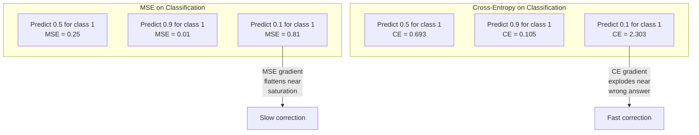
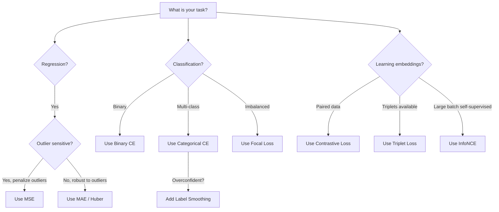

# 失败函数

> 网络做出了预测. 基本的真相说相反. 错误多大? 这个数字是损失. 选择错误的损失函数,你的模型完全优化了错误的东西.

> **【中文解读】**损失函数是模型唯一优化的目标,不是准确率,不是F1 分数,就是损失值. 选择错失函数,模型会找到"数学上最省略的事情"的方式来满足它,而不是你真正想要的结果. 例如,分类任务使用MSE,模型会预测所有样本为0.5 ((最小损失但没有用处) ⋅

**Type:** Build
**Languages:** Python
**Prerequisites:** Lesson 03.04 (Activation Functions)
**Time:** ~75 minutes

## 学习目标

- 从零开始实施MSE,二进制交叉,分类交叉和对比损失 (InfoNCE)
- 解释为什么MSE未能进行分类,通过显示"预测0.5对所有"失败模式
- 涂抹标签滑滑度对跨体,并描述它如何防止过度自信的预测
- 选择回归,二进制分类,多类分类,并嵌入学习任务的正确损失函数

> **【中文解读】**本章目标:实现5种损失函数及梯度,理解为什么分类任务不能使用MSE,学习标签平滑和相对损失,学会根据任务选择正确的损失函数.

## 问题 问题引入

通过减少MSE的模型,我们可以预测0.5的损失.

> 一个在分类问题上最小化MSE的模型会对所有输入预测感到自信0.5――它在最小化损失中.

损失函数是你模型真正优化的唯一东西. 没有准确性. 没有F1的成绩. 不是你向你的经理报告的任何标准. 优化器取损失函数的梯度,调整权重,使该数量变得更小. 如果损失函数不捕捉到你关心的东西,模型会找到最便宜的数学方法来满足它,

> 损失函数是你模型实际优化的唯一目标――不是准确率――不是F1 分数――不是你向经理报告的任何指标――优化器获取损失函数的梯度并调整权重使这个数字更小――如果损失函数没有捕捉到你关心的东西,模型会找到最便宜的数学方法来满足它,而这种方式几乎永远不是你想要的――

这是一个具体的例子. 你有双重分类任务. 两个课程,50/50分. 你用MSE作为你的损失. 模型预测每次输入为0.5. 平均MSE为0.25,这是最少的可能, 这种模型没有任何歧视性,但它技术上将你的损失功能降至最低. 转向交叉缩,同样的模型被迫推向0或1,因为 -log(0.5) =0.693是一个可怕的损失,而 -log(0.99) =0.01 奖励自信正确的预测. 损失函数的选择是学习模型和测量模型之间的区别.

> 具体例:二元分类任务,两类各占50%──你使用MSE作为损失──模型对每个输入都预测0.5──平均MSE为0.25,这是实际上没有学到任何东西的情况下可能的最小值──模型没有任何区分能力,但在技术上已经最小化了你的损失函数──换成交叉之后,同样的模型被迫推向0或1,因为 -log(0.5) =0.693是一个非常差的损失,而 -log(0.99) =0.01 会奖励自信的正确预测──损失函数的选择决定了模型学习还在系统的空中.

变得更糟.在自我监督学习中,你甚至没有标签.对比性损失完全定义了学习信号:什么值得相似,什么值得不同,以及模型应该如何将它们推离开.

> 情况更糟糕的是,在自监督学习中,你甚至没有标签――对比损失完全定义了学习信号:什么算相似,什么算不同,模型应该以多大力将它们分开――搞错对比损失,你的嵌入会缩小到一个点每个输入映射到同一个向量――技术上的损失为零――但完全无用――

> **【中文解读】**通过 -log (log) 交叉则通过 -log (log)  (log)  (log)  (log)  (log)  (log)  (log)  (log)  (log)  (log)  (log)  (log)  (log)  (log)  (log)  (log)  (log)  (log)  (log)  (log)  (log)  (log)  (log)  (log)  (log)  (log)  (log)  (log)  (log)  (log)  (log)  (log)  (log)  (log)  (log)  (log)  (log)  (log) )  (log)  (log)  (log)  (log)  (log)  (log)  (log)  (log)  (log)  (log)  (log)  (log)  (log)  (log)  (log)  (log)  (log)  (log) )  (log)  (log)  (log)  (log)  (log)  (log)  (log)  (log)  (log)  (log)  (log) ) (log) (log) (log) (log) (log) (log) (log) ) (log) (log) (log) (log) (log) (log) (log) (log) (log) (log) (log) (log) (log) (log) (log) (log) (log) (log) (log) (log) (log) (log) (log) (log) (log) (log) (log) (log) (log) (log) (log) (log) (log) (log) (log) (log) (log) (log) (log) (log) (log) (log) (log)

## 概念的核心概念

### 平均方数误差 (MSE)

预测和目标之间的二次差异,平均所有样本.

> 回归任务的默认选择――计算预测值与目标值的平方差,对所有样本取平均――

```
MSE = (1/n) * sum((y_pred - y_true)^2)
```

为什么正方位是重要的:它将大错误处罚成四次. 2 的错误的成本是 4 倍 1. 10 的错误是 100 倍. 这使得MSE 对异常值敏感 - 一个非常错误的预测占据了损失.

> 为什么平方很重要:它对大错误进行第二次惩罚. 2 个错误的价格是 1 个错误的 4 倍. 10 个错误的价格是 100 倍.

实际数字:如果您的模型预测住房价格,并且在$10,000 on most houses but off by $作为一个豪宅的200万,MSE将积极尝试修复那个豪宅,

> 具体数字:如果你的模型预测房价,大多数房屋偏差$10,000，但一栋豪宅偏差 $其他99个房屋的性能可能会受到损害.

对于预测的MSE梯度是:

> 预测的梯度为:

```
dMSE/dy_pred = (2/n) * (y_pred - y_true)      # 梯度与误差成线性关系
```

错误的线性.更大的错误会变得更大的梯度.这是回归的特征 (大错误需要大修正) 和分类的错误 (你想以指数而不是线性地惩罚自信错误的答案).

> 与差异成线性关系――更大的错误获得更大的梯度――这对归归是优点,但对分类是缺点,但你想对自信的错误答案进行指数级惩罚,而不是线性惩罚)

> **【中文解读】** MSE 是归归任务的默认损失:误差的平方平均――平方让大误差付出更高的代价――10的误差的惩罚是1的100倍),但也让它对异常值敏感――梯度与误差成线性关系对归归是好事――大误差需要大修正),对分类是坏事――应对"自信的错误"指数级惩罚.

> **【拓展：MSE 在 AI 中的应用】**在图像生成模型中,MSE也用于测量图像生成和目标图像的像素差异.`F.mse_loss(pred, target)`,我知道.

### 交叉损失

根据信息理论,它测量了预测概率分布和真实分布之间的差异.

> 分类任务的损失函数. 基于信息论,它衡量预测概率分布与实际分布之间的差异.

**Binary Cross-Entropy (BCE) | 二元交叉熵：**

```
BCE = -(y * log(p) + (1 - y) * log(1 - p))
```

在此,y是真实标签 (0或1) 和p是预测概率.

> 其中 y 是真实标签 ((0 或 1),p 是预测概率──

为什么 -log(p) 效果:当真实标签为1并且你预测p =0.99,损失是 -log(0.99) =0.01.当你预测p =0.01,损失是 -log(0.01) =4.6.这460x差异是为什么交叉能效果.它残酷地惩罚自信错误的预测,同时几乎惩罚自信正确的预测.

> 为什么 -log(p) 有效:当真实标签为 1 且你预测 p = 0.99 时,损失为 -log(0.99) = 0.01。当你预测 p = 0.01 时,损失为 -log(0.01) = 4.6。那460 倍的差距就是交叉有效的原因──它残酷地惩罚自信的错误预测,而对自信的正确预测几乎没有惩罚──

梯度讲述了同样的故事:

```
dBCE/dp = -(y/p) + (1-y)/(1-p)     # 梯度在预测错误时极大
```

当 y = 1 和 p 接近零时,梯度是 -1/p,接近负无限.模型得到了一个巨大的信号来纠正错误.当 p 接近 1,梯度是小的.已经正确,没有什么可以纠正.

> **【中文解读】**交叉是分类任务的标志──核心是 -log(p):预测正确且自信(p=0.99) 当损失只有0.01,预测错误且自信(p=0.01) 当损失高达4.6460倍的差距!

> **【拓展：交叉熵在 Transformer 中】**预测和真实的差距. 托奇: 预测和真实的差距.`F.cross_entropy(logits, labels)`,我知道.

**Categorical Cross-Entropy | 多类交叉熵：**

对于多类分类,具有单个加密目标.

```
CCE = -sum(y_i * log(p_i))          # 只有真实类别贡献损失
```

如果有10个类,正确的类得到0.1的概率 (随机猜测),则损失为 -log(0.1) = 2.3. 如果正确的类得到0.9的概率,则损失为 -log(0.9) = 0.105.模型学会集中概率质量在正确的答案.

### 为什么MSE不符合分类



由于sigmoid和度,MSE梯度平坦化 (由于sigmoid和度). 交叉缩梯度补偿了这一点 - - 记录取消了sigmoid的平坦区域,给出强大的梯度,正是最需要的地方.

> **【中文解读】**由于sigmoid 和),导致修改缓慢――交叉的 -log 正好抵消sigmoid 的平坦区域,在最需要修改的地方提供最强的梯度――

### 标签: 滑滑

标准的单热标签说:"这是100%的3级,其他一切都是0%".这是一个强有力的说法.

> 标准的热门标签说"这是100%的类别3,其他都是0%"......这是个强声明.

```
smooth_label = (1 - alpha) * one_hot + alpha / num_classes
```

对于阿尔法=0.1和10类:而不是 [0, 0, 1, 0, ...],目标变成 [0.01, 0.01, 0.91, 0.01, ...].模型目标是0.91而不是1.0.

> 目标从 [0, 0, 1, 0, ...] 变成 [0.01, 0.01, 0.91, 0.01, ...]──模型目标从 1.0 变成 0.91──

为什么这有所效果:试图通过软max出口精确的模型需要将logits推到无限.这导致过度自信,损害了通用化,并使模型变得脆弱的分布转移.标签滑板将目标限制在0.9 (含alpha=0.1),保持logits在合理的范围内.GPT和大多数现代模型使用标签滑板或其相当.

> 为什么有效:要让软max 输出恰好1.0,需要把逻辑推到无穷大――这导致过度自信,损害泛化,使模型对分布漂移的脆弱――标签平滑把目标上限设为0.9 ((alpha=0.1),让逻辑保持在合理的范围内――GPT 和大多数现代模型都使用标签平滑或等价机制――

> **【中文解读】**标签平滑把硬标签 [0, 0, 1, 0, ...] 变成软标签 [0.01, 0.01, 0.91, 0.01,...]──因为要让软max 输出 1.0 需要逻辑 趋近无穷大,这会导致过于适合和过度自信──标签平滑把目标上限降至0.9,保持逻辑在合理范围内──GPT 和大多数现代模型都使用标签平滑──

### 对于损失的比较

没有标签,没有类,只是输入的对,问题是:它们相似还是不同的?

> 没有标签.没有类型. 只有输入对和这个问题:它们相似还是不同?

**SimCLR-style contrastive loss (NT-Xent / InfoNCE):**

像是一个图像. 创建两个增长的视图 (剪切,旋转,色彩). 这些是"正对" - - 他们应该有相似的嵌入. 批量中的每一个图像都形成"负对" - 他们应该有不同的嵌入.

> 取一张图像. 创建两个增强视图. 剪切,旋转,颜色动.

```
L = -log(exp(sim(z_i, z_j) / tau) / sum(exp(sim(z_i, z_k) / tau)))
```

在 sim() 是相似的, z_i 和 z_j 是正对,总数是所有负数,tau (温度) 控制分布的度.低温 = 硬的负数 = 更加激进的分离.

> **【中文解读】**对于损失不需要标签!取一张图片的两个增强版本作为"正对" (正对) 应该相似),其他图片作为"负对" (正对) 应该不同 (损失 = -log) ◊正对相似度 / 所有可能对相似度和) ◊温度 tau 越低,区分越严格――

> **【拓展：对比学习在 RAG 和嵌入模型中】**在RAG中,检查器的好坏取决于嵌入质量,而嵌入质量取决于对比损失的设计.

### 焦点损失

对于不平衡的数据集.标准的交叉缩对待所有正确分类的例子均等.焦点损失减重简单的例子:

> 为不平衡数据集设计.标准交叉. 平等对待所有正确分类样本.

```
FL = -alpha * (1 - p_t)^gamma * log(p_t)
```

在p_t是真类的预测概率,而gamma控制着聚焦.在gamma=0时,这是标准的交叉.在gamma=2时 (默认):

> 其中p_t 是真实类别的预测概率,gamma 控制聚焦程度──gamma = 0 时退化为标准交叉──gamma = 2 时(默认值):

- 简单的例子 (p_t = 0.9):重量 = (0.1) ^ 2 = 0.01.
  简单样本(p_t = 0.9):权重 = (0.1) ^2 = 0.01──实际被忽略──
- 硬实例 (p_t = 0.1):重量 = (0.9) ^2 = 0.81. 完全梯度信号.
  困难样本(p_t = 0.1):权重 = (0.9) ^2 = 0.81──完整梯度信号──

> **【中文解读】**焦点损失为类别不平衡设计──简单样本(p_t=0.9) 的重量只有0.01,几乎被忽略;困难样本(p_t=0.1) 的重量是0.81,获得完整梯度信号──这让模型专注于困难案例──用于目标检测(RetinaNet),99% 是背景、1% 是目标──

### 损失函数选择决策树



> **【中文解读】**选择经验:回归用MSE/Huber,二分类用 BCE,也许用 CCE,不平衡用焦损失,学嵌入用对比损失.

## 动手构建
```figure
cross-entropy-loss
```

## 建立它

### 步骤1:MSE及其分数.

```python
def mse(predictions, targets):
    n = len(predictions)
    total = 0.0
    for p, t in zip(predictions, targets):
        total += (p - t) ** 2            # 平方误差
    return total / n                      # 取平均

def mse_gradient(predictions, targets):
    n = len(predictions)
    grads = []
    for p, t in zip(predictions, targets):
        grads.append(2.0 * (p - t) / n)  # 梯度 = 2*(pred - true) / n
    return grads
```

### 双元交叉

如果模型预测正确的例子为0, log(0) =负无限. 剪切阻止这一点.

```python
import math

def binary_cross_entropy(predictions, targets, eps=1e-15):
    n = len(predictions)
    total = 0.0
    for p, t in zip(predictions, targets):
        p_clipped = max(eps, min(1 - eps, p))  # 裁剪防止 log(0)
        total += -(t * math.log(p_clipped) + (1 - t) * math.log(1 - p_clipped))  # -[y*log(p) + (1-y)*log(1-p)]
    return total / n

def bce_gradient(predictions, targets, eps=1e-15):
    grads = []
    for p, t in zip(predictions, targets):
        p_clipped = max(eps, min(1 - eps, p))
        grads.append(-(t / p_clipped) + (1 - t) / (1 - p_clipped))  # 梯度 = -y/p + (1-y)/(1-p)
    return grads
```

### 带软max的多类交叉

```python
def softmax(logits):
    max_val = max(logits)  # 数值稳定性
    exps = [math.exp(x - max_val) for x in logits]
    total = sum(exps)
    return [e / total for e in exps]

def categorical_cross_entropy(logits, target_index, eps=1e-15):
    probs = softmax(logits)
    p = max(eps, probs[target_index])
    return -math.log(p)  # -log(真实类别的概率)

def cce_gradient(logits, target_index):
    probs = softmax(logits)
    grads = list(probs)              # 复制 softmax 输出
    grads[target_index] -= 1.0      # 真实类别减 1：softmax 输出 - one-hot
    return grads
```

软max + 交叉缩的梯度简化得很好:它只是 (预测概率 - 1) 对真实类,和 (预测概率) 对所有其他类.

> **【中文解读】**软max + 交叉的梯度简化为:预测概率减去一个热点 目标──真实类别是p-1,其他类别是p──这优雅的简化就是为什么软max 和交叉总是配对使用──

### 标签平滑

```python
def label_smoothed_cce(logits, target_index, num_classes, alpha=0.1, eps=1e-15):
    probs = softmax(logits)
    loss = 0.0
    for i in range(num_classes):
        if i == target_index:
            smooth_target = 1.0 - alpha + alpha / num_classes  # 目标类别：0.9（alpha=0.1, 10 类）
        else:
            smooth_target = alpha / num_classes                 # 非目标类别：0.01
        p = max(eps, probs[i])
        loss += -smooth_target * math.log(p)
    return loss
```

### 简单化信息NCE:

```python
def cosine_similarity(a, b):
    dot = sum(x * y for x, y in zip(a, b))        # 点积
    norm_a = math.sqrt(sum(x * x for x in a))      # 向量 a 的模
    norm_b = math.sqrt(sum(x * x for x in b))      # 向量 b 的模
    if norm_a < 1e-10 or norm_b < 1e-10:
        return 0.0
    return dot / (norm_a * norm_b)                  # 余弦相似度

def contrastive_loss(anchor, positive, negatives, temperature=0.07):
    sim_pos = cosine_similarity(anchor, positive) / temperature     # 正对相似度 / 温度
    sim_negs = [cosine_similarity(anchor, neg) / temperature for neg in negatives]  # 负对相似度

    max_sim = max(sim_pos, max(sim_negs)) if sim_negs else sim_pos  # 数值稳定性
    exp_pos = math.exp(sim_pos - max_sim)
    exp_negs = [math.exp(s - max_sim) for s in sim_negs]
    total_exp = exp_pos + sum(exp_negs)

    return -math.log(max(1e-15, exp_pos / total_exp))  # -log(正对概率)
```

### 阶段 6: 类别的MSE与跨界透

训练从04课 (循环数据集) 训练相同的网络,使用两个损失函数.

```python
import random

def sigmoid(x):
    x = max(-500, min(500, x))
    return 1.0 / (1.0 + math.exp(-x))

def make_circle_data(n=200, seed=42):
    random.seed(seed)
    data = []
    for _ in range(n):
        x = random.uniform(-2, 2)
        y = random.uniform(-2, 2)
        label = 1.0 if x * x + y * y < 1.5 else 0.0
        data.append(([x, y], label))
    return data


class LossComparisonNetwork:
    """用不同损失函数训练的网络，对比 MSE 和 BCE 的收敛速度"""
    def __init__(self, loss_type="bce", hidden_size=8, lr=0.1):
        random.seed(0)
        self.loss_type = loss_type  # "mse" 或 "bce"
        self.lr = lr
        self.hidden_size = hidden_size

        self.w1 = [[random.gauss(0, 0.5) for _ in range(2)] for _ in range(hidden_size)]
        self.b1 = [0.0] * hidden_size
        self.w2 = [random.gauss(0, 0.5) for _ in range(hidden_size)]
        self.b2 = 0.0

    def forward(self, x):
        self.x = x
        self.z1 = []
        self.h = []
        for i in range(self.hidden_size):
            z = self.w1[i][0] * x[0] + self.w1[i][1] * x[1] + self.b1[i]
            self.z1.append(z)
            self.h.append(max(0.0, z))  # ReLU 激活

        self.z2 = sum(self.w2[i] * self.h[i] for i in range(self.hidden_size)) + self.b2
        self.out = sigmoid(self.z2)  # 输出层 sigmoid
        return self.out

    def backward(self, target):
        # 根据损失类型选择不同的梯度
        if self.loss_type == "mse":
            d_loss = 2.0 * (self.out - target)  # MSE 梯度：线性
        else:
            eps = 1e-15
            p = max(eps, min(1 - eps, self.out))
            d_loss = -(target / p) + (1 - target) / (1 - p)  # BCE 梯度：在错误预测时极大

        d_sigmoid = self.out * (1 - self.out)
        d_out = d_loss * d_sigmoid

        for i in range(self.hidden_size):
            d_relu = 1.0 if self.z1[i] > 0 else 0.0
            d_h = d_out * self.w2[i] * d_relu
            self.w2[i] -= self.lr * d_out * self.h[i]
            for j in range(2):
                self.w1[i][j] -= self.lr * d_h * self.x[j]
            self.b1[i] -= self.lr * d_h
        self.b2 -= self.lr * d_out

    def compute_loss(self, pred, target):
        if self.loss_type == "mse":
            return (pred - target) ** 2
        else:
            eps = 1e-15
            p = max(eps, min(1 - eps, pred))
            return -(target * math.log(p) + (1 - target) * math.log(1 - p))

    def train(self, data, epochs=200):
        losses = []
        for epoch in range(epochs):
            total_loss = 0.0
            correct = 0
            for x, y in data:
                pred = self.forward(x)
                self.backward(y)
                total_loss += self.compute_loss(pred, y)
                if (pred >= 0.5) == (y >= 0.5):
                    correct += 1
            avg_loss = total_loss / len(data)
            accuracy = correct / len(data) * 100
            losses.append((avg_loss, accuracy))
            if epoch % 50 == 0 or epoch == epochs - 1:
                print(f"    Epoch {epoch:3d}: loss={avg_loss:.4f}, accuracy={accuracy:.1f}%")
        return losses
```

## 实际应用.

PyTorch提供了所有标准损失函数,

```python
import torch
import torch.nn as nn
import torch.nn.functional as F

predictions = torch.tensor([0.9, 0.1, 0.7], requires_grad=True)
targets = torch.tensor([1.0, 0.0, 1.0])

mse_loss = F.mse_loss(predictions, targets)              # MSE：回归
bce_loss = F.binary_cross_entropy(predictions, targets)   # BCE：二分类

logits = torch.randn(4, 10)                              # 4 个样本，10 类
labels = torch.tensor([3, 7, 1, 9])
ce_loss = F.cross_entropy(logits, labels)                # CCE：多分类（推荐用法）
ce_smooth = F.cross_entropy(logits, labels, label_smoothing=0.1)  # 带标签平滑
```

使用`F.cross_entropy`(没有)`F.nll_loss`通过将软max 单独应用,然后取日志变得不稳定,你在减小大指数时失去精度.

对于对比性学习,大多数团队使用自定义实现或库,如`lightly`或`pytorch-metric-learning`核心循环总是相同的:计算对式相似性,创造出对正和负的软最大,反向扩散.

> **【中文解读】**火 中直接用 `F.cross_entropy(logits, labels)`它内部合并了日志软度和NLL,数值最稳定.`lightly`或`pytorch-metric-learning`库.

## 运输货物

这一课产生了:
- `outputs/prompt-loss-function-selector.md`-- 选择正确的损失函数的可重复使用提示
- `outputs/prompt-loss-debugger.md`-- 诊断提示,当你的损失曲线看起来错误时

## 练习题

1. 运行Huber损失 (柔顺L1损失),这是小错误的MSE和大错误的MAE. 训练一个预测y = sin(x的回归网络,使用MSE与Huber当5%的训练目标随机增加噪音 (异常). 进行最终测试错误的比较.
   > **练习 1：**实现伯损失 (MSE小差,MAE大差) 伯与伯相比有5%的异常值数据.

2. 加入二进制分类训练循环中的焦点损失. 创建一个不平衡的数据集 (90%类0,10%类1). 在200个时代后的少数类回忆中,对比标准 BCE 与焦点损失 (gamma=2) .
   > **练习 2：**在90:10的不平衡数据集中,与 BCE和焦失的少数类召回率 (gamma=2)

3. 实现半硬负挖矿的三分数损失.为5类生成2D嵌入数据.对于每个,找到最硬的负,比正面还远 (半硬).将收缩与随机三分数选择进行比较.
   > **练习 3：**实现带半难负样本挖掘的三元组损失,相比随机选择负样本收取速度.

4. 运行MSE与跨缩比较,但在训练期间跟踪每个层的梯度大小.按时段绘制平均梯度规范.检查模型最不确定时代的跨缩产生更大的梯度.
   > **练习 4：**追踪MSE和交叉训练中各层次梯度大小,验证交叉在早期产生更大的梯度

5. 实现KL分离损失并验证将KL ((真实的意思预测) 降至最低时,当真正的分布是单热时,会产生与交叉缩相同的梯度.然后尝试软目标 (如知识蒸) 试验,其中"真实的"分布来自教师模型的软max输出.
   > **练习 5：**实现 KL 散度损失,验证在一个热的真实分布时与交叉梯度相同.

## 关键词 关键词

| Term | What people say | What it actually means |
|------|----------------|----------------------|
| Loss function | "How wrong the model is" | A differentiable function mapping predictions and targets to a scalar that the optimizer minimizes |
| MSE | "Average squared error" | Mean of squared differences between predictions and targets; penalizes large errors quadratically |
| Cross-entropy | "The classification loss" | Measures divergence between predicted probability distribution and true distribution using -log(p) |
| Binary cross-entropy | "BCE" | Cross-entropy for two classes: -(y*log(p) + (1-y)*log(1-p)) |
| Label smoothing | "Softening the targets" | Replacing hard 0/1 targets with soft values (e.g., 0.1/0.9) to prevent overconfidence and improve generalization |
| Contrastive loss | "Pull together, push apart" | A loss that learns representations by making similar pairs close and dissimilar pairs far in embedding space |
| InfoNCE | "The CLIP/SimCLR loss" | Normalized temperature-scaled cross-entropy over similarity scores; treats contrastive learning as classification |
| Focal loss | "The imbalanced data fix" | Cross-entropy weighted by (1-p_t)^gamma to down-weight easy examples and focus on hard ones |
| Triplet loss | "Anchor-positive-negative" | Pushes anchor closer to positive than negative by at least a margin in embedding space |
| Temperature | "Sharpness knob" | A scalar divisor on logits/similarities that controls how peaked the resulting distribution is; lower = sharper |

| 术语 | 通俗说法 | 实际含义 |
|------|---------|---------|
| 损失函数 (Loss function) | "模型错多少" | 把预测和目标映射为标量的可导函数，优化器最小化这个值 |
| MSE | "平方误差平均" | 预测与目标的平方差的均值；对大误差二次惩罚 |
| 交叉熵 (Cross-entropy) | "分类损失" | 用 -log(p) 衡量预测分布和真实分布的差异 |
| 二元交叉熵 (BCE) | "二分类损失" | 两类的交叉熵：-(y*log(p) + (1-y)*log(1-p)) |
| 标签平滑 (Label smoothing) | "软化目标" | 把硬标签 0/1 换成软值（如 0.1/0.9），防止过度自信 |
| 对比损失 (Contrastive loss) | "拉近推远" | 让相似样本嵌入接近、不同样本嵌入远离的损失 |
| InfoNCE | "CLIP/SimCLR 损失" | 温度缩放的相似度交叉熵；把对比学习变成分类问题 |
| Focal Loss | "不平衡数据修复" | 交叉熵乘以 (1-p_t)^gamma，降低简单样本权重，聚焦困难样本 |
| 三元组损失 (Triplet loss) | "锚-正-负" | 让锚点离正样本比离负样本近至少一个边距 |
| 温度 (Temperature) | "尖锐度旋钮" | logits/相似度的除数，控制分布尖锐程度；越低越尖锐 |

## 继续阅读 继续阅读

- 林等人",密集物体检测的焦点损失" (2017) -- 引入对物体检测的极端类分类失衡处理的焦点损失 (RetinaNet)
- 陈等人",视觉表示的对比性学习的简单框架" (SimCLR, 2020) - 定义了与NT-Xent损失的现代对比性学习管道
- 谢吉迪等人",重新思考初始架构" (2016) -- 作为规范化技术引入了标签平滑,现在是大多数大型模型的标准
- 希顿等人",神经网络中的知识蒸" (2015) -- 使用软目标和KL分离的知识蒸,这是模型压缩的基础
