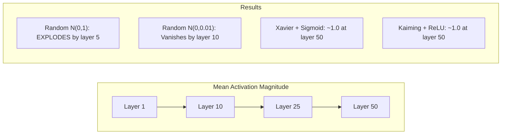
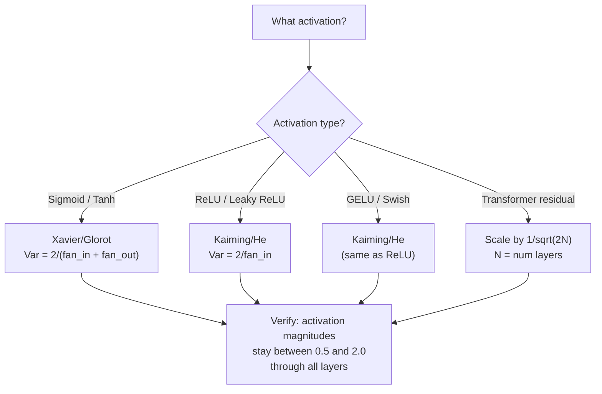

# 权重初始化和训练稳定性

> 开始错误,训练永远不会开始.开始正确,50层训练就像3层一样顺利.

> **【中文解读】**开始的错误,训练永远不会开始 开始的信号要么归零要么爆炸. 开始的对象,50层训练和3层一样平滑.

**Type:** Build
**Languages:** Python
**Prerequisites:** Lesson 03.04 (Activation Functions), Lesson 03.07 (Regularization)
**Time:** ~90 minutes

## 学习目标

- 实现零,随机,Xavier/Glorot和Kaiming/He初始化策略,并通过50层来测量其对激活大小的影响
- 导出为什么Xavier init使用Var(w) = 2/(fan_in + fan_out) 和Kaiming使用Var(w) = 2/fan_in
- 证明零初始化对称性问题,并解释为什么随机尺度本身是不够的
- 匹配正确的初始化策略与激活函数:Xavier为sigmoid/tanh,Kaiming为ReLU/GELU

> **【中文解读】**本章核心问题:如何选择初始权重,让信号在50层网络中既不消失也不爆炸――答案是Xavier初始化(sigmoid/tanh配套) 和Kaiming初始化(ReLU/GELU配套) ――PyTorch的 nn.Linear默认使用Kaiming初始化这就是为什么大多数网络"开箱即用"――

## 问题 问题引入

开始所有重量到零.什么都不会学习.每个神经元都计算出相同的函数,得到相同的梯度,并更新相同. 在1万个时代之后,你的512神经元隐藏层仍然是512副本的同一个神经元.你支付了512个参数,得到了1.

> 经过1万个时代,你的512神经隐藏层仍然是512个副本的同一神经元.你为512个参数付出了代价,但只得到了1个.

激活器在网络中爆炸.在10层时,值达到1e15.在20层时,它们溢出到无限. 梯度以逆行走相同的轨迹.

> 开始化太大了――在网络中爆炸的激活值――到第十层,值达到1e15――到第20层,它们溢出为无穷大――沿梯度相反方向遵循相同的轨迹――

根据随机尺寸的小小或大小,信号的速度会变得无限. "工作"和"破裂"之间的界限是薄薄.

> 从标准正态分布随机初始化――3层可以工作――50层时,信号缩为零或爆炸为无穷大,取决于随机尺寸是略小还是略大――"有效"和"损坏"之间的边界极其微弱――

开始重量是深度学习中最低估的决定. 建筑得到论文. 优化者得到博客帖子. 开始得到脚注.

> 权重初始化是深度学习中最被低估的决策――架构能发论文――优化器能写博客――初始化只能得到一个脚注――但如果错误了,其他一切都不重要你的网络在训练开始之前已经死了――

> **【中文解读】**开始化是深度学习中最被低估的决策. 零开始化导致对称性 (如同所有神经学一样的东西),随机开始化的差异会导致50层网络信号消失或爆炸.

> **【拓展：GPT-2 的残差缩放技巧】**GPT-2 引入1/sqrt(2N) 的残差缩放(N 是层数) ・・・每个残差连接 x = x + 亚层(x) 城市会增加方差,126层的Llama 3 会让方差增长126倍──缩放因子让方差保持稳定──这个技巧现在被所有变压器 采用──

## 概念的核心概念

### 交配问题

一层中的每个神经元都有相同的结构:乘以重量输入,添加偏差,应用激活.如果所有重量从相同的值开始 (零是极端情况),每个神经元计算出相同的输出.在后扩散过程中,每个神经元都会获得相同的梯度.在更新阶段,每个神经元都会变化相同的数量.

> 一层中的每个神经元具有相同的结构:输入乘重量加偏置 应用激活函数――如果所有权重从相同的值开始 (零是极端情况),每个神经元计算相同的输出――在反向传播中,每个神经元接受相同的梯度――在更新阶段,每个神经元以相同的量变化――

你被困了.网络有数百个参数,但它们都在锁步上移动.这称为对称性,随机初始化是破解它的方法.每个神经元在重量空间的不同点开始,所以每个学习不同的特征.

> 你被困住了.网络有数百个参数,但它们都同步移动.这被称为对称性,随机初始化是破坏它的暴力方式.

随机性是网络运行的决定.

> 随机性*尺度*决定网络是否能训练.

### 变体传播通过层次传播

考虑一个单层的风扇_in输入:

> 考虑一个有粉丝_在一个输入的单层:

```
z = w1*x1 + w2*x2 + ... + w_n*x_n
```

如果每一个权力wi从一个变量 Var(w) 的分布中得到,并且每个输入 xi 变量 Var(x),输出变量是:

> 如果每个权重的分布为 Var(w),每个输入 xi 的方差为 Var(x),输出方差是:

```
Var(z) = fan_in * Var(w) * Var(x)
```

如果 Var(w) = 1 和 fan_in = 512,输出变量是输入变量的512x. 10 层后: 512 ^ 10 = 1.2e27.你的信号已经爆炸.

> 如果 Var(w) = 1 且 fan_in = 512,输出差是输入差的 512 倍──10 层后:512^10 = 1.2e27──你的信号已经爆炸──

如果 Var(w) = 0.001,输出差异每层缩小0.001 * 512 = 0.512 . 10 层后: 0.512 ^ 10 = 0.00013.你的信号已经消失.

> 如果 Var(w) = 0.001,输出方差每层缩小0.001 * 512 = 0.512──10 层后:0.512^10 = 0.00013──你的信号已经消失──

目标:选择Var(w) 以使Var(z) =Var(x).信号大小在各层保持一致.

> 目标:选择 Var(w) 使 Var(z) = Var(x) ――信号幅度逐层保持恒定──

> **【中文解读】**方差传播的数学:Var(z) = 风扇_在 * Var(w) * Var(x) ⋅如果风扇_在=512 且 Var(w) =1,输出方差是输入的 512 倍──10 层后:512^10 = 1.2e27,信号爆炸──Xavier 和 Kaiming 的目标都是让 Var(z) = Var(x),使信号幅度逐层保持恒定──

### 哈维尔/格洛罗初始化

为了保持前进和后退的变异常态:

> 为了在前向和反向传播中保持方差恒定:

```
Var(w) = 2 / (fan_in + fan_out)
```

实际上,重量来自:

> 实践中,权重从以下分布抽取:

```
w ~ Uniform(-limit, limit)  where limit = sqrt(6 / (fan_in + fan_out))
```

或:

```
w ~ Normal(0, sqrt(2 / (fan_in + fan_out)))
```

这种方法是因为sigmoid和tanh大致是近零的线性,正确启动的激活活活在其中.

> 这就是有效的,因为sigmoid 和 tanh 在零附近大致是线性的,而正确的初始化的激活值恰好生活在零附近.

### 起,他开始了.

实际上,它是因为平均的输入中有一半是零的. 克萨维尔 init 没有考虑到这一点 - 它低估了所需的差异.

> 由于平均输入的一半被置于零,RELU将将一半的输出置零 (所有负值变为零) ⋅有效的风扇_中减半.

他等人 (2015) 调整了公式:

> 他等 (2015) 调整了公式:

```
Var(w) = 2 / fan_in
```

权重是从:

> 权重从以下分布抽取:

```
w ~ Normal(0, sqrt(2 / fan_in))
```

由于 ReLU 激活率为0.5x,其信号的速度会减少0.5x. 由于 50 层的数量:0.5^50 =8.8e-16.

> 因子 2 补偿了 ReLU 将将一半的激活值置零――没有它,信号每层缩小约0.5倍――50层后:0.5^50 =8.8e-16――凯宁初始化防止这种情况――

> **【拓展：PyTorch 的默认初始化】**皮托尔奇的 nn.Linear 默认使用Kaiming Uniform初始化(`nn.init.kaiming_uniform_`的的阴影的的的`nn.Linear(784, 256)`时,PyTorch 已经帮助你选择好初始化.

### 变压器启动

其他类型的电源是GPT-2的.

> GPT-2 引入了不同的模式.残差连接将每个子层的输出加上其输入:

```
x = x + sublayer(x)
```

每次加值增加了变量.在N残留层时,变量与N相对增长.GPT-2将残留层的重量缩小到1/sqrt(2N),其中N是层数.这使得积累的信号大小保持稳定.

> 每次加法都会增加方差. 有N个残差层时,方差按N 成比例增长. GPT-2将残差层的权重缩小1平方.

没有这种扩展,剩余流将在126层注意力和输送前进块中无限增长.

> 拉马3(4050亿参数,126层) 使用类似方案──没有这种缩放,残差流会通过126层注意力和前块无限增长──

> **【拓展：混合专家模型（MoE）的初始化挑战】**混合8x7B 和GPT-4等模型使用MoE架构,每个代币只激活部分专家――初始化时需要确保:路由器的初始权重不能让所有代币都选择一个专家――常见做法是使用小的初始化方差 + 噪声偏移,确保初始路由均――初始化不当会导致"路由崩" 一个专家承担所有负载――

```mermaid
flowchart TD
    subgraph "Zero Init"
        Z1["Layer 1<br/>All weights = 0"] --> Z2["Layer 2<br/>All neurons identical"]
        Z2 --> Z3["Layer 3<br/>Still identical"]
        Z3 --> ZR["Result: 1 effective neuron<br/>regardless of width"]
    end

    subgraph "Xavier Init"
        X1["Layer 1<br/>Var = 2/(fan_in+fan_out)"] --> X2["Layer 2<br/>Signal stable"]
        X2 --> X3["Layer 50<br/>Signal stable"]
        X3 --> XR["Result: Trains with<br/>sigmoid/tanh"]
    end

    subgraph "Kaiming Init"
        K1["Layer 1<br/>Var = 2/fan_in"] --> K2["Layer 2<br/>Signal stable"]
        K2 --> K3["Layer 50<br/>Signal stable"]
        K3 --> KR["Result: Trains with<br/>ReLU/GELU"]
    end
```



### 通过50层的激活度实验.



### 选择正确的初始化



## 建立它,实现它.
```figure
weight-init-variance
```

## 建立它

> **【中文解读】**实验设计:让信号通过50层网络,测量每个层的激活幅度──零初始化 → 所有神经元相同;随机N(0,1) → 爆炸;随机N(0,0.01) → 消失;Xavier+tanh / Kaiming+ReLU → 稳定──这个实验直观展示了初始化的重要性──

### 开始策略.

重量矩阵初始化四种方法.每个方法都返回了列表 (2D矩阵) 的列表,其中包含粉丝_在列和粉丝_出列.

> 开始重矩阵的方法. 每种返回一个列表的列表.

```python
import math
import random


def zero_init(fan_in, fan_out):
    return [[0.0 for _ in range(fan_in)] for _ in range(fan_out)]


def random_init(fan_in, fan_out, scale=1.0):
    return [[random.gauss(0, scale) for _ in range(fan_in)] for _ in range(fan_out)]


def xavier_init(fan_in, fan_out):
    std = math.sqrt(2.0 / (fan_in + fan_out))
    return [[random.gauss(0, std) for _ in range(fan_in)] for _ in range(fan_out)]


def kaiming_init(fan_in, fan_out):
    std = math.sqrt(2.0 / fan_in)
    return [[random.gauss(0, std) for _ in range(fan_in)] for _ in range(fan_out)]
```

### 启动函数.

我们需要sigmoid,tanh,和ReLU,以测试每一个 init战略,

> 我们需要Sigmoid,tanh和RELU来测试每种初始化策略和应对激活函数的组合.

```python
def sigmoid(x):
    x = max(-500, min(500, x))
    return 1.0 / (1.0 + math.exp(-x))


def tanh_act(x):
    return math.tanh(x)


def relu(x):
    return max(0.0, x)
```

### 步骤3: 通过50层前进传递.

通过深度网络传递随机数据,

> 随时通过深度网络,测量每个层次的平均激活幅度.

```python
def forward_deep(init_fn, activation_fn, n_layers=50, width=64, n_samples=100):
    random.seed(42)
    layer_magnitudes = []

    inputs = [[random.gauss(0, 1) for _ in range(width)] for _ in range(n_samples)]

    for layer_idx in range(n_layers):
        weights = init_fn(width, width)
        biases = [0.0] * width

        new_inputs = []
        for sample in inputs:
            output = []
            for neuron_idx in range(width):
                z = sum(weights[neuron_idx][j] * sample[j] for j in range(width)) + biases[neuron_idx]
                output.append(activation_fn(z))
            new_inputs.append(output)
        inputs = new_inputs

        magnitudes = []
        for sample in inputs:
            magnitudes.append(sum(abs(v) for v in sample) / width)
        mean_mag = sum(magnitudes) / len(magnitudes)
        layer_magnitudes.append(mean_mag)

    return layer_magnitudes
```

### 实验的第四步:实验

运行所有组合:零 init,随机 N(0,1),随机 N(0,0.01),Xavier与 sigmoid,Xavier与 tanh,Kaiming与 ReLU.

> 运行所有组合:零初始化、随机 N(0,1)、随机 N(0,0.01)、Xavier + sigmoid、Xavier + tanh、Kaiming + ReLU──打印关键层的幅度──

```python
def run_experiment():
    configs = [
        ("Zero init + Sigmoid", lambda fi, fo: zero_init(fi, fo), sigmoid),
        ("Random N(0,1) + ReLU", lambda fi, fo: random_init(fi, fo, 1.0), relu),
        ("Random N(0,0.01) + ReLU", lambda fi, fo: random_init(fi, fo, 0.01), relu),
        ("Xavier + Sigmoid", xavier_init, sigmoid),
        ("Xavier + Tanh", xavier_init, tanh_act),
        ("Kaiming + ReLU", kaiming_init, relu),
    ]

    print(f"{'Strategy':<30} {'L1':>10} {'L5':>10} {'L10':>10} {'L25':>10} {'L50':>10}")
    print("-" * 80)

    for name, init_fn, act_fn in configs:
        mags = forward_deep(init_fn, act_fn)
        row = f"{name:<30}"
        for idx in [0, 4, 9, 24, 49]:
            val = mags[idx]
            if val > 1e6:
                row += f" {'EXPLODED':>10}"
            elif val < 1e-6:
                row += f" {'VANISHED':>10}"
            else:
                row += f" {val:>10.4f}"
        print(row)
```

### 五步:对称性演示

证明零 init产生相同的神经元.

> 显示零初始化产生完全相同的神经元.

```python
def symmetry_demo():
    random.seed(42)
    weights = zero_init(2, 4)
    biases = [0.0] * 4

    inputs = [0.5, -0.3]
    outputs = []
    for neuron_idx in range(4):
        z = sum(weights[neuron_idx][j] * inputs[j] for j in range(2)) + biases[neuron_idx]
        outputs.append(sigmoid(z))

    print("\nSymmetry Demo (4 neurons, zero init):")
    for i, out in enumerate(outputs):
        print(f"  Neuron {i}: output = {out:.6f}")
    all_same = all(abs(outputs[i] - outputs[0]) < 1e-10 for i in range(len(outputs)))
    print(f"  All identical: {all_same}")
    print(f"  Effective parameters: 1 (not {len(weights) * len(weights[0])})")
```

### 六步:层次幅度报告

通过50层打印激活大小的视觉条图.

> 打印50层激活幅度的可视化条形图.

```python
def magnitude_report(name, magnitudes):
    print(f"\n{name}:")
    for i, mag in enumerate(magnitudes):
        if i % 5 == 0 or i == len(magnitudes) - 1:
            if mag > 1e6:
                bar = "X" * 50 + " EXPLODED"
            elif mag < 1e-6:
                bar = "." + " VANISHED"
            else:
                bar_len = min(50, max(1, int(mag * 10)))
                bar = "#" * bar_len
            print(f"  Layer {i+1:3d}: {bar} ({mag:.6f})")
```

## 用它实现框架

> **【中文解读】**火器内置`nn.init.xavier_uniform_`,我知道.`nn.init.kaiming_normal_`等函数.nn.线性默认使用Kaiming Uniform,所以简单网络"开箱即用"――但自定义架构需要手动调用这些函数.

PyTorch 提供了以下功能:

> 作为内置函数, PyTorch 将提供:

```python
import torch
import torch.nn as nn

layer = nn.Linear(512, 256)

nn.init.xavier_uniform_(layer.weight)
nn.init.xavier_normal_(layer.weight)

nn.init.kaiming_uniform_(layer.weight, nonlinearity='relu')
nn.init.kaiming_normal_(layer.weight, nonlinearity='relu')

nn.init.zeros_(layer.bias)
```

当你打电话时`nn.Linear(512, 256)`由于PyTorch 已经做出了正确的选择,但是当你构建定制架构或更深入于20层时,你需要了解发生了什么,并可能取消默认的情况.

> 当你调用`nn.Linear(512, 256)`当,PyTorch 默认使用Kaiming 均初始化.这就是为什么大多数简单网络"开箱即即用"PyTorch 已经帮助你做出正确的选择.但是当你构建自定义架构或超过20层时,你需要了解正在发生的事情并可能覆盖默认值.

对于变压器,HuggingFace模型通常处理其初始化.`_init_weights`现在,我们需要一个新的方法. GPT-2 的实现量度残余投影的1/sqrt ((N).如果你从零开始建造一个变压器,你需要自己添加这个.

> 对于变压器,拥抱面孔的模型通常在`_init_weights`方法中处理初始化――GPT-2实现将残差投影缩小到1/sqrt(N) ――如果你从零构建变压器,你需要自己添加这个――

## 运送它.

这一课产生了:
- `outputs/prompt-init-strategy.md`-- 提示诊断体重初始化问题,并建议正确的策略

> 本课产出:`outputs/prompt-init-strategy.md`- 一个诊断权重初始化问题并推正确策略的提示词

## 练习题

1. 加入LeCun初始化 (Var = 1/fan_in,用于SELU激活).使用LeCun init + tanh进行50层实验,并将其与Xavier + tanh进行比较.

   1. 添加LeCun初始化(Var = 1/fan_in,为SELU 激活设计) ・・・用LeCun初始化 + tanh 跑 50 层实验,和Xavier + tanh 对比──

2. 执行GPT-2残余扩展:在加入残余流之前,乘以1/sqrt ((2*N) 每层输出量.运行50层,无论是没有扩展,测量残余大小的增长速度.

   2. 实现GPT-2残差缩放:把每层输出乘以1/sqrt(2*N) 再加到残差流――跑50层有缩放和无缩放,测量残差幅度增长速度――

3. 创建一个"init健康检查"函数,它取网络层尺寸和激活类型,然后建议正确的初始化,并警告如果当前的 init会导致问题.

   3. 创建"初始化健康检查"函数:接收网络层维度和激活类型,推正确初始化,警告当前初始化是否会导致问题──

4. 运行实验用fan_in = 16 vs fan_in = 1024. 克萨维尔和凯明适应fan_in,但随机 init没有. 显示"工作"和"断裂"之间的差距如何随着更大的层次扩大.

   4. 用粉丝_in = 16 和粉丝_in = 1024 跑实验──Xavier 和 Kaiming 自适应粉丝_in,但随机初始化不会──展示"能用"和"崩"之间的差距随着层次的增长和扩大──

5. 实现直角初始化 (生成一个随机矩阵,计算其SVD,使用直角矩阵U).比较ReLU网络的Kaiming50层.

   5. 实现正交初始化(生成随机矩阵,计算SVD,用正交矩阵U) ・在50层 ReLU 网络上和Kaiming对比──

## 关键词 快速查找表

| Term | What people say | What it actually means |
|------|----------------|----------------------|
| Weight initialization | "Set starting weights randomly" | The strategy for choosing initial weight values that determines whether a network can train at all |
| Symmetry breaking | "Make neurons different" | Using random initialization to ensure neurons learn distinct features instead of computing identical functions |
| Fan-in | "Number of inputs to a neuron" | The number of incoming connections, which determines how input variance accumulates in the weighted sum |
| Fan-out | "Number of outputs from a neuron" | The number of outgoing connections, relevant for maintaining gradient variance during backpropagation |
| Xavier/Glorot init | "The sigmoid initialization" | Var(w) = 2/(fan_in + fan_out), designed to preserve variance through sigmoid and tanh activations |
| Kaiming/He init | "The ReLU initialization" | Var(w) = 2/fan_in, accounts for ReLU zeroing half the activations |
| Variance propagation | "How signals grow or shrink through layers" | The mathematical analysis of how activation variance changes layer by layer based on weight scale |
| Residual scaling | "GPT-2's init trick" | Scaling residual connection weights by 1/sqrt(2N) to prevent variance growth through N transformer layers |
| Dead network | "Nothing trains" | A network where poor initialization causes all gradients to be zero or all activations to saturate |
| Exploding activations | "Values go to infinity" | When weight variance is too high, causing activation magnitudes to grow exponentially through layers |

| 术语 | 俗称 | 实际含义 |
|------|------|---------|
| Weight initialization / 权重初始化 | "随机设置初始权重" | 选择初始权重值的策略，决定网络能否训练 |
| Symmetry breaking / 对称性破除 | "让神经元不同" | 用随机初始化确保神经元学到不同特征，而不是计算相同函数 |
| Fan-in / 输入连接数 | "神经元的输入数" | 入连接数，决定加权和里输入方差如何累积 |
| Fan-out / 输出连接数 | "神经元的输出数" | 出连接数，与反向传播时保持梯度方差相关 |
| Xavier/Glorot init / Xavier 初始化 | "sigmoid 初始化" | Var(w) = 2/(fan_in + fan_out)，旨在通过 sigmoid/tanh 保持方差 |
| Kaiming/He init / Kaiming 初始化 | "ReLU 初始化" | Var(w) = 2/fan_in，补偿 ReLU 把一半激活置零 |
| Variance propagation / 方差传播 | "信号在层间如何放大或缩小" | 关于激活方差如何基于权重尺度逐层变化的数学分析 |
| Residual scaling / 残差缩放 | "GPT-2 的初始化技巧" | 把残差连接权重缩放 1/sqrt(2N)，防止 N 个 Transformer 层后方差增长 |
| Dead network / 死亡网络 | "什么都不训练" | 初始化不当导致所有梯度为零或所有激活饱和的网络 |
| Exploding activations / 激活爆炸 | "值到无穷" | 权重方差太高，激活幅度在层间指数增长 |

## 继续阅读 继续阅读

- 格洛罗特和Bengio, "理解训练深度传输神经网络的难度" (2010) -- 哈维埃初始化论文与变异分析
  格洛特和班基奥,理解训练深度前神经网络的困难(2010) 原始Xavier初始化论文,包含方差分析
- 他等, "深入调整器" (2015) -- 引入了ReLU网络的凯明初始化
  他等,深入研究修正器(2015) 为 ReLU 网络引入Kaiming初始化
- 拉德福德等人",语言模型是无监督多任务学习者" (2019) -- GPT-2 论文,其余规模化初始化
  拉德福德等,语言模型是无监督多任务学习器(2019) GPT-2论文,包含残差缩放初始化
- 密希金和马塔斯,"你需要的只是一个好的初步" (2016) - - 层次单元变异初始化,对分析公式的实验性替代
  密希金和马塔斯,你只需要一个好的初始化(2016) 层次序分数差初始化,解析公式的经验替代方案
