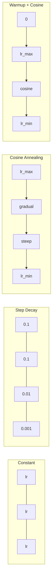
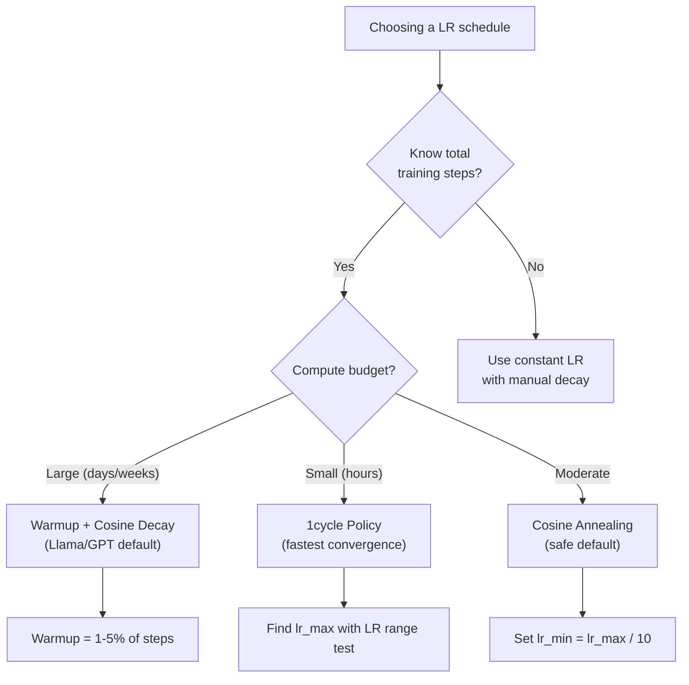
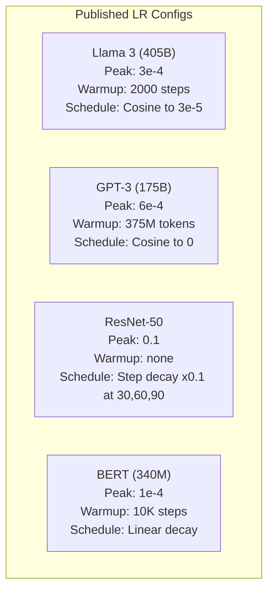

# 学习率调度与预热

> 学习速度是最重要的超参数. 不是架构,数据集的尺寸,不是激活函数,学习速度.如果你没有调整其他东西,

> **【中文解读】**学习率是最重要的超参数,不是结构,不是数据量,是学习率. 拉马3 用峰值 lr=3e-4 + 2000 步升温 + 代数衰退.

**Type:** Build
**Languages:** Python
**Prerequisites:** Lesson 03.06 (Optimizers), Lesson 03.08 (Weight Initialization)
**Time:** ~90 minutes

## 学习目标

- 从零开始实施常态,步骤衰退,化,加热+化和1周期学习率计划
- 展示学习率选择的三个失败模式:分离 (过高),停滞 (过低) 和振荡 (没有衰退)
- 解释为什么亚当基础上优化者需要加热,以及如何稳定早期训练
- 进行相同任务的五个时间表中的融合速度进行比较,并选择适合特定培训预算的时间表

> **【中文解读】**本章实现五种学习率调度:恒定、阶梯衰减、余弦退火、加热+余弦、1周期 策略。现代大模型的标准配置是加热(前 1-5% 步数线性升温) +宇宙衰退(余弦衰减到接近零) ――理解加热为什么是关键──

## 问题 问题引入

设置学习率为0.1.训练分离 - - 损失在3步中跳到无限.设置为0.0001.训练爬行 - - 100个时代后,模型几乎没有从随机移动.设置为0.01.训练工作50个时代,然后损失在最低水平上摇摆,它永远无法达到,因为步骤太大.

> 将学习率设为0.1──训练发散损失在3步内跳到无穷大──设为0.0001──训练缓慢爬100个时代后,模型几乎没有从随机状态移动──设为0.01──训练前50个时代 有效,然后损失在一个永远无法达到的极小值附近振荡,因为步长太大──

训练中最好的学习速度不是恒定的.训练期间它会发生变化.早期,你需要快速地步覆盖大层面.训练中晚些时候,你需要小小的步骤达到极度.90%准确的模型和95%准确的模型之间的区别通常只是时间表.

> 最优学习率不是常数――它在训练过程中变化――早期,你想要大步长快速覆盖空间――训练后期,你想要小步长稳定到一个尖的极小值――90%准确率模型和95%准确率模型之间的差异往往只是调节方案――

过去三年中出版的每一个主要模型都使用学习率时间表.Llama 3使用了最大的 lr=3e-4,2000个加热步骤和可西因衰变到3e-5.GPT-3使用 lr=6e-4加热超过375万个代币.这些不是任意的选择.它们是大量的超参数扫描结果,成本数百万美元.

> 过去三年发表的每个主要模型都使用学习率调度――Llama 3 使用峰值 lr=3e-4,2000 步升和余弦衰减到3e-5――GPT-3 使用 lr=6e-4,升温 覆盖3.75亿代币――这些不是随意的选择――它们是花费数百万美元进行大量超参数搜索的结果――

你需要了解时间表,因为默认的规则不会解决你的问题.当你调整预训练模型时,正确的时间表与从头开始的训练不同.当你增加批量时,需要改变升温时间.当训练休息到10000步时,你需要知道这是一个时间表问题还是其他东西.

> 你需要理解调节方案,因为默认值不适用于你的问题. 当你调节预训模型时,正确调节与从头训练不同. 当你增加批量大小时,加热期需要改变.

> **【中文解读】**学习率太高 → 训练发散(损失到无穷);太低 → 训练极慢;合适但不衰减 → 振荡在最小值附近――每个主流模型都有精心调节的学习率调节方案,这些方案是通过百万美元级的超参数搜索找到的――

> **【拓展：大模型的学习率配置】**拉马3 405B:峰值 lr=3e-4,加热=2000步,阴性衰退到3e-5, 训练 1.8T代币。GPT-3 175B:峰值 lr=6e-4,加热=375M代币。BERT-base:峰值 lr=1e-4,加热=10K步,线性衰退──规律:模型越大,学习率通常越小;预训比微调的学习率高10-100倍──

## 概念的核心概念

### 恒定学习率

最简单的方法是选择一个数字,用它来执行每一步.

> 最简单的方法. 选择一个数字,每一步都用它.

```
lr(t) = lr_0
```

很少是最佳的.它要么太高于训练结束时 (动在最低点左右) 还要太低于开始 (浪费了微小步骤的计算).对于小型号和调试工作很好.对于训练超过一个小时的任何东西来说,这是一个可怕的选择.

> 很少是最优的――要么对训练末期来说太高 ((在极小值附近振荡),要么对训练初步来说太低 ((微小步长浪费计算) ――适用于小模型和调试――对于训练超过一小时的任务来说是糟糕的选择――

### 阶梯衰退

通过 ResNet时代的旧式方法,在固定时代,减少学习率一倍 (通常是10倍).

> 在一个固定的时期,学习率将降低一个因素 (通常是10倍).

```
lr(t) = lr_0 * gamma^(floor(epoch / step_size))
```

在Gamma=0.1和 step_size=30的意思是: lr每30个时代下降10倍.ResNet-50使用这个--lr=0.1,在30个时代下降10倍,60个时代下降90个时代.

> 马=0.1 且步_大小=30 意思是:每30个时代学习率降低10倍──ResNet-50使用这个lr=0.1,在30、60和90个时代降低10倍──

问题是:最佳的衰退点取决于数据集和架构. 转向另一个问题,你需要重新调整下降时间. 转变是突然的 - - 损失可能会升,当速度突然改变.

> 问题:最优衰减点取决于数据集和架构. 另一个问题需要调整,何时降低.

### 爱情炼

随着可西因曲线的顺序下降,从最大学习速度到最低水平:

> 从最大学习率到最小学习率的平滑衰退,遵循余弦曲线:

```
lr(t) = lr_min + 0.5 * (lr_max - lr_min) * (1 + cos(pi * t / T))
```

在此,t是当前的步骤,T是全部的步骤数.

> 其中 t 是当前步数,T 是总步数.

在t=0,代数词是1,所以lr=lr_max.在t=T,代数词是-1,所以lr=lr_min.衰变最初是温和的,在中间加速,并在结束附近再次变得温和.

> 时,余弦项为1,所以 lr = lr_max──t=T时,余弦项为 -1,所以 lr = lr_min──衰减开始平缓,中间加速,末期又变平缓──

对于大多数现代训练运行来说,这是默认的.没有超值参数可以调整到 lr_max 和 lr_min.

> 余弦形状符合经验观察大部分学习都发生在训练中期你希望在关键时期有合理的步长.

### 热点:为什么你开始小吗?

亚当和其他适应优化器保持了梯度平均和变异的运行估计.在0步,这些估计初始化为零.第一些梯度更新基于垃圾统计.如果您在此期间的学习速度很大,模型会采取巨大的,不适合方向的步骤.

> 在第0步,这些估计被初始化为零. 在前几次的梯度更新基于垃圾统计. 如果在此期间学习率很大,模型会采取巨大的方向错误的步骤.

热化解决了这一问题.从一个小的学习速度开始 (通常是lr_max / warmup_steps或甚至是零) 并线性地在第一个N步骤上升到lr_max.

> 热升 修复了这个问题――从一个很小的学习率开始 (通常是lr_max/warmup_steps甚至零),然后在前N步线性上升到lr_max──当你达到完整的学习率时,亚当的统计已经稳定了──

```
lr(t) = lr_max * (t / warmup_steps)     for t < warmup_steps
```

典型的加热:总训练步骤的1-5%.Llama 3训练了约1.8万亿代币,加热了2000个步骤.GPT-3加热了超过3.75亿代币.

> **【拓展：Warmup 的数学解释】**在前几步补偿不足中,亚当的偏差修正 (m_hat = m_t / (1-beta1^t)) 在前几步补偿不足中.以 beta1=0.9 举例来说,第1步的 m_1 = 0.1*级,除以 (1-0.9) = 0.1 得到正确的梯度估计.

### 线性变暖+余弦衰减

现在的默认方式是:

```
if t < warmup_steps:
    lr(t) = lr_max * (t / warmup_steps)
else:
    progress = (t - warmup_steps) / (total_steps - warmup_steps)
    lr(t) = lr_min + 0.5 * (lr_max - lr_min) * (1 + cos(pi * progress))
```

光电器的热量可以减少光电的光电. 光电器的热量可以减少光电的光电.

> 这是Llama、GPT、PaLM 和大多数现代变压器 使用的方法──加热防止早期不稳定──余弦衰减使模型稳定到一个好的极小值──

### 一轮政策 单轮策略

莱斯利·史密斯的发现 (2018):在训练的第一半年,学习率从低值升至高值,然后在下半年再降.

> 莱斯利·史密斯的发现 (2018):在训练前半段学习率将从低值升至高值,后半段再降回来.反直觉为什么要在中途*增加*学习率?

理论:高学习率通过增加噪音来调整优化轨迹.模型在升级阶段探索更多的损失景观,找到更好的盆地.升级阶段然后在发现的最佳盆地内精炼.

> 理论:高学习率通过给优化轨迹增加噪音起到正则化作用――模型在升温阶段探索更多损失曲面,找到更好的盆地――降温阶段然后在找到最佳盆地内精炼――

```
Phase 1 (0 to T/2):    lr ramps from lr_max/25 to lr_max
Phase 2 (T/2 to T):    lr ramps from lr_max to lr_max/10000
```

对于固定计算预算,一轮车往往比轮车速.

> 在固定计算预算下,通常比余弦退火训练更快.

> **【拓展：微调时的学习率策略】**微调预训模型 (如BERT、Llama) 当,学习率通常比预训小10-100倍. LORA 微调 Llama:lr=2e-5~1e-4,warmup=总步数的3%,cosine衰退.关键技巧:对不同层使用不同学习率底层 (接近输入) 用更小的 lr (因为通用特征已经学好),顶层 (接近输出) 用更大的 lr (因为需要适应新任务) .PyTorch 通过参数组实现.

### 调度形状对比



### 决策流程图



### 已发布模型的实际参数



## 建立它,实现它.
```figure
lr-schedule
```

## 建立它

> **【中文解读】**下面从零实现五种调节策略,然后使用同一个循环数据集训网对比效果――实验将显示:高学习率导致发散、低学习率导致停滞、合适调节让训练又快又稳――

### 调度函数.

每个函数都按照当前步骤进行学习,并返回当前步骤的学习速度.

> 每个函数接收当前步数,返回该步的学习率.

```python
import math


def constant_schedule(step, lr=0.01, **kwargs):
    return lr


def step_decay_schedule(step, lr=0.1, step_size=100, gamma=0.1, **kwargs):
    return lr * (gamma ** (step // step_size))


def cosine_schedule(step, lr=0.01, total_steps=1000, lr_min=1e-5, **kwargs):
    if step >= total_steps:
        return lr_min
    return lr_min + 0.5 * (lr - lr_min) * (1 + math.cos(math.pi * step / total_steps))


def warmup_cosine_schedule(step, lr=0.01, total_steps=1000, warmup_steps=100, lr_min=1e-5, **kwargs):
    if total_steps <= warmup_steps:
        return lr * (step / max(warmup_steps, 1))
    if step < warmup_steps:
        return lr * step / warmup_steps
    progress = (step - warmup_steps) / (total_steps - warmup_steps)
    return lr_min + 0.5 * (lr - lr_min) * (1 + math.cos(math.pi * progress))


def one_cycle_schedule(step, lr=0.01, total_steps=1000, **kwargs):
    mid = max(total_steps // 2, 1)
    if step < mid:
        return (lr / 25) + (lr - lr / 25) * step / mid
    else:
        progress = (step - mid) / max(total_steps - mid, 1)
        return lr * (1 - progress) + (lr / 10000) * progress
```

### 步骤2: 查看所有时间表.

打印一个基于文字的图表,显示每个课程在训练过程中如何发展.

> 打印文本图表,展示训练过程中的每种调节的变化.

```python
def visualize_schedule(name, schedule_fn, total_steps=500, **kwargs):
    steps = list(range(0, total_steps, total_steps // 20))
    if total_steps - 1 not in steps:
        steps.append(total_steps - 1)

    lrs = [schedule_fn(s, total_steps=total_steps, **kwargs) for s in steps]
    max_lr = max(lrs) if max(lrs) > 0 else 1.0

    print(f"\n{name}:")
    for s, lr_val in zip(steps, lrs):
        bar_len = int(lr_val / max_lr * 40)
        bar = "#" * bar_len
        print(f"  Step {s:4d}: lr={lr_val:.6f} {bar}")
```

### 训练网络.

简单的两个层网络,像以前的课程一样,但现在我们改变时间表.

> 在圆形数据集中的简单双层网络,与前面的课程相同,但现在我们改变调度方案.

```python
import random


def sigmoid(x):
    x = max(-500, min(500, x))
    return 1.0 / (1.0 + math.exp(-x))


def relu(x):
    return max(0.0, x)


def relu_deriv(x):
    return 1.0 if x > 0 else 0.0


def make_circle_data(n=200, seed=42):
    random.seed(seed)
    data = []
    for _ in range(n):
        x = random.uniform(-2, 2)
        y = random.uniform(-2, 2)
        label = 1.0 if x * x + y * y < 1.5 else 0.0
        data.append(([x, y], label))
    return data


def train_with_schedule(schedule_fn, schedule_name, data, epochs=300, base_lr=0.05, **kwargs):
    random.seed(0)
    hidden_size = 8
    total_steps = epochs * len(data)

    std = math.sqrt(2.0 / 2)
    w1 = [[random.gauss(0, std) for _ in range(2)] for _ in range(hidden_size)]
    b1 = [0.0] * hidden_size
    w2 = [random.gauss(0, std) for _ in range(hidden_size)]
    b2 = 0.0

    step = 0
    epoch_losses = []

    for epoch in range(epochs):
        total_loss = 0
        correct = 0

        for x, target in data:
            lr = schedule_fn(step, lr=base_lr, total_steps=total_steps, **kwargs)

            z1 = []
            h = []
            for i in range(hidden_size):
                z = w1[i][0] * x[0] + w1[i][1] * x[1] + b1[i]
                z1.append(z)
                h.append(relu(z))

            z2 = sum(w2[i] * h[i] for i in range(hidden_size)) + b2
            out = sigmoid(z2)

            error = out - target
            d_out = error * out * (1 - out)

            for i in range(hidden_size):
                d_h = d_out * w2[i] * relu_deriv(z1[i])
                w2[i] -= lr * d_out * h[i]
                for j in range(2):
                    w1[i][j] -= lr * d_h * x[j]
                b1[i] -= lr * d_h
            b2 -= lr * d_out

            total_loss += (out - target) ** 2
            if (out >= 0.5) == (target >= 0.5):
                correct += 1
            step += 1

        avg_loss = total_loss / len(data)
        accuracy = correct / len(data) * 100
        epoch_losses.append(avg_loss)

    return epoch_losses
```

### 步骤4:比较所有时间表.

训练同一个网络,并比较最终损失和合行为.

> 通过每种调节训练与网络进行比较,最终损失和收益行为.

```python
def compare_schedules(data):
    configs = [
        ("Constant", constant_schedule, {}),
        ("Step Decay", step_decay_schedule, {"step_size": 15000, "gamma": 0.1}),
        ("Cosine", cosine_schedule, {"lr_min": 1e-5}),
        ("Warmup+Cosine", warmup_cosine_schedule, {"warmup_steps": 3000, "lr_min": 1e-5}),
        ("1cycle", one_cycle_schedule, {}),
    ]

    print(f"\n{'Schedule':<20} {'Start Loss':>12} {'Mid Loss':>12} {'End Loss':>12} {'Best Loss':>12}")
    print("-" * 70)

    for name, schedule_fn, extra_kwargs in configs:
        losses = train_with_schedule(schedule_fn, name, data, epochs=300, base_lr=0.05, **extra_kwargs)
        mid_idx = len(losses) // 2
        best = min(losses)
        print(f"{name:<20} {losses[0]:>12.6f} {losses[mid_idx]:>12.6f} {losses[-1]:>12.6f} {best:>12.6f}")
```

### 第五步:学习率过高,过低

展示三个失败模式:过高 (分离),过低 (爬行),正确.

> 展示三种失败模式:太高(发散) 、太低(爬行) 、刚好。

```python
def lr_sensitivity(data):
    learning_rates = [1.0, 0.1, 0.01, 0.001, 0.0001]

    print("\nLR Sensitivity (constant schedule, 100 epochs):")
    print(f"  {'LR':>10} {'Start Loss':>12} {'End Loss':>12} {'Status':>15}")
    print("  " + "-" * 52)

    for lr in learning_rates:
        losses = train_with_schedule(constant_schedule, f"lr={lr}", data, epochs=100, base_lr=lr)
        start = losses[0]
        end = losses[-1]

        if end > start or math.isnan(end) or end > 1.0:
            status = "DIVERGED"
        elif end > start * 0.9:
            status = "BARELY MOVED"
        elif end < 0.15:
            status = "CONVERGED"
        else:
            status = "LEARNING"

        end_str = f"{end:.6f}" if not math.isnan(end) else "NaN"
        print(f"  {lr:>10.4f} {start:>12.6f} {end_str:>12} {status:>15}")
```

## 用它实现框架

> **【中文解读】**皮托尔奇提供15种调度器. 最常用的是CosineAnnealingLR 和 HuggingFace的 get_cosine_schedule_with_warmup.

皮托尔奇提供时间表`torch.optim.lr_scheduler`其他:

```python
import torch
import torch.optim as optim
from torch.optim.lr_scheduler import CosineAnnealingLR, OneCycleLR, StepLR

model = nn.Sequential(nn.Linear(10, 64), nn.ReLU(), nn.Linear(64, 1))
optimizer = optim.Adam(model.parameters(), lr=3e-4)

scheduler = CosineAnnealingLR(optimizer, T_max=1000, eta_min=1e-5)

for step in range(1000):
    loss = train_step(model, optimizer)
    scheduler.step()
```

对于加热+可西斯,使用一个Lambda调度器或`get_cosine_schedule_with_warmup`收起脸:

> 对于加热+余弦,使用 lambda调度器或 HuggingFace 的`get_cosine_schedule_with_warmup`其他:

```python
from transformers import get_cosine_schedule_with_warmup

scheduler = get_cosine_schedule_with_warmup(
    optimizer,
    num_warmup_steps=2000,
    num_training_steps=100000,
)
```

拥抱面部功能是大多数Llama和GPT细调脚本所使用的.在怀疑时,使用加热+加热的可西因 = 总步骤的 3-5%.它几乎适用于所有事情.

> 抱面的函数是大多数Llama 和 GPT 微调脚本使用的──不确定时,使用加热 +余弦,加热为总步数的 3-5%──它几乎适用于所有场景──

## 运送它.

这一课产生了:
- `outputs/prompt-lr-schedule-advisor.md`-- 提示建议您的训练设置的适当学习速度时间表和超参数

> 本课产出:`outputs/prompt-lr-schedule-advisor.md`- 一个推正确的学习率调度和超参数提示词

## 练习题

1. 实现指数分解:lr(t) =lr_0 *gamma^t,gamma=0.999.

   1. 实现指数衰减:lr(t) =lr_0 *gamma^t,gamma =0.999──在圆形数据集上和余弦退火对比──

2. 执行学习率范围测试 (Leslie Smith):训练几百步,同时从1e-7升至1. 插图损失与 LR. 最佳最大LR是损失开始增加之前.

   2. 实现学习率范围测试(Leslie Smith):训练几百步,同时把LR从1e-7指数增加到1──绘制损失与LR曲线──最优最大LR是损失 开始上升前的值──

3. 训练用加热+,但变化加热时间:0%,1%,5%,10%,20%的总步骤.找到训练最稳定的甜点.

   3. 用加热+余弦训练,但变化加热 长度:总步数的0%、1%、5%、10%、20%──找到训练最稳定的最佳点──

4. 执行热启动 (SGDR) 的可西因缩:每T步骤都将学习速度重置至lr_max,再衰退.

   4. 实现带热重启的余弦退火(SGDR):每步把学习率重置为lr_max 并再次衰退──在更长的训练上和标准余弦对比──

5. 建立一个"日程外科医生",监测训练损失,自动从加热转向位,

   5. 构建调度医生:监控训练损失,损失 稳定时自动从加热转换到余弦,损失停滞太久时降低

## 关键词 快速查找表

| Term | What people say | What it actually means |
|------|----------------|----------------------|
| Learning rate | "How fast the model learns" | The scalar that multiplies the gradient to determine the parameter update size |
| Schedule | "Change the LR over time" | A function that maps training step to learning rate, designed to optimize convergence |
| Warmup | "Start with a small LR" | Linearly ramping the LR from near-zero to the target value over the first N steps to stabilize optimizer statistics |
| Cosine annealing | "Smooth LR decay" | Decreasing the LR following a cosine curve from lr_max to lr_min over training |
| Step decay | "Drop LR at milestones" | Multiplying the LR by a factor (usually 0.1) at fixed epoch intervals |
| 1cycle policy | "Up then down" | Leslie Smith's method of ramping LR up then down in a single cycle for faster convergence |
| LR range test | "Find the best learning rate" | Training briefly while increasing LR to find the value where loss starts diverging |
| Cosine with warm restarts | "Reset and repeat" | Periodically resetting the LR to lr_max and decaying again (SGDR) |
| Eta min | "The floor for the LR" | The minimum learning rate that the schedule decays to |
| Peak learning rate | "The maximum LR" | The highest LR reached during training, typically after warmup |

| 术语 | 俗称 | 实际含义 |
|------|------|---------|
| Learning rate / 学习率 | "模型学得多快" | 乘以梯度决定参数更新大小的标量 |
| Schedule / 调度 | "随时间变 LR" | 把训练步数映射到学习率的函数，旨在优化收敛 |
| Warmup / 预热 | "从小 LR 开始" | 在前 N 步把 LR 从近零线性升到目标值，稳定优化器统计 |
| Cosine annealing / 余弦退火 | "平滑 LR 衰减" | 训练中按余弦曲线从 lr_max 降到 lr_min |
| Step decay / 阶梯衰减 | "里程碑式降 LR" | 在固定 epoch 间隔把 LR 乘以一个因子（通常 0.1） |
| 1cycle policy / 1cycle 策略 | "先升后降" | Leslie Smith 的方法：单周期内先升 LR 后降，加速收敛 |
| LR range test / LR 范围测试 | "找最佳学习率" | 短训练中增加 LR，找到 loss 开始发散的点 |
| Cosine with warm restarts / 带热重启的余弦 | "重置并重复" | 周期性把 LR 重置为 lr_max 再次衰减（SGDR） |
| Eta min / 最小学习率 | "LR 的下限" | 调度衰减到的最小学习率 |
| Peak learning rate / 峰值学习率 | "最大 LR" | 训练期间达到的最高 LR，通常在 warmup 之后 |

## 继续阅读 继续阅读

- 洛希洛夫和哈特, "SGDR:随着温暖的恢复而降低的斯托哈斯斯基梯度" (2017) -- 引入了缩和温暖的重新启动
  洛希洛夫和哈特,SGDR:带热重启的随机梯度下降(2017) 引入余弦退火和热重启
- 史密斯, "超级融合:使用较高学习率的神经网络非常快速培训" (2018) -- 1周期政策论文
  史密斯,超收:使用大学习率快速训练神经网络(2018)1周期 策略论文
- 图弗龙等人",Llama 2:开放基础和精细调节的聊天模式" (2023) --记录了在规模上使用的加热+可西因时间表
  图文 等人,Llama 2:开放基础和微调聊天模型(2023) 记录了大规模使用的热升+余弦调度
- 戈伊尔等人",精确,大型小型批次SGD:训练1小时中的图像网" (2017) --线性扩展规则和大型批次训练的加热
  戈伊尔等,精确大批量 SGD:1 小时训练 图像网(2017) 线性缩放规则和大批量训练的加热
