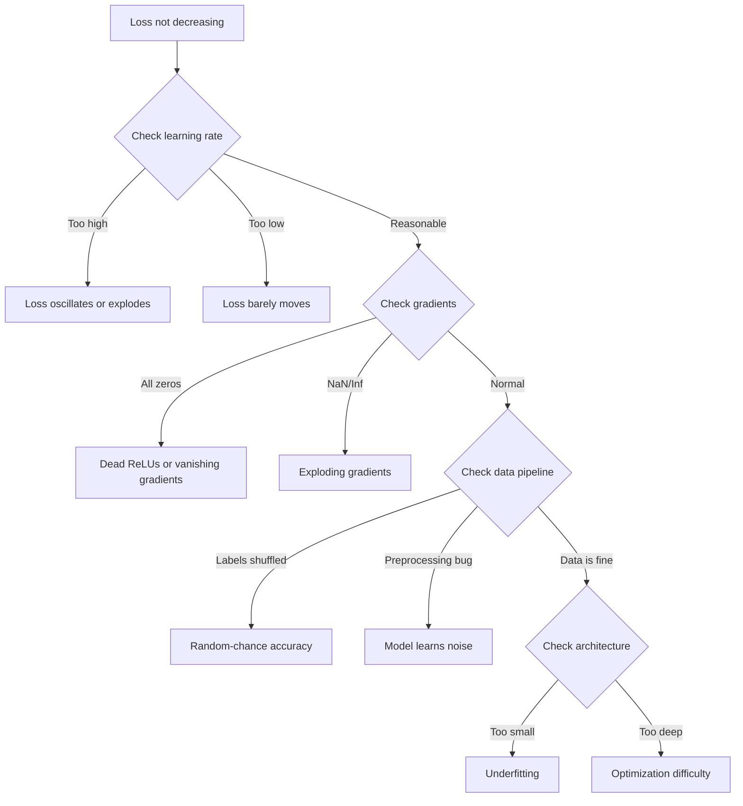
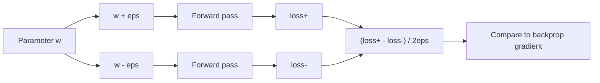
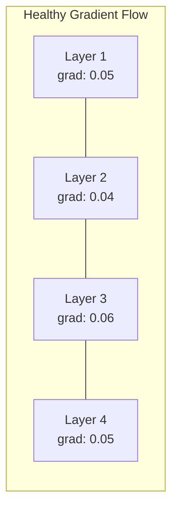
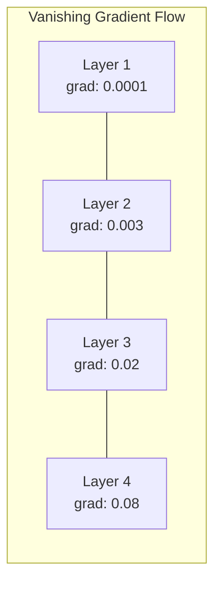
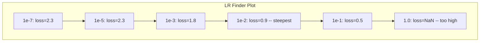

# 调试神经网络

> 你的网络编译了.它运行了.它产生了一个号码. 这个号码是错误的,没有什么崩. 欢迎来到最困难的调试,

> **【中文解读】**网络编译了、运行了、输出了数字但数字是错误的,没有报错信息――这是最难的调试:没有错误信息――本章系统介绍深度学习的调试方法论:过拟合单批 → 检查梯度 → 追踪数值稳定性 → 诊断学习率问题――

**Type:** Practice
**Type:** Build
**Languages:** Python, PyTorch
**Prerequisites:** Phase 03 Lessons 01-10 (especially backpropagation, loss functions, optimizers)
**Time:** ~90 minutes

## 学习目标

- 使用系统性调试策略诊断常见的神经网络故障 (NaN损失,平损曲线,过度适应,振荡)
- 应用"超适合一批"技术来验证模型架构和训练循环是否正确
- 检查梯度大小,激活分布和重量规范,以确定消失/爆炸梯度问题
- 建立一个调试检查清单,涵盖数据管道,模型架构,损失函数,优化器和学习速度问题

> **【中文解读】**本章系统化地教你调试神经网络──核心方法论:过拟合单批量(验证代码正确性)→ 梯度检查(验证反向传播)→ 激活统计(发现死 ReLU)→ 学习率搜索(找到合适的 lr)──60-70%的 ML 调试时间花在"静默错误"上程序不报错结果但不对对──

## 问题 问题引入

传统软件在破产时会崩. 零指标会产生例外. 编译时类型不匹配失败. 一次一次错误会产生明显错误输出.

> 传统软件在编译时失败.差一错产生的明显错误输出.

网络不会给你提供这种奢.

> 神经网络不会给你这种奢.

破产的神经网络运行到完成, 打印损失值, 损失可能会减少. 预测可能看起来是可行的. 但模型是默默地错误的 - - 学习快捷方式,记住噪音,或者接近无用的本地最低点. 谷歌研究人员估计,在ML调试时间中的60-70%,用于"沉默"的错误,

> 一个有问题的神经网络可以运行到完成,打印损失值,输出预测――损失可能在下降――预测可能看起来合理――但模型在地犯错误学习捷径、记忆噪声或收到无用的局部最小值――谷歌研究人员估计,60-70%的ML调试时间在"静默"错误上不产生错误,但降低了模型质量――

工作模型与破产模型的区别通常是一个错误的线条:一个缺失的线条.`zero_grad()`们的学习速度是10倍. 们的神经网络训练的食谱 (2019) 开始了这样:"最常见的神经网络错误是不会崩的错误.

> 可用模型和损坏模型之间的差异往往只是一个行放错位置的代码:缺少`zero_grad()`△度转置错误、学习率差10倍──经典的"训练神经网络的方法" (WEB 开头写道:"最常见的神经网络错误是不会崩的错误──"

这课教你如何找到这些虫子.

> 本课教你如何找到这些虫子.

> **【中文解读】**传统软件有明确的错误信号 ((异常、编译错误) ⋅神经网络最难调试的地方是"静默错误"程序正常运行、损失也在下降,但模型地学错误了──最常见的三个坑:忘记零_级() 、维度转置错误、学习率差10倍──

> **【拓展：大模型训练中的调试】**训练Llama 3 405B 这样的模型(16384块H100,30.8M GPU 小时),一次训练失败的成本高达数百万美元──Meta的做法是:(1) 先在小模型(8B) 上验证所有代码;(2) 使用过型一批测试完整的管道;(3) 在64块 GPU 上跑"冒险测试";(4) 逐步扩大到完整规模──每个阶段都有自动监控检查NaN、损失尖、死神经元──

## 概念的核心概念

### 调试心态的错误思维方式

忘记打印和试验调试. 网络调试需要系统方法,因为反循环很慢 (每次训练跑的分钟到小时),症状很模糊 (坏损失可能意味着20种不同的东西).

> 忘记打印和试用调试. 神经网络调试需要系统化的方法,因为反循环很慢.

黄金规则:**start simple, add complexity one piece at a time, and verify each piece independently.**

> 黄金法则:**从简单开始，一次只加一个复杂度，独立验证每个组件。**

> **【中文解读】**调试神经网络的黄金规则:从最简单的情况开始,每次只加一个组件,独立验证每个组件――不要一来就跑完整的训练先确保模型可以在单一批量上过于适应到损失≈0,再逐步扩展――



### 症状1: 损失不降低

训练循环是流行的,时代过去了,损失保持平稳或动.

> 训练循环在运行,时代一再过去,但损失一直不动或剧烈震荡.

**Wrong learning rate.**对于亚当来说,从1e-3开始.对于SGD来说,从1e-1或1e-2开始. 在得出其他错误之前,总是尝试3个学习率,每个学习率跨越10倍 (例如,1e-2,1e-3,1e-4)

> **学习率错误。**太高:损失 振荡或跳到NaN──太低:损失下降得太慢,看起来像不动──亚当从1e-3开始──SGD从1e-1或1e-2开始──在下结论说有其他问题之前,先尝试3个学习率(相差10倍,如1e-2、1e-3、1e-4)──

**Dead ReLUs.**如果一个ReLU神经元接收了大量的负输入,它输出0并且其梯度是0.它永远不会再次激活.如果足够的神经元死亡,网络无法学习.检查:印出每一个ReLU层后的精确0的激活率.如果50%以上死亡,则切换到LeakyReLU或降低学习速度.

> **死亡 ReLU。**如果RELU神经元接收到大负输入,它输出0,梯度也是0,永远不会再激活.如果死神经元足够多,网络就学不到东西.检查方法:打印每一个RELU 层后激活值恰好为0的比例.如果>50%死,换使用LeakyReLU或降低学习率.

**Vanishing gradients.**在具有sigmoid或tanh激活的深层网络中,渐变随着向后传播而呈指数缩小.到达第一层时,它们是0.第一层停止学习.

> **梯度消失。**在使用sigmoid或tanh 激活的深层网络中,梯度反向传播时指数级缩小.到第一层时几乎是0――前面的层停止学习.

**Exploding gradients.**降梯率增长指数.在RNN和非常深度网络中常见.损失跳到NaN.`torch.nn.utils.clip_grad_norm_`),降低学习率,或增加正常化.

> **梯度爆炸。**相反问题梯度指数级增长――常见于RNN 和非常深的网络――损失 跳到NaN――修复:梯度剪切`torch.nn.utils.clip_grad_norm_`降低学习率或增加归化层次.

### 症状2:损失减少,但模型不好

损失下降了,训练精度达到99%,但测试精度是55%.

> 输出率在降低中达到99%.但测试准确率只有55%.

**Overfitting.**模型记忆训练数据而不是学习模式.训练和验证损失之间的差距随着时间的推移增加.

> **过拟合。**模型在背诵训练数据而不是学习规律――训练损失和验证损失之间的差距随着时间的扩大――修复:更多数据、推移、权重减弱、早停、数据增强――

**Data leakage.**测试数据泄露到训练中.精度可疑高.常见原因:在分开之前混动,预处理数据集的统计数据,在分开之间复制样本. 修复:分开第一,预处理第二,检查复制.

> **数据泄漏。**测试数据混入了训练――准确率高可疑――常见原因:划分前先打乱――使用整个数据集的统计量进行预处理――跨划分的重复样本――修复:先划分再预处理――检查重复――

**Label errors.**大多数真实数据集中的5-10%的标签是错误的 (Northcutt等同,2021年"测试集中的普遍标签错误").模型学习噪音.修复:使用自信学习来找到和修复错误标签的例子,或使用损失缩小忽略高损失样本.

> **标签错误。**大多数真实数据集中 5-10% 的标签是错误的(Northcutt 等人 2021 年的论文测试组中的普遍标签错误) 』模型学到了噪音――修复:使用自信学习 找出并修改错误标题样本,或使用损失缩小 忽略高损失 样本――

### 症状3: 产出 NaN 或 Inf 损失

损失值将成为`nan`或`inf`训练已经结束了.

> 损失值变化`nan`或`inf`,我已经死了.

**Learning rate too high.**更新速度超越了重量爆炸.

> **学习率太高。**梯度更新过冲到权重爆炸――修复:降低10倍――

**log(0) or log(negative).**跨缩损失计算器`log(p)`如果你的模型输出精确的0或负概率,记录会爆炸.`[eps, 1-eps]`在哪里`eps=1e-7`现在,我们要去.

> **log(0) 或 log(负数)。**交叉损失计算`log(p)`如果模型输出恰好 0 或负概率, 记录会爆炸.`[eps, 1-eps]`在其中`eps=1e-7`,我知道.

**Division by zero.**批量正常化按标准偏差分开. 一批具有恒定值的批量具有 std=0. 修正:将epsilon添加到分母中 (PyTorch默认执行,但可能不会实现).

> **除以零。**批归一化要除以标准差──一个常数值的批次的 std=0──修复:分母加 epsilon(PyTorch默认这样做,但自定义实现可能没有)──

**Numerical overflow.**输入了大量激活`exp()`解决问题:在指数化之前减去最大值 (日积-exp技巧).

> **数值溢出。**大的激活值输入`exp()`实际上, 计算量是最快的.

### 技术1: 渐进检查技术1: 梯度检查

根据分析的差异,你必须将分析的差异 (从后方向) 进行比较.

> 把你的解析梯度 (来自反向传播) 和数值梯度 (来自有限差分) 进行比较.

参数的数值梯度`w`其他:

> 参数`w`的数值梯度:

```
grad_numerical = (loss(w + eps) - loss(w - eps)) / (2 * eps)
```

协议指标 (相对差异):

> 一致性度量 (相对差异):

```
rel_diff = |grad_analytical - grad_numerical| / max(|grad_analytical|, |grad_numerical|, 1e-8)
```

如果`rel_diff < 1e-5`答案是正确的.`rel_diff > 1e-3`几乎肯定是个虫子.

> 如果`rel_diff < 1e-5`确实是这样的.`rel_diff > 1e-3`几乎肯定有虫子.



### 技术2: 激活统计

训练期间,监测每层激活后的平均和标准偏差.健康网络保持在 0 附近的平均和 1 附近的 STD (正常化后) 或至少有界限的激活.

> 训练时监控每层后的激活值的平均值和标准差距――健康网络保持激活值的平均值接近0、标准差接近1(归结后) 或至少有界限――

| Health indicator | Mean | Std | Diagnosis |
|-----------------|------|-----|-----------|
| Healthy | ~0 | ~1 | Network is learning normally |
| Saturated | >>0 or <<0 | ~0 | Activations stuck at extreme values |
| Dead | 0 | 0 | Neurons are dead (all zeros) |
| Exploding | >>10 | >>10 | Activations growing without bound |

| 健康指标 | 均值 | 标准差 | 诊断 |
|---------|------|--------|------|
| 健康 | ~0 | ~1 | 网络正常学习中 |
| 饱和 | >>0 或 <<0 | ~0 | 激活卡在极端值 |
| 死亡 | 0 | 0 | 神经元死了（全零） |
| 爆炸 | >>10 | >>10 | 激活无界增长 |

### 技术3:渐进流视觉化

图表每层的平均梯度大小.在健康的网络中,梯度大小应该在各层之间大致相同.如果早期层的梯度比后层小1000倍,则有消失的梯度.

> 绘制每层的平均梯度幅度. 在健康网络中,各层的梯度幅度应该大致相似.





### 技术4:超适合单批量测试

对于深度学习来说,这是最重要的调试技术.

> 深度学习中最重要的单一调试技术.

运行一个小批量 (8-32个样本). 训练100次以上. 损失应该达到接近零,训练精度应该达到100%. 如果没有,你的模型或训练循环有基本的错误 - - 不要继续进行完整的训练.

> 取一个小批量 (8-32个样本) ⋅在上面训练100+次代――损失应该降到接近零,训练准确率应该达到100%――如果不是,你的模型或训练循环有根本的错误不要进入完整的训练――

这项测试发现:
- 破损函数
- 破碎的后行
- 建筑物太小,无法代表数据
- 没有连接到模型参数的优化器
- 错误地调整数据和标签

> 这个测试可以捕获:损坏的损失函数,损坏的反向传播,结构太小无法显示数据,优化器未连接到模型参数,数据和标签不匹配.

这需要30秒的时间才能运行,

> 这只需要30秒运行,可以节省几个小时的完整训练调试时间.

> **【拓展：Andrej Karpathy 的调试建议】**在"神经网络训练的食谱"中,卡帕蒂提出的建议: 1) 先不要管性能,确保损失 计算正确; 2) 在固定小数据集上过拟合; 3) 检查梯度使用数值梯度验证; 4) 监控权重和梯度的范数; 5) 先用小模型验证,再扩大.

### 技术5:学习率查询器

莱斯利·史密斯 (2017) 提出在一个时代内将学习率从非常小 (1e-7) 扫到非常大 (10) 扫描,同时记录损失. 剧情损失与学习率.最佳学习率大约是10倍小于损失开始减速速度的速度.

> 莱斯利·史密斯 (Leslie Smith) 提出在一个时代内把学习率从极小 (极小) 扫到极大 (极大) 扫到极大 (极小) 扫到极大 (极大) 扫到极大 (极大) 扫到极大 (极小) 扫到极大 (极大) 扫到极大 (极小) 扫到极大 (极大) 扫到极大 (极小) 扫到极大 (极小) 扫到极大 (极大) 扫到极大 (极小) 扫到极大 (极小) 扫到极大 (极大) 扫到极大 (极小) 扫到极大 (极小) 扫到极大 (极大) 扫) 扫10),同时记录损失――绘画损失与学习率曲线――最优学习率约是损失率 开始下降最快的学习率的1/10――



在本例中最好的LR: ~1e-3 (最点前一个大小顺序).

> 本例的最佳学习率:~1e-3(在下降最处之前一个数量级) ⋅

### 常见的PyTorch Bugs 常见的PyTorch 错误

这些是PyTorch社区最多时间浪费的虫子:

> 这些是PyTorch最多时间浪费的错误:

> **【拓展：大模型训练中的 loss spike】**在训练超大规模模型时(如GPT-4、Llama 3),会出现突然的损失损失从正常值突然跳到很高再恢复──可能原因:(1) 数据中有异常样本(重复文本、编码错误);(2) 梯度爆炸在某批次 触发;(3) 学习率调度不当──Meta的做法:检测到峰值时跳过该批次 并从最近的检查点 恢复──OpenAI 则使用梯度剪裁和更保守的学习率来预防──

| Bug | Symptom | Fix |
|-----|---------|-----|
| Forgetting `optimizer.zero_grad()` | Gradients accumulate across batches, loss oscillates | Add `optimizer.zero_grad()` before `loss.backward()` |
| Forgetting `model.eval()` at test time | Dropout and batch norm behave differently, test accuracy varies between runs | Add `model.eval()` and `torch.no_grad()` |
| Wrong tensor shapes | Silent broadcasting produces wrong results, no error | Print shapes after every operation during debugging |
| CPU/GPU mismatch | `RuntimeError: expected CUDA tensor` | Use `.to(device)` on model AND data |
| Not detaching tensors | Computation graph grows forever, OOM | Use `.detach()` or `with torch.no_grad()` |
| In-place operations breaking autograd | `RuntimeError: modified by in-place operation` | Replace `x += 1` with `x = x + 1` |
| Data not normalized | Loss stuck at random-chance level | Normalize inputs to mean=0, std=1 |
| Labels as wrong dtype | Cross-entropy expects `Long`, got `Float` | Cast labels: `labels.long()` |

| Bug | 症状 | 修复 |
|-----|------|------|
| 忘记 `optimizer.zero_grad()` | 梯度跨 batch 累积，loss 振荡 | 在 `loss.backward()` 前加 `optimizer.zero_grad()` |
| 测试时忘记 `model.eval()` | Dropout 和 BN 行为不同，测试准确率波动 | 加 `model.eval()` 和 `torch.no_grad()` |
| 张量形状错误 | 静默广播产生错误结果，无报错 | 调试时每个操作后打印形状 |
| CPU/GPU 不匹配 | `RuntimeError: expected CUDA tensor` | 模型和数据都用 `.to(device)` |
| 没有分离张量 | 计算图永远增长，OOM | 用 `.detach()` 或 `with torch.no_grad()` |
| 原地操作破坏 autograd | `RuntimeError: modified by in-place operation` | 把 `x += 1` 改成 `x = x + 1` |
| 数据未归一化 | Loss 卡在随机猜测水平 | 把输入归一化到 mean=0, std=1 |
| 标签 dtype 错误 | 交叉熵要 `Long`，得到了 `Float` | 转换标签：`labels.long()` |

### 修改总表

| Symptom | Likely cause | First thing to try |
|---------|-------------|-------------------|
| Loss stuck at -log(1/num_classes) | Model predicting uniform distribution | Check data pipeline, verify labels match inputs |
| Loss NaN after a few steps | Learning rate too high | Reduce LR by 10x |
| Loss NaN immediately | log(0) or division by zero | Add epsilon to log/division operations |
| Loss oscillating wildly | LR too high or batch size too small | Reduce LR, increase batch size |
| Loss decreasing then plateaus | LR too high for fine-tuning phase | Add LR schedule (cosine or step decay) |
| Training acc high, test acc low | Overfitting | Add dropout, weight decay, more data |
| Training acc = test acc = chance | Model not learning anything | Run overfit-one-batch test |
| Training acc = test acc but both low | Underfitting | Bigger model, more layers, more features |
| Gradients all zero | Dead ReLUs or detached computation graph | Switch to LeakyReLU, check `.requires_grad` |
| Out of memory during training | Batch too large or graph not freed | Reduce batch size, use `torch.no_grad()` for eval |

| 症状 | 可能原因 | 首选尝试 |
|------|---------|---------|
| Loss 卡在 -log(1/num_classes) | 模型预测均匀分布 | 检查数据管线，验证标签与输入匹配 |
| 几步后 Loss 变 NaN | 学习率太高 | 学习率降低 10 倍 |
| Loss 立即变 NaN | log(0) 或除以零 | 给 log/除法操作加 epsilon |
| Loss 剧烈振荡 | LR 太高或 batch 太小 | 降低 LR，增大 batch |
| Loss 下降后停滞 | 微调阶段 LR 太高 | 加 LR 调度（cosine 或阶梯衰减） |
| 训练 acc 高，测试 acc 低 | 过拟合 | 加 Dropout、权重衰减、更多数据 |
| 训练 acc = 测试 acc = 随机水平 | 模型没学到东西 | 跑过拟合单 batch 测试 |
| 训练 acc = 测试 acc 都低 | 欠拟合 | 更大模型、更多层、更多特征 |
| 梯度全零 | Dead ReLU 或计算图被 detach | 换 LeakyReLU，检查 `.requires_grad` |
| 训练时 OOM | Batch 太大或计算图未释放 | 减小 batch，eval 时用 `torch.no_grad()` |

## 建立它,实现它.

> **【中文解读】**构建一个网络调试器 诊断工具:使用PyTorch的前和后自动记录每层的激活统计和梯度统计――然后故意制造三种错误――学习率太高,死 ReLU、忘记零_grad),使用诊断工具――最后实现学习率搜索器和梯度检查器――
```figure
learning-curves
```

## 建立它

检测工具包监测激活,梯度和损失曲线.

> 监控激活值,梯度和损失 曲线的诊断工具包――你会故意破坏一个网络,然后使用工具包诊断每个问题――

### 网络化类.

入 PyTorch 模型,以记录每层的激活和梯度统计.

> 给PyTorch 模型挂在子上,记录每个层次的激活和梯度统计.

> 网络除器使用PyTorch的前和后自动监控每层――健康检查逻辑:损失检查(NaN/振荡/不下降)、激活检查(>50% 零值→死亡 ReLU,时时时时时时时时时时>10→爆炸,std<1e-6→缩)、梯度检查(abs_mean<1e-7→消失,>100→爆炸,首尾比值>100→梯度比失衡)`print_report()`输出综合诊断报告

```python
import torch
import torch.nn as nn
import math


class NetworkDebugger:
    def __init__(self, model):
        self.model = model
        self.activation_stats = {}
        self.gradient_stats = {}
        self.loss_history = []
        self.lr_losses = []
        self.hooks = []
        self._register_hooks()

    def _register_hooks(self):
        for name, module in self.model.named_modules():
            if isinstance(module, (nn.Linear, nn.Conv2d, nn.ReLU, nn.LeakyReLU)):
                hook = module.register_forward_hook(self._make_activation_hook(name))
                self.hooks.append(hook)
                hook = module.register_full_backward_hook(self._make_gradient_hook(name))
                self.hooks.append(hook)

    def _make_activation_hook(self, name):
        def hook(module, input, output):
            with torch.no_grad():
                out = output.detach().float()
                self.activation_stats[name] = {
                    "mean": out.mean().item(),
                    "std": out.std().item(),
                    "fraction_zero": (out == 0).float().mean().item(),
                    "min": out.min().item(),
                    "max": out.max().item(),
                }
        return hook

    def _make_gradient_hook(self, name):
        def hook(module, grad_input, grad_output):
            if grad_output[0] is not None:
                with torch.no_grad():
                    grad = grad_output[0].detach().float()
                    self.gradient_stats[name] = {
                        "mean": grad.mean().item(),
                        "std": grad.std().item(),
                        "abs_mean": grad.abs().mean().item(),
                        "max": grad.abs().max().item(),
                    }
        return hook

    def record_loss(self, loss_value):
        self.loss_history.append(loss_value)

    def check_loss_health(self):
        if len(self.loss_history) < 2:
            return "NOT_ENOUGH_DATA"
        recent = self.loss_history[-10:]
        if any(math.isnan(v) or math.isinf(v) for v in recent):
            return "NAN_OR_INF"
        if len(self.loss_history) >= 20:
            first_half = sum(self.loss_history[:10]) / 10
            second_half = sum(self.loss_history[-10:]) / 10
            if second_half >= first_half * 0.99:
                return "NOT_DECREASING"
        if len(recent) >= 5:
            diffs = [recent[i+1] - recent[i] for i in range(len(recent)-1)]
            if max(diffs) - min(diffs) > 2 * abs(sum(diffs) / len(diffs)):
                return "OSCILLATING"
        return "HEALTHY"

    def check_activations(self):
        issues = []
        for name, stats in self.activation_stats.items():
            if stats["fraction_zero"] > 0.5:
                issues.append(f"DEAD_NEURONS: {name} has {stats['fraction_zero']:.0%} zero activations")
            if abs(stats["mean"]) > 10:
                issues.append(f"EXPLODING_ACTIVATIONS: {name} mean={stats['mean']:.2f}")
            if stats["std"] < 1e-6:
                issues.append(f"COLLAPSED_ACTIVATIONS: {name} std={stats['std']:.2e}")
        return issues if issues else ["HEALTHY"]

    def check_gradients(self):
        issues = []
        grad_magnitudes = []
        for name, stats in self.gradient_stats.items():
            grad_magnitudes.append((name, stats["abs_mean"]))
            if stats["abs_mean"] < 1e-7:
                issues.append(f"VANISHING_GRADIENT: {name} abs_mean={stats['abs_mean']:.2e}")
            if stats["abs_mean"] > 100:
                issues.append(f"EXPLODING_GRADIENT: {name} abs_mean={stats['abs_mean']:.2e}")
        if len(grad_magnitudes) >= 2:
            first_mag = grad_magnitudes[0][1]
            last_mag = grad_magnitudes[-1][1]
            if last_mag > 0 and first_mag / last_mag > 100:
                issues.append(f"GRADIENT_RATIO: first/last = {first_mag/last_mag:.0f}x (vanishing)")
        return issues if issues else ["HEALTHY"]

    def print_report(self):
        print("\n=== NETWORK DEBUGGER REPORT ===")
        print(f"\nLoss health: {self.check_loss_health()}")
        if self.loss_history:
            print(f"  Last 5 losses: {[f'{v:.4f}' for v in self.loss_history[-5:]]}")
        print("\nActivation diagnostics:")
        for item in self.check_activations():
            print(f"  {item}")
        print("\nGradient diagnostics:")
        for item in self.check_gradients():
            print(f"  {item}")
        print("\nPer-layer activation stats:")
        for name, stats in self.activation_stats.items():
            print(f"  {name}: mean={stats['mean']:.4f} std={stats['std']:.4f} zero={stats['fraction_zero']:.1%}")
        print("\nPer-layer gradient stats:")
        for name, stats in self.gradient_stats.items():
            print(f"  {name}: abs_mean={stats['abs_mean']:.2e} max={stats['max']:.2e}")

    def remove_hooks(self):
        for hook in self.hooks:
            hook.remove()
        self.hooks.clear()
```

### 过拟合单批量测试

> 这个函数在单批上训练模型200步,验证损失可降至接近零,准确率可达到100%──如果不能,说明模型或训练循环有根本问题──

```python
def overfit_one_batch(model, x_batch, y_batch, criterion, lr=0.01, steps=200):
    optimizer = torch.optim.Adam(model.parameters(), lr=lr)
    model.train()
    print("\n=== OVERFIT ONE BATCH TEST ===")
    print(f"Batch size: {x_batch.shape[0]}, Steps: {steps}")

    for step in range(steps):
        optimizer.zero_grad()
        output = model(x_batch)
        loss = criterion(output, y_batch)
        loss.backward()
        optimizer.step()

        if step % 50 == 0 or step == steps - 1:
            with torch.no_grad():
                preds = (output > 0).float() if output.shape[-1] == 1 else output.argmax(dim=1)
                targets = y_batch if y_batch.dim() == 1 else y_batch.squeeze()
                acc = (preds.squeeze() == targets).float().mean().item()
            print(f"  Step {step:3d} | Loss: {loss.item():.6f} | Accuracy: {acc:.1%}")

    final_loss = loss.item()
    if final_loss > 0.1:
        print(f"\n  FAIL: Loss did not converge ({final_loss:.4f}). Model or training loop is broken.")
        return False
    print(f"\n  PASS: Loss converged to {final_loss:.6f}")
    return True
```

### 学习率搜索器.

> 这个函数从极小学习率 () 扫到极大 () 扫到极大 () 扫到极大 () 扫到极大 () 扫到极大 () 扫到极大 () 扫到极大 () 扫到极大 () 扫到极大 () 扫到极大 () 扫到极大 () 扫到极大 () 扫到极大 () 扫到极大 () 扫到极大 () 扫到极大 () 扫到极大 () 扫到极大 () 扫到极大 () 扫到极大 () 扫到极大 () 扫到极大 () 扫到极大 () 扫到极大 () 扫到极大 () 扫到极大 () 扫到极大 () 扫到极大 () 扫到极大) 扫到极大 () 扫到极大) 扫到极大 () 扫到极大) 扫到极大 () 扫到极大) 扫到极大 (                                                                       

```python
def find_learning_rate(model, x_data, y_data, criterion, start_lr=1e-7, end_lr=10, steps=100):
    import copy
    original_state = copy.deepcopy(model.state_dict())
    optimizer = torch.optim.SGD(model.parameters(), lr=start_lr)
    lr_mult = (end_lr / start_lr) ** (1 / steps)

    model.train()
    results = []
    best_loss = float("inf")
    current_lr = start_lr

    print("\n=== LEARNING RATE FINDER ===")

    for step in range(steps):
        optimizer.zero_grad()
        output = model(x_data)
        loss = criterion(output, y_data)

        if math.isnan(loss.item()) or loss.item() > best_loss * 10:
            break

        best_loss = min(best_loss, loss.item())
        results.append((current_lr, loss.item()))

        loss.backward()
        optimizer.step()

        current_lr *= lr_mult
        for param_group in optimizer.param_groups:
            param_group["lr"] = current_lr

    model.load_state_dict(original_state)

    if len(results) < 10:
        print("  Could not complete LR sweep -- loss diverged too quickly")
        return results

    min_loss_idx = min(range(len(results)), key=lambda i: results[i][1])
    suggested_lr = results[max(0, min_loss_idx - 10)][0]

    print(f"  Swept {len(results)} steps from {start_lr:.0e} to {results[-1][0]:.0e}")
    print(f"  Minimum loss {results[min_loss_idx][1]:.4f} at lr={results[min_loss_idx][0]:.2e}")
    print(f"  Suggested learning rate: {suggested_lr:.2e}")

    return results
```

### 步骤4: 梯度检查器

> 梯度检查器:对每个参数,比较反向传播计算的解析梯度和有限差分得到的数值梯度.`rel_diff < 1e-5`表示正确,`> 1e-3`几乎肯定有错误. 注意需要双精度 (双精度) 减小少数值差.

```python
def _flat_to_multi_index(flat_idx, shape):
    multi_idx = []
    remaining = flat_idx
    for dim in reversed(shape):
        multi_idx.insert(0, remaining % dim)
        remaining //= dim
    return tuple(multi_idx)


def gradient_check(model, x, y, criterion, eps=1e-4):
    model.train()
    x_double = x.double()
    y_double = y.double()
    model_double = model.double()

    print("\n=== GRADIENT CHECK ===")
    overall_max_diff = 0
    checked = 0

    for name, param in model_double.named_parameters():
        if not param.requires_grad:
            continue

        layer_max_diff = 0

        model_double.zero_grad()
        output = model_double(x_double)
        loss = criterion(output, y_double)
        loss.backward()
        analytical_grad = param.grad.clone()

        num_checks = min(5, param.numel())
        for i in range(num_checks):
            idx = _flat_to_multi_index(i, param.shape)
            original = param.data[idx].item()

            param.data[idx] = original + eps
            with torch.no_grad():
                loss_plus = criterion(model_double(x_double), y_double).item()

            param.data[idx] = original - eps
            with torch.no_grad():
                loss_minus = criterion(model_double(x_double), y_double).item()

            param.data[idx] = original

            numerical = (loss_plus - loss_minus) / (2 * eps)
            analytical = analytical_grad[idx].item()

            denom = max(abs(numerical), abs(analytical), 1e-8)
            rel_diff = abs(numerical - analytical) / denom

            layer_max_diff = max(layer_max_diff, rel_diff)
            checked += 1

        overall_max_diff = max(overall_max_diff, layer_max_diff)
        status = "OK" if layer_max_diff < 1e-5 else "MISMATCH"
        print(f"  {name}: max_rel_diff={layer_max_diff:.2e} [{status}]")

    model.float()

    print(f"\n  Checked {checked} parameters")
    if overall_max_diff < 1e-5:
        print("  PASS: Gradients match (rel_diff < 1e-5)")
    elif overall_max_diff < 1e-3:
        print("  WARN: Small differences (1e-5 < rel_diff < 1e-3)")
    else:
        print("  FAIL: Gradient mismatch detected (rel_diff > 1e-3)")
    return overall_max_diff
```

### 五步:故意制造错误

现在将工具包应用到破产的网络,

> 现在把工具包应用到被破坏的网络上,逐个诊断――三个故意制造的错误: 1) 学习率太高了 (LR=10),观察损失发散; 2) 误初始化导致RLU死亡;

```python
def demo_broken_networks():
    torch.manual_seed(42)
    x = torch.randn(64, 10)
    y = (x[:, 0] > 0).long()

    print("\n" + "=" * 60)
    print("BUG 1: Learning rate too high (lr=10)")
    print("=" * 60)
    model1 = nn.Sequential(nn.Linear(10, 32), nn.ReLU(), nn.Linear(32, 2))
    debugger1 = NetworkDebugger(model1)
    optimizer1 = torch.optim.SGD(model1.parameters(), lr=10.0)
    criterion = nn.CrossEntropyLoss()
    for step in range(20):
        optimizer1.zero_grad()
        out = model1(x)
        loss = criterion(out, y)
        debugger1.record_loss(loss.item())
        loss.backward()
        optimizer1.step()
    debugger1.print_report()
    debugger1.remove_hooks()

    print("\n" + "=" * 60)
    print("BUG 2: Dead ReLUs from bad initialization")
    print("=" * 60)
    model2 = nn.Sequential(nn.Linear(10, 32), nn.ReLU(), nn.Linear(32, 32), nn.ReLU(), nn.Linear(32, 2))
    with torch.no_grad():
        for m in model2.modules():
            if isinstance(m, nn.Linear):
                m.weight.fill_(-1.0)
                m.bias.fill_(-5.0)
    debugger2 = NetworkDebugger(model2)
    optimizer2 = torch.optim.Adam(model2.parameters(), lr=1e-3)
    for step in range(50):
        optimizer2.zero_grad()
        out = model2(x)
        loss = criterion(out, y)
        debugger2.record_loss(loss.item())
        loss.backward()
        optimizer2.step()
    debugger2.print_report()
    debugger2.remove_hooks()

    print("\n" + "=" * 60)
    print("BUG 3: Missing zero_grad (gradients accumulate)")
    print("=" * 60)
    model3 = nn.Sequential(nn.Linear(10, 32), nn.ReLU(), nn.Linear(32, 2))
    debugger3 = NetworkDebugger(model3)
    optimizer3 = torch.optim.SGD(model3.parameters(), lr=0.01)
    for step in range(50):
        out = model3(x)
        loss = criterion(out, y)
        debugger3.record_loss(loss.item())
        loss.backward()
        optimizer3.step()
    debugger3.print_report()
    debugger3.remove_hooks()

    print("\n" + "=" * 60)
    print("HEALTHY NETWORK: Correct setup for comparison")
    print("=" * 60)
    model_good = nn.Sequential(nn.Linear(10, 32), nn.ReLU(), nn.Linear(32, 2))
    debugger_good = NetworkDebugger(model_good)
    optimizer_good = torch.optim.Adam(model_good.parameters(), lr=1e-3)
    for step in range(50):
        optimizer_good.zero_grad()
        out = model_good(x)
        loss = criterion(out, y)
        debugger_good.record_loss(loss.item())
        loss.backward()
        optimizer_good.step()
    debugger_good.print_report()
    debugger_good.remove_hooks()

    print("\n" + "=" * 60)
    print("OVERFIT-ONE-BATCH TEST (healthy model)")
    print("=" * 60)
    model_test = nn.Sequential(nn.Linear(10, 32), nn.ReLU(), nn.Linear(32, 2))
    overfit_one_batch(model_test, x[:8], y[:8], criterion)

    print("\n" + "=" * 60)
    print("LEARNING RATE FINDER")
    print("=" * 60)
    model_lr = nn.Sequential(nn.Linear(10, 32), nn.ReLU(), nn.Linear(32, 2))
    find_learning_rate(model_lr, x, y, criterion)

    print("\n" + "=" * 60)
    print("GRADIENT CHECK")
    print("=" * 60)
    model_grad = nn.Sequential(nn.Linear(10, 8), nn.ReLU(), nn.Linear(8, 2))
    gradient_check(model_grad, x[:4], y[:4], criterion)
```

## 用它实现框架

> **【中文解读】**火器内置调试工具:`torch.autograd.detect_anomaly()`捕获 NaN/Inf`model.named_parameters()`遍历参数和梯度――生产环境使用权重和偏差 (wandb) 或压板 实时监控损失、梯度直方图、权重分布――关键是当问题发生时能快速定位是哪个层出问题――

### 火器内置工具

> 火器内置工具:`detect_anomaly()`在反向传播中检测 NaN/Inf 并印出错误位置;`named_parameters()`通过所有参数及其梯度,可打印梯度平均定位死亡层――生产环境推使用/压板持续监控――

```python
import torch
import torch.nn as nn

model = nn.Sequential(
    nn.Linear(768, 256),
    nn.ReLU(),
    nn.Linear(256, 10),
)

with torch.autograd.detect_anomaly():
    output = model(input_tensor)
    loss = criterion(output, target)
    loss.backward()

for name, param in model.named_parameters():
    if param.grad is not None:
        print(f"{name}: grad_mean={param.grad.abs().mean():.2e}")
```

### 权重与偏见 集成

> 集成:每时代 记录损失、学习率、梯度范数,并为每参数记录梯度直方图――线上仪表盘实时显示训练曲线,能快速发现损失峰、梯度爆炸或参数和──

```python
import wandb

wandb.init(project="debug-training")

for epoch in range(100):
    loss = train_one_epoch()
    wandb.log({
        "loss": loss,
        "lr": optimizer.param_groups[0]["lr"],
        "grad_norm": torch.nn.utils.clip_grad_norm_(model.parameters(), float("inf")),
    })

    for name, param in model.named_parameters():
        if param.grad is not None:
            wandb.log({f"grad/{name}": wandb.Histogram(param.grad.cpu().numpy())})
```

### 电压板 电压板可视化

> 电压板可视化:`add_scalar`记录标量(损失、精度、学习率),`add_histogram`记录权重和梯度分布.`tensorboard --logdir=runs/`启动本地仪表盘,实时查看训练曲线和参数分布变化

```python
from torch.utils.tensorboard import SummaryWriter

writer = SummaryWriter("runs/debug_experiment")

for epoch in range(100):
    loss = train_one_epoch()
    writer.add_scalar("Loss/train", loss, epoch)

    for name, param in model.named_parameters():
        writer.add_histogram(f"weights/{name}", param, epoch)
        if param.grad is not None:
            writer.add_histogram(f"gradients/{name}", param.grad, epoch)
```

### 调试清单(完整训练前)

1. 试试一次,如果失败,就停止.
2. 打印模型总结-- 验证参数数量是合理的.
3. 运行一个随机数据的前进传输--检查输出形状.
4. 列车5个时代,检查损失减少.
5. 检查激活数据,没有死层,没有爆炸.
6. 检查梯度流量,没有消失,没有爆炸.
7. 检查数据管道-- 打印5个随机样本,

> 调试清单(完整训练前):
> 1. 跑过拟合单批 测试――失败就停止――
> 2. 印模摘要 验证参数数量合理――
> 3. 随着数据运行一次前向传播检查输出形状.
> 4. 训练5个时代 验证损失 在下降.
> 5. 检查活动统计 没有死层,没有爆炸.
> 6. 检查梯度流没有消失,没有爆炸.
> 7. 验证数据管线 印 5个标签随机样本

## 运送它.

这一课产生了:
- `outputs/prompt-nn-debugger.md`-- 诊断神经网络训练失败的提示
- `outputs/skill-debug-checklist.md`-- 调试训练问题决策树检查清单

调试的主要部署模式:
- 添加监控子到生产训练脚本中
- 每次N步骤的W&B或TensorBoard日志激活和梯度统计
- 实现自动警告,即纳损失,死神经元 (>80%零) 或梯度爆炸
- 总是在修改架构或数据管道时,始终执行过度配件一批测试

> 本课产出:
> - `outputs/prompt-nn-debugger.md`诊断神经网络训练失败的提示词
> - `outputs/skill-debug-checklist.md`调试训练问题的决策树清单
其他
> 调试的关键部署模式:
> - 给生产训练 脚本加监控子
> - 每个步骤都在W&B或TensorBoard上进行激活和梯度统计记录
> - 实现自动告警:NaN损失,死亡神经元,
> - 改构或数据管线时永远先运行过合适单批量测试

## 练习题

1. **Add an exploding gradient detector.**修改`NetworkDebugger`检测梯度超过门时,并自动提示梯度切割值. 在20层网络上测试,没有正常化.

   **添加梯度爆炸检测器。**修改`NetworkDebugger`检测梯度超过值时自动建议梯度剪切值――在没有归化的20层网络测试――

2. **Build a dead neuron resurrector.**写一个识别死 ReLU 神经元的函数 (总是输出0),并通过凯明初始化重新启动其进来的重量. 显示这恢复了神经元的70%以上死亡的网络.

   **构建死亡神经元复活器。**写一个函数识别死亡 ReLU 神经元(始终输出 0),使用Kaiming初始化重新启动它们的输入权重――展示它能让一个 >70% 神经元死亡的网络恢复――

3. **Implement the learning rate finder with plotting.**延长时间`find_learning_rate`通过 matplotlib 保存结果作为 CSV,并写一个单独的脚本,该脚本读取CSV,并显示LR与损失曲线.在CIFAR-10上确定ResNet-18的最佳LR.

   **实现带绘图的学习率搜索器。**扩展`find_learning_rate`保存结果为CSV,并写一个独立脚本阅读CSV使用匹配图书绘制 LR与损失曲线――在CIFAR-10上面的ResNet-18中找到最好的LR――

4. **Create a data pipeline validator.**写一个检查数据中的函数:在列车/测试分区间中复制样本,标签分布不平衡 (>10:1比率),输入正常化 (平均接近0, std接近1),以及数据中的NaN/Inf值. 运行在故意破坏的数据集上.

   **创建数据管线验证器。**写一个函数检查:训练/测试划分间的重复样本、标签分布不平衡(>10:1 比例) 输入归结(平均值接近0,std 接近1)、数据中的NaN/Inf 值──在故意损坏的数据集上运行──

5. **Debug a real failure.**根据10课的迷你框架,引入一个微妙的错误 (例如,将权重矩阵转换向后),并使用梯度检查,以确定哪个参数有不正确的梯度. 记录调试过程.

   **调试一个真实失败。**取第十课迷你框架,引入一个隐蔽的bug (如反向传播中转置权重矩阵),使用梯度检查精确确定哪个参数梯度不对;;记录调试过程――

## 关键词 快速查找表

| Term | What people say | What it actually means |
|------|----------------|----------------------|
| Silent bug | "It runs but gives bad results" | A bug that produces no error but degrades model quality -- the dominant failure mode in ML |
| Dead ReLU | "The neurons died" | A ReLU neuron whose input is always negative, so it outputs 0 and receives 0 gradient permanently |
| Vanishing gradients | "Early layers stop learning" | Gradients shrink exponentially through layers, making weights in early layers effectively frozen |
| Exploding gradients | "Loss went to NaN" | Gradients grow exponentially through layers, causing weight updates so large they overflow |
| Gradient checking | "Verify backprop is correct" | Comparing analytical gradients from backprop to numerical gradients from finite differences |
| Overfit-one-batch | "The most important debug test" | Training on a single small batch to verify the model CAN learn -- if it cannot, something is fundamentally broken |
| LR finder | "Sweep to find the right learning rate" | Exponentially increasing the learning rate over one epoch and picking the rate just before loss diverges |
| Data leakage | "Test data leaked into training" | When information from the test set contaminates training, producing artificially high accuracy |
| Activation statistics | "Monitor layer health" | Tracking mean, std, and zero-fraction of each layer's output to detect dead, saturated, or exploding neurons |
| Gradient clipping | "Cap the gradient magnitude" | Scaling gradients down when their norm exceeds a threshold, preventing exploding gradient updates |

| 术语 | 俗称 | 实际含义 |
|------|------|---------|
| Silent bug / 静默 bug | "能跑但结果差" | 不产生错误但降低模型质量的 bug——ML 中主要的失败模式 |
| Dead ReLU / 死亡 ReLU | "神经元死了" | 输入始终为负的 ReLU 神经元，永远输出 0、梯度为 0 |
| Vanishing gradients / 梯度消失 | "前面层停止学习" | 梯度穿过层时指数缩小，使前面层的权重实际上被冻结 |
| Exploding gradients / 梯度爆炸 | "Loss 变 NaN" | 梯度穿过层时指数增长，权重更新过大而溢出 |
| Gradient checking / 梯度检查 | "验证反向传播正确" | 把反向传播的解析梯度和有限差分的数值梯度做比较 |
| Overfit-one-batch / 过拟合单 batch | "最重要的调试测试" | 在单个小 batch 上训练，验证模型能学习——如果不能，就是根本性错误 |
| LR finder / 学习率搜索器 | "扫一遍找合适学习率" | 一个 epoch 内指数级增加学习率，挑发散前一刻的学习率 |
| Data leakage / 数据泄漏 | "测试数据泄漏到训练" | 测试集信息污染了训练，产生虚假的高准确率 |
| Activation statistics / 激活统计 | "监控层健康" | 追踪每层输出的均值、标准差、零比例，检测死亡、饱和或爆炸神经元 |
| Gradient clipping / 梯度裁剪 | "限制梯度幅度" | 当梯度范数超过阈值时按比例缩小，防止梯度爆炸更新 |

## 继续阅读 继续阅读

- 史密斯, "神经网络培训周期性学习率" (2017) - - 引入学习率范围测试的论文 (LR寻找器)
- 诺斯卡特等",测试组中的普遍标签错误破坏机器学习基准" (2021) -- 证明ImageNet,CIFAR-10和其他主要基准中的3-6%的标签是错误的
- 张等人",理解深度学习需要重新思考通用化" (2017) -- 论文显示神经网络可以记住随机标签,
- 关于 PyTorch 的文件`torch.autograd.detect_anomaly`其他`torch.autograd.set_detect_anomaly`用于内置的NAN/Inf检测

> 延伸阅读:
> - 史密斯,神经网络培训周期性学习率(2017) 提出学习率范围测试(LR finder) 的论文
> -                                                                                                                                                                                                                                                               
> - 张等,深度学习需要重新思考一般化(2017) 证明神经网络能记住随机标签,这就是过拟合单批量测试有效的原因
> - 关于 鱼 的 文档`torch.autograd.detect_anomaly`和 `torch.autograd.set_detect_anomaly`用于内置 NaN/Inf 检测
