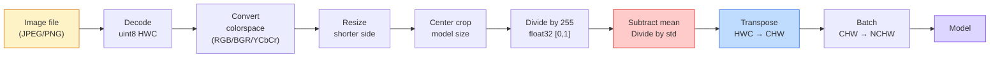
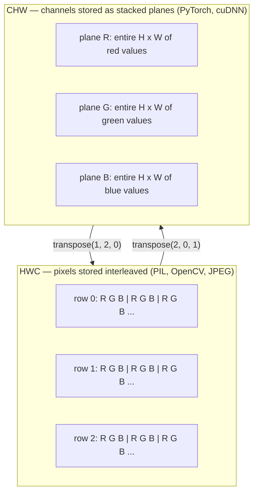

# 图像基础 像素,通道和颜色空间

> 图像是光样本的数. 你将使用的每个视觉模型都从这个一个事实开始.

> **【中文解读】**图像本质上是一个光线采样值的张量群.无论是手机拍照,自动驾驶还是GPT-4V,所有视觉模型都来自于这个基本事实.

**Type:** Build | **类型:** 动手
**Languages:** Python | **语言:** Python
**Prerequisites:** Phase 1 Lesson 12 (Tensor Operations), Phase 3 Lesson 11 (Intro to PyTorch) | **前置知识:** Phase 1 Lesson 12（张量运算）、Phase 3 Lesson 11（PyTorch 入门）
**Time:** ~45 minutes | **时间:** ~45 分钟

## 学习目标

- 解释一个连续场景如何被分化为像素,以及为什么采样/量化决定对每一个下游模型设定了上限
  中文翻译:解释连续场景如何被分化为像素,以及为什么采样/量化决策决定了所有下游模型的上限
- 读取,切片,检查图像作为NumPy阵列,并流动地切换HWC和CHW布局
  中文翻译:读取、切片、检查图像的NumPy 数组表示,并自动切换HWC和CHW布局之间
- 将RGB,灰度,HSV和YCbCr之间的转换,并证明每个颜色空间存在的原因
  中文翻译:在RGB、灰度、HSV和YCbCr之间转换,并说明了每种颜色空间存在的原因
- 应用像素级预处理 (规范化,标准化,大小化,频道第一) 正如预训练的 PyTorch 视觉模型所预期的那样
  中文翻译:精确按照预训练 PyTorch 视觉模型的期望做像素级预处理(归一化、标准化、缩放、通道前置)

## 问题 问题引入

每篇你读的论文,每篇你下载的预训练重量,每一个你打电话的视觉API都假设输入的特定编码.`uint8`模型想要的图像`float32`运行,然后默默产生垃圾. 输送BGR到一个RGB训练的网络,准确性下降了10点. 输入一个模型道,最后输入当它预期道时,第一层的 conv 处理高度作为功能道.这都不会造成错误.它只会毁掉你的测量,你花了一个星期在寻找一个bug,生活在你加载文件的方式.

> 你将阅读的每篇论文,下载的每一个预训练权重,调用的每一个视觉API,都假设一个特定的输入编码.`uint8`图像传给需要`float32`模型仍然运行但默默产生垃圾结果 把BGR给了RGB上训练的网络,准确率暴跌十百分点把通道在最后输入传递给预期通道 在最前的模型中,第一个卷积层将高度视为特征通道──这些都不会抛出错误,只会毁掉你的标志,让你花一周时间寻找存在于文件加载方式中的错误──

> **【中文解读】**这是计算机视觉工程中最常见的隐性 bug 来源:数据格式不匹配.模型不会报错,但结果完全错误.例如把BGR (OpenCV) 默认成RGB (PyTorch默认) 给模型,准确率可能暴跌10个百分点.

一个卷积不复杂,一旦你知道它在滑过什么.难的是",图像"意味着相机,JPEG解码器,PIL,OpenCV,火视觉和CUDA内核的不同东西.每个堆都有自己的轴序,字节范围和频道会议.一个视觉工程师不能保持这些直线船的破碎管道.

> 一旦你知道卷积在什么上滑,它并不复杂. 困难部分在于"图像"对相机,JPEG解码器,PIL,OpenCV,火视觉和CUDA内核来说意味着不同的东西. 每一个技术都有自己的轴序,字节范围和通道约定.

通过这个课程,你将知道一个像素是什么,为什么每个像素有三个数字,而不是一个, "通过图像网统计正常化"实际上是什么,以及如何在这个阶段的每一个课程所假设的两个或三个布局之间移动.

> 在本课程的实际基础上,以便在本阶段的其余课程可以建立在此基础上. 学习完毕后,你将知道像素是什么,为什么每个像素有三个数字而不是一个,

> **【拓展：数据标注与质量】**视觉任务的效果高度依赖标签数据质量――标签工作室、CVAT是主流标签工具――在工业场景中,主动学习(主动学习) 可以减少标签成本:模型对不确定的样本请求人工标签,确定性的样本自动标签――

## 概念的核心概念

### 预处理流水线全景

每个生产视觉系统都是相同的逆转变序列. 一步错误,模型会看到不同的输入.

> 每个生产级视觉系统都是相同的可逆变变序列.



两个红色和蓝色的框中,80%的默默失误存在:缺乏标准化和错误的布局.

> 红色和蓝色的两个方框是80%的静默失败所在:缺乏标准化和错误的布局.

> **【中文解读】**隐性错误的80%集中在两个环节: 1) 没有做标准化, 2) 数据布局做错了,

### 像素是样本,不是方形.

摄像头传感器计算着落在一个小探测器的电网上的光子.每个探测器集成光子,每秒的部分,并发出与相应的电压.

> 相机传感器统计落在微小探测器网格上的光子数量――每一个探测器在一小段时间内积分光线,并发射与击中它的光子数量成正比电压――传感器随后将电压分离成整数――一个探测器就变成一个像素――

```
Continuous scene                 Sensor grid                     Digital image
(infinite detail)                (H x W detectors)               (H x W integers)

    ~~~~~                        +--+--+--+--+--+                 210 198 180 155 120
   现在,我们在这个世界里,
  没有任何东西,没有任何东西.
   ~~~~~                         |  |  |  |  |  |                 195 185 170 148 112
                                 +--+--+--+--+--+                 188 180 165 145 108
```

在这个阶段,有两个选择,

- **Spatial sampling**太少,边缘会变得化.太多,储存和计算会爆炸.
  中文翻译:空间采样决定场景每度有多少探测器──太少则边缘出现(混叠)──太多则储存和计算量暴增──
- **Intensity quantization**电压的细度决定了电压的细度. 8位为 256 层次,并且是显示标准的. 10, 12, 16位为医疗成像,高清和原始传感器管道提供更平滑的梯度和材料.
  中文翻译:强度量化决定电压被分得多细.8位给出 256个级别,是显示标准.10、12、16位为医学成像、HDR 和原始传感器流水线提供更平滑的梯度.

像素不是一个有色的方形,面积.它是一个单一的测量.当你改变尺寸或旋转时,你正在重新样本测量格.

> 像素不是一个面积的彩色方块. 它是一个测量. 当你缩小或旋转时,你重采样那个测量网格.

> **【中文解读】**像素不是一个小方块,而是一个采样点传感器在某个空间位置测量的一个数值.

### 为什么有三个通道?

一个探测器在整个可见光谱中计算光子,即灰度.为了获得颜色,传感器将红色,绿色和蓝色过器的摩赛克覆盖电网.在测试后,每个空间位置都有三个整数:红色过器的响应,绿色过器和蓝色过器附近.这些三个整数是像素的RGB三分组.

> 一个探测器统计整个可见光谱上的光子那就是灰度――为了获得颜色,传感器使用红、绿、蓝光片的马赛克覆盖网格――去马赛克后,每个空间位置有三个整数:红光探测器、绿光探测器和蓝光探测器的响应值――这些三整数是一个像素的RGB三元组――

```
One pixel in memory:

    (R, G, B) = (210, 140, 30)   <- reddish-orange

An H x W RGB image:

    shape (H, W, 3)     stored as   H rows of W pixels of 3 values
                                    each in [0, 255] for uint8
```

三不是魔法.深度摄像头添加Z频道.卫星添加红外线和紫外线带.医疗扫描通常有一个频道 (X射线,CT) 或许多 (超谱).频道数量是最后一个轴;层学会在它上混合.

> 三不是魔法――深度摄像头增加Z通道――卫星增加红外和紫外波段――医学扫描通常有一个通道――X光、CT) 或许多通道――高光谱――通道数是最后一个轴;卷积层学习跨通道混合――

> **【拓展：多通道图像】**卫星遥感图像通常具有红外,紫外等额外波段 (多光谱/高光谱);医疗CT 只有一个通道;深度摄像头 (如Kinect、iPhone LiDAR) 将增加深度通道 D──这些多通道图像在农业监测,医学诊断和自动驾驶中广泛应用──

### 两种布局约定:HWC和CHW

每个图书馆都选择一个.

> 两种排序,每个人都选择一种.

```
HWC (height, width, channels)           CHW (channels, height, width)

   W ->                                    H ->
  +-----+-----+-----+                     +-----+-----+
H |R G B|R G B|R G B|                   C |R R R R R R|
| +-----+-----+-----+                   | +-----+-----+
v |R G B|R G B|R G B|                   v |G G G G G G|
  +-----+-----+-----+                     +-----+-----+
                                          |B B B B B B|
                                          +-----+-----+

   PIL, OpenCV, matplotlib,              PyTorch, most deep learning
   almost every image file on disk       frameworks, cuDNN kernels
```

CHW存在于卷积内核通过H和W滑动的原因.保持频道轴首先意味着每个内核每个频道都会看到连接的2D平面,这可以清洁地向量化.磁盘格式保持HWC,因为这与扫描线如何从传感器中出发相匹配.

> 由于卷积核在H 和 W 上滑动.保持通道轴在最前面意味着每个核看到的每个通道的连续2D平面,可以干净地向量化.

> **【中文解读】**HWC(高×宽×通道) 是 PIL、OpenCV等库的默认格式,也是图像文件在磁盘上存储方式──CHW(通道×高×宽) 是 PyTorch 和 GPU 计算的格式,因为卷积核在 H 和 W 上滑时,通道前置使每个核看到的是连续的 2D 平面,计算效率更高──两者之间的转换是每天都要写无数次操作──

单行转换将会打字千次:

> 你会打一千遍的单行转换:

```
img_chw = img_hwc.transpose(2, 0, 1)      # NumPy
img_chw = img_hwc.permute(2, 0, 1)        # PyTorch tensor
```

存储器配置,可视化:

> 存储布局可视化:



### 字节范围和数据类型

现在有三次会议:

> 三种定位主导地位:

| Convention | dtype | Range | Where you see it |
|------------|-------|-------|------------------|
| Raw | `uint8` | [0, 255] | Files on disk, PIL, OpenCV output |
| Normalized | `float32` | [0.0, 1.0] | After `img.astype('float32') / 255` |
| Standardized | `float32` | roughly [-2, +2] | After subtracting mean and dividing by std |

缩网络是基于标准化输入训练的.`mean=[0.485, 0.456, 0.406]`现在`std=[0.229, 0.224, 0.225]`计算在 [0, 1]正常化像素上,对整个ImageNet训练集中的三个频道的算术平均和标准偏差.`uint8`应用视觉中最常见的单一默失败是预期标准化的浮动模型.

> 卷积网络在标准化输入上训练的.`mean=[0.485, 0.456, 0.406]`,我知道.`std=[0.229, 0.224, 0.225]`是整个图像网的训练集三通道的算术平均值和标准差,在 [0, 1] 归结像素上计算.`uint8`给期望标准化浮点数的模型是应用视觉中最常见的静默失败.

> **【中文解读】**三种数据范围:(1) uint8 [0,255] 文件/PIL/OpenCV的原始输出;(2) float32 [0,1] 归化后;(3) float32 ≈[-2,+2]  ImageNet 标准化后;;把 uint8 直接给期望的标准化输入的模型,是最常见的"静默失败"──ImageNet的平均值和标准差值是整个训练集预测出来的,几乎所有训练模型都使用了这个组数量──

### 颜色空间和它们存在的原因

RGB是捕获格式,但它并不总是模型中最有用的表示.

> RGB 是捕获格式,但并不总是对模型最有用的表示.

```
 RGB               HSV                       YCbCr / YUV

 R red             H hue (angle 0-360)       Y luminance (brightness)
 G green           S saturation (0-1)        Cb chroma blue-yellow
 B blue            V value/brightness (0-1)  Cr chroma red-green

 Linear to         Separates color from      Separates brightness from
 sensor output     brightness. Useful for    color. JPEG and most video
                   color thresholding, UI    codecs compress the chroma
                   sliders, simple filters   channels harder because the
                                             human eye is less sensitive
                                             to chroma detail than to Y.
```

在大多数现代CNN中,你能播放RGB,你会遇到其他空间,

> 对于大多数现代CNN,你输入RGB──你在以下场景会遇到其他色彩空间:

- **HSV**经典简历代码,基于颜色的细分,白色平衡.
  中文翻译:经典简历代码、基于颜色的分化、白平衡──
- **YCbCr**阅读JPEG内部,视频管道,仅使用Y的超级分辨率模型.
  中文翻译:读取JPEG内部结构、视频流水线、仅在Y通道上操作的超分辨率模型──
- **Grayscale** OCR,文件模型,任何颜色是扰动变量而不是信号的情况.
  中文翻译:OCR、文档模型、颜色是干扰变量而不是信号的任何场景.

根据RGB的灰度尺度是重量总数,而不是平均值,因为人类眼睛对绿色更敏感,而不是红色或蓝色:

> 从RGB来看,转灰度是加权和,而不是平均值,因为人眼对绿色更敏感于红色或蓝色:

```
Y = 0.299 R + 0.587 G + 0.114 B       (ITU-R BT.601, the classic weights)
```

### 宽高比,缩放和插值

每个模型都有固定输入尺寸 (224x224对于大多数ImageNet分类器,384x384或512x512对于现代探测器).您的图像很少匹配.

> 每个模型都有固定的输入尺寸.大多数图像网分类器为224x224,现代检测器为384x384或512x512.

- **Resize shorter side, then center crop**标准的图像网配方. 保存面积比例,抛弃边缘像素的条纹.
  中文翻译:缩放短边然后中心剪裁标准图像网做法──保持宽高比,丢弃一条边缘像素──
- **Resize and pad**保存视角比率和每个像素,添加黑色条.
  中文翻译:缩放并填充保持宽高比和每个像素,添加黑边──检测和OCR的标准做法──
- **Resize directly to target**拉伸图像. 廉价,扭曲几何,对许多分类任务很好.
  中文翻译:直接缩小到目标尺寸拉伸图像──成本低,扭曲几何形状,但对许多分类任务足够──

插射方法决定了当新网格不与旧网格一致时,中间像素的计算方式:

> 插值方法决定当新网格与旧网格不一致时如何计算中间像素:

```
Nearest neighbour     fastest, blocky, only choice for masks/labels
Bilinear              fast, smooth, default for most image resizing
Bicubic               slower, sharper on upscaling
Lanczos               slowest, best quality, used for final display
```

基本规则:训练的双线,你将查看的资产的双立方或双立方,

> 经验法则:用双线性训练,用双三次或兰茨子展示,包含整数类别ID的近邻.

> **【中文解读】**缩放时的插值方法选择:近邻 (近邻) 速度最快但会产生,仅用于掩码/标签图;双线性 (双线性) 又快又平滑,是训练时的默认选择;双三次 (二立方) 慢但放大时更清晰;兰子 最慢但质量最好――经验法则:训练用二线性,展示用双立方/兰子,标签用近距离――

> **【拓展：工业部署中的视觉系统】**在实际工业部署中,视觉模型需要考虑推迟模型大小的边缘设备适应等问题.
```figure
conv-output-size
```

## 建立它 动手实践

### 构建图像张量并检查其形状.

开始使用确定性合成图像,所以第一个实验室只使用NumPy进行离线运行.文件解码是一个独立的边界:一旦JPEG或PNG解码器返回RGB字节,下面的每个数操作都是相同的.

> 从一个确定性的合成图像开始,让第一个实验只需要NumPy才能离线运行.文件解码是另一边界:一旦JPEG或PNG解码器返回RGB字节,下面的每个张量操作都是相同的.

```python
import numpy as np

def synthetic_rgb(h=128, w=192, seed=0):
    rng = np.random.default_rng(seed)
    yy, xx = np.meshgrid(np.linspace(0, 1, h), np.linspace(0, 1, w), indexing="ij")
    r = (np.sin(xx * 6) * 0.5 + 0.5) * 255
    g = yy * 255
    b = (1 - yy) * xx * 255
    rgb = np.stack([r, g, b], axis=-1) + rng.normal(0, 6, (h, w, 3))
    return np.clip(rgb, 0, 255).astype(np.uint8)

arr = synthetic_rgb()

print(f"type:   {type(arr).__name__}")
print(f"dtype:  {arr.dtype}")
print(f"shape:  {arr.shape}     # (H, W, C)")
print(f"min:    {arr.min()}")
print(f"max:    {arr.max()}")
print(f"pixel at (0, 0): {arr[0, 0]}")
```

预期产量:`shape: (H, W, 3)`现在`dtype: uint8`范围`[0, 255]`这就是可行的解码表示,无论字节来自摄像头,图像解码器,或者这个合成发电机.

> 预期输出:`shape: (H, W, 3)`,我知道.`dtype: uint8`范围`[0, 255]`,这就是解码后规范表示,无论字节来自相机,图像解码器还是这个合成生成器.

### 排行第二步:分开通道并重排布局

单独取出R,G,B,然后从HWC转换为PyTorch的CHW.

> 分别提取R、G、B,然后将HWC转换为CHW以供PyTorch使用.

```python
R = arr[:, :, 0]
G = arr[:, :, 1]
B = arr[:, :, 2]
print(f"R shape: {R.shape}, mean: {R.mean():.1f}")
print(f"G shape: {G.shape}, mean: {G.mean():.1f}")
print(f"B shape: {B.shape}, mean: {B.mean():.1f}")

arr_chw = arr.transpose(2, 0, 1)
print(f"\nHWC shape: {arr.shape}")
print(f"CHW shape: {arr_chw.shape}")
```

只有一个道,三个灰度平面.CHW只需要重新排序轴,如果内存布局允许,则不需要任何数据副本.

> 只有重新排序轴;当内存布局允许时,不严格要求复制数据.

### 转换的速度和速度.

按重量和灰度,然后是手动RGB到HSV.

> 增加权求和灰度,然后手动实现RGB转换HSV.

```python
def rgb_to_grayscale(rgb):
    weights = np.array([0.299, 0.587, 0.114], dtype=np.float32)
    return (rgb.astype(np.float32) @ weights).astype(np.uint8)

def rgb_to_hsv(rgb):
    rgb_f = rgb.astype(np.float32) / 255.0
    r, g, b = rgb_f[..., 0], rgb_f[..., 1], rgb_f[..., 2]
    cmax = np.max(rgb_f, axis=-1)
    cmin = np.min(rgb_f, axis=-1)
    delta = cmax - cmin

    h = np.zeros_like(cmax)
    mask = delta > 0
    argmax = np.argmax(rgb_f, axis=-1)
    rmax = mask & (argmax == 0)
    gmax = mask & (argmax == 1)
    bmax = mask & (argmax == 2)
    h[rmax] = ((g[rmax] - b[rmax]) / delta[rmax]) % 6
    h[gmax] = ((b[gmax] - r[gmax]) / delta[gmax]) + 2
    h[bmax] = ((r[bmax] - g[bmax]) / delta[bmax]) + 4
    h = h * 60.0

    s = np.divide(delta, cmax, out=np.zeros_like(delta), where=cmax > 0)
    v = cmax
    return np.stack([h, s, v], axis=-1)

gray = rgb_to_grayscale(arr)
hsv = rgb_to_hsv(arr)
print(f"gray shape: {gray.shape}, range: [{gray.min()}, {gray.max()}]")
print(f"hsv   shape: {hsv.shape}")
print(f"hue range: [{hsv[..., 0].min():.1f}, {hsv[..., 0].max():.1f}] degrees")
print(f"sat range: [{hsv[..., 1].min():.2f}, {hsv[..., 1].max():.2f}]")
print(f"val range: [{hsv[..., 2].min():.2f}, {hsv[..., 2].max():.2f}]")
```

图表以度,和值出现在 [0, 1]. 这与OpenCV相匹配`hsv_full`会议.

> 颜相以度数输出,和度和明度在 [0, 1] 范围内.`hsv_full`约定一致.

### 标准化,标准化,反转.

通过原始字节,到一个预先训练的图像网模型所期望的精确数,然后回来.

> 从原始字节到预训练 模型期望的精确张量,再返回──

```python
mean = np.array([0.485, 0.456, 0.406], dtype=np.float32)
std = np.array([0.229, 0.224, 0.225], dtype=np.float32)

def preprocess_imagenet(rgb_uint8):
    x = rgb_uint8.astype(np.float32) / 255.0
    x = (x - mean) / std
    x = x.transpose(2, 0, 1)
    return x

def deprocess_imagenet(chw_float32):
    x = chw_float32.transpose(1, 2, 0)
    x = x * std + mean
    x = np.clip(x * 255.0, 0, 255).astype(np.uint8)
    return x

x = preprocess_imagenet(arr)
print(f"preprocessed shape: {x.shape}     # (C, H, W)")
print(f"preprocessed dtype: {x.dtype}")
print(f"preprocessed mean per channel:  {x.mean(axis=(1, 2)).round(3)}")
print(f"preprocessed std  per channel:  {x.std(axis=(1, 2)).round(3)}")

roundtrip = deprocess_imagenet(x)
max_diff = np.abs(roundtrip.astype(int) - arr.astype(int)).max()
print(f"roundtrip max pixel diff: {max_diff}    # should be 0 or 1")
```

预处理/减处理对是每个火视图的准确值.`transforms.Normalize`电话是在盖子下.

> 每个通道的平均值应接近零,标准差接近一.`transforms.Normalize`调用在底层做的事情.

### 步骤5:从零实现缩小

最近的邻居圆每一个输出坐标为一个源像素.双线交差发现四个周围的像素,并通过距离混合它们.下面的两个实现都使用结点一致的坐标,因此第一和最后的源像素保持固定.

> 最近的邻居把每个输出坐标四舍五进一个源像素.双线插值找到四个图像周围并按距离混合.下面的两个实现都使用端点对齐的坐标,使第一个和最后一个源像素保持不动.

```python
def resize_coordinates(source_length, target_length):
    if target_length == 1:
        return np.zeros(1, dtype=np.float32)
    return np.linspace(0, source_length - 1, target_length, dtype=np.float32)

def nearest_resize(image, target_height, target_width):
    y = np.rint(resize_coordinates(image.shape[0], target_height)).astype(int)
    x = np.rint(resize_coordinates(image.shape[1], target_width)).astype(int)
    return image[y[:, None], x[None, :]]

def bilinear_resize(image, target_height, target_width):
    y = resize_coordinates(image.shape[0], target_height)
    x = resize_coordinates(image.shape[1], target_width)
    y0 = np.floor(y).astype(int)
    x0 = np.floor(x).astype(int)
    y1 = np.minimum(y0 + 1, image.shape[0] - 1)
    x1 = np.minimum(x0 + 1, image.shape[1] - 1)
    wy = (y - y0)[:, None, None]
    wx = (x - x0)[None, :, None]

    source = image.astype(np.float32)
    top = source[y0[:, None], x0[None, :]] * (1 - wx)
    top += source[y0[:, None], x1[None, :]] * wx
    bottom = source[y1[:, None], x0[None, :]] * (1 - wx)
    bottom += source[y1[:, None], x1[None, :]] * wx
    result = top * (1 - wy) + bottom * wy
    return np.clip(np.rint(result), 0, 255).astype(image.dtype)

target_height = arr.shape[0] * 3
target_width = arr.shape[1] * 3
nearest = nearest_resize(arr, target_height, target_width)
bilinear = bilinear_resize(arr, target_height, target_width)

def local_roughness(x):
    gy = np.diff(x.astype(float), axis=0)
    gx = np.diff(x.astype(float), axis=1)
    return float(np.abs(gy).mean() + np.abs(gx).mean())

for name, out in [("nearest", nearest), ("bilinear", bilinear)]:
    print(f"{name:>8}  shape={out.shape}  roughness={local_roughness(out):6.2f}")
```

接近的比分在粗度上最高,因为它保持硬边缘.双线性比分更平滑,因为每个新的像素都在每个轴上混合了两个位置.可运行的伴侣用Catmull-Rom立方核将相同的可分离的想法扩展到每个轴的四个邻居,然后在没有图像库的情况下打印所有三个结果.

> 最近的邻居粗度得分最高,因为它保留了硬边缘.双线性更平滑,因为每个新图像都在每个轴上混合两个位置.可运行的配套代码将相同的可分离的思路扩展到每个轴的四个邻居.

> **【中文解读】**新版第5步从"调 PIL 的尺寸"改为"从零实现近邻与双线性"这是Build It 精神的回归:先用纯数Py理解插值的坐标映射(`np.linspace`端点对齐+索引集集),再去看库的封装――配套的`code/main.py`实现了Catmull-Rom 双三次核,使用相同的可分权重印印下最接近/千亿/两立方三种结果对比.

## 实际应用.

皮托奇在批量,设备意识的光器上执行相同操作.下面的代码将更短的侧面改大小,取一个中心作物,标准化每个频道,并产生预训练模型预期的NCHW光器.

> 在批量化、感知设备的张量上执行相同操作──下面的代码缩短了短边、中心剪切、逐通道标准化,并产生了预训练模型预期的NCHW张量──

```python
import torch
import torch.nn.functional as F

image_hwc = torch.from_numpy(synthetic_rgb(256, 320))
batch = image_hwc.permute(2, 0, 1).unsqueeze(0).float() / 255.0

height, width = batch.shape[-2:]
scale = 256 / min(height, width)
resized_height = round(height * scale)
resized_width = round(width * scale)
batch = F.interpolate(
    batch,
    size=(resized_height, resized_width),
    mode="bilinear",
    align_corners=False,
    antialias=True,
)

top = (resized_height - 224) // 2
left = (resized_width - 224) // 2
batch = batch[:, :, top:top + 224, left:left + 224]

mean = torch.tensor([0.485, 0.456, 0.406]).view(1, 3, 1, 1)
std = torch.tensor([0.229, 0.224, 0.225]).view(1, 3, 1, 1)
batch = (batch - mean) / std

print(f"tensor dtype: {batch.dtype}")
print(f"batched shape: {tuple(batch.shape)}")
print(f"per-channel mean: {batch.mean(dim=(0, 2, 3)).tolist()}")
print(f"per-channel std:  {batch.std(dim=(0, 2, 3)).tolist()}")
```

按照这个顺序进行四步:将字节转换为浮动,将HWC换为NCHW,将较短的侧面的尺寸改为256,取一个224x224的中心作物,然后减去ImageNet的平均值并按其标准偏差划分.逆转这个顺序默默改变到达模型的结果.

> 四个步骤,按照这个精确的顺序:把字节转为浮点并将HWC转为NCHW,把短边缩小到256,取224x224的中心剪切,然后减去ImageNet平均值并除了其标准差.

> **【中文解读】**新版"用框架实现"从`torchvision.transforms`换成裸体`torch`其他`torch.nn.functional`转移→不压缩 换布局`F.interpolate`缩放短边(注意 `antialias=True`与`align_corners=False`这两个生产级默认值) 张量切片做中心切片 广播减平均值除标准差.`transforms.Compose`底下每一步的真实形状变化批量维(N)始终在第0轴――

## 发送产品出货

这一课产生了:

> 本课产出:

- `outputs/prompt-vision-preprocessing-audit.md`一个提示,将任何模型卡或数据集卡变成一个精确的预处理变量清单,团队必须遵守.
  翻译: 中文`outputs/prompt-vision-preprocessing-audit.md` 将任意模型卡或数据集卡转换为团队必须遵守预处理不变量清单的提示词.
- `outputs/skill-image-tensor-inspector.md`一个技能,在任何图像形的子或阵列中,报告d类型,布局,范围,以及它看起来是否原始,正常或标准.
  翻译: 中文`outputs/skill-image-tensor-inspector.md` 一个技能:给出任意图像形状的张量或数组,报告其dtype、布局、值范围,以及它看起来是原始、归纳化或标准化.

## 练习题

> **【中文解读】**练习题按照易/中/难 三个难度递进;;建议至少完成中级题,Hard级适合深入研究或面试准备;;

1. **(Easy)**创建一个2x2 RGB `uint8`转换HWC为CHW,然后再再转换,打印两种形状,证明回路保存了每一个值.
   中文翻译:创建一个包含四种不同的颜色的2x2RGB `uint8`数组──在HWC和CHW之间来回转换,打印两种形状,并证明往返转换保住每个值──
2. **(Medium)**写下`standardize(img, mean, std)`它们的相反,`roundtrip_max_diff <= 1`您的功能必须在HWC中的单个图像和NCHW中的一批相同的呼叫上工作.
   中文翻译:编写 `standardize(img, mean, std)`及其反函数,要求在任意的图像上通过`roundtrip_max_diff <= 1`测试,且同调用既支持单张图(HWC) 也支持批量(NCHW) 👇
3. **(Hard)**运行一个1x1 conv,学习RGB的重量混合物,成一个灰色频道.`[0.299, 0.587, 0.114]`结它们,并检查输出与手册匹配`rgb_to_grayscale`其他经典的颜色空间转换可以写成1x1卷曲?
   中文翻译:取一个三通道 ImageNet 标准化张量,送入一个把 RGB 加权混合成单通道灰度的 1x1卷积.把权重初始化为`[0.299, 0.587, 0.114]`结论,验证输出与手动`rgb_to_grayscale`差异在浮点差异内. 思考:还有什么经典的色彩空间变化可以写成1x1卷?

## 关键词 关键词

| Term | What people say | What it actually means |
|------|----------------|----------------------|
| Pixel | "A coloured square" | One sample of light intensity at one grid location — three numbers for colour, one for grayscale |
| Channel | "The colour" | One of the parallel spatial grids stacked into an image tensor; last axis in HWC, first in CHW |
| HWC / CHW | "The shape" | Axis orderings for an image tensor; disk and PIL use HWC, PyTorch and cuDNN use CHW |
| Normalize | "Scale the image" | Divide by 255 so pixels live in [0, 1] — necessary but not sufficient |
| Standardize | "Zero-center" | Subtract mean and divide by std per channel so the input distribution matches what the model was trained on |
| Grayscale conversion | "Average the channels" | A weighted sum with coefficients 0.299/0.587/0.114 that matches human luminance perception |
| Interpolation | "How resize picks pixels" | The rule that decides output values when the new grid does not align with the old one — nearest for labels, bilinear for training, bicubic for display |
| Aspect ratio | "Width over height" | The ratio that distinguishes "resize and pad" from "resize and stretch" |

> 术语对照:Pixel=像素、道=通道、正常化=归一化、标准化=标准化、灰度转换=灰度转换、插值=插值、面积比率=宽高比──完整中文释义见 zh.md 的术语表──

## 继续阅读 继续阅读

- [Charles Poynton — A Guided Tour of Color Space](https://poynton.ca/PDFs/Guided_tour.pdf)最清晰的技术处理为什么有这么多的颜色空间,
  中文翻译:查尔斯·波恩顿彩色空间导览解释为什么有这么多彩色空间,各自何时最重要的清晰技术论述──
- [PyTorch Vision Transforms Docs](https://pytorch.org/vision/stable/transforms.html)你实际上将在生产中构成的全部转换管道
  中文翻译:PyTorch Vision Transforms 文档生产环境中你真正要组合的完整变换流水线――
- [How JPEG Works (Colt McAnlis)](https://www.youtube.com/watch?v=F1kYBnY6mwg)对色子样本,DCT的明确视觉巡回,以及为什么JPEG编码为YCbCr而不是RGB
  中文翻译:JPEG 是如何工作的(视频) 色度子采样、DCT以及JPEG 为何编码YCbCr而不是RGB的直观讲解──
- [ImageNet Preprocessing Conventions (torchvision models)](https://pytorch.org/vision/stable/models.html)对真理的来源`mean=[0.485, 0.456, 0.406]`为什么动物园里的每个模特都会期待它
  中文翻译:torchvision 模型的图像网 预处理约定`mean=[0.485, 0.456, 0.406]`权力来源以及为什么整个模型都使用它.
