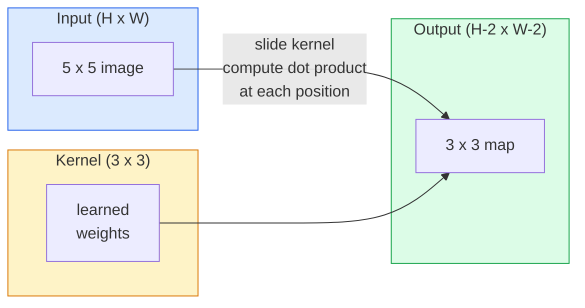
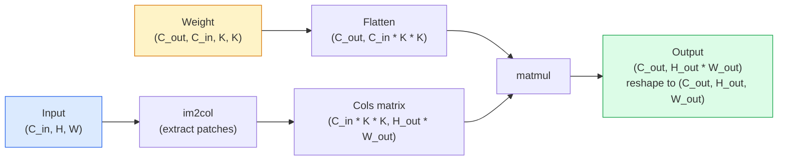

# 从零实现卷积

> 卷积是一个小的密集层,你在图像上滑过,在每个位置都分享相同的重量.

> **【中文解读】**卷积本质上是一个"滑动的小型全连接层"使用同一组权重在图像的每个位置计算点积.这给了我们两个关键特性:平移等变性 (输入移动,输出跟着移动) 和参数共享 (同一个特征检测器在整个图像上复用) .CNN 之所以能统治计算机视觉十余年 (2012-2020),正是因为卷积是图像数据的正确归纳偏移.

**Type:** Build | **类型:** 动手
**Languages:** Python | **语言:** Python
**Prerequisites:** Phase 3 (Deep Learning Core), Phase 4 Lesson 01 (Image Fundamentals) | **前置知识:** Phase 3（深度学习核心），Phase 4 Lesson 01（图像基础）
**Time:** ~75 minutes | **时间:** ~75 分钟

## 学习目标

- 实现从零开始的2D卷积,仅使用NumPy,包括嵌套循环版本和向量化`im2col`版本
  仅使用NumPy 从零实现 2D卷积,包括嵌套循环版和向量化 im2col 版
- 计算输出空间大小,内核大小,填充和步骤的任何组合,并证明`(H - K + 2P) / S + 1`公式
  计算任意输入大小,核大小,填充和步幅组合下输出尺寸,理解公式`(H - K + 2P) / S + 1`
- 手工设计的核子 (边缘,模糊,尖,) 并解释为什么每个核子都产生其活动模式
  手动设计核 (边缘检测,模糊,化,Sobel),解释为什么每种核产生应对的激活模式
- 堆卷入特征提取器,将堆深度连接到接收场大小
  了解堆积深度与感觉野大小的关系

> **【中文解读】**学习目标列出了课程完成后应掌握的核心能力.建议在开始学习前先浏览目标,学习完后对照检查是否已实现.


## 问题 问题引入

对于一个224x224RGB图像的完全连接层,每一个神经元需要224*224*3=150,528个输入权重. 一个隐藏的层有1000个单位,已经有1亿5千万个参数, 更糟糕的是,那层没有任何概念, 上左边的狗和右边的狗是相同的模式. 它将每个像素位置视为独立的, 这对图像来说是完全错误的: 将猫翻译成3像素不应该迫使网络重新学习这个概念.

> 在224x224 RGB图像上,每个神经层需要224 *224 *3 =150,528个输入权重.一个只有1000个单元的隐藏层已经有15亿个参数,你学到任何有用的东西之前.更糟糕的是,那层不知道左角上狗和右角下狗是相同的模式. 它把每个图像位置视为独立的,这对图像来说恰恰是错误的:将猫平移三个图像不应该迫使网络重新学习这个概念.

> **【中文解读】**全连接层处理图像有两个致命问题: 1) 参数爆炸224x224 图像的每个神经元需要15万个权重; 2) 没有平移不变性左上角猫和右下角猫被视为完全不同的模式.

图像模型需要的两个特性是**translation equivariance**(输出转移时输入转移) 和**parameter sharing**密集层给你没有一个. 缩给你免费的两个.

> 图像模型需要的两个特征是**平移等变性**(输入移动时输出也移动) 和**参数共享**连接层两层都不给.

缩并不是用于深度学习.它是支持JPEG压缩,Photoshop中的高斯模糊,工业视觉中的边缘检测和所有有史以来发送的音频过器的相同操作.CNN在2012年至2020年期间占据了ImageNet的地位,原因是缩是相近的值相关的数据的正确前线,并且可以在任何地方出现相同的模式.

> 卷积并不是为深度学习而发明的. 它驱动JPEG压缩,Photoshop高斯模糊,工业视觉边缘检测和所有音频波器的相同操作.CNN从2012年到2020年统治的ImageNet的原因是卷积对邻近值相关,并且相同的模式可以出现在任何位置的数据都是正确的先验.

> **【拓展：CNN 的工业应用】**卷积并非深度学习发明的──JPEG 压缩、Photoshop 模糊、工业视觉边缘检测、音频波器都使用卷积──在人工智能领域,CNN 驱动了自动驾驶中的目标检测(YOLO)、医学影像分析、人脸识别(FaceNet) 等核心应用──

## 概念的核心概念

### 一个核子,滑动一个核子,滑过全图

2D卷积采用一个称为内核 (或过器) 的小重量矩阵,将其滑过输入,并在每个位置计算元素智能的产品的总和.

> 2D卷积取一个称为核波器的小权重矩阵,在输入上滑动它,在每个位置计算每个元素乘积之和.



具体的3x3示例,在5x5输入 (无填充,步骤1):

> 在 5x5 输入上的具体 3x3示例(无填充,步幅 1):

```
Input X (5 x 5):                Kernel W (3 x 3):

  1  2  0  1  2                   1  0 -1
  0  1  3  1  0                   2  0 -2
  2  1  0  2  1                   1  0 -1
  1  0  2  1  3
  2  1  1  0  1

The kernel slides across every valid 3 x 3 window. Output Y is 3 x 3:

 Y[0,0] = sum( W * X[0:3, 0:3] )
 Y[0,1] = sum( W * X[0:3, 1:4] )
 Y[0,2] = sum( W * X[0:3, 2:5] )
 Y[1,0] = sum( W * X[1:4, 0:3] )
 ... and so on
```

这一公式**shared weights, locality, sliding window**是整个想法. 其余一切都是会计.

> 那一个公式**共享权重、局部性、滑动窗口**就是全部思想. 其他的都是账记.

> **【中文解读】**卷积的全部思想缩为三点:共享权重(同一组参数在所有位置复用) 局部性(每次只看一个小窗口) 滑动窗口(次次遍历所有位置) ⋅输出 Y 的每个元素是核和输入窗口的点积──

### 输出尺寸公式

鉴于输入空间大小`H`核子大小`K`料`P`走进`S`其他:

```
H_out = floor( (H - K + 2P) / S ) + 1
```

记住这一点,你将计算每一个建筑数十倍.

> 记住这个公式. 你在每个架构中会计算它几十次.

> **【中文解读】**输出尺寸公式`H_out = floor((H - K + 2P) / S) + 1`是设计任何CNN架构时最常用的计算――"同样的填充"指让H_out = H(当S=1时),此时P = (K-1)/2──这就是为什么3x3核最流行它是最小的奇数核,有明确的中心点──

| Scenario | H | K | P | S | H_out | 中文说明 |
|----------|---|---|---|---|-------|--------|
| Valid conv, no padding | 32 | 3 | 0 | 1 | 30 | 无填充，尺寸缩小 |
| Same conv (preserves size) | 32 | 3 | 1 | 1 | 32 | 同填充，保持尺寸 |
| Downsample by 2 | 32 | 3 | 1 | 2 | 16 | 步幅2，下采样 |
| Pool 2x2 | 32 | 2 | 0 | 2 | 16 | 池化层 |
| Large receptive field | 32 | 7 | 3 | 2 | 16 | 大感受野 |

"同样的填充"意味着选择P,以便H_out=H当S=1.为奇数K,即P= (K - 1) /2.这就是为什么3x3核主导的.它们是最小的奇数核,仍然有一个中心.

### 填充

没有填充,每一个卷积都会缩小特征地图. 堆20个,你的224x224图像变成184x184,这会浪费边界的计算,并使剩余的连接复杂,需要相匹配的形状.

> 没有填充,每卷积都会缩小图片. 堆积20层后,你的224x224图片变成184x184,浪费了边界计算,使得需要匹配形状的残差连接变得复杂.

```
Zero padding (P = 1) on a 5 x 5 input:

  0  0  0  0  0  0  0
  0  1  2  0  1  2  0
  0  0  1  3  1  0  0
  0  2  1  0  2  1  0       Now the kernel can centre on pixel
  0  1  0  2  1  3  0       (0, 0) and still have three rows and
  0  2  1  1  0  1  0       three columns of values to multiply.
  0  0  0  0  0  0  0
```

实践中遇到的模式:`zero`子`reflect`(反射边缘,在生成型号中避免硬边界),`replicate`,,,,,,,,,,,,,,,,,,,,,,,,,,,,,,,,,,,,,,,,,,,,,,,,,,,,,,,,,,,,,,,,,,,,,,,,,,,,,,,,,,,,,,,,,,,,,,,,,,,,,,,,,,,,,,,,,,,,,,,,,,,,,,,,,,,,,,,,,,,,,,,,,,,,,,,,,,,,,,,,,,,,,,,,,,,,,,,,,,,,,,,,,,,,,,,,,,,,,,,,,,,,,,,,,,,,,,,,,,,,,,,,,`circular`(包裹,用于形问题).

> 实践中遇到的模式:`zero`现在,我们要做什么?`reflect`(镜像边缘,避免生成模型中的硬边界)`replicate`没有任何其他方法.`circular`(环绕,用于环面问题)

### 步骤步幅

步骤是滑梯的步骤大小. `stride=1`现在,我们可以在线观看.`stride=2`任何现代建筑 (ResNet,ConvNeXt,MobileNet) 都使用步骤式的轮,而不是最大池.

> 步幅是滑动的步长.`stride=1`是默认的.`stride=2`为了减少空间维度,在CNN内部不使用单独池化层进行采用.

```
Stride 1 on a 5 x 5 input, 3 x 3 kernel:

  starts: (0,0) (0,1) (0,2)        -> output row 0
          (1,0) (1,1) (1,2)        -> output row 1
          (2,0) (2,1) (2,2)        -> output row 2

  Output: 3 x 3

Stride 2 on the same input:

  starts: (0,0) (0,2)              -> output row 0
          (2,0) (2,2)              -> output row 1

  Output: 2 x 2
```

### 通过多个输入道.

实际图像有三个道.RGB输入上的3x3卷积实际上是3x3x3体积:每输入道一个3x3片.在每个空间位置上,你乘以和加在三个片段上并添加一个偏差.

> 真实图像有三个通道.RGB 输入上的3x3卷积实际上是一个3x3x3的体积:每个输入通道是一个3x3片. 在每个空间位置,你跨三个片进行乘法和求和,并加上偏置.

```
Input:   (C_in,  H,  W)        3 x 5 x 5
Kernel:  (C_in,  K,  K)        3 x 3 x 3 (one kernel)
Output:  (1,     H', W')       2D map

For a layer that produces C_out output channels, you stack C_out kernels:

Weight:  (C_out, C_in, K, K)   e.g. 64 x 3 x 3 x 3
Output:  (C_out, H', W')       64 x 3 x 3

Parameter count: C_out * C_in * K * K + C_out   (the + C_out is biases)
```

对于一个模型的设计,最后一行是你计算的.`64 * 3 * 3 * 3 + 64 = 1,792`价格很低.

> 最后一行是你在规划模型时要计算的.`64 * 3 * 3 * 3 + 64 = 1,792`个参数――很便宜――

> **【中文解读】**多通道卷积的参数计算:参数 = C_out × C_in × K × K + C_out (偏置) ⋅一个3 输入通道、64 输出通道的3x3 卷积只需要1,792 个参数,远低于全连接层──这体现了卷积的参数效率──

### 们的技巧

嵌套循环是容易读取的,但慢的.GPU需要大矩阵乘法. 技巧是:将输入的每个接收场窗口平坦成一个大矩阵的列,将内核平坦成一排,整个卷积变成一个单一的矩阵.

> 嵌套循环易读但慢.GPU 需要大矩阵乘法.



每个生产 conv 实现都是这个加上缓存的各种方法 (直接 conv, Winograd,FFT conv 对于大型内核).理解 im2col,你就明白核心.

> 每个生产级卷积实现都是这个的某种变体,加上缓存分块技巧(直接卷积、温格rad、大核的FFT卷积) ;;理解 im2col就理解核心──

> **【拓展：GPU 加速卷积】**所有 GPU 上的卷积实现 (cuDNN) 是 im2col 的变体,加上缓存分块优化 (缓存分块优化) 了.

### 感受野

一个3x3conv看出9个输入像素. 堆叠两个3x3conv和第二层的神经元看出5x5输入像素.三个3x3conv给出7x7. 一般来说:

> 单个3x3卷积看9个输入像素――堆叠两个3x3卷积,第二层神经元看5x5个输入像素――三个3x3卷积给出7x7――一般来说:

```
RF after L stacked K x K convs (stride 1) = 1 + L * (K - 1)

With strides:   RF grows multiplicatively with stride along each layer.
```

整个"3x3全程下降"的原因 (VGG,ResNet,ConvNeXt) 是两个3x3conv看到相同的输入面积,

> "全用3x3" (VGG、ResNet、ConvNeXt) 通路的全部原因是两个3x3卷积看到的输入区域和一个5x5卷积相同,但参数更少,中间还多一个非线性层――

> **【中文解读】**堆叠 L 层 K×K 卷积(步幅为1) 的感受野 = 1 + L × (K-1) ⋅这是VGG、ResNet等网络"全用3x3"的原因:两个3x3 卷积的感受野等于一个5x5,但参数更少,中间还多一个非线性激活层──
```figure
convolution-kernel
```

## 建立它

## 建立它 动手实践

### 填充数组

首先是最小的原始函数:一个函数在H x W阵列周围着零.

> 从最小的原语开始:一个在 H x W 数组周围填充零的函数──

```python
import numpy as np

def pad2d(x, p):
    if p == 0:
        return x
    h, w = x.shape[-2:]
    out = np.zeros(x.shape[:-2] + (h + 2 * p, w + 2 * p), dtype=x.dtype)
    out[..., p:p + h, p:p + w] = x
    return out

x = np.arange(9).reshape(3, 3)
print(x)
print()
print(pad2d(x, 1))
```

追踪轴的技巧`x.shape[:-2]`意思是相同的函数在`(H, W)`现在`(C, H, W)`其他`(N, C, H, W)`没有修改.

> 尾轴技巧 `x.shape[:-2]`意思是相同的函数无需修改即可使用`(H, W)`,我知道.`(C, H, W)`或`(N, C, H, W)`,我知道.

### 步骤2: 嵌套循环实现2D卷积

 缓慢,但明确的参考实施.`torch.nn.functional.conv2d`基本上是这样.

> 为了实现慢,但没有差异.`torch.nn.functional.conv2d`为了做的事情.

```python
def conv2d_naive(x, w, b=None, stride=1, padding=0):
    c_in, h, w_in = x.shape       # 输入：通道数、高、宽
    c_out, c_in_w, kh, kw = w.shape  # 权重：输出通道、输入通道、核高、核宽
    assert c_in == c_in_w          # 输入通道数必须匹配

    x_pad = pad2d(x, padding)     # 填充输入
    h_out = (h + 2 * padding - kh) // stride + 1  # 输出高度
    w_out = (w_in + 2 * padding - kw) // stride + 1  # 输出宽度

    out = np.zeros((c_out, h_out, w_out), dtype=np.float32)
    for oc in range(c_out):               # 遍历每个输出通道
        for i in range(h_out):            # 遍历输出高度
            for j in range(w_out):        # 遍历输出宽度
                hs = i * stride           # 输入中的起始行
                ws = j * stride           # 输入中的起始列
                patch = x_pad[:, hs:hs + kh, ws:ws + kw]  # 提取感受野窗口
                out[oc, i, j] = np.sum(patch * w[oc])      # 点积求和
        if b is not None:
            out[oc] += b[oc]              # 加偏置
    return out
```

它们是基于C_in,kh,kw的隐含数量.

> 这就是你将用来检查每个更快实现的基准真值.

### 步骤3:用手工设计的核核验证验证

建立一个垂直的索贝尔核,将它应用到合成步骤图像上,

> 构建一个垂直的核,将其应用于合成阶梯图像,观察垂直边缘亮起.

```python
def synthetic_step_image():
    img = np.zeros((1, 16, 16), dtype=np.float32)
    img[:, :, 8:] = 1.0
    return img

sobel_x = np.array([
    [[-1, 0, 1],
     [-2, 0, 2],
     [-1, 0, 1]]
], dtype=np.float32)[None]

x = synthetic_step_image()
y = conv2d_naive(x, sobel_x, padding=1)
print(y[0].round(1))
```

预计在第7列 (左到右亮度增加) 和其他地方的零值上,

> 预期第7列有很大的正值 ((从左到右增加亮度),其他地方为零――那一次打印就是数学是否正确的完整性检查――

### 步骤4: 动矩阵开放

转换输入中的每个内核大小的窗口为矩阵的列.`C_in=3, K=3`它们的数量为27个.

> 将输入中每个核小窗口转换为矩阵的一列.`C_in=3, K=3`每列都是27个数量.

```python
def im2col(x, kh, kw, stride=1, padding=0):
    c_in, h, w = x.shape
    x_pad = pad2d(x, padding)
    h_out = (h + 2 * padding - kh) // stride + 1
    w_out = (w + 2 * padding - kw) // stride + 1

    cols = np.zeros((c_in * kh * kw, h_out * w_out), dtype=x.dtype)
    col = 0
    for i in range(h_out):
        for j in range(w_out):
            hs = i * stride
            ws = j * stride
            patch = x_pad[:, hs:hs + kh, ws:ws + kw]
            cols[:, col] = patch.reshape(-1)
            col += 1
    return cols, h_out, w_out
```

现在重量起重将是一个单向的.

> 它仍然是Python循环,但现在繁重的工作将是一个向量化矩阵乘法.

### 步骤5:通过im2col+matmul快速卷积,使用im2col+矩阵乘法加速卷积

换一个矩阵乘法.

> 用一次矩阵乘法替换四重循环.

```python
def conv2d_im2col(x, w, b=None, stride=1, padding=0):
    c_out, c_in, kh, kw = w.shape
    cols, h_out, w_out = im2col(x, kh, kw, stride, padding)
    w_flat = w.reshape(c_out, -1)
    out = w_flat @ cols
    if b is not None:
        out += b[:, None]
    return out.reshape(c_out, h_out, w_out)
```

检查正确性:运行两个实现和比较.

> 正确性检查:运行两个实现并比较.

```python
rng = np.random.default_rng(0)
x = rng.normal(0, 1, (3, 16, 16)).astype(np.float32)
w = rng.normal(0, 1, (8, 3, 3, 3)).astype(np.float32)
b = rng.normal(0, 1, (8,)).astype(np.float32)

y_naive = conv2d_naive(x, w, b, padding=1)
y_im2col = conv2d_im2col(x, w, b, padding=1)

print(f"max abs diff: {np.max(np.abs(y_naive - y_im2col)):.2e}")
```

`max abs diff`应该在附近`1e-5`差异是浮点积累顺序,而不是一个bug.

> `max abs diff`应该在`1e-5`左右差异是浮点累加顺序造成的,不是错误.

### 步骤6: 一组手工设计的经典核

五个过器显示一个单层的可以在任何训练之前表达什么.

> 五个波器显示了在任何训练之前可以表现的单个卷积层.

```python
KERNELS = {
    "identity": np.array([[0, 0, 0], [0, 1, 0], [0, 0, 0]], dtype=np.float32),
    "blur_3x3": np.ones((3, 3), dtype=np.float32) / 9.0,
    "sharpen": np.array([[0, -1, 0], [-1, 5, -1], [0, -1, 0]], dtype=np.float32),
    "sobel_x": np.array([[-1, 0, 1], [-2, 0, 2], [-1, 0, 1]], dtype=np.float32),
    "sobel_y": np.array([[-1, -2, -1], [0, 0, 0], [1, 2, 1]], dtype=np.float32),
}

def apply_kernel(img2d, kernel):
    x = img2d[None].astype(np.float32)
    w = kernel[None, None]
    return conv2d_im2col(x, w, padding=1)[0]
```

应用到任何灰色图像,模糊的软化,尖的升边缘,Sobel-x照亮垂直边缘,Sobel-y照亮水平边缘.这些正是AlexNet和VGG中*第一*训练的 conv层最终学习的模式,因为一个好的图像模型需要边缘和斑点探测器,无论后面的任务是什么.

> 适用于任何灰度图像,模糊柔性、化使边缘清晰、Sobel-x 点亮垂直边缘、Sobel-y 点亮水平边缘──这些正是 AlexNet 和 VGG 中*第一个*训练卷积层最终学到的模式因为一个好的图像模型无论后续任务是什么,都需要边缘和斑点检测器──

> **【拓展：经典卷积核与 CNN 学习】**亚历克斯网等网络的第一卷积层学到的特征几乎总是边缘检测器和颜色斑点检测器与这些手工设计的核高度相似.

## 实际应用.

皮托尔奇的`nn.Conv2d`它们是自动化,CUDA核和cuDNN优化.

> 皮托尔奇的`nn.Conv2d`用自动微分、CUDA 内核和 cuDNN 优化封装了相同的操作──形状语义完全相同──

```python
import torch
import torch.nn as nn

conv = nn.Conv2d(in_channels=3, out_channels=64, kernel_size=3, stride=1, padding=1)
print(conv)
print(f"weight shape: {tuple(conv.weight.shape)}   # (C_out, C_in, K, K)")
print(f"bias shape:   {tuple(conv.bias.shape)}")
print(f"param count:  {sum(p.numel() for p in conv.parameters())}")

x = torch.randn(8, 3, 224, 224)
y = conv(x)
print(f"\ninput  shape: {tuple(x.shape)}")
print(f"output shape: {tuple(y.shape)}")
```

换换`padding=1`为了`padding=0`输出量下降到222x222.`stride=1`为了`stride=2`现在,我们可以把它放在112x112上.

> 让我`padding=1`换成`padding=0`输出降至222x222`stride=1`换成`stride=2`现在,它降到112x112......和你记住的公式一样.


> **【拓展：工业部署中的视觉系统】**在实际工业部署中,视觉模型需要考虑推迟模型大小的边缘设备适应等问题.

## 发送产品出货

这一课产生了:

> 本课产出:

- `outputs/prompt-cnn-architect.md`一个提示,鉴于输入大小,参数预算和目标接收场,设计了一个堆`Conv2d`每一步都用右K/S/P的层.
  中文翻译:给定输入尺寸、参数预算和目标感受野,设计每步具有正确的 K/S/P 的`Conv2d`层堆的提示词――
- `outputs/skill-conv-shape-calculator.md`一个技能,它通过网络规格层次进行行程,并返回每个区块的输出形状,接收场和参数数.
  中文翻译:逐层遍历网络规格并返回每个块的输出形状、感受野和参数数量的技能──

## 练习题

> **【中文解读】**练习题按照易/中/难 三个难度递进;;建议至少完成中级题,Hard级适合深入研究或面试准备;;


1. **(Easy | 简单)**考虑到 128x128 的灰度输入和一个堆积的`[Conv3x3(s=1,p=1), Conv3x3(s=2,p=1), Conv3x3(s=1,p=1), Conv3x3(s=2,p=1)]`通过 PyTorch 检查,可通过手动计算出输出空间大小和每个层的接收场`nn.Sequential`的车.
   手动计算四层卷积的输出尺寸和感受野,使用 PyTorch 验证.

2. **(Medium | 中等)**延长时间`conv2d_naive`其他`conv2d_im2col`接受一个`groups`证明这个.`groups=C_in=C_out`复制了深度曲,并且其参数数数是`C * K * K`没有`C * C * K * K`现在,我们要去.
   扩展卷积函数支持组 参数,验证深度卷积的参数数从C×C×K×K 降至C×K×K。

3. **(Hard | 困难)**执行后退的转移`conv2d_im2col`通过手动计算:鉴于输出梯度,计算出`x`其他`w`检查对`torch.autograd.grad`俩是 im2col 的梯度是`col2im`它们必须积累重叠的窗户.
   手动实现im2col 卷积的反向传播,使用火.autograd.grad 验证――关键:im2col 的梯度是 col2im,需要累加重窗口――

## 关键词 关键词

| Term | What people say | What it actually means | 中文释义 |
|------|----------------|----------------------|---------|
| Convolution | "Sliding a filter" | A learnable dot product applied at every spatial location with shared weights; mathematically a cross-correlation, but everyone calls it convolution | 卷积：在所有空间位置用共享权重做可学习的点积 |
| Kernel / filter | "The feature detector" | A small weight tensor of shape (C_in, K, K) whose dot product with a window of input produces one output pixel | 核/滤波器：小型权重张量，与输入窗口做点积产生一个输出像素 |
| Stride | "How far you jump" | The step size between consecutive kernel placements; stride 2 halves each spatial dimension | 步幅：核每次滑动的步长，步幅2将空间维度减半 |
| Padding | "Zeros on the edges" | Extra values added around the input so the kernel can centre on border pixels; `same` padding keeps output size equal to input size | 填充：在输入边缘补零，使核能对齐边界像素 |
| Receptive field | "How much the neuron sees" | The patch of original input that a given output activation depends on, growing with depth and stride | 感受野：一个输出激活值所依赖的原始输入区域 |
| im2col | "The GEMM trick" | Rearranging every receptive window into columns so convolution becomes one big matrix multiply — the core of every fast conv kernel | im2col：将感受野窗口重排为列，使卷积变成矩阵乘法 |
| Depthwise conv | "One kernel per channel" | A conv with `groups == C_in`, computing each output channel from only its matching input channel; the backbone of MobileNet and ConvNeXt | 深度卷积：每通道独立卷积，MobileNet/ConvNeXt 的核心组件 |
| Translation equivariance | "Shift in, shift out" | Property that shifting the input by k pixels shifts the output by k pixels; comes for free with shared weights | 平移等变性：输入平移k像素，输出也平移k像素 |


> **【拓展：数据标注与质量】**视觉任务的效果高度依赖标签数据质量――标签工作室、CVAT是主流标签工具――在工业场景中,主动学习(主动学习) 可以减少标签成本:模型对不确定的样本请求人工标签,确定性的样本自动标签――

## 继续阅读 继续阅读

> **【中文解读】**延伸阅读提供了深入学习的高质量资源. 这些论文和教程是该领域的经典参考文献,适合需要深入了解的读者.


- [A guide to convolution arithmetic for deep learning (Dumoulin & Visin, 2016)](https://arxiv.org/abs/1603.07285)每一个课程都默默地复制的补/步骤/扩展的最终图表
- [CS231n: Convolutional Neural Networks for Visual Recognition](https://cs231n.github.io/convolutional-networks/)加拿大法典讲座笔记,包括原始的解释
- [The Annotated ConvNet (fast.ai)](https://nbviewer.org/github/fastai/fastbook/blob/master/13_convolutions.ipynb)从手动卷积到训练有素的数字分类器的笔记本
- [Receptive Field Arithmetic for CNNs (Dang Ha The Hien)](https://distill.pub/2019/computing-receptive-fields/) 接收场计算的纸质互动解释器
