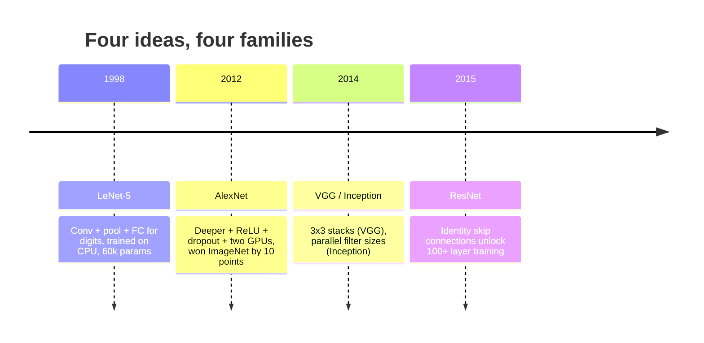
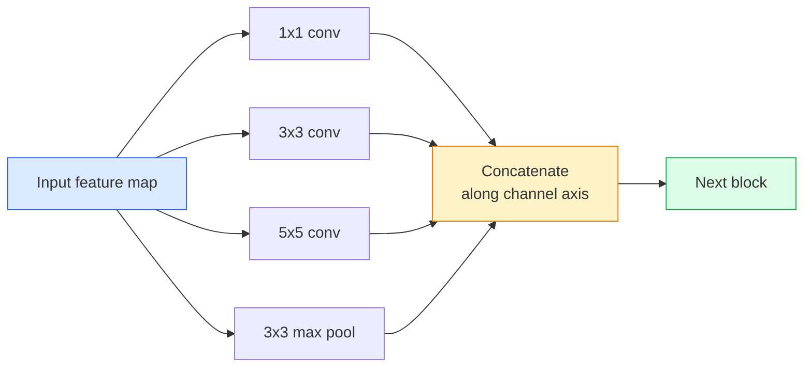
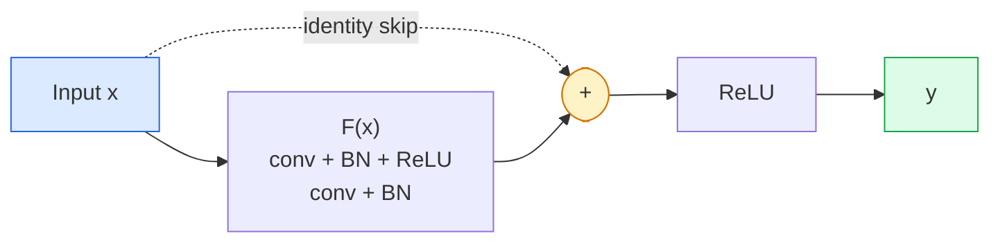

# 网络网络网络网络网络网络网络网络网络网络网络网络网络网络网络网络网络网络网络网络网络网络网络网络网络网络网络网络网络网络网络网络网络网络网络网络网络网络网络网络网络网络网络网络网络网络网络网络网络网络网络网络网络网络网络网络网络网络网络网络网络网络网络网络网络网络网络网络网络网络网络网络网络网络网络网络网络网络网络网络网络网络网络网络网络网络网络网络网络网络网络网络网络网络网络网络网络网络网络网络网络网络网络网络网络网络网络网络网络网络网络网络网络网络网络网络网络网络网络网络网络网络网络网络网络网络网络网络网络网络网络网络网络网络网络网络网络网络网络网络网络网络网络网络网络网络网络网络网络网络网络网络网络网络网络网络网络网络网络网络网络网络网络网络网络网络网络网络网络网络网络网络网络网络网络网络网络网络网络网络网络网络网络网络网络网络网络网络网络网络网络网络网络网络网络网络网络网络网络网络网络网络网络网络网络网络网络网络网络网络网络网络网络网络网络网络网络网络网络网络网络网络网络网络网络网络网络网络网络网络网络网络网络网络网络网络网络网络网络网络网络网络网络网络网络网络网络网络网络网络网络网络网络网络网络网络网络网络网络网络网络网络网络网络网络网络网络网络网络网络网络网络网络网络网络网络网络网络网络网络网络网络网络网络网络网络网络网络网络网络网络网络网络网络网络网络网络网络网络网络网络网络网络网络网络网络网络网络网络网络网络网络网络网络网络网络网络网络网络网络网络网络网络网络网络网络网络网络网络网络网络网络网络网络网络网络网络网络网络网络网络网络网络网络网络网络网络网络网络网络网络网络网络网络网络网络网络网络网络网络网络网络网络网络网络网络网络网络网络网络网络网络网络网络网络网络网络网络网络网络网络网络网络网络网络网络网络网络网络网络网络网络网络网络网络网络网络网络网络网络网络网络网络网络网络网络网络网络网络网络网络网络网络网络网络网络网络网络网络网络网络网络网络网络网络网络网络网络网络网络网络网络网络网络网络网络网络网络网络网络网络网络网络网络网络网络网络网络网络网络网络网络网络网络网络网络网络网络网络网络网络网络网络网络网络网络网络网络网络网络网络网络网络网络网络网络网络网络网络网络网络网络网络网络网络网络网络网络网络网络网络网络网络网络网络网络网络网络网络网络网络网络网络网络网络网络网络网络网络

> 过去30年中每一个主要的CNN都是相同的非线性下样式配方,其中包含一个新想法.

> **【中文解读】**过去三十年所有重要的CNN都是一模板 (卷积-激活-下采样) 加上一个新想法.

**Type:** Learn + Build | **类型:** 学习 + 动手
**Languages:** Python | **语言:** Python
**Prerequisites:** Phase 3 Lesson 11 (PyTorch), Phase 4 Lesson 01 (Image Fundamentals), Phase 4 Lesson 02 (Convolutions from Scratch) | **前置知识:** Phase 3 Lesson 11（PyTorch），Phase 4 Lesson 01（图像基础），Phase 4 Lesson 02（从零实现卷积）
**Time:** ~75 minutes | **时间:** ~75 分钟

## 学习目标

- 追踪建筑系 LeNet-5 -> AlexNet -> VGG -> 创始 -> ResNet,并说明每个家庭所贡献的新想法
- 实现PyTorch中的LeNet-5,VGG类型的区块和ResNet基础区块,每个区块都在40行以下
- 解释为什么剩余连接将1000层网络从不可训练的变成最先进的
- 阅读现代脊椎 (ResNet-18,ResNet-50) 并预测其输出形状,接收场和参数数数量,然后看出源头

> **【中文解读】**学习目标列出了课程完成后应掌握的核心能力.建议在开始学习前先浏览目标,学习完后对照检查是否已实现.


## 问题 问题引入

2011年,最佳的ImageNet分类器获得了74%的前五的准确度. 在2012年,亚历克斯网获得了85%. 在2015年,ResNet获得了96%的分数. 没有新的数据. 没有新的GPU代. 建筑的创意是取得的. 工作的视觉工程师必须知道哪个想法来自哪个纸,因为你在2026年运送的每一个生产骨都是相同的碎片的重组,

> 2011年,最好的图像网分类器前五位 准确率约为74%.2012年,亚历克斯网达到85%――2015年,ResNet达到96%――没有新数据――没有新GPU代际――这些增长来自架构思想――合格的视觉工程师必须知道哪个想法来自哪个论文,因为你在2026年部署的每个生产骨干网络都是这些相同的重组,这些思想也在不断迁移:分组卷积从CNN 转移到变压器,差连接ResNet 扩展到现有的每个LLM,批量归化在扩展模型中存活.

> **【中文解读】**2011-2015年间,图像网准确率从74%升到96%;这不是基于新数据或新GPU,而是基于架构创新.这些创新至今仍在被重复使用:分组卷积从CNN转移到变压器,残差连接从ResNet扩展到所有LLM,批量归结用于扩散模型.

为了研究这些网络,也可以防止你犯一个常见的错误:寻找最大的可用模型,当一个LeNet规模的网络可以解决问题时.MNIST不需要ResNet.知道每个家庭的扩展曲线告诉你在哪里坐.

> 按顺序学习这些网络还可以让你避免一个常见的错误:当LeNet大小的网络就能解决问题时,却使用最大可用的模型――MNIST不需要ResNet――了解每个家庭的缩小曲线可以告诉你应该坐哪个位置――

## 概念的核心概念

### 改变计算机视觉的四个想法



其他经典视觉的东西都不像这四次跳跃一样重要.

> 经典视觉中没有什么比这四次跃迁更重要.

### 美国电视台的第一台实用CNN

恩·莱库恩的数字识别器,6万参数.两个 conv-pool 块,两个完全连接的层, tanh 激活.它定义了每个CNN继承的模板:

> 延·莱昆的数字识别器――6万参数――两个卷积积积块,两个全连接层,

```
input (1, 32, 32)
  conv 5x5 -> (6, 28, 28)
  avg pool 2x2 -> (6, 14, 14)
  conv 5x5 -> (16, 10, 10)
  avg pool 2x2 -> (16, 5, 5)
  flatten -> 400
  dense -> 120
  dense -> 84
  dense -> 10
```

现代世界所谓的CNN, 交替曲, 倒样式食小分类器头,

> 现代世界称之为CNN的全部交换卷积和下采样进入一个小分类器头,就是有更多层面的道和更好的激活的LeNet.

> **【中文解读】**列Net-5定义了所有CNN的基本模板:卷积 → 池化 → 卷积 → 池化 → 全连接.

### 亚历克斯网 (2012) 深度学习的爆发点

两次变化将ImagenNet破解:

> 现在,我们在线观看了

1. **ReLU**升的速度停止消失,训练速度加快了六倍.
2. **Dropout**调节成为一个层,而不是一个.
3. **Depth and width**五层,三层密集,60M参数,训练在两个GPU,模型分开在它们.

文件的图2仍然显示GPU分为两个平行流. 这种平行是硬件解决方案,而不是一个建筑洞察力

> 论文的图2 仍然显示GPU分为两个并行流. 这种并行性是硬件的权益,不是结构洞见,但上面的三个思想仍然在你使用的每个模型中.

> **【拓展：AlexNet 的遗产】**亚历克斯网的三个创新到目前为止都存在: 1) 雷卢激活函数解决了梯度消失问题; 2) 降低正则化防止过拟合; 3) 深度+宽度的规模化思路――2012年ImageNet竞赛的胜利被广泛视为"深度学习革命"的起点.

### 现在,我们在这个世界里,

如果只使用3x3曲,然后深入去,会发生什么?

> 如果只用3x3卷积加深,会发生什么?

```
stack:   conv 3x3 -> conv 3x3 -> pool 2x2
repeat:  16 or 19 conv layers
```

两台3x3孔像一个5x5孔一样,但参数较少 (2*9*C^2 = 18C^2 vs 25*C^2) 和中间的额外的ReLU.VGG将这一观察变成了一个整体架构.简单的一个块类型,重复使它成为之后的一切参考点.

> 两个3x3卷积看的5x5输入区域与一个5x5卷积相同,但参数更少(2*9*C^2 = 18C^2 vs 25*C^2),中间还有额外的 ReLU──VGG将这个观察变成一个完整的结构──简洁性是一种块类型,重复使用使它成为后的一切参考点──

成本:138万参数,训练缓慢,推断成本昂贵.

> 代价1.38亿参数,训练慢,推理昂贵.

### 开始 (2014年同年) 多尺度并行波

谷歌对"我应该使用哪个核子尺寸?"的答案是:

> 谷歌对"应该用什么核大小?"的回答是:全部,并行使用.



每个分支专门为1x1进行道混合,3x3用于本地纹理,5x5用于更大的模式,聚合用于变更不变的特性和 concat让下一个层选择哪个分支是有用的.初始版本使用1x1的曲在每个分支内部作为瓶,以保持参数数的正常计算.

> 每个分支专注于不同的方面1x1用于通道混合,3x3用于局部纹理,5x5用于更大的模式,池化用于平移不变特征拼接让下层可以选择有用的分支.

### 退化问题:越深反而越差

根据VGG-19的数据,VGG-19在2015年开始运行,而VGG-32没有.深度应该有助于,但在20层之后,训练和测试损失都变得更糟.这不是过度适合.这是优化器无法找到有用的重量,因为梯度在每个层中缩小多次.

> 到2015年,VGG-19 能工作,但VGG-32 不行.深度应该有帮助,但超过20层后训练和测试损失变得更差.

```
Plain deep network:
  y = f_L( f_{L-1}( ... f_1(x) ... ) )

Gradient wrt early layer:
  dL/dW_1 = dL/dy * df_L/df_{L-1} * ... * df_2/df_1 * df_1/dW_1

Each multiplicative term has magnitude roughly (weight magnitude) * (activation gain).
Stack 100 of them with gains < 1 and the gradient is effectively zero.
```

由于批量标准 (同时发布),使激活量保持良好规模,因此VGG在19层工作.

> 由于批量归结 (同时发表) 保持了良好的活跃缩放,而在19层时能工作.

### 其他网络深度学习突破

他,张,任,孙提出了一个改变,

> 他,伦,孙提出了一种修复一切的改变:

```
standard block:   y = F(x)
residual block:   y = F(x) + x
```

其他`+ x`它们可以选择在驾驶时做什么.`F(x)`现在,一个1000层的ResNet最糟糕的,就像一个层的网络一样,因为每个额外的块都有一个微不足道的逃生口.

> `+ x`这意味着这个层次总是可以通过.`F(x)`倾向于零来选择什么都不做. 一个1000层的ResNet现在最多和一个1层网络一样差,因为每个额外块都有一个简单的逃生通道. 有这个保证,优化器愿意让每个块*稍微*有用,堆叠100次,就是最先进的.



区块的两个变体显示在任何地方:

> 两种变体无处不在:

- **BasicBlock**两台3×3号车,跳过两处.
  中文翻译:基本块两个3x3卷积,跨两者的跳跃──
- **Bottleneck**下1x1,中3x3,上1x1,跳转三人间.
  中文翻译:瓶块1x1 降维、3x3 中间、1x1 升维,跨三者跳跃──通道数高时更便宜──

当跳转必须穿过下样本 (步骤=2),身份路径被1x1步骤=2 conv所取代,以匹配形状.

> 当跳跃需要跨越下采样时,恒等路径被替换为1x1步=2的卷积以匹配形状.

### 剩余的东西是视觉之外的重要原因

对于图像分类而言,这不是真正的想法.它是把深层网络从"跨手指和希望梯度生存"变成一个可靠的,可扩展的工程工具.你读到的每一个变压器的下一个阶段,每个区块都完全相同的跳转连接.没有ResNet,没有GPT.

> 这一想法实际上不是关于图像分类的――它是关于将深度网络从"祈祷梯度能生存"变成可靠的可扩展工程工具――你下一阶段将阅读的每个变压器在每个块中都有完全相同的跳跃连接――没有ResNet,没有GPT――

> **【拓展：残差连接与 Transformer】**差距连接不仅改变了视觉,它使深度网络从"祈祷梯度能活"变成可靠的工程工具.每个变压器块 (包括GPT、BERT、Claude 后背模型) 都使用完全相同的跳跃连接.没有ResNet,没有GPT。ResNet的核心公式.`y = F(x) + x`可以说是深度学习最重要的方程之一.

> **【拓展：工业部署中的视觉系统】**在实际工业部署中,视觉模型需要考虑推迟模型大小的边缘设备适应等问题.

```figure
pooling
```

## 建立它

## 建立它 动手实践

### 步骤1:实现LeNet-5

简单的,忠实的LeNet. 的激活,平均的集成. 现代化的唯一让步是我们使用`nn.CrossEntropyLoss`没有原来的高斯连接.

> 现代的唯一让步是我们在下游使用`nn.CrossEntropyLoss`而不是原始的高斯连接.

```python
import torch
import torch.nn as nn
import torch.nn.functional as F

class LeNet5(nn.Module):
    def __init__(self, num_classes=10):
        super().__init__()
        self.conv1 = nn.Conv2d(1, 6, kernel_size=5)
        self.conv2 = nn.Conv2d(6, 16, kernel_size=5)
        self.pool = nn.AvgPool2d(2)
        self.fc1 = nn.Linear(16 * 5 * 5, 120)
        self.fc2 = nn.Linear(120, 84)
        self.fc3 = nn.Linear(84, num_classes)

    def forward(self, x):
        x = self.pool(torch.tanh(self.conv1(x)))
        x = self.pool(torch.tanh(self.conv2(x)))
        x = torch.flatten(x, 1)
        x = torch.tanh(self.fc1(x))
        x = torch.tanh(self.fc2(x))
        return self.fc3(x)

net = LeNet5()
x = torch.randn(1, 1, 32, 32)
print(f"output: {net(x).shape}")
print(f"params: {sum(p.numel() for p in net.parameters()):,}")
```

预期产量:`output: torch.Size([1, 10])`现在`params: 61,706`这就是整个数字分类器,开始了现代视觉.

> 预期输出:`output: torch.Size([1, 10])`,我知道.`params: 61,706`这就是现代视觉的完整数字分类器的开端.

### 步骤2:一个VGG块实现VGG块

一个可重复使用的块:两个3×3车,RLU,批量标准,最大游泳池.

> 一个可复用块:两个3x3卷积,ReLU,批量归结,最大池化.

```python
class VGGBlock(nn.Module):
    def __init__(self, in_c, out_c):
        super().__init__()
        self.conv1 = nn.Conv2d(in_c, out_c, kernel_size=3, padding=1)
        self.bn1 = nn.BatchNorm2d(out_c)
        self.conv2 = nn.Conv2d(out_c, out_c, kernel_size=3, padding=1)
        self.bn2 = nn.BatchNorm2d(out_c)
        self.pool = nn.MaxPool2d(2)

    def forward(self, x):
        x = F.relu(self.bn1(self.conv1(x)))
        x = F.relu(self.bn2(self.conv2(x)))
        return self.pool(x)

class MiniVGG(nn.Module):
    def __init__(self, num_classes=10):
        super().__init__()
        self.stack = nn.Sequential(
            VGGBlock(3, 32),
            VGGBlock(32, 64),
            VGGBlock(64, 128),
        )
        self.head = nn.Sequential(
            nn.AdaptiveAvgPool2d(1),
            nn.Flatten(),
            nn.Linear(128, num_classes),
        )

    def forward(self, x):
        return self.head(self.stack(x))

net = MiniVGG()
x = torch.randn(1, 3, 32, 32)
print(f"output: {net(x).shape}")
print(f"params: {sum(p.numel() for p in net.parameters()):,}")
```

通过CIFAR的输入,一个适应性池,一个线性层. ~290k参数.

> 输入的3个VGG块,自适应池化,一个线性层,约有29万参数,对CIFAR-10有余.

### 步骤3: 实现ResNet基本块

作为ResNet-18和ResNet-34的核心构建块.

> 据了解,该系统的核心构建块是ResNet-18和ResNet-34的核心构建块.

```python
class BasicBlock(nn.Module):
    def __init__(self, in_c, out_c, stride=1):
        super().__init__()
        self.conv1 = nn.Conv2d(in_c, out_c, kernel_size=3, stride=stride, padding=1, bias=False)
        self.bn1 = nn.BatchNorm2d(out_c)
        self.conv2 = nn.Conv2d(out_c, out_c, kernel_size=3, stride=1, padding=1, bias=False)
        self.bn2 = nn.BatchNorm2d(out_c)
        if stride != 1 or in_c != out_c:
            self.shortcut = nn.Sequential(
                nn.Conv2d(in_c, out_c, kernel_size=1, stride=stride, bias=False),
                nn.BatchNorm2d(out_c),
            )
        else:
            self.shortcut = nn.Identity()

    def forward(self, x):
        out = F.relu(self.bn1(self.conv1(x)))
        out = self.bn2(self.conv2(out))
        out = out + self.shortcut(x)
        return F.relu(out)
```

`bias=False` BN 的beta参数已经处理偏差,所以携带偏差也是浪费的.`shortcut`只有在步骤或道数量变化时才需要真正的 conv;否则它是无操作的身份.

> 卷积层上`bias=False`由于对批量归结的BET 参数已经处理偏置,因此同时保留卷积偏置是浪费.`shortcut`只有在步幅或通道数量的变化时需要真正的卷积;否则它是无操作的恒等.

### 步骤4: 构建一个迷你的ResNet

堆四组基本块,以获得CIFAR大小输入的 ResNet.

> 堆叠四组 BasicBlock 以获得适用于CIFAR尺寸输入工作ResNet──

```python
class TinyResNet(nn.Module):
    def __init__(self, num_classes=10):
        super().__init__()
        self.stem = nn.Sequential(
            nn.Conv2d(3, 32, kernel_size=3, stride=1, padding=1, bias=False),
            nn.BatchNorm2d(32),
            nn.ReLU(inplace=True),
        )
        self.layer1 = self._make_group(32, 32, num_blocks=2, stride=1)
        self.layer2 = self._make_group(32, 64, num_blocks=2, stride=2)
        self.layer3 = self._make_group(64, 128, num_blocks=2, stride=2)
        self.layer4 = self._make_group(128, 256, num_blocks=2, stride=2)
        self.head = nn.Sequential(
            nn.AdaptiveAvgPool2d(1),
            nn.Flatten(),
            nn.Linear(256, num_classes),
        )

    def _make_group(self, in_c, out_c, num_blocks, stride):
        blocks = [BasicBlock(in_c, out_c, stride=stride)]
        for _ in range(num_blocks - 1):
            blocks.append(BasicBlock(out_c, out_c, stride=1))
        return nn.Sequential(*blocks)

    def forward(self, x):
        x = self.stem(x)
        x = self.layer1(x)
        x = self.layer2(x)
        x = self.layer3(x)
        x = self.layer4(x)
        return self.head(x)

net = TinyResNet()
x = torch.randn(1, 3, 32, 32)
print(f"output: {net(x).shape}")
print(f"params: {sum(p.numel() for p in net.parameters()):,}")
```

两个块的四组,每组两个块. 2, 3, 4 组开始时的步骤. 每次下样数的频道数量翻倍. 大约2.8M参数. 这就是标准配方,清洁地扩展到ResNet-152.

> 两组的分数是2个. 两组的分数是2个.

### 参数效率与参数效率的比较.

运行三种网络中的相同输入,并比较参数数.

> 将通过所有三个网络进行相同的输入并比较参数数量.

```python
def summary(name, net, x):
    y = net(x)
    params = sum(p.numel() for p in net.parameters())
    print(f"{name:12s}  input {tuple(x.shape)} -> output {tuple(y.shape)}  params {params:>10,}")

x = torch.randn(1, 3, 32, 32)
summary("LeNet5",     LeNet5(),       torch.randn(1, 1, 32, 32))
summary("MiniVGG",    MiniVGG(),      x)
summary("TinyResNet", TinyResNet(),   x)
```

为了达到CIFAR-10的准确性,需要大约:LeNet60%,MiniVGG89%,TinyResNet93%

> 对于CIFAR-10准确率,训练几个时代 后大致需要:LeNet 60%、MiniVGG 89%、TinyResNet 93%──


## 实际应用.

`torchvision.models`呼叫签名在各个家庭中是相同的,这正是脊柱抽象的点.

> `torchvision.models`给你上述所有模型的预训练版本. 调用签名在各个家庭中完全相同,这是骨干网络抽象的意义.

```python
from torchvision.models import resnet18, ResNet18_Weights, vgg16, VGG16_Weights

r18 = resnet18(weights=ResNet18_Weights.IMAGENET1K_V1)
r18.eval()

print(f"ResNet-18 params: {sum(p.numel() for p in r18.parameters()):,}")
print(r18.layer1[0])
print()

v16 = vgg16(weights=VGG16_Weights.IMAGENET1K_V1)
v16.eval()
print(f"VGG-16   params: {sum(p.numel() for p in v16.parameters()):,}")
```

雷斯网-18具有11.7M参数.VGG-16具有138M.类似的图像网前一精度 (69.8%vs71.6%).残余连接让你获得12倍参数效率.这就是为什么ResNet变体从2016年至2021年ViT到来之前占据了主导地位,并且仍然占据了实体部署的实体领域的限制.

> **【中文解读】**像网准确率相近,但参数效率差了12倍.

转移学习的做法总是相同:预先训练的加载,

> 对于迁移学习,方案总是相同:加载预训权重,结骨干网络,替换分类器头.

```python
for p in r18.parameters():
    p.requires_grad = False
r18.fc = nn.Linear(r18.fc.in_features, 10)
```

现在你有一个10级的CIFAR分类器, 继承了Imagenet付出的表示.

> 现在你有一个10类CIFAR分类器,它继承了ImageNet的付费表示.


> **【拓展：数据标注与质量】**视觉任务的效果高度依赖标签数据质量――标签工作室、CVAT是主流标签工具――在工业场景中,主动学习(主动学习) 可以减少标签成本:模型对不确定的样本请求人工标签,确定性的样本自动标签――

## 发送产品出货

这一课产生了:

> 本课产出:

- `outputs/prompt-backbone-selector.md`一个提示,选择了合适的CNN家族 (LeNet/VGG/ResNet/MobileNet/ConvNeXt) 给定的任务,数据集规模和计算预算.
  中文翻译:给定任务、数据集大小和计算预算,选择正确 CNN 家族的提示词──
- `outputs/skill-residual-block-reviewer.md`阅读PyTorch模块并标记跳转连接错误 (步骤变化时缺失快捷方式,快捷方式激活顺序,与添加相对BN位置).
  中文翻译:读取 PyTorch 模块并标记跳跃连接错误的技能。

## 练习题

> **【中文解读】**练习题按照易/中/难 三个难度递进;;建议至少完成中级题,Hard级适合深入研究或面试准备;;


1. **(Easy | 简单)**按手数计算参数`TinyResNet`比较一个层次的比一个层次的比一个层次的比一个层次的比一个层次的比一个层次的比一个层次的比一个层次的比一个层次的比一个层次的比一个层次的比一个层次的比一个层次的比一个层次的比一个层次的比一个层次的比一个层次的比一个层次的比一个层次的比一个层次的比一个层次的比一个层次的比一个层次的比一个层次的比一个层次的比一个层次的比一个层次的比一个层次的比一个层次`sum(p.numel() for p in net.parameters())`参数预算的大部分用于哪里?
   按层次计算TinyResNet的参数,找出主要花在哪里的参数.

2. **(Medium | 中等)**实现瓶块 (1x1 -> 3x3 -> 1x1与跳转) 并使用它构建CIFAR的ResNet-50式网络.`TinyResNet`现在,我们要去.
   实现瓶块,构建ResNet-50风格网络,对比参数量.

3. **(Hard | 困难)**删除跳转连接`BasicBlock`对于这两个模式,进行一个34区块的"平面"网络和一个34区块的ResNet在CIFAR-10上进行10个时代. 进行一个对比时代的训练损失. 复制He et al.图 1的结果,平面深度网络与其低层双胞胎相比的损失相近.
   解掉跳跃连接,训练34层"平"网络和34层ResNet,复现 他等论文图 1 的结果.

## 关键词 关键词

| Term | What people say | What it actually means | 中文释义 |
|------|----------------|----------------------|---------|
| Backbone | "The model" | The stack of convolutional blocks that produces the feature map fed to the task head | 骨干网络：产生特征图的卷积块堆叠 |
| Residual connection | "Skip connection" | `y = F(x) + x`; lets the optimiser learn identity by setting F to zero, which makes arbitrary depth trainable | 残差连接/跳跃连接：让任意深度可训练 |
| BasicBlock | "Two 3x3 convs with a skip" | The ResNet-18/34 building block: conv-BN-ReLU-conv-BN-add-ReLU | 基本块：ResNet-18/34 的构建单元 |
| Bottleneck | "1x1 down, 3x3, 1x1 up" | The ResNet-50/101/152 block; cheap at high channel counts because the 3x3 runs on a reduced width | 瓶颈块：1x1降维-3x3卷积-1x1升维 |
| Degradation problem | "Deeper is worse" | Past ~20 plain conv layers, both training and test error increase; solved by residual connections, not by more data | 退化问题：层数加深后训练和测试误差都增大 |
| Stem | "The first layer" | The initial conv that converts 3-channel input into the base feature width; usually 7x7 stride 2 for ImageNet, 3x3 stride 1 for CIFAR | 茎部：网络的初始卷积层 |
| Head | "The classifier" | The layers after the final backbone block: adaptive pool, flatten, linear(s) | 头部：骨干网络之后的分类器层 |
| Transfer learning | "Pretrained weights" | Loading a backbone trained on ImageNet and fine-tuning only the head on your task | 迁移学习：加载预训练权重，只微调头部 |

## 继续阅读 继续阅读

> **【中文解读】**延伸阅读提供了深入学习的高质量资源. 这些论文和教程是该领域的经典参考文献,适合需要深入了解的读者.


- [Deep Residual Learning for Image Recognition (He et al., 2015)](https://arxiv.org/abs/1512.03385)ResNet论文;每一个数字都值得研究
- [Very Deep Convolutional Networks (Simonyan & Zisserman, 2014)](https://arxiv.org/abs/1409.1556)VGG论文;仍然是"为什么3x3"的最佳参考
- [ImageNet Classification with Deep CNNs (Krizhevsky et al., 2012)](https://papers.nips.cc/paper_files/paper/2012/hash/c399862d3b9d6b76c8436e924a68c45b-Abstract.html) AlexNet;结束手工特色时代的论文
- [Going Deeper with Convolutions (Szegedy et al., 2014)](https://arxiv.org/abs/1409.4842) 开始 v1;平行过器的想法仍然在视觉变换器中出现
