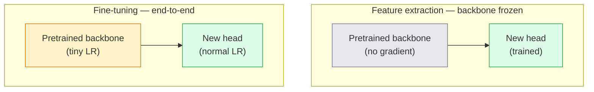

# 转移学习与微调

> 其他人花了百万个GPU小时教网络边缘,纹理和物体部分是什么样子.

> **【中文解读】**别人花了百万个GPU 小时教会网络识别边缘,纹理和物体部件──你应该在训练自己的模型之前先借用这些特征──迁移学习是人工智能工程中最实用的技术预训骨干+自定义分类头 = 几行代码就能解决新任务──

> **【拓展：迁移学习在工业界的应用】**几乎所有生产级视觉系统都使用迁移学习:医疗影像(ImageNet 预训练 + 医学数据微调) 工业质检、自动驾驶――训练ResNet-50 需要 ~2000GPU 小时,但微调只需要几分钟――

**Type:** Build | **类型:** 动手
**Languages:** Python | **语言:** Python
**Prerequisites:** Phase 4 Lesson 03 (CNNs), Phase 4 Lesson 04 (Image Classification) | **前置知识:** Phase 4 Lesson 03（CNN），Phase 4 Lesson 04（图像分类）
**Time:** ~75 minutes | **时间:** ~75 分钟

## 学习目标

- 根据数据集大小,域距离和计算预算,区分特征提取和细调,选择正确的特征
- 装载预训练的脊柱,取代其分类器头,并只将头部运行到一个工作基线,在20行以下
- 逐步解具有歧视性学习率的层次,所以早期的通用功能比较晚期的任务特定的更新更小
- 诊断出三个常见的故障:在未结块上,特征偏移从过高的LR,在微小的数据集上,BN统计数据崩,以及灾难性遗忘

> **【中文解读】**学习目标列出了课程完成后应掌握的核心能力.建议在开始学习前先浏览目标,学习完后对照检查是否已实现.


## 问题 问题引入

训练一个ResNet-50在图像网上花费了2000个GPU小时.很少有团队有这笔预算,他们运送的每一个任务.几乎每一个团队实际上运送的是一个预训练的脊柱,一个新的头脑训练在几百或几千个任务特定图像.

> 在图像网上训练ResNet-50约需要2000个GPU小时――很少有团队有预算投入每个交付任务的这么多――几乎所有的团队实际交付的是一个预训练骨干网络加上一个在几百或几千个任务特定图像上训练的新头部――

> **【中文解读】**从零训练 ResNet-50 需要2000 GPU 小时,但迁移学习只需要几分钟.关键洞察是:CNN的前几层学习是通用特征 (边缘纹理),这些特征几乎适用于所有视觉任务;只有最后几层是任务特定的.

这不是快捷途径. 任何由 ImageNet训练的CNN的第一个块都能学习边缘和Gabor类似的过器. 接下来的几块学习了简单的纹理和动作. 中间块学习对象部分. 最后的块学习了类似于1000个图像网类别的组合. 由于自然界的边缘和纹理词汇有限,因此,该层次的第一90%几乎没有变化, 剩下的10%是你实际训练的.

> 这不是捷径――任何在ImageNet上训练的CNN的第一卷学习块边缘和类 Gabor 波器――接下来几块学习纹理和简单模式――中间块学习物体部分――最后几块学习看起来像1000个ImageNet类组合――这个层面的前90%几乎不变地迁移到医学成像,工业检测,卫星数据和所有其他视觉任务――因为自然边缘和纹理词汇是有限的――最后10%才是你实际训练的――

转移权有三个错误等待你:破坏预训练的功能,学习率过高,通过过度结信息模型,让BatchNorm的运行统计数据向其他网络从未学习的微小数据集漂移.

> 正确做迁移学习有三个错误在等待你:使用过高的学习率破坏预训特征,结过多导致模型信息缺乏,让BatchNorm的运行统计数据流向网络的其余部分从未学习过的微小数据集――本课程特征逐步通过每个坑――

> **【中文解读】**迁移学习最常见的三个坑: 1) 学习率太高破坏预训特征; 2) 结结太多层导致模型不合适; 3) 批量统计量漂移在小数据集中.

## 概念的核心概念

> **【中文解读】**本节介绍核心概念和理论基础.掌握这些概念是后续动手实现的前提,同时也是面试和工程实践中高频考察的知识点.


### 功能提取与细调

两种模式,根据你对预先训练的功能有多信任以及你有多少数据来选择.

> 两种方案,取决于你有多的信任预训特征以及你有多少数据.



基本规则:

> 经验法则:

| Dataset size / 数据量 | Domain distance / 领域距离 | Recipe / 方案 |
|--------------|-----------------|--------|
| < 1k images | close to ImageNet / 接近 ImageNet | Freeze backbone, train head only / 冻结骨干，只训头部 |
| 1k-10k | close / 接近 | Freeze first 2-3 stages, fine-tune the rest / 冻结前2-3阶段，微调其余 |
| 10k-100k | any / 任意 | Fine-tune end-to-end with discriminative LR / 用判别性学习率端到端微调 |
| 100k+ | far / 远 | Fine-tune everything; consider training from scratch if domain is far enough / 全量微调；领域足够远则考虑从头训练 |

医疗CT扫描,空卫星图像和显微镜是遥远的领域.

> 接近图像网大致意味着带有物体的自然RGB图片.医学CT扫描,视频卫星图像和显微镜图像是远领域的特征仍然有帮助,但你需要让更多层次适应.

> **【拓展：迁移学习策略选择】**在工业实践中,数据集大小和领域距离决定了迁移策略:<1k张且与图像网接近结结骨干训练头部;10k+张就在全量微调;;医疗影像,卫星图等远领域需要解更多层面;;稳定传播的U-Net和CLIP视频编码器都是经过大规模预训练后微调的典型例例;;

### 冰的作用是什么原因?

图像网的功能, CNN 发现, 他们专注于自然图像的统计:边缘在特定的方向,纹理,对比模式,形状原始. 这些统计数据几乎在每个视觉领域都稳定, 这就是为什么在ImageNet上训练的模型,并通过CIFAR-10进行零射击评估,只使用新的线性头 (没有细节调整脊柱) 达到80%以上的精度. 头脑正在学习哪些已经学习的特征适用于这个任务.

> CNN所学到的 ImageNet特征不专为1000个类别.它们专用于自然图像的统计特征:特定方向边缘,纹理,对比模式,形状基元. 这些统计特征在几乎所有人类可命名的视觉领域都是稳定的.这就是为什么在 ImageNet上训练的模型只使用一个新的线性头 (不微调骨干网络) 在 CIFAR-10 上零样本评估中可以达到80%+准确率.头在学习任务中加大已经学到的特征.

### 歧视性学习率

早期层应比晚层慢训练,早期层应编码你想保存的通用特性,晚层则编码你需要经常移动的任务特定结构.

> 当你解时,早期层应该比晚期层训练更慢.

```
Typical recipe:

  stage 0 (stem + first group): lr = base_lr / 100    (mostly fixed)
  stage 1:                       lr = base_lr / 10
  stage 2:                       lr = base_lr / 3
  stage 3 (last backbone group): lr = base_lr
  head:                          lr = base_lr  (or slightly higher)
```

在 PyTorch 中,这是一个向优化器传递的参数组列表. 一个模型,五个学习速度,零额外代码.

> 在 PyTorch 中,这只是传递到优化器的参数列表.

### 批量规则问题

接的BN层`running_mean`其他`running_var`如果您的任务有不同的像素分布,不同的照明,不同的传感器,不同的颜色空间,这些缓冲器是错误的.

> 博平台在图像网上计算的`running_mean`和 `running_var`缓冲区. 如果你的任务有不同的像素分布,不同的光照,不同的传感器,不同的颜色空间,

1. **Fine-tune with BN in train mode.**让BN更新其运行统计数据以及其他一切. 任务数据集是中型 (>=5k例) 的情况下,默认选择.
2. **Freeze BN in eval mode.**保持图像网统计数据,并仅训练重量.当你的数据集足够小,
3. **Replace BN with GroupNorm.**它们用于检测和细分背骨,其中每个GPU的批量尺寸很小.

错误的默默,将精度提高到5-15%.

> 弄错这个会静默地降低5-15%的准确率.

### 头部设计

每个火视觉背骨都会发出一个默认的头,你取代:

> 分类器头是1-3个线性层加一个可选的落后.每个火视觉骨干网络都附有一个你替换的默认头:

```
backbone.fc = nn.Linear(backbone.fc.in_features, num_classes)          # ResNet
backbone.classifier[1] = nn.Linear(..., num_classes)                    # EfficientNet, MobileNet
backbone.heads.head = nn.Linear(..., num_classes)                       # torchvision ViT
```

对于小数据集,通常只需要一个线性层.添加一个隐藏层 (线性 -> ReLU -> 放弃 -> 线性) 在任务分布远离脊柱的训练分布时有助.

> 对于小数据集,单个线性层通常足够.当任务分布与骨干网络的训练分布差距较大时,添加隐藏层 (Linear -> ReLU -> Dropout -> Linear) 有帮助.

### 层级 LR衰变

现代细调 (BEiT,DINOv2,ViT-B细调) 中使用的歧视性LR的更平滑版本.

> 现代微调 (现代微调) 中使用的判别性学习率的更平滑版本.

```
lr_layer_k = base_lr * decay^(L - k)
```

化块的化量为0.75个,变压器块的L值为12个,`0.75^11 ≈ 0.04x`对于变压器的细节调节而言,

> 当衰变 = 0.75 且 L = 12 个变压器块时,第一个块以头部学习率`0.75^11 ≈ 0.04x`训练――对于变压器 微调比CNN更重要的是,CNN中阶段分组的学习率通常足够.

### 评估什么

转移学习运行需要两个数字,你不会在零零运行上追踪:

- **Pretrained-only accuracy**头部的精度,脊椎结.这是你的地板.
- **Fine-tuned accuracy** 完整训练后的模型.

如果微调不如预训练,你会有学习率或BN错误.

> **【中文解读】**本节通过代码实现从零到核心算法――这种"从零开始"的方式可以帮助理解框架背后的原理,遇到问题时不会被黑盒困住――

> **【拓展：工业部署中的视觉系统】**在实际工业部署中,视觉模型需要考虑推迟模型大小的边缘设备适应等问题.


## 建立它,实现它.
```figure
transfer-learning
```

## 建立它

### 步骤1:装载预训练的脊椎骨,检查它

```python
import torch
import torch.nn as nn
from torchvision.models import resnet18, ResNet18_Weights

backbone = resnet18(weights=ResNet18_Weights.IMAGENET1K_V1)
print(backbone)
print()
print("classifier head:", backbone.fc)
print("feature dim:", backbone.fc.in_features)
```

`ResNet18`具有四个阶段 (`layer1..layer4`) 加上一个干和一个`fc`每个火视觉分类的脊柱都有类似的结构.

### 冷所有东西,取代头部

```python
def make_feature_extractor(num_classes=10):
    model = resnet18(weights=ResNet18_Weights.IMAGENET1K_V1)
    for p in model.parameters():
        p.requires_grad = False
    model.fc = nn.Linear(model.fc.in_features, num_classes)
    return model

model = make_feature_extractor(num_classes=10)
trainable = sum(p.numel() for p in model.parameters() if p.requires_grad)
frozen = sum(p.numel() for p in model.parameters() if not p.requires_grad)
print(f"trainable: {trainable:>10,}")
print(f"frozen:    {frozen:>10,}")
```

只有`model.fc`脊柱是一个冷的特征提取器.

### 步骤3: 歧视性细调

建立一个阶段特定学习率的参数组的实用程序.

```python
def discriminative_param_groups(model, base_lr=1e-3, decay=0.3):
    stages = [
        ["conv1", "bn1"],
        ["layer1"],
        ["layer2"],
        ["layer3"],
        ["layer4"],
        ["fc"],
    ]
    groups = []
    for i, names in enumerate(stages):
        lr = base_lr * (decay ** (len(stages) - 1 - i))
        params = [p for n, p in model.named_parameters()
                  if any(n.startswith(k) for k in names)]
        if params:
            groups.append({"params": params, "lr": lr, "name": "_".join(names)})
    return groups

model = resnet18(weights=ResNet18_Weights.IMAGENET1K_V1)
model.fc = nn.Linear(model.fc.in_features, 10)
for p in model.parameters():
    p.requires_grad = True

groups = discriminative_param_groups(model)
for g in groups:
    print(f"{g['name']:>10s}  lr={g['lr']:.2e}  params={sum(p.numel() for p in g['params']):>8,}")
```

`decay=0.3`意思是每一段火车的速度为下一个火车的30%`fc`得到了`base_lr`现在`layer4`得到了`0.3 * base_lr`现在`conv1`得到了`0.3^5 * base_lr ≈ 0.00243 * base_lr`极端的声音,经验上,它是有效的.

### 步骤4:批量规范处理

帮助BN结运行统计数据,而不会结其体重.

```python
def freeze_bn_stats(model):
    for m in model.modules():
        if isinstance(m, (nn.BatchNorm1d, nn.BatchNorm2d, nn.BatchNorm3d)):
            m.eval()
            for p in m.parameters():
                p.requires_grad = False
    return model
```

打电话后就打电话`model.train()`在每一个时代的开始.`model.train()`转换到训练模式,这只会转换BN层.

### 步骤5:最小的端到端细调循环

```python
from torch.optim import SGD
from torch.utils.data import DataLoader
from torch.optim.lr_scheduler import CosineAnnealingLR
import torch.nn.functional as F

def fine_tune(model, train_loader, val_loader, device, epochs=5, base_lr=1e-3, freeze_bn=False):
    model = model.to(device)
    groups = discriminative_param_groups(model, base_lr=base_lr)
    optimizer = SGD(groups, momentum=0.9, weight_decay=1e-4, nesterov=True)
    scheduler = CosineAnnealingLR(optimizer, T_max=epochs)

    for epoch in range(epochs):
        model.train()
        if freeze_bn:
            freeze_bn_stats(model)
        tr_loss, tr_correct, tr_total = 0.0, 0, 0
        for x, y in train_loader:
            x, y = x.to(device), y.to(device)
            logits = model(x)
            loss = F.cross_entropy(logits, y, label_smoothing=0.1)
            optimizer.zero_grad()
            loss.backward()
            optimizer.step()
            tr_loss += loss.item() * x.size(0)
            tr_total += x.size(0)
            tr_correct += (logits.argmax(-1) == y).sum().item()
        scheduler.step()

        model.eval()
        va_total, va_correct = 0, 0
        with torch.no_grad():
            for x, y in val_loader:
                x, y = x.to(device), y.to(device)
                pred = model(x).argmax(-1)
                va_total += x.size(0)
                va_correct += (pred == y).sum().item()
        print(f"epoch {epoch}  train {tr_loss/tr_total:.3f}/{tr_correct/tr_total:.3f}  "
              f"val {va_correct/va_total:.3f}")
    return model
```

五个时代,上述CIFAR-10的配方需要`ResNet18-IMAGENET1K_V1`只有头部就会达到86%的水平,而没有碰到脊椎.

### 步骤6:逐步解

时间表从结束到开始,每时段的一个阶段都会解.

```python
def progressive_unfreeze_schedule(model):
    stages = ["layer4", "layer3", "layer2", "layer1"]
    yielded = set()

    def start():
        for p in model.parameters():
            p.requires_grad = False
        for p in model.fc.parameters():
            p.requires_grad = True

    def unfreeze(epoch):
        if epoch < len(stages):
            name = stages[epoch]
            yielded.add(name)
            for n, p in model.named_parameters():
                if n.startswith(name):
                    p.requires_grad = True
            return name
        return None

    return start, unfreeze
```

电话`start()`在第一时代之前,`unfreeze(epoch)`任何一个时代的开始,每当训练可行的参数组变化时,重新构建优化器,否则,冷的参数仍然保留了混的缓存时刻.


## 用它实现框架

> **【中文解读】**本节展示了如何使用成熟框架 (如PyTorch、HuggingFace等) 快速应用该技术.


对于大多数真正的任务,`torchvision.models`超过3行,就足够了.当你遇到库默认无法解决的问题时,上面的更重的机器很重要.

```python
from torchvision.models import resnet50, ResNet50_Weights

model = resnet50(weights=ResNet50_Weights.IMAGENET1K_V2)
model.fc = nn.Linear(model.fc.in_features, num_classes)
optimizer = torch.optim.AdamW(model.parameters(), lr=1e-4, weight_decay=1e-4)
```

其他两项生产级违约:

- `timm`船舶的视力背骨是预训练的~800个,具有一致的API (`timm.create_model("resnet50", pretrained=True, num_classes=10)`对于任何超越火动物园的细节,
- 对于变压器,`transformers.AutoModelForImageClassification.from_pretrained(name, num_labels=N)`给你 ViT / BEiT / DeiT 与文字模型相同的加载语义.

> **【中文解读】**本节关注如何将模型部署为可用的产品. 从原型到生产级系统需要考虑性能优化,错误处理,监控等多个维度.


> **【拓展：数据标注与质量】**视觉任务的效果高度依赖标签数据质量――标签工作室、CVAT是主流标签工具――在工业场景中,主动学习(主动学习) 可以减少标签成本:模型对不确定的样本请求人工标签,确定性的样本自动标签――

## 运送它.

这一课产生了:

- `outputs/prompt-fine-tune-planner.md`一个提示,根据数据集大小,域距离和计算预算,选择功能提取与进步对结尾到结尾的细节调整.
- `outputs/skill-freeze-inspector.md`一个技能,在PyTorch模型中,报告哪些参数可以训练,哪些BatchNorm层在评估模式下,以及优化器是否实际上正在提供训练可用的参数.

> **【中文解读】**练习题按照易/中/难 三个难度递进;;建议至少完成中级题,Hard级适合深入研究或面试准备;;


## 练习题

1. **(Easy | 简单)**列车`ResNet18`报告两种准确性,并列.解释哪个空隙告诉你功能转移良好,哪个告诉你它们没有.
   分别使用线性探针 (结骨干) 和全量微调训练 ResNet18,对比准确率.

2. **(Medium | 中等)**设置故意引入一个bug`base_lr = 1e-1`炼损失爆炸,然后通过应用炼损失恢复.`discriminative_param_groups`记录每一个阶段开始分离的 LR.
   故意设置`base_lr = 1e-1`制造错误,观察训练损失 爆炸,然后使用判别式学习率恢复――记录每个阶段开始发散的学习率――

3. **(Hard | 困难)**拿一个医学成像数据集 (例如CheXpert-small,PatchCamelyon或HAM10000) 并比较三个模式: (a) ImageNet预训练的结脊椎+线性头; (b) ImageNet预训练的细调端到端; (c) 划分训练. 报告每个数据集的准确性和计算成本. 在哪个数据集尺寸上划分训练变得竞争力?
   用医疗影像数据集对比三种方案: (a) 结骨干+线性头; (b) 全量微调; (c) 从零训练.

## 关键词 关键词

| Term | What people say | What it actually means | 中文释义 |
|------|----------------|----------------------|---------|
| Feature extraction | "Freeze and train head" | Backbone parameters frozen, only the new classifier head receives gradient | 特征提取：冻结骨干参数，只训练新的分类头 |
| Fine-tuning | "Retrain end-to-end" | All parameters trainable, usually with much smaller LR than scratch training | 微调：所有参数可训练，学习率远小于从零训练 |
| Discriminative LR | "Smaller LR for early layers" | Optimizer parameter groups where early-stage LR is a fraction of late-stage LR | 判别式学习率：早期层用更小的学习率 |
| Layer-wise LR decay | "Smooth LR gradient" | Per-layer LR multiplied by decay^(L - k); common in transformer fine-tunes | 逐层学习率衰减：每层 LR 乘以衰减系数 |
| Catastrophic forgetting | "The model lost ImageNet" | A too-high LR overwrites pretrained features before the new task signal is learnt | 灾难性遗忘：学习率过高导致预训练特征被覆盖 |
| BN statistics drift | "Running mean is wrong" | BatchNorm running_mean/var computed on a different distribution than the current task, silently hurting accuracy | BN 统计漂移：BatchNorm 的统计量与当前任务分布不匹配 |
| Linear probe | "Frozen backbone + linear head" | Evaluation of pretrained features — accuracy of the best linear classifier on top of the frozen representation | 线性探针：冻结骨干上训练线性分类器，评估预训练特征质量 |
| Catastrophic collapse | "Everything predicts one class" | Happens when fine-tuning with an LR high enough to destroy features before gradients from the head can stabilise | 灾难性崩塌：模型只预测一个类别 |

> **【中文解读】**延伸阅读提供了深入学习的高质量资源. 这些论文和教程是该领域的经典参考文献,适合需要深入了解的读者.


## 继续阅读 继续阅读

- [How transferable are features in deep neural networks? (Yosinski et al., 2014)](https://arxiv.org/abs/1411.1792)量化了跨层的特征可转移性的论文
- [Universal Language Model Fine-tuning (ULMFiT, Howard & Ruder, 2018)](https://arxiv.org/abs/1801.06146)原始的歧视性LR/渐进式解凍配方;想法直接转移到视觉
- [timm documentation](https://huggingface.co/docs/timm)现代视觉背骨的参考和它们所训练的精确细调默认
- [A Simple Framework for Linear-Probe Evaluation (Kornblith et al., 2019)](https://arxiv.org/abs/1805.08974)为什么线性探测精度很重要以及如何正确报告
