# 目标检测 实现零 YOLO

> 检测是分类加回,在特征地图中的每个位置运行,然后通过非最大压缩来清理.

> **【中文解读】**目标检测 = 分类 + 回归,运行在特征图中的每个位置,然后使用非极大值抑制 (非极大值抑制) 清理重复检测框――YOLO (You Only Look Once) 的核心思想是:将检测问题转化为密集预测问题,一次前向传播同时预测所有目标的类别和位置――

> **【拓展：YOLO 在自动驾驶中的应用】**约洛是自动驾驶中最常用的实时目标检测算法,可以同时检测行人,车辆,交通标志等. 从约洛夫1到约洛夫8,速度和精度不断提高,是工业界最受欢迎的检测框架之一.

**Type:** Build | **类型:** 动手
**Languages:** Python | **语言:** Python
**Prerequisites:** Phase 4 Lesson 03 (CNNs), Phase 4 Lesson 04 (Image Classification), Phase 4 Lesson 05 (Transfer Learning) | **前置知识:** Phase 4 Lesson 03（CNN），Phase 4 Lesson 04（图像分类），Phase 4 Lesson 05（迁移学习）
**Time:** ~75 minutes | **时间:** ~75 分钟

## 学习目标

- 解释了和的设计,使检测成为密集的预测问题,并说明输出子中的每个数字意味着什么
- 计算盒子之间的交叉关系,从零开始实现非最大的抑制
- 在训练前的脊椎上建立一个最小的YOLO风格头,包括分类,对象性和盒子回归损失
- 阅读检测测量表行 (精度@0.5,回忆,mAP@0.5,mAP@0.5:0.95) 并选择下一个按

> **【中文解读】**学习目标列出了课程完成后应掌握的核心能力.建议在开始学习前先浏览目标,学习完后对照检查是否已实现.


## 问题 问题引入

分类说:"这个图像是狗".检测说"在像素 (112, 40, 280, 210),在图像 (400, 180, 560, 310),还有猫. "这个结构变化 预测每张图像的标签而不是一个标签的变量盒子数量 是每个自主系统,每个监控产品,每个文件布局解析器,以及每个工厂视觉线都取决于什么.

> 分类说"这张图是一只狗""检测说"在像素 (112, 40, 280, 210) 处有一个狗,在 (400, 180, 560, 310) 处有一个猫,画面中没有其他东西""这是一个结构变化预测可变数量的带标签框而不是每张图片一个标签是每个自动驾驶系统"",每个监控产品"",每个文档版面解析器和每个工厂视觉产品线都依赖的""

> **【中文解读】**分类说"这张图是一个狗",检测说"狗在 (112,40,280,210),猫在 (400,180,560,310) "......这是一种结构性变化从预测一个标签变为预测不定数量的带标签框是自动驾驶,安全监控,文档版面分析和工厂质量检查的核心能力.

检测也是每一个工程的视觉交易都会出现一次. 你想要准确的框 (回归头),你想要对每个框 (分类头) 的正确类别,你想要模型知道什么时候没有什么可以检测 (对象性分数),你想要每一个真实对象的预测 (非最大压制). 错过任何一个,管道要么错过物体,报告幻觉的盒子,或者预测相同的物体15次,

> 检测也是视觉中所有的工程权衡同时出现的地方――你要框准确 (回归头),要每个框的类别正确 (分类头),要模型知道哪里没有什么要检测 (目标性分数),要每个真实物体恰好预测 (非极大值抑制)――缺少任何一个,流水线要么漏检测物体,要么报告幻觉框,要么把同一物体在略微不同的位置预测十五次.

2016年,YOLO (You Only Look Once, Redmon et al. 2016) 是通过单个向前传输一个网来实现所有这些实时运行的设计,同样的结构决定仍然是现代探测器 (YOLOv8,YOLOv9,YOLO-NAS,RT-DETR) 的脊柱.

> 通过单次卷积网络前向传播使所有这些实时运行的设计,相同的结构决策仍然是现代检测器的骨干.

> **【中文解读】**检测是视觉中所有工程权衡的交汇点:框要准确 (回归头) 类别要正确 (分类头) 要知道哪里没有物体 (无物体) 任何物体只检测一次 (NMS) OLO 用单次前向传播实现所有这些,同样的设计思想延续到YOLOv8、RT-DETR等现代检测器.

## 概念的核心概念

> **【中文解读】**本节介绍核心概念和理论基础.掌握这些概念是后续动手实现的前提,同时也是面试和工程实践中高频考察的知识点.


### 检测作为密集预测

一个分类器输出每张图像的C号码. 一个YOLO式检测器输出.`(S x S x (5 + C))`图像的数量,其中S是空间网格的尺寸.

> 分类器每张图像输出 C 个数字――YOLO 风格检测器每张图像输出`(S x S x (5 + C))`个数字,其中的 S 是空间网格大小.

```mermaid
flowchart LR
    IMG["Input 416x416 RGB"] --> BB["Backbone<br/>(ResNet, DarkNet, ...)"]
    BB --> FM["Feature map<br/>(C_feat, 13, 13)"]
    FM --> HEAD["Detection head<br/>(1x1 convs)"]
    HEAD --> OUT["Output tensor<br/>(13, 13, B * (5 + C))"]
    OUT --> DEC["Decode<br/>(grid + sigmoid + exp)"]
    DEC --> NMS["Non-max suppression"]
    NMS --> RESULT["Final boxes"]

    style IMG fill:#dbeafe,stroke:#2563eb
    style HEAD fill:#fef3c7,stroke:#d97706
    style NMS fill:#fecaca,stroke:#dc2626
    style RESULT fill:#dcfce7,stroke:#16a34a
```



它们中的每一个`S * S`电网电池预测`B`盒子,每盒子:

> 每个`S * S`网格单元预测 `B`个框──对于每个框:

- 描述几何学的4个数字:`tx, ty, tw, th`现在,我们要去.
  中文翻译:4 个数字描述几何形状:`tx, ty, tw, th`(中心偏移和宽高缩放)
- 个数是对象性分数:"这个细胞中是否有一个中心的对象?"
  中文翻译:1 个数字是目标性分数:"这个单元中心是否有物体?"
- 数是类概率.
  中文翻译:C 个数字是类别概率――

总数每一个细胞:`B * (5 + C)`对于VOC与`S=13, B=2, C=20`它们的数量是50个.

> 每个单元总计:`B * (5 + C)`△对于VOC数据集,`S=13, B=2, C=20`单元每一个单元都有50个数字.

### 为什么网和

简单的回归预测`(x, y, w, h)`对于每个对象来说,这是一个绝对坐标.对于一个 conv 网络来说,这是很难的,因为翻译图像不应该翻译所有预测的相同数量.每个对象是空间.

> 纯粹回归将把每个物体.`(x, y, w, h)`作为绝对坐标来预测.对于卷积网络来说,这是很困难的,因为平移图像不应该把所有预测都平移相同的量每个物体在空间中是独立的.

结解决了第二个问题.一个3×3 conv不能轻松退回500像素宽的盒子从16像素接收场特征细胞.`B`模型学会选择正确的,并推进它,而不是从无处退回.

> 框解决了第二个问题──3x3卷积很难从16个像素感受野的特征单元返回500个像素宽的框──因此我们为每个单元预定义`B`个先验框形状 (?? 框),并预测对每个框的小偏移量――模型学习选择正确的框并微调,而不是从零回归――

```
Anchor box priors (example for 416x416 input):

  small:   (30,  60)
  medium:  (75,  170)
  large:   (200, 380)

At each grid cell, every anchor emits (tx, ty, tw, th, obj, c_1, ..., c_C).
```

现代探测器通常使用FPN,每个分辨率的具不同具. 低分辨率地图上的小具,低分辨率地图上的大具.

> 现代检测器通常使用FPN (FPN),在不同分辨率上使用不同的框集浅层高分辨率图片小框,深层低分辨率图片大框──同样的思想,更多尺度──

### 解码预测

的`tx, ty, tw, th`它们不是框坐标,而是在绘图之前要转换的回归目标:

> 原始的`tx, ty, tw, th`不是框坐标;它们需要在图表前变换的归归目标:

```
centre x  = (sigmoid(tx) + cell_x) * stride
centre y  = (sigmoid(ty) + cell_y) * stride
width     = anchor_w * exp(tw)
height    = anchor_h * exp(th)
```

`sigmoid`保持细胞内部的中心偏移. `exp`允许宽度从杆自由,而不需要标志转换.`stride`解码步骤是从2版本以来的每一个YOLO版本相同的.

> `sigmoid`将中心偏移限制在单元内.`exp`让宽度可以从框自由缩放而不需要符号翻转.`stride`将网格坐标缩放回像素. 从YOLOv2开始的解码步骤在所有YOLO版本中都是相同的.

### 其他

检测两个盒子之间的普遍相似度指标:

> 检测中两个框之间的通用相似度度度:

```
IoU(A, B) = area(A intersect B) / area(A union B)
```

预测和基础真相框之间的 IoU 是决定一个预测是否算为真正 (通常是 IoU >=0.5). 两个预测之间的 IoU 是NMS用来分倍的.

> 预测框与真实框之间的 IoU决定预测是否算作真实例(通常 IoU >=0.5);;两个预测之间的 IoU 是NMS 用来重重的依据。

### 超出最大压力

基于相邻的杆训练的 conv网络通常会预测同一对象的重叠框.NMS保持最高可靠性预测,并删除任何其他预测,如果 IoU 超过门值.

> 在相邻框上训练的卷积网络通常会预测同一物体的多个叠加框.

```
NMS(boxes, scores, iou_threshold):
    sort boxes by score descending
    keep = []
    while boxes not empty:
        pick the top-scoring box, add to keep
        remove every box with IoU > iou_threshold to the picked box
    return keep
```

对于对象检测,典型门值为0.45. 最近的检测器取代了标准NMS的`soft-NMS`现在`DIoU-NMS`它们的结构性目的是相同的.

> 典型值:目标检测用0.45──最近的检测器用 `soft-NMS`,我知道.`DIoU-NMS`替代标准NMS,或直接学习抑制策略 (RT-DETR),但结构目的相同.

### 损失

罗损失是三损失加重:

> 损失是三个损失函数加权求和:

```
L = lambda_coord * L_box(pred, target, where obj=1)
  + lambda_obj   * L_obj(pred, 1,     where obj=1)
  + lambda_noobj * L_obj(pred, 0,     where obj=0)
  + lambda_cls   * L_cls(pred, target, where obj=1)
```

只有包含物体的细胞导致了盒子回归和分类损失. 没有物体的细胞只导致了物体性损失 (教模型保持沉默). `lambda_noobj`由于绝大多数细胞是空的,否则将占据总损失的主导地位.

> 只有包含物体的单元对框归和分类损失有贡献――不包含物体的单元对目标损失有贡献――`lambda_noobj`通常很小,因为绝大多数单元是空的,否则会主导总损失.

现代变体将MSE盒损失换为CIoU/DIoU (直接优化IoU),使用焦失为类失衡,并平衡对象性与质量焦失.

> 现代变体用CIoU/DIoU(直接优化IoU) 替代MSE 框损失,用焦损失 处理类别不平衡,用质量焦损失平衡目标性──三组件结构不变──

### 检测指标

准确性不会转移到检测.

> 准确率不适用于检测.

- **Precision@IoU=0.5**的预测被认为是正确的,
  翻译: 中文**Precision@IoU=0.5**在被认为正确的预测中,有多少是真正正确的.
- **Recall@IoU=0.5**,我们发现了多少的真实物体.
  翻译: 中文**Recall@IoU=0.5**在所有真实物体中,我们发现了多少.
- **AP@0.5**精度回忆曲线面积在IOU门值为0.5;每类一个数字.
  翻译: 中文**AP@0.5** IoU 值 0.5 下的精确率-召回率曲线面积;每个类别一个数量――
- **mAP@0.5:0.95**平均AP超过IOU门值0.5,0.55, ...,0.95.
  翻译: 中文**mAP@0.5:0.95** AP 在 IoU 值 0.5、0.55、...、0.95 上的平均值──COCO指标;最严格、信息量最大──

报告四个.在mAP@0.5上强,但在mAP@0.5:0.95上弱的探测器,大致地定位,但不紧密;更好的盒子回归损失;高精度和低回忆的探测器过于保守;降低信任门或增加对象重量.

> 报告全部四个指标――一个在mAP@0.5上强但在mAP@0.5:0.95上弱的检测器定位粗略但不精确;使用更好的框回归损失来修复――一个高精度低召回的检测器太保守;降低置信度值或增加目标权重――

> **【拓展：工业部署中的视觉系统】**在实际工业部署中,视觉模型需要考虑推迟模型大小的边缘设备适应等问题.

> **【拓展：数据标注与质量】**视觉任务的效果高度依赖标签数据质量――标签工作室、CVAT是主流标签工具――在工业场景中,主动学习(主动学习) 可以减少标签成本:模型对不确定的样本请求人工标签,确定性的样本自动标签――


## 建立它,实现它.

> **【中文解读】**本节通过代码实现从零到核心算法――这种"从零开始"的方式可以帮助理解框架背后的原理,遇到问题时不会被黑盒困住――

```figure
object-detection-nms
```

## 建立它

### 步骤1:

整个课程的工作马. 在两个盒子上工作.`(x1, y1, x2, y2)`格式

> 本课的核心工具──处理两组`(x1, y1, x2, y2)`格式的框──

```python
import numpy as np

def box_iou(boxes_a, boxes_b):
    ax1, ay1, ax2, ay2 = boxes_a[:, 0], boxes_a[:, 1], boxes_a[:, 2], boxes_a[:, 3]
    bx1, by1, bx2, by2 = boxes_b[:, 0], boxes_b[:, 1], boxes_b[:, 2], boxes_b[:, 3]

    inter_x1 = np.maximum(ax1[:, None], bx1[None, :])
    inter_y1 = np.maximum(ay1[:, None], by1[None, :])
    inter_x2 = np.minimum(ax2[:, None], bx2[None, :])
    inter_y2 = np.minimum(ay2[:, None], by2[None, :])

    inter_w = np.clip(inter_x2 - inter_x1, 0, None)
    inter_h = np.clip(inter_y2 - inter_y1, 0, None)
    inter = inter_w * inter_h

    area_a = (ax2 - ax1) * (ay2 - ay1)
    area_b = (bx2 - bx1) * (by2 - by1)
    union = area_a[:, None] + area_b[None, :] - inter
    return inter / np.clip(union, 1e-8, None)
```

返回一个`(N_a, N_b)`通过使一个数组形状,使用它对抗一个单一的地面真相框.`(1, 4)`现在,我们要去.

> 返回`(N_a, N_b)`对于 IoU 矩阵而言,将设置其中一个数组为`(1, 4)`形状即可对单个真实框使用.

### 步骤2:非最大压缩

```python
def nms(boxes, scores, iou_threshold=0.45):
    order = np.argsort(-scores)
    keep = []
    while len(order) > 0:
        i = order[0]
        keep.append(i)
        if len(order) == 1:
            break
        rest = order[1:]
        ious = box_iou(boxes[[i]], boxes[rest])[0]
        order = rest[ious <= iou_threshold]
    return np.array(keep, dtype=np.int64)
```

确定性主义者`O(N log N)`,,,,,,,,,,,,,,,,,,,,,,,,,,,,,,,,,,,,,,,,,,,,,,,,,,,,,,,,,,,,,,,,,,,,,,,,,,,,,,,,,,,,,,,,,,,,,,,,,,,,,,,,,,,,,,,,,,,,,,,,,,,,,,,,,,,,,,,,,,,,,,,,,,,,,,,,,,,,,,,,,,,,,,,,,,,,,,,,,,,,,,,,,,,,,,,,,,,,,,,,,,,,,,,,,,,,,,,,,,,,,,,,,,,,,,,,,,,,,,,,,,,,,,,,,,,,,,`torchvision.ops.nms`在相同的输入.

> 确定性,排序复杂性`O(N log N)`输入与输入`torchvision.ops.nms`行为一致.

### 步骤3: 框编码和解码

转换像素坐标和`(tx, ty, tw, th)`网络实际上会退缩.

```python
def encode(box_xyxy, cell_x, cell_y, stride, anchor_wh):
    x1, y1, x2, y2 = box_xyxy
    cx = 0.5 * (x1 + x2)
    cy = 0.5 * (y1 + y2)
    w = x2 - x1
    h = y2 - y1
    tx = cx / stride - cell_x
    ty = cy / stride - cell_y
    tw = np.log(w / anchor_wh[0] + 1e-8)
    th = np.log(h / anchor_wh[1] + 1e-8)
    return np.array([tx, ty, tw, th])


def decode(tx_ty_tw_th, cell_x, cell_y, stride, anchor_wh):
    tx, ty, tw, th = tx_ty_tw_th
    cx = (sigmoid(tx) + cell_x) * stride
    cy = (sigmoid(ty) + cell_y) * stride
    w = anchor_wh[0] * np.exp(tw)
    h = anchor_wh[1] * np.exp(th)
    return np.array([cx - w / 2, cy - h / 2, cx + w / 2, cy + h / 2])


def sigmoid(x):
    return 1.0 / (1.0 + np.exp(-x))
```

测试:编码一个框,然后解码 你应该得到回来非常接近原始的东西 (直到sigmoid反向不完全可逆时`tx`没有在sigmoid后的范围中).

### 步骤4:最小的YOLO头

图片的1x1集,重塑为`(B, S, S, num_anchors, 5 + C)`现在,我们要去.

```python
import torch
import torch.nn as nn

class YOLOHead(nn.Module):
    def __init__(self, in_c, num_anchors, num_classes):
        super().__init__()
        self.num_anchors = num_anchors
        self.num_classes = num_classes
        self.conv = nn.Conv2d(in_c, num_anchors * (5 + num_classes), kernel_size=1)

    def forward(self, x):
        n, _, h, w = x.shape
        y = self.conv(x)
        y = y.view(n, self.num_anchors, 5 + self.num_classes, h, w)
        y = y.permute(0, 3, 4, 1, 2).contiguous()
        return y
```

输出形状:`(N, H, W, num_anchors, 5 + C)`最后一个维度是坚持的`[tx, ty, tw, th, obj, cls_0, ..., cls_{C-1}]`现在,我们要去.

### 第五步: 实践真相

对于每一个基本真理盒子,`(cell, anchor)`负责.

```python
def assign_targets(boxes_xyxy, classes, anchors, stride, grid_size, num_classes):
    num_anchors = len(anchors)
    target = np.zeros((grid_size, grid_size, num_anchors, 5 + num_classes), dtype=np.float32)
    has_obj = np.zeros((grid_size, grid_size, num_anchors), dtype=bool)

    for box, cls in zip(boxes_xyxy, classes):
        x1, y1, x2, y2 = box
        cx, cy = 0.5 * (x1 + x2), 0.5 * (y1 + y2)
        gx, gy = int(cx / stride), int(cy / stride)
        bw, bh = x2 - x1, y2 - y1

        ious = np.array([
            (min(bw, aw) * min(bh, ah)) / (bw * bh + aw * ah - min(bw, aw) * min(bh, ah))
            for aw, ah in anchors
        ])
        best = int(np.argmax(ious))
        aw, ah = anchors[best]

        target[gy, gx, best, 0] = cx / stride - gx
        target[gy, gx, best, 1] = cy / stride - gy
        target[gy, gx, best, 2] = np.log(bw / aw + 1e-8)
        target[gy, gx, best, 3] = np.log(bh / ah + 1e-8)
        target[gy, gx, best, 4] = 1.0
        target[gy, gx, best, 5 + cls] = 1.0
        has_obj[gy, gx, best] = True
    return target, has_obj
```

轮选择是"最好的形状 IoU 与地面真相"一个价格便宜的代理,与YOLOv2/v3任务匹配. v5及后者使用更复杂的策略 (任务一致匹配,动态 k) 来完善相同的想法.

### 步骤 6: 三次损失

```python
def yolo_loss(pred, target, has_obj, lambda_coord=5.0, lambda_obj=1.0, lambda_noobj=0.5, lambda_cls=1.0):
    has_obj_t = torch.from_numpy(has_obj).bool()
    target_t = torch.from_numpy(target).float()

    # box-regression loss: only on cells with objects
    box_pred = pred[..., :4][has_obj_t]
    box_true = target_t[..., :4][has_obj_t]
    loss_box = torch.nn.functional.mse_loss(box_pred, box_true, reduction="sum")

    # objectness loss
    obj_pred = pred[..., 4]
    obj_true = target_t[..., 4]
    loss_obj_pos = torch.nn.functional.binary_cross_entropy_with_logits(
        obj_pred[has_obj_t], obj_true[has_obj_t], reduction="sum")
    loss_obj_neg = torch.nn.functional.binary_cross_entropy_with_logits(
        obj_pred[~has_obj_t], obj_true[~has_obj_t], reduction="sum")

    # classification loss on cells with objects
    cls_pred = pred[..., 5:][has_obj_t]
    cls_true = target_t[..., 5:][has_obj_t]
    loss_cls = torch.nn.functional.binary_cross_entropy_with_logits(
        cls_pred, cls_true, reduction="sum")

    total = (lambda_coord * loss_box
             + lambda_obj * loss_obj_pos
             + lambda_noobj * loss_obj_neg
             + lambda_cls * loss_cls)
    return total, {"box": loss_box.item(), "obj_pos": loss_obj_pos.item(),
                   "obj_neg": loss_obj_neg.item(), "cls": loss_cls.item()}
```

五个超级参数,每个YOLO教程都会硬码或扫描.`lambda_coord=5, lambda_noobj=0.5`像原始YOLOv1纸样,仍然是合理的默认.

### 步骤7: 推进管道

解码原始头输出,应用sigmoid/exp,对象性门和NMS.

```python
def postprocess(pred_tensor, anchors, stride, img_size, conf_threshold=0.25, iou_threshold=0.45):
    pred = pred_tensor.detach().cpu().numpy()
    grid_h, grid_w = pred.shape[1], pred.shape[2]
    num_anchors = len(anchors)

    boxes, scores, classes = [], [], []
    for gy in range(grid_h):
        for gx in range(grid_w):
            for a in range(num_anchors):
                tx, ty, tw, th, obj, *cls = pred[0, gy, gx, a]
                score = sigmoid(obj) * sigmoid(np.array(cls)).max()
                if score < conf_threshold:
                    continue
                cls_idx = int(np.argmax(cls))
                cx = (sigmoid(tx) + gx) * stride
                cy = (sigmoid(ty) + gy) * stride
                w = anchors[a][0] * np.exp(tw)
                h = anchors[a][1] * np.exp(th)
                boxes.append([cx - w / 2, cy - h / 2, cx + w / 2, cy + h / 2])
                scores.append(float(score))
                classes.append(cls_idx)

    if not boxes:
        return np.zeros((0, 4)), np.zeros((0,)), np.zeros((0,), dtype=int)
    boxes = np.array(boxes)
    scores = np.array(scores)
    classes = np.array(classes)
    keep = nms(boxes, scores, iou_threshold)
    return boxes[keep], scores[keep], classes[keep]
```

> **【中文解读】**本节展示了如何使用成熟框架 (如PyTorch、HuggingFace等) 快速应用该技术.


这就是完整的评估路径:头 -> 解码 -> 门 -> NMS.


> **【拓展：视觉模型的持续学习】**在生产环境中,视觉模型需要不断适应新数据. 持续学习. 持续学习. 技术可以防止模型在适应新数据时忘记旧知识.

## 用它实现框架

`torchvision.models.detection`对于预训练模型,需要三行运载.

```python
import torch
from torchvision.models.detection import fasterrcnn_resnet50_fpn_v2

model = fasterrcnn_resnet50_fpn_v2(weights="DEFAULT")
model.eval()
with torch.no_grad():
    predictions = model([torch.randn(3, 400, 600)])
print(predictions[0].keys())
print(f"boxes:  {predictions[0]['boxes'].shape}")
print(f"scores: {predictions[0]['scores'].shape}")
print(f"labels: {predictions[0]['labels'].shape}")
```

对于实时推断管道,`ultralytics`标准是:`from ultralytics import YOLO; model = YOLO('yolov8n.pt'); model(img)`模型内部处理解码和NMS,并返回相同的信息.`boxes / scores / labels`你在上面建造的三倍.

> **【中文解读】**本节关注如何将模型部署为可用的产品. 从原型到生产级系统需要考虑性能优化,错误处理,监控等多个维度.


## 运送它.

这一课产生了:

- `outputs/prompt-detection-metric-reader.md`一个提示,转换一个`precision, recall, AP, mAP@0.5:0.95`排列一行诊断,然后再进行一个最有用的实验.
- `outputs/skill-anchor-designer.md`一个技能,在基础真相框的数据集中,运行k-means`(w, h)`返回每个FPN级别的杆设置,加上需要选择正确的杆数量的覆盖统计数据.

> **【中文解读】**练习题按照易/中/难 三个难度递进;;建议至少完成中级题,Hard级适合深入研究或面试准备;;


## 练习题

1. **(Easy | 简单)**实施`box_iou`击它.`torchvision.ops.box_iou`检查最大绝对差距在以下`1e-6`现在,我们要去.
   实现`box_iou`与火视觉实现在 1000 对随机框对比,验证最大误差 < 1e-6。

2. **(Medium | 中等)**港口`yolo_loss`通过使用`CIoU`在100图像合成数据集上显示,CIoU在同一时间段相比,与MSE相比,接近更好的最终mAP@0.5:0.95.
   将`yolo_loss`改为使用CIoU 框损失(替代MSE),在合成数据集中证明CIoU 收到更高的地图──

3. **(Hard | 困难)**实现多尺度推理:通过模型以三分辨率输送相同的图像,结合盒子预测,并在结尾运行单个NMS. 在一个持久的集合上测量mAP升级与单尺度推理.
   实现多尺度推理:使用三个分辨率分别检测,合并预测框后统一做NMS,测量相比单尺度的MAP提升.

## 关键词 关键词

| Term | What people say | What it actually means | 中文释义 |
|------|----------------|----------------------|---------|
| Anchor | "Box prior" | A pre-defined box shape at each grid cell from which the network predicts deltas instead of absolute coordinates | 锚框：预定义的框形状，网络只预测相对于锚框的偏移量 |
| IoU | "Overlap" | Intersection-over-union of two boxes; the universal similarity measure in detection | IoU：交并比，检测中通用的相似度度量 |
| NMS | "Deduplicate" | Greedy algorithm that keeps highest-score predictions and removes overlapping ones above a threshold | NMS：非极大值抑制，去除重复检测框 |
| Objectness | "Is there something here" | Per-anchor, per-cell scalar predicting whether an object is centred in that cell | 置信度/目标性：预测该位置是否有物体 |
| Grid stride | "Downsample factor" | Pixels per grid cell; a 416-px input with a 13-grid head has stride 32 | 网格步长：每个网格单元对应的像素数 |
| mAP | "Mean average precision" | Average of the area under the precision-recall curve, averaged over classes and (for COCO) IoU thresholds | mAP：平均精度均值，检测的核心评估指标 |
| AP@0.5 | "PASCAL VOC AP" | Average precision with IoU threshold 0.5; the lenient version of the metric | AP@0.5：IoU 阈值 0.5 的平均精度（宽松版） |
| mAP@0.5:0.95 | "COCO AP" | Average over IoU thresholds 0.5..0.95 step 0.05; the strict version and current community standard | mAP@0.5:0.95：多个 IoU 阈值的平均（严格版，COCO 标准） |

> **【中文解读】**延伸阅读提供了深入学习的高质量资源. 这些论文和教程是该领域的经典参考文献,适合需要深入了解的读者.


## 继续阅读 继续阅读

- [YOLOv1: You Only Look Once (Redmon et al., 2016)](https://arxiv.org/abs/1506.02640)创建纸;从那以后的每一个YOLO都是这种结构的完善
- [YOLOv3 (Redmon & Farhadi, 2018)](https://arxiv.org/abs/1804.02767)引入了多尺度FPN式头的纸;仍然是最清晰的图表
- [Ultralytics YOLOv8 docs](https://docs.ultralytics.com)目前的生产参考;涵盖数据集格式,增强,培训食谱
- [The Illustrated Guide to Object Detection (Jonathan Hui)](https://jonathan-hui.medium.com/object-detection-series-24d03a12f904)完整的检测动物园的最佳普通英语游览; 对于了解DETR,RetinaNet,FCOS和YOLO的关系,是无价的
