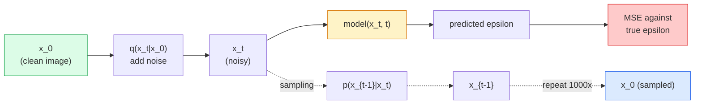

# 图像生成 扩散模型

> 扩散模型学会了化,训练它去除一个噪音的图像中的微小噪音,

> **【中文解读】**扩散模型学习去噪音:训练网络从加一点噪音图像中删除噪音,反向重复一千次就能从纯噪音生成图像――扩散模型是稳定扩散、DALL-E、Midjourney等图像生成工具的核心技术――

> **【拓展：扩散模型的革命】**扩散模型在2022年后取代GAN 成为图像生成的主流. 稳定扩散使用潜在空间扩散. 延迟扩散) 大幅降低计算成本.

**Type:** Build | **类型:** 动手
**Languages:** Python | **语言:** Python
**Prerequisites:** Phase 4 Lesson 07 (U-Net), Phase 1 Lesson 06 (Probability), Phase 3 Lesson 06 (Optimizers) | **前置知识:** Phase 4 Lesson 07（U-Net），Phase 1 Lesson 06（概率），Phase 3 Lesson 06（优化器）
**Time:** ~75 minutes | **时间:** ~75 分钟

## 学习目标

- 导出前面噪声过程`x_0 -> x_1 -> ... -> x_T`解释为什么封闭形式`q(x_t | x_0)`适用于任何t
- 实施一个DDPM类型的训练目标,以降低每一步增加的噪音,以及从纯噪音转向图像的样本采集器
- 建立一个时间条件的U-Net (足够小以训练CPU) 预测任何时间步骤的噪音
- 解释DDPM和DDIM采样之间的区别,以及当每一个适当时 (23课程涵盖了流量匹配和深度调整流量)

> **【中文解读】**学习目标列出了课程完成后应掌握的核心能力.建议在开始学习前先浏览目标,学习完后对照检查是否已实现.


## 问题 问题引入

射器产生一次性:噪音进入,图像出,前进一次. 他们很快,很难训练. 扩散模型以反复生成:从纯噪音开始,以小步骤描述,图像出现. 他们很慢,很容易训练. 过去五年来,后者主导着:任何小团队都可以训练一个扩散模型并获得合理的样本;

> 它们的速度快,但难以训练. 扩散模型的代代码:从纯噪音开始,小步到噪音,图像逐渐显现. 它们的速度慢,但容易训练.

除了训练稳定之外,扩散的反复结构是解锁现代图像生成所做的一切:文本定制,涂料,图像编辑,超级分辨率,可控制的风格. 采样循环的每一步都是注入新限制的地方. 这就是为什么稳定射,图像,DALL-E 3,中程,以及你使用的所有可控制的图像模型都是基于射的原因.

> 除了训练稳定性,扩散的代结构解锁了现代图像生成所做的一切:文本条件化,图像修复,图像编辑,超分辨率,可控风格――采样循环的每一步都是注入新约束的地方――这就是为什么稳定扩散,图像,DALL-E 3 和中途和你将使用的每个可控图像模型都是基于扩散的.

这一课构建了最小的DDPM:前面噪音,后面代号,训练循环.下一课 (稳定分散) 将其连接到一个生产系统中,使用了VAE,文本编码器和无分类器指导.

> 本课构建最小的DPM:前向加噪、后向去噪音、训练循环──下一课(稳定传播) 将它连接到生产系统,包含VAE、文本编码器和无分类器引导──

## 概念的核心概念

> **【中文解读】**本节介绍核心概念和理论基础.掌握这些概念是后续动手实现的前提,同时也是面试和工程实践中高频考察的知识点.


### 未来的过程

拍照`x_0`添加一个小量的高斯噪音,得到`x_1`添加一个小额的额外的`x_2`继续走T步骤,直到`x_T`几乎无法与纯粹的高斯噪音区分.

> 取一张图像 `x_0`,,,,,,,,,,,,,,,,,,,,,,,,,,,,,,,,,,,,,,,,,,,,,,,,,,,,,,,,,,,,,,,,,,,,,,,,,,,,,,,,,,,,,,,,,,,,,,,,,,,,,,,,,,,,,,,,,,,,,,,,,,,,,,,,,,,,,,,,,,,,,,,,,,,,,,,,,,,,,,,,,,,,,,,,,,,,,,,,,,,,,,,,,,,,,,,,,,,,,,,,,,,,,,,,,,,,,,,,,,,,,,,,,,,,,,,,,,,,,,,,,,,,,,,,,,,,,,`x_1`让我们再加上一点.`x_2`持续到`x_T`几乎无法与纯高音噪音区分.

```
q(x_t | x_{t-1}) = N(x_t; sqrt(1 - beta_t) * x_{t-1},  beta_t * I)
```

`beta_t`射频率为 0.0001 射频率,通常是从 0.0001 到 0.02 射频率的小变量时间表.

> `beta_t`是一个小的方差调度,通常在T=1000步内从 0.0001 线性增长到 0.02 个.

### 闭式跳跃

增加噪音一步一步是马科夫链,但数学折叠:你可以样本`x_t`直接从`x_0`在一个步骤.

> 一步增加噪音是一个可行的链,但数学上可以折叠:你可以直接从一步.`x_0`采样`x_t`,我知道.

```
Define alpha_t = 1 - beta_t
Define alpha_bar_t = prod_{s=1..t} alpha_s

Then:
  q(x_t | x_0) = N(x_t; sqrt(alpha_bar_t) * x_0,  (1 - alpha_bar_t) * I)

Equivalently:
  x_t = sqrt(alpha_bar_t) * x_0 + sqrt(1 - alpha_bar_t) * epsilon
  where epsilon ~ N(0, I)
```

在训练中,你选择一个随机的`t`样本`x_t`直接从`x_0`没有必要模拟整个马科夫链.

> 这一方程就是扩散模型的实际原因.`t`直接从`x_0`采样`x_t`没有必要模拟完整的马可夫链.

### 逆转过程

进步过程是固定的.`p(x_{t-1} | x_t)`扩散模型不能预测`x_{t-1}`它们可以预测噪音.`epsilon`通过步骤 t,数学取出`x_{t-1}`没有任何东西.

> 前向过程是固定的.`p(x_{t-1} | x_t)`是神经网络要学习的.`x_{t-1}`它们预测第一个步骤的噪音`epsilon`然后通过数学推得到`x_{t-1}`,我知道.



### 训练损失

对于每一步的训练:

> 每个训练步骤:

1. 样本真实图像`x_0`现在,我们要去.
   中文翻译:采样一张真实图像 `x_0`,我知道.
2. 时间步骤的样本`t`从 [1,T] 开始均.
   中文翻译:从 [1, T] 中均采样一个时间步 `t`,我知道.
3. 样本噪音`epsilon ~ N(0, I)`现在,我们要去.
   中文翻译:采样噪音`epsilon ~ N(0, I)`,我知道.
4. 计算`x_t = sqrt(alpha_bar_t) * x_0 + sqrt(1 - alpha_bar_t) * epsilon`现在,我们要去.
   中文翻译:计算`x_t = sqrt(alpha_bar_t) * x_0 + sqrt(1 - alpha_bar_t) * epsilon`,我知道.
5. 预测`epsilon_theta(x_t, t)`通过网络.
   中文翻译:用网络预测 `epsilon_theta(x_t, t)`,我知道.
6. 减少`|| epsilon - epsilon_theta(x_t, t) ||^2`现在,我们要去.
   中文翻译:最小化`|| epsilon - epsilon_theta(x_t, t) ||^2`,我知道.

网络学会在任何时间阶段预测噪音. 损失是MSE. 没有对抗游戏,没有崩,没有振荡.

> 没有抗击,没有模式塌,没有振荡.

### 样本采集器 (DDPM)

发电:从`x_T ~ N(0, I)`走向后一步一步.

```
for t = T, T-1, ..., 1:
    eps = model(x_t, t)
    x_{t-1} = (1 / sqrt(alpha_t)) * (x_t - (beta_t / sqrt(1 - alpha_bar_t)) * eps) + sqrt(beta_t) * z
    where z ~ N(0, I) if t > 1, else 0
return x_0
```

关键是,尽管反向条件通常不被关闭形式中知道,但对于这个特定的高斯式前进过程,它是.看起来丑的系数是贝斯规则给你的.

> 关键在于,虽然一般情况下反向概率没有封闭形式的解,但对于这个特定的高斯前向过程有点......那些看起来丑的系数正是贝叶斯法则所提供的结果.

### 为什么要走1000步

预测时间表是选择的,因此每个步骤只增加足够的噪音,以使反步骤几乎是高斯的.太少步骤和反步骤远离高斯的,网络无法很好地建模.随着收益的减少,太多步骤和样本取量变得昂贵.T=1000具有线性时间表是DDPM默认.

> 预向噪音调节的设计使得每一步只增加足够少的噪音,从而反向步骤接近高的. 步数太少,反向步骤远离高分布,网络无法很好地建模; 步数太多,样式变得昂贵,收益可减.

### 化物:采样速度20倍

训练是一样的.样本采集变化.DDIM (Song et al.,2020) 定义了一个决定性逆转过程,它不会再训练.用DDIM进行50步的样本采集,可以达到1000步的DDPM质量.每个生产系统都使用DDIM或更快的变体 (DPM-Solver,尤勒祖先).

> 训练方式不变,采样方式改变――DDIM(Song等,2020) 定义了一个确定性的反向过程,可以跳过时间步骤而无需重新训练――使用DDIM50步采样可以达到接近1000步DDPM的质量――每个生产系统都使用DDIM或更快的变体――DPM-Solver、Euler祖先)――

### 时间定制

网络`epsilon_theta(x_t, t)`现代扩散模型注射`t`通过状时间嵌入 (像变压器中的位置编码一样的想法) 添加到每个U-Net级别的功能地图中.

> 网络`epsilon_theta(x_t, t)`需要知道它在去噪声的时间步骤.现代扩散模型通过正弦时间嵌入.`t`在每个U-Net层面的特征图上加上.

```
t_embedding = sinusoidal(t)
feature_map += MLP(t_embedding)
```

没有时间调节,网络必须从图像本身猜测噪音水平,

> 没有时间条件,网络必须从图像本身猜测噪音水平,所以虽然可以工作,但样本效率更低.

> **【拓展：工业部署中的视觉系统】**在实际工业部署中,视觉模型需要考虑推迟模型大小的边缘设备适应等问题.

> **【拓展：数据标注与质量】**视觉任务的效果高度依赖标签数据质量――标签工作室、CVAT是主流标签工具――在工业场景中,主动学习(主动学习) 可以减少标签成本:模型对不确定的样本请求人工标签,确定性的样本自动标签――


## 建立它,实现它.

> **【中文解读】**本节通过代码实现从零到核心算法――这种"从零开始"的方式可以帮助理解框架背后的原理,遇到问题时不会被黑盒困住――

```figure
cv-diffusion-image
```

## 建立它

### 步骤1:噪音时间表

```python
import torch

def linear_beta_schedule(T=1000, beta_start=1e-4, beta_end=2e-2):
    return torch.linspace(beta_start, beta_end, T)


def precompute_schedule(betas):
    alphas = 1.0 - betas
    alphas_cumprod = torch.cumprod(alphas, dim=0)
    return {
        "betas": betas,
        "alphas": alphas,
        "alphas_cumprod": alphas_cumprod,
        "sqrt_alphas_cumprod": torch.sqrt(alphas_cumprod),
        "sqrt_one_minus_alphas_cumprod": torch.sqrt(1.0 - alphas_cumprod),
        "sqrt_recip_alphas": torch.sqrt(1.0 / alphas),
    }

schedule = precompute_schedule(linear_beta_schedule(T=1000))
```

预计一次,在训练和采样过程中按指数收集.

> 预计算一次,训练和采样时通过索引采用.

### 步骤2:前进扩散 (q_样本)

```python
def q_sample(x0, t, noise, schedule):
    sqrt_a = schedule["sqrt_alphas_cumprod"][t].view(-1, 1, 1, 1)
    sqrt_one_minus_a = schedule["sqrt_one_minus_alphas_cumprod"][t].view(-1, 1, 1, 1)
    return sqrt_a * x0 + sqrt_one_minus_a * noise
```

单行封闭形式`t`是一个时间步骤,每一个图像的批量.

> 一行闭合形式.`t`是一批时间步,每张图像一个.

### 步骤3:一个小的时间条件的U-网

```python
import torch.nn as nn
import torch.nn.functional as F
import math

def timestep_embedding(t, dim=64):
    half = dim // 2
    freqs = torch.exp(-math.log(10000) * torch.arange(half, device=t.device) / half)
    args = t[:, None].float() * freqs[None]
    emb = torch.cat([args.sin(), args.cos()], dim=-1)
    return emb


class TinyUNet(nn.Module):
    def __init__(self, img_channels=3, base=32, t_dim=64):
        super().__init__()
        self.t_mlp = nn.Sequential(
            nn.Linear(t_dim, base * 4),
            nn.SiLU(),
            nn.Linear(base * 4, base * 4),
        )
        self.t_dim = t_dim
        self.enc1 = nn.Conv2d(img_channels, base, 3, padding=1)
        self.enc2 = nn.Conv2d(base, base * 2, 4, stride=2, padding=1)
        self.mid = nn.Conv2d(base * 2, base * 2, 3, padding=1)
        self.dec1 = nn.ConvTranspose2d(base * 2, base, 4, stride=2, padding=1)
        self.dec2 = nn.Conv2d(base * 2, img_channels, 3, padding=1)
        self.time_proj = nn.Linear(base * 4, base * 2)

    def forward(self, x, t):
        t_emb = timestep_embedding(t, self.t_dim)
        t_emb = self.t_mlp(t_emb)
        t_proj = self.time_proj(t_emb)[:, :, None, None]

        h1 = F.silu(self.enc1(x))
        h2 = F.silu(self.enc2(h1)) + t_proj
        h3 = F.silu(self.mid(h2))
        d1 = F.silu(self.dec1(h3))
        d2 = torch.cat([d1, h1], dim=1)
        return self.dec2(d2)
```

两个层次的U-Net,时间调节注射在瓶.

> 两层U-Net,在瓶层注入时间条件化.

### 步骤4:训练循环

```python
def train_step(model, x0, schedule, optimizer, device, T=1000):
    model.train()
    x0 = x0.to(device)
    bs = x0.size(0)
    t = torch.randint(0, T, (bs,), device=device)
    noise = torch.randn_like(x0)
    x_t = q_sample(x0, t, noise, schedule)
    pred = model(x_t, t)
    loss = F.mse_loss(pred, noise)
    optimizer.zero_grad()
    loss.backward()
    optimizer.step()
    return loss.item()
```

没有GAN游戏,没有专业损失,只有一个MSE电话.

> 这就是整个训练循环.没有GAN对抗博,没有特殊损失函数,只需要一个MSE调用.

### 步骤5:样本采集 (DDPM)

```python
@torch.no_grad()
def sample(model, schedule, shape, T=1000, device="cpu"):
    model.eval()
    x = torch.randn(shape, device=device)
    betas = schedule["betas"].to(device)
    sqrt_one_minus_a = schedule["sqrt_one_minus_alphas_cumprod"].to(device)
    sqrt_recip_alphas = schedule["sqrt_recip_alphas"].to(device)

    for t in reversed(range(T)):
        t_batch = torch.full((shape[0],), t, dtype=torch.long, device=device)
        eps = model(x, t_batch)
        coef = betas[t] / sqrt_one_minus_a[t]
        mean = sqrt_recip_alphas[t] * (x - coef * eps)
        if t > 0:
            x = mean + torch.sqrt(betas[t]) * torch.randn_like(x)
        else:
            x = mean
    return x
```

实际代码中,你会换一个DDIM50步样品器.

> 在实际代码中,你将被转换为DDIM50步采样器.

### 步骤 6:DDIM样品 (确定性,速度大约20倍)

```python
@torch.no_grad()
def sample_ddim(model, schedule, shape, steps=50, T=1000, device="cpu", eta=0.0):
    model.eval()
    x = torch.randn(shape, device=device)
    alphas_cumprod = schedule["alphas_cumprod"].to(device)

    ts = torch.linspace(T - 1, 0, steps + 1).long()
    for i in range(steps):
        t = ts[i]
        t_prev = ts[i + 1]
        t_batch = torch.full((shape[0],), t, dtype=torch.long, device=device)
        eps = model(x, t_batch)
        a_t = alphas_cumprod[t]
        a_prev = alphas_cumprod[t_prev] if t_prev >= 0 else torch.tensor(1.0, device=device)
        x0_pred = (x - torch.sqrt(1 - a_t) * eps) / torch.sqrt(a_t)
        sigma = eta * torch.sqrt((1 - a_prev) / (1 - a_t) * (1 - a_t / a_prev))
        dir_xt = torch.sqrt(1 - a_prev - sigma ** 2) * eps
        noise = sigma * torch.randn_like(x) if eta > 0 else 0
        x = torch.sqrt(a_prev) * x0_pred + dir_xt + noise
    return x
```

> **【中文解读】**本节展示了如何使用成熟框架 (如PyTorch、HuggingFace等) 快速应用该技术.


`eta=0`总是完全确定性 (相同的噪音输入总是产生相同的输出).`eta=1`恢复了DDPM.

> `eta=0`是完全确定性的, 输入总是产生相同的输出.`eta=1`则退化为DPM──


> **【拓展：视觉模型的持续学习】**在生产环境中,视觉模型需要不断适应新数据. 持续学习. 持续学习. 技术可以防止模型在适应新数据时忘记旧知识.

## 用它实现框架

对于生产工作,使用`diffusers`其他:

```python
from diffusers import DDPMScheduler, UNet2DModel

unet = UNet2DModel(sample_size=32, in_channels=3, out_channels=3, layers_per_block=2)
scheduler = DDPMScheduler(num_train_timesteps=1000)
```

图书馆提供准备好的时间表表 (DDPM,DDIM,DPM-Solver,Euler,Heun),可配置的U-Nets,用于文字到图像和图像到图像的管道以及LoRA精细调辅助器.

为了研究,`k-diffusion`现在,我们需要一个新的方法来做出.

> **【中文解读】**本节关注如何将模型部署为可用的产品. 从原型到生产级系统需要考虑性能优化,错误处理,监控等多个维度.


## 运送它.

这一课产生了:

- `outputs/prompt-diffusion-sampler-picker.md`根据质量目标,延迟预算和条件类型,选择DDPM / DDIM / DPM-Solver / Euler的提示.
- `outputs/skill-noise-schedule-designer.md`一种技能,以T和目标腐败水平为线性,共数或西格莫ид的贝塔时间表,加上随时间的信号与噪音比的诊断图表.

> **【中文解读】**练习题按照易/中/难 三个难度递进;;建议至少完成中级题,Hard级适合深入研究或面试准备;;


## 练习题

1. **(Easy)**视觉化前进过程: 拍下一个图像和图片`x_t`在`t in [0, 100, 250, 500, 750, 1000]`检查一下`x_1000`像纯粹的高斯噪音.
2. **(Medium)**训练TinyUNet在20个时代的合成圈数据集上,并采样16个圈. 比较DDPM (1000步) 和DDIM (50步) 采样,它们是否从同一种噪音种子中产生相似的图像?
3. **(Hard)**实施一个音时间表 (尼乔尔和达里瓦尔,2021年):`alpha_bar_t = cos^2((t/T + s) / (1 + s) * pi / 2)`训练相同的模型,使用线性和共数表,并证明共数在低步数下提供更好的样本.

> **【中文解读】**在团队协作中,统一术语定义可以避免大量沟通误解.


## 关键词 快速查找表

| Term | What people say | What it actually means |
|------|----------------|----------------------|
| Forward process | "Add noise over time" | Fixed Markov chain that corrupts an image into Gaussian noise over T steps |
| Reverse process | "Denoise step by step" | Learned distribution that walks back from noise to image |
| Epsilon prediction | "Predict the noise" | The training target: `epsilon_theta(x_t, t)` predicts the noise added at step t |
| Beta schedule | "Noise amounts" | Sequence of T small variances that define how much noise enters per step |
| alpha_bar_t | "Cumulative retain factor" | Product of (1 - beta_s) up to time t; bigger t means less signal left |
| DDPM sampler | "Ancestral, stochastic" | Samples each x_{t-1} from its conditional Gaussian; 1000 steps |
| DDIM sampler | "Deterministic, fast" | Rewrites sampling as a deterministic ODE; 20-100 steps with similar quality |
| Time conditioning | "Tell the model which t" | Sinusoidal embedding of t injected into the U-Net so it knows the noise level |

> **【中文解读】**延伸阅读提供了深入学习的高质量资源. 这些论文和教程是该领域的经典参考文献,适合需要深入了解的读者.


## 继续阅读 继续阅读

- [Denoising Diffusion Probabilistic Models (Ho et al., 2020)](https://arxiv.org/abs/2006.11239)使传播成为实践的论文,
- [Improved DDPM (Nichol & Dhariwal, 2021)](https://arxiv.org/abs/2102.09672) 代数表和v参数化
- [DDIM (Song, Meng, Ermon, 2020)](https://arxiv.org/abs/2010.02502)使实时推断成为可能的确定性样本
- [Elucidating the Design Space of Diffusion (Karras et al., 2022)](https://arxiv.org/abs/2206.00364)对每种扩散设计选择的统一视图;目前最好的参考
