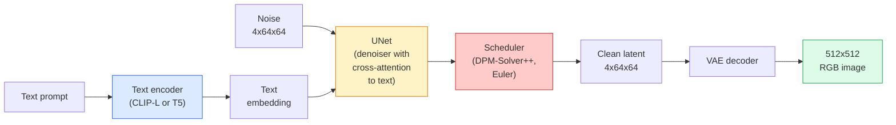

# 结构与微调

> 稳定扩散是DDPM,在预训练的VAE的隐藏空间中运行,通过横向注意力来调节文字,用快速确定性ODE解决器进行样本测试,并通过无分类器指导来引导.

> **【中文解读】**稳定分散是通过交叉注意力 (交叉注意力) 接受文本条件,使用快速确定性 ODE 求解器采样,并通过无分类器引导 (无分类器引导) 控制生成质量.

> **【拓展：Stable Diffusion 生态】**稳定扩散 衍生出LoRA (Light Quantity) 控制网 (ControlNet) 控制姿态/边缘 (IP-Adapter) 等丰富生态.

**Type:** Learn + Use | **类型:** 学习 + 应用
**Languages:** Python | **语言:** Python
**Prerequisites:** Phase 4 Lesson 10 (Diffusion), Phase 7 Lesson 02 (Self-Attention) | **前置知识:** Phase 4 Lesson 10（扩散模型），Phase 7 Lesson 02（自注意力）
**Time:** ~75 minutes | **时间:** ~75 分钟

## 学习目标

- 追踪稳定扩散管道的五个部分:VAE,文本编码器,U-Net,时间表,安全检查器以及它们实际上每一个都做什么
- 解释隐藏扩散以及为什么训练在4x64x64隐藏空间 (而不是3x512x512图像) 减少计算量48倍,而不损失质量
- 使用`diffusers`通过控制网进行图像生成,图像到图像运行,涂料和引导生成
- 调整细节,在小型定制数据集上使用LoRA稳定扩散,并在推断时加载LoRA适配器

> **【中文解读】**学习目标列出了课程完成后应掌握的核心能力.建议在开始学习前先浏览目标,学习完后对照检查是否已实现.


## 问题 问题引入

直接在512x512RGB图像上训练DDPM是昂贵的.每一步训练都通过U-Net来回升,看到3x512x512 =786,432输入值,采样需要50+次通过同一U-Net.在稳定扩散1.5的质量水平 (2022年发布) 上,像素空间扩散需要大约256个GPU月的训练和每张图像在消费GPU上需要10-30秒.

> 直接在512x512 RGB 图像上训练 DDPM 很昂贵.每个训练步骤都需要通过一个看到3x512x512 = 786,432 个输入值的 U-Net 反向传播,采样需要通过同一个 U-Net 进行 50+ 次前向传播.

让开放式文字到图像的操作是**latent diffusion**训练一个VAE,将3x512x512图像映射到4x64x64隐形子,然后在隐形空间中进行扩散.计算下降到`(3*512*512)/(4*64*64) = 48x`在同一GPU上取样从几十秒钟下降到两个秒钟以下.

> 让开放权重文本成图像成为实用的技巧是**潜空间扩散**们的图像将映射到4x64x64 潜张量并恢复,然后在潜空间中进行扩散.`(3*512*512)/(4*64*64) = 48x`,在同一GPU上采样从几秒降到两秒内.

几乎所有现代图像生成模型都是隐藏的扩散模型,其变化包括自动编码器,指标器 (U-Net或 DiT) 和文本调节.学习稳定扩散,你已经学习了模板.

> 几乎每个现代图像生成模型都是潜空间扩散模型,在自编码器,去噪音器 (U-Net或 DiT) 和文本条件化上有所不同.

## 概念的核心概念

> **【中文解读】**本节介绍核心概念和理论基础.掌握这些概念是后续动手实现的前提,同时也是面试和工程实践中高频考察的知识点.


### 管道



- **VAE**冷的自动编码器.编码器将图像转化为隐形 (用于img2img和训练).解码器将隐形转化为图像.
  中文翻译:VAE结的自编码器──编码器将图像转换为潜变量(用于img2img 和训练),解码器将潜变量回到原为图像──
- **Text encoder** CLIP文本编码器 (SD 1.x/2.x), CLIP-L + CLIP-G (SDXL),或 T5-XXL (SD3/FLUX).生成一个代币嵌入的序列.
  中文翻译:文本编码器CLIP 文本编码器(SD 1.x/2.x)、CLIP-L + CLIP-G(SDXL) 或 T5-XXL(SD3/FLUX) ─产生一系列代币嵌入──
- **U-Net**标示器. 具有跨重视层,从隐藏到每个分辨率级别内嵌的文本.
  中文翻译:U-Net去噪器──包含交叉注意力层,从潜量关订本嵌入在每个分辨率级别上──
- **Scheduler**采样算法 (DDIM,Euler,DPM-Solver++). 选择了 sigmas,将预测的噪音混合到隐藏中.
  中文翻译:调度器采样算法(DDIM、Euler、DPM-Solver++) 』选择sigma 值,将预测的噪音混合回潜变量──
- **Safety checker**输出图像上可选的NSFW/非法内容过器.
  中文翻译:安全检查器可选的NSFW / 违规内容过器,作用于输出图像──

### 无分类指导 (CFG)

简体文本调节学习`epsilon_theta(x_t, t, c)`每次提醒`c` CFG 运营同一个网络`c`结果是: 由于声的发生在声中,声的发生在声中,声的发生在声中.

> 纯文本条件化学习 `epsilon_theta(x_t, t, c)`对每一个提示词`c`△CFG 训练同一个网络时10%的时间丢弃`c`换为空嵌入,得到一个同时预测条件噪音和无条件噪音的模型.

```
eps = eps_uncond + w * (eps_cond - eps_uncond)
```

`w`率是指导的.`w=0`没有条件`w=1`完全有条件的.`w>1`通过 SD 默认方式, SD 输出将会变得更"即时"`w=7.5`现在,我们要去.

> `w`是引导尺度.`w=0`是无条件的产生,`w=1`是普通条件产生,`w>1`为了牺牲多样性,推动出口更符合提示词.`w=7.5`,我知道.

由于CFG是文字到图像的原因,因此产品质量很好.如果没有CFG,输出偏差很弱;如果没有CFG,输出偏差很弱.

> 没有它,提示词对输出的影响很弱;有它,提示词占据主导地位.

### 隐形空间几何学

射器的4通道隐藏不仅仅是压缩图像. 它是一个多元化,数学的大致与语义编辑相匹配 (即时工程 + 插曲都在这里生活), 无机4x64x64隐藏的解码不会产生随机看起来的图像,它产生垃圾,因为只有特定的隐藏的子组才能解码有效的图像.

> 道潜量不仅仅是压缩图像――它是一个流形,它的算术运算大致对应语义编辑 (提示词工程和插值都发生在这里),也在 U-Net 训练中投入全部建模预算的地方――解码一个随机的4x64x64 潜量不会产生随机图像它产生垃圾,因为只有潜量的特定流形才能解码为有效图像――

两种后果:

> 两个后果:

1. **Img2img**图像结构存活,因为编码几乎可以逆转;内容根据提示变化.
   翻译: 中文**Img2img**图像编码为潜变量,添加部分噪音,运行去噪音器,解码――图像结构保留,因为编码近似可逆;内容根据提示词变化――
2. **Inpainting**= 与 img2img相同,但指标只更新隐藏区域;未隐藏区域则保持在编码的隐藏状态.
   翻译: 中文**Inpainting**= 与 img2img 相似,但去噪器只更新掩码区域;未掩码区域保持编码后的潜变量.

### 网络架构

 SD U-Net是从10课开始的TinyUNet的大版本,

>  SD 的 U-Net 是第十课 TinyUNet 的大版本,增加了三个组件:

- **Transformer blocks**在每一个空间分辨率上,包含自我注意力+对文本嵌入的横向注意力.
  中文翻译:每个空间分辨率上的变压器块,包含自注意力 + 对文本嵌入的交叉注意力――
- **Time embedding**通过MLP在鼻状编码上.
  中文翻译:通过MLP 处理正弦编码的时间嵌入.
- **Skip connections**在相匹配分辨率的编码器和解码器之间.
  中文翻译:编码器和编码器在匹配分辨率之间跳跃连接.

总参数在SD 1.5: ~860M.SDXL: ~2.6B.FLUX: ~12B.参数跳跃主要是在注意层.

> 总参数约8.6亿.SDXL约26亿.FLUX约120亿.参数的增长主要来自注意力层.

### 洛拉细调

稳定散的完整细节调整需要20 GB以上的VRAM,并更新了860M参数.LoRA (低级调整) 保持了基模型的冷,并将小级分解矩阵注入注意层中.SD的LoRA适配器通常为10-50MB,在单个消费者GPU上在10-60分钟内运行,并在推断时间中作为降入修改进行加载.

> 稳定分散的全量微调需要20+GB 显存并更新8.6亿参数――LoRA(低秩适应) 保持基础模型结,在注意力层内注入小型秩分解矩阵――SD的LoRA 适配器通常只有10-50MB,在单张消费级GPU上训练10-60分钟,推理时作为即插即用的修改加载――

```
Original: W_q : (d_in, d_out)   frozen
LoRA:     W_q + alpha * (A @ B)   where A : (d_in, r), B : (r, d_out)

r is typically 4-32.
```

洛拉是几乎每个社区的细节调节分布的方式.

> 洛拉是几乎所有社区微调的发育方式.

### 你会看到的时间表

- **DDIM**确定性,50步,简单.
  中文翻译:DDIM确定性,约50步,简单――
- **Euler ancestral** ,30-50步,稍微有创意的样本.
  中文翻译:埃勒祖先随机性,30-50步,样本更具创意.
- **DPM-Solver++ 2M Karras**定性,20-30步,生产默认.
  中文翻译:DPM-Solver++ 2M Karras确定性,20-30 步,生产环境默认选择。
- **LCM / TCD / Turbo**一致性模型和蒸变体; 1-4步,以某些质量为代价.
  中文翻译:LCM / TCD / Turbo一致性模型和蒸变体;1-4 步,代价是一些质量损失.

交换时间表是单行变化`diffusers`并且有时在没有任何重新培训的情况下解决样本问题.

> 在`diffusers`中切换调节器只需要一行代码,有时不需要重新训练就能修复样本问题.

> **【中文解读】**本节通过代码实现从零到核心算法――这种"从零开始"的方式可以帮助理解框架背后的原理,遇到问题时不会被黑盒困住――

> **【拓展：工业部署中的视觉系统】**在实际工业部署中,视觉模型需要考虑推迟模型大小的边缘设备适应等问题.

> **【拓展：数据标注与质量】**视觉任务的效果高度依赖标签数据质量――标签工作室、CVAT是主流标签工具――在工业场景中,主动学习(主动学习) 可以减少标签成本:模型对不确定的样本请求人工标签,确定性的样本自动标签――


## 建立它,实现它.
```figure
cv3-latent-compression
```

## 建立它

这一课使用`diffusers`它们是自主课程的主题,而不是从零开始重建稳定扩散.你需要重建的部分 (VAE,文本编码器,U-Net,规划器).

> 本课端到端使用`diffusers`而不是从零重建稳定传播.你需要重建组件.

### 步骤1:文字到图像

```python
import torch
from diffusers import StableDiffusionPipeline

pipe = StableDiffusionPipeline.from_pretrained(
    "runwayml/stable-diffusion-v1-5",
    torch_dtype=torch.float16,
).to("cuda")

image = pipe(
    prompt="a dog riding a skateboard in tokyo, studio ghibli style",
    guidance_scale=7.5,
    num_inference_steps=25,
    generator=torch.Generator("cuda").manual_seed(42),
).images[0]
image.save("dog.png")
```

`float16`没有明显的质量损失. `num_inference_steps=25`具有默认的DPM-Solver++匹配`num_inference_steps=50`通过DDIM.

> `float16`减半显现存储量且没有明显质量损失.`num_inference_steps=25`等效于使用DDIM的`num_inference_steps=50`,我知道.

### 步骤 2: 改变时间表

```python
from diffusers import DPMSolverMultistepScheduler, EulerAncestralDiscreteScheduler

pipe.scheduler = DPMSolverMultistepScheduler.from_config(pipe.scheduler.config)
pipe.scheduler = EulerAncestralDiscreteScheduler.from_config(pipe.scheduler.config)
```

时间表表的状态与U-Net权重分离.你可以训练DDPM和任何时间表表的样本.

> 调度器状态与U-Net权重解──可在DDPM上训练,使用任何调度器采样──

### 步骤3:图像对图像

```python
from diffusers import StableDiffusionImg2ImgPipeline
from PIL import Image

img2img = StableDiffusionImg2ImgPipeline.from_pretrained(
    "runwayml/stable-diffusion-v1-5",
    torch_dtype=torch.float16,
).to("cuda")

init_image = Image.open("dog.png").convert("RGB").resize((512, 512))
out = img2img(
    prompt="a dog riding a skateboard, oil painting",
    image=init_image,
    strength=0.6,
    guidance_scale=7.5,
).images[0]
```

`strength`音量是指在除之前增加多少噪音 (0.0 = 没有变化, 1.0 = 完全再生).

> `strength`控制去噪音前添加多少噪音(0.0 = 不变,1.0 = 完全重新生成) ・0.5-0.7 是风格迁移的标准范围──

### 步骤4:涂料

```python
from diffusers import StableDiffusionInpaintPipeline

inpaint = StableDiffusionInpaintPipeline.from_pretrained(
    "runwayml/stable-diffusion-inpainting",
    torch_dtype=torch.float16,
).to("cuda")

image = Image.open("dog.png").convert("RGB").resize((512, 512))
mask = Image.open("dog_mask.png").convert("L").resize((512, 512))

out = inpaint(
    prompt="a cat",
    image=image,
    mask_image=mask,
    guidance_scale=7.5,
).images[0]
```

面具中的白色像素是再生区域.

> 掩码中白色图像是需要重新生成的区域,黑色图像被保留了.

### 步骤5:LoRA加载

```python
pipe.load_lora_weights("sayakpaul/sd-lora-ghibli")
pipe.fuse_lora(lora_scale=0.8)

image = pipe(prompt="a village square in ghibli style").images[0]
```

`lora_scale`控制强度;0.0 =没有效果,1.0 =完全效果. `fuse_lora`调用器将适配器放入适配的重量,但防止交换.`pipe.unfuse_lora()`在加载不同的适配器之前.

> `lora_scale`控制强度;0.0 = 无效,1.0 = 完全效果.`fuse_lora`将适配器融合到重中以提高速度,但会阻止切换.`pipe.unfuse_lora()`,我知道.

### 步骤 6: LoRA培训 (草图)

实际的LORA培训生活在`peft`或`diffusers.training`概述:

> 真正的洛拉训练在`peft`或`diffusers.training`概述如下:

```python
# Pseudocode
for step, batch in enumerate(dataloader):
    images, prompts = batch
    latents = vae.encode(images).latent_dist.sample() * 0.18215

    t = torch.randint(0, num_train_timesteps, (batch_size,))
    noise = torch.randn_like(latents)
    noisy_latents = scheduler.add_noise(latents, noise, t)

    text_emb = text_encoder(tokenizer(prompts))

    pred_noise = unet(noisy_latents, t, text_emb)  # LoRA weights injected here

    loss = F.mse_loss(pred_noise, noise)
    loss.backward()
    optimizer.step()
```

> **【中文解读】**本节展示了如何使用成熟框架 (如PyTorch、HuggingFace等) 快速应用该技术.


只有LoRA矩阵才会接收梯度;基层U-Net,VAE和文本编码器被结. 随着批量大小为1和梯度检查点,这适合8GB的VRAM.

> 只有LoRA 矩阵接收梯度;基础U-Net、VAE 和文本编码器都是结尾的.


> **【拓展：视觉模型的持续学习】**在生产环境中,视觉模型需要不断适应新数据. 持续学习. 持续学习. 技术可以防止模型在适应新数据时忘记旧知识.

## 用它实现框架

在生产中,你实际做出的决定:

- **Model family**:SD 1.5用于开源社区细节调音,SDXL用于更高的忠诚度,SD3 / FLUX用于最先进的技术和严格的许可要求.
- **Scheduler**: DPM-Solver++ 2M Karras 进行20-30步,LCM-LoRA 延迟低于1秒时.
- **Precision**其他`float16`关于4080/4090的情况`bfloat16`在A100及新型道路上,`int8`(通过`bitsandbytes`或`compel`) 当VRAM紧张时.
- **Conditioning**: 简体文本工作;为了更强大的控制,在基管线上添加ControlNet (可,深度,姿势).

> **【中文解读】**本节关注如何将模型部署为可用的产品. 从原型到生产级系统需要考虑性能优化,错误处理,监控等多个维度.


对于批发发,`AUTO1111`现在,`ComfyUI`对于生产API, `diffusers`其他`accelerate`或`optimum-nvidia`通过 TensorRT 编译.


## 运送它.

这一课产生了:

- `outputs/prompt-sd-pipeline-planner.md`一个提示,以选择SD 1.5 / SDXL / SD3 / FLUX加上调度器和精度,考虑到延迟预算,忠诚度目标和许可限制.
- `outputs/skill-lora-training-setup.md`写完整的 LoRA 训练配置,包括标题,排名,批量大小和学习率.

> **【中文解读】**练习题按照易/中/难 三个难度递进;;建议至少完成中级题,Hard级适合深入研究或面试准备;;


## 练习题

1. **(Easy)**生成相同的提示`guidance_scale`在`[1, 3, 5, 7.5, 10, 15]`图像的变化如何?
2. **(Medium)**拍摄任何真实的照片,查看它.`StableDiffusionImg2ImgPipeline`在`strength`在`[0.2, 0.4, 0.6, 0.8, 1.0]`什么强度保留了组合,同时改变了风格?为什么1.0完全忽略了输入?
3. **(Hard)**训练一个LoRA在一个主体 (一个物,一个标志,一个角色) 的10-20个图像上,并生成其中的主体的新奇场景. 报告LoRA排名和训练步骤,没有过度适应输入图像的最佳身份保护.

> **【中文解读】**在团队协作中,统一术语定义可以避免大量沟通误解.


## 关键词 快速查找表

| Term | What people say | What it actually means |
|------|----------------|----------------------|
| Latent diffusion | "Diffuse in latents" | Run the entire DDPM in the VAE latent space (4x64x64) instead of pixel space (3x512x512); 48x compute saving |
| VAE scale factor | "0.18215" | Constant that rescales the VAE's raw latent to roughly unit variance; hardcoded in every SD pipeline |
| Classifier-free guidance | "CFG" | Mix conditional and unconditional noise predictions; the single most impactful inference knob |
| Scheduler | "Sampler" | The algorithm that turns noise + model predictions into a denoised latent trajectory |
| LoRA | "Low-rank adapter" | Small rank-decomposition matrices that fine-tune attention layers without touching base weights |
| Cross-attention | "Text-image attention" | Attention from latent tokens to text tokens; injects prompt information at every U-Net level |
| ControlNet | "Structure conditioning" | A separately-trained adapter that steers SD with an extra input (canny, depth, pose, segmentation) |
| DPM-Solver++ | "The default scheduler" | Second-order deterministic ODE solver; best quality at low step counts (20-30) in 2026 |

> **【中文解读】**延伸阅读提供了深入学习的高质量资源. 这些论文和教程是该领域的经典参考文献,适合需要深入了解的读者.


## 继续阅读 继续阅读

- [High-Resolution Image Synthesis with Latent Diffusion (Rombach et al., 2022)](https://arxiv.org/abs/2112.10752)稳定散纸;包括任何证明设计合理的除
- [Classifier-Free Diffusion Guidance (Ho & Salimans, 2022)](https://arxiv.org/abs/2207.12598)CFG文件
- [LoRA: Low-Rank Adaptation of Large Language Models (Hu et al., 2021)](https://arxiv.org/abs/2106.09685) LoRA是NLP的第一位;它几乎没有变化转移到SD
- [diffusers documentation](https://huggingface.co/docs/diffusers)每个SD/SDXL/SD3/FLUX管道的参考
