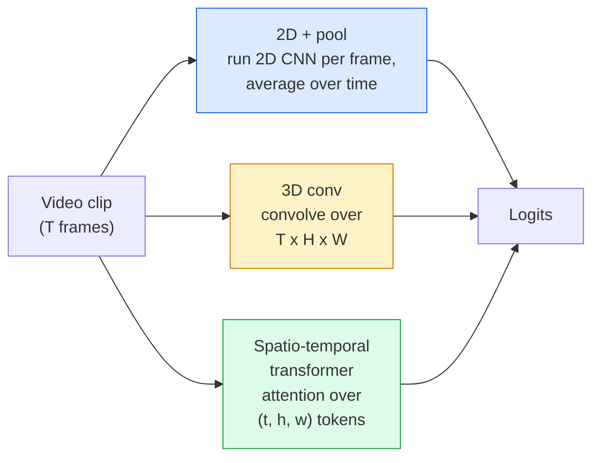

# 视频理解 时代建模

> 视频是一个连接图像的序列,加上它们的物理.每个视频模型都将时间视为额外的轴 (3D conv),一个随访的序列 (变压器),或一个提取一次和池的功能 (2D+池).

> **【中文解读】**视频是一个组图像序列加上连接它们的物理规律. 视频模型的三种流派:3D卷积(时间作为额外维度) 变形机 (Transformer) 时间作为序列) 、2D+池化(每提取特征再聚合) ⋅理解时间维度是视频人工智能的核心挑战.

> **【拓展：视频 AI 应用】**视频理解驱动了YouTube/TikTok的内容推"",安全监控的异常检测"",体育赛事的自动分析――索拉等视频生成模型将视频理解推向新高度的视频理解才能生成视频――

**Type:** Learn + Build | **类型:** 学习 + 动手
**Languages:** Python | **语言:** Python
**Prerequisites:** Phase 4 Lesson 03 (CNNs), Phase 4 Lesson 04 (Image Classification) | **前置知识:** Phase 4 Lesson 03（CNN），Phase 4 Lesson 04（图像分类）
**Time:** ~45 minutes | **时间:** ~45 分钟

## 学习目标

- 区分三个主要的视频建模方法 (2D+pool,3D conv,空间时间变压器) 并预测其成本和精度的折衷
- 在 PyTorch 中实施框架样本,时间聚合和2D+pool基线分类器
- 解释为什么I3D的"膨胀"3D内核从ImageNet权重中转移得很好,以及一个因子化 (2+1)D conv的作用是什么?
- 阅读标准的行动识别数据集和指标:kinetics-400/600,UCF101,Something-Something V2;在剪辑和视频水平上,最准确的1

> **【中文解读】**学习目标列出了课程完成后应掌握的核心能力.建议在开始学习前先浏览目标,学习完后对照检查是否已实现.


## 问题 问题引入

30秒钟的视频以30fps的速度达到900图像.天真的是,视频分类是运行900次的图像分类,然后是某种类型的集成.当行动几乎在每个框架中 (体育,,运动视频) 显现时,它就会很糟糕地失败,当行动由运动本身定义时:"从左向右推东西"看起来像每个框架中的两个静止物体.

> 30秒 30fps 的视频是900张图像――简单地看,视频分类就是把图像分类运行900次然后聚在一起――当动作几乎每天都可见时 (体育、、健身视频) 这有效,但当动作由运动定义时则严重失败:"把东西从左推到右"在每一看起来都是两个静止的物体――

每个视频架构的核心问题是:时间结构是什么时候建模的,以及如何?答案驱动着其他一切 计算成本,预训练策略,是否可以重复使用 ImageNet 重量,模型训练的数据集.

> 每个视频架构的核心问题是:时序结构何时建建,以及如何建?答案驱动其他一切计算成本、预训练策略、是否可以重复使用ImageNet权重、模型在哪些数据集上训练――

视频理解主要是关于时间故事:采样,建模和集成.

> 视频理解主要是关于时间序列的故事:采样,建模和聚合.

## 概念的核心概念

> **【中文解读】**本节介绍核心概念和理论基础.掌握这些概念是后续动手实现的前提,同时也是面试和工程实践中高频考察的知识点.


### 建筑的三个家庭



### 两维+游泳池

运行一个2DCNN (ResNet,EfficientNet,ViT).在每个采样框架上独立运行.平均 (或最大池,或注意池) 每个框架嵌入.将集成向量输送到一个分类器.

> 取一个2DCNN(ResNet、EfficientNet、ViT),在每上独立运行,对每嵌入做平均(或最大池化、注意力池化),将池化后的向量送入分类器

优势:
- 直接转移到Imagnet.
  中文翻译:ImageNet 预训权重可直接迁移。
- 实现最简单.
  中文翻译:实现最简单的.
- 廉价:T框架 *单图像推断成本.
  中文翻译:成本低:T  × 单推理开销.

缺点:
- 动作=外观的总数.
  中文翻译:无法建模运动──动作 = 外观的聚合──
- 时间聚合是不变的;"开门"和"关门"看起来是一样的.
  中文翻译:时序池化是无序的;"开门"和"关门"看起来一样.

使用时间:外观重任务,在小视频数据集上转移学习,初始基线.

> 何时使用:外观主导的任务、小视频数据集上的迁移学习、初始基线──

### 转型

网络在空间和时间中卷积.早期家族:C3D,I3D,SlowFast.

> 将 2D (H,W) 核换成 3D (T,H,W) 核──网络在空间和时间进行卷积──早期代表:C3D、I3D、SlowFast──

:使用预训练的2D图像网模型,通过在新的时间轴上复制每个2D内核,将其"膨胀".一个3x3 2D conv 变成3x3 3D conv. 这使得3D模型具有强大的预训练的重量,而不是从零开始训练.

> 技巧:取一个预训练的2D图像网模型,"膨胀"每一个2D核沿着新的时间轴复制──3x3的2D卷积变成3x3的3D卷积──这使得3D模型获得强大的预训权重,而没有从头上训练──

优势:
- 直接模拟运动.
  中文翻译:直接建模运动。
- 国际3D通胀提供了免费的转移学习.
  中文翻译:I3D 膨胀提供免费的迁移学习.

缺点:
- 超过2D对应的T/8FLOP (对于3个堆叠的时间内核3次).
  中文翻译:比2D方案多 T/8的FLOPs ((对于时间核大小为3、堆叠3次的情况) ⋅
- 时间内核是小的;长距离运动需要金字塔或双流方法.
  中文翻译:时间核很小;长距离运动需要金字塔或双流方法──

使用时:运动是信号的行动识别 (Something-Something V2,运动重类的运动学).

> 何时使用:运动是关键信号的动作识别

### 空间时间变压器

让视频成为空间时间补丁的格格,并通过它们进行观看.

> 将视频分词为时空补丁网格,并进行所有补丁之间的注意力计算――TimeSformer、ViViT、Video Swin、VideoMAE──

关注的模式:
- **Joint**一个大注意力 (t, h, w).`T*H*W`价格很高.
  翻译: 中文**联合**对 (t, h, w) 做一次大注意力――复杂度为`T*H*W`贵的平方
- **Divided**每块两个注意力:一个时间,一个空间.
  翻译: 中文**分离**每块两次注意力:一次时间一次空间――近似线性扩展――
- **Factorised**时间注意与空间注意在区块之间交替.
  翻译: 中文**分解**时间注意力和空间注意力在块之间交换.

优势:
- 在每个主要基准指数上,SOTA准确性.
  中文翻译:在所有主要基准测试上达到SOTA精度.
- 通过补丁通胀,从图像转换器 (ViT) 转移.
  中文翻译:通过补丁膨胀从图像变形器 (图像) 转移.
- 支持通过稀疏的关注的长文本视频.
  中文翻译:通过稀疏注意力支持长上下文视频。

缺点:
- 计算机渴望.
  中文翻译:计算量巨大――
- 需要仔细的注意力选择模式或运行时间气球.
  中文翻译:需要仔细选择注意力模式,否则运行时间膨胀――

使用时间:大数据集,高效视频理解,多模式视频+文本任务.

> 何时使用:大数据集、高保真视频理解、多模态视频+文本任务。

### 片样本

通过30fps的10秒剪辑,就能达到300个;给任何模型提供300个都是浪费的.

> 30fps的10秒片段有300;将全部300给任何模型都是浪费的.

- **Uniform sampling** 按均选择T框架. 默认为2D+pool.
  翻译: 中文**均匀采样**在片段中等间距选 T ──2D+pool的默认方式──
- **Dense sampling**随机连接T框架窗口.常见于3D轮,因为运动需要邻近的框架.
  翻译: 中文**密集采样**随机连续 T 窗口──3D卷积常用,因为运动需要相邻──
- **Multi-clip**从同一视频中采样多个T框架窗户,分类每个,测试时平均预测.
  翻译: 中文**多片段** 从同一视频采样多个 T 窗口,分别分类,测试时平均预测结果──

平均值为 8, 16, 32 或 64. 较高的T = 较高的时间信号.

> 平均值为 8、16、32 或 64、T 越大 = 更多时序信号,但计算量更大──

### 评估

两个级别:
- **Clip-level accuracy**模型看到一个T-框架片段,报道顶-k.
  翻译: 中文**片段级精度**模型看一个T片段,报告顶部K――
- **Video-level accuracy**每视频的多个视频的平均剪辑水平预测;更高,更稳定.
  翻译: 中文**视频级精度**对同一视频的多段预测平均;更高且更稳定──

总是报道两者.一个获得78%的剪辑 / 82%的视频模型严重依赖于测试时间平均;一个获得80% / 81%的模型则更强.

> 务必同时报告两者──78% 片段 / 82% 视频模型严重依赖测试时平均;80% / 81% 的模型在单片段上更鲁棒──

### 您将会遇到的数据集

- **Kinetics-400 / 600 / 700**一般用途的行动数据集. 400万条剪辑;YouTubeURL (现在已经死了很多).
  中文翻译:基因学-400/600/700通用动作数据集──40万片段;YouTube 链接(许多已经失效)──
- **Something-Something V2** 动作定义的操作 ("从左转右转X").不能通过2D+pool来解决.
  中文翻译:Something-Something V2运动定义的动作("将 X 从左移到右")──2D+pool 无法解决──
- **UCF-101**现在**HMDB-51**年龄较大,较小,仍报告.
  中文翻译:UCF-101、HMDB-51较老,较小,仍在报告──
- **AVA**空间和时间中的行动 *定位化*;比分类更难.
  中文翻译:AVA时空动作定位;比分类更难──

> **【中文解读】**本节通过代码实现从零到核心算法――这种"从零开始"的方式可以帮助理解框架背后的原理,遇到问题时不会被黑盒困住――

> **【拓展：工业部署中的视觉系统】**在实际工业部署中,视觉模型需要考虑推迟模型大小的边缘设备适应等问题.

> **【拓展：数据标注与质量】**视觉任务的效果高度依赖标签数据质量――标签工作室、CVAT是主流标签工具――在工业场景中,主动学习(主动学习) 可以减少标签成本:模型对不确定的样本请求人工标签,确定性的样本自动标签――


## 建立它,实现它.
```figure
v4-video-temporal
```

## 建立它

### 步骤1:框架样本

单一和密集的样本器,它们在框架列表上工作 (或视频子).

> 均采样和密集采样器,用于列表或视频张量)

```python
import numpy as np

def sample_uniform(num_frames_total, T):
    if num_frames_total <= T:
        return list(range(num_frames_total)) + [num_frames_total - 1] * (T - num_frames_total)
    step = num_frames_total / T
    return [int(i * step) for i in range(T)]


def sample_dense(num_frames_total, T, rng=None):
    rng = rng or np.random.default_rng()
    if num_frames_total <= T:
        return list(range(num_frames_total)) + [num_frames_total - 1] * (T - num_frames_total)
    start = int(rng.integers(0, num_frames_total - T + 1))
    return list(range(start, start + T))
```

两人都回来了`T`它们是指数,用于切割视频子.

> 两者都回来了`T`个索引用于切片视频张量

### 步骤2: 2D+池的基线

运行一个2DResNet-18在每个图片,平均池特征,分类.

> 在每运行 2D ResNet-18,平均池化特征,然后分类.

```python
import torch
import torch.nn as nn
from torchvision.models import resnet18, ResNet18_Weights

class FramePool(nn.Module):
    def __init__(self, num_classes=400, pretrained=True):
        super().__init__()
        weights = ResNet18_Weights.IMAGENET1K_V1 if pretrained else None
        backbone = resnet18(weights=weights)
        self.features = nn.Sequential(*(list(backbone.children())[:-1]))  # global avg pool kept
        self.head = nn.Linear(512, num_classes)

    def forward(self, x):
        # x: (N, T, 3, H, W)
        N, T = x.shape[:2]
        x = x.view(N * T, *x.shape[2:])
        feats = self.features(x).view(N, T, -1)
        pooled = feats.mean(dim=1)
        return self.head(pooled)

model = FramePool(num_classes=10)
x = torch.randn(2, 8, 3, 224, 224)
print(f"output: {model(x).shape}")
print(f"params: {sum(p.numel() for p in model.parameters()):,}")
```

根据图像网预训练的1100万参数,每一个框架运行,平均,分类.这个基线通常在外观重任务的适当3D模型的5-10点内,因为它重复使用更强的图像网脊柱.

> 图像网预训练,逐步运行,平均分类. 在外观主导任务中,这个基线通常比正规3D模型差5-10个百分点,有时甚至更好,因为它使用了更强大的图像网骨干网络.

### 步骤3:一个I3D式的膨胀3D

通过重复重量沿着新的时间轴,将单个2D卷积转换为3D卷积.

> 通过新时间轴重重权重,将单个2D卷积转为3D卷积.

```python
def inflate_2d_to_3d(conv2d, time_kernel=3):
    out_c, in_c, kh, kw = conv2d.weight.shape
    weight_3d = conv2d.weight.data.unsqueeze(2)  # (out, in, 1, kh, kw)
    weight_3d = weight_3d.repeat(1, 1, time_kernel, 1, 1) / time_kernel
    conv3d = nn.Conv3d(in_c, out_c, kernel_size=(time_kernel, kh, kw),
                        padding=(time_kernel // 2, conv2d.padding[0], conv2d.padding[1]),
                        stride=(1, conv2d.stride[0], conv2d.stride[1]),
                        bias=False)
    conv3d.weight.data = weight_3d
    return conv3d

conv2d = nn.Conv2d(3, 64, kernel_size=3, padding=1, bias=False)
conv3d = inflate_2d_to_3d(conv2d, time_kernel=3)
print(f"2D weight shape:  {tuple(conv2d.weight.shape)}")
print(f"3D weight shape:  {tuple(conv3d.weight.shape)}")
x = torch.randn(1, 3, 8, 56, 56)
print(f"3D output shape:  {tuple(conv3d(x).shape)}")
```

通过`time_kernel`保持激活大小大致恒定, 重要的是,在第一次通过时不打破批量标准的统计数据.

> 除了`time_kernel`保持活值幅度大致不变 这对于不破坏第一次前向传播时批量归纳统计非常重要.

### 步骤4: 因素化 (2+1)D集

分开3D卷入2D (空间) 和1D (时间)卷入.相同的接收场,参数较少,在一些基准上更准确.

> 将3D卷积分为2D (空间) 和1D (时间)卷积――相同感受野,更少参数,在某些基准上精度更高――

```python
class Conv2Plus1D(nn.Module):
    def __init__(self, in_c, out_c, kernel_size=3):
        super().__init__()
        mid_c = (in_c * out_c * kernel_size * kernel_size * kernel_size) \
                // (in_c * kernel_size * kernel_size + out_c * kernel_size)
        self.spatial = nn.Conv3d(in_c, mid_c, kernel_size=(1, kernel_size, kernel_size),
                                 padding=(0, kernel_size // 2, kernel_size // 2), bias=False)
        self.bn = nn.BatchNorm3d(mid_c)
        self.act = nn.ReLU(inplace=True)
        self.temporal = nn.Conv3d(mid_c, out_c, kernel_size=(kernel_size, 1, 1),
                                  padding=(kernel_size // 2, 0, 0), bias=False)

    def forward(self, x):
        return self.temporal(self.act(self.bn(self.spatial(x))))

c = Conv2Plus1D(3, 64)
x = torch.randn(1, 3, 8, 56, 56)
print(f"(2+1)D output: {tuple(c(x).shape)}")
```

> **【中文解读】**本节展示了如何使用成熟框架 (如PyTorch、HuggingFace等) 快速应用该技术.


一个完整的R(2+1)D网络与ResNet-18相同,每一个3x3 conv都被替换为`Conv2Plus1D`现在,我们要去.

> 完整的R(2+1)D 网络就是将ResNet-18中每一个3x3卷积替换为`Conv2Plus1D`,我知道.


> **【拓展：视觉模型的持续学习】**在生产环境中,视觉模型需要不断适应新数据. 持续学习. 持续学习. 技术可以防止模型在适应新数据时忘记旧知识.

## 用它实现框架

两家图书馆涵盖了制作视频工作:

- `torchvision.models.video` R(2+1) D,MViT,Swin3D,具有预训练的动力学权重.与图像模型相同的API.
- `pytorchvideo`动物园模型,动力学/SSv2/AVA数据加载器,标准变化.

> **【中文解读】**本节关注如何将模型部署为可用的产品. 从原型到生产级系统需要考虑性能优化,错误处理,监控等多个维度.


视频语言视频模型 (视频标题,视频质量评测),使用 `transformers`(`VideoMAE`现在`VideoLLaMA`现在`InternVideo`)


## 运送它.

这一课产生了:

- `outputs/prompt-video-architecture-picker.md`一个提示,根据外观与运动,数据集尺寸和计算预算,选择2D+pool/I3D/ (2+1)D/变压器.
- `outputs/skill-frame-sampler-auditor.md`检查视频管道的样本采集器和标记常见错误的技能:单独指数,不均的样本采集`num_frames < T`缺乏保护面的作物等

> **【中文解读】**练习题按照易/中/难 三个难度递进;;建议至少完成中级题,Hard级适合深入研究或面试准备;;


## 练习题

1. **(Easy)**计算FLOP (大约) 对于T=8的 FramePool与T=8的I3D式3D ResNet. 证明为什么2D+pool比3-5倍便宜.
2. **(Medium)**生成合成视频数据集:随机球在随机方向移动,标记着运动方向 ("左到右","右到左","斜面上").将 FramePool 运用在上面. 显示它实现了近巧率准确性,证明仅仅外观不足以完成运动任务.
3. **(Hard)**通过将 ResNet-18 中的每个 Conv2d 换成一个R(2+1) D-18`Conv2Plus1D`训练运动数据集从练习2和击败FramemPool.

> **【中文解读】**在团队协作中,统一术语定义可以避免大量沟通误解.


## 关键词 快速查找表

| Term | What people say | What it actually means |
|------|----------------|----------------------|
| 2D + pool | "Per-frame classifier" | Run a 2D CNN on every sampled frame, average-pool features across time, classify |
| 3D convolution | "Spatio-temporal kernel" | Kernel that convolves over (T, H, W); can model motion natively |
| Inflation | "Lift 2D weights to 3D" | Initialise 3D conv weights by repeating a 2D conv's weights along the new time axis, then divide by kernel_T to preserve activation scale |
| (2+1)D | "Factorised conv" | Split 3D into 2D spatial + 1D temporal; fewer parameters, extra non-linearity between |
| Divided attention | "Time then space" | Transformer block with two attentions per layer: one over tokens at the same frame, one over tokens at the same position |
| Clip | "T-frame window" | A sampled subsequence of T frames; the unit a video model consumes |
| Clip vs video accuracy | "Two eval settings" | Clip = one sample per video, video = average across multiple sampled clips |
| Kinetics | "The ImageNet of video" | 400-700 action classes, 300k+ YouTube clips, the standard video pretraining corpus |

> **【中文解读】**延伸阅读提供了深入学习的高质量资源. 这些论文和教程是该领域的经典参考文献,适合需要深入了解的读者.


## 继续阅读 继续阅读

- [I3D: Quo Vadis, Action Recognition (Carreira & Zisserman, 2017)](https://arxiv.org/abs/1705.07750)引入通胀和动力学数据集
- [R(2+1)D: A Closer Look at Spatiotemporal Convolutions (Tran et al., 2018)](https://arxiv.org/abs/1711.11248)因子化结合,仍然是强的基线
- [TimeSformer: Is Space-Time Attention All You Need? (Bertasius et al., 2021)](https://arxiv.org/abs/2102.05095)第一台强大的视频变压器
- [VideoMAE (Tong et al., 2022)](https://arxiv.org/abs/2203.12602)隐藏自动编码器预训练视频;目前的主导预训练配方
