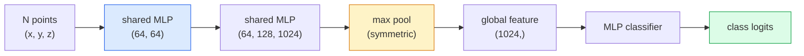

# 视觉3D 点云和NeRFs

> 3D视觉有两个种类:点云是传感器的原始输出.NeRF是学习的体积场.

> **【中文解读】**3D视觉有两种范式:点云是传感器 (LiDAR、深度相机) 的原始输出;NeRF(神经辐射场) 是学习的体积场――两者都在回答"什么在空间的哪个位置"――NeRF 通过神经网络学习场景的3D表示,可以从任何角度染染真实图像――

> **【拓展：3D 视觉的应用】**尼尔夫用于虚拟现实/增强现实 (VR/AR) 建筑可视化、自动驾驶场景重建──3D高斯人分光 (Gaussian Splating) 下一课) 是尼尔夫的快速替代方案,实时染质更高──点云处理是自动驾驶的LiDAR感知的核心──

**Type:** Learn + Build | **类型:** 学习 + 动手
**Languages:** Python | **语言:** Python
**Prerequisites:** Phase 4 Lesson 03 (CNNs), Phase 1 Lesson 12 (Tensor Operations) | **前置知识:** Phase 4 Lesson 03（CNN），Phase 1 Lesson 12（张量运算）
**Time:** ~45 minutes | **时间:** ~45 分钟

## 学习目标

- 区分明确的3D表示 (点云,网格,语xel) 和隐含的3D表示 (签署距离场,NeRF)
- 了解PointNet的对称函数技巧,使神经网络的变量变异在一个无序的点组上
- 追踪NeRF前进传输:射线造,体积造,位置编码,MLP密度+颜色头
- 使用`nerfstudio`或`instant-ngp`预训练式3D重建从一组小的姿势图像

> **【中文解读】**学习目标列出了课程完成后应掌握的核心能力.建议在开始学习前先浏览目标,学习完后对照检查是否已实现.


## 问题 问题引入

摄像头产生2D图像.LIDAR产生一组无序的3D点.一个结构-从动作管道产生稀疏的3D键点云.NeRF从少数姿势图像中重建整个3D场景.所有这些都是"视觉",但它们都看起来没有像CNN想要的密集子.

> 相机产生2D图像──LiDAR 产生一组无序的3D点──运动恢复结构流水线产生稀疏的3D 关键点云──NeRF从几张姿势图像重建整个3D场景──这些都是"视觉",但没有一个看起来像CNN 想要的密集张量──

3D视觉很重要,因为几乎每一个具有高价值的机器人任务都在3D中运行:抓住,避免障碍,导航,AR封闭,捕获3D内容.只了解2D图像的视觉工程师被锁定在最快增长的领域 (AR/VR内容,机器人,自动驾驶堆,基于NeRF的房地产或建筑的3D重建).

> 3D视觉很重要,因为几乎每个高价值机器任务都在3D中运行:抓取,避难,导航,AR遮,3D内容捕获.

两个表示以不同的原因占主导地位.点云是传感器免费提供的东西.NeRF和其继任者 (3D高斯的光,神经SDF) 是你要求神经网络学习一个场景时得到的东西.

> 两种表示因不同原因占据主导──点云是传感器免费给你──NeRF 及其后者(3D 高斯、神经SDF) 是当你让神经网络学习场景时得到的──

## 概念的核心概念

> **【中文解读】**本节介绍核心概念和理论基础.掌握这些概念是后续动手实现的前提,同时也是面试和工程实践中高频考察的知识点.


### 点云

点云是R^3中的 N点的无序集合,可选每个点都有特征 (颜色,强度,正常).

> 点云是中 R^3 中 N 个点的无序集合,每个点可带有特征 (颜色,强度,法线)

```
cloud = [
  (x1, y1, z1, r1, g1, b1),
  (x2, y2, z2, r2, g2, b2),
  ...
  (xN, yN, zN, rN, gN, bN),
]
```

两个特性使神经网络难以实现:

> 没有网格,没有连接关系.

- **Permutation invariance**输出不得依赖点顺序.
  翻译: 中文**置换不变性**输出不能依赖点的顺序.
- **Variable N**单个模型必须处理不同尺寸的云.
  翻译: 中文**可变 N**单一模型必须处理不同大小的点云.

PointNet (Qi et al., 2017) 通过一个想法解决了这两个问题:将共享MLP应用于每个点,然后用对称函数 (最大积分组) 进行聚合.结果是一个不依赖顺序的固定尺寸向量.

> 通过一个想法解决了两个问题:对每个点应用共享MLP,然后使用对称函数 (最大池化) 聚合.

```
f(P) = max_{p in P} MLP(p)
```

这就是PointNet的核心.更深层次的变体 (PointNet++,Point Transformer) 增加了层次性样本和本地聚合,但对称函数技巧没有改变.

> 这就是PointNet的全部核心.更深层次的变体 (PointNet++、Point Transformer) 增加了层次采样和局部聚合,但对称函数技巧不变.

### 点网架构



"共享MLP"是指每个点均独立运行相同的MLP. 实现为效率的点维度1x1 conv.

> "共享MLP"意味着一个MLP在每个点上独立运行,以提高效率,实现在点维度上的1x1卷积.

### 神经辐射场 (Neural Radiance Fields)

根据N照片的数据,我们可以重新构建一个3D场景吗?`(x, y, z, viewing_direction)`为了`(density, colour)`通过网络进行光线射线循环.

> 根据"N 张照片"的回答,能否从N 张照片重建3D场景?"这个问题用神经网络来表示场景本身.`(x, y, z, 观察方向)`映射到`(密度, 颜色)`染新视角就是在这个网络上做光投射循环.

```
NeRF MLP:  (x, y, z, theta, phi) -> (sigma, r, g, b)

To render a pixel (u, v) of a new view:
  1. Cast a ray from the camera through pixel (u, v)
  2. Sample points along the ray at distances t_1, t_2, ..., t_N
  3. Query the MLP at each point
  4. Composite the colours weighted by (1 - exp(-sigma * dt))
  5. The sum is the rendered pixel colour
```

输出比较了染的像素与训练照片中的地面真相像素.通过染步骤,后方更新了MLP.没有3D地面真相,没有明确的几何学.

> 损失函数比较染像和训练照片中的真实像素──通过染步骤的反向传播更新MLP──没有3D真值,没有显式几何场景存储在MLP权重中──

### 在 NeRF 中定位编码

尼拉的.`(x, y, z)`由于MLP偏向于低频率,因此不能代表高频率细节.NeRF通过在MLP之前将每个坐标编码为Fourier特征向量来解决这一问题:

> 常规的MLP在`(x, y, z)`上不能表示高频细节,因为MLP频谱偏向低频.

```
gamma(p) = (sin(2^0 pi p), cos(2^0 pi p), sin(2^1 pi p), cos(2^1 pi p), ...)
```

转换器使用的方法是相同的,并且在扩散时间调节中再次出现 (课 10).没有它,NeRF看起来模糊.

> 最多的L=10个频率级别――这与变压器使用位置技巧相同,也再次出现扩散模型的时间条件化中 ((第10课) ─没有它,NeRF看起来模糊──

### 量度表现

```
C(r) = sum_i T_i * (1 - exp(-sigma_i * delta_i)) * c_i

T_i  = exp(- sum_{j<i} sigma_j * delta_j)
delta_i = t_{i+1} - t_i
```

`T_i`传输率是多少光存活到点i.`(1 - exp(-sigma_i * delta_i))`是点i的度.`c_i`最后一个像素是沿光线的重量总数.

> `T_i`透射率到第一个点时光线留多少.`(1 - exp(-sigma_i * delta_i))`,我认为这是一个问题.`c_i`颜色.最终的像素是光线的加权和.

### 什么替代了NeRF

纯 NeRF 训练速度慢 (小时) 和染速度慢 (每张图片的秒).

> 纯 NeRF 训练慢(小时级) 且染慢(每张图像秒级) ⋅后续发展:

- **Instant-NGP**(2022) 哈希网编码取代了MLP的位置输入;列车在秒钟内.
  翻译: 中文**Instant-NGP**哈希网格编码替代MLP的位置输入;秒级训练──
- **Mip-NeRF 360**处理无限场景和反化.
  翻译: 中文**Mip-NeRF 360**处理无界场景和抗.
- **3D Gaussian Splatting**将数百万的3D高斯人取代了体积领域;列车在几分钟内,实时染.目前的生产默认.
  翻译: 中文**3D 高斯泼溅**使用数百万的3D高斯替代体积场;分钟级训练,实时染;;当前生产默认方案;;

几乎2026年每一个真正的NeRF产品都是3D高斯的光.

> 2026年,几乎所有真正的NeRF产品实际上都是3D高斯.

### 数据集和基准

- **ShapeNet** 3D CAD模型的分类和分类为点云.
  中文翻译:ShapeNet3D CAD模型的点云分类和分割──
- **ScanNet**实在的室内扫描,以进行分类.
  中文翻译:扫描网,用于分化.
- **KITTI**自动驾驶的户外LIDAR点云.
  中文翻译:KITTI户外 LiDAR 点云,用于自动驾驶。
- **NeRF Synthetic**现在,**Blended MVS** 视图合成的呈现图像数据集.
  中文翻译:NeRF合成/混合MVS带位姿的图像数据集,用于视角合成。
- **Mip-NeRF 360**无限的真实场景.
  中文翻译:Mip-NeRF 360 数据集无界真实场景──

> **【中文解读】**本节通过代码实现从零到核心算法――这种"从零开始"的方式可以帮助理解框架背后的原理,遇到问题时不会被黑盒困住――

> **【拓展：工业部署中的视觉系统】**在实际工业部署中,视觉模型需要考虑推迟模型大小的边缘设备适应等问题.

> **【拓展：数据标注与质量】**视觉任务的效果高度依赖标签数据质量――标签工作室、CVAT是主流标签工具――在工业场景中,主动学习(主动学习) 可以减少标签成本:模型对不确定的样本请求人工标签,确定性的样本自动标签――


## 建立它,实现它.
```figure
nerf-rays
```

## 建立它

### 步骤1:PointNet分类器

```python
import torch
import torch.nn as nn

class PointNet(nn.Module):
    def __init__(self, num_classes=10):
        super().__init__()
        self.mlp1 = nn.Sequential(
            nn.Conv1d(3, 64, 1),    nn.BatchNorm1d(64),   nn.ReLU(inplace=True),
            nn.Conv1d(64, 64, 1),   nn.BatchNorm1d(64),   nn.ReLU(inplace=True),
        )
        self.mlp2 = nn.Sequential(
            nn.Conv1d(64, 128, 1),  nn.BatchNorm1d(128),  nn.ReLU(inplace=True),
            nn.Conv1d(128, 1024, 1), nn.BatchNorm1d(1024), nn.ReLU(inplace=True),
        )
        self.head = nn.Sequential(
            nn.Linear(1024, 512),   nn.BatchNorm1d(512),  nn.ReLU(inplace=True),
            nn.Dropout(0.3),
            nn.Linear(512, 256),    nn.BatchNorm1d(256),  nn.ReLU(inplace=True),
            nn.Dropout(0.3),
            nn.Linear(256, num_classes),
        )

    def forward(self, x):
        # x: (N, 3, num_points) — transposed for Conv1d
        x = self.mlp1(x)
        x = self.mlp2(x)
        x = torch.max(x, dim=-1)[0]       # (N, 1024)
        return self.head(x)

pts = torch.randn(4, 3, 1024)
net = PointNet(num_classes=10)
print(f"output: {net(pts).shape}")
print(f"params: {sum(p.numel() for p in net.parameters()):,}")
```

运行在每云1024点.

> 约有1.60万参数.

### 步骤2: 位置编码

```python
def positional_encoding(x, L=10):
    """
    x: (..., D) -> (..., D * 2 * L)
    """
    freqs = 2.0 ** torch.arange(L, dtype=x.dtype, device=x.device)
    args = x.unsqueeze(-1) * freqs * 3.141592653589793
    sinc = torch.cat([args.sin(), args.cos()], dim=-1)
    return sinc.reshape(*x.shape[:-1], -1)

x = torch.randn(5, 3)
y = positional_encoding(x, L=10)
print(f"input:  {x.shape}")
print(f"encoded: {y.shape}     # (5, 60)")
```

乘以`2^l * pi`它们的频率会逐渐提高.

> 乘以`2^l * pi`产生逐步升高的频率――

### 步骤3:小 NeRF MLP

```python
class TinyNeRF(nn.Module):
    def __init__(self, L_pos=10, L_dir=4, hidden=128):
        super().__init__()
        self.L_pos = L_pos
        self.L_dir = L_dir
        pos_dim = 3 * 2 * L_pos
        dir_dim = 3 * 2 * L_dir
        self.trunk = nn.Sequential(
            nn.Linear(pos_dim, hidden), nn.ReLU(inplace=True),
            nn.Linear(hidden, hidden),  nn.ReLU(inplace=True),
            nn.Linear(hidden, hidden),  nn.ReLU(inplace=True),
            nn.Linear(hidden, hidden),  nn.ReLU(inplace=True),
        )
        self.sigma = nn.Linear(hidden, 1)
        self.color = nn.Sequential(
            nn.Linear(hidden + dir_dim, hidden // 2), nn.ReLU(inplace=True),
            nn.Linear(hidden // 2, 3), nn.Sigmoid(),
        )

    def forward(self, x, d):
        x_enc = positional_encoding(x, self.L_pos)
        d_enc = positional_encoding(d, self.L_dir)
        h = self.trunk(x_enc)
        sigma = torch.relu(self.sigma(h)).squeeze(-1)
        rgb = self.color(torch.cat([h, d_enc], dim=-1))
        return sigma, rgb

nerf = TinyNeRF()
x = torch.randn(128, 3)
d = torch.randn(128, 3)
s, c = nerf(x, d)
print(f"sigma: {s.shape}   rgb: {c.shape}")
```

与原始NeRF相比较小 (具有2个深度8MLP干).足以展示建筑.

> 与原始NeRF (原始NeRF) 相比较较小,有2个深度为8的MLP主体.

### 步骤4:沿光线进行体积成像

```python
def volumetric_render(sigma, rgb, t_vals):
    """
    sigma: (..., N_samples)
    rgb:   (..., N_samples, 3)
    t_vals: (N_samples,) distances along the ray
    """
    delta = torch.cat([t_vals[1:] - t_vals[:-1], torch.full_like(t_vals[:1], 1e10)])
    alpha = 1.0 - torch.exp(-sigma * delta)
    trans = torch.cumprod(torch.cat([torch.ones_like(alpha[..., :1]), 1.0 - alpha + 1e-10], dim=-1), dim=-1)[..., :-1]
    weights = alpha * trans
    rendered = (weights.unsqueeze(-1) * rgb).sum(dim=-2)
    depth = (weights * t_vals).sum(dim=-1)
    return rendered, depth, weights


N = 64
t_vals = torch.linspace(2.0, 6.0, N)
sigma = torch.rand(N) * 0.5
rgb = torch.rand(N, 3)
rendered, depth, weights = volumetric_render(sigma, rgb, t_vals)
print(f"rendered colour: {rendered.tolist()}")
print(f"depth:           {depth.item():.2f}")
```

> **【中文解读】**本节展示了如何使用成熟框架 (如PyTorch、HuggingFace等) 快速应用该技术.


一个光线,64个样本,复合到一个RGB像素和深度.

> 一条光线,64个采样点,合成一个RGB像素和深度值.


> **【拓展：视觉模型的持续学习】**在生产环境中,视觉模型需要不断适应新数据. 持续学习. 持续学习. 技术可以防止模型在适应新数据时忘记旧知识.

## 用它实现框架

为了真正的工作:

- `nerfstudio`目前的NeRF/Instant-NGP/Gaussian Splatting参考库.命令行加上网页浏览器.
- `pytorch3d`可分化染,点云工具,网页操作.
- `open3d`点云处理,注册,可视化.

> **【中文解读】**本节关注如何将模型部署为可用的产品. 从原型到生产级系统需要考虑性能优化,错误处理,监控等多个维度.


对于部署,3D高斯式光器已大大取代纯 NeRF,因为它使其速度快100倍.重建质量可比较.


## 运送它.

这一课产生了:

> **【中文解读】**练习题按照易/中/难 三个难度递进;;建议至少完成中级题,Hard级适合深入研究或面试准备;;


- `outputs/prompt-3d-task-router.md`基于任务和输入数据,一个提示将其引导到正确的3D表示 (点云,网格,语音,NeRF,高斯)
- `outputs/skill-point-cloud-loader.md`写PyTorch的技能`Dataset`对于 .ply / .pcd / .xyz文件,正常的标准化,中心化和点样本.

## 练习题

1. **(Easy)**显示PointNet是变量不变的:运行相同的云两次,一次是混合点. 检查输出均等到浮点噪音.
2. **(Medium)**实现最小射线生成函数,鉴于相机内在性和姿势,为每一个H x W图像的像素产生射线起源和方向.
3. **(Hard)**训练一个TinyNeRF在合成数据集上呈现色立方体的视图 (通过可分化呈现或简单的射线追踪器生成).报告在1,10和100期的呈现损失.该模型在哪个时代产生可识别的视图?

> **【中文解读】**在团队协作中,统一术语定义可以避免大量沟通误解.


## 关键词 快速查找表

| Term | What people say | What it actually means |
|------|----------------|----------------------|
| Point cloud | "3D points from LIDAR" | Unordered set of (x, y, z) + optional features per point |
| PointNet | "First neural net on point clouds" | Shared MLP per point + symmetric (max) pool; permutation-invariant by construction |
| NeRF | "MLP that is the scene" | Network mapping (x, y, z, dir) to (density, colour); rendered by ray casting |
| Positional encoding | "Fourier features" | Encode each coordinate into sin/cos at multiple frequencies to overcome MLP low-frequency bias |
| Volumetric rendering | "Ray integration" | Composite samples along a ray into a single pixel using transmittance and alpha |
| Instant-NGP | "Hash-grid NeRF" | Replaces NeRF's coordinate MLP with a multi-resolution hash grid; 100-1000x faster |
| 3D Gaussian splatting | "Millions of Gaussians" | Scene = collection of 3D Gaussians; renders in real time, trains in minutes |
| SDF | "Signed distance field" | Function returning signed distance to the nearest surface; another implicit representation |

> **【中文解读】**延伸阅读提供了深入学习的高质量资源. 这些论文和教程是该领域的经典参考文献,适合需要深入了解的读者.


## 继续阅读 继续阅读

- [PointNet (Qi et al., 2017)](https://arxiv.org/abs/1612.00593)变量变量分类器
- [NeRF (Mildenhall et al., 2020)](https://arxiv.org/abs/2003.08934)使3D复制照片成为神经网络问题
- [Instant-NGP (Müller et al., 2022)](https://arxiv.org/abs/2201.05989)哈希网,加快1000倍
- [3D Gaussian Splatting (Kerbl et al., 2023)](https://arxiv.org/abs/2308.04079)在生产中取代NeRF的架构
