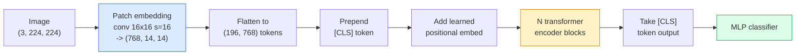

# 视觉变换器 (ViT)

> 切割图像成补丁,把每一个补丁当作一个词,运行一个标准的变压器.

> **【中文解读】**将图像切成小块 (补丁),把每个补丁当作一个"词",然后使用标准变压器处理.

> **【拓展：ViT 与 GPT-4V】**维特是GPT-4V、Claude的视觉能力、LLaVA等多模态大模型的视觉编码器──从2021年到今天,维特已成为计算机视觉的基础架构,用于CLIP、SAM、DINO等核心模型──维特的补丁嵌入思想也启动了视频变压器和多模态模型的设计──

**Type:** Build | **类型:** 动手
**Languages:** Python | **语言:** Python
**Prerequisites:** Phase 7 Lesson 02 (Self-Attention), Phase 4 Lesson 04 (Image Classification) | **前置知识:** Phase 7 Lesson 02（自注意力），Phase 4 Lesson 04（图像分类）
**Time:** ~45 minutes | **时间:** ~45 分钟

## 学习目标

- 从零开始实现补丁嵌入,学习定位嵌入,类代币和变压器编码区块,以构建最小的ViT
- 解释为什么ViT被认为需要大量的预训数据,直到DeiT和MAE证明相反
- 根据其建筑前 (没有,本地窗口关注,体脊柱) 进行ViT,Swin和ConvNeXt的比较
- 通过使用小数据集进行预训练的 ViT 细调`timm`和标准的线性探测/细调配方

> **【中文解读】**学习目标列出了课程完成后应掌握的核心能力.建议在开始学习前先浏览目标,学习完后对照检查是否已实现.


## 问题 问题引入

十年来,卷积是计算机视觉的代号.CNN具有强大的诱导偏见,地方性,翻译等差,没有人认为可以取代.然后,Dosovitskiy等人 (2020) 表明,在平坦的图像补丁上应用的平凡变压器,没有卷积机械,可以匹配或击败规模上的最佳CNN.

> 十年来,卷积就是计算机视觉的代名词――CNN有很强的归纳偏移性,局部性,平移等变性没人认为你可以替代――然后多索维茨基等 (2020) 展示了将普通的变形器应用于展平的图像块,完全不需要卷积机制,就能在大规模上匹配或击败最好的CNN――

像网-1k的 ViT 输给了ResNet. 维特在ImagenNet-21k或JFT-300M上预训练,然后在ImagenNet-1k上调整, 结果是,变压器缺乏有用的前例,但可以从足够的数据中学习它们. 随后的研究 (DeiT,MAE,DINO) 显示,通过正确的训练配方,强大的增强,自我监督的预训练,蒸,

> 陷是"大规模上"――ViT在ImageNet-1k上输送ResNet――在ImageNet-21k或JFT-300M上预训练然后在ImageNet-1k上微调的ViT赢得了――结论是变压器 缺乏有用的先验但可以从足够的数据中学到――后续工作(DeiT、MAE、DINO) 表明,使用正确的训练方案强强强、自监测预训练、蒸ViT在小数据上也可以训练很好――

到2026年,纯CNN仍然在边缘设备上竞争力较高 (ConvNeXt是最强),但变压器占据所有其他领域的地位:分区 (Mask2Former, SegFormer),检测 (DETR,RT-DETR),多模 (CLIP,SigLIP),视频 (VideoMAE,VJEPA).

> 到2026年,纯CNN在边缘设备上仍然有竞争力,但变压器统治了其他一切:分类,检测,检测,检测,检测,检测,检测,检测,检测,检测,检测,检测,检测,检测,检测,检测,检测,检测,检测,检测,检测,检测,检测,检测,检测,检测,检测,检测,检测,检测,检测,检测,检测,检测,检测,检测,检测,检测,检测,检测,检测,检测,检测,检测,检测,检测,检测,检测,检测,检测,检测,检测,视频,检测,检测,检测,检测,检测,检测,检测,检测,检测,检测,检测,检测,检测,检测,检测,检测,检测,检测,检测,检测,检测,检测,检测,检测,检测,检测,检测,检测,检测,检测,检测,检测,检测,检测,检测,检测,检测,检测,检测,检测,检测,检测,检测,检测,检测,检测,检测,检测,检测,检测,检测,检查,检查,检查,检查,检查,检查,检查,检查,检查,检查,检查,检查,检查,检查,检查.

## 概念的核心概念

> **【中文解读】**本节介绍核心概念和理论基础.掌握这些概念是后续动手实现的前提,同时也是面试和工程实践中高频考察的知识点.


### 管道



七步.补丁 -> 代币 -> 注意 -> 分类器.每个变体 (DeiT,Swin,ConvNeXt,MAE预训练) 改变了其中一个或两个,而剩下的只剩下.

> 七步──补丁 -> 标志 -> 注意力 -> 分类器──每个变体(DeiT、Swin、ConvNeXt、MAE 预训练) 只改变七步中的一两步,其余保持不变──

### 补丁嵌入

第一个 conv 是秘密. 核心尺寸 16,步骤 16,所以一个 224x224 图像变成一个 14x14 格格由 16x16 补丁,每个投影到 768 寸嵌入式.

> 第一个卷是秘密所在──核大小 16,步幅 16,所以224x224的图像变成了14x14的16x16补丁网格,每个补丁投影为768维嵌入──这一个卷同时完成分块和线性投影──

```
Input:  (3, 224, 224)
Conv (3 -> 768, k=16, s=16, no padding):
Output: (768, 14, 14)
Flatten spatial: (196, 768)
```

196个补丁 = 196个代币.每个代币的特征尺寸为768 (ViT-B),1024 (ViT-L) 或1280 (ViT-H).

> 符号的特征维度为 768 个

### 类代币

单个学习向量预pendiated到序列:

> 一个可学习的向量添加到序列前面:

```
tokens = [CLS; patch_1; patch_2; ...; patch_196]   shape (197, 768)
```

后N变压器块,`[CLS]`排序头只读出这个一个向量.

> 经过N 个变压器块后,`[CLS]`输出是全局图像表示. 分类头条只读取这个向量.

### 位置嵌入

变形器没有内置的空间位置概念.

> 变压器没有内置的空间位置概念.给每个代币加一个可学习的向量:

```
tokens = tokens + learned_pos_embedding   (also shape (197, 768))
```

嵌入是模型的参数;基于梯度的训练将其适应2D图像结构.存在双向二维替代方案,但在实践中很少被使用.

> 嵌入是模型的参数;基于梯度的训练使其适应2D图像结构.

### 变压器编码器块

标准,多头自觉注意,MLP,残留连接,前层规范.

> 标准结构──多头自注意力、MLP、残差连接、前置 LayerNorm──

```
x = x + MSA(LN(x))
x = x + MLP(LN(x))

MLP is two-layer with GELU: Linear(d -> 4d) -> GELU -> Linear(4d -> d)
```

维特-B/16堆了12个块,每个块都有12个注意头,总共为86M参数.

> 维特-B/16 堆积了12个这样的块,每个块都有12个注意力头,共8600万参数.

### 为什么在LN之前

后LN使用的早期变压器 (`x = LN(x + sublayer(x))`经过6-8层的训练,没有加热.`x = x + sublayer(LN(x))`任何ViT和现代LLM都使用LN前.

> 早期变压器 使用后置 LN(`x = LN(x + sublayer(x))`很难在没有预热的情况下训练超过6-8层――前置 LN(`x = x + sublayer(LN(x))`)无需预热即可稳定训练更深的网络――每个VT 和每个现代LLM都使用前置LN――

### 补丁尺寸交易

- 标准的16×16补丁 -> 196个代币.
  中文翻译:16x16 补丁 -> 196 个代币,标准配置──
- 快速但分辨率较低的代币.
  中文翻译:32x32 补丁 -> 49 个标志,更快但分辨率更低.
- 八倍八倍的补丁 -> 784个代币,更细,但注意力成本的比例很差.
  中文翻译:8x8 补丁 -> 784 个代币,更精细但O(n^2) 注意力成本严重增长了。

较大的补丁 = 较少的代币 = 快速但空间细节较少.SwinV2 在等级窗口中使用4×4补丁.

> 更大的补丁 = 更少的代币 = 更快但空间细节更少──SwinV2 在层次化窗口中使用4x4补丁──

### 戴特在ImagenNet-1k上训练ViT的食谱

为了击败CNN,原始ViT需要JFT-300M. DeiT (Touvron等人,2020) 通过四项变化,仅在ImageNet-1k上将ViT-B培训到81.8%的前位:

> 首先,VIT需要JFT-300M才能击败CNN――DeiT(Touvron等,2020) 只用四项改进就在ImageNet-1k 上将VIT-B训练到81.8%的前:

1. 强大的增强:随机增强,混合,切割混合,随机删除.
   中文翻译:强数据增强:随机增长、混合、切割混合、随机删除──
2. 炼时随机放下整个块.
   中文翻译:随机深度(训练时随机丢弃整个块) 』
3. 复制增强 (每批量采样3次相同的图像).
   中文翻译:重复增强(同一图像在每个批中采样 3 次) 』
4. 美国广播公司教师的蒸 (可选,进一步提高准确性).
   中文翻译:从CNN教师模型蒸(可选,进一步提升精度)

每个现代的ViT训练配方都是来自 DeiT.

> 每个现代的ViT训练方案都源于DeiT.

### 斯文 VS 康文

- **Swin**基于窗户的关注.每个块都在一个本地窗口内参加;交替的块将窗口移动,以混合窗口中的信息.同时保留注意力操作员.
  翻译: 中文**Swin**基于窗户的注意力. 每块都在局部窗户内注意力. 换个块移动窗户以跨窗口混合信息.
- **ConvNeXt**重新设计了CNN,与斯文的建筑选择相匹配 (深度,LayerNorm,GELU,倒瓶). 显示,差距不是"注意力与曲"而是"现代训练配方 +建筑".
  翻译: 中文**ConvNeXt**重塑了CNN,匹配了Swin的架构选择, 重塑了CNN的架构选择, 重塑了Swin的架构, 重塑了Swin的架构, 重塑了Swin的架构, 重塑了Swin的架构, 重塑了Swin的架构, 重塑了Swin的架构, 重塑了Swin的架构, 重塑了Swin的架构, 重塑了Swin的架构, 重塑了Swin的架构, 重塑了Swin的架构, 重塑了Swin的架构, 重塑了Swin的架构, 重塑了Swin的架构, 重塑了Swin的架构, 重塑了Swin的架构.

2026年,ConvNeXt-V2和Swin-V2都在生产级; 选择的选择取决于你的推断堆 (ConvNeXt更好地编译了边缘) 和预训练体.

> 2026年,ConvNeXt-V2 和 Swin-V2 都是生产级方案;正确选择取决于推理

### 预训练

面具自动编码器 (He et al., 2022):随机掩盖75%的补丁,训练编码器处理可见的25%,训练一个小的解码器重建从编码器输出的掩盖补丁.

> 掩码自编码器 (他等,2022):随机掩盖75%的补丁,训练编码器只处理可见的25%,训练一个小解码器从编码器输出重建被掩盖的补丁.

通过MAE,ViT可以仅仅在ImageNet-1k上进行训练,打到SOTA,并且是目前默认的自主监督配方.

> 通过图像网-1k上可训练,达到SOTA,是当前默认的自监训练方案.

> **【中文解读】**本节通过代码实现从零到核心算法――这种"从零开始"的方式可以帮助理解框架背后的原理,遇到问题时不会被黑盒困住――

> **【拓展：工业部署中的视觉系统】**在实际工业部署中,视觉模型需要考虑推迟模型大小的边缘设备适应等问题.

> **【拓展：数据标注与质量】**视觉任务的效果高度依赖标签数据质量――标签工作室、CVAT是主流标签工具――在工业场景中,主动学习(主动学习) 可以减少标签成本:模型对不确定的样本请求人工标签,确定性的样本自动标签――


## 建立它,实现它.
```figure
batchnorm-inference
```

## 建立它

### 步骤1: 补丁嵌入

```python
import torch
import torch.nn as nn

class PatchEmbedding(nn.Module):
    def __init__(self, in_channels=3, patch_size=16, dim=192, image_size=64):
        super().__init__()
        assert image_size % patch_size == 0
        self.proj = nn.Conv2d(in_channels, dim, kernel_size=patch_size, stride=patch_size)
        num_patches = (image_size // patch_size) ** 2
        self.num_patches = num_patches

    def forward(self, x):
        x = self.proj(x)
        return x.flatten(2).transpose(1, 2)
```

一个 conv,一个平,一个转换. 这就是整个图像到代码的步骤.

> 一卷积 一展平 一转置. 这就是图像到标志的全部步骤.

### 步骤2:变压器块

预LN,多头自觉,GELU的MLP,残留连接.

> 现在,我们已经开始了.

```python
class Block(nn.Module):
    def __init__(self, dim, num_heads, mlp_ratio=4, dropout=0.0):
        super().__init__()
        self.ln1 = nn.LayerNorm(dim)
        self.attn = nn.MultiheadAttention(dim, num_heads, dropout=dropout, batch_first=True)
        self.ln2 = nn.LayerNorm(dim)
        self.mlp = nn.Sequential(
            nn.Linear(dim, dim * mlp_ratio),
            nn.GELU(),
            nn.Dropout(dropout),
            nn.Linear(dim * mlp_ratio, dim),
            nn.Dropout(dropout),
        )

    def forward(self, x):
        a, _ = self.attn(self.ln1(x), self.ln1(x), self.ln1(x), need_weights=False)
        x = x + a
        x = x + self.mlp(self.ln2(x))
        return x
```

`nn.MultiheadAttention`处理分成头,缩小点产品和输出投影.`batch_first=True`所以形状是`(N, seq, dim)`现在,我们要去.

> `nn.MultiheadAttention`处理多头拆分,缩放点积和输出投影.`batch_first=True`形状为`(N, seq, dim)`,我知道.

### 步骤3: 维特

```python
class ViT(nn.Module):
    def __init__(self, image_size=64, patch_size=16, in_channels=3,
                 num_classes=10, dim=192, depth=6, num_heads=3, mlp_ratio=4):
        super().__init__()
        self.patch = PatchEmbedding(in_channels, patch_size, dim, image_size)
        num_patches = self.patch.num_patches
        self.cls_token = nn.Parameter(torch.zeros(1, 1, dim))
        self.pos_embed = nn.Parameter(torch.zeros(1, num_patches + 1, dim))
        self.blocks = nn.ModuleList([
            Block(dim, num_heads, mlp_ratio) for _ in range(depth)
        ])
        self.ln = nn.LayerNorm(dim)
        self.head = nn.Linear(dim, num_classes)
        nn.init.trunc_normal_(self.pos_embed, std=0.02)
        nn.init.trunc_normal_(self.cls_token, std=0.02)

    def forward(self, x):
        x = self.patch(x)
        cls = self.cls_token.expand(x.size(0), -1, -1)
        x = torch.cat([cls, x], dim=1)
        x = x + self.pos_embed
        for blk in self.blocks:
            x = blk(x)
        x = self.ln(x[:, 0])
        return self.head(x)

vit = ViT(image_size=64, patch_size=16, num_classes=10, dim=192, depth=6, num_heads=3)
x = torch.randn(2, 3, 64, 64)
print(f"output: {vit(x).shape}")
print(f"params: {sum(p.numel() for p in vit.parameters()):,}")
```

实际 ViT-B 是86M;同类定义为`dim=768, depth=12, num_heads=12`现在,我们要去.

> 实际的VIT-B有8600万参数;同样的类型定义,只需要`dim=768, depth=12, num_heads=12`,我知道.

### 步骤4: 智力检查 单个图像推断

```python
logits = vit(torch.randn(1, 3, 64, 64))
print(f"logits: {logits}")
print(f"probs:  {logits.softmax(-1)}")
```

> **【中文解读】**本节展示了如何使用成熟框架 (如PyTorch、HuggingFace等) 快速应用该技术.


运行没有错误.

> 应无错运行――概率之和为1――


> **【拓展：视觉模型的持续学习】**在生产环境中,视觉模型需要不断适应新数据. 持续学习. 持续学习. 技术可以防止模型在适应新数据时忘记旧知识.

## 用它实现框架

`timm`通过ImageNet预训练的重量,

```python
import timm

model = timm.create_model("vit_base_patch16_224", pretrained=True, num_classes=10)
```

`timm`支持 ViT, DeiT, Swin, Swin-V2, ConvNeXt, ConvNeXt-V2, MaxViT, MViT, EfficientFormer,以及其他数十个在同一API下.

对于多模式工作 (图像+文字),`transformers`它们中的图像编码器是ViT变体.

> **【中文解读】**本节关注如何将模型部署为可用的产品. 从原型到生产级系统需要考虑性能优化,错误处理,监控等多个维度.


## 运送它.

这一课产生了:

- `outputs/prompt-vit-vs-cnn-picker.md`一个提示,根据数据集尺寸,计算和推断堆,选择一个ViT,一个ConvNeXt或一个Swin.
- `outputs/skill-vit-patch-and-pos-embed-inspector.md`验证VIT的补丁嵌入和定位嵌入形状与模型预期的序列长度相匹配的技能,捕获最常见的移植错误.

> **【中文解读】**练习题按照易/中/难 三个难度递进;;建议至少完成中级题,Hard级适合深入研究或面试准备;;


## 练习题

1. **(Easy)**印出每一个中间子的形状,以通过上面的微小VIT进行前进.`(N, 3, 64, 64)`-> 补丁`(N, 16, 192)`-> 与CLS`(N, 17, 192)`-> 分类器输入`(N, 192)`-> 输出`(N, num_classes)`现在,我们要去.
2. **(Medium)**调整一个预训练的`timm`根据同样的数据进行比较,对ResNet-18细调进行比较. 报告训练时间和最终准确性.
3. **(Hard)**实施MAE预训练对微型ViT:掩盖75%的补丁,训练编码器+一个小的解码器重建掩盖补丁.评估在预训练前和后的合成数据线性探测精度.

> **【中文解读】**在团队协作中,统一术语定义可以避免大量沟通误解.


## 关键词 快速查找表

| Term | What people say | What it actually means |
|------|----------------|----------------------|
| Patch embedding | "The first conv" | A conv with kernel size = stride = patch size; turns the image into a grid of token embeddings |
| Class token | "[CLS]" | A learned vector prepended to the token sequence; its final output is the global image representation |
| Positional embedding | "Learned pos" | A learned vector added to every token so the transformer knows where each patch came from |
| Pre-LN | "LayerNorm before sublayer" | The stable transformer variant: `x + sublayer(LN(x))` instead of `LN(x + sublayer(x))` |
| Multi-head attention | "Parallel attention" | Standard transformer attention split into num_heads independent subspaces, concatenated afterwards |
| ViT-B/16 | "Base, patch 16" | The canonical size: dim=768, depth=12, heads=12, patch_size=16, image=224; ~86M params |
| DeiT | "Data-efficient ViT" | ViT trained on ImageNet-1k alone with strong augmentation; proved large pretraining datasets are not strictly required |
| MAE | "Masked autoencoder" | Self-supervised pretraining: mask 75% of patches, reconstruct; the dominant ViT pretraining recipe |

> **【中文解读】**延伸阅读提供了深入学习的高质量资源. 这些论文和教程是该领域的经典参考文献,适合需要深入了解的读者.


## 继续阅读 继续阅读

- [An Image is Worth 16x16 Words (Dosovitskiy et al., 2020)](https://arxiv.org/abs/2010.11929)VIT文件
- [DeiT: Data-efficient Image Transformers (Touvron et al., 2020)](https://arxiv.org/abs/2012.12877)如何单独在ImageNet-1k上训练ViT
- [Masked Autoencoders are Scalable Vision Learners (He et al., 2022)](https://arxiv.org/abs/2111.06377)MAE预训练
- [timm documentation](https://huggingface.co/docs/timm)您将在生产中使用的每个视觉变压器的参考
