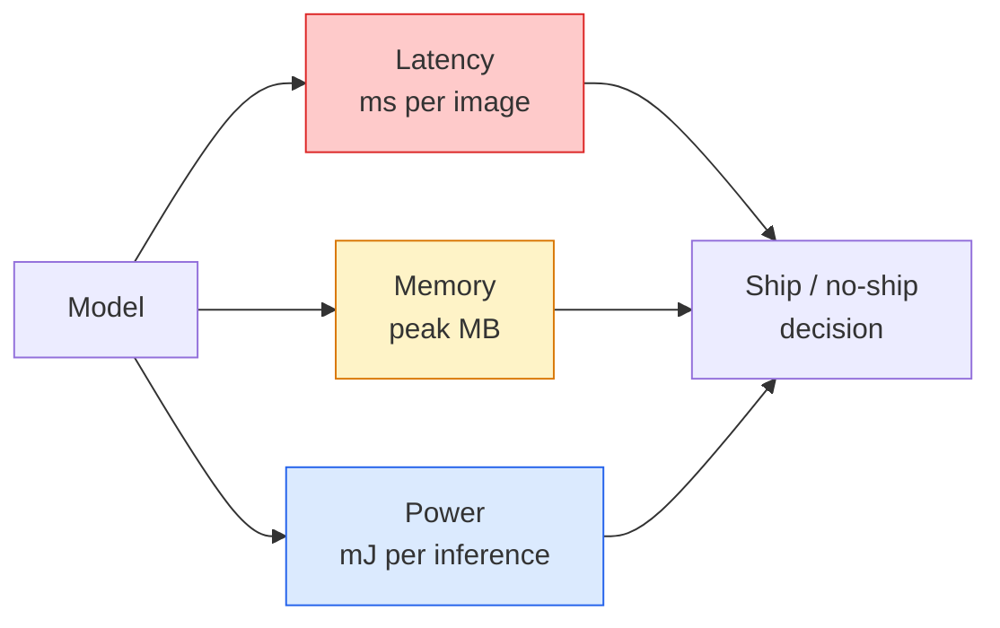

# 实时视频 边缘部署

> 边缘推断是让90度精度模型在2GB内存的设备上以30fps运行的学科.每个精度百分点都与延迟毫秒进行交易.

> **【中文解读】**边缘推理是一个平衡的艺术:让90%的准确率模型在只有2GB内存设备上运行30fps. 每个百分点的准确率都与毫秒级延迟进行交易.

> **【拓展：边缘 AI 的应用】**边缘部署在智能手机 (智能手机) 边缘部署在智能手机 (智能手机) 边缘部署在智能手机 (智能手机) 边缘部署在智能手机 (智能手机) 边缘部署在智能手机 (智能手机) 边缘部署在智能手机 (智能手机) 边缘部署在智能手机 (智能手机) 边缘部署在智能手机 (智能手机) 边缘部署在智能手机 (智能手机) 边缘部署在智能手机 (智能手机) 边缘部署在智能手机 (智能手机) 边缘部署在智能手机 (智能手机) 边缘部署在智能手机 (智能手机) 边缘部署在智能手机 (智能手机) 边缘部署在智能手机 (智能手机) 边缘部署在智能手机 (智能手机) 边缘部) 边缘部署在智能手机 (智能手机) 边缘部) 边关键的模型 (智能手机) 网络) 网络 (智能手机网络) 网络网络网络 (智能手机) 网络网络网络网络 (智能手机) 网络网络网络网络网络网络网络 (智能手机) 网络网络网络网络网络网络网络) 网络 (电话语) 网络网络网络网络网络网络 (电话语) 网络网络网络网络网络网络 (电话语)

**Type:** Learn + Build | **类型:** 学习 + 动手
**Languages:** Python | **语言:** Python
**Prerequisites:** Phase 4 Lesson 04 (Image Classification), Phase 10 Lesson 11 (Quantization) | **前置知识:** Phase 4 Lesson 04（图像分类），Phase 10 Lesson 11（量化）
**Time:** ~75 minutes | **时间:** ~75 分钟

## 学习目标

- 测量任何 PyTorch 模型的推理延迟,峰值内存和吞吐量,并阅读FLOPs / params /延迟交易
- 通过 PyTorch 的训练后量化,将视觉模型量化为 INT8 并验证精度损失 < 1%
- 输出到 ONNX,并使用 ONNX Runtime或 TensorRT编译;列出出了最常见的输出故障和它们的修复
- 解释当选择 MobileNetV3, EfficientNet-Lite, ConvNeXt-Tiny,或 MobileViT为边缘限制时

> **【中文解读】**学习目标列出了课程完成后应掌握的核心能力.建议在开始学习前先浏览目标,学习完后对照检查是否已实现.


## 问题 问题引入

训练时视觉模型是一个浮点怪物. 100M参数,每次前进传输10GFLOP,2GB的VRAM.这一切都不适合手机,汽车的信息娱乐装置,工业摄像头或无人机.运送视觉系统意味着将相同的预测纳入一个比较小的预算.

> 训练时的视觉模型是一个浮点数怪物.1.亿参数,1次前向传播10GFLOPs,2GB显存. 这些都无法装备机器,载机信息娱乐系统,工业摄像机或无人机.

基本上,这两个操作符都能通过三个按完成工作:模型选择 (一个相同的小架构),量化 (INT8而不是FP32) 和推断运行时间 (ONNX运行时间,TensorRT,Core ML,TFLite).

> 三旋做了大部分工作:模型选择(同方案的小架构) 量化(INT8 替代FP32) 和推理运行时(ONNX运行时间、TensorRT、Core ML、TFLite) 确实使用它们在工作站上运行的演示和在30美元摄像模块上交付的产品之间的区别──

首先,这个课程设置了测量纪律 (你不能优化你无法测量的东西),然后就行了三个按.目标不是学习每一个边缘运行时间,而是知道有哪些杆,以及如何验证每个杆都能按照你想象的情况.

> 本课首先建立了测量规律 (你不能优化你不能测量的东西),然后通过三个旋律.

## 概念的核心概念

> **【中文解读】**本节介绍核心概念和理论基础.掌握这些概念是后续动手实现的前提,同时也是面试和工程实践中高频考察的知识点.


### 预算的三个



- **Latency**平均只有p50隐藏了对实时系统重要的尾巴行为.
  翻译: 中文**延迟**现在,我们已经开始了一个新的过程.
- **Peak memory**机器能看到的最大值,而不是稳定状态的平均值.
  翻译: 中文**峰值内存**设备所见最大值,不是稳定的平均值.
- **Power / energy**电池驱动设备的推断量为每次毫. 通常由CPU/GPU使用时间*来代理.
  翻译: 中文**功耗/能量**电池供电设备的每次推理的毫焦数量.

边缘决定是从一个表 (模型,延迟,内存,精度) 中进行的.每个细胞都在目标设备上测量,而不是工作站.

> 一张 (模型,延迟,内存,精度) 的表格是边缘部署决策的依据.

### 测量纪律

任何边缘配置文件都应该遵循的三个规则:

> 每个边缘性能分析都应遵循以下三条规则:

1. **Warm up**模特在测量之前通过5到10个模特前面.冷缓存和JIT编译产生非代表性的第一数字.
   翻译: 中文**预热**测量前使用5-10次虚拟前向传播预热模型──冷缓存和JIT编译会产生不代表性的初始数据──
2. **Synchronise** GPU 工作负载`torch.cuda.synchronize()`没有它,你会测量内核发射,而不是内核执行.
   翻译: 中文**同步**在计时块前后使用`torch.cuda.synchronize()`同步GPU工作负载――否则你测量的是内核调度,而不是内核执行――
3. **Fix input sizes**在224x224上的延迟不是512x512的延迟.
   翻译: 中文**固定输入尺寸**使用生产分辨率──224x224 上的延迟不等于512x512 上的延迟──

### 作为代理人

基于推理的浮点操作 (FLOPs) 是一个廉价,设备独立的延迟代理.对于架构比较有用,作为绝对的墙钟误导性.一个具有10%多的FLOP的模型在实践中可以快得两倍,因为它使用硬件友好的 ops (深度控制器编译良好,大型7x7控制器没有).

> 浮点运算 (FLOPs) 是廉价的,设备无关的延迟代理标志. 它适用于架构比较,但作为绝对耗时有误导性.

规则:用于架构搜索使用FLOP,用于部署决策使用设备上的延迟.

> 法则:使用FLOP做结构搜索,使用设备上的延迟做部署决策.

### 在一个段落中定量化

替换FP32重量和激活器使用INT8.模型尺寸下降4倍,内存带宽下降4倍,计算器在具有INT8内核的硬件上下降2 - 4倍 (每个现代移动SoC,每个NVIDIA GPU带光芯).视觉任务的精度损失通常在训练后的静态定量化时为0.1-1百分点.

> 将FP32 权重和激活替换为INT8──模型大小减少4倍,内存带宽减少4倍,在有INT8 内核硬件上计算量减少2~4倍(每现代移动SoC、每带子芯的NVIDIA GPU)──视觉任务的精度损失通常为0.1-1个百分点 ((使用训练后静态量化)──

类型:

> 类型:

- **Dynamic**量子重量到INT8,在FP计算的激活.
  翻译: 中文**动态**权重量化为INT8,激活值以FP计算――简单,加速有限――
- **Static (post-training)**量子权重+校准激活范围在小型校准组上. 比动态快得多.
  翻译: 中文**静态（训练后）**量化权重 + 在小校准集上校准激活范围――比动态快得多――
- **Quantisation-aware training (QAT)**模拟训练期间的量化,使模型能够在训练中学习.
  翻译: 中文**量化感知训练（QAT）**训练时模拟量化,让模型学会适应――精度最好,需要标记数据――

视力,训练后的静态量化提供了 95%的效益,而努力的5%是可用的.

> 对于视觉任务,训练后静态量化 5% 的努力获得 95% 的收益.

### 切割和蒸

- **Pruning**消除不重要的重量 (基于大小) 或道 (结构化).对过度参数模型很好,对于已经紧的架构则不太有用.
  翻译: 中文**剪枝**移除不重要的权重 (基于幅度) 或通道 (基于结构化) 对于过参数化模型的效果好;对已经紧密的架构的使用处不大.
- **Distillation**培训一个小学生模仿一个大老师的逻辑. 往往通过缩小模型恢复了大部分丢失的精度.
  翻译: 中文**蒸馏**训练小模型 (学生) 模仿大模型 (教师) 的逻辑――通常能恢复缩小模型损失的大部分精度――生产级边缘模型的标准做法――

### 推断运行时间

- **PyTorch eager**慢,不用于部署,仅用于开发.
  翻译: 中文**PyTorch eager**慢,不用于部署.
- **TorchScript**继承者:`torch.compile`欧安的出口.
  翻译: 中文**TorchScript**遗留方案──已被`torch.compile`和 ONNX 导出取代
- **ONNX Runtime**中性运行时间. CPU,CUDA,CoreML,TensorRT,OpenVINO都拥有ONNX供应商.从这里开始.
  翻译: 中文**ONNX Runtime**中性运行时──CPU、CUDA、CoreML、TensorRT、OpenVINO 都有ONNX 提供商──从这里开始──
- **TensorRT** NVIDIA 的编译器. NVIDIA GPU (工作站和Jetson) 上最好的延迟. 集成到 ONNX 运行时间或独立.
  翻译: 中文**TensorRT**NVIDIA 的编译器──在NVIDIA GPU(工作站和Jetson) 上延迟最低──
- **Core ML**果公司的iOS/macOS运行时间.`.mlmodel`或`.mlpackage`现在,我们要去.
  翻译: 中文**Core ML**果的iOS/macOS运行时.`.mlmodel`或`.mlpackage`,我知道.
- **TFLite**谷歌对Android/ARM的运行时间.`.tflite`现在,我们要去.
  翻译: 中文**TFLite**谷歌的安卓/ARM运行时.`.tflite`,我知道.
- **OpenVINO**英特尔的CPU/VPU运行时间.`.xml`其他`.bin`现在,我们要去.
  翻译: 中文**OpenVINO**Intel 的CPU/VPU运行时――需要`.xml`其他`.bin`,我知道.

实际上:出口PyTorch -> ONNX ->选择目标运行时间. ONNX是语言.

> 实践中:导出 PyTorch -> ONNX -> 选择目标运行时──ONNX 是通用语言──

### 边缘建筑选手

| Budget | Model | Why |
|--------|-------|-----|
| < 3M params | MobileNetV3-Small | Compiles everywhere, good baseline |
| 3-10M | EfficientNet-Lite-B0 | Best accuracy per param on TFLite |
| 10-20M | ConvNeXt-Tiny | Best accuracy-per-param, CPU-friendly |
| 20-30M | MobileViT-S or EfficientViT | Transformer with ImageNet accuracy |
| 30-80M | Swin-V2-Tiny | If stack supports window attention |

只有你有特定的理由不做.

> **【中文解读】**本节通过代码实现从零到核心算法――这种"从零开始"的方式可以帮助理解框架背后的原理,遇到问题时不会被黑盒困住――

> **【拓展：工业部署中的视觉系统】**在实际工业部署中,视觉模型需要考虑推迟模型大小的边缘设备适应等问题.

> **【拓展：数据标注与质量】**视觉任务的效果高度依赖标签数据质量――标签工作室、CVAT是主流标签工具――在工业场景中,主动学习(主动学习) 可以减少标签成本:模型对不确定的样本请求人工标签,确定性的样本自动标签――


## 建立它,实现它.
```figure
cnn-param-count
```

## 建立它

### 步骤1:正确测量延迟

```python
import time
import torch

def measure_latency(model, input_shape, device="cpu", warmup=10, iters=50):
    model = model.to(device).eval()
    x = torch.randn(input_shape, device=device)
    with torch.no_grad():
        for _ in range(warmup):
            model(x)
        if device == "cuda":
            torch.cuda.synchronize()
        times = []
        for _ in range(iters):
            if device == "cuda":
                torch.cuda.synchronize()
            t0 = time.perf_counter()
            model(x)
            if device == "cuda":
                torch.cuda.synchronize()
            times.append((time.perf_counter() - t0) * 1000)
    times.sort()
    return {
        "p50_ms": times[len(times) // 2],
        "p95_ms": times[int(len(times) * 0.95)],
        "p99_ms": times[int(len(times) * 0.99)],
        "mean_ms": sum(times) / len(times),
    }
```

热,同步,使用`time.perf_counter()`报告百分比,不仅仅是恶意.

> 预热、同步、使用 `time.perf_counter()`报告百分位数,不仅仅是平均值.

### 步骤2:参数和FLOP数量

```python
def parameter_count(model):
    return sum(p.numel() for p in model.parameters())

def flops_estimate(model, input_shape):
    """
    Rough FLOP count for a conv/linear-only model. For production use `fvcore` or `ptflops`.
    """
    total = 0
    def conv_hook(m, inp, out):
        nonlocal total
        c_out, c_in, kh, kw = m.weight.shape
        h, w = out.shape[-2:]
        total += 2 * c_in * c_out * kh * kw * h * w
    def linear_hook(m, inp, out):
        nonlocal total
        total += 2 * m.in_features * m.out_features
    hooks = []
    for m in model.modules():
        if isinstance(m, torch.nn.Conv2d):
            hooks.append(m.register_forward_hook(conv_hook))
        elif isinstance(m, torch.nn.Linear):
            hooks.append(m.register_forward_hook(linear_hook))
    model.eval()
    with torch.no_grad():
        model(torch.randn(input_shape))
    for h in hooks:
        h.remove()
    return total
```

用于实际项目使用`fvcore.nn.FlopCountAnalysis`或`ptflops`它们对每个模块类型进行正确处理.

> 真实项目使用`fvcore.nn.FlopCountAnalysis`或`ptflops`它们可以正确处理每个模块类型.

### 步骤3:训练后的静态量化

```python
def quantise_ptq(model, calibration_loader, backend="x86"):
    import torch.ao.quantization as tq
    model = model.eval().cpu()
    model.qconfig = tq.get_default_qconfig(backend)
    tq.prepare(model, inplace=True)
    with torch.no_grad():
        for x, _ in calibration_loader:
            model(x)
    tq.convert(model, inplace=True)
    return model
```

设置,准备 (插入观察器),与实际数据校准,转换 (结+量化).`Conv -> BN -> ReLU`其他`ConvBnReLU`), 哪些`torch.ao.quantization.fuse_modules`子,子,子,子,子,子,子,子,子,子,子,子,子,子,子,子,子,子,子,子,子,子,子,子,子,子,子,子,子,子,子,子,子,子,子,子,子,子,子,子,子,子,子

> 三步:配置、准备(插入观察器) 、用真实数据校准、转换(融合 + 量化) ──需要模型已融合(`Conv -> BN -> ReLU`其他`ConvBnReLU`),`torch.ao.quantization.fuse_modules`处理这个问题.

### 步骤4:出口到ONNX

```python
def export_onnx(model, sample_input, path="model.onnx"):
    model = model.eval()
    torch.onnx.export(
        model,
        sample_input,
        path,
        input_names=["input"],
        output_names=["output"],
        dynamic_axes={"input": {0: "batch"}, "output": {0: "batch"}},
        opset_version=17,
    )
    return path
```

`opset_version=17`作为2026年安全违约.`dynamic_axes`让你运行ONNX模型,随意批量.

> `opset_version=17`据悉,`dynamic_axes`允许ONNX 模型以任意批量大小运行.

### 步骤5:基准和比较方案

```python
import torch.nn as nn
from torchvision.models import mobilenet_v3_small

def compare_regimes():
    model = mobilenet_v3_small(weights=None, num_classes=10)
    params = parameter_count(model)
    flops = flops_estimate(model, (1, 3, 224, 224))
    lat_fp32 = measure_latency(model, (1, 3, 224, 224), device="cpu")
    print(f"FP32 MobileNetV3-Small: {params:,} params  {flops/1e9:.2f} GFLOPs  "
          f"p50={lat_fp32['p50_ms']:.2f}ms  p95={lat_fp32['p95_ms']:.2f}ms")
```

运行相同的函数`resnet50`现在`efficientnet_v2_s`其他`convnext_tiny`您需要的比较表,

> 对于`resnet50`,我知道.`efficientnet_v2_s`和 `convnext_tiny`运行相同的函数,你就得到了部署决策所需的比率表.

> **【中文解读】**本节展示了如何使用成熟框架 (如PyTorch、HuggingFace等) 快速应用该技术.


> **【拓展：视觉模型的持续学习】**在生产环境中,视觉模型需要不断适应新数据. 持续学习. 持续学习. 技术可以防止模型在适应新数据时忘记旧知识.

## 用它实现框架

生产堆在三个路径之一上相汇聚:

- **Web / serverless**简单,适合大多数人.
- **NVIDIA edge (Jetson, GPU server)**讯器RT,最好的延迟,最大的工程努力.
- **Mobile**根据"中文版"的定义,在"中文版"中,

> **【中文解读】**本节关注如何将模型部署为可用的产品. 从原型到生产级系统需要考虑性能优化,错误处理,监控等多个维度.


用于测量`torch-tb-profiler`现在`nvprof`现在,`nsys`它们是基于 MacOS 的工具,`benchmark_app`果和果`trtexec`给出独立的CLI号码.


## 运送它.

> **【中文解读】**练习题按照易/中/难 三个难度递进;;建议至少完成中级题,Hard级适合深入研究或面试准备;;


这一课产生了:

- `outputs/prompt-edge-deployment-planner.md`一个提示,选择了脊柱,定量化策略和运行时间,给定了目标设备和延迟SLA.
- `outputs/skill-latency-profiler.md`写完整的延迟标记脚本,加热,同步,百分比和记忆跟踪.

## 练习题

1. **(Easy)**测量p50延迟`resnet18`现在`mobilenet_v3_small`现在`efficientnet_v2_s`其他`convnext_tiny`报告表,确定哪个架构具有最佳的准确度.
2. **(Medium)**应对训练后的静态量化`mobilenet_v3_small`报告FP32对INT8延迟和准确性损失在CIFAR-10或类似的延迟子集中.
3. **(Hard)**出口`convnext_tiny`运行到 ONNX `onnxruntime`随着`CPUExecutionProvider`确定ONNX运行时间更快的第一层,并解释为什么.

> **【中文解读】**在团队协作中,统一术语定义可以避免大量沟通误解.


## 关键词 快速查找表

| Term | What people say | What it actually means |
|------|----------------|----------------------|
| Latency | "How fast" | Time from input to output; p50/p95/p99 percentiles, not mean |
| FLOPs | "Model size" | Floating-point ops per forward pass; rough proxy for compute cost |
| INT8 quantisation | "8-bit" | Replace FP32 weights/activations with 8-bit integers; ~4x smaller, 2-4x faster |
| PTQ | "Post-training quantisation" | Quantise a trained model without retraining; easy, usually enough |
| QAT | "Quantisation-aware training" | Simulate quantisation during training; best accuracy, requires labelled data |
| ONNX | "The neutral format" | Model exchange format supported by every mainstream inference runtime |
| TensorRT | "NVIDIA compiler" | Compiles ONNX into an optimised engine for NVIDIA GPUs |
| Distillation | "Teacher -> student" | Train a small model to mimic a big model's logits; recovers most lost accuracy |

> **【中文解读】**延伸阅读提供了深入学习的高质量资源. 这些论文和教程是该领域的经典参考文献,适合需要深入了解的读者.


## 继续阅读 继续阅读

- [EfficientNet (Tan & Le, 2019)](https://arxiv.org/abs/1905.11946)复合扩展,以实现高效的建筑
- [MobileNetV3 (Howard et al., 2019)](https://arxiv.org/abs/1905.02244)移动首选架构,具有h-swish和squeeze-excite
- [A Practical Guide to TensorRT Optimization (NVIDIA)](https://developer.nvidia.com/blog/accelerating-model-inference-with-tensorrt-tips-and-best-practices-for-pytorch-users/)如何实际上在纸上获取吞吐量数字
- [ONNX Runtime docs](https://onnxruntime.ai/docs/)量化,图表优化,供应商选择
